# 🐧 Linux Operating System - Complete Visual Cheat Sheet

## 📑 Table of Contents
- [File System Hierarchy](#file-system-hierarchy)
- [Essential Commands](#essential-commands)
- [Process Management](#process-management)
- [User & Permission Management](#user--permission-management)
- [Package Management](#package-management)
- [Network Configuration](#network-configuration)
- [Storage & Disk Management](#storage--disk-management)
- [System Services](#system-services)
- [Performance Monitoring](#performance-monitoring)
- [Shell Scripting](#shell-scripting)
- [Security & Hardening](#security--hardening)
- [Troubleshooting](#troubleshooting)

---

## 🗂️ File System Hierarchy

### Mermaid.js FHS Diagram
```mermaid
graph TD
    ROOT[/"/"] --> BIN[/bin/]
    ROOT --> BOOT[/boot/]
    ROOT --> DEV[/dev/]
    ROOT --> ETC[/etc/]
    ROOT --> HOME[/home/]
    ROOT --> LIB[/lib/]
    ROOT --> MEDIA[/media/]
    ROOT --> MNT[/mnt/]
    ROOT --> OPT[/opt/]
    ROOT --> PROC[/proc/]
    ROOT --> ROOT[/root/]
    ROOT --> RUN[/run/]
    ROOT --> SBIN[/sbin/]
    ROOT --> SRV[/srv/]
    ROOT --> SYS[/sys/]
    ROOT --> TMP[/tmp/]
    ROOT --> USR[/usr/]
    ROOT --> VAR[/var/]
    
    USR --> USR_BIN[/usr/bin/]
    USR --> USR_LIB[/usr/lib/]
    USR --> USR_LOCAL[/usr/local/]
    USR --> USR_SHARE[/usr/share/]
    
    VAR --> VAR_LOG[/var/log/]
    VAR --> VAR_MAIL[/var/mail/]
    VAR --> VAR_TMP[/var/tmp/]
    VAR --> VAR_SPOOL[/var/spool/]
    
    ETC --> ETC_SSH[/etc/ssh/]
    ETC --> ETC_APT[/etc/apt/]
    ETC --> ETC_SYSTEMD[/etc/systemd/]
    
    style ROOT fill:#ff6b6b,stroke:#c92a2a,stroke-width:4px
    style USR fill:#4dabf7,stroke:#1971c2,stroke-width:2px
    style VAR fill:#51cf66,stroke:#2f9e44,stroke-width:2px
    style ETC fill:#ffd43b,stroke:#e67700,stroke-width:2px
```

### Directory Table

| Directory | Purpose | Example Contents |
|:---|:---|:---|
| `/bin` | Essential user commands | `ls`, `cp`, `mv`, `cat` |
| `/sbin` | System administration binaries | `fdisk`, `mkfs`, `mount` |
| `/etc` | Configuration files | `passwd`, `fstab`, `hosts` |
| `/home` | User home directories | `/home/username/` |
| `/root` | Root user home | Superuser environment |
| `/var` | Variable data | Logs, mail, spool files |
| `/tmp` | Temporary files | Cleared on reboot |
| `/usr` | User system resources | Binaries, libraries, docs |
| `/proc` | Process information (virtual) | `cpuinfo`, `meminfo` |
| `/dev` | Device files | Hard drives, terminals |

---

## 📝 Essential Commands

### Command Flowchart
```mermaid
flowchart LR
    START([Start Command]) --> TYPE{Command Type}
    
    TYPE -->|File Ops| FILE[File Operations]
    TYPE -->|Text Processing| TEXT[Text Processing]
    TYPE -->|System Info| SYS[System Info]
    TYPE -->|Compression| COMPRESS[Compression]
    
    FILE --> LS[ls -lah]
    FILE --> CP[cp -r source dest]
    FILE --> MV[mv old new]
    FILE --> RM[rm -rf dir]
    FILE --> TOUCH[touch file]
    
    TEXT --> CAT[cat file]
    TEXT --> GREP[grep pattern file]
    TEXT --> SED['sed "s/old/new/g"']
    TEXT --> AWK["awk '{print $1}'"]
    TEXT --> WC[wc -l file]
    
    SYS --> TOP[top/htop]
    SYS --> PS[ps aux]
    SYS --> DF[df -h]
    SYS --> FREE[free -h]
    SYS --> UPTIME[uptime]
    
    COMPRESS --> TAR["tar -czf archive.tar.gz dir/"]
    COMPRESS --> UNTAR["tar -xzf archive.tar.gz"]
    COMPRESS --> ZIP["zip -r archive.zip dir/"]
    COMPRESS --> UNZIP[unzip archive.zip]
    
    LS --> END([Execute])
    CP --> END
    GREP --> END
    TAR --> END
```

### Essential Commands Table

| Category | Command | Description | Example |
|:---|:---|:---|:---|
| **Navigation** | `pwd` | Print working directory | `pwd` |
| | `cd` | Change directory | `cd /var/log` |
| | `ls -la` | List all files with details | `ls -la ~/Documents` |
| | `tree` | Display directory tree | `tree -L 2 /usr` |
| **File Ops** | `cp -r` | Copy recursively | `cp -r /source /dest` |
| | `mv` | Move/rename | `mv file1.txt file2.txt` |
| | `rm -rf` | Force remove recursively | `rm -rf old_backup/` |
| | `mkdir -p` | Create parent directories | `mkdir -p a/b/c` |
| | `touch` | Create empty file/update timestamp | `touch newfile.txt` |
| **Viewing** | `cat` | Concatenate files | `cat file1 file2` |
| | `less` | Page through file | `less /var/log/syslog` |
| | `head -n 20` | First 20 lines | `head -20 access.log` |
| | `tail -f` | Follow file updates | `tail -f /var/log/messages` |
| **Text Tools** | `grep -i` | Case-insensitive search | `grep -i "error" log.txt` |
| | `sed` | Stream editor | `sed 's/foo/bar/g' input` |
| | `awk` | Pattern scanning | `awk '{print $2}' data.txt` |
| | `sort` | Sort lines | `sort -nr numbers.txt` |
| | `uniq -c` | Count unique lines | `sort file \| uniq -c` |
| | `wc -l` | Line count | `wc -l /etc/passwd` |
| **Redirection** | `>` | Redirect output (overwrite) | `echo "text" > file.txt` |
| | `>>` | Append output | `echo "more" >> file.txt` |
| | `\|` | Pipe output | `ls -la \| grep ".txt"` |
| | `2>` | Redirect stderr | `command 2> error.log` |
| | `&>` | Redirect both stdout/stderr | `cmd &> output.log` |

---

## 🔄 Process Management

### Process Lifecycle Diagram
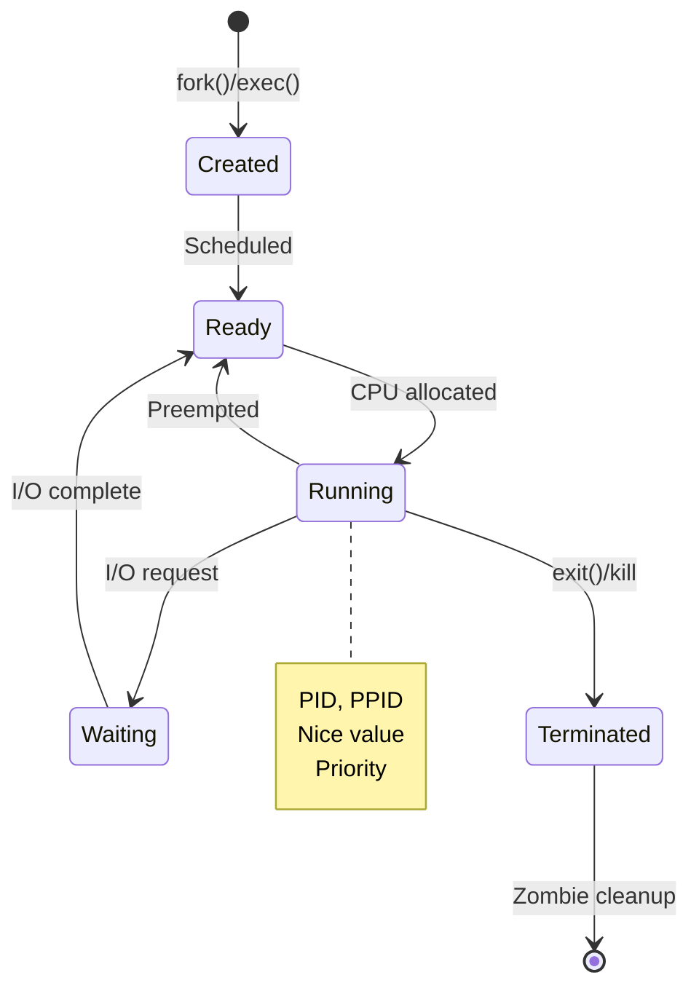

### Process Management Commands

| Command | Function | Example | Notes |
|:---|:---|:---|:---|
| `ps aux` | List all processes | `ps aux \| grep nginx` | BSD style |
| `ps -ef` | List all processes | `ps -ef \| grep python` | System V style |
| `top` | Interactive process viewer | `top` | Press `q` to quit |
| `htop` | Enhanced interactive viewer | `htop` | Colorful, mouse support |
| `kill -9 PID` | Force kill process | `kill -9 1234` | SIGKILL |
| `kill -15 PID` | Graceful terminate | `kill -15 1234` | SIGTERM (default) |
| `killall` | Kill by name | `killall chrome` | All matching processes |
| `pkill` | Pattern kill | `pkill -f "python script.py"` | Regex support |
| `nice -n 10` | Set priority (-20 to 19) | `nice -n 10 ./process` | Lower number = higher priority |
| `renice` | Change running priority | `renice 15 -p 1234` | Adjust existing process |
| `jobs` | List background jobs | `jobs -l` | Shows job numbers |
| `bg` | Background a job | `bg %1` | Resume job in background |
| `fg` | Foreground a job | `fg %1` | Bring to foreground |
| `&` | Run in background | `command &` | Add `&` at end |
| `nohup` | Ignore HUP signal | `nohup command &` | Survives logout |
| `screen` | Terminal multiplexer | `screen -S session` | Detach with `Ctrl+A D` |
| `tmux` | Advanced multiplexer | `tmux new -s session` | More features |
| `systemd-cgls` | Show cgroups | `systemd-cgls` | Container view |
| `lsof` | List open files | `lsof -i :80` | Find process using port |

### Process Tree Visualization
```mermaid
graph TD
    INIT[init/systemd - PID 1] --> KTHREADD[kthreadd - PID 2]
    INIT --> SYSTEMD[systemd-journald]
    INIT --> SYSTEMD_LOGIND[systemd-logind]
    INIT --> CROND[crond - cron daemon]
    INIT --> SSHD[sshd - SSH daemon]
    
    SSHD --> SSHD_SESSION[sshd: user@pts/0]
    SSHD_SESSION --> BASH[bash - PID 1234]
    BASH --> CHILD1[child process 1]
    BASH --> CHILD2[child process 2]
    BASH --> CHILD3[child process 3]
    
    SYSTEMD --> USER_1000[user@1000.service]
    USER_1000 --> GNOME[gnome-shell]
    GNOME --> FIREFOX[firefox]
    FIREFOX --> WEB_CONTENT[Web Content]
    
    style INIT fill:#fa5252,stroke:#c92a2a,stroke-width:4px
    style BASH fill:#4dabf7,stroke:#1864ab,stroke-width:2px
    style SSHD fill:#51cf66,stroke:#2b8a3e,stroke-width:2px
```

---

## 👥 User & Permission Management

### Permission Structure Matrix
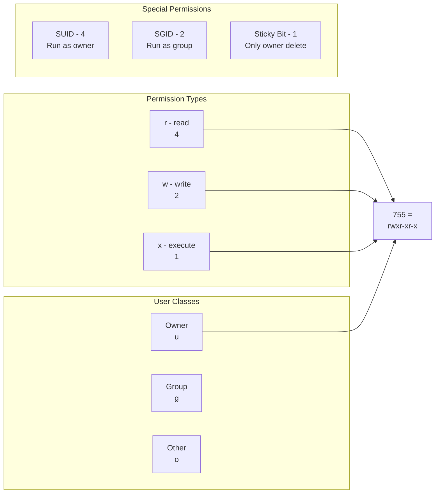

### User Management Commands

| Command | Description | Example |
|:---|:---|:---|
| `useradd` | Create user | `sudo useradd -m -s /bin/bash john` |
| `userdel` | Delete user | `sudo userdel -r john` |
| `usermod` | Modify user | `sudo usermod -aG sudo john` |
| `passwd` | Change password | `sudo passwd john` |
| `groupadd` | Create group | `sudo groupadd developers` |
| `groupdel` | Delete group | `sudo groupdel developers` |
| `groups` | Show user groups | `groups john` |
| `id` | Show user/group IDs | `id john` |
| `who` | Logged in users | `who -a` |
| `w` | Who's doing what | `w` |
| `last` | Login history | `last -10` |
| `lastb` | Failed logins | `sudo lastb` |
| `chown` | Change owner | `sudo chown john:users file.txt` |
| `chgrp` | Change group | `sudo chgrp developers file.txt` |
| `chmod` | Change mode | `chmod 755 script.sh` |
| `umask` | Default permissions | `umask 022` |
| `sudo` | Execute as another user | `sudo -u john command` |
| `visudo` | Edit sudoers safely | `sudo visudo` |

### Permission Examples

| Octal | Symbolic | Meaning |
|:---|:---|:---|
| `755` | `rwxr-xr-x` | Owner: rwx, Group: r-x, Other: r-x |
| `644` | `rw-r--r--` | Owner: rw, Group: r, Other: r |
| `700` | `rwx------` | Only owner has all permissions |
| `777` | `rwxrwxrwx` | Everyone has all (insecure) |
| `4755` | `rwsr-xr-x` | SUID bit set (run as file owner) |
| `2755` | `rwxr-sr-x` | SGID bit set (run as group) |
| `1777` | `rwxrwxrwt` | Sticky bit (only owner can delete) |

**Chmod Symbolic Examples:**
```bash
chmod u+x file.sh        # Add execute for owner
chmod g-w file.txt       # Remove write for group
chmod o+r data.txt       # Add read for others
chmod a+x script.py      # Add execute for all (a = all)
chmod -R 755 directory/  # Recursive change
```

---

## 📦 Package Management

### Package Manager Flow
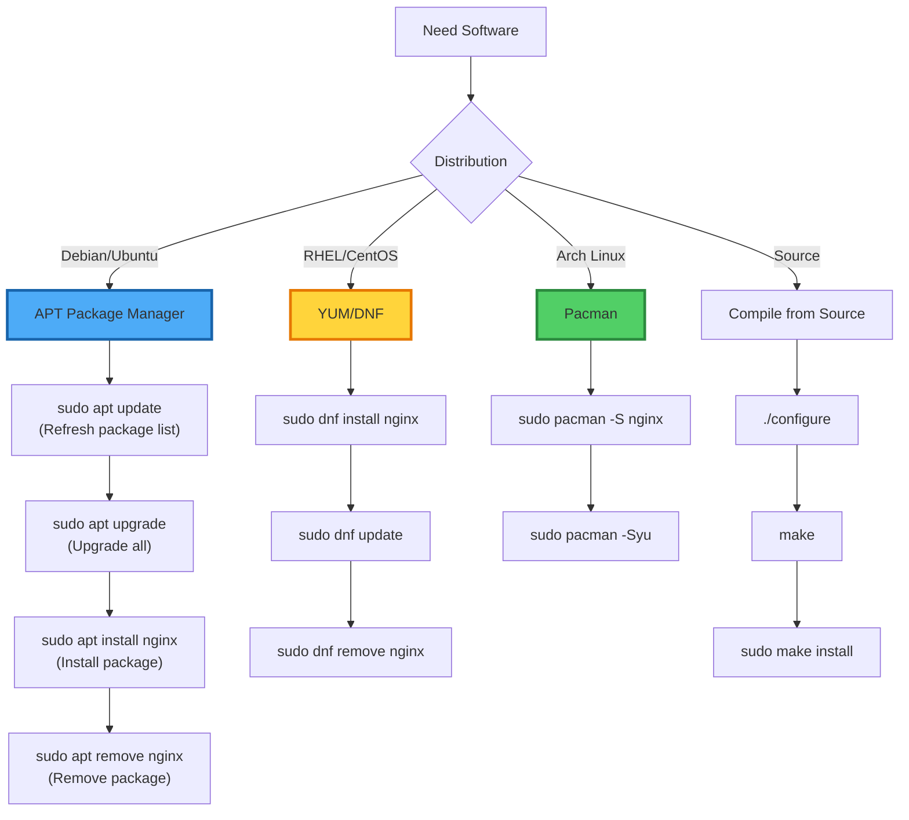

### Distribution-Specific Commands

| Action | Debian/Ubuntu (apt) | RHEL/CentOS (yum/dnf) | Arch (pacman) | OpenSUSE (zypper) |
|:---|:---|:---|:---|:---|
| **Update repos** | `sudo apt update` | `sudo dnf check-update` | `sudo pacman -Sy` | `sudo zypper refresh` |
| **Upgrade all** | `sudo apt upgrade` | `sudo dnf upgrade` | `sudo pacman -Syu` | `sudo zypper update` |
| **Install** | `sudo apt install pkg` | `sudo dnf install pkg` | `sudo pacman -S pkg` | `sudo zypper install pkg` |
| **Remove** | `sudo apt remove pkg` | `sudo dnf remove pkg` | `sudo pacman -Rs pkg` | `sudo zypper remove pkg` |
| **Search** | `apt search keyword` | `dnf search keyword` | `pacman -Ss keyword` | `zypper search keyword` |
| **Info** | `apt show pkg` | `dnf info pkg` | `pacman -Qi pkg` | `zypper info pkg` |
| **Clean cache** | `sudo apt clean` | `sudo dnf clean all` | `sudo pacman -Scc` | `sudo zypper clean` |
| **List installed** | `apt list --installed` | `dnf list installed` | `pacman -Q` | `zypper se --installed-only` |
| **Find file** | `apt-file search` | `dnf provides` | `pkgfile` | `zypper what-provides` |

### Advanced APT Examples
```bash
# Full system upgrade with auto-remove
sudo apt update && sudo apt full-upgrade -y && sudo apt autoremove -y

# Install specific version
sudo apt install package=1.2.3-4

# Hold package to prevent upgrade
sudo apt-mark hold package-name

# Unhold package
sudo apt-mark unhold package-name

# Download without installing
sudo apt download package-name

# List packages by pattern
apt list '*nginx*'

# Show changelog
apt changelog package-name

# Reinstall package
sudo apt install --reinstall package-name

# Fix broken dependencies
sudo apt --fix-broken install
```

### Building from Source Workflow
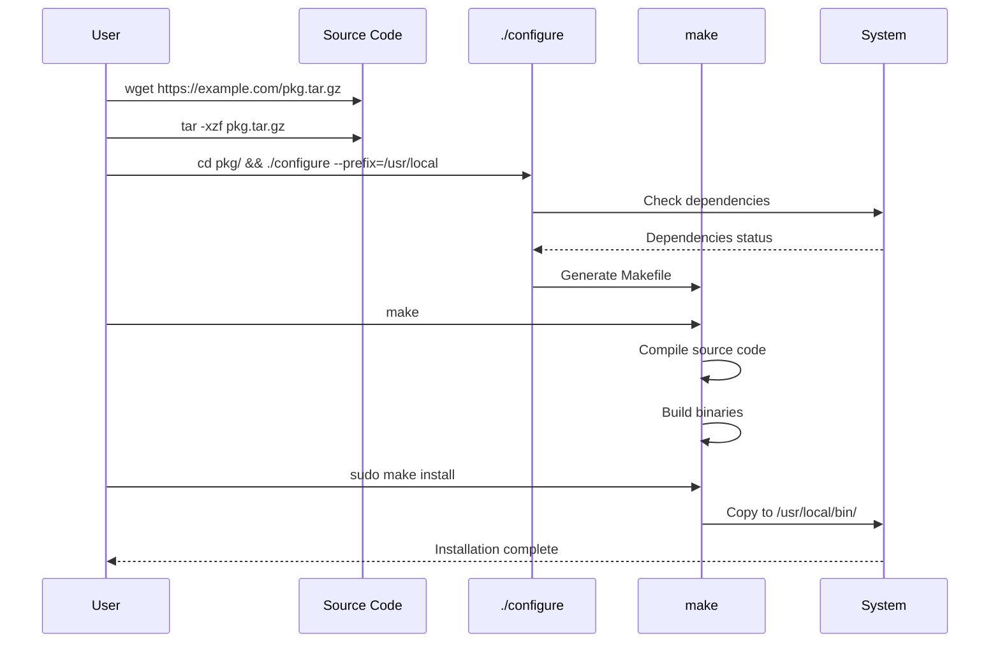

---

## 🌐 Network Configuration

### Linux Network Stack
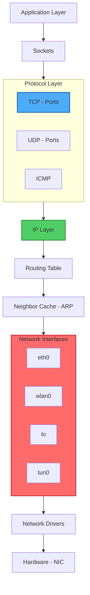

### Network Commands Reference

| Command | Function | Example | Modern Alternative |
|:---|:---|:---|:---|
| `ip addr show` | Show IP addresses | `ip a` | `ifconfig` (legacy) |
| `ip link set` | Interface control | `sudo ip link set eth0 up` | `ifup` |
| `ip route` | Routing table | `ip route add default via 192.168.1.1` | `route` |
| `ip neigh` | ARP table | `ip neigh show` | `arp -a` |
| `ss -tulnp` | Listening ports | `ss -tulnp \| grep :80` | `netstat` (legacy) |
| `ping -c 4` | ICMP echo | `ping -c 4 8.8.8.8` | Same |
| `traceroute` | Route tracing | `traceroute -n google.com` | `tracepath` |
| `mtr` | My Traceroute | `mtr --report google.com` | Combines ping/traceroute |
| `dig` | DNS lookup | `dig +short google.com` | `nslookup` |
| `host` | DNS query | `host -t MX gmail.com` | Same |
| `nslookup` | DNS resolver | `nslookup example.com 8.8.8.8` | Same |
| `curl -I` | HTTP headers | `curl -I https://example.com` | `wget --spider` |
| `wget` | Download file | `wget -r https://site.com/` | `curl -O` |
| `nc -zv` | Port scan | `nc -zv 192.168.1.1 22-80` | `nmap` |
| `tcpdump` | Packet capture | `sudo tcpdump -i eth0 -n` | `tshark` |
| `iptables -L` | Firewall rules | `sudo iptables -L -n -v` | `nftables` |
| `systemctl status networking` | Network service | `sudo systemctl status NetworkManager` | Same |
| `nmcli` | NetworkManager CLI | `nmcli device status` | Same |

### IP Addressing & CIDR
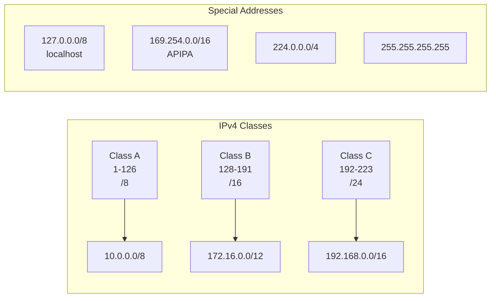

### Network Configuration Files

| File | Purpose | Example Content |
|:---|:---|:---|
| `/etc/hostname` | System hostname | `myserver.local` |
| `/etc/hosts` | Static host lookup | `192.168.1.10 db-server` |
| `/etc/resolv.conf` | DNS servers | `nameserver 8.8.8.8` |
| `/etc/nsswitch.conf` | Name resolution order | `hosts: files dns` |
| `/etc/network/interfaces` | Debian-style config | `auto eth0`<br/>`iface eth0 inet static` |
| `/etc/netplan/*.yaml` | Ubuntu netplan | YAML configuration |
| `/etc/sysconfig/network-scripts/` | RHEL configs | `ifcfg-eth0` |
| `/etc/hosts.allow` | TCP wrappers allow | `sshd: 192.168.1.0/24` |
| `/etc/hosts.deny` | TCP wrappers deny | `ALL: ALL` |

### iptables Firewall Rules
```bash
# Basic firewall structure
iptables -P INPUT DROP      # Default policy: DROP all incoming
iptables -P FORWARD DROP    # Default policy: DROP forwarded
iptables -P OUTPUT ACCEPT   # Default policy: ACCEPT outgoing

# Allow established connections
iptables -A INPUT -m conntrack --ctstate ESTABLISHED,RELATED -j ACCEPT

# Allow SSH (port 22)
iptables -A INPUT -p tcp --dport 22 -j ACCEPT

# Allow HTTP/HTTPS
iptables -A INPUT -p tcp -m multiport --dports 80,443 -j ACCEPT

# Allow loopback
iptables -A INPUT -i lo -j ACCEPT

# Save rules
sudo iptables-save > /etc/iptables/rules.v4
```

---

## 💾 Storage & Disk Management

### Linux Storage Stack
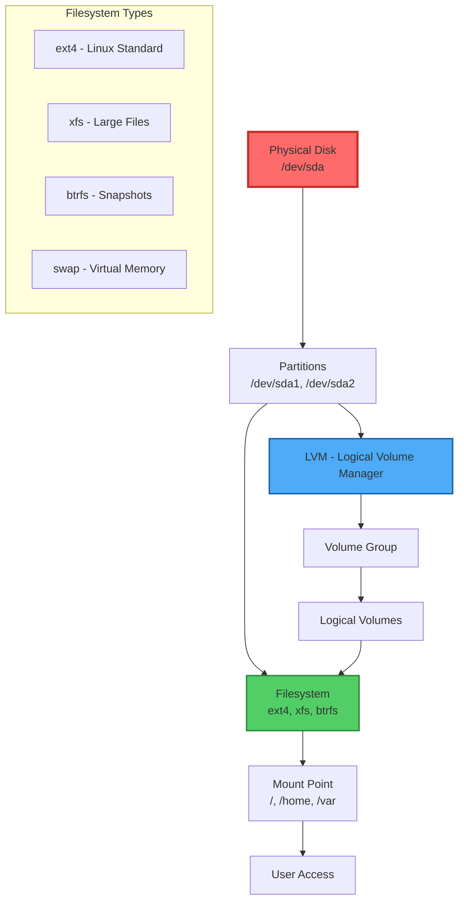

### Disk Management Commands

| Command | Description | Example |
|:---|:---|:---|
| `lsblk` | List block devices | `lsblk -f` (show filesystems) |
| `fdisk -l` | Partition table | `sudo fdisk -l /dev/sda` |
| `parted` | Advanced partitioning | `sudo parted /dev/sda print` |
| `df -h` | Disk space usage | `df -hT` (human + type) |
| `du -sh` | Directory size | `du -sh /var/* \| sort -h` |
| `mount` | Mount filesystem | `mount /dev/sdb1 /mnt/usb` |
| `umount` | Unmount | `umount /mnt/usb` |
| `blkid` | UUID/Labels | `sudo blkid` |
| `mkfs.ext4` | Create ext4 fs | `sudo mkfs.ext4 /dev/sdb1` |
| `mkswap` | Create swap | `sudo mkswap /dev/sda2` |
| `swapon` | Enable swap | `sudo swapon /dev/sda2` |
| `fsck` | Filesystem check | `sudo fsck /dev/sda1` |
| `tune2fs` | Tune ext2/3/4 | `sudo tune2fs -l /dev/sda1` |
| `smartctl` | SMART data | `sudo smartctl -a /dev/sda` |
| `dd` | Low-level copy | `dd if=/dev/sda of=backup.img` |
| `rsync -av` | Sync files | `rsync -av /source/ /dest/` |

### LVM Commands

| Phase | Command | Example |
|:---|:---|:---|
| **Physical Volume** | `pvcreate` | `sudo pvcreate /dev/sdb1` |
| | `pvdisplay` | `sudo pvdisplay` |
| | `pvs` | `pvs` (short format) |
| **Volume Group** | `vgcreate` | `sudo vgcreate vg_data /dev/sdb1` |
| | `vgextend` | `sudo vgextend vg_data /dev/sdc1` |
| | `vgdisplay` | `sudo vgdisplay vg_data` |
| **Logical Volume** | `lvcreate` | `sudo lvcreate -L 10G -n lv_home vg_data` |
| | `lvextend` | `sudo lvextend -L +5G /dev/vg_data/lv_home` |
| | `lvdisplay` | `sudo lvdisplay` |
| **Filesystem** | `resize2fs` | `sudo resize2fs /dev/vg_data/lv_home` |
| | `xfs_growfs` | `sudo xfs_growfs /mountpoint` |

### fstab Configuration
```bash
# /etc/fstab - Filesystem table
# <device>    <mountpoint>    <fs>    <options>    <dump>    <pass>

# Examples:
UUID=1234-5678  /boot           ext4    defaults        0       2
/dev/mapper/vg-root  /          ext4    defaults,noatime  0       1
//server/share   /mnt/share     cifs    credentials=/etc/smbcreds,uid=1000  0  0
tmpfs           /tmp            tmpfs   defaults,size=2G  0       0
/dev/sdb1       /mnt/backup     ext4    defaults,noauto  0       2
```

---

## ⚙️ System Services (systemd)

### systemd Architecture
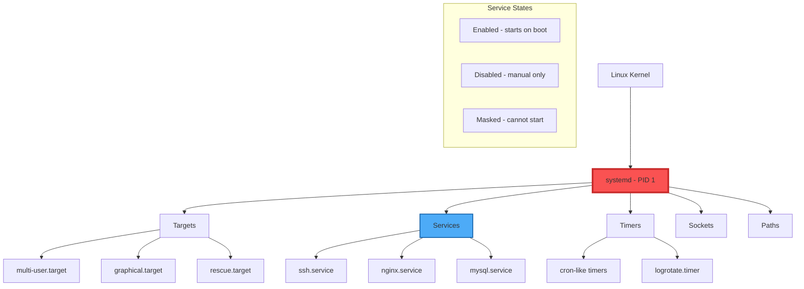

### systemctl Command Reference

| Command | Description | Example |
|:---|:---|:---|
| `systemctl start` | Start service | `sudo systemctl start nginx` |
| `systemctl stop` | Stop service | `sudo systemctl stop nginx` |
| `systemctl restart` | Restart service | `sudo systemctl restart nginx` |
| `systemctl reload` | Reload config | `sudo systemctl reload nginx` |
| `systemctl enable` | Enable at boot | `sudo systemctl enable ssh` |
| `systemctl disable` | Disable at boot | `sudo systemctl disable ssh` |
| `systemctl status` | Check status | `systemctl status sshd` |
| `systemctl is-active` | Check if running | `systemctl is-active docker` |
| `systemctl is-enabled` | Check enabled | `systemctl is-enabled docker` |
| `systemctl list-units` | List active units | `systemctl list-units --type=service` |
| `systemctl list-unit-files` | All unit files | `systemctl list-unit-files \| grep enabled` |
| `systemctl mask` | Prevent starting | `sudo systemctl mask unwanted-service` |
| `systemctl unmask` | Unmask service | `sudo systemctl unmask service` |
| `systemctl daemon-reload` | Reload systemd | `sudo systemctl daemon-reload` |
| `systemctl edit` | Edit override | `sudo systemctl edit service` |
| `systemctl cat` | Show unit file | `systemctl cat sshd.service` |

### Journalctl (Logging)

| Command | Description | Example |
|:---|:---|:---|
| `journalctl` | View all logs | `journalctl` |
| `journalctl -xe` | Show last entries | `journalctl -xe` |
| `journalctl -f` | Follow logs (tail -f) | `sudo journalctl -f` |
| `journalctl -u nginx` | Specific service | `journalctl -u nginx -n 50` |
| `journalctl --since "1 hour ago"` | Time filter | `journalctl --since yesterday` |
| `journalctl -p err` | Error priority | `journalctl -p 3` (errors) |
| `journalctl -k` | Kernel messages | `journalctl -k` |
| `journalctl -b` | Current boot | `journalctl -b -1` (previous boot) |
| `journalctl --disk-usage` | Log size | `journalctl --disk-usage` |

### Creating Custom systemd Service
```ini
# /etc/systemd/system/myapp.service
[Unit]
Description=My Custom Application
After=network.target
Requires=network.target

[Service]
Type=simple
User=myuser
Group=myuser
WorkingDirectory=/opt/myapp
ExecStart=/usr/bin/python3 /opt/myapp/app.py
Restart=on-failure
RestartSec=10
StandardOutput=journal
StandardError=journal

[Install]
WantedBy=multi-user.target
```

---

## 📊 Performance Monitoring

### System Performance Dashboard
```mermaid
gantt
    title System Performance Timeline
    dateFormat HH:mm
    axisFormat %H:%M
    
    section CPU
    User Space :cpu1, 00:00, 15m
    System Space :cpu2, after cpu1, 5m
    I/O Wait :cpu3, after cpu2, 8m
    Idle :cpu4, after cpu3, 12m
    
    section Memory
    Used Memory :mem1, 00:00, 25m
    Cached :mem2, after mem1, 10m
    Free :mem3, after mem2, 5m
    
    section Disk I/O
    Read Ops :io1, 00:05, 10m
    Write Ops :io2, 00:15, 8m
    
    section Network
    Inbound Traffic :net1, 00:00, 20m
    Outbound Traffic :net2, 00:10, 15m
```

### Performance Monitoring Tools

| Tool | Function | Command | Key Metrics |
|:---|:---|:---|:---|
| `top` | Real-time processes | `top -c` | CPU, MEM, load average |
| `htop` | Enhanced top | `htop` | Colorful, mouse support |
| `atop` | Advanced monitor | `atop` | Disk, network per process |
| `glances` | Cross-platform | `glances` | All metrics + web UI |
| `vmstat` | Virtual memory | `vmstat 2 10` | Processes, memory, swap |
| `iostat` | I/O statistics | `iostat -x 2` | Disk utilization, await |
| `mpstat` | CPU statistics | `mpstat -P ALL 2` | Per-CPU usage |
| `sar` | Historical data | `sar -u 1` | Needs sysstat package |
| `free -h` | Memory usage | `free -h` | Used, free, available |
| `df -h` | Disk usage | `df -h` | Space per filesystem |
| `du -sh` | Directory sizes | `du -sh /* 2>/dev/null` | Per-dir usage |
| `uptime` | Load average | `uptime` | 1,5,15 min averages |
| `ps aux --sort=-%cpu` | CPU usage sort | `ps aux --sort=-%cpu \| head` | Top 10 CPU processes |
| `ps aux --sort=-%mem` | Memory usage sort | `ps aux --sort=-%mem \| head` | Top 10 memory processes |
| `lsof -i` | Network connections | `sudo lsof -i -P -n` | Open ports, connections |
| `ss -tunap` | Socket stats | `ss -tunap \| grep EST` | Active TCP connections |

### Monitoring Script (Bash + Mermaid)
```bash
#!/bin/bash
# System Health Monitor with Mermaid Output

generate_mermaid() {
    CPU_USAGE=$(top -bn1 | grep "Cpu(s)" | awk '{print $2}' | cut -d'%' -f1)
    MEM_USAGE=$(free | grep Mem | awk '{printf "%.1f", $3/$2 * 100}')
    DISK_USAGE=$(df -h / | awk 'NR==2 {print $5}' | sed 's/%//')
    
    cat << EOF
%% System Health Dashboard - $(date)
%% CPU: ${CPU_USAGE}% | Memory: ${MEM_USAGE}% | Disk: ${DISK_USAGE}%

pie showData
    "CPU Usage ${CPU_USAGE}%" : ${CPU_USAGE}
    "Memory Usage ${MEM_USAGE}%" : ${MEM_USAGE}
    "Disk Usage ${DISK_USAGE}%" : ${DISK_USAGE}
end

gantt
    title Resource Usage Timeline (Last 5 mins)
    dateFormat HH:mm
    axisFormat %H:%M
    
    section CPU
    User :crit, cpu1, 00:00, 3m
    System :cpu2, after cpu1, 1m
    I/O Wait :cpu3, after cpu2, 1m
EOF
}

generate_mermaid
```

### Load Average Explained
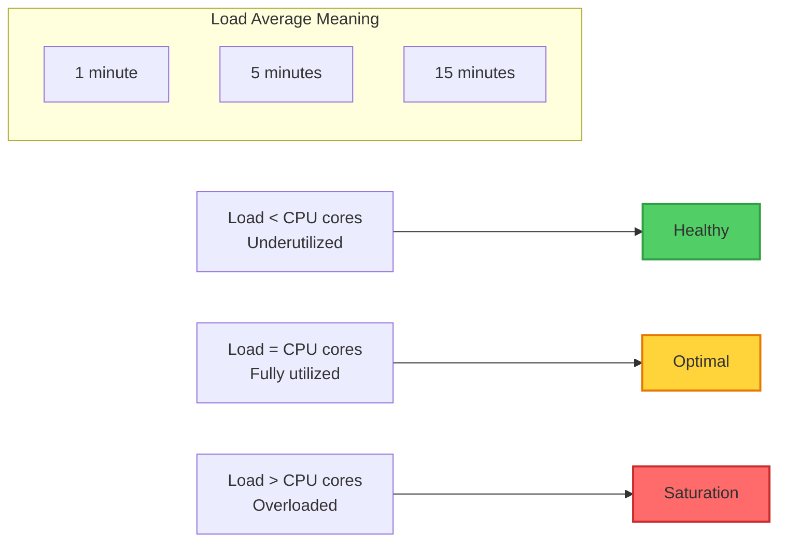

### Process States in Linux
```mermaid
stateDiagram-v2
    [*] --> R(Running - R) : CPU allocated
    R --> S(Sleeping - S) : I/O wait
    S --> R : I/O complete
    R --> D(Uninterruptible - D) : Disk I/O
    D --> R : I/O complete
    R --> T(Stopped - T) : SIGSTOP
    T --> R : SIGCONT
    R --> Z(Zombie - Z) : Parent no wait
    Z --> [*] : Parent waits/killed
    R --> [*] : Exit
```

---

## 📜 Shell Scripting

### Bash Script Structure
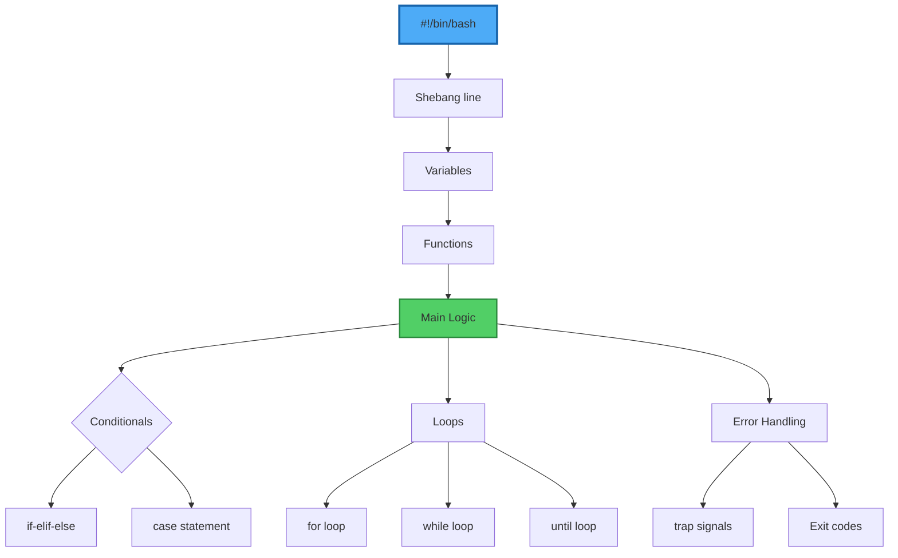

### Bash Scripting Quick Reference

| Category | Syntax | Example |
|:---|:---|:---|
| **Variables** | `VAR="value"` | `NAME="John"` |
| | Use variable | `echo $NAME` or `${NAME}` |
| | Read-only | `readonly VAR` |
| | Export | `export PATH=$PATH:/custom` |
| **Arrays** | Declare | `arr=("a" "b" "c")` |
| | Access | `echo ${arr[0]}` |
| | All elements | `echo ${arr[@]}` |
| | Length | `echo ${#arr[@]}` |
| **Conditionals** | If statement | `if [ "$VAR" == "value" ]; then` |
| | If-else | `if [ -f "$FILE" ]; then`<br/>`  echo "exists"`<br/>`else`<br/>`  echo "not found"`<br/>`fi` |
| | File tests | `-f` (file), `-d` (dir), `-x` (exec) |
| | String tests | `-z` (empty), `-n` (not empty) |
| | Numeric | `-eq` (=), `-ne` (!=), `-gt` (>), `-lt` (<) |
| **Loops** | For loop | `for i in {1..5}; do`<br/>`  echo $i`<br/>`done` |
| | For (files) | `for file in *.txt; do` |
| | While loop | `while read line; do` |
| | Until loop | `until ping -c1 google.com; do` |
| **Functions** | Define | `function greet() {`<br/>`  echo "Hello $1"`<br/>`}` |
| | Call | `greet "World"` |
| | Return | `return 0` (success) |
| **I/O** | Read input | `read -p "Enter name: " NAME` |
| | Command substitution | `NOW=$(date)` |
| | Arithmetic | `SUM=$((5 + 3))` |
| **Error Handling** | Exit codes | `exit 0` (success), `exit 1` (error) |
| | Trap signals | `trap "echo 'Exiting'" EXIT` |
| | Check last exit | `if [ $? -ne 0 ]; then` |
| **Debugging** | Debug mode | `#!/bin/bash -x` |
| | Set options | `set -e` (exit on error)<br/>`set -u` (undefined vars)<br/>`set -x` (debug) |

### Advanced Bash Script Example
```bash
#!/bin/bash
# Advanced System Backup Script with Email Notification
set -euo pipefail  # Error on failure, undefined vars, pipe failures

# Configuration
readonly SCRIPT_NAME="$(basename "$0")"
readonly BACKUP_DIR="/backups"
readonly RETENTION_DAYS=7
readonly LOG_FILE="/var/log/backup.log"
readonly EMAIL="admin@example.com"

# Color codes for output
readonly RED='\033[0;31m'
readonly GREEN='\033[0;32m'
readonly YELLOW='\033[1;33m'
readonly NC='\033[0m' # No Color

# Logging functions
log() {
    echo -e "$(date '+%Y-%m-%d %H:%M:%S') - $1" | tee -a "$LOG_FILE"
}

log_error() {
    log "${RED}ERROR: $1${NC}"
}

log_success() {
    log "${GREEN}SUCCESS: $1${NC}"
}

log_warning() {
    log "${YELLOW}WARNING: $1${NC}"
}

# Check if running as root
check_root() {
    if [[ $EUID -ne 0 ]]; then
        log_error "This script must be run as root"
        exit 1
    fi
}

# Create backup directory if not exists
ensure_backup_dir() {
    if [[ ! -d "$BACKUP_DIR" ]]; then
        mkdir -p "$BACKUP_DIR"
        log_success "Created backup directory: $BACKUP_DIR"
    fi
}

# Perform backup
do_backup() {
    local timestamp=$(date +%Y%m%d_%H%M%S)
    local backup_file="$BACKUP_DIR/backup_$timestamp.tar.gz"
    
    log "Starting backup to $backup_file"
    
    # List of directories to backup
    local dirs_to_backup="/etc /home /var/www"
    
    tar -czf "$backup_file" $dirs_to_backup 2>/dev/null
    
    if [[ $? -eq 0 ]]; then
        local size=$(du -h "$backup_file" | cut -f1)
        log_success "Backup completed successfully. Size: $size"
        
        # Create checksum
        md5sum "$backup_file" > "$backup_file.md5"
    else
        log_error "Backup failed!"
        return 1
    fi
}

# Clean old backups
cleanup_old_backups() {
    log "Cleaning backups older than $RETENTION_DAYS days"
    
    local old_files=$(find "$BACKUP_DIR" -name "backup_*.tar.gz" -type f -mtime +$RETENTION_DAYS)
    
    if [[ -n "$old_files" ]]; then
        echo "$old_files" | while read -r file; do
            rm -f "$file" "${file}.md5"
            log "Removed old backup: $(basename "$file")"
        done
    else
        log "No old backups to remove"
    fi
}

# Send notification
send_notification() {
    local status=$1
    local subject="Backup Status: $status"
    local body="Backup completed with status: $status\n\nLog file: $LOG_FILE"
    
    echo -e "$body" | mail -s "$subject" "$EMAIL"
    log "Notification sent to $EMAIL"
}

# Main execution
main() {
    log "=== Starting $SCRIPT_NAME ==="
    
    check_root
    ensure_backup_dir
    
    if do_backup; then
        cleanup_old_backups
        send_notification "SUCCESS"
        log_success "=== Script completed successfully ==="
        exit 0
    else
        send_notification "FAILED"
        log_error "=== Script failed ==="
        exit 1
    fi
}

# Run main function with error trapping
trap 'log_error "Script interrupted"; exit 1' INT TERM
main
```

---

## 🛡️ Security & Hardening

### Linux Security Layers
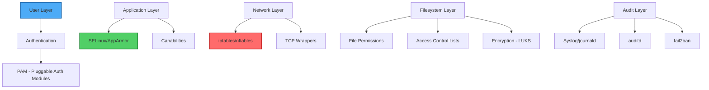

### Security Hardening Checklist

| Category | Check | Command/Verification |
|:---|:---|:---|
| **User Security** | Remove root SSH login | `sudo sed -i 's/PermitRootLogin yes/PermitRootLogin no/' /etc/ssh/sshd_config` |
| | Disable password auth (use keys) | `PasswordAuthentication no` in sshd_config |
| | Set umask 027 for users | `echo "umask 027" >> /etc/profile` |
| | Lock inactive accounts | `sudo useradd -L inactive_user` |
| **Filesystem** | Secure /tmp with nodev,nosuid | `/etc/fstab: tmpfs /tmp tmpfs defaults,noexec,nosuid,nodev 0 0` |
| | Set immutable flag on critical files | `sudo chattr +i /etc/passwd` |
| | Find SUID binaries | `find / -perm /4000 -type f 2>/dev/null` |
| | Check world-writable files | `find / -perm -0002 -type f 2>/dev/null` |
| **Network** | Disable IPv6 if unused | `net.ipv6.conf.all.disable_ipv6 = 1` in /etc/sysctl.conf |
| | Limit SSH access by IP | `AllowUsers user@192.168.1.*` in sshd_config |
| | Enable firewall | `sudo ufw enable` or configure iptables |
| **Kernel** | Disable IP forwarding | `sysctl net.ipv4.ip_forward=0` |
| | Enable ASLR | `sysctl kernel.randomize_va_space=2` |
| | Restrict kernel messages | `sysctl kernel.dmesg_restrict=1` |
| **Audit** | Install auditd | `sudo apt install auditd -y` |
| | Monitor /etc/passwd changes | `auditctl -w /etc/passwd -p wa -k passwd_changes` |
| | Track failed logins | `auditctl -w /var/log/faillog -p wa -k failed_login` |
| **Services** | Remove unused services | `systemctl list-units --type=service --state=running` |
| | Run services as non-root | Check service user: `systemctl show -p User sshd` |
| | Use systemd security directives | `PrivateTmp=true`, `NoNewPrivileges=true` |

### SELinux Cheat Sheet
```bash
# Status and modes
getenforce              # Check current mode (Enforcing/Permissive/Disabled)
setenforce 0            # Switch to permissive mode (temporarily)
setenforce 1            # Switch to enforcing mode

# Configuration
/etc/selinux/config     # Permanent configuration

# Context management
ls -Z                   # Show SELinux context
chcon -t httpd_sys_content_t /var/www/html/index.html   # Change context
restorecon -v /path/to/file        # Restore default context

# Troubleshooting
audit2why < /var/log/audit/audit.log    # Explain denial reason
audit2allow -a -M mymodule              # Generate local policy module
semodule -i mymodule.pp                 # Install module

# Booleans (toggles)
getsebool -a            # List all booleans
setsebool httpd_can_network_connect on    # Enable boolean
setsebool -P ftpd_anon_write on           # Persistent change
```

### SSH Security Configuration
```bash
# /etc/ssh/sshd_config - Secure configuration
Port 2222                          # Change from default 22
Protocol 2                         # SSH protocol 2 only
HostKey /etc/ssh/ssh_host_ed25519_key   # Use modern keys

# Authentication
PermitRootLogin no                # Never allow root login
PubkeyAuthentication yes          # Use key pairs
PasswordAuthentication no         # Disable passwords
ChallengeResponseAuthentication no
UsePAM no                         # Skip PAM if using keys
PermitEmptyPasswords no

# Access control
AllowUsers alice bob@192.168.1.*  # Specific users/hosts
DenyUsers baduser                 # Block users
AllowGroups sshusers              # Group-based access

# Security features
MaxAuthTries 3                    # 3 attempts max
MaxSessions 2                     # Limit concurrent sessions
ClientAliveInterval 300           # Disconnect idle after 5 min
ClientAliveCountMax 2
LoginGraceTime 30                 # Time to authenticate

# Disable insecure features
X11Forwarding no                  # Disable X11
AllowTcpForwarding no             # Prevent port forwarding
PermitTunnel no
```

---

## 🔧 Troubleshooting

### Troubleshooting Flowchart
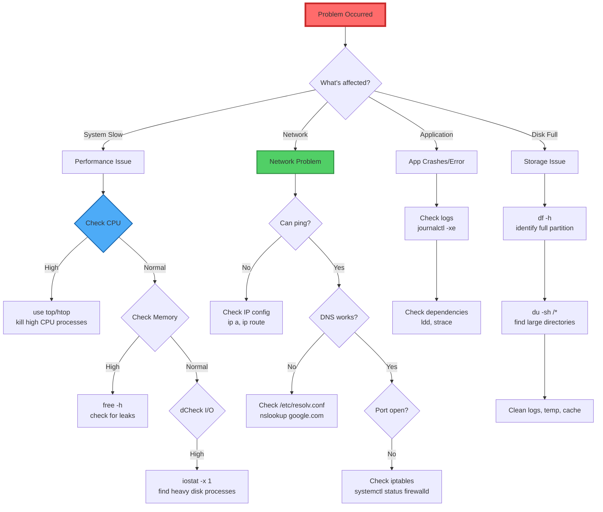

### Common Problems & Solutions

| Symptom | Likely Cause | Diagnostic Command | Solution |
|:---|:---|:---|:---|
| **"Permission denied"** | Wrong file permissions | `ls -la file` | `chmod 755 file` or `chown` |
| **"Command not found"** | Not in PATH | `which command` | Install package or use full path |
| **Cannot bind to port** | Port already in use | `ss -tulnp \| grep :8080` | Kill process or change port |
| **System out of memory** | Memory leak/overuse | `free -h && ps aux --sort=-%mem \| head` | Kill process, add swap |
| **Disk full** | No free space | `df -h && du -sh /var/log/*` | Clean logs, remove old files |
| **High load average** | CPU saturation | `top -c && mpstat -P ALL 1` | Optimize/kill processes |
| **"Read-only filesystem"** | Filesystem error | `dmesg \| tail` | `fsck` (unmount first) |
| **Cannot resolve DNS** | DNS configuration | `cat /etc/resolv.conf` | Add nameserver 8.8.8.8 |
| **SSH connection refused** | Service not running | `systemctl status ssh` | `systemctl start ssh` |
| **Slow network** | Congestion/loss | `mtr --report target.com` | Check bandwidth, MTU |
| **Process won't kill** | Zombie/uninterruptible | `ps aux \| grep Z` | Reboot or wait for I/O |
| **Cron jobs not running** | Incorrect syntax | `grep CRON /var/log/syslog` | Check PATH, permissions |

### Log Analysis Commands
```bash
# Finding errors in logs
grep -i error /var/log/syslog | tail -20
grep -i fail /var/log/auth.log
journalctl -p 3 -b  # All errors from current boot

# Monitoring in real-time
tail -f /var/log/syslog | grep --line-buffered -i error
journalctl -f -p warning

# Searching by time range
journalctl --since "2024-01-15 10:00:00" --until "2024-01-15 11:00:00"

# Specific service logs
journalctl -u mysql --since "1 hour ago" -n 100

# Kernel ring buffer
dmesg | tail -30
dmesg | grep -i "error\|fail\|warning"

# Analyze last boot
journalctl -b -1 | grep -i "failed"

# Count unique error messages
journalctl -p err | awk '{print $5}' | sort | uniq -c | sort -rn | head -10
```

---

## 🎯 Quick Reference Cards

### Keyboard Shortcuts (Bash)

| Shortcut | Function |
|:---|:---|
| `Ctrl + C` | Interrupt/Kill current process |
| `Ctrl + Z` | Suspend current process |
| `Ctrl + D` | EOF / Exit shell |
| `Ctrl + L` | Clear screen |
| `Ctrl + A` | Move to beginning of line |
| `Ctrl + E` | Move to end of line |
| `Ctrl + U` | Cut from cursor to beginning |
| `Ctrl + K` | Cut from cursor to end |
| `Ctrl + W` | Cut previous word |
| `Ctrl + Y` | Paste cut text |
| `Ctrl + R` | Reverse search history |
| `Ctrl + S` | Pause output (XOFF) |
| `Ctrl + Q` | Resume output |
| `Tab` | Autocomplete |
| `Up/Down` | Navigate history |

### Signal Handling

| Signal | Number | Default Action | Description |
|:---|:---|:---|:---|
| **SIGHUP** | 1 | Terminate | Hangup (reload config) |
| **SIGINT** | 2 | Terminate | Interrupt (Ctrl+C) |
| **SIGQUIT** | 3 | Core dump | Quit (Ctrl+\) |
| **SIGKILL** | 9 | Terminate | Kill (cannot be caught) |
| **SIGTERM** | 15 | Terminate | Termination (graceful) |
| **SIGSTOP** | 17,19,23 | Stop | Stop (cannot be caught) |
| **SIGCONT** | 18,19,25 | Continue | Continue if stopped |

### Exit Codes

| Exit Code | Meaning |
|:---|:---|
| `0` | Success |
| `1` | General error |
| `2` | Misuse of shell builtins |
| `126` | Command cannot execute |
| `127` | Command not found |
| `128` | Invalid argument to exit |
| `128+n` | Fatal error signal 'n' |
| `130` | Terminated with Ctrl+C (SIGINT) |
| `255*` | Exit status out of range |

---

## 📚 Resources & Further Learning

### Essential Documentation
- `man command` - Manual pages (e.g., `man bash`)
- `info command` - GNU info pages
- `/usr/share/doc/` - Package documentation
- `tldr command` - Community-cheatsheets (install: `sudo apt install tldr`)

### Built-in Help Commands
```bash
help              # Bash built-in commands help
command --help    # Most commands support this
whatis command    # One-line description
apropos keyword   # Search man pages by keyword
```

### Practice Challenges
- OverTheWire: Bandit (Linux fundamentals)
- Linux Journey (interactive learning)
- HackerRank Linux Shell
- TryHackMe Linux Fundamentals

---

*This cheat sheet is regularly updated. Last refresh: 2026. Bookmark and share responsibly!*

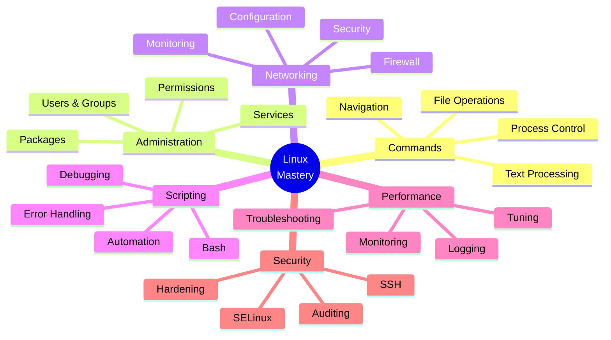
