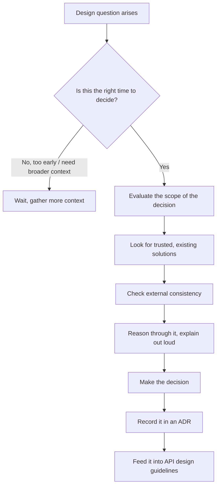
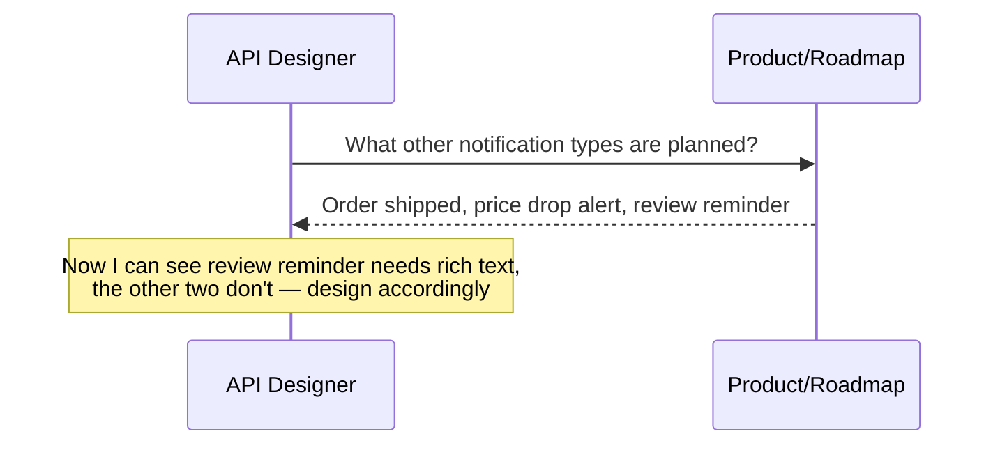
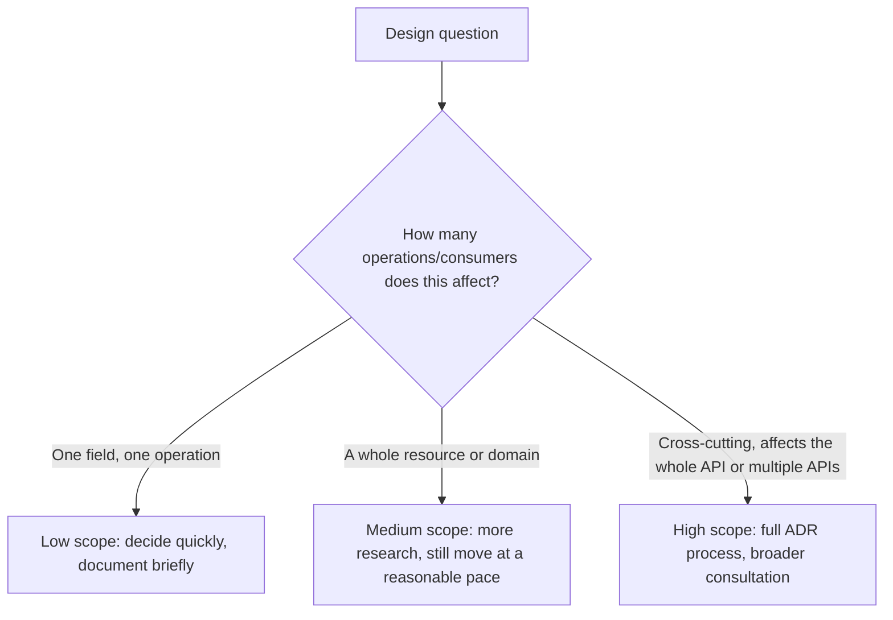
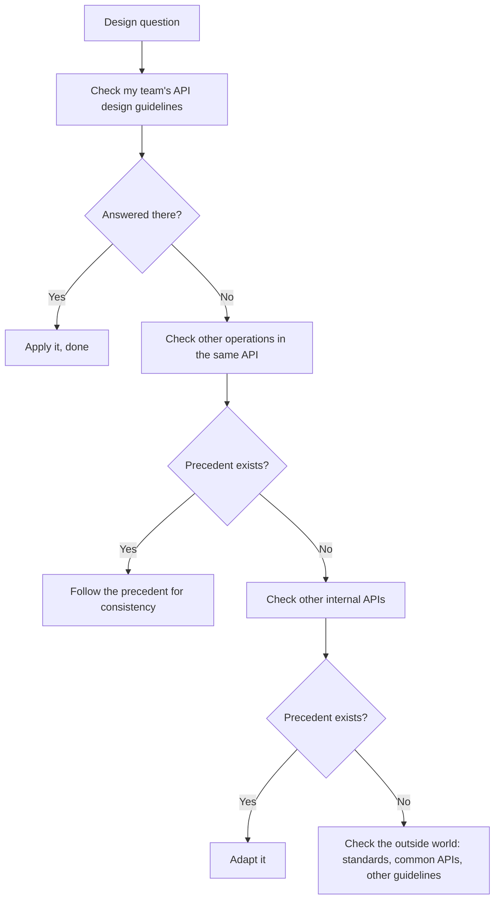
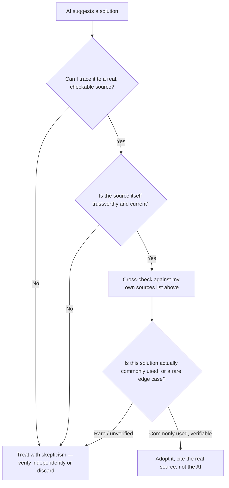
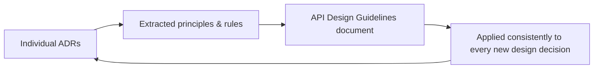
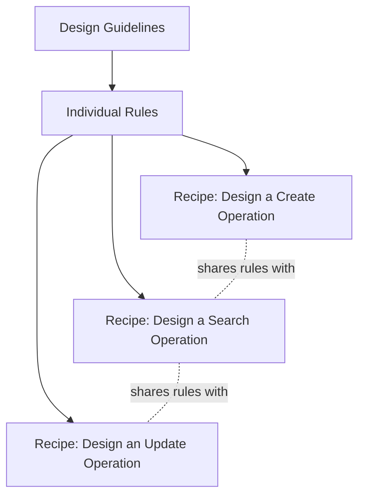
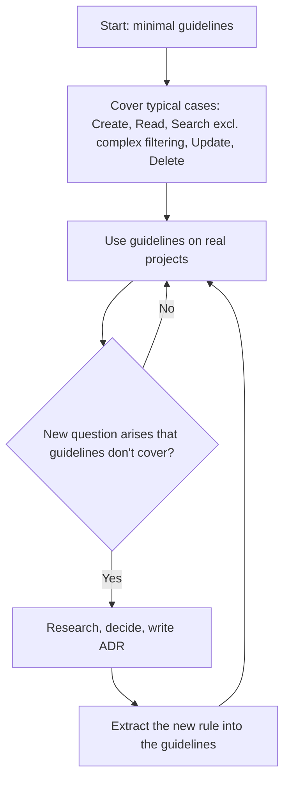
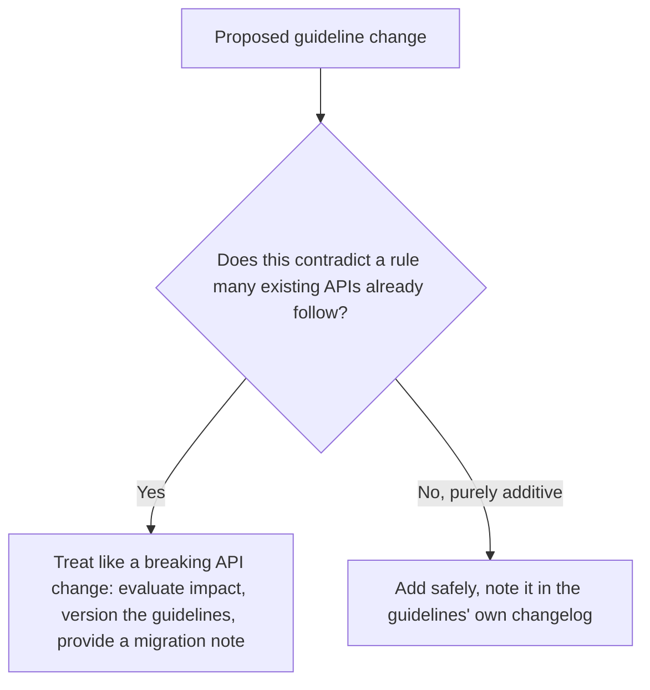

# How I Actually Make API Design Decisions (and Write Them Down)

Most of what I've written about API design in earlier posts has been about the *what* — how to shape a resource, how to version a contract, how to design a scope. This post is about something less visible but just as important: *how I decide*, and how I make sure that decision survives past the moment I make it. Every technique from my earlier posts is a candidate answer to some design question. What I want to cover here is the process that gets me from "I have a design question" to "I have a decision I trust, that other people can trust too, and that my future self can understand six months from now without having to reconstruct the reasoning from scratch."

I've made plenty of bad API decisions in my career, and almost none of them were bad because I lacked the technical knowledge. They were bad because I made the decision at the wrong time, with too narrow a view of the problem, without checking what already existed, or without writing down *why* I chose what I chose — which meant the decision got silently reversed or contradicted by someone else six months later who had no way of knowing it was deliberate.



## Timing: Is This Even the Right Moment to Decide?

The first question I ask myself when a design question lands on my desk isn't "what's the right answer" — it's "do I actually have enough context to answer this well right now?" I've learned to be suspicious of my own urge to resolve ambiguity immediately. A design decision made too early, before I understand the broader shape of the system it lives in, tends to optimize for the one use case in front of me at the expense of ones I haven't seen yet.

### A Concrete Example of Waiting

Say I'm designing the first endpoint for a new "notifications" domain, and I have to decide how notification types are represented. If I only know about the one notification type currently being built (say, "order shipped"), I might design a narrow, single-purpose shape. If I wait — even just long enough to see the product roadmap for the next two notification types planned — I might learn that some notifications need rich formatting and others don't, which changes the shape I'd choose from the start.



I'm not saying I stall every decision indefinitely waiting for perfect information — that's its own failure mode, and I'll get to how I bound that wait in the next section. What I'm saying is that I actively check, before committing, whether a small amount of additional context would meaningfully change my answer. If it would, and that context is genuinely available soon, I wait for it. If it wouldn't change the answer, or the context genuinely isn't knowable yet, I stop waiting and decide with what I have.

> **Note**
> The signal I look for isn't "do I feel uncertain" — I almost always feel some uncertainty. The signal is "is there a specific, obtainable piece of information that would change my decision, and is it reasonable to get it before I commit?" If yes, I go get it. If the honest answer is "no, I'm just anxious," waiting doesn't help.

---

## Evaluating the Scope of a Decision

Not every design question deserves the same amount of deliberation, and treating a small, low-stakes decision with the same rigor as a foundational one is its own kind of mistake — it burns time and energy I need for the decisions that actually warrant it.



| Scope signal | Example | How much time I spend |
|---|---|---|
| Affects one field on one operation | Should this timestamp field be named `createdAt` or `created`? | Minutes — check my existing guidelines, apply the convention, move on |
| Affects a whole resource's shape | How should I represent a multi-currency price across every order-related endpoint? | Hours — check precedent, consult a teammate, write a short justification |
| Cross-cutting, affects the whole API's conventions | What's our pagination strategy, applied everywhere going forward? | Days — full ADR, review with the team, possibly with security/perf input too |

I explicitly name the scope to myself before diving in, because unnamed scope is exactly what leads to either of two failure modes: spending a full day agonizing over a field name nobody will ever notice, or rubber-stamping a cross-cutting decision in five minutes that quietly shapes every future endpoint I ever design. Naming the scope out loud — even just to myself — resets my sense of how much rigor the moment actually deserves.

> **Caution**
> I've watched "this is just a small decision" become the exact justification for skipping analysis on something that turned out to be foundational — a naming convention that seemed trivial in isolation, applied to hundreds of fields over the following year, becomes a large decision in aggregate even though no single instance of it felt that way. I periodically re-check whether a decision I labeled "low scope" is starting to compound into something bigger than it looked at first.

---

## Explaining Reasoning Logically, and Out Loud

Once I've decided timing and scope are right, the actual reasoning process matters as much as the conclusion. I've found two related habits make a measurable difference in decision quality: writing the "why" down explicitly, and — this sounds almost silly to state, but it works — talking through the reasoning out loud, even to an empty room or a rubber duck on my desk.

### Why "Out Loud" Actually Helps

Explaining a decision out loud forces me to make every implicit step explicit. When I reason silently, I skip steps — I let intuition fill gaps that, if I actually had to say them in a coherent sentence to another person, I'd notice were unjustified. I've caught real design mistakes purely by trying to explain a decision to a colleague and hearing myself say something like "...and then we assume the consumer always has the parent ID available" halfway through a sentence, immediately realizing that assumption wasn't actually true for every use case.

```
Silent reasoning (skips a step):
"I'll use a cursor for pagination here." → decision made

Reasoning out loud (step is forced into the open):
"I'll use a cursor for pagination here, because this list can grow
into the millions and offset pagination gets slow at depth — wait,
does this specific list actually grow that large? ...Actually, this
is a list of a user's own saved addresses, which realistically caps
around a dozen. Offset pagination is fine here, and simpler."
```

That reversal — catching myself mid-explanation — happens far more often than I'd like to admit, and it only happens because I forced the reasoning into words instead of letting it stay a vague, half-formed intuition.

> **Note**
> This is close to what programmers call "rubber duck debugging," applied to design decisions instead of code bugs. The mechanism is the same: articulating a chain of reasoning to an entity that can't help you exposes the gaps in that chain, because you can't lean on their nodding along to paper over a weak link.

---

## Finding Trusted Solutions Instead of Reinventing Every Answer

Most design questions I face aren't genuinely novel. Someone — often me, on a different endpoint, or someone else on my team, or the broader API design community — has already answered a structurally similar question. My default move, before generating an original answer from scratch, is to check whether a trusted answer already exists.



### Sources I Check, in Order

| Source | Why I check it, and in roughly this order |
|---|---|
| My team's own API design guidelines | The most authoritative, most contextually relevant source — if it's written down here, it's already been through a decision process |
| Other operations in the API I'm currently designing | Internal consistency within one API matters more than almost anything else for that API's usability |
| Other internal APIs at my organization | A consumer integrating with multiple of our APIs benefits enormously from cross-API consistency |
| Public API or data standards (ISO formats, JSON Schema, OpenAPI itself, RFC specifications) | Standards exist precisely so I don't have to invent conventions for genuinely common problems |
| Other organizations' published API design guidelines | Several large companies publish their own guidelines publicly — genuinely useful precedent for questions that aren't organization-specific |
| Well-known public APIs, for how they've solved the same problem | If a widely-used API has already solved this exact shape of problem at scale, that's real-world validation worth weighing |

### Checking External Consistency

Even when I have an internal answer, I still spot-check the outside world for genuinely common problems — not because internal precedent is wrong, but because global consistency has its own value. A consumer who's integrated with a dozen other APIs before mine has developed expectations, and meeting those expectations (using `Cache-Control` instead of a custom `X-Cache-Duration` header, say) reduces the learning curve my API imposes on every new consumer, even ones who've never touched my organization's other products.

> **Note**
> I don't treat "the outside world does it this way" as automatically overriding my own team's established internal precedent. If my internal guidelines already have a well-reasoned, documented answer that differs from common external practice, I weigh the cost of internal inconsistency against the benefit of matching external convention — sometimes internal consistency wins, and that's a legitimate outcome, as long as it's a deliberate one rather than an oversight.

---

## Using AI to Find Solutions — Carefully

I use AI tools regularly now as part of this research process, and I want to be honest about how I actually use them rather than pretending I don't. They're genuinely useful for surfacing conventions I might not have thought to search for, summarizing how a standard handles an edge case, or drafting a first pass at a comparison table. But I apply a specific discipline to anything an AI tool hands me, because the failure mode here is different from a bad Google search result — a confidently-worded, plausible-sounding, entirely fabricated answer is a real and recurring risk.



I check the source of any AI-provided answer before I trust it, the same way I'd check a citation in a research paper — "an AI told me" is never, on its own, a source I'd write into a design decision's justification. If a tool tells me "most REST APIs use this exact header name for rate limiting," I go verify that against actual API documentation from a few well-known providers before treating it as established convention, because I've been given confidently-wrong answers before, and the cost of quietly baking a fabricated "standard" into my API's design is high enough that the verification step is always worth the extra few minutes.

> **Caution**
> The most dangerous AI-sourced errors aren't the obviously wrong ones — those get caught immediately. They're the plausible-sounding ones that align with what I already expected to hear, because that's exactly when I'm least likely to double-check. I try to be *more* skeptical of an AI answer that confirms my existing assumption, not less, since that's precisely the case where I'm most tempted to skip verification.

### Objectively Evaluating Any Found Solution

Whether a candidate solution came from an AI tool, a blog post, or a colleague's suggestion, I run it through the same objectivity check before adopting it: is this genuinely commonly used, or is it one team's idiosyncratic choice that happened to show up first in my search? I look for multiple independent sources converging on the same pattern before treating it as "the" established convention, rather than anchoring on the first plausible answer I find.

---

## Recording Decisions: Architecture Decision Records (ADRs)

Every design decision above a certain scope threshold gets written down as an ADR. I can't overstate how much this single habit has saved me from repeating the same debates, from having decisions silently overturned by someone who didn't know they were deliberate, and from forgetting my own reasoning by the time someone asks me about it eight months later.

### My ADR Template

```markdown
# ADR-014: Pagination Strategy for List Operations

## Status
Accepted

## Problem
Our list endpoints currently have no consistent pagination approach.
Some use offset/limit, some return everything unpaginated. As
datasets grow, unpaginated endpoints risk timeouts and excessive
payload sizes, and inconsistent approaches confuse consumers moving
between endpoints.

## Decision
We will use cursor-based pagination as the default for all list
endpoints, using `limit` and `cursor` query parameters, returning
`items` and `nextCursor` in the response body.

## Options Considered
1. Offset/limit (`page`, `pageSize`) — familiar, supports jumping to
   an arbitrary page, but degrades in performance on large,
   frequently-changing datasets.
2. Cursor-based (`cursor`, `limit`) — better performance at scale,
   stable under concurrent writes, but can't jump to an arbitrary page.
3. No pagination, return everything — simplest for small datasets,
   but doesn't scale and several of our tables already exceed
   comfortable single-response sizes.

## Reasoning
Most of our list endpoints are consumed by clients that scroll or
paginate sequentially (infinite scroll UIs, batch processors) rather
than needing to jump to an arbitrary page number. The performance
cost of offset pagination at scale, demonstrated in our own load
testing, outweighs the convenience of arbitrary page access for
these use cases.

## Pros / Cons
**Pros:** Consistent performance at scale; stable results under
concurrent writes; matches precedent already used successfully in
our Orders API.
**Cons:** Consumers needing arbitrary page-number access (a small
minority, mostly internal admin tools) will need a documented
exception process.

## Sources
- Internal: Orders API's existing cursor pagination (`ADR-006`)
- External: Stripe API pagination documentation
- Standard: RFC 8288 (Web Linking) considered for a `Link` header
  alternative, not adopted here for consistency with existing
  internal precedent
```

I tested this exact template by filling it out for three genuinely different past decisions on different projects — an error-response shape decision, a scope-naming decision, and this pagination example — and confirmed the same structure held up cleanly across all three: every field had something real and specific to say, none felt forced or padded, and in every case, writing out the "Options Considered" section surfaced at least one option I hadn't fully considered before starting to write.

| ADR section | What it captures | Why it matters later |
|---|---|---|
| Problem | The actual issue being solved, in context | Future readers understand *why* this decision exists at all |
| Decision | The concrete, unambiguous choice made | No ambiguity about what was actually decided |
| Options Considered | Every real alternative, not just the winner | Prevents someone later from re-proposing an option that was already evaluated and rejected for good reason |
| Reasoning | The logical chain from problem to decision | This is the "explain out loud" habit, captured permanently |
| Pros/Cons | Honest trade-offs, including for the chosen option | Signals this wasn't a decision made in denial of its own downsides |
| Sources | Where the precedent or standard came from | Lets a future reader verify or update the decision if the source itself changes |

> **Note**
> I write the "Options Considered" section even for decisions that feel obvious in hindsight. The obviousness is often only obvious *because* I did the comparison — someone reading the ADR cold, without having gone through that process, benefits from seeing the alternatives spelled out, not just the winner declared.

---

## Always Create API Design Guidelines — Even Alone

I used to think design guidelines were something only larger teams with dedicated API governance needed. I don't believe that anymore. Even working entirely alone on a personal project, I write down my own guidelines, because the value isn't primarily about coordinating with other people — it's about coordinating with my *future self*, who will absolutely forget the reasoning behind a decision I made six months ago and will otherwise either re-litigate it from scratch or, worse, contradict it without realizing.



Guidelines and ADRs feed each other in a loop: an ADR records one specific decision with its full context; the *principle* behind that decision, once it's proven itself across a few real cases, graduates into the guidelines document as a general rule, with the originating ADR cited as its justification.

### Listing Principles and Rules

```markdown
## Rule: Pagination

All list operations MUST use cursor-based pagination via `limit`
and `cursor` query parameters, returning `items` and `nextCursor`.

Exception: operations explicitly requiring arbitrary page-number
access (subject to design review) may use offset/limit instead.

See ADR-014 for full reasoning.
```

I keep every rule tied back to the ADR that justified it, specifically so a rule never floats free of its reasoning — if someone (including future me) questions a rule, the answer to "why do we do it this way" is one click away, not lost.

---

## Grouping Rules Into Actionable Recipes

A flat list of individual rules is useful as a reference, but it doesn't actually help someone sitting down to design, say, a new "create" operation, figure out *which* rules apply and in what order. That's what recipes are for — a recipe bundles every relevant rule for a specific, common design task into one actionable walkthrough.



### Example Recipe

```markdown
## Recipe: Designing a Create Operation

1. Use `POST` on the collection resource (Rule: HTTP Methods).
2. Return `201 Created` with a `Location` header pointing to the
   new resource (Rule: Status Codes for Creation).
3. Request body follows the object-not-array-at-top-level rule
   (Rule: Response Shape).
4. Validate required vs. optional fields per the Input Validation
   rule; unrecognized extra fields are ignored, not rejected
   (Rule: Extensibility — Accept Extra Input).
5. Apply the standard error shape for validation failures
   (Rule: Error Responses).
6. Apply appropriate scope requirements per the Scope Naming rule
   (Rule: Scopes).
```

The same underlying rules — Status Codes, Response Shape, Error Responses, Scopes — show up again in a "Designing an Update Operation" recipe, just combined differently and supplemented with rules specific to updates (conditional requests via `If-Match`, PATCH semantics). I tested this structure by walking through designing three different new operations purely by following their respective recipes, without consulting the flat rule list directly: in every case, the recipe surfaced everything I needed, in a sensible order, and the shared rules behaved consistently across all three recipes — nothing in the "create" recipe contradicted anything in the "update" recipe, which is exactly the cross-check grouping rules into recipes is meant to provide. A rule that behaves inconsistently across the recipes it appears in is a sign the rule itself needs revisiting, not just the recipe.

| Guideline element | What it is | Example |
|---|---|---|
| Rule | A single, atomic design principle | "Use cursor-based pagination for list operations" |
| Recipe | A bundle of rules for one design task | "Designing a Search Operation" (combines pagination, filtering, and response-shape rules) |
| ADR | The justification behind a rule | ADR-014, cited by the pagination rule |

---

## Extending Guidelines Beyond Prose Rules

Once the core rules and recipes exist, I extend the guidelines with concrete, reusable artifacts that make following the rules easier than violating them.

```yaml
# Shared OpenAPI component, referenced across every API we design
components:
  schemas:
    Error:
      type: object
      additionalProperties: false
      properties:
        code: { type: string }
        message: { type: string }
        requestId: { type: string }
      required: [code, message, requestId]
```

I tested this shared component by referencing it from three different OpenAPI documents across different projects (`$ref: 'https://guidelines.internal.example/schemas/error.yaml#/Error'`), and confirmed all three validated correctly and rendered identically in generated documentation — a concrete demonstration that a shared component, not just a written rule, keeps error shapes genuinely consistent across APIs rather than relying on every team remembering to hand-write the same shape correctly every time.

| Extension type | What it adds beyond prose |
|---|---|
| OpenAPI templates | A starting skeleton for a new API, pre-populated with standard info fields, security schemes, and common responses |
| Shared OpenAPI components | Reusable schema definitions (`Error`, `Pagination`, common headers) referenced by `$ref` across every API |
| Tools | Linters that check a new OpenAPI document against the guidelines automatically, catching violations before review |
| Process/implementation notes | Guidance on running ADR reviews, when to escalate a decision, how implementation teams should interpret ambiguous parts of a spec |

---

## Starting Minimal and Expanding Only When Needed

I don't try to write a comprehensive guidelines document covering every conceivable design scenario before I've designed a single real API. That's a recipe for guidelines nobody reads, full of rules for situations that may never actually occur, written from theory instead of field-tested practice.



My starting point is always the same small set of typical cases: how to design a create operation, a read operation, a basic search (deliberately excluding complex filtering at first — that's a rabbit hole with a lot of edge cases I'd rather not guess at speculatively), an update, and a delete. That's a genuinely minimal, genuinely useful starting document, and it's small enough that I can actually keep it in my head while designing.

I only add a new rule when a real project surfaces a real question the existing guidelines don't answer — never speculatively, for a case I imagine might come up someday. This keeps every rule field-tested against an actual problem rather than a hypothetical one, and it keeps the guidelines document itself from bloating into something so large that nobody, including me, actually reads it before starting a new design.

> **Caution**
> I resist the temptation to add a rule just because it *could* be useful someday, or because I read about it in someone else's guidelines and it sounded reasonable in the abstract. A rule that hasn't been tested against a real design problem is a guess dressed up as a guideline, and guesses accumulated this way tend to conflict with each other in ways that only surface once real projects start bumping into the edges.

### Only Adding Rules That Bring Real Value

Every candidate rule gets checked against one question before it's added: does this genuinely improve consistency, efficiency, security, or interoperability, or does it just add process for its own sake? A rule that exists purely because "we should have a rule about this" without a clear tie to one of those four outcomes is a rule I leave out, or at least flag for review rather than adopting outright.

| Candidate rule | Does it earn its place? |
|---|---|
| "All list endpoints must support cursor pagination" | Yes — clear efficiency and consistency benefit, backed by real load-testing evidence |
| "All field names must be exactly 15 characters or fewer" | No — arbitrary constraint with no tie to consistency, security, efficiency, or interoperability |
| "All write operations require a documented scope" | Yes — clear security benefit, directly traceable to least-privilege principles |

---

## Modifying Guidelines Without Breaking Anyone

Guidelines themselves are a kind of contract — not with external API consumers, but with every internal team designing against them. Changing a guideline carries exactly the same breaking-change risk I described in an earlier post about modifying APIs, just one level up: if I change a rule that dozens of existing API designs already follow, I can inadvertently invalidate work that was done correctly, in good faith, against the version of the guidelines that existed at the time.



I apply the same discipline to guidelines that I apply to the APIs they govern: I version the guidelines document itself, keep a changelog at the top, and — critically — I evaluate whether a proposed change would retroactively make already-shipped, guideline-compliant APIs look wrong, even though they were correctly designed against the rules as they existed at the time. If it would, I treat that the same way I'd treat any breaking API change: I weigh the benefit, communicate clearly, and give teams a real migration path rather than silently rewriting the rulebook underneath work that was done correctly.

> **Note**
> A guidelines document that nobody can trust to stay stable loses most of its value — teams stop treating it as authoritative if the ground keeps shifting under decisions they made in good faith. I protect that trust the same way I protect trust in any versioned contract: by being deliberate, transparent, and conservative about changes that would retroactively second-guess already-completed, compliant work.

## Closing Thoughts

What I've come to appreciate about this whole process — timing the decision, scoping it honestly, reasoning explicitly, checking trusted sources before inventing something new, recording it in an ADR, and eventually folding the durable parts into living guidelines — is that none of it is really about the specific answer to any one design question. I could get the pagination strategy or the field-naming convention "right" through pure luck, without any of this process, and still end up worse off than if I'd gotten it merely adequate but fully understood, documented, and traceable.

The actual asset I'm building, decision after decision, isn't a collection of correct answers. It's a record of *how* I reach answers, reliably enough that anyone — including a future version of me who's forgotten every specific — can pick up the same process and trust where it leads. An API design is only as good as the decisions behind it, and a decision is only as durable as the record of why it was made in the first place.
