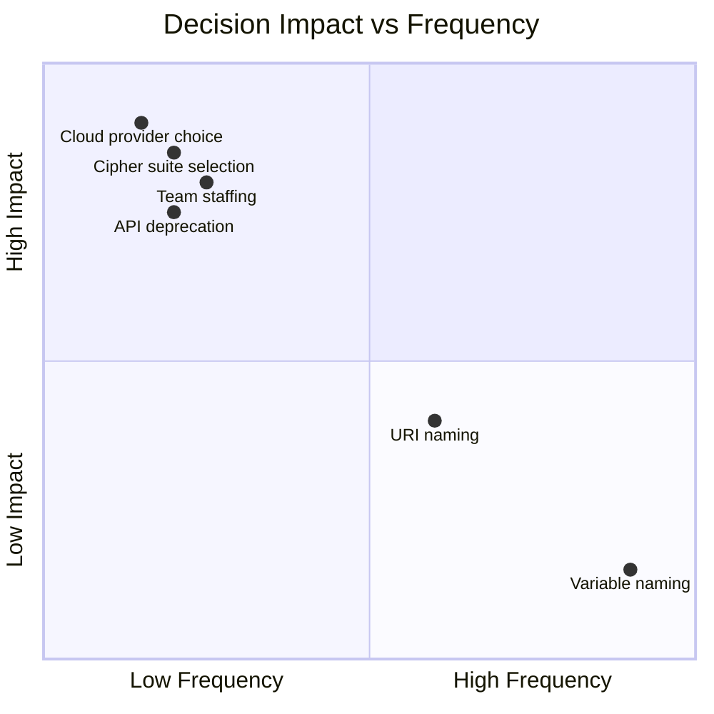
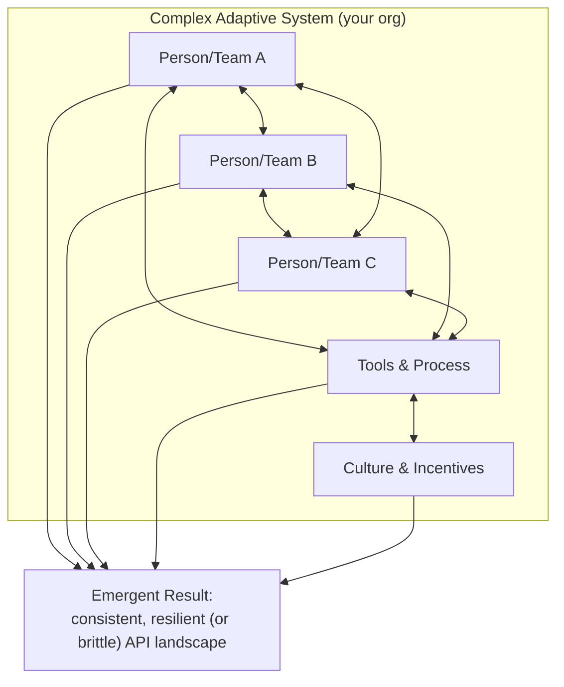
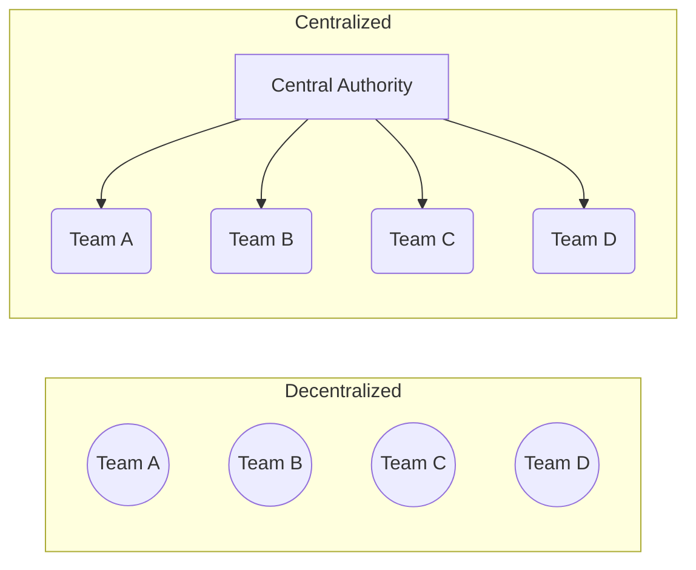
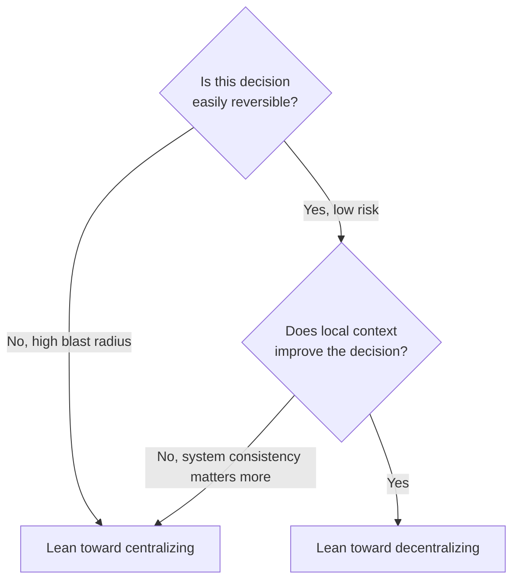
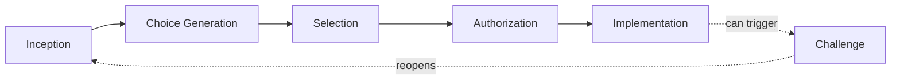
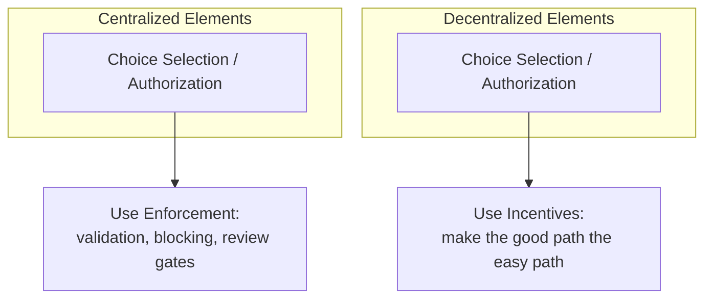
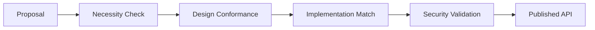
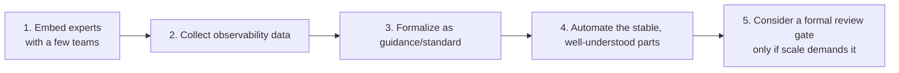

# API Governance: How I Actually Think About It (Without the Baggage)

I'll be honest — for years, the word "governance" made me tune out. It sounded like a committee, a slide deck, and six weeks of waiting for someone to approve a URL naming convention. But somewhere along the way I realized something that changed how I think about my job entirely: **you can't manage APIs without governing them.** You can call it something else — "standards," "platform guidelines," "the way we do things here" — but the moment more than one person is making decisions about APIs, some form of governance is already happening, whether you named it or not.

This post is my attempt to unpack governance in a way that doesn't feel like bureaucracy for its own sake. I'll walk through why decisions are the real unit of work in API management, why your organization behaves like a living system rather than a machine, how to think about centralizing versus decentralizing control, and three concrete governance patterns I've seen work (and fail) in the real world. I'll back it up with diagrams, tables, and a bit of code where it actually helps.

> **Note:** The interesting question was never "should I govern my APIs?" I've come to believe the answer to that is always yes. The genuinely useful questions are: *which* decisions need governing, and *where* should that governing happen?

---

## Table of Contents

1. Decisions are the real currency of API work
2. What "governing" a decision actually means
3. Your organization behaves like a living system
4. Centralized vs. decentralized: the core trade-off
5. Two lenses for distributing decisions: scope and scale
6. Breaking a decision into its moving parts
7. Putting decision-mapping into practice
8. Enforcement vs. incentives
9. Three governance patterns I've seen in the wild
10. Rolling governance out without breaking everything
11. Observability, operating models, and standards
12. My closing thoughts

---

## 1. Decisions Are the Real Currency of API Work

Here's a reframing that changed how I evaluate my own team's productivity: building APIs isn't really about writing code. It's about making a huge number of decisions, some tiny and some enormous, over and over again, quickly and well.

Think about the range of choices a single API team makes in an ordinary week:

- Should this resource live at `/payments` or `/payment-collection`?
- Which cloud region should this service run in?
- We have two overlapping customer APIs — which one gets deprecated?
- Who's actually staffing this team next quarter?
- What do I name this one local variable?

Three things jump out at me when I look at a list like that:

1. **The scope varies wildly.** A cloud provider choice can shape your infrastructure for years. A variable name affects one file.
2. **Impact isn't proportional to how "technical" the decision looks.** Choosing who's on the team matters more than almost any code-level decision.
3. **Small decisions compound.** One badly named variable is nothing. Ten thousand of them, and your codebase becomes unmaintainable.

That last point is the one I underestimated for the longest time. Governance isn't just about controlling the big, scary decisions — it's also about shaping the small, repeated ones that quietly determine your system's health at scale.



---

## 2. What "Governing" a Decision Actually Means

I want to be precise here because the word "governance" carries so much unwanted baggage. My working definition is this: **governance is the practice of managing how decisions get made and how they get carried out.** That's it. It isn't about control for its own sake, and it isn't about authority. Its purpose is to raise the *quality* of decision-making across the organization.

That said, governance is never free. Every constraint I put in place has to be written down, taught, and kept current. Every incentive I design has to stay attractive enough to actually shape behavior. And every rule needs someone watching to see whether it's working. In my experience, the real cost of governance shows up in two places:

- **The visible cost** — the time spent writing standards, running review meetings, maintaining documentation, and staffing whatever central function you build.
- **The hidden cost** — the second-order effects. If I mandate a single technology stack for every team, what does that do to innovation? To morale? To my ability to hire people who don't want to work in that stack?

> **Caution:** The hidden costs are the ones that bite you later. I've watched a "simple" mandate — like requiring a specific logging library — ripple out into hiring friction and slower onboarding for new engineers who'd never used it before. Predicting these ripple effects perfectly is basically impossible, which brings me to the next point.

---

## 3. Your Organization Behaves Like a Living System

This is the idea that reframed governance for me more than anything else: **your organization is a complex adaptive system**, not a machine you can tune with a wrench.

A complex adaptive system has two defining traits:

- It's made of many interdependent parts (people, teams, tools, culture).
- Those parts *adapt* — they change behavior in response to changes elsewhere in the system.

I like the biology metaphor here. My own body is a "self" only as an abstraction — really it's trillions of interdependent cells, constantly dying and being replaced, coordinating without any central cell "in charge," producing an emergent whole that can think, move, and heal. That resilience comes precisely *because* the system is decentralized and adaptive, not despite it.

The thing is, APIs themselves aren't adaptive. Code does exactly what it's told, forever, until a human changes it. The *people* around the API are the adaptive part. So the real target of governance was never "make better APIs" — it's "help people make better decisions about APIs." That's a subtle but important shift in framing.



The practical consequence of accepting this framing is uncomfortable but useful: **a single, big, up-front governance plan is unlikely to work as designed.** Every rule you introduce ripples outward in ways you can't fully predict, because the people affected by it will adapt around it. A rule banning a specific deployment technology, for instance, doesn't just affect deployment — it touches hiring, architecture, and culture in ways that are hard to foresee.

> **Note:** I've settled on treating governance the way I'd tend a garden rather than the way I'd execute a blueprint. Small nudges, constant observation, and a willingness to prune or replant based on what I actually see happening — not what I predicted would happen.

---

## 4. Centralized vs. Decentralized: The Core Trade-off

Once I accepted that I'm managing a living system rather than a machine, the next question became: **where should decisions actually get made?**

I think about this on a spectrum, not a binary switch:

- **Fully decentralized** — every team decides everything for itself, with no shared constraints. Like a pond ecosystem: no manager, no meetings, just individual organisms adapting locally. Nature handles this fine because the only real "goal" is survival, and if one species dies out, something else fills the gap. Businesses generally can't tolerate that level of risk.
- **Fully centralized** — one team or person makes every decision that everyone else must follow. Maximum consistency, minimum speed, and a hard ceiling on how much decision-making throughput you can sustain.



In practice I've never seen a real organization sit at either extreme. What I've seen instead is different *types* of decisions landing at different points along that spectrum — some highly centralized (security posture, for instance), others almost entirely decentralized (which testing framework a team prefers). The real skill of governance design is figuring out, decision by decision, where on that spectrum each one belongs.

Three factors consistently drive where a decision should sit:

| Factor | Why it matters |
|---|---|
| **Information quality** | A decision is only as good as the information behind it. Centralizing a decision can starve it of local context; decentralizing it can starve it of system-wide visibility. |
| **Talent availability** | Skilled, experienced people make better decisions. Decentralizing a decision to fifty teams means you need fifty teams' worth of good judgment, not just one. |
| **Coordination cost** | Every shared decision requires communication overhead. That overhead grows — sometimes nonlinearly — as more people get involved. |

---

## 5. Two Lenses for Distributing Decisions: Scope and Scale

I've found it useful to evaluate any given decision through two separate lenses: **scope of optimization** and **scale of operation**.

### Scope of optimization

A centralized decision is optimized for the *whole system*. A decentralized decision is optimized for a *local context*. Neither is inherently better — it depends on what you're trying to protect.

I lean on a version of the framing popularized around Amazon's decision-making culture: some decisions are easily reversible (safe to decentralize, because a bad call can be undone quickly), while others are nearly impossible to walk back (better centralized, because the blast radius of a mistake is too large to risk). Security configuration is a classic example of the second kind — I don't want fifty teams independently deciding on TLS cipher suites, because one bad local decision can create a system-wide vulnerability. On the other hand, letting a single team pick their own internal testing tool rarely threatens anything beyond that team.

There's also a subtler reason to centralize: sometimes *consistency itself* is the valuable thing. If every team picks a different API style, using multiple APIs together becomes needlessly hard for consumers — even if each individual choice was locally reasonable.



### Scale of operation

Scope tells you *who should decide*; scale tells you *whether you can actually afford it*. Decentralizing a decision to twenty teams means you need twenty teams' worth of decision-making talent — and good people are always scarce and contested. Centralizing it instead concentrates your best people, but as demand grows, that central team has to grow too, and coordination costs climb right along with it. Eventually a centralized team can become so large that it's slower than if you'd just decentralized in the first place.

| | Decentralized | Centralized |
|---|---|---|
| **Talent demand** | High — every team needs good judgment | Lower — concentrated in one team |
| **Coordination cost as scale grows** | Distributed, but inconsistency risk grows | Grows sharply, becomes a bottleneck |
| **Best suited for** | Reversible, locally-informed decisions | High-risk, system-wide decisions |

> **Caution:** I've seen teams centralize a decision purely because "that's safer," without accounting for scale. It works fine with five API teams. It becomes a painful bottleneck at fifty. Revisit these choices as your organization grows — what was right at your last size may not be right anymore.

---

## 6. Breaking a Decision Into Its Moving Parts

For a long time I treated "should this decision be centralized or decentralized?" as an all-or-nothing question. That framing kept forcing me into false choices — either lock everyone into one programming language, or let total chaos reign. The breakthrough for me was realizing that a decision isn't a single atomic thing. It has *stages*, and each stage can be distributed independently.

Here's the breakdown I now use, roughly matching stages you'd find in most decision-science literature, adapted for API work:



- **Inception** — recognizing that a decision even needs to be made. Some decisions surface naturally because work can't continue without them (you can't build a service without picking a database). Others quietly disappear because a team has fallen into habit ("we've always used Java, so nobody considers alternatives") or simply lacks the experience to notice an opportunity exists.
- **Choice generation** — laying out the actual menu of options. This step matters more when the decision-maker lacks deep domain experience, or when the cost of getting it wrong is high enough to justify real research.
- **Selection** — picking from the generated list. Interestingly, how much this step matters depends entirely on how the menu was built. If you're handed every possible option with no guidance, selection requires real expertise. If you're handed three pre-vetted, safe choices, selection becomes almost trivial — and that's often exactly the point.
- **Authorization** — confirming the selected choice is actually valid, safe, and consistent with everything else going on. This can be **explicit** (someone has to sign off) or **implicit** (approval happens automatically once certain conditions are met — for instance, the person selecting is also authorized to approve their own choice).
- **Implementation** — actually doing the work to realize the decision. A decision that can't practically be implemented isn't really a good decision, no matter how well-reasoned it looked on paper.
- **Challenge** — the ability to revisit, question, or reverse a decision later. Nothing should be treated as permanently fixed. The important governance question is *who* gets to invoke this, and under what circumstances.

The unlock here is that I can now distribute *each stage independently*. I might centralize choice generation (so my company maintains a small, vetted list of approved programming languages) while decentralizing selection, authorization, and implementation (so individual teams pick freely from that list and ship without waiting on anyone). That gives me most of the consistency benefits of centralization and most of the speed benefits of decentralization, in the same decision.

---

## 7. Putting Decision-Mapping Into Practice

Let me walk through two examples close to ones I've actually run into, to show how this plays out.

### Example: choosing a programming language

Say I've noticed that letting every team pick any language they want is making it hard for engineers to move between teams and hard for security/ops to support everything. I don't want to mandate a single language — that kills too much flexibility for a microservices-style architecture — but I do want *some* consistency. Here's how I might map it:

| Element | Distribution |
|---|---|
| Inception | Centralized |
| Choice generation | Centralized |
| Selection | Decentralized |
| Authorization | Decentralized |
| Implementation | Decentralized |
| Challenge | Decentralized (any team can propose a new language be added to the list) |

In plain language: a central team curates a short, well-supported list of languages. Individual teams freely pick from that list without asking permission, and any team can push to get a new language added if they have a good case. I get consistency where it matters (a bounded, supportable set of languages) and speed where it matters (no approval bottleneck for day-to-day choices).

### Example: choosing a software stack / tooling

Now imagine leadership wants to boost innovation by letting teams pick their own tools and open-source dependencies — but legal and procurement are worried about license risk and vendor exposure. Here's a plausible first-pass map:

| Element | Distribution |
|---|---|
| Inception | Decentralized |
| Choice generation | Decentralized |
| Selection | Decentralized |
| Authorization | Centralized (legal/procurement sign-off) |
| Implementation | Decentralized |

Here almost the entire decision lives with the team — except authorization, which stays centralized to manage legal risk. That's a deliberate trade-off: I accept a potential bottleneck at the authorization step in exchange for protecting the company from a risk that's expensive and hard to reverse. If that authorization step later becomes a drag at scale, I know exactly which single element to redesign, rather than blowing up the whole governance model.

> **Note:** I don't actually draw these tables for every decision I make day to day — that would be exhausting. I keep this framework as a mental model for the handful of *important*, recurring decisions where getting the distribution wrong would be genuinely costly.

---

## 8. Enforcement vs. Incentives

Once I've mapped a decision, I still need a way to make sure the distribution actually holds up in practice. There are really only two levers here: **enforcement** (the stick) and **incentivization** (the carrot).

- **Enforcement** works when a decision element is centralized — I can validate or block a choice that doesn't conform. This requires actual authority; a review team with no power to stop a bad deployment is just writing reports nobody has to read.
- **Incentivization** works when a decision element is decentralized — I can't force a team's hand, but I can make the "right" choice cheaper, faster, or more pleasant than the alternative. A classic move: make the paved-path deployment pipeline dramatically easier to use than any custom alternative, so teams choose it because it's genuinely the path of least resistance, not because they were told to.



Here's a small, tested example of enforcement in action — a lightweight automated check I might run in CI to enforce a centralized naming-convention decision (kebab-case resource paths) without needing a human reviewer in the loop for every pull request:

```javascript
// lint-api-paths.js
// A tiny automated enforcement check for a centralized decision:
// "All resource paths must use kebab-case, not camelCase or snake_case."

const paths = [
  "/payments",
  "/payment-collection",
  "/paymentCollection",   // should fail
  "/payment_collection"   // should fail
];

const kebabCasePattern = /^\/[a-z0-9]+(-[a-z0-9]+)*(\/[a-z0-9]+(-[a-z0-9]+)*)*$/;

let failures = 0;
for (const path of paths) {
  const ok = kebabCasePattern.test(path);
  console.log(`${ok ? "PASS" : "FAIL"}  ${path}`);
  if (!ok) failures++;
}

process.exitCode = failures > 0 ? 1 : 0;
```

Running this locally produces exactly what I'd expect:

```
PASS  /payments
PASS  /payment-collection
FAIL  /paymentCollection
FAIL  /payment_collection
```

That's enforcement, cheaply automated. If I wanted to *incentivize* the same convention instead — say, because I've decentralized this particular decision — I might instead build a code-generation template that defaults to kebab-case paths automatically, so following the convention takes zero extra effort and deviating from it takes deliberate work.

---

## 9. Three Governance Patterns I've Seen in the Wild

With decisions, distribution, enforcement, and incentives all on the table, I've noticed most real governance setups fall into (or blend) three broad patterns.

### Pattern 1: The Design Authority

A central team acts as a gatekeeper, reviewing API designs against a set of standards before they're allowed to ship. This can be a scheduled review board or an on-demand service, and mature versions of this pattern often include self-service linting or automated conformance tooling rather than pure manual review.

A well-known real-world example of this shape is PayPal's centralized API design review process, which historically ran new API proposals through staged checks — first evaluating whether a new API was actually needed, then checking design conformance to standards, then verifying the implementation matched the approved design, and finally validating security requirements before publishing.



**What I like about it:** maximum assurance. Every API passes through the same quality bar, which matters enormously for high-risk concerns like security and access control.

**What worries me about it:** it's a bottleneck by construction. It works beautifully when there are a handful of APIs. As the number of teams and APIs grows, that same central team becomes the thing everyone is waiting on.

### Pattern 2: Embedded Centralized Experts

Instead of reviewing output after the fact, this pattern embeds subject-matter experts *inside* individual API teams, either advising on decisions or making them directly as a temporary team member. A large, globally distributed organization like HSBC has used something like this — a network of internal "API champions" who carry central standards knowledge directly into local project teams, spreading expertise without requiring every team to independently develop it.

Functionally, this centralizes the *research and selection* work (because the embedded expert brings a shared understanding of "good" decisions with them) while usually leaving *authorization and implementation* with the local team.

**What I like about it:** decisions get made well *early*, right at the point of work, and the embedded experts bring real field experience back to improve central guidance over time — it's a two-way flow rather than a one-way gate.

**What worries me about it:** you need a genuinely large, well-maintained bench of experts to embed everywhere demand exists. And if those experts spend too long deep in day-to-day delivery pressure, they can quietly drift away from any shared system-level view — eventually looking a lot like full decentralization with extra steps.

### Pattern 3: Influenced Self-Governance

Here, teams own the entire decision — inception through implementation — but the organization shapes their choices through influence rather than control. The goal, as I've heard it put, is to make the right choice the *easy* choice, not the *mandatory* one.

Spotify's well-known internal platform approach is an example of this shape: engineering teams get a curated, well-supported "golden path" of recommended tools, and while nothing stops a team from going off that path, doing so means giving up the support and ease that comes with sticking to it. The influence comes from making the recommended option genuinely more attractive, not from blocking alternatives outright.

**What I like about it:** speed. Teams that own their entire decision space move fast, because there's no queue to wait in.

**What worries me about it:** consistency risk. Nothing structurally prevents inconsistent or locally over-optimized decisions — this pattern only works well if every team already has strong decision-making talent, which is why I've often seen it paired with a lightweight design authority as a safety net.

| Pattern | Where control lives | Best for | Biggest risk |
|---|---|---|---|
| Design Authority | Central review gate | High-risk, high-consistency needs | Becomes a bottleneck at scale |
| Embedded Experts | Distributed people, centralized knowledge | Spreading expertise across many teams | Needs a large expert bench; can drift to full decentralization |
| Influenced Self-Governance | Local teams, shaped by incentives | Speed and innovation-first cultures | Inconsistency; needs strong local talent |

> **Note:** None of these is objectively "correct." I've watched two companies succeed wildly with opposite approaches — one running a strict, centralized design-authority model, the other running an almost fully autonomous, results-oriented model. Both worked because the governance style matched the culture and goals of the business, not because one style is universally superior.

---

## 10. Rolling Governance Out Without Breaking Everything

If there's one mistake I've made personally, it's trying to design a "final" governance system up front and then being surprised when it didn't survive contact with reality. Because I'm governing a complex adaptive system, I've learned to treat governance as something I evolve continuously rather than launch once. A few practices I now follow religiously:

- **Embed before you gatekeep.** When I'm rolling out a new standard, I try to start by embedding with a small number of real teams first (Pattern 2), rather than jumping straight to a formal review gate (Pattern 1). It's far cheaper to adjust a standard while it's still being tested on a handful of projects than after it's been published and socialized company-wide.
- **Get observability before automation.** I want visibility into what's actually happening before I try to change it. Collecting data early — even manually — beats guessing.
- **Automate later, not first.** Automation is genuinely powerful (see the lint example above), but it locks in whatever rule you've encoded, and changing an automated check later is more expensive than changing a guideline a human reviewer applies with judgment. I try to run a decision area through manual review for a while before I bother automating it.
- **Be cautious creating new central teams.** Standards and tools are easy to retire. Teams are not. I've seen central teams outlive their original purpose and start optimizing for their own continued existence. If I do create a central team, I try to keep it deliberately small and lean until real demand forces growth — and I've even heard of leaders setting "eventually disbanding this team" as an explicit goal from day one.



---

## 11. Observability, Operating Models, and Standards

A few supporting pieces round out any governance system I build.

**Observability** — I can't improve what I can't see. At minimum, I try to track: which APIs actually exist and are running in production, who owns and funds each one, how much real traffic each one handles, and how well each one conforms to whatever standards I've published. In a large organization, just answering "how many APIs do we actually have?" can be a genuine project on its own.

**Operating models** — however I distribute decisions, I still need a concrete way for people to coordinate day to day: recurring reviews, shared forums, or simply a clear escalation path when a team wants to challenge an existing standard. This is less about picking the "correct" model and more about being deliberate — an unspoken, ad hoc operating model is still a model, just an unmanaged one.

**Standards management** — every standard I write is a living asset, not a one-time document. It needs an owner, a process for proposing changes, and a review cadence, or it will either calcify into something nobody follows or balloon into an unmaintainable pile of outdated pages. I try to treat my standards library the way I'd treat a product: someone owns it, there's a lightweight process for contributions, and stale content gets pruned rather than left to rot.

| Supporting practice | The question it answers |
|---|---|
| Observability | What's actually happening in my API landscape right now? |
| Operating model | How do people actually coordinate and escalate day to day? |
| Standards management | How do documented rules stay accurate and useful over time? |

---

## 12. My Closing Thoughts

If I compress everything in this post into a handful of ideas I actually carry with me day to day, it's these:

- Governance isn't about control — it's about improving the quality of the decisions people make, over and over, at scale.
- My organization behaves like a living system, not a machine. Big, rigid, one-time plans don't survive contact with that reality; small, observed, adjustable nudges do.
- Centralization and decentralization aren't a binary choice — they're a spectrum, and different decisions belong in different places along it, based on how reversible they are and how much local context actually improves them.
- A decision isn't one atomic thing. Breaking it into inception, choice generation, selection, authorization, implementation, and challenge lets me distribute *parts* of a decision instead of forcing an all-or-nothing call.
- Enforcement works for centralized choices; incentives work for decentralized ones. I need both, applied to the right places.
- Design Authorities, Embedded Experts, and Influenced Self-Governance are three real shapes governance can take — and the "right" one depends entirely on my organization's culture, risk tolerance, and stage of growth, not on some universal best practice.
- Roll governance out the way you'd tend a garden: embed early, observe constantly, automate only once you understand the shape of the problem, and be very careful about which central teams you let take root.

None of this makes governance exciting, exactly. But reframing it this way — as decision design for a living system, rather than rule-making for a machine — is what finally made the topic make sense to me. And once it made sense, it stopped feeling like bureaucracy and started feeling like one of the more interesting design problems in my job.
