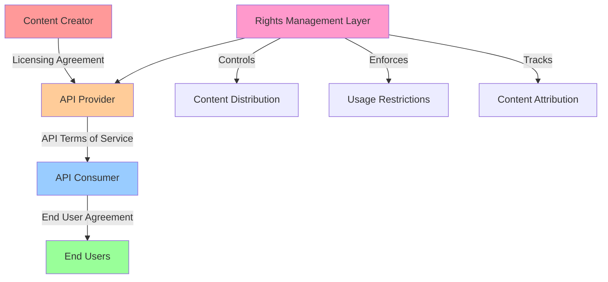
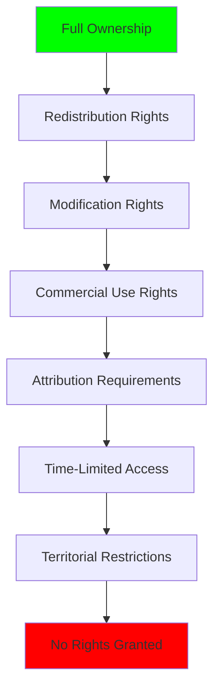
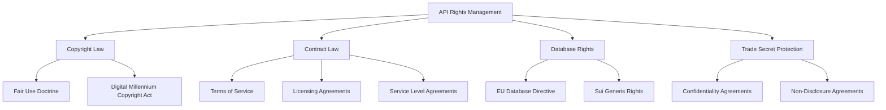

# API Rights Management: A Comprehensive Guide to Content Ownership and Distribution

When I first started building APIs, I made a critical mistake that could have cost my company millions. I assumed that because we had purchased content for our website, we automatically had the right to redistribute it through our API. That assumption nearly landed us in a legal nightmare. Today, I want to share everything I've learned about API rights management—a topic that's often overlooked but absolutely critical for any organization exposing content through APIs.

## Understanding Content Rights in the API Economy

The digital landscape has fundamentally changed how content flows between organizations. When you expose an API, you're not just sharing data—you're granting legal permissions that can have profound implications for your business, your content providers, and your API consumers.



The diagram above illustrates the complex chain of rights that must be managed. Each arrow represents a legal relationship that must be documented, enforced, and monitored. When I design API systems now, I always start with this rights chain in mind.

## Who Owns the Rights? The Fundamental Question

Let me start with the most critical question: **Who actually owns the content you're exposing through your API?** This seems simple, but I've found that most organizations don't have a clear answer.

### Types of Content Ownership

Here's a comprehensive breakdown of content ownership scenarios I've encountered:

| Content Type | Ownership Complexity | Common Issues | Risk Level |
|-------------|---------------------|---------------|------------|
| User-Generated Content | High | Multiple contributors, unclear terms | High |
| Licensed Third-Party Content | Very High | Contract restrictions, territorial limits | Critical |
| Proprietary Original Content | Low | Clear ownership, internal creation | Low |
| Public Domain Content | None | Verification of status | Low |
| Aggregated/Derived Content | Medium | Derivative work rights | Medium |
| Real-Time Data Feeds | High | Time-sensitive rights, redistribution limits | High |

### The Sports Scores Example

Sports scores are the perfect example of content ownership confusion. I worked with a sports analytics startup that was scraping scores from various sources and exposing them through an API. Here's what they didn't realize:

```python
class ContentRightsValidator:
    def __init__(self):
        self.content_rights_registry = {}
        
    def register_content_rights(self, content_type, rights_info):
        """
        Register rights information for a content type
        """
        self.content_rights_registry[content_type] = {
            'owner': rights_info.get('owner'),
            'license_type': rights_info.get('license_type'),
            'redistribution_allowed': rights_info.get('redistribution_allowed', False),
            'territorial_restrictions': rights_info.get('territorial_restrictions', []),
            'expiration_date': rights_info.get('expiration_date'),
            'attribution_required': rights_info.get('attribution_required', False),
            'commercial_use_allowed': rights_info.get('commercial_use_allowed', False)
        }
        
    def can_distribute_content(self, content_type, context):
        """
        Check if content can be distributed in given context
        """
        if content_type not in self.content_rights_registry:
            return False, "Unknown content type - no rights registered"
            
        rights = self.content_rights_registry[content_type]
        
        # Check if redistribution is allowed
        if not rights['redistribution_allowed']:
            return False, "Redistribution not permitted under current license"
            
        # Check territorial restrictions
        user_country = context.get('country')
        if rights['territorial_restrictions'] and user_country:
            if user_country in rights['territorial_restrictions']:
                return False, f"Content restricted in {user_country}"
                
        # Check expiration
        if rights['expiration_date']:
            if datetime.now() > rights['expiration_date']:
                return False, "Content license has expired"
                
        # Check commercial use
        if context.get('commercial_use') and not rights['commercial_use_allowed']:
            return False, "Commercial use not permitted"
            
        return True, "Content distribution permitted"
```

> **⚠️ Caution:** Sports leagues like the NFL, NBA, and Premier League aggressively protect their data rights. I've seen startups receive cease-and-desist letters for exposing real-time scores without proper licensing. The penalties can be severe—in some cases, statutory damages of $150,000 per infringement.

## Understanding Your Rights as an API Provider

When you build an API, you're essentially creating a distribution channel. But what rights do you actually have, and what rights can you grant to others?

### The Rights Pyramid



This pyramid represents the spectrum of rights, from full ownership down to complete restriction. Each level builds upon the previous one.

### Rights You Might Have

Based on my experience, here are the types of rights you might possess:

```python
class RightsInventory:
    def __init__(self):
        self.rights_inventory = {}
        
    def add_rights_entry(self, content_id, rights_details):
        """
        Add rights information for specific content
        """
        self.rights_inventory[content_id] = {
            'copyright_holder': rights_details.get('copyright_holder'),
            'license_type': rights_details.get('license_type'),
            'permitted_uses': rights_details.get('permitted_uses', []),
            'prohibited_uses': rights_details.get('prohibited_uses', []),
            'geographic_scope': rights_details.get('geographic_scope', 'worldwide'),
            'duration': rights_details.get('duration', 'perpetual'),
            'exclusivity': rights_details.get('exclusivity', 'non-exclusive'),
            'sublicensing_rights': rights_details.get('sublicensing_rights', False),
            'modification_rights': rights_details.get('modification_rights', False)
        }
        
    def evaluate_use_case(self, content_id, proposed_use):
        """
        Evaluate if a proposed use is permitted
        """
        if content_id not in self.rights_inventory:
            return {
                'permitted': False,
                'reason': 'No rights information available'
            }
            
        rights = self.rights_inventory[content_id]
        
        # Check if proposed use is in permitted uses
        if proposed_use in rights['permitted_uses']:
            return {
                'permitted': True,
                'conditions': self.get_use_conditions(rights)
            }
            
        # Check if proposed use is explicitly prohibited
        if proposed_use in rights['prohibited_uses']:
            return {
                'permitted': False,
                'reason': f"Use '{proposed_use}' explicitly prohibited"
            }
            
        return {
            'permitted': False,
            'reason': 'Proposed use not covered by current rights'
        }
```

## Granting Rights to API Consumers

Once you understand your own rights, you need to determine what rights you can grant to API consumers. This is where the technical implementation becomes crucial.

### API Access Levels

Different audiences may require different levels of access. Here's a system I've implemented:

```python
from enum import Enum
from datetime import datetime, timedelta
import json

class AccessLevel(Enum):
    PUBLIC = "public"
    REGISTERED = "registered"
    PARTNER = "partner"
    PREMIUM = "premium"
    ENTERPRISE = "enterprise"
    INTERNAL = "internal"

class RightsManager:
    def __init__(self):
        self.access_levels = {}
        self.consumer_rights = {}
        
    def define_access_level(self, level, permissions):
        """
        Define what each access level can do
        """
        self.access_levels[level] = {
            'max_requests_per_day': permissions.get('max_requests_per_day'),
            'allowed_content_types': permissions.get('allowed_content_types', []),
            'can_redistribute': permissions.get('can_redistribute', False),
            'can_cache': permissions.get('can_cache', False),
            'can_modify': permissions.get('can_modify', False),
            'requires_attribution': permissions.get('requires_attribution', False),
            'commercial_use': permissions.get('commercial_use', False),
            'geographic_restrictions': permissions.get('geographic_restrictions', [])
        }
        
    def assign_consumer_rights(self, consumer_id, access_level, custom_restrictions=None):
        """
        Assign rights to a specific API consumer
        """
        if access_level not in self.access_levels:
            raise ValueError(f"Unknown access level: {access_level}")
            
        rights = {
            'access_level': access_level,
            'permissions': self.access_levels[access_level].copy(),
            'granted_at': datetime.now(),
            'expires_at': datetime.now() + timedelta(days=365),
            'is_active': True
        }
        
        # Apply custom restrictions
        if custom_restrictions:
            rights['permissions'].update(custom_restrictions)
            
        self.consumer_rights[consumer_id] = rights
        
    def check_permission(self, consumer_id, permission_type):
        """
        Check if a consumer has specific permission
        """
        if consumer_id not in self.consumer_rights:
            return False
            
        consumer = self.consumer_rights[consumer_id]
        
        if not consumer['is_active']:
            return False
            
        if datetime.now() > consumer['expires_at']:
            consumer['is_active'] = False
            return False
            
        return consumer['permissions'].get(permission_type, False)
```

### Real-World Rights Management Implementation

Let me show you how NPR's rights management approach can be implemented:

```python
class NPRStyleRightsManager:
    def __init__(self):
        self.content_registry = {}
        self.audience_profiles = {}
        self.distribution_rules = {}
        
    def register_content(self, content_id, content_metadata):
        """
        Register content with rights metadata
        """
        self.content_registry[content_id] = {
            'title': content_metadata.get('title'),
            'creator': content_metadata.get('creator'),
            'rights_holder': content_metadata.get('rights_holder'),
            'distribution_rights': content_metadata.get('distribution_rights', []),
            'territorial_restrictions': content_metadata.get('territorial_restrictions', []),
            'time_restrictions': content_metadata.get('time_restrictions'),
            'usage_restrictions': content_metadata.get('usage_restrictions', []),
            'attribution_requirements': content_metadata.get('attribution_requirements'),
            'payment_required': content_metadata.get('payment_required', False)
        }
        
    def define_audience_profile(self, audience_id, audience_characteristics):
        """
        Define characteristics of different API audiences
        """
        self.audience_profiles[audience_id] = {
            'type': audience_characteristics.get('type'),  # public, partner, internal
            'geographic_location': audience_characteristics.get('geographic_location'),
            'commercial_status': audience_characteristics.get('commercial_status'),
            'trust_level': audience_characteristics.get('trust_level', 1),
            'content_preferences': audience_characteristics.get('content_preferences', [])
        }
        
    def can_serve_content(self, content_id, audience_id, request_context):
        """
        Determine if content can be served to specific audience
        """
        if content_id not in self.content_registry:
            return False, "Content not found"
            
        if audience_id not in self.audience_profiles:
            return False, "Unknown audience"
            
        content = self.content_registry[content_id]
        audience = self.audience_profiles[audience_id]
        
        # Check territorial restrictions
        if audience['geographic_location'] in content['territorial_restrictions']:
            return False, "Content restricted in this location"
            
        # Check time restrictions
        if content['time_restrictions']:
            now = datetime.now()
            if now < content['time_restrictions'].get('start', now):
                return False, "Content not yet available"
            if now > content['time_restrictions'].get('end', now):
                return False, "Content no longer available"
                
        # Check usage restrictions
        if audience['commercial_status'] == 'commercial' and 'commercial_use' in content['usage_restrictions']:
            return False, "Commercial use not permitted"
            
        # Check attribution requirements
        if content['attribution_requirements'] and audience['trust_level'] < 2:
            return False, "Attribution requirements not met"
            
        return True, "Content can be served"
```

## Legal Considerations for API Rights Management

This is where many developers and even product managers feel out of their depth. I've worked with legal teams extensively, and here's what I've learned about the legal aspects of API rights management.

### Key Legal Frameworks



### The Soft Launch Approach

When rights scenarios are unclear, a soft launch or beta period is often the best approach. Here's how I structure beta launches for rights testing:

```python
class BetaLaunchManager:
    def __init__(self):
        self.beta_participants = {}
        self.rights_scenarios = {}
        self.test_results = {}
        
    def register_beta_participant(self, participant_id, participant_profile):
        """
        Register a beta participant with specific characteristics
        """
        self.beta_participants[participant_id] = {
            'name': participant_profile.get('name'),
            'organization_type': participant_profile.get('organization_type'),
            'geographic_location': participant_profile.get('geographic_location'),
            'intended_use': participant_profile.get('intended_use'),
            'content_preferences': participant_profile.get('content_preferences', [])
        }
        
    def define_rights_scenario(self, scenario_id, scenario_rules):
        """
        Define a specific rights scenario to test
        """
        self.rights_scenarios[scenario_id] = {
            'content_types': scenario_rules.get('content_types', []),
            'access_restrictions': scenario_rules.get('access_restrictions', {}),
            'usage_limits': scenario_rules.get('usage_limits', {}),
            'attribution_requirements': scenario_rules.get('attribution_requirements', {})
        }
        
    def assign_scenario_to_participant(self, participant_id, scenario_id):
        """
        Assign a rights scenario to a beta participant
        """
        if participant_id not in self.beta_participants:
            raise ValueError("Unknown participant")
            
        if scenario_id not in self.rights_scenarios:
            raise ValueError("Unknown scenario")
            
        self.beta_participants[participant_id]['scenario'] = scenario_id
        self.test_results[participant_id] = {
            'scenario': scenario_id,
            'started_at': datetime.now(),
            'events': []
        }
        
    def log_rights_event(self, participant_id, event_type, content_id, outcome):
        """
        Log events during beta testing
        """
        if participant_id in self.test_results:
            self.test_results[participant_id]['events'].append({
                'timestamp': datetime.now(),
                'event_type': event_type,
                'content_id': content_id,
                'outcome': outcome
            })
            
    def generate_beta_report(self):
        """
        Generate a comprehensive beta testing report
        """
        report = {
            'total_participants': len(self.beta_participants),
            'scenarios_tested': len(self.rights_scenarios),
            'rights_violations': 0,
            'access_denials': 0,
            'successful_serves': 0,
            'participant_feedback': []
        }
        
        for participant_id, results in self.test_results.items():
            for event in results['events']:
                if event['outcome'] == 'denied':
                    report['access_denials'] += 1
                elif event['outcome'] == 'served':
                    report['successful_serves'] += 1
                elif event['outcome'] == 'violation':
                    report['rights_violations'] += 1
                    
        return report
```

## Organizational Considerations for Rights Management

Rights management doesn't happen in a vacuum. You need to coordinate across multiple parts of your organization.

### Cross-Functional Rights Management

```python
class OrganizationalRightsCoordinator:
    def __init__(self):
        self.departments = {}
        self.content_sources = {}
        self.rights_decisions = {}
        
    def register_department(self, department_id, department_info):
        """
        Register departments involved in rights management
        """
        self.departments[department_id] = {
            'name': department_info.get('name'),
            'role': department_info.get('role'),  # legal, content, technical, business
            'approval_authority': department_info.get('approval_authority', False),
            'contact_email': department_info.get('contact_email')
        }
        
    def register_content_source(self, source_id, source_info):
        """
        Register content sources and their rights holders
        """
        self.content_sources[source_id] = {
            'source_name': source_info.get('source_name'),
            'rights_holder': source_info.get('rights_holder'),
            'contract_details': source_info.get('contract_details'),
            'expiration_date': source_info.get('expiration_date'),
            'renewal_contact': source_info.get('renewal_contact')
        }
        
    def initiate_rights_review(self, content_id, requested_use):
        """
        Initiate a cross-functional rights review
        """
        review_id = f"review_{datetime.now().timestamp()}"
        
        self.rights_decisions[review_id] = {
            'content_id': content_id,
            'requested_use': requested_use,
            'status': 'pending',
            'department_reviews': {},
            'initiated_at': datetime.now()
        }
        
        # Send to relevant departments for review
        for dept_id, dept_info in self.departments.items():
            if dept_info['approval_authority']:
                self.rights_decisions[review_id]['department_reviews'][dept_id] = {
                    'status': 'pending',
                    'reviewed_at': None,
                    'decision': None,
                    'comments': None
                }
                
        return review_id
        
    def submit_department_review(self, review_id, department_id, decision, comments):
        """
        Submit a department's review decision
        """
        if review_id not in self.rights_decisions:
            raise ValueError("Unknown review")
            
        if department_id not in self.rights_decisions[review_id]['department_reviews']:
            raise ValueError("Department not part of this review")
            
        review = self.rights_decisions[review_id]['department_reviews'][department_id]
        review['status'] = 'completed'
        review['reviewed_at'] = datetime.now()
        review['decision'] = decision  # approved, denied, conditional
        review['comments'] = comments
        
        # Check if all reviews are complete
        all_complete = all(
            dept_review['status'] == 'completed'
            for dept_review in self.rights_decisions[review_id]['department_reviews'].values()
        )
        
        if all_complete:
            self.rights_decisions[review_id]['status'] = 'completed'
            
    def get_rights_decision(self, review_id):
        """
        Get the final rights decision
        """
        if review_id not in self.rights_decisions:
            return None
            
        review = self.rights_decisions[review_id]
        
        if review['status'] != 'completed':
            return {
                'status': 'pending',
                'message': 'Review not yet complete'
            }
            
        # Aggregate department decisions
        decisions = [
            dept_review['decision']
            for dept_review in review['department_reviews'].values()
        ]
        
        if all(decision == 'approved' for decision in decisions):
            return {
                'status': 'approved',
                'message': 'All departments approved'
            }
        elif any(decision == 'denied' for decision in decisions):
            return {
                'status': 'denied',
                'message': 'At least one department denied'
            }
        else:
            return {
                'status': 'conditional',
                'message': 'Approved with conditions'
            }
```

## Technical Implementation of Rights Management

The technical implementation of rights management is just as important as the legal framework. Here's how I build rights management into APIs:

### Content Tagging System

```python
class ContentTaggingSystem:
    def __init__(self):
        self.content_tags = {}
        self.tag_categories = {
            'copyright': ['original', 'licensed', 'public_domain', 'user_generated'],
            'distribution': ['unrestricted', 'restricted', 'prohibited'],
            'territory': ['worldwide', 'north_america', 'europe', 'asia', 'custom'],
            'commercial_use': ['allowed', 'prohibited', 'requires_license'],
            'modification': ['allowed', 'requires_permission', 'prohibited']
        }
        
    def tag_content(self, content_id, tags):
        """
        Apply rights-related tags to content
        """
        if content_id not in self.content_tags:
            self.content_tags[content_id] = {}
            
        # Validate tags against categories
        for category, value in tags.items():
            if category in self.tag_categories:
                if value in self.tag_categories[category]:
                    self.content_tags[content_id][category] = value
                else:
                    raise ValueError(f"Invalid tag value '{value}' for category '{category}'")
                    
    def check_content_rights(self, content_id, request_context):
        """
        Check content rights based on tags and request context
        """
        if content_id not in self.content_tags:
            return False, "Content not tagged"
            
        tags = self.content_tags[content_id]
        
        # Check distribution rights
        if tags.get('distribution') == 'prohibited':
            return False, "Distribution prohibited"
            
        # Check territorial restrictions
        territory = tags.get('territory')
        if territory == 'restricted':
            user_region = request_context.get('region')
            if user_region and user_region not in tags.get('allowed_regions', []):
                return False, "Content restricted in this region"
                
        # Check commercial use
        if tags.get('commercial_use') == 'prohibited':
            if request_context.get('commercial_use'):
                return False, "Commercial use prohibited"
                
        return True, "Content rights verified"
```

## Conclusion: Building a Comprehensive Rights Management Strategy

Rights management is not just a legal checkbox—it's a fundamental aspect of API design that affects your business relationships, technical architecture, and legal compliance. Based on my experience building and managing APIs across various industries, here are the key principles I've learned:

1. **Start with a rights audit** - Before exposing any content through an API, understand what you own and what you're licensing.

2. **Build rights management into your architecture** - Don't bolt it on later. It should be a core component of your API design.

3. **Implement granular access controls** - Different audiences need different levels of access, and this needs to be technically enforceable.

4. **Tag everything** - Content tagging is the foundation of automated rights management. Without it, you can't enforce restrictions programmatically.

5. **Plan for the future** - Rights agreements change. Build flexibility into your system to accommodate new content sources and distribution scenarios.

6. **Coordinate across departments** - Rights management requires input from legal, content, technical, and business teams.

7. **Test before full launch** - Use beta periods to test rights scenarios and identify issues before they become problems.

8. **Monitor and audit** - Keep track of how your content is being used and be prepared to take action if rights are violated.

The most successful API programs I've seen treat rights management as a strategic priority rather than an afterthought. They invest in the legal infrastructure, technical systems, and organizational processes needed to manage content rights effectively.

Remember, every piece of content you expose through an API carries legal obligations and opportunities. Understanding and managing these rights is not just about avoiding lawsuits—it's about building trust with your content partners and creating sustainable business models for content distribution in the digital age.

By implementing the systems and practices I've outlined, you'll be well-positioned to navigate the complex world of API rights management and build APIs that create value while respecting the rights of all stakeholders involved.
