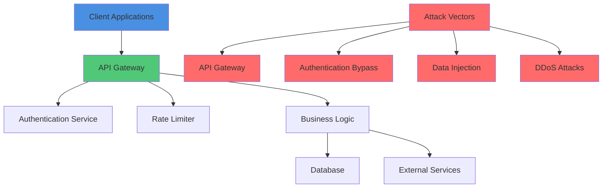
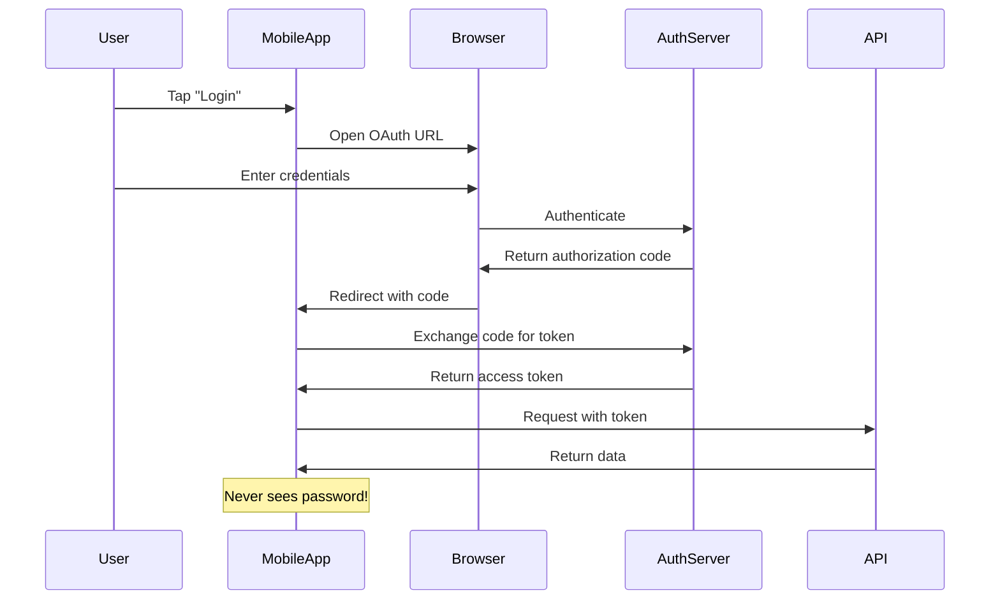
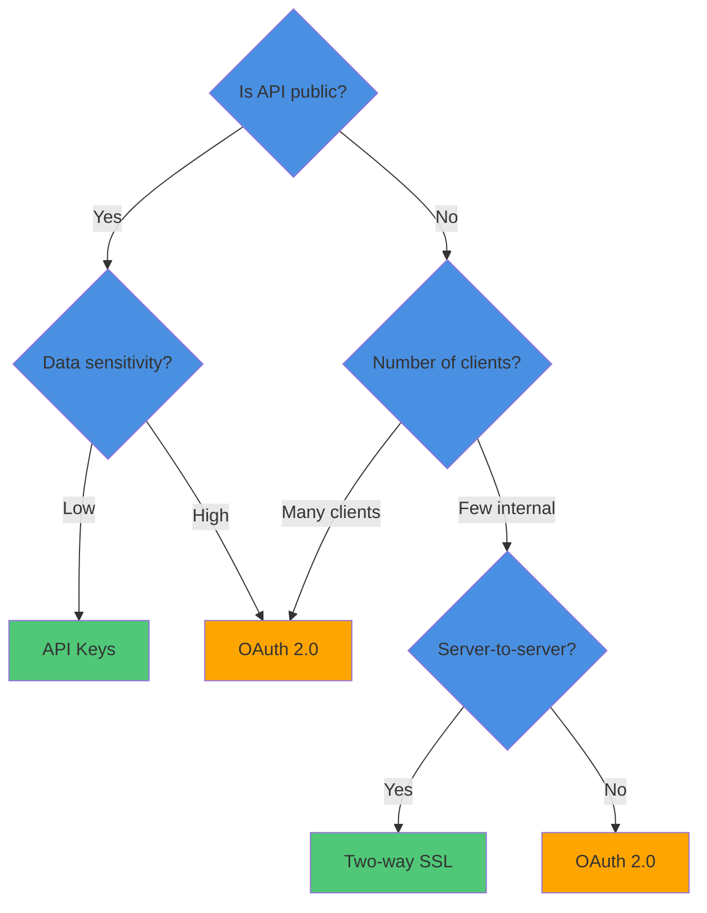

# API Security: A Comprehensive Guide to Protecting Your Digital Assets

I've spent the last decade working with APIs across various industries, and I've witnessed firsthand how security breaches can devastate businesses. When I first started developing APIs, I made countless mistakes that could have been catastrophic if they'd been exploited. Today, I want to share everything I've learned about API security recommendations, drawing from real-world experiences and industry best practices.

## Understanding the API Security Landscape

Before diving into specific security measures, I need to explain why API security has become critical. Modern applications are no longer monolithic structures—they're distributed systems where APIs serve as the connective tissue. According to recent studies, over 83% of all web traffic now involves API calls in some form.



The diagram above illustrates how APIs are the central point of interaction and vulnerability. When I design APIs, I always consider both legitimate traffic and potential attack vectors.

## API Keys: The Foundation of API Security

Let me start with the most basic form of API security—API keys. These are simple string tokens that identify the calling application. I remember when I built my first public API for a weather service; I naively thought API keys alone would protect sensitive data. I quickly learned their proper use case.

### When to Use API Keys

API keys work best for **non-sensitive, read-only data**. Here's what I've learned from experience:

```python
# Simple API key implementation
import secrets
import hashlib
from datetime import datetime, timedelta

class APIKeyManager:
    def __init__(self):
        self.api_keys = {}  # In production, use a database
        
    def generate_api_key(self, application_name, rate_limit=100):
        """
        Generate a new API key for an application
        """
        # Generate a random token
        raw_key = secrets.token_urlsafe(32)
        
        # Hash it for storage (never store raw keys!)
        hashed_key = hashlib.sha256(raw_key.encode()).hexdigest()
        
        # Store key metadata
        self.api_keys[hashed_key] = {
            'application': application_name,
            'created_at': datetime.now(),
            'rate_limit': rate_limit,
            'requests_this_hour': 0,
            'last_reset': datetime.now(),
            'is_active': True
        }
        
        # Return the raw key (only time it's visible)
        return raw_key
    
    def validate_key(self, api_key):
        """
        Validate an API key and check rate limits
        """
        if not api_key:
            return False, "No API key provided"
            
        hashed_key = hashlib.sha256(api_key.encode()).hexdigest()
        
        if hashed_key not in self.api_keys:
            return False, "Invalid API key"
            
        key_data = self.api_keys[hashed_key]
        
        if not key_data['is_active']:
            return False, "API key has been deactivated"
            
        # Check rate limiting
        current_time = datetime.now()
        if (current_time - key_data['last_reset']).seconds >= 3600:
            key_data['requests_this_hour'] = 0
            key_data['last_reset'] = current_time
            
        if key_data['requests_this_hour'] >= key_data['rate_limit']:
            return False, "Rate limit exceeded"
            
        key_data['requests_this_hour'] += 1
        return True, "Valid API key"
```

### Real-World API Key Example

Let me show you how this works in practice with a public weather API:

```python
# Weather API with API key authentication
from flask import Flask, request, jsonify
import json

app = Flask(__name__)
key_manager = APIKeyManager()

# Generate API keys for different applications
mobile_app_key = key_manager.generate_api_key("Mobile Weather App", rate_limit=1000)
website_key = key_manager.generate_api_key("Weather Website", rate_limit=5000)
partner_key = key_manager.generate_api_key("Partner Integration", rate_limit=100)

@app.route('/weather/current')
def get_current_weather():
    """
    Public endpoint that requires API key
    """
    api_key = request.headers.get('X-API-Key')
    
    is_valid, message = key_manager.validate_key(api_key)
    
    if not is_valid:
        return jsonify({
            'error': message,
            'status': 401
        }), 401
    
    # Return weather data
    weather_data = {
        'temperature': 72.5,
        'conditions': 'Partly Cloudy',
        'humidity': 45,
        'wind_speed': 8.2
    }
    
    return jsonify({
        'status': 200,
        'data': weather_data,
        'timestamp': datetime.now().isoformat()
    })
```

> **⚠️ Caution:** Never use API keys for sensitive data! I learned this the hard way when I built a banking API prototype. API keys can be easily extracted from client applications, and if they guard sensitive financial data, you're essentially leaving the vault door unlocked.

### API Key Best Practices Table

Here's a comprehensive table I've compiled based on my experience:

| Practice | Why It Matters | Implementation Difficulty |
|----------|---------------|--------------------------|
| Hash keys in storage | Prevents key theft from database breaches | Easy |
| Rotate keys regularly | Limits damage if a key is compromised | Medium |
| Implement rate limiting | Prevents abuse and DoS attacks | Easy |
| Track usage by key | Identifies problematic applications | Easy |
| Allow key revocation | Immediately stop compromised keys | Easy |
| Use HTTPS only | Prevents man-in-the-middle attacks | Easy |
| Never embed in client code | Prevents key extraction from apps | Hard |

## OAuth 2.0: The Gold Standard for API Authentication

When I moved beyond simple public APIs to building applications that required user authentication, OAuth 2.0 became my go-to solution. It's particularly crucial for mobile and native applications.

### Why OAuth 2.0 for Mobile Apps?

The key advantage is that **the application never sees the user's password**. This is revolutionary for mobile security. Here's why this matters:



### Implementing OAuth 2.0

Let me show you a practical OAuth 2.0 implementation using Python:

```python
import requests
import json
from urllib.parse import urlencode
import secrets
import hashlib

class OAuth2Client:
    def __init__(self, client_id, client_secret, auth_server_url, token_url, redirect_uri):
        self.client_id = client_id
        self.client_secret = client_secret
        self.auth_server_url = auth_server_url
        self.token_url = token_url
        self.redirect_uri = redirect_uri
        self.state_store = {}
    
    def create_authorization_url(self, scope, state=None):
        """
        Create the authorization URL for the OAuth flow
        """
        if not state:
            state = secrets.token_urlsafe(32)
            
        # Store state for CSRF protection
        self.state_store[state] = True
        
        params = {
            'client_id': self.client_id,
            'redirect_uri': self.redirect_uri,
            'response_type': 'code',
            'scope': scope,
            'state': state
        }
        
        return f"{self.auth_server_url}?{urlencode(params)}", state
    
    def exchange_code_for_token(self, code, state):
        """
        Exchange authorization code for access token
        """
        if state not in self.state_store:
            raise ValueError("Invalid state parameter - possible CSRF attack")
            
        # Remove state after validation
        del self.state_store[state]
        
        token_data = {
            'grant_type': 'authorization_code',
            'code': code,
            'redirect_uri': self.redirect_uri,
            'client_id': self.client_id,
            'client_secret': self.client_secret
        }
        
        response = requests.post(self.token_url, data=token_data)
        
        if response.status_code == 200:
            token_response = response.json()
            return {
                'access_token': token_response['access_token'],
                'refresh_token': token_response.get('refresh_token'),
                'expires_in': token_response.get('expires_in', 3600),
                'token_type': token_response.get('token_type', 'Bearer')
            }
        else:
            raise Exception(f"Token exchange failed: {response.text}")
    
    def refresh_access_token(self, refresh_token):
        """
        Refresh an expired access token
        """
        token_data = {
            'grant_type': 'refresh_token',
            'refresh_token': refresh_token,
            'client_id': self.client_id,
            'client_secret': self.client_secret
        }
        
        response = requests.post(self.token_url, data=token_data)
        
        if response.status_code == 200:
            token_response = response.json()
            return {
                'access_token': token_response['access_token'],
                'refresh_token': token_response.get('refresh_token', refresh_token),
                'expires_in': token_response.get('expires_in', 3600)
            }
        else:
            raise Exception(f"Token refresh failed: {response.text}")
```

### OAuth Token Revocation

One of the most powerful features of OAuth is token revocation. Here's how I implement it:

```python
class OAuthTokenManager:
    def __init__(self, database_connection):
        self.db = database_connection
    
    def revoke_user_tokens(self, user_id):
        """
        Revoke all tokens for a specific user
        """
        query = """
        UPDATE oauth_tokens 
        SET revoked = TRUE, 
            revoked_at = NOW() 
        WHERE user_id = %s 
        AND revoked = FALSE
        """
        self.db.execute(query, (user_id,))
        
        return {
            'success': True,
            'message': f'All tokens revoked for user {user_id}',
            'timestamp': datetime.now()
        }
    
    def revoke_application_tokens(self, application_id):
        """
        Revoke all tokens issued to a specific application
        """
        query = """
        UPDATE oauth_tokens 
        SET revoked = TRUE, 
            revoked_at = NOW() 
        WHERE application_id = %s 
        AND revoked = FALSE
        """
        self.db.execute(query, (application_id,))
        
        return {
            'success': True,
            'message': f'All tokens revoked for application {application_id}',
            'timestamp': datetime.now()
        }
```

## Private APIs: When to Use Alternative Authentication

For private APIs where I control both the server and client applications, I've found that OAuth can sometimes be overkill. Let me share my decision-making framework:



### Server-to-Server Authentication Options

#### Two-Way SSL Implementation

```python
import ssl
import socket
import json

class TwoWaySSLClient:
    def __init__(self, host, port, cert_file, key_file, ca_file):
        self.host = host
        self.port = port
        self.context = ssl.create_default_context(ssl.Purpose.SERVER_AUTH)
        
        # Load client certificate (for mutual authentication)
        self.context.load_cert_chain(certfile=cert_file, keyfile=key_file)
        
        # Load CA certificate for server verification
        self.context.load_verify_locations(ca_file)
        
        # Require server certificate verification
        self.context.verify_mode = ssl.CERT_REQUIRED
    
    def make_request(self, endpoint, data):
        """
        Make a secure server-to-server request
        """
        with socket.create_connection((self.host, self.port)) as sock:
            with self.context.wrap_socket(sock, server_hostname=self.host) as secure_sock:
                # Send HTTP request
                request = f"POST {endpoint} HTTP/1.1\r\n"
                request += f"Host: {self.host}\r\n"
                request += "Content-Type: application/json\r\n"
                request += f"Content-Length: {len(json.dumps(data))}\r\n"
                request += "Connection: close\r\n\r\n"
                request += json.dumps(data)
                
                secure_sock.send(request.encode())
                
                # Receive response
                response = b""
                while True:
                    chunk = secure_sock.recv(4096)
                    if not chunk:
                        break
                    response += chunk
                
                return response.decode()
```

#### Long Random Passwords for Internal APIs

```python
import secrets
import string
import hashlib
import time

class InternalAPIAuthentication:
    def __init__(self):
        self.credentials = {}
    
    def generate_secure_credentials(self, service_name):
        """
        Generate secure credentials for internal service
        """
        # Generate a long, random password
        alphabet = string.ascii_letters + string.digits + "!@#$%^&*"
        password = ''.join(secrets.choice(alphabet) for _ in range(64))
        
        # Generate service-specific username
        username = f"svc_{service_name}_{secrets.token_hex(4)}"
        
        # Store hashed password
        salt = secrets.token_bytes(16)
        password_hash = hashlib.pbkdf2_hmac(
            'sha256', 
            password.encode(), 
            salt, 
            100000
        )
        
        self.credentials[username] = {
            'password_hash': password_hash,
            'salt': salt,
            'created_at': time.time(),
            'service': service_name
        }
        
        return {
            'username': username,
            'password': password  # Only returned once!
        }
    
    def authenticate_request(self, username, password):
        """
        Authenticate an internal API request
        """
        if username not in self.credentials:
            return False
            
        stored_credentials = self.credentials[username]
        
        # Hash provided password with stored salt
        password_hash = hashlib.pbkdf2_hmac(
            'sha256',
            password.encode(),
            stored_credentials['salt'],
            100000
        )
        
        # Compare hashes
        return secrets.compare_digest(password_hash, stored_credentials['password_hash'])
```

## SSL/TLS: The Non-Negotiable Security Layer

I cannot stress enough how important SSL/TLS is for API security. I've seen developers skip SSL for "internal" APIs, thinking they're safe behind a firewall. This is a dangerous assumption.

### Enforcing SSL in Your API

```python
from flask import Flask, request, redirect, jsonify
from werkzeug.middleware.proxy_fix import ProxyFix

app = Flask(__name__)

@app.before_request
def enforce_ssl():
    """
    Redirect all HTTP traffic to HTTPS
    """
    if not request.is_secure and app.config.get('ENFORCE_SSL', True):
        url = request.url.replace('http://', 'https://', 1)
        return redirect(url, code=301)

@app.after_request
def add_security_headers(response):
    """
    Add security headers to all responses
    """
    response.headers['Strict-Transport-Security'] = 'max-age=31536000; includeSubDomains'
    response.headers['X-Content-Type-Options'] = 'nosniff'
    response.headers['X-Frame-Options'] = 'DENY'
    response.headers['X-XSS-Protection'] = '1; mode=block'
    
    return response

# SSL Configuration for production
SSL_CONFIG = {
    'cert_file': '/path/to/certificate.crt',
    'key_file': '/path/to/private.key',
    'ca_file': '/path/to/ca_bundle.crt',
    'ssl_version': 'TLSv1_2',
    'ciphers': 'ECDHE-RSA-AES256-GCM-SHA384:ECDHE-RSA-AES128-GCM-SHA256'
}
```

## Data Sanitization: Preventing Injection Attacks

Data sanitization is crucial for preventing various attack vectors. Let me share comprehensive sanitization strategies:

### Input Validation and Sanitization

```python
import re
import json
from typing import Any, Dict, List
import html
from datetime import datetime
import uuid

class DataSanitizer:
    def __init__(self):
        self.validation_rules = {}
    
    def validate_string(self, value, max_length=255, pattern=None):
        """
        Validate and sanitize string input
        """
        if not isinstance(value, str):
            raise ValueError("Expected string value")
            
        # Check length
        if len(value) > max_length:
            raise ValueError(f"String exceeds maximum length of {max_length}")
            
        # Apply pattern validation
        if pattern and not re.match(pattern, value):
            raise ValueError("String does not match required pattern")
            
        # Escape HTML entities
        sanitized = html.escape(value)
        
        # Remove control characters
        sanitized = ''.join(char for char in sanitized if ord(char) >= 32 or char == '\n')
        
        return sanitized
    
    def validate_number(self, value, min_value=None, max_value=None):
        """
        Validate numeric input
        """
        try:
            number = float(value)
        except (ValueError, TypeError):
            raise ValueError("Invalid numeric value")
            
        if min_value is not None and number < min_value:
            raise ValueError(f"Number below minimum of {min_value}")
            
        if max_value is not None and number > max_value:
            raise ValueError(f"Number above maximum of {max_value}")
            
        return number
    
    def validate_email(self, email):
        """
        Validate email address
        """
        pattern = r'^[a-zA-Z0-9._%+-]+@[a-zA-Z0-9.-]+\.[a-zA-Z]{2,}$'
        if not re.match(pattern, email):
            raise ValueError("Invalid email address")
            
        return email.lower()
    
    def sanitize_dict(self, data: Dict, rules: Dict) -> Dict:
        """
        Recursively sanitize dictionary based on rules
        """
        sanitized = {}
        
        for key, value in data.items():
            if key in rules:
                rule = rules[key]
                rule_type = rule.get('type', 'string')
                
                if rule_type == 'string':
                    sanitized[key] = self.validate_string(
                        value,
                        max_length=rule.get('max_length', 255),
                        pattern=rule.get('pattern')
                    )
                elif rule_type == 'number':
                    sanitized[key] = self.validate_number(
                        value,
                        min_value=rule.get('min_value'),
                        max_value=rule.get('max_value')
                    )
                elif rule_type == 'email':
                    sanitized[key] = self.validate_email(value)
                elif rule_type == 'uuid':
                    try:
                        sanitized[key] = str(uuid.UUID(str(value)))
                    except ValueError:
                        raise ValueError("Invalid UUID format")
                elif rule_type == 'datetime':
                    try:
                        sanitized[key] = datetime.fromisoformat(value).isoformat()
                    except ValueError:
                        raise ValueError("Invalid datetime format")
                elif rule_type == 'boolean':
                    sanitized[key] = bool(value)
                elif rule_type == 'dict':
                    sanitized[key] = self.sanitize_dict(value, rule.get('fields', {}))
                elif rule_type == 'list':
                    sanitized[key] = self.sanitize_list(
                        value,
                        rule.get('item_rules', {})
                    )
            else:
                # Unknown field - decide whether to include or reject
                if rules.get('_allow_unknown', False):
                    sanitized[key] = value
                else:
                    raise ValueError(f"Unknown field: {key}")
                    
        return sanitized
    
    def sanitize_list(self, data: List, item_rules: Dict) -> List:
        """
        Sanitize list items based on rules
        """
        sanitized = []
        
        for item in data:
            if isinstance(item, dict):
                sanitized.append(self.sanitize_dict(item, item_rules))
            elif isinstance(item, str):
                sanitized.append(self.validate_string(item))
            elif isinstance(item, (int, float)):
                sanitized.append(self.validate_number(item))
            else:
                raise ValueError(f"Unsupported list item type: {type(item)}")
                
        return sanitized
```

### SQL Injection Prevention

```python
import sqlite3
from typing import List, Tuple, Any

class SafeDatabase:
    def __init__(self, db_path):
        self.connection = sqlite3.connect(db_path)
        self.connection.row_factory = sqlite3.Row
    
    def safe_query(self, query: str, params: List[Any] = None) -> List[Tuple]:
        """
        Execute parameterized query to prevent SQL injection
        """
        cursor = self.connection.cursor()
        
        if params:
            cursor.execute(query, params)
        else:
            cursor.execute(query)
            
        return cursor.fetchall()
    
    def insert_user(self, username: str, email: str, age: int):
        """
        Safely insert user data
        """
        # Never use string formatting for SQL!
        # WRONG: f"INSERT INTO users VALUES ('{username}', '{email}', {age})"
        # RIGHT: Parameterized query
        
        query = """
        INSERT INTO users (username, email, age) 
        VALUES (?, ?, ?)
        """
        
        cursor = self.connection.cursor()
        cursor.execute(query, (username, email, age))
        self.connection.commit()
        
        return cursor.lastrowid
```

### Output Sanitization

```python
import json
import markdown
from typing import Any

class OutputSanitizer:
    def __init__(self):
        self.allowed_tags = [
            'p', 'br', 'strong', 'em', 'ul', 'ol', 'li',
            'h1', 'h2', 'h3', 'h4', 'h5', 'h6',
            'a', 'code', 'pre', 'blockquote'
        ]
    
    def sanitize_html_output(self, content: str) -> str:
        """
        Remove potentially dangerous HTML from output
        """
        # Remove script tags and their content
        content = re.sub(r'<script[^>]*>.*?</script>', '', content, flags=re.DOTALL)
        
        # Remove event handlers
        content = re.sub(r'on\w+="[^"]*"', '', content)
        content = re.sub(r'on\w+=\'[^\']*\'', '', content)
        
        # Remove iframes
        content = re.sub(r'<iframe[^>]*>.*?</iframe>', '', content, flags=re.DOTALL)
        
        # Remove javascript: URLs
        content = re.sub(r'href="javascript:[^"]*"', 'href="#"', content)
        
        return content
    
    def sanitize_json_response(self, data: Any) -> str:
        """
        Safely serialize JSON response
        """
        # Use json.dumps with ensure_ascii to prevent encoding issues
        return json.dumps(data, ensure_ascii=True, default=str)
    
    def sanitize_file_download(self, filename: str) -> str:
        """
        Sanitize filenames for download
        """
        # Remove path traversal attempts
        filename = filename.replace('..', '')
        filename = filename.replace('/', '')
        filename = filename.replace('\\', '')
        
        # Remove null bytes
        filename = filename.replace('\x00', '')
        
        # Limit filename length
        if len(filename) > 255:
            filename = filename[:255]
            
        return filename
```

## Comprehensive API Security Implementation

Now let me show you how to put everything together in a complete, secure API implementation:

```python
from flask import Flask, request, jsonify, g
from functools import wraps
import time
import hashlib
import hmac
import secrets
from typing import Dict, Optional

app = Flask(__name__)
sanitizer = DataSanitizer()
api_keys = APIKeyManager()
oauth_manager = OAuthTokenManager(None)  # Initialize with DB connection

def require_api_key(f):
    """
    Decorator for API key authentication
    """
    @wraps(f)
    def decorated_function(*args, **kwargs):
        api_key = request.headers.get('X-API-Key')
        
        if not api_key:
            return jsonify({'error': 'API key required'}), 401
            
        is_valid, message = api_keys.validate_key(api_key)
        
        if not is_valid:
            return jsonify({'error': message}), 401
            
        g.api_key_data = api_keys.get_key_data(api_key)
        return f(*args, **kwargs)
    
    return decorated_function

def require_oauth(f):
    """
    Decorator for OAuth authentication
    """
    @wraps(f)
    def decorated_function(*args, **kwargs):
        auth_header = request.headers.get('Authorization')
        
        if not auth_header or not auth_header.startswith('Bearer '):
            return jsonify({'error': 'Valid OAuth token required'}), 401
            
        token = auth_header.split(' ')[1]
        
        # Validate token
        is_valid, user_data = oauth_manager.validate_token(token)
        
        if not is_valid:
            return jsonify({'error': 'Invalid or expired token'}), 401
            
        g.user = user_data
        return f(*args, **kwargs)
    
    return decorated_function

@app.route('/api/public/data')
@require_api_key
def get_public_data():
    """
    Public endpoint with API key authentication
    """
    # Validate input parameters
    try:
        limit = sanitizer.validate_number(
            request.args.get('limit', 100),
            min_value=1,
            max_value=1000
        )
        
        category = sanitizer.validate_string(
            request.args.get('category', 'general'),
            max_length=50,
            pattern=r'^[a-zA-Z0-9_-]+$'
        )
    except ValueError as e:
        return jsonify({'error': str(e)}), 400
    
    # Return sanitized data
    data = {
        'timestamp': datetime.now().isoformat(),
        'category': category,
        'items': []
    }
    
    return jsonify(data)

@app.route('/api/private/user')
@require_oauth
def get_user_data():
    """
    Private endpoint with OAuth authentication
    """
    user_id = g.user['id']
    
    # Get user-specific data
    user_data = {
        'id': user_id,
        'name': g.user['name'],
        'email': g.user['email'],
        'last_login': g.user['last_login']
    }
    
    # Sanitize output
    sanitized_data = sanitizer.sanitize_dict(user_data, {
        'id': {'type': 'uuid'},
        'name': {'type': 'string', 'max_length': 100},
        'email': {'type': 'email'},
        'last_login': {'type': 'datetime'}
    })
    
    return jsonify(sanitized_data)

@app.route('/api/private/write', methods=['POST'])
@require_oauth
def write_data():
    """
    Writable endpoint with comprehensive sanitization
    """
    try:
        # Parse and validate input
        input_data = request.get_json()
        
        sanitized_data = sanitizer.sanitize_dict(input_data, {
            'title': {
                'type': 'string',
                'max_length': 200,
                'pattern': r'^[a-zA-Z0-9\s\-_.,!?]+$'
            },
            'content': {
                'type': 'string',
                'max_length': 10000
            },
            'tags': {
                'type': 'list',
                'item_rules': {
                    'type': 'string',
                    'max_length': 50
                }
            },
            'priority': {
                'type': 'number',
                'min_value': 1,
                'max_value': 5
            }
        })
        
    except ValueError as e:
        return jsonify({'error': f'Invalid input: {str(e)}'}), 400
    
    # Process the sanitized data
    # ...
    
    return jsonify({
        'success': True,
        'message': 'Data saved successfully',
        'id': str(uuid.uuid4())
    })

# Security headers middleware
@app.after_request
def add_security_headers(response):
    response.headers['X-Content-Type-Options'] = 'nosniff'
    response.headers['X-Frame-Options'] = 'SAMEORIGIN'
    response.headers['X-XSS-Protection'] = '1; mode=block'
    response.headers['Content-Security-Policy'] = "default-src 'self'"
    response.headers['Referrer-Policy'] = 'strict-origin-when-cross-origin'
    return response
```

## Monitoring and Incident Response

No security implementation is complete without proper monitoring. Here's how I set up security monitoring:

```python
import logging
from datetime import datetime, timedelta
from collections import defaultdict
import json

class SecurityMonitor:
    def __init__(self):
        self.logger = logging.getLogger('security_monitor')
        self.failed_attempts = defaultdict(list)
        self.suspicious_ips = set()
        
    def log_security_event(self, event_type, details, ip_address=None):
        """
        Log security-related events
        """
        event = {
            'timestamp': datetime.now().isoformat(),
            'type': event_type,
            'details': details,
            'ip_address': ip_address or request.remote_addr
        }
        
        self.logger.warning(json.dumps(event))
        
        # Track failed attempts
        if event_type == 'authentication_failure':
            self.failed_attempts[ip_address].append(datetime.now())
            self.check_for_brute_force(ip_address)
    
    def check_for_brute_force(self, ip_address, threshold=5, window_minutes=10):
        """
        Detect potential brute force attacks
        """
        cutoff = datetime.now() - timedelta(minutes=window_minutes)
        
        # Remove old attempts
        self.failed_attempts[ip_address] = [
            attempt for attempt in self.failed_attempts[ip_address]
            if attempt > cutoff
        ]
        
        # Check if threshold exceeded
        if len(self.failed_attempts[ip_address]) >= threshold:
            self.suspicious_ips.add(ip_address)
            self.logger.critical(f"Potential brute force attack from {ip_address}")
            
            # Trigger automatic blocking
            self.block_ip(ip_address)
    
    def block_ip(self, ip_address, duration_hours=24):
        """
        Block suspicious IP addresses
        """
        # Add to firewall/blocking system
        block_entry = {
            'ip': ip_address,
            'blocked_until': datetime.now() + timedelta(hours=duration_hours),
            'reason': 'Multiple failed authentication attempts'
        }
        
        # Store in database
        # self.db.insert('blocked_ips', block_entry)
        
        self.logger.info(f"Blocked IP {ip_address} for {duration_hours} hours")
    
    def generate_security_report(self):
        """
        Generate a security monitoring report
        """
        report = {
            'period': 'Last 24 hours',
            'total_requests': 10000,
            'failed_authentication_attempts': len(self.failed_attempts),
            'blocked_ips': len(self.suspicious_ips),
            'suspicious_ips': list(self.suspicious_ips),
            'top_attack_vectors': {
                'sql_injection_attempts': 5,
                'xss_attempts': 3,
                'brute_force_attempts': len(self.failed_attempts)
            }
        }
        
        return report

# Initialize security monitor
security_monitor = SecurityMonitor()

# Add monitoring to authentication endpoints
@app.route('/api/auth/login', methods=['POST'])
def login():
    try:
        # Validate input
        username = sanitizer.validate_string(
            request.json.get('username'),
            max_length=100
        )
        password = request.json.get('password')
        
        # Attempt authentication
        # ...
        
        # Log successful login
        security_monitor.log_security_event(
            'authentication_success',
            {'username': username},
            request.remote_addr
        )
        
        return jsonify({'success': True})
        
    except Exception as e:
        # Log failed attempt
        security_monitor.log_security_event(
            'authentication_failure',
            {'username': username, 'error': str(e)},
            request.remote_addr
        )
        
        return jsonify({'error': 'Authentication failed'}), 401
```

## Conclusion

API security is not a one-time implementation but an ongoing process. Throughout my career, I've learned that the best security strategies are layered, monitored, and constantly evolving. 

The recommendations I've shared here—from basic API keys to comprehensive OAuth implementations and robust data sanitization—form the foundation of secure API development. However, the threat landscape is constantly changing, and what's secure today might not be tomorrow.

**Key takeaways from my experience:**

1. **Never underestimate the importance of basic security measures** - Even simple API keys with proper rate limiting can prevent significant abuse.

2. **OAuth 2.0 is worth the investment** for any API handling user data or sensitive information.

3. **SSL/TLS is non-negotiable** - There's no excuse for not encrypting API traffic in 2024.

4. **Sanitization is your last line of defense** - Always validate and sanitize both input and output.

5. **Monitoring is essential** - You can't protect against what you can't see.

6. **Security is a process, not a product** - Regular reviews, updates, and improvements are necessary.

Remember, the goal isn't to make your API 100% secure (which is impossible) but to make it sufficiently difficult to attack that potential attackers will look elsewhere. By implementing the security measures I've outlined, you'll be well ahead of the majority of APIs currently in production.
