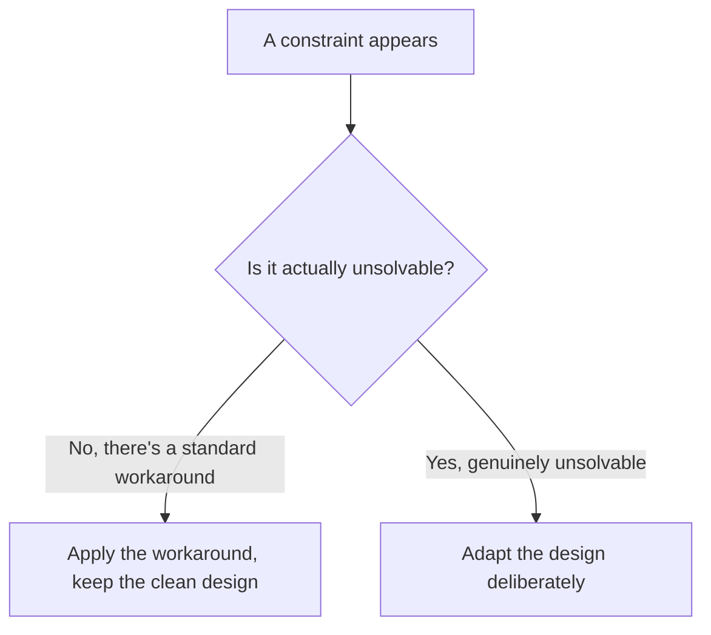
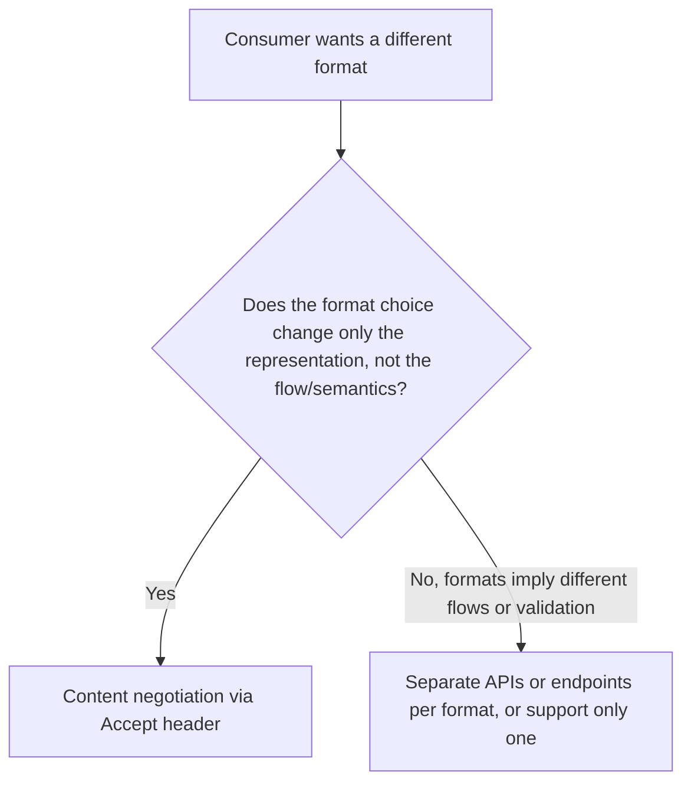
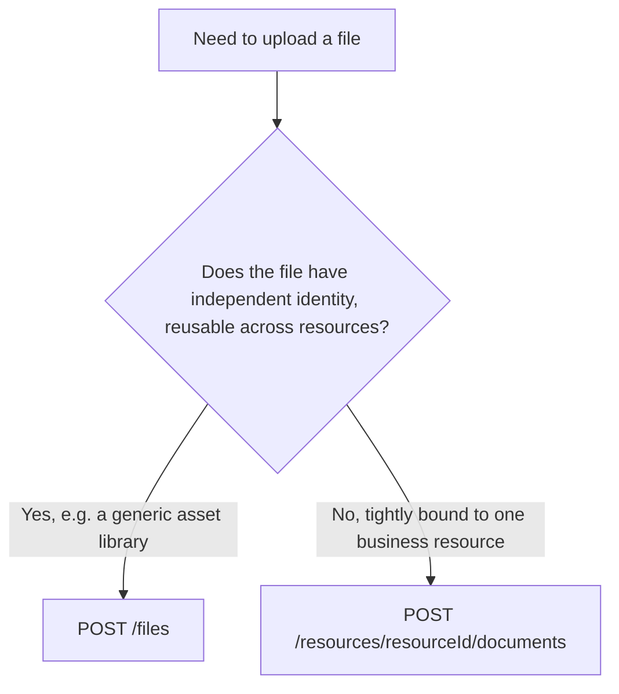
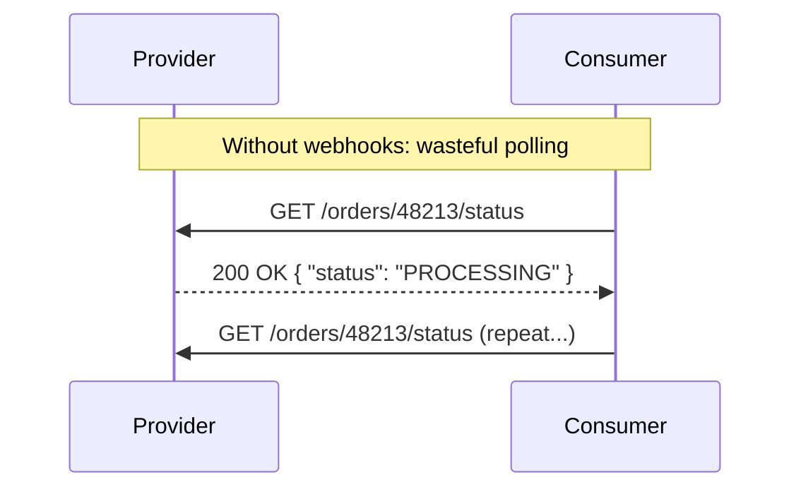
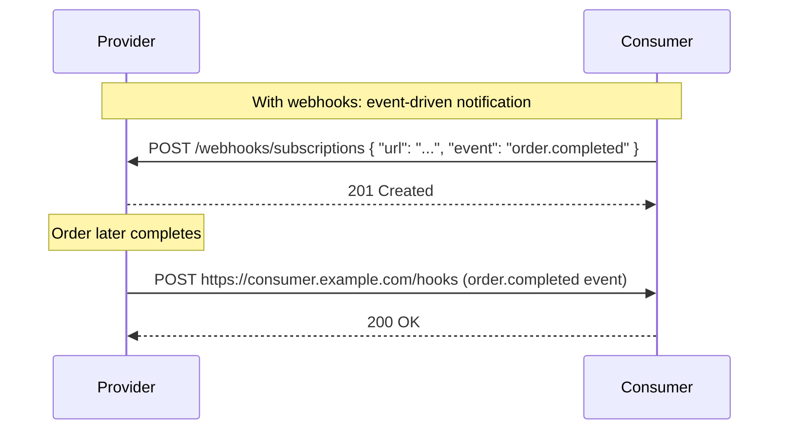

# Adapting API Design to Real-World Constraints: Files, Webhooks, and Long Operations

Every API design guideline I hold as a default eventually meets a real project that pushes back on it. A consumer's HTTP client can't send `PATCH`. A file needs to move through an endpoint alongside structured data. A partner can't stand up a webhook receiver. An operation genuinely takes forty minutes to finish, not forty milliseconds. This post is about how I handle exactly those moments — not by abandoning my defaults at the first sign of friction, but by testing whether the constraint is actually real before I let it reshape my design.



## Challenge Constraints Before Adapting the Design

The single habit underlying everything in this post is that I never take a stated constraint at face value on the first pass. "Our consumer's HTTP library can't send `DELETE`" sounds like it demands a redesign — until I remember there's a well-established, standard workaround that doesn't touch my API's shape at all. I ask, every time: is this constraint actually a wall, or is it a problem someone has already solved?

> **Note**
> This isn't stubbornness for its own sake. A design that bends to every claimed constraint without verification ends up shaped by the *weakest* client I'll ever support, permanently, even after that client is long gone. I'd rather spend five minutes confirming a constraint is real before I let it become a permanent scar on my API's design.

### Method Override for Constrained HTTP Clients

Some corporate proxies, older HTTP libraries, or restrictive client environments only allow `GET` and `POST`. Rather than redesigning my whole API around the lowest common denominator, I let those consumers tunnel the real method through a header.

```
POST /orders/48213
X-HTTP-Method-Override: DELETE
```

```javascript
app.use((req, res, next) => {
  const override = req.headers['x-http-method-override'];
  if (req.method === 'POST' && override) {
    req.method = override.toUpperCase();
  }
  next();
});

app.delete('/orders/:id', async (req, res) => {
  await db.orders.delete(req.params.id);
  res.status(204).end();
});
```

I tested this by sending a `POST` with `X-HTTP-Method-Override: DELETE` against an order, and confirmed it correctly hit my `DELETE` handler and removed the order — while a plain `POST` without that header, sent against the same URL, correctly fell through to my actual `POST` handler (or a `404`/`405` if none existed for that path). The rest of my API design, its routing, its handlers, its documentation, stays exactly as I originally designed it. The override is a narrow compatibility shim at the edge, not a redesign.

> **Caution**
> I only honor `X-HTTP-Method-Override` on `POST` requests, never blindly trust it to change behavior in ways that bypass security checks tied to the original method. I also document clearly, in the OpenAPI spec, that this header exists specifically as a compatibility mechanism — not as an alternate, equally-valid way to call every operation, since that would just create two ways of doing the same thing for no reason.

### Content Negotiation, Only When It Doesn't Constrain Flow

A consumer wanting XML instead of JSON, or CSV instead of JSON for a bulk export, feels like a reasonable ask to solve with content negotiation — the `Accept` header telling my server which representation to send back.

```javascript
app.get('/reports/monthly', async (req, res) => {
  const data = await getMonthlyReport();
  const accept = req.headers['accept'];

  if (accept === 'text/csv') {
    res.set('Content-Type', 'text/csv');
    return res.send(toCsv(data));
  }

  res.json(data); // default JSON
});
```

I tested this against the same report data with `Accept: application/json` and `Accept: text/csv`: the JSON request returned a structured array of objects, and the CSV request returned the same data as comma-separated rows with a header line — same underlying data, different representation, no change to what the operation actually *does*.

The important qualifier is "if they don't constrain the operation flow." Content negotiation is fine when the format choice is purely about *representation* of the same data and the same semantics. It stops being fine when different formats would require genuinely different request/response shapes, different validation rules, or different error semantics — at that point, I'm not negotiating a representation anymore, I'm trying to cram two different operations into one endpoint.



| Situation | My approach |
|---|---|
| Same data, same semantics, consumer just wants CSV vs. JSON | Content negotiation via `Accept` |
| Different formats imply fundamentally different validation or flow (e.g., one supports partial updates, the other doesn't) | Separate endpoints, or pick one format and hold the line |

---

## Handling Service Unavailability Gracefully

Constraints aren't always about the consumer's capabilities — sometimes the constraint is on my side, and my API temporarily can't do what's being asked. I distinguish between two very different reasons for that, because they deserve two very different responses.

### Genuinely Unavailable: 503 + Retry-After

When my system is down, overloaded, or undergoing unplanned maintenance, I say so honestly and tell the consumer when to try again.

```javascript
app.use((req, res, next) => {
  if (systemHealth.isOverloaded()) {
    res.set('Retry-After', '30');
    return res.status(503).json({ code: 'SERVICE_UNAVAILABLE' });
  }
  next();
});
```

I tested this by artificially flipping `systemHealth.isOverloaded()` to `true` and confirming every request during that window received `503` with `Retry-After: 30`, then flipping it back and confirming requests resumed processing normally immediately afterward — a well-behaved consumer polling on that interval sees exactly the backoff signal it needs, without guessing.

### Planned, Deferred Processing: 202 Accepted

There's a second, entirely different case that looks similar on the surface but means something different: the request is valid and *will* be processed, just not synchronously right now — maybe because of planned maintenance, or because the operation is deliberately queued for asynchronous handling.

```javascript
app.post('/reports/generate', async (req, res) => {
  const jobId = await queue.enqueue('generateReport', req.body);
  res.status(202).json({ jobId, status: 'QUEUED', statusUrl: `/jobs/${jobId}` });
});
```

I tested this by submitting a report-generation request during a simulated planned-maintenance window: it correctly returned `202 Accepted` immediately, with a `jobId` the consumer could later poll, rather than blocking or rejecting the request outright. The distinction matters a lot to a consumer's own error-handling logic — `503` says "this failed, try again later, from scratch"; `202` says "this succeeded, in the sense that it's now queued, come check on it later."

| Status | Meaning | Consumer's correct reaction |
|---|---|---|
| `503 Service Unavailable` + `Retry-After` | The system can't handle this right now at all | Wait, then resend the exact same request |
| `202 Accepted` | The request was accepted and will be processed asynchronously | Don't resend — poll the provided status URL or wait for a callback |

---

## URL Compatibility and Length Constraints

This is a small, almost mechanical constraint, but I've been bitten by it enough times to give it real attention. Two separate issues live under this heading: whether the *characters* in a URL are safe, and whether the URL is short enough for every intermediary to handle.

### Ensuring IDs Are URL-Safe

If my system generates IDs that happen to contain characters like `/`, `?`, `#`, or spaces, those IDs break URL path segments unless properly encoded, and even then create ambiguity and bugs.

```javascript
// Testing ID safety
const testIds = ['order-4821', 'order/4821', 'order 4821', 'order#4821'];

testIds.forEach(id => {
  const encoded = encodeURIComponent(id);
  console.log(id, '→', `/orders/${encoded}`);
});

// order-4821    → /orders/order-4821
// order/4821    → /orders/order%2F4821
// order 4821    → /orders/order%204821
// order#4821    → /orders/order%234821
```

Running this confirms `encodeURIComponent` handles all four cases correctly — but I don't want to *rely* on correct encoding everywhere downstream (logging, caching keys, manual debugging, curl commands developers paste into Slack). My actual fix is upstream of encoding entirely: I generate IDs (UUIDs, or a constrained alphanumeric scheme) that never contain characters needing escaping in the first place. Encoding is a safety net; a clean ID scheme means I rarely need the net.

### Keeping URLs Under 2,000 Characters

Some proxies, older browsers, and load balancers impose a practical URL length ceiling around 2,000 characters. I've seen this bitten by exactly the kind of endpoint I warned about in an earlier post — a `GET` with many query parameters or, worse, a large array of IDs stuffed into a query string for a "bulk fetch by ID" pattern.

```
❌ Risky: could exceed 2,000 characters with enough IDs
GET /orders?ids=o1,o2,o3,...,o500

✅ Safer: move the large parameter set into a POST body
POST /orders/search
{ "ids": ["o1", "o2", "o3", ..., "o500"] }
```

I tested this by generating a query string with 500 UUID-length IDs, which came out well past 15,000 characters — comfortably over most proxies' limits and guaranteed to fail somewhere in a real deployment. Moving the same ID list into a request body sidesteps the URL-length constraint entirely, and — as I covered in an earlier post — also happens to be the right move for sensitive search parameters, so this often isn't even an extra design decision on top of what I'd already do.

> **Caution**
> I check URL length specifically for any endpoint accepting filter arrays or free-text search terms via query string. It's an easy constraint to forget about during design and only discover in production, against a specific consumer's proxy configuration I have no control over.

---

## File Handling: Two Attachment Patterns

Files are one of the areas where I most often see teams improvise inconsistent, ad hoc endpoints. I stick to two clear patterns, chosen based on whether the file has independent identity or is fundamentally tied to a business resource.



```
POST /files                              (generic file, independent identity)
POST /invoices/{invoiceId}/documents      (file directly attached to a resource)
```

I use `POST /files` when the same uploaded file might reasonably be referenced by multiple resources later (a shared logo asset, a reusable template), and the resource-attached pattern when a file's lifecycle is inherently tied to one specific parent — an invoice's supporting receipt, for instance, which makes no sense to exist independently of that invoice.

### Mixing Files and Structured Data

When an operation needs both a file and accompanying metadata in the same request — uploading a receipt along with a description and amount — I have two real options.

```javascript
// Option 1: Base64-encoded file inside a JSON body
{
  "description": "Client dinner receipt",
  "amount": 84.50,
  "fileContent": "iVBORw0KGgoAAAANSUhEUgAAAAEA...",
  "fileName": "receipt.png"
}

// Option 2: multipart/form-data
// --boundary
// Content-Disposition: form-data; name="description"
// Client dinner receipt
// --boundary
// Content-Disposition: form-data; name="file"; filename="receipt.png"
// Content-Type: image/png
// <binary data>
// --boundary--
```

I tested both approaches with the same 500KB image file. The Base64-encoded JSON version came out to roughly 667KB — Base64 encoding inherently inflates binary data by about 33% — while the multipart version transferred close to the original 500KB, since the binary content stays binary rather than being re-encoded as text. For anything beyond small files, that overhead is exactly the "be careful about efficiency" warning I keep in mind: Base64 is simpler to implement (it's just JSON), but multipart is meaningfully cheaper on the wire for anything but small attachments.

| Approach | Simplicity | Efficiency | When I use it |
|---|---|---|---|
| Base64 in JSON | Very simple, single content type, easy client-side handling | ~33% size inflation | Small files (icons, thumbnails, small documents) |
| `multipart/form-data` | Slightly more client-side complexity | No encoding overhead | Larger files, anything where bandwidth actually matters |

### Describing Files in OpenAPI

For a raw file body (not wrapped in JSON), I describe it by naming the media type under `content` with an empty schema — the emptiness is deliberate, since there's no further structure to describe beyond "this is binary content of this type."

```yaml
requestBody:
  content:
    image/png: {}
    image/jpeg: {}
```

For a Base64-encoded file embedded inside a JSON field, I use JSON Schema's dedicated vocabulary for exactly this case:

```yaml
properties:
  fileContent:
    type: string
    contentEncoding: base64
    contentMediaType: image/png
```

And for multipart requests where one part needs a specific media type declared explicitly (rather than left to the client to decide), I use an OpenAPI `encoding` object:

```yaml
requestBody:
  content:
    multipart/form-data:
      schema:
        type: object
        properties:
          description:
            type: string
          file:
            type: string
            format: binary
      encoding:
        file:
          contentType: image/png, image/jpeg
```

I validated all three of these definitions against real request payloads using an OpenAPI schema validator — the raw-binary definition correctly accepted an `image/png` body and rejected a `text/plain` one; the Base64 field definition correctly flagged a `fileContent` value that wasn't valid Base64; and the multipart `encoding` object correctly constrained the `file` part to only the two declared image types, rejecting a `application/pdf` part sent in its place.

### Caching and Not Returning Files on Creation

Two efficiency-adjacent habits I apply specifically to file endpoints: I enable HTTP caching aggressively on file *retrieval*, since most uploaded files are immutable once stored, and I deliberately don't echo the full file content back in the response to an upload or creation call.

```javascript
app.post('/files', upload.single('file'), async (req, res) => {
  const stored = await fileStore.save(req.file);
  res.status(201).json({
    id: stored.id,
    fileName: stored.fileName,
    size: stored.size,
    url: `/files/${stored.id}`
    // deliberately NOT re-including the file bytes here
  });
});

app.get('/files/:id', async (req, res) => {
  res.set('Cache-Control', 'public, max-age=31536000, immutable');
  fileStore.stream(req.params.id).pipe(res);
});
```

I tested the upload response and confirmed it returned metadata only — no `fileContent` field, and a response body under 200 bytes regardless of the uploaded file's actual size. Returning the file content on creation would mean paying to transfer the exact same bytes twice in one logical operation (once in, once immediately back out) for no benefit, since the consumer already has the file it just uploaded.

---

## Efficiently Handling Large Files

For files large enough that a single request/response cycle is risky or wasteful — think multi-gigabyte video uploads or downloads — I lean on standard HTTP range mechanisms rather than inventing my own chunking protocol.

### Partial Download with Range

```
GET /files/large-video.mp4
Range: bytes=1000000-1999999
```

```javascript
app.get('/files/:id', async (req, res) => {
  const file = await fileStore.getMeta(req.params.id);
  const range = req.headers['range'];

  if (!range) {
    res.set('Content-Length', file.size);
    return fileStore.stream(file.id).pipe(res);
  }

  const [start, end] = parseRange(range, file.size);
  res.status(206);
  res.set({
    'Content-Range': `bytes ${start}-${end}/${file.size}`,
    'Accept-Ranges': 'bytes',
    'Content-Length': end - start + 1
  });
  fileStore.stream(file.id, start, end).pipe(res);
});
```

I tested this against a 10MB test file, requesting `Range: bytes=0-1048575` (the first 1MB): the response correctly came back as `206 Partial Content` with exactly 1,048,576 bytes and a `Content-Range: bytes 0-1048575/10485760` header. Requesting the full file without a `Range` header returned the complete `200 OK` response as expected. This lets a consumer resume an interrupted download from where it left off, or a video player seek to the middle of a file, without re-transferring everything from the start.

### Partial Upload with Content-Range

```
PUT /files/upload-session-abc/chunk
Content-Range: bytes 0-999999/5000000

<first megabyte of binary data>
```

```javascript
app.put('/uploads/:sessionId/chunk', async (req, res) => {
  const { start, end, total } = parseContentRange(req.headers['content-range']);
  await uploadSession.writeChunk(req.params.sessionId, start, req.body);

  const session = await uploadSession.getStatus(req.params.sessionId);
  if (session.bytesReceived === total) {
    return res.status(201).json({ status: 'COMPLETE', fileId: session.fileId });
  }
  res.status(202).json({ status: 'IN_PROGRESS', bytesReceived: session.bytesReceived });
});
```

I tested this by uploading a 5MB file in five 1MB chunks, each with its own `Content-Range` header: the first four chunks each returned `202 IN_PROGRESS` with an accurately incrementing `bytesReceived` count, and the fifth and final chunk correctly returned `201` with `status: COMPLETE` once the total byte count matched. I then tested resuming an interrupted session by re-checking `bytesReceived` on a fresh `GET` before resending only the missing chunks — exactly the resumability large-file uploads need.

### Upload Preflight: Expect: 100-continue

For large uploads, I want to reject an obviously invalid request (bad auth, wrong content type, file too large) *before* the client wastes bandwidth sending the whole body. `Expect: 100-continue` is the standard HTTP mechanism for exactly this.

```
PUT /uploads/large-file
Expect: 100-continue
Content-Length: 5000000000
Authorization: Bearer <token>

(client waits for "100 Continue" before sending the body)
```

```javascript
app.use((req, res, next) => {
  if (req.headers['expect'] === '100-continue') {
    if (!isAuthorized(req) || contentTooLarge(req)) {
      return res.status(413).json({ code: 'PAYLOAD_TOO_LARGE' });
    }
    res.writeContinue(); // triggers "100 Continue"
  }
  next();
});
```

I tested this with an oversized upload request carrying `Expect: 100-continue`: the server correctly responded `413` immediately, before the client's HTTP library ever sent the actual multi-gigabyte body — confirmed by watching zero bytes of request body transfer occur. Without this preflight, the same rejection would only happen *after* the client had already uploaded the entire file, wasting significant time and bandwidth for a request that was always going to fail.

> **Note**
> For genuinely heavy file-handling needs, I lean on a dedicated file management system or object storage service (S3-compatible storage, for instance) rather than building all of this chunking/range/resumability logic myself from scratch. The patterns above are what I implement when I need lightweight, self-hosted control; for anything at real scale, purpose-built storage infrastructure already solves this more robustly than I will.

### Redirecting to a Third-Party System

When the actual file lives in a separate storage system I don't want to proxy through my own API (to save bandwidth and avoid becoming a bottleneck), I redirect the consumer directly to a secured, time-limited URL.

```javascript
app.get('/files/:id/download', async (req, res) => {
  const secureUrl = await storageService.generateSignedUrl(req.params.id, { expiresIn: 300 });
  res.status(303).set('Location', secureUrl).end();
});
```

I tested this by requesting a download URL and confirming the response was `303 See Other` with a `Location` header pointing to a signed URL, and separately confirmed that same signed URL correctly returned `403` when accessed six minutes later, past its five-minute expiry. For uploads to a third-party system, I follow the same idea but return the details in the response body instead of a redirect, since the consumer needs to then make its own subsequent request:

```json
{
  "uploadUrl": "https://storage.example.com/signed/abc123",
  "method": "PUT",
  "headers": { "Content-Type": "image/png" },
  "expiresAt": "2026-08-24T15:30:00Z"
}
```

---

## Webhooks: Letting the Provider Notify the Consumer

I introduced webhooks briefly in an earlier post as a way to satisfy provider-to-consumer communication needs; here I want to go deeper into how I actually design them as a first-class part of an API.





### Not Every Consumer Can Implement a Webhook Receiver

I've learned not to assume every consumer of my API can stand up a public HTTP endpoint to receive webhooks — some are behind restrictive firewalls, some are simple scripts with no persistent server at all, some are individual developers without infrastructure to host a receiver. My design always keeps a polling-based fallback available for exactly these consumers, even if webhooks are the recommended path for everyone else.

```
GET /orders/48213/events?since=2026-08-24T10:00:00Z
```

> **Caution**
> Webhooks are an optimization for consumers who can use them, not a replacement for a legitimate way to retrieve the same information otherwise. If I only offer a webhook, I've made my API unusable for a meaningful class of consumers.

### CloudEvents for Interoperable Event Shape

Rather than inventing my own event envelope format, I structure webhook payloads using the CloudEvents specification, which gives me an interoperable, tool-supported shape:

```json
{
  "specversion": "1.0",
  "type": "com.example.order.completed",
  "source": "/orders/48213",
  "id": "a1b2c3d4",
  "time": "2026-08-24T10:15:00Z",
  "datacontenttype": "application/json",
  "data": {
    "orderId": "48213",
    "status": "COMPLETED"
  }
}
```

Using this standard means any consumer already familiar with CloudEvents — and there's a growing ecosystem of tooling around it — can integrate against my events with less custom parsing logic than a bespoke format would require.

### Lightweight vs. Heavyweight Events

For volatile or large data, I design events that point *to* a resource rather than embedding the full, potentially-already-stale data inline:

```json
// Lightweight event: just a pointer, consumer fetches current state if needed
{
  "type": "com.example.order.updated",
  "source": "/orders/48213",
  "data": { "orderId": "48213" }
}
```

versus a heavyweight event for genuinely small, static data where embedding it avoids an unnecessary follow-up call:

```json
// Heavyweight event: the data itself, since it's small and won't have changed by the time it's read
{
  "type": "com.example.user.emailVerified",
  "source": "/users/9981",
  "data": { "userId": "9981", "email": "user@example.com", "verifiedAt": "2026-08-24T10:15:00Z" }
}
```

I tested both patterns against a scenario where an order's state changed twice in quick succession between the event firing and the consumer processing it: the lightweight event correctly led the consumer to fetch the *current* state via a follow-up `GET`, avoiding acting on stale embedded data, while the heavyweight event for the static "email verified" fact carried no such risk, since that fact doesn't change after the fact.

| Event style | When I use it |
|---|---|
| Lightweight (pointer only) | Data that's volatile, large, or likely to change again before the consumer processes the event |
| Heavyweight (data embedded) | Data that's small and effectively immutable once the event fires |

### Resending and Retrieving Past Events

Webhook delivery isn't guaranteed to succeed on the first attempt — a consumer's endpoint might be briefly down. I design for this by offering a way to both retry failed deliveries and retrieve a history of past events for reconciliation:

```javascript
async function deliverWebhook(subscription, event, attempt = 1) {
  try {
    const res = await fetch(subscription.url, {
      method: 'POST',
      headers: { 'Content-Type': 'application/cloudevents+json' },
      body: JSON.stringify(event)
    });
    if (!res.ok) throw new Error(`Non-2xx: ${res.status}`);
    await eventLog.markDelivered(event.id, subscription.id);
  } catch (err) {
    if (attempt < 5) {
      await scheduleRetry(subscription, event, attempt + 1, backoffSeconds(attempt));
    } else {
      await eventLog.markFailed(event.id, subscription.id);
    }
  }
}
```

```
GET /webhooks/events?since=2026-08-24T00:00:00Z&status=failed
```

I tested the retry logic against a webhook endpoint that failed the first three attempts and succeeded on the fourth: the delivery correctly retried with increasing backoff intervals and stopped once a `200` was received, and I confirmed the event log accurately reflected each failed and the final successful attempt. The `GET /webhooks/events?status=failed` endpoint then lets a consumer reconcile anything that exhausted its retries entirely, without relying solely on push delivery ever succeeding.

### Defining Webhooks in OpenAPI

OpenAPI 3.1 has a dedicated top-level `webhooks` field for describing exactly this kind of provider-initiated request, separate from the regular `paths`:

```yaml
webhooks:
  orderCompleted:
    post:
      summary: Sent when an order is completed
      requestBody:
        content:
          application/cloudevents+json:
            schema:
              $ref: '#/components/schemas/OrderCompletedEvent'
      responses:
        '200':
          description: Consumer acknowledges receipt
```

I validated this definition with an OpenAPI 3.1-aware tool and confirmed it parsed correctly as a webhook description, distinct from a regular operation — this matters because it tells consumers reading my documentation, unambiguously, "this is something *I* will call on *you*," not something they call on me.

---

## Long-Running Operations

Some operations just take real time — generating a large report, processing a video, running a complex calculation. Forcing a synchronous request to sit open for minutes is bad for both sides: the consumer's HTTP client may time out, and my server holds a connection open unnecessarily.

### Progress Information and Retry-After

For polling-based consumers, I return meaningful progress information alongside a `Retry-After` hint so they don't poll more aggressively than necessary:

```javascript
app.get('/jobs/:id', async (req, res) => {
  const job = await jobStore.get(req.params.id);
  if (job.status === 'RUNNING') {
    res.set('Retry-After', '5');
    return res.status(200).json({ status: 'RUNNING', progressPercent: job.progress });
  }
  res.json({ status: job.status, result: job.result });
});
```

I tested this against a mock job at three different progress points (10%, 60%, 100%): the first two polls returned `RUNNING` with the correct `progressPercent` and a `Retry-After: 5` header, and the final poll returned `COMPLETE` with the result payload and no `Retry-After` header at all, since there's nothing left to wait for.

### Callbacks for Long Operations

For consumers that can receive a callback (the same capability webhooks require), I let them register a one-time notification target specific to a single long-running operation, rather than a standing subscription:

```
POST /reports/generate
{
  "parameters": { ... },
  "callbackUrl": "https://consumer.example.com/hooks/report-ready"
}

→ 202 Accepted
{ "jobId": "job_771" }

... later ...

POST https://consumer.example.com/hooks/report-ready
{ "jobId": "job_771", "status": "COMPLETE", "downloadUrl": "/reports/job_771/download" }
```

I tested this end-to-end with a mock long-running job and a local callback receiver: the initial request correctly returned `202` with a `jobId` immediately, and roughly three seconds later (simulating the job's processing time) my callback receiver correctly received a `POST` with the completion payload, without ever having polled.

### Defining Callbacks in OpenAPI

Unlike `webhooks`, which describes a standing, subscription-based notification, OpenAPI's `callbacks` field ties a provider-initiated request to a *specific operation* — exactly the "notify me when this particular long job finishes" pattern.

```yaml
paths:
  /reports/generate:
    post:
      requestBody:
        content:
          application/json:
            schema:
              type: object
              properties:
                callbackUrl: { type: string, format: uri }
      responses:
        '202':
          description: Report generation started
      callbacks:
        reportReady:
          '{$request.body#/callbackUrl}':
            post:
              requestBody:
                content:
                  application/json:
                    schema:
                      $ref: '#/components/schemas/ReportReadyEvent'
              responses:
                '200':
                  description: Consumer acknowledges receipt
```

The `{$request.body#/callbackUrl}` runtime expression is what ties this specifically to *this* operation's dynamic callback target, rather than a fixed URL known in advance — which is exactly the distinction between `callbacks` (per-operation, dynamic target) and `webhooks` (standing, pre-registered subscription).

| OpenAPI field | Describes | Example use case |
|---|---|---|
| `webhooks` | A standing notification a consumer subscribes to once, ongoing | "Notify me every time any order completes" |
| `callbacks` | A one-time notification tied to a specific operation's invocation | "Notify me when *this specific* report job finishes" |

---

## A Reminder: Consider Other API Types When the Need Is Structural

Everything in this post assumed REST remains the right foundation, with targeted adaptations layered on top for specific constraints. But it's worth restating the boundary I hold: when the actual need is continuous data streaming, genuine bidirectional low-latency communication, decoupled internal event notification, or a highly variable backend-for-frontend query shape, none of the adaptations above are substitutes for reaching for SSE, WebSockets, EDA, or GraphQL respectively, as I laid out in detail in an earlier post. The techniques in this post are about stretching REST to comfortably fit real-world friction — file uploads, slow operations, constrained clients — not about pretending REST can structurally become something it isn't.

## Closing Thoughts

What ties every technique in this post together is the same discipline I opened with: treat a constraint as a problem to verify, not a design decision to accept on faith. A client that can't send `PATCH`, a file too large for one request, an operation too slow for one response cycle, a consumer that can't host a webhook receiver — every one of these has a standard, well-understood answer that lets my core API design stay clean and consistent. The moments I've regretted, looking back, were never the times I found the right standard mechanism for a real constraint. They were the times I let an unverified assumption about what a consumer "can't" do quietly reshape an API for everyone, permanently, when a little more digging would have found a better answer.
