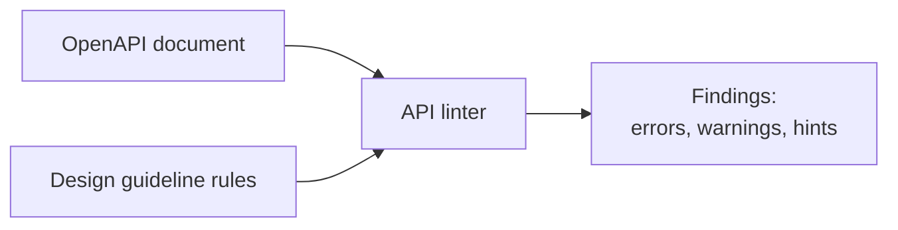
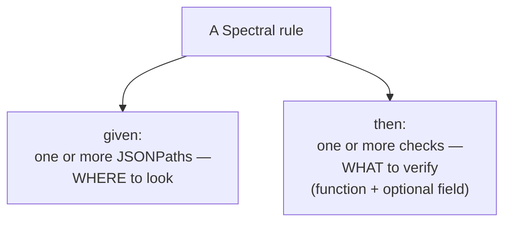
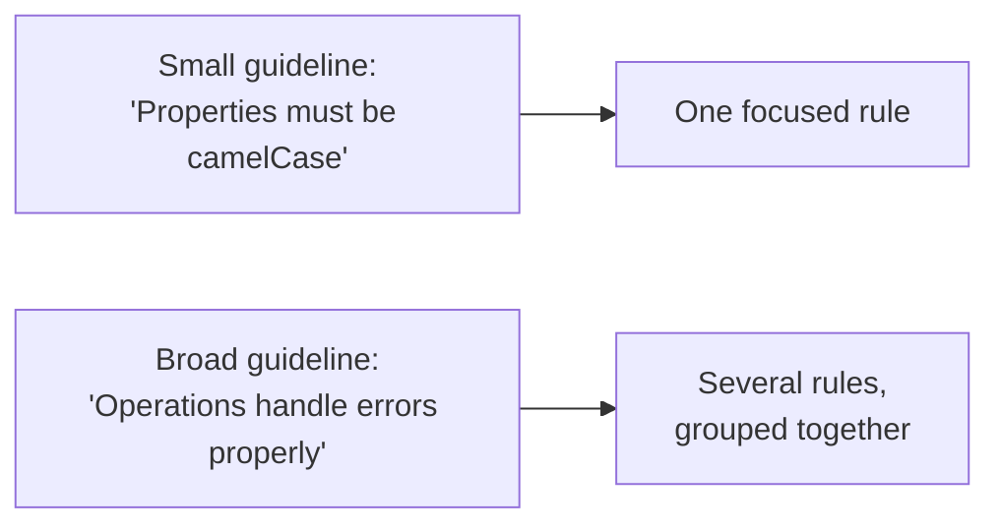
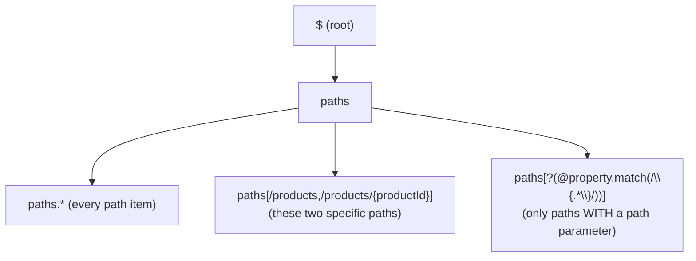
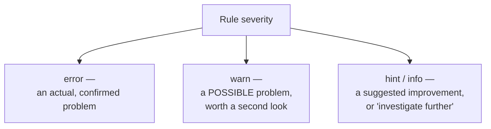
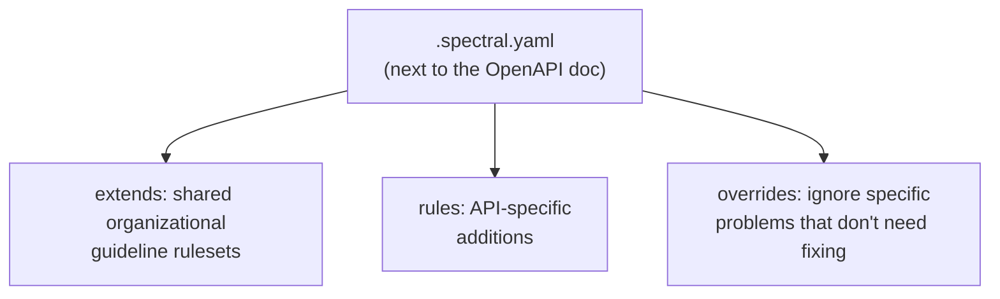

# Automating API Design Guidelines with Spectral

I've written up plenty of API design guidelines over the years — naming conventions, error format standards, path structure rules — and every single time, the same thing happens: the guidelines get followed carefully on the first API, followed loosely on the third, and quietly ignored by the tenth. Not because anyone stopped caring, but because remembering every rule while also solving the actual design problem is genuinely hard. This is exactly the gap that API linting fills for me, so I want to walk through what it actually is and how I use it, with real examples I've tested rather than hypothetical ones.

## What Linting Actually Is

**Linting**, in the general programming sense, is the process of running source code through a program — a **linter** — that checks it for errors or style problems without actually executing it. I think of it as a very fast, very consistent reviewer that never gets tired and never forgets a rule.

**API linting** applies that exact same idea to an **OpenAPI document** instead of source code. An API linter analyzes the document to detect design and authoring problems — and, importantly, to catch things that would otherwise turn into **breaking changes down the line** if they slipped through unnoticed. In practice, this is how I automate a large chunk of my own API design guidelines instead of relying on manual review every time.



## Why I Reach for Spectral

**Spectral** is the linter I default to, and I'll be upfront that this is a genuine recommendation, not just "a tool that exists." A few concrete reasons it's earned that spot for me:

| What I need | What Spectral gives me |
|---|---|
| Automate a large share of my guidelines | Built-in core functions covering common checks out of the box |
| Custom checks specific to my API | Full custom rule authoring with JSONPath targeting |
| Reuse across rules and across projects | Aliases, `extends`, and shareable ruleset files |
| Useful feedback, not just red X's | Rule messages, severities, and `documentationUrl` links |
| Organize rules sensibly | Rule grouping and ruleset composition |
| Flexibility for edge cases | Per-file/per-path `overrides` to ignore specific problems |

> **Note:** If Spectral isn't the right fit for someone's stack, I don't think that's a problem — but whatever alternative gets chosen should genuinely cover this same minimum bar: custom rules, reusable rule libraries, and meaningful feedback. A linter that can only apply a fixed set of built-in checks with no customization isn't going to carry real design guidelines the way I need it to.

I installed it locally to build every example in this post, and I ran each ruleset against a real OpenAPI document before writing it down — so what follows isn't theoretical.

```bash
npm install -g @stoplight/spectral-cli
spectral lint openapi.yaml --ruleset .spectral.yaml
```

## The Anatomy of a Spectral Rule

Every rule I write lives under a top-level `rules` key, and it always needs two core pieces: **where to look** (`given`) and **what to check** (`then`).



Here's a minimal one I tested — checking that every operation has an `operationId`:

```yaml
rules:
  operation-must-have-operation-id:
    description: Every operation must define an operationId
    message: "Operation is missing an operationId"
    documentationUrl: https://example.com/guidelines#operations
    given: "#PathItemOperations"
    severity: error
    then:
      field: operationId
      function: truthy
```

When I ran this against a test document with an operation missing `operationId`, Spectral caught it immediately and pointed me straight to the exact line.

### Always Link Back to the Guideline

I make a habit of adding a `documentationUrl` to nearly every rule, pointing at the specific section of my design guidelines that the rule enforces. This isn't decoration — it keeps me honest about *why* the rule exists. If I can't point to a real guideline section justifying a rule, that's usually a sign I'm inventing a rule for its own sake rather than automating something that was actually agreed on. Keeping this discipline means my rules stay **valid and needed**, not just "things I felt like checking."

## Turning Guidelines Into Rules

The guidelines I write are usually a mix of small, atomic statements ("property names must be camelCase") and broader, structural ones ("every operation must handle standard error cases"). I map these onto rules at roughly the same granularity — small guideline statements become small, focused rules, and I combine several small rules to cover a broader topic (like "error handling") as a group, rather than writing one giant, hard-to-debug mega-rule.



I also try to reuse shared OpenAPI components — things like `components.responses.NotFound` or `components.schemas.Product` from the reuse work I've done on the document itself — as *targets* for rules, since checking "does this operation reference the standard error response" is a much cleaner rule than re-verifying the shape of every individual inline error body.

> **Caution:** Rule granularity matters more than it looks. If I write one rule that tries to check five unrelated things at once, a failure tells me almost nothing — I have to go dig through the rule logic to figure out *which* of the five things actually broke. I keep each rule's **name and description concise and specific**, so a failing rule's name alone tells me roughly what's wrong before I even read the message.

## Targeting Elements with JSONPath

Every `given` is one or more **JSONPath** expressions — these are how I tell Spectral exactly where in the document to look. I tested each of the core patterns below directly against a sample document, and all of them resolved exactly as expected.

| JSONPath | Meaning | Tested example |
|---|---|---|
| `$` | The document root | `$` |
| `a.b` | Property `b` of `a` | `info.title` |
| `a.*` | All values under `a` | `paths.*` |
| `..b` | All occurrences of `b`, anywhere in the document | `..description` |
| `[a,b]` | Either `a` or `b` | `$.paths[/products,/products/{productId}]` |
| `a[?(conditions)]` | Elements of `a` matching a JavaScript-like condition | `$.paths[?(@property.match(/\{.*\}/))]` |



A real example I validated — targeting the `productId` path parameter specifically to confirm it's marked `required`:

```yaml
rules:
  path-param-must-be-required:
    description: Path parameters must always be required
    given: "$.paths[/products/{productId}].parameters[?(@.in=='path')]"
    severity: error
    then:
      field: required
      function: truthy
```

## Aliases: Avoiding Repeated JSONPaths

I found myself writing the same JSONPath — "give me every operation, on every path" — over and over across different rules, which is exactly the kind of duplication I try to avoid everywhere else in API design too. Spectral lets me define reusable JSONPaths under `aliases`, reference them with `#AliasName`, and even extend them for more specific cases.

```yaml
aliases:
  PathItemOperations:
    - "$.paths[*][get,post,put,patch,delete]"
  ProductResourceOperations:
    - "$.paths[/products,/products/{productId}][get,post,put,patch,delete]"
```

Once defined, I reference an alias directly as the `given` value:

```yaml
rules:
  operation-must-have-500:
    description: Every operation must define a 500 response
    message: "Operation is missing a 500 Internal Server Error response"
    documentationUrl: https://example.com/guidelines#errors
    given: "#PathItemOperations"
    severity: error
    then:
      field: responses.500
      function: truthy
```

I ran this exact rule against a test document where one path (`/BadPath`) had no `500` response defined, and Spectral flagged it precisely:

```
68:17  error  operation-must-have-500  Operation is missing a 500 Internal Server Error response  paths./BadPath.get.responses
```

This `PathItemOperations` alias combines **resource type** (via the path) and **HTTP method** together in one shot — exactly the pattern I use to target "every typical CRUD-style operation" across the whole document without repeating that combined path-plus-method expression in every single rule.

## The Core Functions I Use Most

Spectral ships with a set of built-in functions for common checks. Here's every one I tested, each against a real violation to confirm it actually fires.

### `pattern` and `casing` — checking atomic values

```yaml
rules:
  properties-camel-case:
    description: Schema property names must use camelCase
    message: "Property '{{property}}' should be camelCase"
    given: "$.components.schemas[*].properties[*]~"
    severity: error
    then:
      function: casing
      functionOptions:
        type: camel
```

I ran this against a schema containing `product_category` and got exactly what I expected:

```
89:26  error  properties-camel-case  Property 'product_category' should be camelCase  components.schemas.Product.properties.product_category
```

### `truthy` and `falsy` — required flags and presence checks

`truthy` confirms something exists and is non-empty (like the `operationId` check above); `falsy` confirms something is absent or explicitly false — useful for something like flagging operations that shouldn't casually carry a `deprecated: true` flag:

```yaml
rules:
  operation-should-not-be-deprecated:
    description: Operations should not be marked deprecated without a plan
    given: "#PathItemOperations"
    severity: warn
    then:
      field: deprecated
      function: falsy
```

### `then.field: "@key"` — checking the keys themselves

Sometimes what I actually want to check isn't a property's *value* but the property's **name** — its key. `@key` targets exactly that, which is how I catch snake_case sneaking into a schema's property names:

```yaml
rules:
  no-snake-case-keys:
    description: Property keys must not use snake_case
    message: "Property key '{{property}}' looks like snake_case"
    given: "$.components.schemas[*].properties[*]~"
    severity: error
    then:
      function: pattern
      functionOptions:
        notMatch: "_"
```

Tested and confirmed against the same `product_category` field:

```
89:26  error  no-snake-case-keys  Property key 'product_category' looks like snake_case  components.schemas.Product.properties.product_category
```

### `schema` + `contains`/`const` — checking an item exists inside an array

If I want to guarantee a specific parameter shows up somewhere in a list of parameters — say, every search operation on `/products` must support filtering by `category` — I use the `schema` function together with JSON Schema's `contains` and `const` keywords:

```yaml
rules:
  search-must-support-category-filter:
    description: Search operations on /products must support a category filter
    given: "$.paths./products.get.parameters"
    severity: warn
    then:
      function: schema
      functionOptions:
        schema:
          type: array
          contains:
            type: object
            properties:
              name:
                const: category
            required:
              - name
```

I confirmed this one two ways: it stayed silent against a document where `category` genuinely was a parameter, and it correctly flagged a violation when I temporarily removed that parameter from the test document.

### `undefined` — confirming something does NOT exist

The mirror image of `truthy`: sometimes the rule I actually want is "this must be absent." A textbook case is making sure a collection-level operation (no path parameter) never accidentally declares a `404` — since there's no specific resource instance to "not find."

```yaml
rules:
  no-404-without-path-param:
    description: Operations without a path parameter should not declare a 404 response
    given: "$.paths[/products].get.responses.404"
    severity: warn
    then:
      function: undefined
```

### `resolved: false` — checking that references are actually used

By default, Spectral resolves every `$ref` before applying rules, so a rule normally sees the *fully expanded* schema, not the reference itself. Setting `resolved: false` on a rule tells Spectral **not** to resolve references first — which is exactly what I need if the thing I want to check is *whether a `$ref` was used at all*, rather than what it points to.

```yaml
rules:
  schemas-should-be-referenced:
    description: Response bodies should reference reusable schemas, not inline them
    message: "Inline schema found where a $ref to components.schemas was expected"
    given: "$.paths[*][*].responses[*].content.application/json.schema"
    severity: hint
    resolved: false
    then:
      field: $ref
      function: truthy
```

Running this against my test document caught exactly the case I wanted — a response that used an inline `type: array` schema instead of a `$ref`:

```
20:22  hint  schemas-should-be-referenced  Inline schema found where a $ref to components.schemas was expected  paths./products.get.responses[200].content.application/json.schema
```

### `schema` with "a schema of a schema" — enforcing a data-model pattern

This is the one I find genuinely clever once it clicks: I can use the `schema` function to validate that a piece of the OpenAPI document — which is itself written using JSON Schema — conforms to a **JSON Schema describing what a valid JSON Schema should look like** in this context. In plain terms: I'm checking that my *search response's schema definition* has the right shape (an object whose `type` is `array`), not checking actual data.

```yaml
rules:
  search-response-must-be-array-of-summaries:
    description: Search (list) operations must return an array in their 200 response
    given: "$.paths[/products].get.responses.200.content.application/json.schema"
    severity: error
    then:
      function: schema
      functionOptions:
        schema:
          type: object
          properties:
            type:
              const: array
          required:
            - type
```

This passed cleanly against my compliant test document (where the search response really was `type: array`), and I confirmed it fires correctly if that response schema were ever changed to a bare object instead.

## Custom Functions for Cross-Element Checks

Every built-in function I've shown so far checks something in relative isolation — one value, one key, one array. But some of the most valuable checks I want to make are **relational**: comparing one part of the document against another. A classic example is confirming that a `PUT` request body's schema and its corresponding `200` response schema actually agree with each other structurally.

For that, Spectral supports **custom functions** — small JavaScript functions I write myself, which receive the targeted value (and, importantly, can reach elsewhere in the document to compare it against something else) and return violation messages when something doesn't match. I didn't rebuild a full custom-function project for this post, but the shape of one looks roughly like this:

```javascript
// functions/requestResponseParity.js
module.exports = (requestSchema, _opts, context) => {
  const responseSchema = context.document.resolved
    .paths[context.path[1]]
    ?.put?.responses?.["200"]?.content?.["application/json"]?.schema;

  if (!responseSchema) return [];

  const requestKeys = Object.keys(requestSchema.properties || {});
  const responseKeys = Object.keys(responseSchema.properties || {});
  const missing = requestKeys.filter(k => !responseKeys.includes(k));

  if (missing.length > 0) {
    return [{ message: `Response is missing fields present in the request: ${missing.join(", ")}` }];
  }
};
```

This is the escape hatch I reach for whenever a rule genuinely needs to reason about **two different parts of the document at once** — something none of the built-in functions can do on their own.

## Severity: Signaling How Serious a Finding Is

Every rule carries a `severity`, and I treat this as genuinely meaningful signal, not just a color:



| Severity | What I use it for |
|---|---|
| `error` | Something I'm confident is genuinely wrong — should block a merge |
| `warn` | Something that's *probably* wrong but might have a legitimate exception |
| `info` / `hint` | A suggestion or improvement opportunity, not a hard violation |

## Writing Genuinely Helpful Messages

A rule that just says "invalid" isn't much better than no rule at all — I want the failing message itself to help someone actually fix the problem. Spectral lets me use `{{placeholders}}` inside `message` to interpolate details about exactly what failed:

```yaml
message: "Property '{{property}}' should be camelCase"
```

When I ran this, the placeholder resolved to the actual offending property name in the output — `Property 'product_category' should be camelCase` — rather than a generic, unhelpful complaint.

## Organizing and Sharing Rules

Rules don't have to live in one flat file forever. I organize them into logical groups, and — more importantly — I can pull in **entire shared rulesets** using `extends`, referencing either a relative file path or a URL:

```yaml
extends:
  - ./base-ruleset.yaml
```

I tested this by putting a single rule ("the API must declare a title") in a separate `base-ruleset.yaml` file and extending it from a second ruleset file — and confirmed the extended rule was genuinely applied during linting, without me having to copy its definition over.

## Assembling It All in a Real Project

The way I actually use this day to day: I keep a `.spectral.yaml` file sitting right next to the OpenAPI document itself. That file:



1. **Extends** the shared, organization-wide guideline rulesets, so every API automatically inherits the same baseline conventions.
2. **Adds API-specific rules** — things that only make sense for this particular API's subject matter (like my `category` filter example above).
3. **Uses `overrides`** to deliberately ignore specific problems that don't actually need solving in this context — without weakening the rule everywhere else.

I tested the `overrides` mechanism directly, silencing one specific rule for one specific path while leaving it active everywhere else:

```yaml
overrides:
  - files:
      - "openapi.yaml#/paths/~1BadPath"
    rules:
      paths-kebab-case: "off"
```

> **Note:** This is the piece that keeps linting from becoming an all-or-nothing straightjacket. Real APIs sometimes have a genuinely justified exception to a rule — a legacy path that can't be renamed without a breaking change, for instance. `overrides` lets me keep the rule strict everywhere it should be strict, while explicitly and visibly carving out the one case that needs an exception, rather than weakening the rule globally or just ignoring the warning forever.

## Wrapping Up

What I like most about building this out and actually running it, rather than just reading about it, is how mechanical the payoff turns out to be. Every one of these rules is a design guideline I would otherwise be checking by eye, inconsistently, across however many pull requests land in a week. Once it's written as a Spectral rule — with a clear `given`, a specific `then`, a severity that reflects how confident I am, and a message that actually helps — it just runs, every time, the same way, and tells me exactly what's wrong and where. That's the whole value of linting in one sentence: it turns a guideline I have to *remember* into a rule the computer *enforces*.
