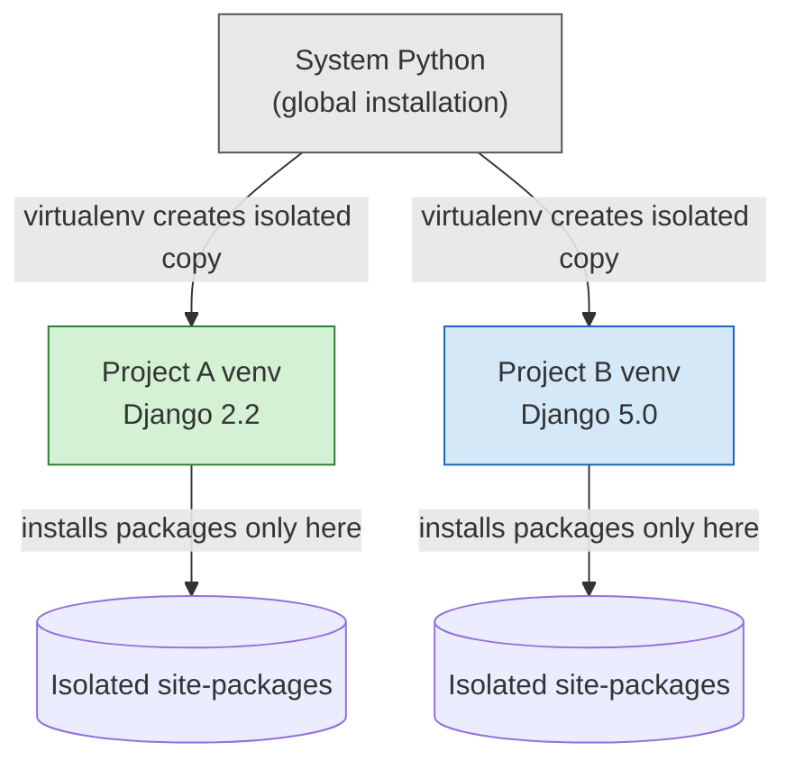
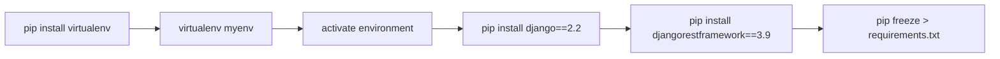
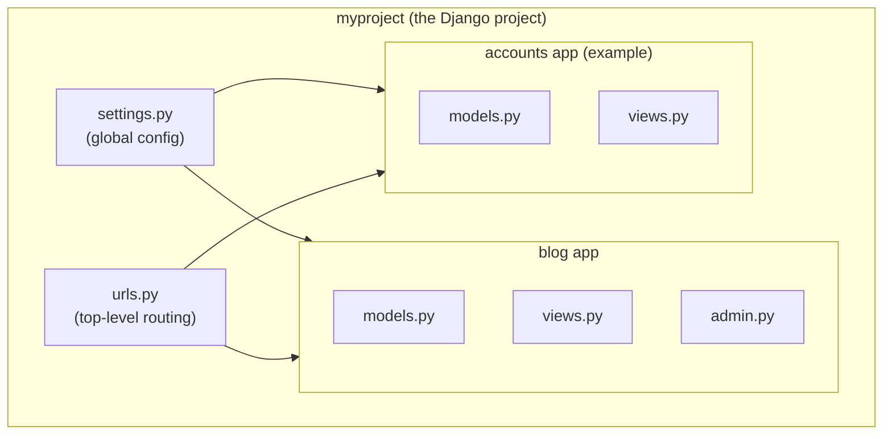
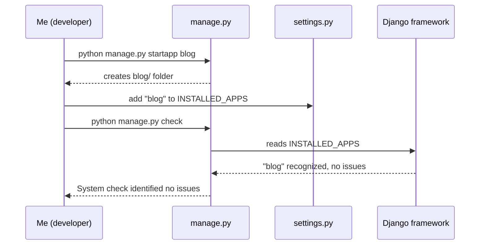
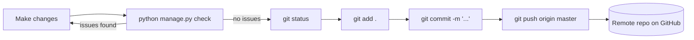
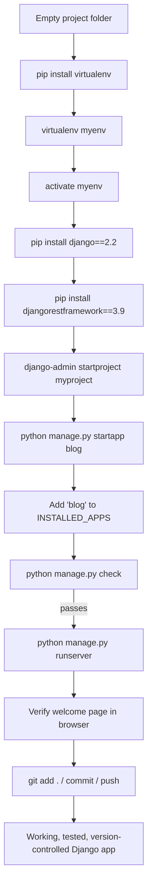

# Building My First Django App: Everything I Learned From Zero to Committed Code

I still remember the first time I typed `django-admin startproject myproject` into a terminal and had absolutely no idea what had just happened. A folder appeared, full of files I didn't understand, and I had that familiar mix of excitement and dread that comes with starting something new. Since then I've set up more Django projects than I can count, and I've made just about every mistake there is to make along the way — installing packages globally and wrecking another project's dependencies, forgetting to register an app in `settings.py` and staring at a cryptic error for twenty minutes, pushing to the wrong git branch at 1 a.m.

So I wanted to write down, in my own words, the full path I take every single time I start a new Django project. This isn't a copy-paste cheat sheet. It's the mental model I use, the mistakes I want you to skip, and the reasoning behind each step. I'll walk through five stages: setting up a virtual environment, installing the packages I actually need, scaffolding the project and app, wiring the app into Django's settings, and finally testing everything and committing it to git.

Let's get into it.

## Why I Never Skip the Virtual Environment Step

I'll be honest — early on, I used to skip virtual environments entirely. I'd just run `pip install django` globally and get on with my life. That worked fine until I had two projects on my machine that needed different versions of Django. Suddenly one project broke every time I updated a package for the other. That was the day I stopped skipping this step.

Here's how I think about it: my computer has one global Python installation, but I might have a dozen projects, each with its own opinions about which package versions it wants. A virtual environment is basically a clean, disposable Python installation that lives inside a folder. When I "activate" it, my terminal starts using that isolated copy of Python and pip instead of the system-wide one. When I'm done, I deactivate it and everything goes back to normal.



Notice in the diagram above that Project A and Project B never touch each other's packages. That isolation is the entire point.

### Setting It Up

I like using `virtualenv` because it's simple and predictable, though `venv` (built into Python 3) works almost identically if you'd rather avoid an extra dependency. Here's exactly what I run:

```bash
# 1. Install virtualenv (only needs to happen once per machine)
pip install virtualenv

# 2. Create the environment inside my project folder
virtualenv myenv

# 3. Activate it
source myenv/bin/activate      # macOS/Linux
myenv\Scripts\activate         # Windows
```

I always know the environment is active because my prompt changes to show the environment name in parentheses, like `(myenv) user@machine:~/project$`. That little visual cue has saved me more than once from accidentally installing something globally.

| OS | Activate command | Deactivate command |
|---|---|---|
| macOS / Linux | `source myenv/bin/activate` | `deactivate` |
| Windows (cmd) | `myenv\Scripts\activate` | `deactivate` |
| Windows (PowerShell) | `myenv\Scripts\Activate.ps1` | `deactivate` |

> **Note:** The `deactivate` command is identical across every operating system, which is one small mercy in an otherwise inconsistent tooling landscape.

> **Caution:** If you create your virtual environment folder inside a git-tracked directory (which I do, out of habit), make sure to add it to `.gitignore` immediately. I've accidentally committed a 40,000-file `venv/` folder before, and cleaning that out of git history is not a fun afternoon.

```
# .gitignore
myenv/
venv/
__pycache__/
*.pyc
```

### Why I Bother With This At All

I keep coming back to four reasons, and I think they hold up:

1. **Isolation** — nothing I install for this project leaks into another one.
2. **Version control over dependencies** — Project A can run Django 2.2 while Project B runs Django 5.0, on the same laptop, at the same time.
3. **A clean starting point** — every new project starts with zero installed packages, so I know exactly what's required just by reading `pip freeze`.
4. **Easier deployment** — when I eventually deploy this thing, I can export the exact dependency list and recreate the same environment on a server.

## Installing the Packages I Actually Need

With the environment active, the next thing I do is install Django itself, and usually Django REST Framework right alongside it, since almost everything I build ends up needing an API layer eventually.

```bash
pip install django==2.2
pip install djangorestframework==3.9
```

I pin exact versions like `==2.2` on purpose. Early in my career I'd just run `pip install django` and get whatever the latest version happened to be that week. That's fine until a tutorial, a course, or a teammate's code assumes a different major version and suddenly nothing lines up. Pinning versions means the environment is reproducible — I can hand this project to someone else, or come back to it in two years, and know exactly what it expects.



Once the installs finish, I always double-check them rather than assuming they worked:

```bash
django-admin --version
# 2.2

pip freeze
# Django==2.2
# djangorestframework==3.9
# ...other dependencies pulled in automatically
```

I've started making it a habit to immediately snapshot my dependencies into a `requirements.txt` file:

```bash
pip freeze > requirements.txt
```

That single file is what lets anyone — including future me — recreate this exact environment with one command:

```bash
pip install -r requirements.txt
```

| Command | What I use it for |
|---|---|
| `pip install <package>` | Install the latest version |
| `pip install <package>==<version>` | Pin an exact version (my default) |
| `pip freeze` | List everything currently installed |
| `pip freeze > requirements.txt` | Save the dependency list to a file |
| `pip install -r requirements.txt` | Recreate an environment from that file |

> **Note:** `djangorestframework` is optional if I'm building a traditional server-rendered site with no API, but since most of my projects eventually grow an API layer, I install it up front to avoid a mid-project scramble.

## Scaffolding the Project and the App

This is where things start to feel real to me. A **Django project** is the outer container — settings, URL routing, and configuration that ties everything together. A **Django app** is a self-contained module inside that project: a blog, a user auth system, a payments module, whatever. One project can (and usually does) contain several apps.

I find it helpful to think of the project as the house and each app as a room with a specific purpose.



### Creating the Project

```bash
django-admin startproject myproject
cd myproject
```

### Creating the App

Say I'm building a blog. I create the app like this:

```bash
python manage.py startapp blog
```

That command generates this structure, which I've annotated with what I actually use each file for:

```
myproject/
│
├── manage.py                # I run almost every command through this
│
├── myproject/
│   ├── __init__.py
│   ├── settings.py          # global configuration lives here
│   ├── urls.py               # top-level URL routing
│   └── wsgi.py               # entry point for production servers
│
└── blog/
    ├── migrations/
    │   └── __init__.py       # database schema changes get recorded here
    ├── admin.py               # I register models here to manage them in /admin
    ├── apps.py                # app-level configuration
    ├── models.py               # where I define my data models
    ├── tests.py                 # unit tests for this app
    └── views.py                  # request/response logic
```

| File | What I actually put in it |
|---|---|
| `manage.py` | Never edit this — I just run commands through it |
| `myproject/settings.py` | Database config, installed apps, middleware, secret key |
| `myproject/urls.py` | Top-level routes, usually just `include()`-ing each app's own urls |
| `blog/models.py` | My data models — the tables that will exist in the database |
| `blog/views.py` | The logic that decides what happens when a URL is hit |
| `blog/admin.py` | Registering models so I can manage them from Django's built-in admin panel |

> **Note:** I can name the app anything, but I try to keep it short, lowercase, and singular-or-plural consistently across the project (`blog`, not `Blog` or `blog_app`). Django uses this name in imports and database table names, so consistency here saves confusion later.

## Wiring the App Into Django's Settings

This is the step I forget most often, and it's also the one that produces the most confusing error messages when I do forget it. Creating an app with `startapp` does **not** automatically make Django aware of it. I have to explicitly register it.



I open `myproject/settings.py` and find the `INSTALLED_APPS` list, then add my app's name as a string:

```python
INSTALLED_APPS = [
    'django.contrib.admin',
    'django.contrib.auth',
    'django.contrib.contenttypes',
    'django.contrib.sessions',
    'django.contrib.messages',
    'django.contrib.staticfiles',
    'blog',  # my new app
]
```

Then I verify it worked:

```bash
python manage.py check
```

If everything's fine, Django prints `System check identified no issues (0 silenced)`. If I forgot a comma, misspelled the app name, or there's a genuine problem inside the app, this is where it surfaces.

> **Caution:** A common mistake I made early on was adding the app's *folder path* instead of its *importable name* — things like adding `'./blog'` instead of `'blog'`. Django wants the Python import name, not a filesystem path.

### Why Registering Actually Matters

I used to treat this step as busywork, but `INSTALLED_APPS` genuinely controls things I rely on constantly:

- **Database migrations** — Django only looks for `models.py` changes in apps that are registered.
- **The admin interface** — a model won't show up in `/admin` unless its app is installed and the model is registered in `admin.py`.
- **Template and static file discovery** — registered apps can contribute their own templates and static files to the project.

Skip this step, and it looks like nothing is broken — until I try to run a migration and Django acts like my new models don't exist.

## Testing My App and Committing With Git

Once the app is registered, I always do a manual smoke test before I trust anything enough to commit it.

```bash
python manage.py runserver
```

Then I open `http://127.0.0.1:8000/` in my browser. Seeing Django's default welcome page is my green light that the project itself is healthy.

I also run the built-in check again just to be thorough:

```bash
python manage.py check
# System check identified no issues (0 silenced).
```

### My Git Routine

I treat committing as part of testing, not a separate afterthought. Here's the sequence I follow every single time:

```bash
git status                                  # see what changed
git add .                                   # stage everything
git commit -m "Created Django project and app"
git push origin master
```



| Command | What it actually does, in my own words |
|---|---|
| `git status` | Shows me what's changed since the last commit — my sanity check before staging anything |
| `git add .` | Stages every change in the current directory and subdirectories |
| `git commit -m "message"` | Saves a snapshot of the staged changes with a description |
| `git push origin master` | Sends my local commits up to the `origin` remote, on the `master` branch |

> **Note:** Plenty of repositories default to `main` instead of `master` these days — I always check which branch name my remote is actually using before pushing, usually with `git branch -a`.

> **Caution:** I never run `git add .` blindly on a project I haven't set up `.gitignore` for yet. It's an easy way to accidentally commit a virtual environment folder, compiled `.pyc` files, or a `.env` file full of secrets.

### Why I Treat This as a Non-Negotiable Habit

Testing and committing at every meaningful milestone — not just at the end of a big feature — has saved me from two specific disasters over the years: losing hours of work to a crashed laptop, and shipping a broken change because I didn't verify it actually ran before pushing. A commit is cheap. A lost afternoon of work is not.

## Pulling It All Together

Here's the full journey from an empty folder to a tested, committed Django app, as one continuous diagram:



And here's the whole thing compressed into one reference table, which is honestly what I bookmark and come back to every time I start a new project:

| Stage | Key command(s) |
|---|---|
| Create virtual environment | `pip install virtualenv` → `virtualenv myenv` → `source myenv/bin/activate` |
| Install packages | `pip install django==2.2` → `pip install djangorestframework==3.9` |
| Create project | `django-admin startproject myproject` |
| Create app | `python manage.py startapp blog` |
| Register app | Add `'blog'` to `INSTALLED_APPS` in `settings.py` |
| Verify | `python manage.py check` |
| Run locally | `python manage.py runserver` |
| Commit | `git status` → `git add .` → `git commit -m "..."` → `git push origin master` |

## Final Thoughts

None of this is complicated once you've done it a few times, but I remember how opaque it all felt the first time through — a wall of commands with no obvious "why" attached to any of them. What changed things for me wasn't memorizing the commands; it was understanding *why* each step exists: isolation so projects don't fight each other, pinned versions so environments are reproducible, explicit app registration so Django knows what to manage, and a testing-then-committing habit so I never lose work or ship something broken.

Every time I start a new Django project now, I run through this exact sequence almost on autopilot, and it's rare that anything goes wrong. If you're just starting out, I'd genuinely recommend typing every one of these commands yourself rather than copy-pasting — the muscle memory is what turns this from a checklist into intuition.
