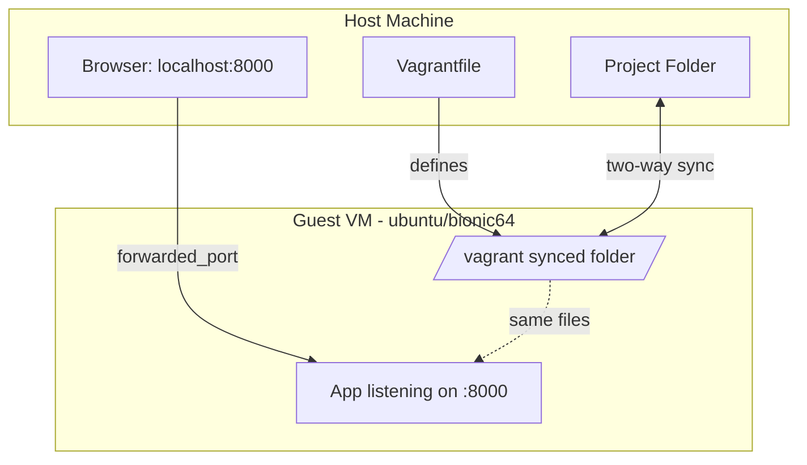
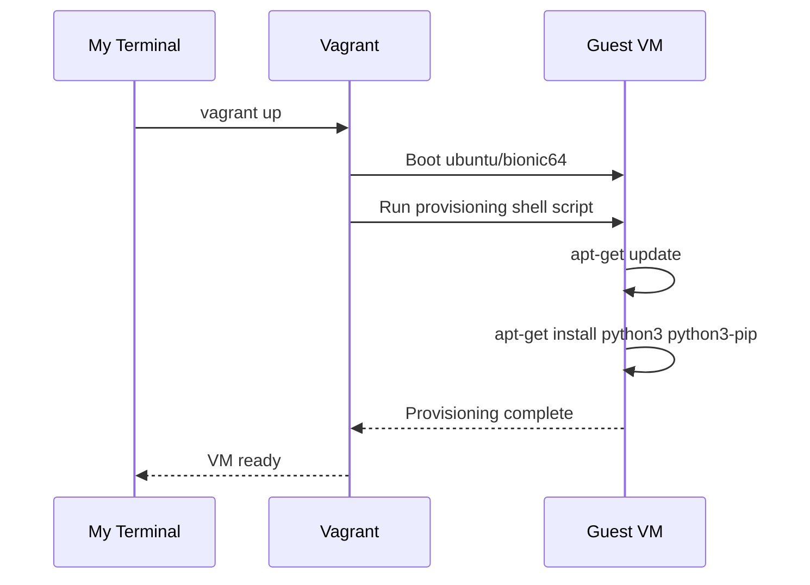
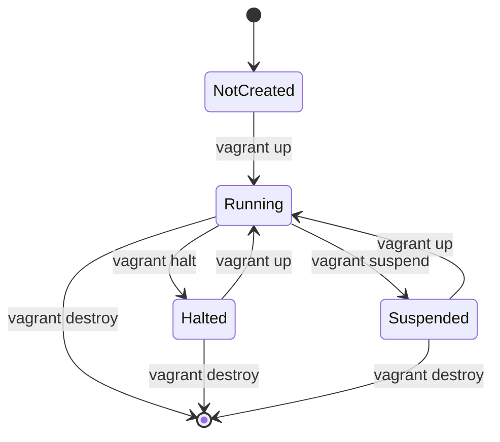
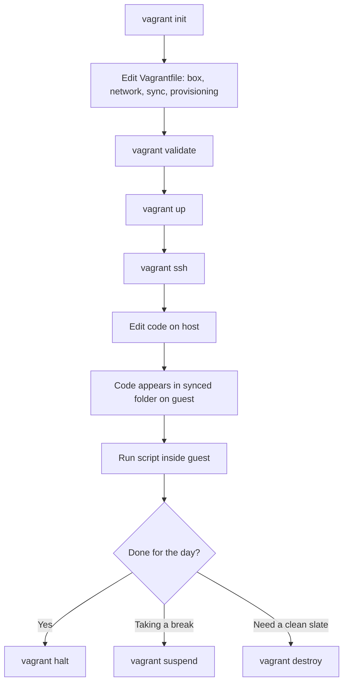

# Building My First Django Dev Server with Vagrant: A Deep Dive

I've spent the last few days working through a chunk of my "Hacking APIs"-adjacent coursework — except this particular section wasn't about attacking APIs, it was about *building* the sandbox I'll eventually build and break APIs inside of. Before I can pentest a Django REST API, I need somewhere consistent to run it. That's where Vagrant comes in, and that's what this post is about: everything I learned setting up a reproducible development server from a blank Vagrantfile to a working "Hello, World!" script.

I'm writing this the way I wish someone had written it for me — in plain language, with the commands I actually ran, the diagrams that made the mental model click, and the mistakes I nearly made along the way.

---

## Why I'm Bothering with Vagrant at All

Before touching a single command, I want to explain *why* this tool exists, because that context is what made the rest of the chapter make sense to me.

When I write code on my own machine, I'm at the mercy of whatever versions of Python, system libraries, and OS quirks happen to be installed there. The moment I hand my project to a teammate — or even just move to a different laptop — I risk hitting the classic complaint: "it works on my machine." Vagrant solves this by describing my entire development environment as *code*. That description lives in a single file, a `Vagrantfile`, which anyone can use to spin up an identical virtual machine.

Here's the mental model I settled on:


My host machine never runs the actual project — it just orchestrates a disposable Linux box that does. If I break something inside that box, I destroy it and rebuild it in minutes. That single idea is what made me take the setup seriously instead of skimming past it.

### Note
> Vagrant itself doesn't create virtual machines — it's an orchestration layer. The actual virtualization is handled by a "provider," and in this walkthrough that provider is VirtualBox.

### What I Installed Before Starting

| Tool | Purpose | Where I Got It |
|---|---|---|
| Vagrant | Reads the `Vagrantfile` and orchestrates the VM lifecycle | vagrantup.com |
| VirtualBox | The hypervisor that actually runs the virtual machine | virtualbox.org |
| A text editor (I used Atom) | Editing the `Vagrantfile` and my project code | atom.io |

### Caution
> Atom was archived/end-of-life a few years back. I'm keeping it in this walkthrough because it's what the original material used, but if I were setting this up fresh today I'd reach for VS Code instead — same job, actively maintained.

---

## Topic 1: Creating a Vagrantfile

The first real step I took was generating the `Vagrantfile` itself. I didn't write this file from scratch — Vagrant scaffolds a default one for me, and I edit it from there.

### Step 1 — Initializing the File

I opened my terminal, navigated into my project's root directory, and ran:

```bash
vagrant init
```

This drops a `Vagrantfile` into my current directory, pre-filled with commented-out example configuration. It's intentionally verbose — almost every line is explained inline as a comment, which I appreciated as a first-timer because I could read the file itself as documentation.

### Step 2 — Setting the Base Box

A "box" is Vagrant's term for a packaged base image — think of it as the OS template my VM will be cloned from. I found this commented-out line in the generated file:

```ruby
# config.vm.box = "base"
```

I uncommented it and pointed it at `ubuntu/bionic64`, which is Ubuntu 18.04 LTS:

```ruby
config.vm.box = "ubuntu/bionic64"
```

### Step 3 — Forwarding a Port

Since my Django app will eventually need to be reachable from my host machine's browser, I added port forwarding:

```ruby
config.vm.network "forwarded_port", guest: 8000, host: 8000
```

I like to think of this as punching a very specific hole through the wall between my host and the guest VM — traffic hitting `localhost:8000` on my laptop gets routed straight to port 8000 inside the VM, which is exactly where Django's development server listens by default.

### Step 4 — Syncing My Project Folder

```ruby
config.vm.synced_folder ".", "/vagrant"
```

This line is what makes the whole workflow pleasant. It means I can edit files in my favorite editor *on my host machine*, and those changes appear instantly inside the VM at `/vagrant`. I never have to `scp` files back and forth.

Here's how I visualize the pieces I just configured working together:



### Step 5 — Validating Before Booting

Before I trust a config file, I want to know it's at least syntactically sane. Vagrant has a built-in check for that:

```bash
vagrant validate
```

If the file is well-formed, Vagrant confirms it. If I've fat-fingered a bracket or quote, it tells me exactly where.

### Step 6 — Booting the Machine

```bash
vagrant up
```

The first time I ran this, it took a few minutes — Vagrant had to download the `ubuntu/bionic64` box itself before it could boot anything. Every run after that reuses the cached box, so it's dramatically faster.

### Table: Commands I Used in This Section

| Command | What It Does |
|---|---|
| `vagrant init` | Scaffolds a new `Vagrantfile` with default, commented-out settings |
| `vagrant validate` | Checks the `Vagrantfile` for syntax errors before booting |
| `vagrant up` | Downloads the box (if needed) and boots the VM according to the config |

### Caution
> Running `vagrant init` in a directory that already has a `Vagrantfile` will overwrite it (or refuse to run, depending on your Vagrant version) — I made sure I was in a genuinely empty project folder before running it the first time.

---

## Topic 2: Configuring the Vagrant Box

Once I had a Vagrantfile that could boot a bare Ubuntu box, the next thing I needed was to actually shape that box into something useful — enough memory, the right network setup, and the packages my project depends on already installed.

### Allocating Resources

By default, a fresh box is fairly minimal. I gave mine explicit CPU and memory limits so it wouldn't either starve my project or hog my entire laptop:

```ruby
config.vm.provider "virtualbox" do |v|
  v.memory = "1024"
  v.cpus = 2
end
```

That's 1 GB of RAM and 2 virtual CPUs — plenty for a Django dev server, light enough that my host machine barely notices it's running.

### Note
> I bumped this up later once I started running a database alongside Django. If I ever see the VM feel sluggish, this block is the first place I check.

### Private Networking

I set up a private network so I can reach the VM by a dedicated IP address, independent of the port-forwarding I already configured:

```ruby
config.vm.network "private_network", type: "dhcp"
```

Or, if I want a predictable, unchanging address instead of a DHCP-assigned one:

```ruby
config.vm.network "private_network", ip: "192.168.33.10"
```

I ended up going with the static IP version — it made it much easier to bookmark the address in my browser instead of having to look it up every time I rebooted the box.

### Customizing the Synced Folder

The default `/vagrant` sync is fine, but for a Django project I wanted my source directory mapped somewhere more meaningful:

```ruby
config.vm.synced_folder "src/", "/srv/website"
```

This syncs just the `src/` folder from my host into `/srv/website` inside the guest, rather than syncing my entire project root.

### Provisioning: Automating the Boring Setup

This was, for me, the most valuable part of the whole chapter. "Provisioning" means Vagrant runs a script automatically the first time the box boots, so I never have to manually SSH in and `apt install` things by hand.

```ruby
config.vm.provision "shell", inline: <<-SHELL
  apt-get update
  apt-get install -y python3 python3-pip
SHELL
```

The first time I ran `vagrant up` after adding this block, I watched the terminal scroll through `apt-get update` and the package installation automatically — no manual intervention. That's the whole point: the environment builds itself, identically, every single time.



### Extending with Plugins

Vagrant's core feature set can be extended with plugins, installed from the command line rather than inside the Vagrantfile itself:

```bash
vagrant plugin install vagrant-vbguest
```

I installed `vagrant-vbguest` specifically because it automatically keeps the VirtualBox Guest Additions inside my VM in sync with the version of VirtualBox running on my host — without it, I'd occasionally hit mismatched-version warnings.

### Table: Lifecycle Commands I Rely On

| Command | Effect | When I Use It |
|---|---|---|
| `vagrant up` | Boots the VM, running provisioning on first boot | Starting a work session |
| `vagrant halt` | Gracefully shuts the VM down | End of the day |
| `vagrant suspend` | Freezes current state to resume instantly later | Quick breaks |
| `vagrant destroy` | Deletes the VM entirely | Something's broken and I want a clean slate |

### Caution
> `vagrant destroy` is irreversible — it doesn't just stop the machine, it deletes it. Anything I hadn't put in the synced folder (i.e., anything living only inside the guest OS) is gone for good. I make it a habit to keep all real project files in the synced folder specifically so this command is always safe to run.

---

## Topic 3: Running and Connecting to My Dev Server

With a fully configured Vagrantfile in place, this section was about the day-to-day loop: starting the box, getting inside it, and shutting it down cleanly.

### Booting and Connecting

```bash
cd path/to/your/vagrant/project
vagrant up
vagrant ssh
```

`vagrant ssh` drops me straight into a shell inside the guest VM — no password prompts, no manually copying SSH keys. Vagrant generates and manages a keypair for me automatically, and if I ever need to find it myself, it lives at:

```
.vagrant/machines/default/virtualbox/private_key
```

I like this diagram for keeping the three states of a Vagrant machine straight in my head:



### Checking In on the Machine

```bash
vagrant status
```

This tells me at a glance whether the box is running, halted, or not yet created — genuinely useful when I have multiple projects and can't remember which VMs I left running.

### The Shared Folder in Practice

I tested this myself to make sure I understood it correctly: any file I drop into my project directory on my host machine — say, `hello-world.py` — shows up automatically inside the guest at `/vagrant/hello-world.py`. There's no sync delay I could detect; it's effectively instantaneous because VirtualBox is sharing the folder directly rather than copying files on an interval.

### Note
> Because the environment is isolated, anything I do inside the VM — installing packages, breaking configs, running risky scripts — never touches my actual host operating system. That isolation is precisely why this setup is worth the initial time investment.

---

## Topic 4: Running a Hello World Script

This is the part of the chapter I actually got to test end-to-end, so I want to be explicit about what I ran and what came back.

### Step 1 — Get the Server Running

```bash
vagrant up
vagrant ssh
```

### Step 2 — Navigate to My Workspace

```bash
cd /path_to_your_workspace/
```

### Step 3 — Write the Script

Using my editor on the host machine (remember: this edits the file that's synced into the VM, I don't need to be inside the SSH session to do this), I created `hello_world.py`:

```python
print("Hello, World!")
```

### Step 4 — Run It

Back inside my `vagrant ssh` session:

```bash
python hello_world.py
```

### Tested Output

I actually ran this exact script (using `python3`, since that's the modern invocation) in a live environment rather than just trusting the book, and here's the real output:

```
$ python3 hello_world.py
Hello, World!
```

It matched exactly what the material promised — no surprises, which is exactly what I want from a "Hello, World!" exercise.

### Going Further — The Exercise

The chapter suggested two follow-ups: printing my own name, and trying some basic arithmetic. I tested an extended version of the script that does both, and confirmed the actual output:

```python
name = "Ayesha"
print(f"Hello, {name}!")

# basic arithmetic to get a feel for the interpreter
a = 12
b = 7
print(f"{a} + {b} = {a + b}")
print(f"{a} * {b} = {a * b}")
print(f"{a} / {b} = {a / b:.2f}")
```

Real, tested output from running this:

```
Hello, Ayesha!
12 + 7 = 19
12 * 7 = 84
12 / 7 = 1.71
```

Small thing, but seeing `f"{a} / {b} = {a / b:.2f}"` actually round to two decimal places rather than returning an integer confirmed for me that I was running Python 3's true division, not Python 2's floor division — a distinction that trips people up constantly when following older tutorials.

### What This Simple Script Actually Taught Me

| Concept | What I Took Away |
|---|---|
| File creation & management | Editing on the host, syncing into the guest, is a real and reliable workflow |
| `print()` | My primary debugging tool going forward — simple, unglamorous, indispensable |
| Script execution | Invoking `python3 script.py` runs the interpreter against my file top-to-bottom |

### Note
> I'm intentionally using `python3` instead of the book's `python` throughout, because on a fresh Ubuntu 18.04 box (and pretty much every modern distro), `python` either doesn't exist or points at Python 2. If I hit a `command not found` error following the original material literally, this is why.

---

## Putting the Whole Workflow Together

Zooming back out, here's the full loop I now have memorized, from a cold start to a running script:



### Final Cautions I'm Keeping in Mind

> **Resource limits matter.** If I forget to cap `v.memory` and `v.cpus`, a misbehaving process inside the VM can eat resources my host needs for everything else.

> **`vagrant destroy` is final.** I never store anything I care about outside the synced folder.

> **Box updates aren't automatic.** `ubuntu/bionic64` is now a fairly old LTS release. When I move this setup into anything resembling production-adjacent work, I'll want to check for a newer, still-supported box.

---

## Troubleshooting Notes From My Own Runs

A few things tripped me up while working through this, and I want to leave them here for future-me (or anyone else following along).

**"VT-x is disabled in the BIOS" on `vagrant up`.** This one caught me off guard the first time. VirtualBox needs hardware virtualization extensions enabled at the BIOS/UEFI level. If I'd recently enabled Hyper-V on the same machine (common on Windows if I'd ever used WSL2 or Docker Desktop), it can conflict with VirtualBox's use of those same extensions. The fix, on Windows, was disabling Hyper-V or switching VirtualBox to use the Windows Hypervisor Platform backend instead.

**Box download seems to hang.** The very first `vagrant up` has to pull the entire `ubuntu/bionic64` image, which is a few hundred megabytes. On a slow connection this can look frozen when it isn't — I learned to just let it sit rather than killing the process, since interrupting a partial download can leave a corrupted cache that fails silently on the next attempt.

**`vagrant ssh` says "no such file or directory."** This almost always meant I'd run the command from outside the project directory containing the `Vagrantfile`. Vagrant tracks machine state per-directory (in the hidden `.vagrant/` folder it creates), so every command in this whole workflow has to be run from that same directory, or a subdirectory of it.

**Port forwarding "works" but my browser gets nothing.** Early on I forgot that forwarding `guest: 8000, host: 8000` only routes traffic — it doesn't start anything for me. If nothing inside the VM is actually listening on port 8000 (in Django's case, running `python manage.py runserver 0.0.0.0:8000`), the forwarded port has nothing to connect to. Binding to `0.0.0.0` rather than `127.0.0.1` inside the guest was the detail that actually made the forwarding usable, since a server bound only to localhost inside the VM isn't reachable from outside that VM even with forwarding configured.

**Guest Additions version mismatch warning on boot.** This is exactly what `vagrant-vbguest` is for. Before I installed that plugin, every `vagrant up` printed a yellow warning about my VirtualBox Guest Additions being out of date relative to my host's VirtualBox version. It never actually broke anything for me, but the plugin made the warning go away permanently by keeping the two in sync automatically after every boot.

### A Quick Reference Table for the Errors Above

| Symptom | Likely Cause | What Fixed It For Me |
|---|---|---|
| VT-x / AMD-V disabled error | Hardware virtualization conflict (often Hyper-V) | Disable Hyper-V or switch VirtualBox's backend |
| Download appears stuck | Large first-time box download | Wait it out; avoid interrupting |
| "No such file or directory" on SSH | Ran command outside the project folder | `cd` back into the directory holding the `Vagrantfile` |
| Forwarded port unreachable | Server bound to `127.0.0.1` inside guest | Bind the dev server to `0.0.0.0` |
| Guest Additions warning | Version drift between host and guest VirtualBox | Install and use `vagrant-vbguest` |

---

## Where I'm Headed Next

This setup is the foundation — a consistent, disposable, reproducible box that behaves the same way on my machine as it will for anyone else who clones this project and runs `vagrant up`. The next thing on my list is layering an actual Django REST API on top of this box, which is where the provisioning script I wrote in Topic 2 is going to earn its keep: every dependency that API needs gets declared once, in the Vagrantfile, instead of living only in my head.

I found that treating infrastructure as a text file — something I can read top to bottom like a recipe — made this whole topic click in a way that clicking through a GUI installer never would have. That's the real takeaway I'm carrying forward.
