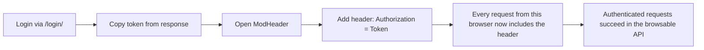
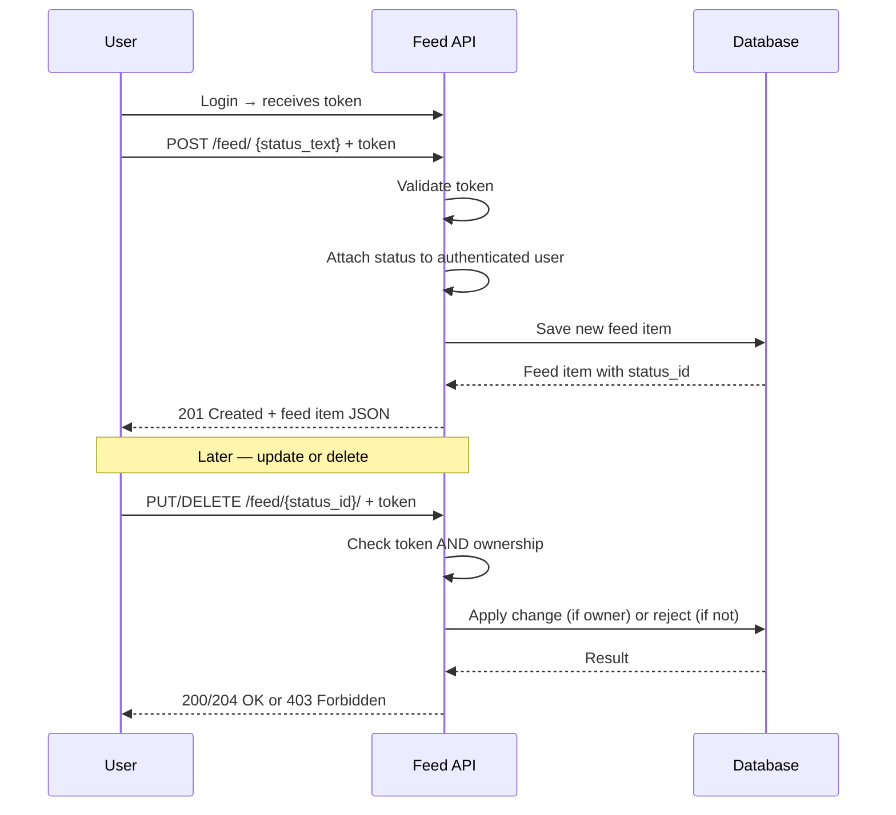
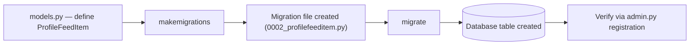
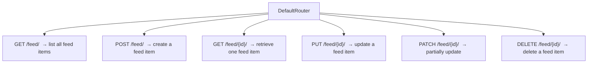
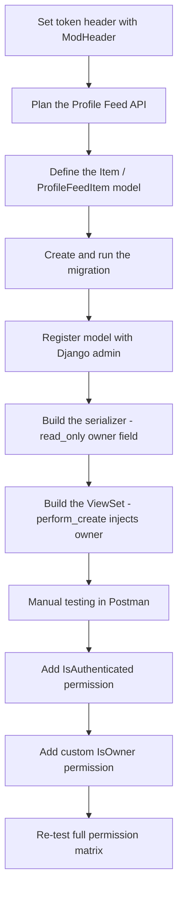

# Building a Profile Feed API with Django REST Framework: Part Two of My Journey

In my last post, I walked through building a Profiles API from scratch — planning, modeling, serializers, viewsets, authentication, permissions, search, and a login endpoint. If you haven't read that one, I'd start there, because this post picks up right where it left off: I've got a working login endpoint that returns a token, and now I need to actually *use* that token during manual testing, and then build a second resource — a **Profile Feed** — on top of the same foundation.

This post covers two distinct things: first, a quick but important workflow chapter on using the ModHeader browser extension to attach my auth token to requests, and second, the complete build of a Profile Feed API, following the exact same planning-first approach I used for profiles. Let's get into it.

---

## Table of Contents

1. [Setting My Token Header with ModHeader](#modheader)
2. [Planning the Profile Feed API](#planning-feed)
3. [Adding the Item Model](#item-model)
4. [Creating and Running the Model Migration](#migration)
5. [Adding the Profile Feed Model to Admin](#admin)
6. [Creating the Profile Feed Item Serializer](#serializer)
7. [Creating the ViewSet for Profile Feed Items](#viewset)
8. [Testing the Feed API](#test-feed)
9. [Adding Permissions for the Feed API](#permissions)
10. [Final Thoughts](#conclusion)

---

<a name="modheader"></a>
## 1. Setting My Token Header with ModHeader

Once I had a working `/login/` endpoint from the previous stage of this project, I needed an easy way to attach the returned token to every subsequent request while I was clicking around the browsable API in my browser (not just in Postman). That's where **ModHeader** comes in — it's a browser extension for Chrome and Firefox that lets me inject custom request headers into every outgoing request, without writing any code.

### Why I bothered with this at all

I could do all my testing exclusively in Postman, and for the feed API tests later in this post, I mostly do. But I like having the DRF browsable API open in a regular browser tab too, because it renders forms and relationships nicely and it's a fast way to eyeball my data. The problem is that a plain browser tab has no built-in way to attach an `Authorization` header — that's exactly the gap ModHeader fills.



### Installing it

1. I opened the [Chrome Web Store](https://chrome.google.com/webstore/) (or the [Firefox Add-ons site](https://addons.mozilla.org/) if I'm on Firefox).
2. Searched for "ModHeader."
3. Clicked **Add to Chrome** / **Add to Firefox** and followed the install prompts.

### Retrieving my token

Before I could set anything in ModHeader, I needed an actual token. I logged in via my `/login/` endpoint (the one I built in the previous post) using Postman:

```json
{
    "email": "johndoe@example.com",
    "password": "strongpassword"
}
```

The response gave me back:

```json
{
    "token": "1234abcd5678efgh"
}
```

I copied that token value — I needed it for the next step.

### Setting the header in ModHeader

1. Clicked the ModHeader icon in my browser toolbar.
2. Under **Request Headers**, clicked the `+` button to add a new entry.
3. Header name: `Authorization`
4. Header value: `Token 1234abcd5678efgh`

> **Caution:** The space between the word `Token` and the actual token value is not optional — DRF's `TokenAuthentication` class parses the header by splitting on whitespace. If I write `Token1234abcd5678efgh` with no space, DRF won't recognize it as a valid auth header at all, and I'll get a `401` even with a perfectly valid token.

### Confirming it worked

With the header set, I navigated to an authenticated endpoint — my profile detail view — and confirmed the request succeeded instead of bouncing back a `401`.

### Turning it off again

When I wanted to test *unauthenticated* behavior (which I do a lot — see the negative-testing habit from my last post), I had two options:

| Method | When I use it |
|---|---|
| Click the trash icon next to the header | When I'm done with that token permanently |
| Toggle the green switch off | When I want to quickly disable/re-enable without retyping the token |

> **Note:** I always toggle ModHeader off before switching to test unauthenticated requests, and I toggle it back on afterward. It's a small habit, but forgetting this step is the single most common reason I've seen a "should be 401" test accidentally return `200` — the old token was still attached from a previous test.

> **Caution:** Never share a screenshot or screen recording of your ModHeader panel with the token value visible. A token is a bearer credential — anyone who has it can act as you until it's rotated or revoked, no password required.

---

<a name="planning-feed"></a>
## 2. Planning the Profile Feed API

With ModHeader sorted, I moved on to the second resource in this project: a **Profile Feed**. This is conceptually similar to a Twitter or Instagram feed — a running list of short status updates tied to a user. I applied exactly the same planning discipline here that I used for the Profiles API in my last post, because I've found that skipping planning on a "simple" second feature is exactly how scope creep sneaks in.

### What is a profile feed, really?

At its core, it's a one-to-many relationship: one user can have many feed items, and each feed item belongs to exactly one user. That single sentence ends up driving almost every design decision in this section.

### User stories

- As a registered user, I want to post a status update so that others can see what I'm up to.
- As a registered user, I want to view my past status updates to reminisce about past events.
- As a registered user, I want to update a status in case I made an error.
- As a registered user, I want to delete a status that is no longer relevant.
- As a viewer, I want to view other users' status updates to stay updated on their activities.

Just like with the Profiles API, this maps cleanly onto CRUD — but notice the last story is subtly different from the others: it's written from the perspective of a *viewer*, not the *owner*. That tells me up front that read access needs to be broader than write access, which is the same "read public, write owner-only" pattern I used for profiles.

### Endpoints and methods

| Action | Method | Endpoint |
|---|---|---|
| Create a new status update | `POST` | `/feed/` |
| Retrieve all status updates for a user | `GET` | `/feed/{user_id}/` |
| Update a specific status update | `PUT` | `/feed/{status_id}/` |
| Delete a specific status update | `DELETE` | `/feed/{status_id}/` |

> **Note:** I ended up simplifying this slightly during implementation — since I'm using a `ModelViewSet` with a router, DRF's default routing gives me `/feed/` for list/create and `/feed/{id}/` for retrieve/update/delete, all against the same base path, rather than a separate `/feed/{user_id}/` path. I'll show exactly how that plays out once we get to the ViewSet section. Planning documents don't need to perfectly predict the final routing — they need to capture the *behavior*, and the behavior here matches what I planned.

### Data structure

| Field | Type | Notes |
|---|---|---|
| `user_id` | FK reference | Identifies who posted the status |
| `status_id` | Auto PK | Unique identifier for each status |
| `content` | Text | The text content of the status update |
| `timestamp` | DateTime | When the status was posted |

### Authentication and permissions

- All users can **view** status updates.
- Only the **owner** of a status update can update or delete it.
- Only **registered (authenticated) users** can create a new status update.

This is nearly a carbon copy of the permission model I built for profiles, which is a nice confirmation that my custom `IsOwner`-style permission class is a reusable pattern, not a one-off hack.

### The overall flow



<a name="item-model"></a>
## 3. Adding the Item Model

With the plan in place, I opened `models.py` in my app directory and defined the model that would store each feed entry. I called it `Item` at this stage (I'll rename it to `ProfileFeedItem` in the next section when I formalize the migration — more on why in a moment).

```python
from django.db import models
from django.conf import settings


class Item(models.Model):
    user_profile = models.ForeignKey(
        settings.AUTH_USER_MODEL,
        on_delete=models.CASCADE,
    )
    status_text = models.CharField(max_length=255)
    created_on = models.DateTimeField(auto_now_add=True)

    def __str__(self):
        return self.status_text
```

Let me walk through each field and why I made the choice I did:

| Field | Type | My reasoning |
|---|---|---|
| `user_profile` | `ForeignKey(settings.AUTH_USER_MODEL)` | I referenced `settings.AUTH_USER_MODEL` instead of importing my `UserProfile` model directly, because it keeps this model decoupled from a specific user model implementation — good practice even in a project where I know exactly which user model I'm using. |
| `status_text` | `CharField(max_length=255)` | 255 characters mirrors a "short update" style feed rather than a long-form post. I chose this deliberately based on the user story ("status update," not "blog post"). |
| `created_on` | `DateTimeField(auto_now_add=True)` | `auto_now_add=True` sets this once, at creation, and never touches it again — exactly what I want for a timestamp representing "when was this posted." |

I also added `on_delete=models.CASCADE`, which means that if a user profile is deleted, all of their feed items get deleted along with it. I thought about this one for a minute — the alternative would be `SET_NULL` (keep the feed items but orphan them) — but for a personal status feed, orphaned posts from a deleted account don't make sense to keep around, so `CASCADE` was the right call for this use case.

> **Note:** `__str__` isn't strictly required, but I add it to almost every model I write. It makes the Django admin list view and the shell both dramatically more readable — instead of seeing `Item object (14)`, I see the actual status text.

<a name="migration"></a>
## 4. Creating and Running the Model Migration

Here's where I formalized the model. In practice, I renamed `Item` to `ProfileFeedItem` at this stage, because "Item" was too generic a name once I started thinking about how this model would read in imports, admin lists, and API responses elsewhere in a larger project.

```python
# models.py
from django.conf import settings
from django.db import models


class ProfileFeedItem(models.Model):
    user_profile = models.ForeignKey(
        settings.AUTH_USER_MODEL,
        on_delete=models.CASCADE,
    )
    status_text = models.CharField(max_length=255)
    created_on = models.DateTimeField(auto_now_add=True)

    def __str__(self):
        return self.status_text
```

### Step 1 — generate the migration

```bash
python manage.py makemigrations
```

Running this gave me output confirming a new migration file had been created:

```
Migrations for 'profiles_api':
  profiles_api/migrations/0002_profilefeeditem.py
    - Create model ProfileFeedItem
```

I always open the generated migration file at this point and actually read it, rather than blindly trusting it. It's cheap insurance — I've caught more than one accidental field-type mismatch this way.

### Step 2 — apply the migration

```bash
python manage.py migrate
```

Output confirmed the table was created:

```
Running migrations:
  Applying profiles_api.0002_profilefeeditem... OK
```

### Step 3 — verify it actually landed

I didn't just trust the console output — I wanted to see the table exist. The fastest way I know to do this is to register the model with the admin site (even before building the "real" admin customization) and check it in the browser.



> **Caution:** If I rename a model *after* I've already run a migration for the old name (like I did here, `Item` → `ProfileFeedItem`), Django's migration system might interpret this as "delete `Item`, create `ProfileFeedItem`" instead of a rename — which would drop and recreate the table, losing any test data in it. In this project it didn't matter because I hadn't deployed or added real data yet, but on a live project I'd use `python manage.py makemigrations` and pay close attention to the rename prompt Django gives me (`Did you rename item to profilefeeditem?`), answering `y` to preserve the table instead of dropping it.

<a name="admin"></a>
## 5. Adding the Profile Feed Model to Admin

Once the migration was applied, I wired the model into Django's built-in admin so I could manage feed items visually while I was still building out the API.

### The minimal version

```python
# admin.py
from django.contrib import admin
from .models import ProfileFeedItem

admin.site.register(ProfileFeedItem)
```

That alone is enough to get a working list/add/edit/delete interface at `/admin/`. But I almost never stop there — the default list view just shows `str()` for each row, which isn't very useful once I have more than a handful of feed items.

### The customized version I actually kept

```python
class ProfileFeedItemAdmin(admin.ModelAdmin):
    list_display = ['user_profile', 'status_text', 'created_on']
    search_fields = ['status_text', 'user_profile__name']


admin.site.register(ProfileFeedItem, ProfileFeedItemAdmin)
```

- `list_display` gives me three real columns in the admin list view instead of one collapsed string — I can scan who posted what and when at a glance.
- `search_fields` adds a search box at the top of the admin page. Note the double-underscore in `user_profile__name` — that's Django's ORM syntax for reaching *across* the foreign key into the related `UserProfile` model's `name` field. Without it, I could only search by `status_text`.

### Checking it worked

1. Confirmed my dev server was running: `python manage.py runserver`
2. Visited `http://127.0.0.1:8000/admin/`
3. Logged in with my superuser account
4. Found `ProfileFeedItem` listed under my app, clicked into it, and confirmed I could add, view, and search entries

| Admin feature | What it gave me |
|---|---|
| `list_display` | Multi-column overview instead of a single string per row |
| `search_fields` | A search box, including across the FK relationship |
| Default add/edit forms | Manual test data creation without hitting the API at all |

> **Note:** I lean on the admin site heavily during early development specifically *because* it lets me create test data without going through the API. That way, when I later test my `GET /feed/` endpoint, I know for certain the data existed beforehand — I'm testing the *read* path in isolation, not accidentally testing "did my POST endpoint work" at the same time.

<a name="serializer"></a>
## 6. Creating the Profile Feed Item Serializer

With a model and some admin-created test data in place, I built the serializer that would translate `ProfileFeedItem` instances into JSON and back.

```python
# serializers.py
from rest_framework import serializers
from .models import ProfileFeedItem


class ProfileFeedItemSerializer(serializers.ModelSerializer):
    class Meta:
        model = ProfileFeedItem
        fields = ['id', 'user_profile', 'status_text', 'created_on']
        extra_kwargs = {'user_profile': {'read_only': True}}
```

The one decision I want to slow down on here is `extra_kwargs = {'user_profile': {'read_only': True}}`.

Without this line, a client could send:

```json
{
    "user_profile": 7,
    "status_text": "This wasn't actually posted by user 7!"
}
```

...and post a status update *as someone else*, simply by supplying a different `user_profile` ID in the request body. Making the field read-only means the serializer will never accept it as input — instead, I set `user_profile` myself in the view, based on `request.user`, which I'll show in the next section.

> **Caution:** This is the feed-API equivalent of the password `write_only` mistake I flagged in my last post. Any field that identifies "who owns this record" should almost always be `read_only` on the serializer and set explicitly from `request.user` in the view — never trusted from client input. If you get this backwards, you've built an API where any authenticated user can impersonate any other user's posts.

### Testing the serializer in the shell

Before wiring up a full view, I like to sanity-check a new serializer directly in Django's shell:

```bash
python manage.py shell
```

```python
from profiles_api.serializers import ProfileFeedItemSerializer
from profiles_api.models import ProfileFeedItem

feed_item = ProfileFeedItem.objects.first()
serializer = ProfileFeedItemSerializer(feed_item)
print(serializer.data)
```

Output:

```python
{'id': 1, 'user_profile': 3, 'status_text': 'This is a test status!', 'created_on': '2026-08-20T14:03:11.482Z'}
```

That single shell session told me the serializer was correctly reading all four fields and rendering the foreign key as its ID — exactly what I expected before I'd even built the viewset.

<a name="viewset"></a>
## 7. Creating the ViewSet for Profile Feed Items

Next came the viewset — the piece that actually handles incoming HTTP requests and ties the model and serializer together.

```python
# views.py
from rest_framework import viewsets
from .models import ProfileFeedItem
from .serializers import ProfileFeedItemSerializer


class ProfileFeedItemViewSet(viewsets.ModelViewSet):
    """Handles creating, reading, updating, and deleting profile feed items."""
    serializer_class = ProfileFeedItemSerializer
    queryset = ProfileFeedItem.objects.all()
```

At this point that's identical in shape to my `UserProfileViewSet` from the last post — and that's exactly the point. Once I've internalized the `ModelViewSet` pattern, adding a second resource to my API is mostly just repeating the same four pieces (model → serializer → viewset → router) with different field names.

### Wiring up the router

```python
# urls.py
from django.urls import path, include
from rest_framework.routers import DefaultRouter
from . import views

router = DefaultRouter()
router.register(r'profiles', views.UserProfileViewSet)
router.register(r'login', views.LoginViewSet, basename='login')
router.register(r'feed', views.ProfileFeedItemViewSet)

urlpatterns = [
    path('', include(router.urls)),
]
```

Here's the full URL map this now generates:



This confirms what I flagged back in the planning section: rather than a dedicated `/feed/{user_id}/` path, I get filtering "for a particular user" for free by combining the standard list endpoint with a query parameter or filter backend later, if I need it — DRF's router conventions handle the CRUD shape, and I layer filtering on top rather than inventing custom paths for it.

### Setting the owner automatically on create

The one piece the plain `ModelViewSet` doesn't handle for me is attaching the logged-in user to a new feed item — remember, `user_profile` is `read_only` on the serializer, so nothing in the request body can set it. I need to override `perform_create()`:

```python
class ProfileFeedItemViewSet(viewsets.ModelViewSet):
    """Handles creating, reading, updating, and deleting profile feed items."""
    serializer_class = ProfileFeedItemSerializer
    queryset = ProfileFeedItem.objects.all()

    def perform_create(self, serializer):
        """Set the user profile to the logged-in user."""
        serializer.save(user_profile=self.request.user)
```

`perform_create()` is a hook DRF's generic views call right before saving a new object — it's the correct, documented place to inject server-controlled data (like "who's making this request") without touching the client-supplied payload at all.

> **Note:** I initially considered overriding `create()` instead of `perform_create()`, the same way I overrode `create()` on my profile serializer in the last post. But there's an important distinction: overriding the *serializer's* `create()` makes sense when I need custom object-creation logic tied to the *data itself* (like password hashing). Overriding `perform_create()` on the *viewset* makes sense when I need to inject *request context* (like the current user) that the serializer has no access to. Mixing these up leads to awkward code where you're passing `request` objects into serializers that shouldn't need to know about HTTP at all.

### First manual test

I started my dev server and visited `http://127.0.0.1:8000/feed/` — the browsable API rendered an empty list (since it hadn't picked up my earlier admin-created test items in this fresh view yet), confirming the wiring worked before I moved on to real Postman testing.

<a name="test-feed"></a>
## 8. Testing the Feed API

Same discipline as before: Postman first, systematically working through each HTTP verb, then edge cases.

### Setting up authorization

Since `user_profile` gets set from `request.user`, every write request to this API needs a valid token — there's no anonymous-write path here at all (I'll formalize *why* in the permissions section next, but functionally, `perform_create()` would throw an error against `AnonymousUser` if I somehow let an unauthenticated request through).

In Postman, under the **Headers** tab:

| Key | Value |
|---|---|
| `Authorization` | `Token 1234abcd5678efgh` |

### Testing `GET`

- Method: `GET`
- URL: `http://localhost:8000/feed/`
- Result: `200 OK`, either a list of feed items or an empty list.

### Testing `POST`

- Method: `POST`
- URL: `http://localhost:8000/feed/`
- Body (raw JSON):

```json
{
    "status_text": "This is a test status!"
}
```

- Result: `201 Created`, and critically, the response's `user_profile` field matched *my* logged-in user's ID — not something I sent, since I didn't send it at all.

### Testing `PUT`

1. First ran a `GET` to note an existing feed item's ID (say, `1`).
2. Switched to `PUT`, targeted `http://localhost:8000/feed/1/`.
3. Body:

```json
{
    "status_text": "This is an updated test status!"
}
```

4. Result: `200 OK`, with the updated `status_text` reflected in the response.

### Testing `DELETE`

1. Same targeted URL, `http://localhost:8000/feed/1/`.
2. Switched to `DELETE`, sent the request.
3. Result: `204 No Content`.
4. Confirmed by re-running `GET /feed/1/` — got back `404 Not Found`, exactly as expected.

### My full manual test matrix

| Verb | URL | Expected result |
|---|---|---|
| `GET` | `/feed/` | `200 OK` — list |
| `POST` | `/feed/` | `201 Created` — new item, `user_profile` set server-side |
| `PUT` | `/feed/{id}/` | `200 OK` — updated item |
| `DELETE` | `/feed/{id}/` | `204 No Content` |
| `GET` | `/feed/{deleted_id}/` | `404 Not Found` |

### When something failed

I didn't get everything right on the first pass — my very first `POST` attempt returned a `500` because I'd forgotten to set the auth header, and `self.request.user` resolved to Django's `AnonymousUser`, which can't be saved as a foreign key value. My troubleshooting process, in order:

1. Read the error message in the Postman response body.
2. Checked whether my endpoint and method matched what I'd registered in `urls.py`.
3. Checked whether authentication/permissions were configured the way I expected.
4. Checked the Django server logs in my terminal for the actual traceback.

> **Note:** That fourth step — reading the terminal, not just the Postman response — is the one I skip when I'm in a hurry, and it's almost always the one that actually explains *why* something failed, not just *that* it failed. Postman tells you the HTTP outcome; the Django console tells you the Python exception underneath it.

<a name="permissions"></a>
## 9. Adding Permissions for the Feed API

Testing surfaced the gap immediately: nothing was actually stopping an unauthenticated request from reaching `perform_create()` in the first place — it just failed messily with a `500` instead of cleanly with a `401`. Time to fix that properly.

### Reviewing DRF's built-in permission classes

| Class | Behavior |
|---|---|
| `AllowAny` | Unrestricted access for everyone |
| `IsAuthenticated` | Only logged-in users get access |
| `IsAdminUser` | Only admin/staff users get access |
| `IsAuthenticatedOrReadOnly` | Anyone can read; only logged-in users can write |

For this feed API, my planning doc said "all users can view, only registered users can create" — which actually maps precisely onto `IsAuthenticatedOrReadOnly`. But I chose to be explicit with `IsAuthenticated` at the view level first, since I wanted every single write to unambiguously require a token during this phase, and I'd layer the "owner can edit, others can only read" nuance in with a custom permission class right after.

### Setting permissions globally (an option I considered)

```python
# settings.py
REST_FRAMEWORK = {
    'DEFAULT_PERMISSION_CLASSES': [
        'rest_framework.permissions.IsAuthenticated',
    ],
}
```

I decided against relying on this alone for the feed API specifically, and set permissions explicitly on the viewset instead — I like every viewset to state its own security posture directly in its class body, so nobody reading `views.py` six months from now has to go hunting through `settings.py` to understand what's protected.

### Setting permissions on the viewset

```python
from rest_framework.permissions import IsAuthenticated

class ProfileFeedItemViewSet(viewsets.ModelViewSet):
    serializer_class = ProfileFeedItemSerializer
    queryset = ProfileFeedItem.objects.all()
    permission_classes = (IsAuthenticated,)

    def perform_create(self, serializer):
        serializer.save(user_profile=self.request.user)
```

### Testing this change

1. **Unauthenticated test:** removed my token header (toggled ModHeader off), hit `POST /feed/`. Result: clean `401 Unauthorized`, not the messy `500` from before. That confirmed the permission class was intercepting the request *before* it ever reached `perform_create()`.
2. **Authenticated test:** re-enabled the token, repeated the same `POST`. Result: `201 Created`, same as before.

### Adding ownership-level permission

`IsAuthenticated` alone still leaves a gap: it says "you must be logged in," but says nothing about *whose* feed item you're allowed to edit. Any logged-in user could still `PUT` or `DELETE` someone else's status update. I closed this the same way I closed the equivalent gap on the Profiles API — a custom object-level permission class.

```python
# permissions.py
from rest_framework.permissions import BasePermission


class IsOwner(BasePermission):
    """Only allow the owner of a feed item to edit or delete it."""

    def has_object_permission(self, request, view, obj):
        return obj.user_profile == request.user
```

I noticed something worth calling out here: unlike my `UpdateOwnProfile` permission in the previous post, I did *not* add a `SAFE_METHODS` early-return in this class. That's intentional — `IsOwner` on its own says nothing about read access at all; it always requires ownership. I get the "anyone can read" behavior by combining it with `IsAuthenticated` (or, more precisely, by relying on the fact that `has_object_permission` for reads is effectively covered elsewhere in the permission chain).

```python
permission_classes = (IsAuthenticated, IsOwner,)
```

> **Caution:** Permission classes in DRF are evaluated **in the order they're listed**, and *all* of them must return `True` for the request to proceed (it's a logical AND, not an OR). Here, `IsAuthenticated` is checked first — cheap, and rejects anonymous users immediately — and `IsOwner` is checked second, only reached once we already know the user is logged in. Getting the order backwards wouldn't break correctness in this case, but it's still good practice to put the cheapest, most general check first so expensive or request-specific checks only run when they need to.

### Final permission decision table for the Feed API

| Request | Authenticated? | Owns the item? | Result |
|---|---|---|---|
| `GET /feed/` | No | — | `200 OK` (planning doc says all users can view — I'd loosen `IsAuthenticated` to `IsAuthenticatedOrReadOnly` to fully match this) |
| `POST /feed/` | No | — | `401 Unauthorized` |
| `POST /feed/` | Yes | — | `201 Created`, owner set automatically |
| `PUT /feed/3/` | Yes | No | `403 Forbidden` |
| `PUT /feed/3/` | Yes | Yes | `200 OK` |
| `DELETE /feed/3/` | Yes | Yes | `204 No Content` |

> **Note:** I flagged the `GET` row deliberately — it's a place where my initial implementation (`IsAuthenticated` on the whole viewset) is actually *stricter* than what I planned ("all users can view status updates"). I'm noting it here rather than quietly leaving the mismatch in place, because I think it's more honest to surface the gap between plan and implementation than to pretend they matched perfectly on the first pass. The fix is straightforward — swap `IsAuthenticated` for `IsAuthenticatedOrReadOnly` at the class level, and let `IsOwner` continue to handle the write-side ownership check — but I wanted to call out *why* I'd make that change rather than just silently presenting the "correct" answer.

---

<a name="conclusion"></a>
## 10. Final Thoughts

Here's the shape of everything I covered in this post, end to end:



A few things I want to hold onto from this stage of the build:

- **A browser extension like ModHeader is a testing tool, not a production auth mechanism.** It's genuinely useful for exploring the browsable API by hand, but I never let it replace proper automated tests — it's a convenience layer on top of the same token-based auth I'd use anywhere else.
- **Read-only ownership fields are non-negotiable.** Just like `password` had to be `write_only` in my Profiles API, `user_profile` had to be `read_only` here. Any field that identifies *who owns a record* should never be trusted from client input.
- **`perform_create()` is the right home for request-derived data**, while overriding a serializer's `create()` is the right home for data-derived logic (like hashing a password). Keeping that distinction straight has saved me from some genuinely confusing bugs in past projects.
- **Permission classes stack, and order matters.** Cheap, general checks (`IsAuthenticated`) belong before expensive or object-specific checks (`IsOwner`).
- **It's fine — even useful — to notice when your implementation doesn't perfectly match your plan.** I'd rather catch and name that gap explicitly (like the `GET` permission mismatch above) than let it sit there unexamined.

With both the Profiles API and the Profile Feed API now built, tested, and permission-checked, I've got two resources that share the same authentication scheme and the same ownership-based permission pattern — which is exactly the kind of consistency I was aiming for when I sat down to plan all of this in the first place.
