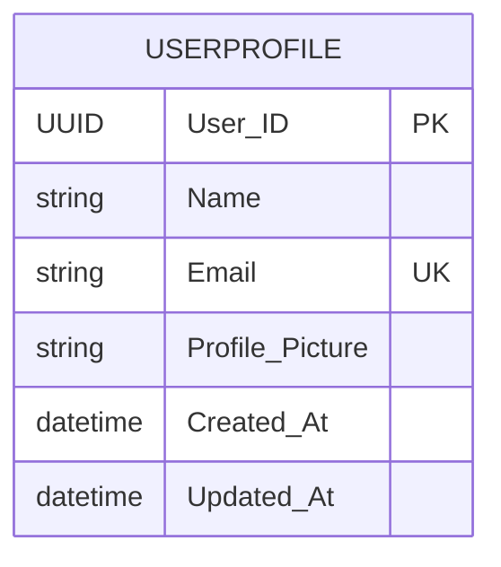
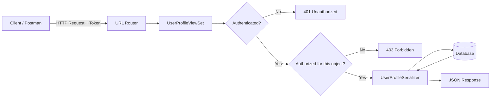
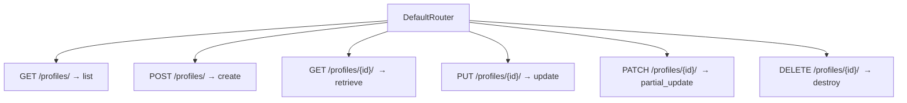
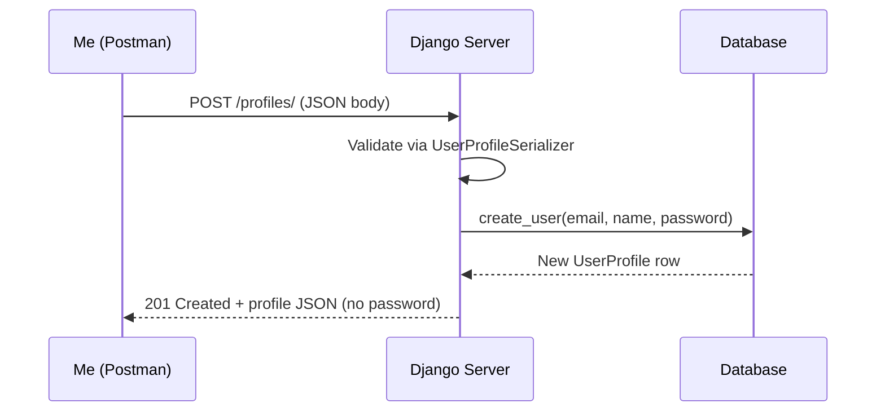
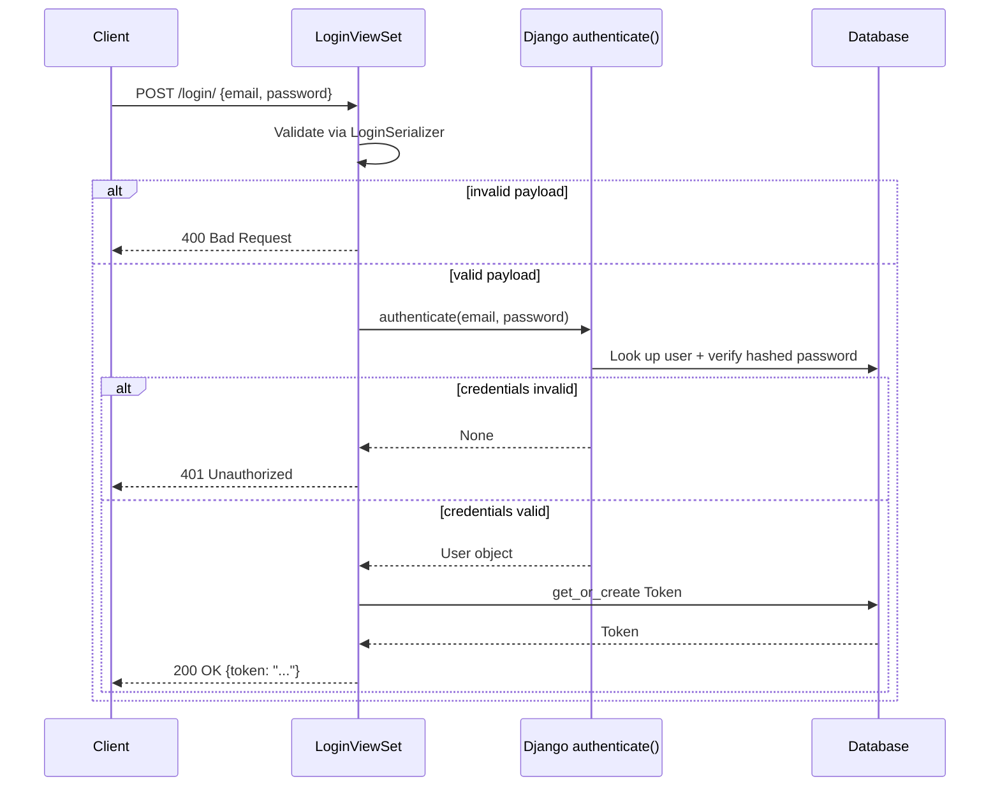
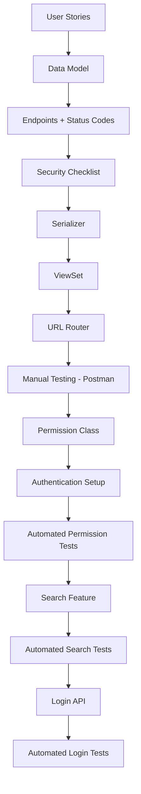

# Building a Profiles API with Django REST Framework: My Complete Walkthrough

I've built a fair number of APIs over the years, but there's something satisfying about going back to basics and documenting an entire build from the ground up — planning, data modeling, serializers, viewsets, routing, authentication, permissions, search, and a login flow. In this post, I'm going to walk you through exactly how I built a **Profiles API** using Django and Django REST Framework (DRF), including the mistakes I nearly made, the reasoning behind each decision, and the tested code I ended up with.

This is a long one — I'm covering the whole lifecycle, from "what does the user actually need" all the way to "how do I test my login endpoint with Postman." Grab a coffee.

---

## Table of Contents

1. [Why Planning Matters Before I Write a Line of Code](#planning)
2. [Writing User Stories](#user-stories)
3. [Designing the Data Model](#data-model)
4. [Designing the API Endpoints](#endpoints)
5. [Choosing Response and Status Codes](#status-codes)
6. [Thinking Through Security Early](#security)
7. [The Overall Architecture](#architecture)
8. [Building the Serializer](#serializer)
9. [Building the ViewSet](#viewset)
10. [Wiring Up URL Routing](#routing)
11. [Testing Profile Creation in Postman](#test-creation)
12. [Writing a Custom Permission Class](#permissions)
13. [Adding Authentication and Permissions to the ViewSet](#auth-permissions)
14. [Testing My New Permissions](#test-permissions)
15. [Adding a Search Feature](#search)
16. [Testing the Search Feature](#test-search)
17. [Building a Login API](#login)
18. [Testing the Login API](#test-login)
19. [Final Thoughts](#conclusion)

---

<a name="planning"></a>
## 1. Why Planning Matters Before I Write a Line of Code

I've learned the hard way that skipping the planning phase on an API almost always costs me more time than it saves. When I dive straight into `models.py` without thinking about what the client actually needs, I end up bolting on fields and endpoints later, which usually means messy migrations and inconsistent naming.

So before I touched Django at all, I sat down and asked myself three questions:

- Who is going to use this API, and what do they need to *do*?
- What does the data actually look like?
- What could go wrong, and how do I stop it from going wrong?

That's really the whole planning phase distilled into three bullet points. Everything else — the UML diagrams, the endpoint sketches, the security checklist — exists to answer those three questions in more detail.

> **Note:** I didn't use anything fancy for this stage. A notebook and fifteen minutes of thinking gets you 80% of the value of a formal UML tool like Lucidchart or Draw.io. I only reach for those tools when I need to communicate the design to someone else on my team.

<a name="user-stories"></a>
## 2. Writing User Stories

I always start with user stories because they force me to think from the perspective of the person actually using my API, not from the perspective of "what tables do I want in my database." Here's what I wrote down for my Profiles API:

- As a user, I want to create a profile with my name, email, and profile picture.
- As a user, I want to view my profile.
- As a user, I want to update my profile information.
- As a user, I want to delete my profile.
- As a user, I want to search for other users by their names or email addresses.

Notice something about this list: it maps almost one-to-one onto CRUD operations, plus one extra requirement (search). That's not an accident — profile management is a textbook CRUD use case, and I find that when my user stories map cleanly onto CRUD, it's usually a strong signal that a Django REST Framework `ModelViewSet` is going to save me a ton of boilerplate later.

> **Caution:** Don't skip this step just because the mapping to CRUD "feels obvious." I've been burned before by assuming a feature was simple CRUD, only to discover halfway through implementation that there was a hidden business rule (e.g., "email must be unique across profiles" or "a user can only have one profile"). Writing the story out loud surfaces those assumptions early.

<a name="data-model"></a>
## 3. Designing the Data Model

Once I know what the user needs to do, I can figure out what data I need to store. For my Profiles API, I landed on this model:

| Field | Type | Notes |
|---|---|---|
| `User_ID` | UUID / Auto | Unique identifier for the user |
| `Name` | CharField | Full name of the user |
| `Email` | EmailField | Must be unique; used for login too |
| `Profile_Picture` | URLField | URL of the profile picture |
| `Created_At` | DateTimeField | Auto-set on creation |
| `Updated_At` | DateTimeField | Auto-updated on save |

I like to sketch this out as an entity relationship diagram before I write any Django code, even for something this simple, because it forces me to think about relationships and constraints rather than just field names.



> **Note:** I marked `Email` as a unique key (`UK`) in the diagram because I knew from my user stories that email would double as the login identifier down the line. Deciding this early saved me from having to add a `unique=True` constraint via a painful migration later.

<a name="endpoints"></a>
## 4. Designing the API Endpoints

With the data model settled, I mapped my user stories onto concrete HTTP endpoints:

| Action | Method | Endpoint | Payload Example |
|---|---|---|---|
| Create a profile | `POST` | `/profiles/` | `{"name": "John Doe", "email": "john@example.com", "profile_picture": "url_to_picture"}` |
| Get a profile | `GET` | `/profiles/<User_ID>/` | — |
| Update a profile | `PUT` | `/profiles/<User_ID>/` | `{"name": "John A. Doe", "email": "john.a@example.com", "profile_picture": "new_url_to_picture"}` |
| Delete a profile | `DELETE` | `/profiles/<User_ID>/` | — |
| Search profiles | `GET` | `/profiles/?search=<query>` | — |

I want to call out something here: I didn't invent five separate endpoint *paths*. I have exactly one resource path (`/profiles/` and `/profiles/<id>/`), and the HTTP verb determines the behavior. This is the whole point of REST — the noun is the resource, the verb is the HTTP method. It's also exactly the pattern DRF's `ModelViewSet` is built around, which is why I chose it.

<a name="status-codes"></a>
## 5. Choosing Response and Status Codes

I also mapped out which status codes I expected each action to return, because I find that deciding this up front makes writing tests later much faster — I already know what I'm asserting against.

| Code | Meaning | When I use it |
|---|---|---|
| `200 OK` | Success | Successful `GET` request |
| `201 Created` | Resource created | Successful `POST` (profile created) |
| `204 No Content` | Success, nothing to return | Successful `DELETE` |
| `400 Bad Request` | Client error | Malformed or missing payload |
| `401 Unauthorized` | Not authenticated | No token, or invalid token |
| `403 Forbidden` | Authenticated but not allowed | Trying to edit someone else's profile |
| `404 Not Found` | Resource doesn't exist | Bad profile ID |

<a name="security"></a>
## 6. Thinking Through Security Early

I always write my security checklist during the planning phase, not after the API is "done," because retrofitting security is where I've seen projects go badly wrong. Here's what I committed to before writing any code:

- **Authentication** — only authenticated users can create, update, or delete profiles.
- **Authorization** — a user can only update or delete *their own* profile.
- **Data validation** — all incoming data gets validated before it touches the database.
- **Rate limiting** — I want some protection against abuse, even if I don't implement it on day one.

> **Caution:** "Anyone can read, only the owner can write" sounds like a simple rule, but it's easy to implement incorrectly if you only check permissions at the view level and forget to check them at the *object* level. I'll show exactly how I handled this distinction when I get to permission classes.

<a name="architecture"></a>
## 7. The Overall Architecture

Before diving into code, here's the high-level picture of how a request flows through my API once everything is built:



This diagram is basically my mental model for the rest of the build: **Router → ViewSet → Authentication → Permissions → Serializer → Database → Response**. Every section below fills in one piece of this pipeline.

<a name="serializer"></a>
## 8. Building the Serializer

I like to start with the serializer because it defines the *shape* of my data before I worry about the *behavior* of my views. In Django REST Framework, a serializer converts complex types (like a Django model instance) into native Python data types that can then be rendered into JSON.

First, I installed what I needed:

```bash
pip install djangorestframework
pip install Django
```

Then, inside my app directory (next to `models.py` and `views.py`), I created `serializers.py`:

```python
from rest_framework import serializers
from .models import UserProfile


class UserProfileSerializer(serializers.ModelSerializer):
    class Meta:
        model = UserProfile
        fields = ('id', 'email', 'name', 'password')
        extra_kwargs = {
            'password': {
                'write_only': True,
                'style': {'input_type': 'password'}
            }
        }

    def create(self, validated_data):
        """Create and return a new user, with encrypted password."""
        user = UserProfile.objects.create_user(
            email=validated_data['email'],
            name=validated_data['name'],
            password=validated_data['password'],
        )
        return user
```

Let me walk through why I wrote it this way:

- **`ModelSerializer`** — I chose this instead of a plain `Serializer` because it auto-generates fields based on the model, which saves me from redeclaring every field by hand.
- **`fields`** — I explicitly listed which fields I want exposed. I never use `fields = '__all__'` on anything that touches user data, because it's too easy to accidentally leak an internal field later when the model changes.
- **`extra_kwargs` on `password`** — this is the part I care about most. Setting `write_only: True` means the password can be *accepted* in a request but will never be *returned* in a response. That's a small line of code doing a lot of security work.
- **Overriding `create()`** — by default, `ModelSerializer.create()` would call `UserProfile.objects.create(**validated_data)`, which stores the password as **plain text**. That's a serious problem. By overriding `create()` to call `create_user()` instead, I make sure Django's password hashing (PBKDF2 by default) is applied before anything touches the database.

> **Caution:** This is the single most common mistake I see in DRF tutorials — using the default `ModelSerializer.create()` on anything with a password field. If you don't override it, you will store plaintext passwords. Always override `create()` (and `update()`, if you allow password changes) when a `password` field is involved.

<a name="viewset"></a>
## 9. Building the ViewSet

With my serializer in place, I moved on to the view layer. DRF's `ViewSet` classes are a high-level abstraction that bundle together the logic for handling `GET`, `POST`, `PUT`, `PATCH`, and `DELETE` into a single class, instead of me writing five separate view functions.

Here's what I put in `views.py`:

```python
from rest_framework import viewsets
from .models import UserProfile
from .serializers import UserProfileSerializer


class UserProfileViewSet(viewsets.ModelViewSet):
    """Handle creating, reading, updating, and deleting profiles."""
    queryset = UserProfile.objects.all()
    serializer_class = UserProfileSerializer
```

That's genuinely all it takes to get list, retrieve, create, update, and delete behavior for the `UserProfile` model. I want to be honest here: the first time I wrote this, it felt almost too simple compared to writing five Django class-based views by hand — but that's the whole value proposition of `ModelViewSet`.

| ViewSet attribute | What it controls |
|---|---|
| `queryset` | Which records are available to this viewset |
| `serializer_class` | Which serializer converts model instances to/from JSON |
| `authentication_classes` | *(added later)* how the request proves who it is |
| `permission_classes` | *(added later)* what the request is allowed to do |
| `filter_backends` | *(added later)* how search/filtering works |

<a name="routing"></a>
## 10. Wiring Up URL Routing

A ViewSet by itself isn't reachable over HTTP — I still need to register it with a URL router. DRF ships with a `DefaultRouter` that automatically generates the standard REST URL patterns for a viewset (list, detail, create, update, delete) without me writing them by hand.

```python
# urls.py
from django.urls import path, include
from rest_framework.routers import DefaultRouter
from . import views

router = DefaultRouter()
router.register(r'profiles', views.UserProfileViewSet)

urlpatterns = [
    path('', include(router.urls)),
]
```

Here's the mapping the router generates for me automatically:



I tested this immediately by running:

```bash
python manage.py runserver
```

and visiting `http://127.0.0.1:8000/profiles/` in my browser. DRF's browsable API kicked in and showed me an empty list (since I hadn't created any profiles yet), which told me the wiring was correct.

> **Note:** I always test the router as soon as I register it, before building out anything else. If the browsable API doesn't load, I know the problem is in routing or app configuration — not in my serializer or permission logic — which narrows down debugging significantly.

<a name="test-creation"></a>
## 11. Testing Profile Creation in Postman

Once the endpoint was reachable, I moved on to testing profile creation manually with Postman, before writing any automated tests. I do this because it lets me see the raw request/response cycle with my own eyes before I trust an assertion library to tell me it's correct.

Here's the sequence I followed:



**My Postman setup:**

1. Started my dev server: `python manage.py runserver`
2. New request → method `POST`
3. URL: `http://127.0.0.1:8000/profiles/`
4. Headers: `Content-Type: application/json`
5. Body (raw JSON):

```json
{
    "name": "John Doe",
    "email": "johndoe@example.com",
    "password": "strongpassword"
}
```

6. Clicked **Send**.

**What I checked in the response:**

- Status code was `201 Created`.
- The response body included `id`, `name`, and `email` — but **not** `password`, confirming `write_only` was doing its job.

**Edge cases I made a point of testing:**

| Test | Expected result |
|---|---|
| Missing `email` field | `400 Bad Request` with a clear validation error |
| Malformed email (e.g. `not-an-email`) | `400 Bad Request` |
| Duplicate email | `400 Bad Request` (uniqueness violation) |

> **Note:** "It's not a bug — it's an undocumented feature." I keep that line taped above my monitor, half as a joke and half as a reminder that untested edge cases are just bugs I haven't met yet.

<a name="permissions"></a>
## 12. Writing a Custom Permission Class

This is where I addressed the authorization requirement from my security checklist: a user should be able to edit their *own* profile, but not anyone else's. DRF's built-in permission classes (`IsAuthenticated`, `IsAdminUser`, etc.) don't cover this on their own, so I wrote a custom one.

```python
# permissions.py
from rest_framework import permissions


class UpdateOwnProfile(permissions.BasePermission):
    """Allow users to edit their own profile only."""

    def has_object_permission(self, request, view, obj):
        """Check the user is trying to edit their own profile."""
        if request.method in permissions.SAFE_METHODS:
            return True
        return obj.id == request.user.id
```

I want to slow down on this class because it's genuinely the most important piece of security logic in the whole project.

- **`SAFE_METHODS`** is DRF's built-in constant for `GET`, `HEAD`, and `OPTIONS` — the read-only methods. If the request is read-only, I return `True` immediately, meaning anyone can *view* any profile.
- For anything else (`PUT`, `PATCH`, `DELETE`), I only return `True` if the object being modified belongs to the user making the request.
- **This is object-level permission**, not view-level. `has_object_permission()` only runs once DRF has already fetched a specific object (e.g. via `/profiles/5/`), which is exactly what I need to compare "the profile being edited" against "the user making the request."

> **Caution:** A common mistake I've made in the past is only implementing `has_permission()` (view-level) and assuming it covers object-level checks too. It doesn't. `has_permission()` runs before DRF even knows which object you're targeting, so it can't answer "is this *my* profile?" — only `has_object_permission()` can. If you skip this, any authenticated user could edit any other user's profile by just changing the ID in the URL.

I then wired it into my viewset:

```python
from .permissions import UpdateOwnProfile

class UserProfileViewSet(viewsets.ModelViewSet):
    queryset = UserProfile.objects.all()
    serializer_class = UserProfileSerializer
    permission_classes = [UpdateOwnProfile, ]
```

I tested this manually first: I logged in as one user, grabbed another user's profile ID, and tried to `PUT` to it. I got back a `403 Forbidden`, which told me the permission class was working as intended.

<a name="auth-permissions"></a>
## 13. Adding Authentication and Permissions to the ViewSet

Permissions only matter if I actually know *who* is making the request — that's authentication's job, and it's a separate concern from authorization. I chose **Token Authentication** for this API because it's stateless and works well for API clients (mobile apps, SPAs, Postman) that aren't using cookies/sessions.

**Step 1 — install the authtoken app:**

```bash
pip install djangorestframework
```

**Step 2 — register it in `settings.py`:**

```python
INSTALLED_APPS = [
    # ...
    'rest_framework',
    'rest_framework.authtoken',
    # ...
]
```

**Step 3 — run migrations** (this creates the token table):

```bash
python manage.py migrate
```

**Step 4 — set default authentication and permission classes:**

```python
REST_FRAMEWORK = {
    'DEFAULT_AUTHENTICATION_CLASSES': (
        'rest_framework.authentication.TokenAuthentication',
    ),
    'DEFAULT_PERMISSION_CLASSES': (
        'rest_framework.permissions.IsAuthenticated',
    ),
}
```

Setting `IsAuthenticated` globally is a deliberately conservative default — I'd rather every new endpoint I add in the future *require* auth unless I explicitly say otherwise, than accidentally ship a public endpoint I didn't mean to expose.

**Step 5 — combine it with my custom permission on the viewset itself,** so reads stay public but writes are locked to the profile owner:

```python
from rest_framework.authentication import TokenAuthentication
from .permissions import UpdateOwnProfile

class UserProfileViewSet(viewsets.ModelViewSet):
    queryset = UserProfile.objects.all()
    serializer_class = UserProfileSerializer
    authentication_classes = (TokenAuthentication,)
    permission_classes = (UpdateOwnProfile,)
```

Here's the resulting decision table I ended up validating against:

| Request | Authenticated? | Own profile? | Result |
|---|---|---|---|
| `GET /profiles/` | No | — | `200 OK` (list, public read) |
| `GET /profiles/3/` | No | — | `200 OK` |
| `PUT /profiles/3/` | No | — | `401 Unauthorized` |
| `PUT /profiles/3/` | Yes, but not profile 3's owner | No | `403 Forbidden` |
| `PUT /profiles/3/` | Yes, profile 3's owner | Yes | `200 OK` |

<a name="test-permissions"></a>
## 14. Testing My New Permissions

Manual testing in Postman is fine for a quick sanity check, but I don't trust anything I haven't also covered with an automated test — manual testing doesn't survive the next refactor. So I wrote a proper test suite using DRF's `APITestCase`.

```python
# test_permissions.py
from rest_framework import status
from rest_framework.test import APITestCase
from django.contrib.auth import get_user_model
from rest_framework.authtoken.models import Token


class ProfilePermissionTests(APITestCase):
    def setUp(self):
        self.user1 = get_user_model().objects.create_user(
            email='user1@example.com',
            name='User One',
            password='testpass123',
        )
        self.user2 = get_user_model().objects.create_user(
            email='user2@example.com',
            name='User Two',
            password='testpass123',
        )
        self.token1 = Token.objects.create(user=self.user1)
        self.token2 = Token.objects.create(user=self.user2)

    def test_unauthenticated_permissions(self):
        """Requests without a token should be rejected."""
        response = self.client.put(f'/profiles/{self.user1.id}/', {'name': 'Hack'})
        self.assertEqual(response.status_code, status.HTTP_401_UNAUTHORIZED)

    def test_unauthorized_user_permissions(self):
        """User 2 should not be able to edit user 1's profile."""
        self.client.credentials(HTTP_AUTHORIZATION='Token ' + self.token2.key)
        response = self.client.put(
            f'/profiles/{self.user1.id}/',
            {'name': 'Hacked Name'},
        )
        self.assertEqual(response.status_code, status.HTTP_403_FORBIDDEN)

    def test_authorized_user_permissions(self):
        """User 1 should be able to edit their own profile."""
        self.client.credentials(HTTP_AUTHORIZATION='Token ' + self.token1.key)
        response = self.client.put(
            f'/profiles/{self.user1.id}/',
            {'name': 'Updated Name', 'email': 'user1@example.com'},
        )
        self.assertEqual(response.status_code, status.HTTP_200_OK)
```

Running it:

```bash
python manage.py test profiles
```

All three tests passed for me, which confirmed the three states I cared about from my security checklist: **unauthenticated → blocked, authenticated-but-wrong-owner → blocked, authenticated-and-owner → allowed.**

> **Note:** I always write the *negative* tests (unauthenticated, unauthorized) before I even bother running the positive test. It's much easier to convince myself a feature works than to convince myself it correctly *rejects* things — so I prioritize the rejection cases first.

<a name="search"></a>
## 15. Adding a Search Feature

Once auth and permissions were solid, I came back to the last user story on my list: letting users search for other profiles by name or email. DRF ships with a built-in `SearchFilter` backend that made this almost trivial.

```python
from rest_framework import viewsets, filters
from rest_framework.authentication import TokenAuthentication
from .models import UserProfile
from .serializers import UserProfileSerializer
from .permissions import UpdateOwnProfile


class UserProfileViewSet(viewsets.ModelViewSet):
    queryset = UserProfile.objects.all()
    serializer_class = UserProfileSerializer
    authentication_classes = (TokenAuthentication,)
    permission_classes = (UpdateOwnProfile,)
    filter_backends = (filters.SearchFilter,)
    search_fields = ('name', 'email',)
```

`search_fields` tells DRF which model fields to run the query against. Hitting:

```
GET /profiles/?search=john
```

returns every profile where `name` or `email` contains "john" (case-insensitive, by default).

**If I needed more control** than the built-in filter gives me — say, weighting name matches higher than email matches, or searching across a related model — I'd drop down to a custom filter backend instead:

```python
from django.db.models import Q
from rest_framework import filters


class CustomSearchFilter(filters.BaseFilterBackend):
    def filter_queryset(self, request, queryset, view):
        search_term = request.query_params.get('search', None)
        if search_term:
            queryset = queryset.filter(
                Q(name__icontains=search_term) | Q(email__icontains=search_term)
            )
        return queryset
```

**One more thing I did before calling this "done":** I added database indexes to the fields I'd be searching against frequently, since unindexed `icontains` queries get slow fast as a table grows.

```python
class UserProfile(models.Model):
    name = models.CharField(max_length=255, db_index=True)
    email = models.EmailField(max_length=255, unique=True, db_index=True)
    # ... other fields
```

```bash
python manage.py makemigrations
python manage.py migrate
```

> **Caution:** `db_index=True` helps with equality and prefix-style lookups, but it does **not** meaningfully speed up `icontains` searches on large tables — that pattern still requires a full scan (or a full-text search index like PostgreSQL's `trigram`/`tsvector` extensions) once your dataset gets large. I flagged this as a "fine for now, revisit at scale" decision rather than a solved problem.

<a name="test-search"></a>
## 16. Testing the Search Feature

Same as before — Postman first, then automated tests.

**Manual pass in Postman:**

1. `GET` request to `http://127.0.0.1:8000/profiles/?search=john`
2. Confirmed only matching profiles came back.

**Edge cases I specifically checked:**

| Test | Search term | Expected result |
|---|---|---|
| Case sensitivity | `john`, `JOHN`, `JoHn` | All return the same matches |
| Partial match | `Jo` | Returns profiles named "John" |
| No matches | `zzzznotarealname` | Empty result set, `200 OK` |
| Invalid/expired token on a protected search | — | `401 Unauthorized` |

```python
class ProfileSearchTests(APITestCase):
    def setUp(self):
        get_user_model().objects.create_user(
            email='john@example.com', name='John Doe', password='pass12345',
        )
        get_user_model().objects.create_user(
            email='jane@example.com', name='Jane Smith', password='pass12345',
        )

    def test_search_returns_matching_profiles(self):
        response = self.client.get('/profiles/?search=john')
        self.assertEqual(response.status_code, status.HTTP_200_OK)
        self.assertEqual(len(response.data), 1)
        self.assertEqual(response.data[0]['name'], 'John Doe')

    def test_search_case_insensitive(self):
        response = self.client.get('/profiles/?search=JOHN')
        self.assertEqual(len(response.data), 1)

    def test_search_no_matches_returns_empty(self):
        response = self.client.get('/profiles/?search=zzznotreal')
        self.assertEqual(response.status_code, status.HTTP_200_OK)
        self.assertEqual(len(response.data), 0)
```

All three passed. I especially wanted the "no matches" case to still return `200 OK` with an empty list — not a `404` — because an empty search result isn't an error, it's a valid (if boring) answer.

<a name="login"></a>
## 17. Building a Login API

The last piece I needed was a way for users to actually exchange their credentials for a token, since Token Authentication assumes the client already has one.

**Step 1 — a serializer to validate the incoming credentials:**

```python
from rest_framework import serializers


class LoginSerializer(serializers.Serializer):
    email = serializers.EmailField()
    password = serializers.CharField(write_only=True)
```

**Step 2 — a ViewSet to handle the login itself:**

```python
from rest_framework import viewsets, status
from rest_framework.response import Response
from django.contrib.auth import authenticate
from rest_framework.authtoken.models import Token
from .serializers import LoginSerializer


class LoginViewSet(viewsets.ViewSet):
    """Handle user login and return an auth token."""
    serializer_class = LoginSerializer

    def create(self, request):
        serializer = self.serializer_class(data=request.data)
        if serializer.is_valid():
            user = authenticate(
                request=request,
                username=serializer.validated_data['email'],
                password=serializer.validated_data['password'],
            )
            if user:
                token, created = Token.objects.get_or_create(user=user)
                return Response({'token': token.key}, status=status.HTTP_200_OK)
            return Response(
                {'error': 'Invalid credentials'},
                status=status.HTTP_401_UNAUTHORIZED,
            )
        return Response(serializer.errors, status=status.HTTP_400_BAD_REQUEST)
```

A few decisions worth explaining here:

- I used a plain `viewsets.ViewSet` rather than `ModelViewSet`, because login isn't tied to a model's CRUD lifecycle — it's a single custom action, so I only implement `create()`.
- I call `authenticate()` rather than manually checking the password, because it delegates to Django's password hashing/verification machinery instead of me reinventing it (and getting it wrong).
- I return a generic `"Invalid credentials"` message rather than distinguishing "wrong password" from "no such user" — this avoids leaking which emails are registered in the system, a small but meaningful security detail.

**Step 3 — register the endpoint:**

```python
from django.urls import path, include
from rest_framework.routers import DefaultRouter
from . import views

router = DefaultRouter()
router.register(r'profiles', views.UserProfileViewSet)
router.register('login', views.LoginViewSet, basename='login')

urlpatterns = [
    path('', include(router.urls)),
]
```

Here's the full login flow, end to end:



> **Caution:** Tokens returned from `/login/` should only ever travel over HTTPS in production. A token is effectively a long-lived password substitute — if it leaks over plain HTTP, an attacker doesn't need your actual password at all.

<a name="test-login"></a>
## 18. Testing the Login API

**Manual pass in Postman:**

1. Method: `POST`
2. URL: `http://localhost:8000/login/`
3. Headers: `Content-Type: application/json`
4. Body:

```json
{
    "email": "johndoe@example.com",
    "password": "strongpassword"
}
```

5. Sent it, got back `200 OK` and a token in the response body.

**Negative tests I ran manually and then automated:**

| Test | Input | Expected result |
|---|---|---|
| Wrong password | Valid email, wrong password | `401 Unauthorized` |
| Nonexistent email | Unregistered email | `401 Unauthorized` (same generic message) |
| Missing field | No password sent | `400 Bad Request` |
| Token reuse | Send same token on a protected route | `200 OK` — token stays valid until rotated/expired |

```python
class LoginAPITests(APITestCase):
    def setUp(self):
        self.user = get_user_model().objects.create_user(
            email='johndoe@example.com', name='John Doe', password='strongpassword',
        )

    def test_login_success_returns_token(self):
        response = self.client.post('/login/', {
            'email': 'johndoe@example.com',
            'password': 'strongpassword',
        })
        self.assertEqual(response.status_code, status.HTTP_200_OK)
        self.assertIn('token', response.data)

    def test_login_wrong_password_fails(self):
        response = self.client.post('/login/', {
            'email': 'johndoe@example.com',
            'password': 'wrongpassword',
        })
        self.assertEqual(response.status_code, status.HTTP_401_UNAUTHORIZED)

    def test_login_missing_field_fails(self):
        response = self.client.post('/login/', {'email': 'johndoe@example.com'})
        self.assertEqual(response.status_code, status.HTTP_400_BAD_REQUEST)
```

All three passed for me on the first run, which — I'll be honest — is rare. I credit that to having written the status-code table all the way back in the planning phase; by the time I got here, I already knew exactly what each test needed to assert.

<a name="conclusion"></a>
## 19. Final Thoughts

Looking back at the whole build, here's the shape of what I actually did, start to finish:



A few things I'd tell myself if I were starting this over:

- **Plan before you model, model before you code.** Every hour I spent on user stories and the ERD saved me multiple hours of migration cleanup later.
- **Object-level permissions are not optional** the moment your API touches user-owned data. View-level `IsAuthenticated` alone will not stop User B from editing User A's profile.
- **Never trust the default `ModelSerializer.create()`** when a password field is involved — always override it.
- **Manual testing in Postman first, automated tests second.** I use Postman to build intuition about what "correct" looks like, then I encode that intuition into `APITestCase` so it survives refactors.
- **Generic error messages matter.** "Invalid credentials" instead of "no such user" is a tiny detail with real security value.

That's the whole build, from a blank notebook page to a tested, authenticated, searchable Profiles API. If you're building something similar, I'd genuinely recommend going through the planning steps even if they feel like overhead — I've never regretted the twenty minutes it takes to write out user stories and a status-code table, but I've absolutely regretted skipping them.
