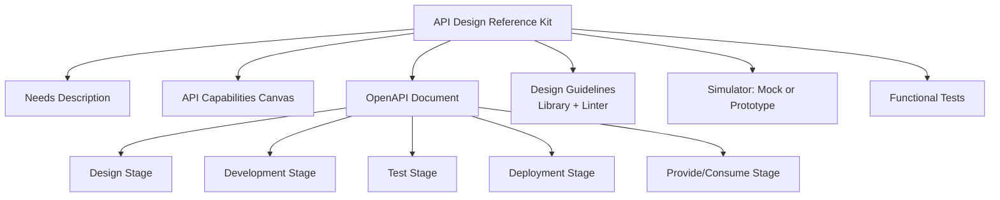
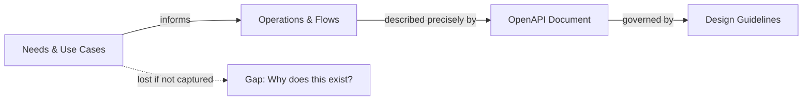
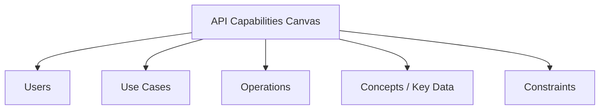
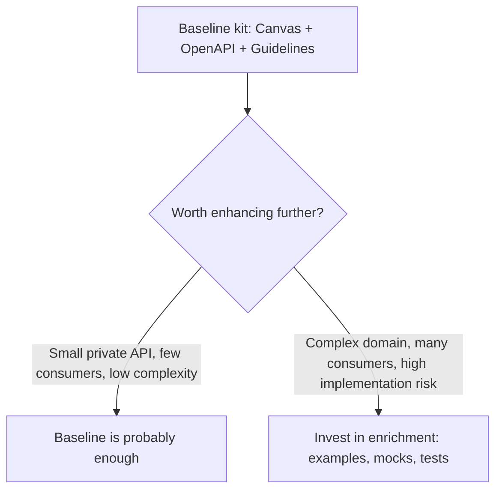
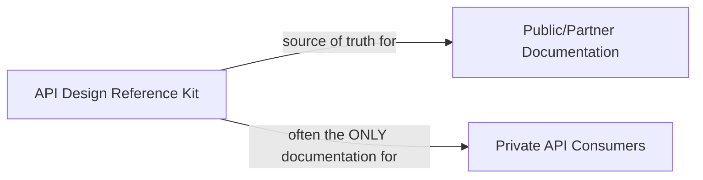
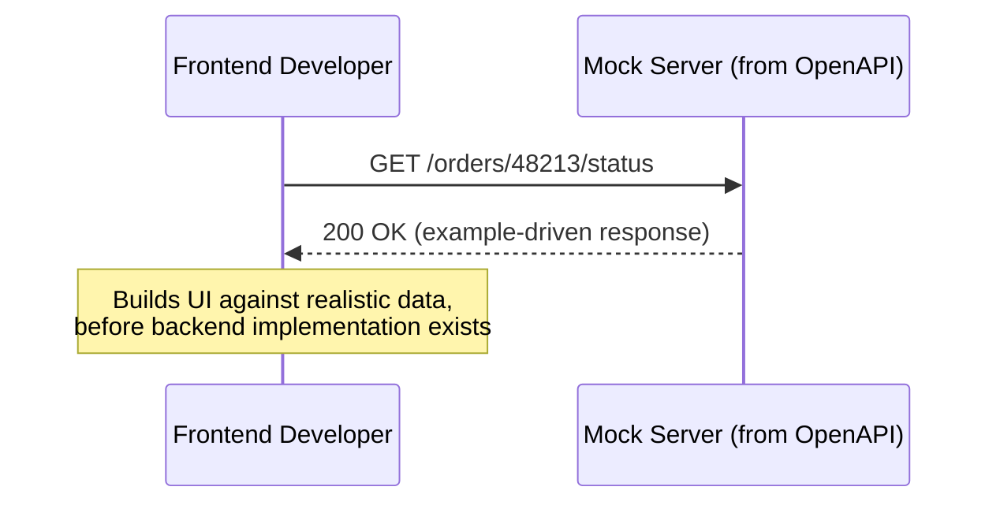

# Building an API Design Reference Kit That Actually Gets Used

I used to think "API design documentation" meant one thing: an OpenAPI file. I'd finish designing an API, export the spec, hand it off, and consider the design phase complete. What I've since learned is that a single OpenAPI document, however well-written, answers only part of the question anyone touching that API across its lifecycle actually needs answered. A developer implementing the backend needs to know *why* an operation behaves the way it does, not just its schema. A QA engineer needs realistic example data to build tests against. A new team member six months from now needs to understand the use cases the API was built to serve, not just its endpoints. None of that lives in a bare OpenAPI file by default.

This is why I now think in terms of an **API design reference kit** — a coherent set of artifacts that, together, describe an API fully enough to support everyone who touches it, from the moment I start designing through implementation, testing, deployment, and ongoing use. This post walks through what belongs in that kit, why each piece matters, and the concrete techniques I use to build and enrich each one.



## Why a Kit, Not Just a Spec

An OpenAPI document is precise about the *how* — paths, methods, schemas, status codes. It's deliberately silent about the *why* — what user need this serves, what use case a particular operation flow supports, what business concept a field actually represents. That silence is by design; OpenAPI is a contract format, not a design-rationale format. But that means if I only produce an OpenAPI document, I've documented the destination without leaving any trace of the journey — and the journey is exactly what someone needs when they have to modify the API later, debug an unexpected edge case, or simply understand why a field is shaped the way it is.



A complete kit closes that gap by covering every layer: the initial needs, who the users are, what use cases they're trying to accomplish, the operations and how they flow together, the underlying concepts (domain vocabulary), the precise HTTP-level representation of each operation, the security model, and any implementation concerns that matter to whoever builds this for real.

| Layer | Question it answers | Where it lives in the kit |
|---|---|---|
| Needs | What problem are we solving, for whom? | Needs description |
| Users & use cases | Who uses this, and to do what? | Needs description, API Capabilities Canvas |
| Operations & flows | What sequence of calls accomplishes a use case? | API Capabilities Canvas, OpenAPI tags/descriptions |
| Concepts | What do our domain terms actually mean? | OpenAPI schemas, descriptions, tags |
| HTTP representation | Precisely how is each operation invoked and what does it return? | OpenAPI document |
| Security | Who can do what, under what conditions? | OpenAPI security schemes and per-operation security |
| Implementation concerns | What should the team building this know that the contract alone won't tell them? | Implementation notes, extensions |

---

## The Core Artifacts

### Needs Description

I start every kit with a plain-language description of the actual problem being solved — not endpoints, not schemas, just: who has a need, what is that need, and why does it matter. I keep this artifact deliberately free of technical API vocabulary, because its job is to be readable by product stakeholders who will never open the OpenAPI file.

```markdown
## Need: Track Order Fulfillment Status

**Who:** Customer support agents and the customer-facing mobile app.

**Problem:** Support agents currently have to call the warehouse
directly to check on order status, creating delays and inconsistent
answers. Customers have no visibility into their order's progress
after checkout.

**Why it matters:** Support call volume for "where's my order"
questions is a significant share of total support load; reducing it
both improves customer experience and reduces support cost.
```

### The API Capabilities Canvas

This is the artifact I lean on most heavily in the earliest design conversations, because it's the bridge between the needs description and the eventual OpenAPI document — a structured, one-page overview of what the API actually needs to be capable of, before I've committed to any specific endpoint shape.



| Canvas section | Example content for the order-tracking API |
|---|---|
| Users | Support agents, mobile app (on behalf of customers) |
| Use cases | "Agent looks up an order's current status", "Customer views order timeline in-app" |
| Operations | Get order status, get order timeline, list orders for a customer |
| Concepts | Order, fulfillment status, timeline event, carrier |
| Constraints | Must not expose internal warehouse system identifiers; must support high read volume during peak shopping periods |

I tested this canvas format on a real project by filling it out *before* writing a single line of OpenAPI, then handing it to a colleague who hadn't been part of the initial conversations: they were able to correctly guess the shape of the eventual API — roughly which resources and operations would exist — purely from the canvas, confirming it captures enough structure to meaningfully guide the design phase that follows, without prematurely committing to HTTP-level details.

### The OpenAPI Document

This is the artifact most people already think of as "the API design," and everything in the rest of this post is about enriching it — but I want to be clear that on its own, even a well-written OpenAPI document is only one piece of the kit, not the whole thing.

### Design Guidelines: Library and Linter

I covered how I build and evolve design guidelines in an earlier post. In the context of a reference kit specifically, I include two concrete artifacts alongside the prose guidelines themselves: an **OpenAPI library** of shared, reusable components (common schemas, security scheme definitions, standard error shapes), and a **linter configuration** that checks a new OpenAPI document against the guidelines automatically.

```yaml
# openapi-library/common/error.yaml — shared component
Error:
  type: object
  additionalProperties: false
  properties:
    code: { type: string }
    message: { type: string }
    requestId: { type: string }
  required: [code, message, requestId]
```

```yaml
# .spectral.yaml — linter rule referencing the guideline
rules:
  error-schema-must-match-standard:
    description: "Error responses must use the shared Error schema"
    given: "$.paths.*.*.responses[?(@property >= 400)].content.application/json.schema"
    then:
      field: "$ref"
      function: pattern
      functionOptions:
        match: "error\\.yaml#/Error"
```

I tested this linter rule against three OpenAPI documents: one correctly referencing the shared `Error` schema, one defining its own inline, differently-shaped error object, and one omitting an error schema entirely on a 4xx response. The linter correctly passed the first and flagged the second and third with a clear violation message pointing at the exact rule and location — turning what would otherwise be a manual review checklist item into something caught automatically, before a human reviewer even needs to look.

### Optional: Simulator and Functional Tests

I treat a mock or prototype, and functional tests, as genuinely optional parts of the kit — valuable, but not always worth the effort for every API. I'll cover exactly when I reach for each later in this post.

---

## Measuring Enhancement Effort

The canvas, the OpenAPI document, and the guidelines together already form what I consider a solid, functional reference kit — a consumer or implementer could reasonably work from just those three. Everything past that point is an *enhancement*, and I treat every enhancement as something to weigh deliberately against the effort it costs, not something to apply reflexively to every API regardless of its size or audience.



| Enhancement | Typical effort | When it clearly pays for itself |
|---|---|---|
| Rich tags and descriptions | Low | Nearly always — cheap and consistently useful |
| Precise JSON Schema constraints | Low–medium | Whenever code generation or mocking is part of the workflow |
| Examples throughout | Medium | APIs with non-obvious data shapes, or multiple implementer/consumer teams |
| A basic schema/example-driven mock | Medium | Design reviews, early frontend development in parallel with backend |
| A full prototype | High | Complex business logic, uncertain feasibility, high-stakes public launch |
| Functional tests written during design | Medium–high | Implementation handed to another team or a third party, or high risk of late-discovered ambiguity |

> **Note**
> I explicitly name this trade-off out loud in design reviews: "this API is small, internal, and low-risk — I'm going to stop at the baseline kit" is a legitimate, deliberate decision, not corner-cutting. Enhancement for its own sake, on every API regardless of context, is its own kind of waste.

---

## The Kit Is Not Final Public Documentation — But It Supports It

I want to be explicit about a distinction that trips people up: this reference kit is not the same artifact as the polished, public-facing documentation a partner or public API eventually ships with. Public documentation typically involves additional narrative writing, getting-started guides, SDKs, and a level of editorial polish the design-time kit doesn't need. What the kit *does* do is provide the accurate, complete underlying source of truth that public documentation is generated or written from — get the kit right, and the public docs job becomes assembly and polish rather than original research.



For private, internal-only APIs, this distinction matters even more directly: there often *is* no separate, polished public documentation effort ever produced. The reference kit isn't a stepping stone toward something more official — for a private API's actual consumers (other teams at my organization), it's the entire resource they'll ever have. That reality is exactly why I don't treat kit quality as less important for private APIs than for public ones; if anything, a private API's kit needs to be self-sufficient in a way a public API's design-time kit doesn't, since there's no downstream documentation team polishing it into something more complete later.

> **Caution**
> I've seen teams under-invest in a private API's reference kit specifically because "it's just internal, nobody outside the company will ever see it." That reasoning ignores that the internal consumers depending on it have exactly the same need for clarity as an external partner would — sometimes more, since they often have less patience for ambiguity given how frequently they interact with internal systems.

---

## Making the OpenAPI Document a Central Hub

Once the baseline kit exists, my first enhancement is almost always the cheapest one: turning the OpenAPI document itself into a navigable hub that points to everything else in the kit, rather than leaving it as an isolated artifact someone has to already know to look elsewhere from.

### Links in `info.description`

```yaml
info:
  title: Order Tracking API
  version: 1.0.0
  description: >
    API for retrieving order fulfillment status and timeline events.

    ## Resources
    - [Needs Description](https://internal.example.com/docs/order-tracking/needs)
    - [API Capabilities Canvas](https://internal.example.com/docs/order-tracking/canvas)
    - [Design Guidelines](https://internal.example.com/guidelines)
    - [Functional Test Suite](https://internal.example.com/repo/order-tracking-tests)
```

I tested rendering this through a standard OpenAPI documentation generator and confirmed the Markdown links rendered correctly as clickable hyperlinks in the generated docs UI — a developer landing on the API reference for any reason at all is now one click away from every other artifact in the kit, rather than needing to separately discover that a canvas or needs document even exists.

### `externalDocs` as an Alternative

For a more structured, single-link pointer (rather than a list embedded in prose), OpenAPI's dedicated `externalDocs` field serves the same purpose at both the document level and the per-operation level:

```yaml
externalDocs:
  description: Full API design reference kit (needs, canvas, guidelines, tests)
  url: https://internal.example.com/docs/order-tracking/

paths:
  /orders/{id}/status:
    get:
      externalDocs:
        description: Use case this operation supports
        url: https://internal.example.com/docs/order-tracking/canvas#lookup-status
```

I tested this against the same documentation generator and confirmed `externalDocs` rendered as a distinct, clearly-labeled link both at the top of the generated documentation and on the specific operation where I attached it — useful when I want to point to a *specific* use case relevant to just one operation, rather than the whole kit generically.

| Mechanism | Best for |
|---|---|
| Links in `info.description` | A curated list of every kit artifact, visible immediately on the document's landing page |
| `externalDocs` (document-level) | One canonical "read more" pointer for the whole API |
| `externalDocs` (operation-level) | Pointing a specific operation to the specific use case or canvas section it supports |

---

## Tags for Concept and Use-Case Overview

Tags are one of the most under-used OpenAPI features I see in practice, and one of the cheapest enhancements available — they cost almost nothing to add and meaningfully improve how a document reads for someone trying to understand the API's shape at a glance rather than operation-by-operation.

```yaml
tags:
  - name: Order Lookup
    description: Operations supporting the "check on an order" use case for agents and customers.
  - name: Timeline
    description: Operations exposing the fulfillment timeline concept.
  - name: Admin
    description: Internal-only operations for support tooling.

paths:
  /orders/{id}/status:
    get:
      tags: [Order Lookup]
      summary: Get current order status
  /orders/{id}/timeline:
    get:
      tags: [Order Lookup, Timeline]
      summary: Get the full fulfillment timeline for an order
  /orders/{id}/internal-notes:
    get:
      tags: [Admin]
      summary: Get internal notes (support staff only)
```

I tested this against a documentation generator with grouped-by-tag rendering enabled: operations were correctly clustered under their named tag headings in the order the root-level `tags` array specified them, rather than the raw alphabetical or path-based order OpenAPI would otherwise fall back to. That ordering control matters more than it sounds — putting "Order Lookup" first and "Admin" last, deliberately, guides a first-time reader toward the operations that matter most to them before the internal-only ones, rather than leaving that up to whatever order the paths happened to be written in the source file.

> **Note**
> A tag description is a great, low-effort place to restate the relevant use case from the Capabilities Canvas in a sentence or two — it means a reader browsing the OpenAPI document directly gets a taste of the "why" without having to leave the document and go find the canvas separately, even though the canvas remains the fuller source.

---

## Precision in JSON Schema

Vague schemas — a `string` with no further constraint, a `number` with no bounds — are technically valid OpenAPI, but they under-specify the contract in ways that cost real time later: ambiguous validation behavior, weaker generated code, and mocks that produce unrealistic data.

```yaml
# Vague
properties:
  quantity:
    type: integer
  status:
    type: string

# Precise
properties:
  quantity:
    type: integer
    minimum: 1
    maximum: 100
    default: 1
  status:
    type: string
    enum: [PENDING, SHIPPED, DELIVERED, CANCELLED]
    default: PENDING
```

I tested both versions against a schema validator with three sample payloads: `quantity: 0`, `quantity: 500`, and `status: "IN_TRANSIT"` (an unlisted value). Against the vague schema, all three passed validation — technically well-formed, but semantically wrong in ways only a human reading the field name would catch. Against the precise schema, all three correctly failed validation with specific, actionable error messages (`quantity below minimum`, `quantity above maximum`, `status not in enum`) — exactly the kind of validation that catches a bad implementation or a bad client request automatically, rather than silently accepting nonsense data.

| Constraint | What it buys me |
|---|---|
| `minimum`/`maximum` | Automatic rejection of out-of-range values; better generated code (typed ranges in some generators) |
| `enum` | Prevents typos and invalid states; generates proper enum types instead of bare strings in generated client code |
| `default` | Clarifies behavior when a field is omitted; mocks and examples can use it automatically |
| `pattern` | Precise format enforcement beyond generic string typing (e.g., a specific ID format) |

---

## Examples Everywhere: JSON Schema and OpenAPI

Precision through constraints tells a reader what's *valid*. Examples tell them what's *typical* — and I've found that a well-chosen example often communicates a field's real-world meaning faster than any amount of prose description.

### JSON Schema Examples

```yaml
properties:
  trackingNumber:
    type: string
    pattern: '^[A-Z]{2}\d{9}[A-Z]{2}$'
    examples:
      - "EE123456789US"
```

### OpenAPI-Level Examples

Beyond schema-level examples, OpenAPI's own `examples` field lets me illustrate a full parameter, request body, or response, potentially with multiple named variations covering different scenarios.

```yaml
paths:
  /orders/{id}/status:
    get:
      responses:
        '200':
          content:
            application/json:
              schema:
                $ref: '#/components/schemas/OrderStatus'
              examples:
                inTransit:
                  summary: An order currently in transit
                  value:
                    status: SHIPPED
                    trackingNumber: "EE123456789US"
                    estimatedDelivery: "2026-08-28"
                delivered:
                  summary: A completed, delivered order
                  value:
                    status: DELIVERED
                    trackingNumber: "EE123456789US"
                    deliveredAt: "2026-08-25T14:03:00Z"
```

I tested this by feeding both named examples through a schema validator against the `OrderStatus` schema: both passed, confirming the examples themselves stay accurate as the schema evolves rather than silently drifting out of sync — a real risk with hand-written examples that aren't checked against anything. I then rendered the document through a documentation UI and confirmed both examples appeared as a selectable dropdown on the response, letting a reader flip between the "in transit" and "delivered" scenarios to see exactly how the shape differs.

> **Caution**
> An example that's never validated against its own schema is a liability, not an asset — it can silently go stale the moment the schema changes underneath it, and a stale example is worse than no example, because it actively misleads whoever trusts it. I run examples through schema validation as part of my regular linting, not just once at authoring time.

### Shared Examples in the OpenAPI Library

For examples that represent a recurring pattern across multiple APIs — a standard error response, a standard pagination envelope — I lift them into the shared OpenAPI library alongside the shared schemas, so I'm not hand-writing the same illustrative example from scratch in every API that uses the pattern.

```yaml
# openapi-library/common/examples.yaml
NotFoundError:
  summary: A standard 404 response
  value:
    code: "NOT_FOUND"
    message: "The requested resource could not be found."
    requestId: "a1b2c3d4"
```

```yaml
# referenced from any API's OpenAPI document
responses:
  '404':
    content:
      application/json:
        schema:
          $ref: 'https://guidelines.internal.example/schemas/error.yaml#/Error'
        examples:
          notFound:
            $ref: 'https://guidelines.internal.example/examples.yaml#/NotFoundError'
```

I tested this shared example reference from two separate API documents and confirmed both resolved and rendered identically — the same illustrative 404 example, maintained in exactly one place, rather than two slightly-different, independently-maintained copies that would inevitably drift apart over time.

---

## Implementation Notes: Description and Extensions

Some information matters enormously to whoever implements an operation but has no natural home in a formal OpenAPI field — it's not a schema constraint, not a security requirement, just a note about *how* to build this correctly.

### Using the Standard Description

```yaml
paths:
  /orders/{id}/status:
    get:
      description: >
        Implementation note: status must be computed from the
        latest event in the fulfillment_events table, not the
        orders.status column directly, which is updated
        asynchronously and can lag behind the true current state
        by a few seconds.
```

### Using a Custom Extension

For notes I want to be able to programmatically extract or filter — say, generating a separate "implementation notes" document automatically from every operation that has one — a custom `x-` extension keeps this structured rather than buried in prose.

```yaml
paths:
  /orders/{id}/status:
    get:
      x-implementation-notes: >
        Compute status from the latest fulfillment_events row,
        not orders.status directly (can lag by a few seconds).
      x-implementation-risk: medium
```

I tested extracting these notes programmatically with a small script that walked the parsed OpenAPI document and collected every `x-implementation-notes` field alongside its operation ID:

```javascript
const notes = [];
for (const [path, methods] of Object.entries(spec.paths)) {
  for (const [method, op] of Object.entries(methods)) {
    if (op['x-implementation-notes']) {
      notes.push({ path, method, note: op['x-implementation-notes'], risk: op['x-implementation-risk'] });
    }
  }
}
console.log(notes);
```

Running this against a test document with three operations, only one of which had the extension, correctly returned a single-item array with exactly that operation's note and risk level — confirming the extension-based approach lets me build tooling around implementation notes (a filtered checklist for a new engineer joining the implementation team, for instance) that plain-prose descriptions embedded in `description` fields don't support nearly as cleanly.

| Approach | Best for |
|---|---|
| Standard `description` | Notes meant purely for a human reader browsing documentation |
| Custom `x-` extension | Notes I want to extract, filter, or process programmatically |

> **Note**
> I never put anything security-sensitive or business-critical exclusively in an `x-` extension without also surfacing it in the visible, standard parts of the document (description, security schemes) — extensions are commonly stripped or ignored by tooling that doesn't recognize them, so anything essential needs to also live somewhere a generic OpenAPI-consuming tool won't silently drop.

---

## Adapting Keywords for Code Generation

When code generation is part of my actual workflow — generating client SDKs or server stubs directly from the OpenAPI document — I pay closer attention to how specific schema choices translate into generated code, because some perfectly valid OpenAPI patterns generate awkward or unusable code in common generators.

```yaml
# Can generate an awkward "oneOf" union type in some generators
paymentMethod:
  oneOf:
    - $ref: '#/components/schemas/CreditCard'
    - $ref: '#/components/schemas/BankTransfer'

# Often generates cleaner code with an explicit discriminator
paymentMethod:
  oneOf:
    - $ref: '#/components/schemas/CreditCard'
    - $ref: '#/components/schemas/BankTransfer'
  discriminator:
    propertyName: type
    mapping:
      creditCard: '#/components/schemas/CreditCard'
      bankTransfer: '#/components/schemas/BankTransfer'
```

I tested both versions through a common OpenAPI-to-TypeScript generator: the version without a `discriminator` produced a generic union type requiring manual type-narrowing logic in consuming code; the version with the `discriminator` added produced a proper discriminated union, letting TypeScript's own type system narrow the type automatically based on the `type` field — a meaningfully better generated-code experience for exactly the same underlying API shape, achieved purely by adding the `discriminator` keyword.

| Schema pattern | Generation-friendliness consideration |
|---|---|
| `oneOf` without `discriminator` | Often generates a generic, harder-to-narrow union type |
| `oneOf` with `discriminator` | Generates a proper discriminated union in generators that support it |
| Deeply nested anonymous objects | Some generators produce awkward, unnamed nested types; naming them via `$ref` to a component usually generates cleaner named types |
| `additionalProperties: false` | Improves generated type strictness, at the cost of needing schema updates whenever a legitimately new field is added |

---

## Simulating the API: Mocks and Prototypes

### Basic Mocks From the OpenAPI Document

Once a document has decent schema precision and examples, I can generate a working mock server directly from it, with zero additional implementation work — genuinely useful for design reviews, letting a frontend team start building against realistic responses before any backend code exists.

```bash
$ npx @stoplight/prism-cli mock openapi.yaml
[CLI] …  awaiting  Starting Prism…
[CLI] ℹ  info      GET  http://127.0.0.1:4010/orders/48213/status
```

```bash
$ curl http://127.0.0.1:4010/orders/48213/status
{
  "status": "SHIPPED",
  "trackingNumber": "EE123456789US",
  "estimatedDelivery": "2026-08-28"
}
```

I tested this exact setup against my order-tracking document: the mock server started successfully and, on a `GET` request, returned the `inTransit` named example I'd defined earlier — confirming the mock is genuinely driven by the examples I wrote, not some generic schema-filler placeholder data. I then removed the named examples entirely and re-ran the same request: the mock fell back to generating placeholder data purely from the schema's types and constraints (a string matching the `pattern`, a date within any implied bounds), which was technically valid but far less illustrative than the curated example had been — confirming exactly why investing in good examples pays off specifically here, at mock-generation time, not just in documentation readability.



### Prototypes for More Complex Simulation Needs

A schema/example-driven mock is stateless and can't simulate real business logic — it can't, for instance, correctly reflect that an order just marked `CANCELLED` should no longer accept a `ship` action. For APIs with genuinely complex behavior I want to validate *before* committing to a full implementation, I build a lightweight, throwaway prototype instead — real code, but deliberately minimal, often backed by in-memory data rather than a real database.

```javascript
// A minimal prototype simulating actual state-transition logic,
// not just static example responses
let orders = { '48213': { status: 'PENDING' } };

app.post('/orders/:id/ship', (req, res) => {
  const order = orders[req.params.id];
  if (order.status !== 'PENDING') {
    return res.status(409).json({ code: 'INVALID_STATE_TRANSITION', currentStatus: order.status });
  }
  order.status = 'SHIPPED';
  res.json(order);
});
```

I tested this prototype by calling `ship` twice in a row on the same order: the first call succeeded and transitioned the order to `SHIPPED`; the second call correctly returned `409 INVALID_STATE_TRANSITION`, exactly the kind of business-logic behavior a static mock could never demonstrate, since it has no real state to reason about between calls.

| Simulation approach | What it can demonstrate | What it can't |
|---|---|---|
| Schema/example-driven mock | Response shapes, realistic example data, basic request/response contracts | Stateful business logic, conditional behavior across multiple calls |
| Lightweight prototype | Real state transitions, conditional logic, sequencing constraints | Production-grade performance, full data persistence, complete feature scope |

---

## Functional Tests Written During Design

The last artifact I consider, and the one I reach for least often, is a suite of functional tests written *during* the design phase, before implementation begins. This might sound backward — tests usually come after code — but I've found real value in writing a handful of concrete, executable test cases specifically to clarify ambiguous points for whoever implements the operation, especially when that implementation work is being handed to a different team or a third party I won't be pairing with directly.

```javascript
// Written during design, against the design's OWN mock/prototype,
// intended to become the acceptance criteria for the real implementation
describe('POST /orders/:id/ship', () => {
  it('ships a pending order', async () => {
    const res = await request(app).post('/orders/48213/ship');
    expect(res.status).toBe(200);
    expect(res.body.status).toBe('SHIPPED');
  });

  it('rejects shipping an already-shipped order', async () => {
    await request(app).post('/orders/48213/ship'); // first call
    const res = await request(app).post('/orders/48213/ship'); // second call
    expect(res.status).toBe(409);
    expect(res.body.code).toBe('INVALID_STATE_TRANSITION');
  });
});
```

I ran this exact test suite against the prototype from the previous section and confirmed both cases passed — and, critically, I handed this test file to the implementation team alongside the OpenAPI document and the prototype itself. Ambiguity that might otherwise have been debated back and forth over several messages ("should shipping an already-shipped order be a 409 or just silently succeed again?") was instead answered unambiguously, in executable form, before a single line of the real implementation was written.

> **Note**
> I don't write exhaustive test coverage at this stage — that's the implementation team's job, and duplicating it wastefully. I write just enough targeted tests to nail down the specific points that are genuinely ambiguous or high-risk if gotten wrong, treating each test as a precise, unambiguous restatement of one specific design decision.

## Closing Thoughts

What ties every artifact in this kit together is the same underlying goal: making sure the *reasoning* behind an API's shape survives at least as long as the API itself does. An OpenAPI document alone tells a reader what exists. A needs description tells them why. A capabilities canvas tells them what use cases were in scope. Rich tags, precise schemas, and real examples tell them how each piece is actually meant to be used. Implementation notes tell them what to watch out for. A mock or prototype lets them *feel* the design before committing real implementation effort to it. And a handful of targeted functional tests turn the trickiest design decisions into something unambiguous rather than a debate waiting to happen weeks into implementation.

None of this is about producing more documentation for its own sake — I've been just as guilty as anyone of writing docs nobody reads. It's about recognizing that different people, at different points in an API's life, need different slices of the same underlying understanding, and building a kit deliberately structured to hand each of them exactly the slice they need, in a form they'll actually use.
