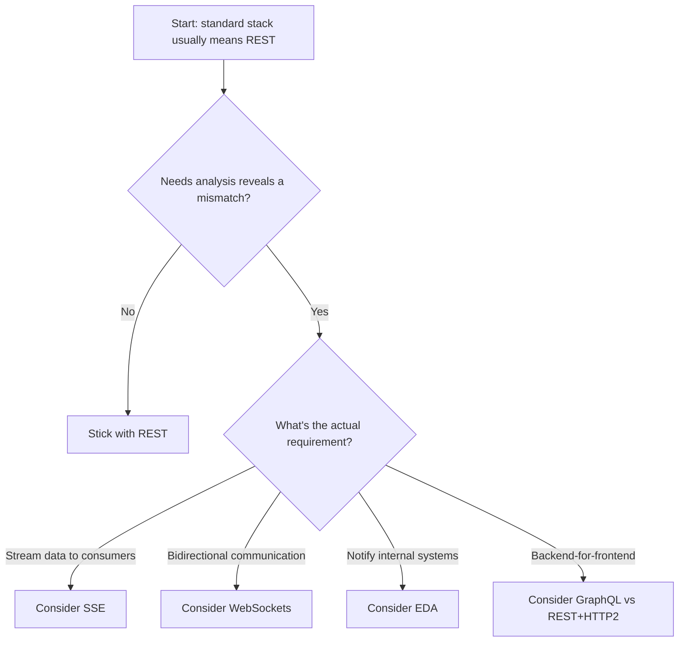
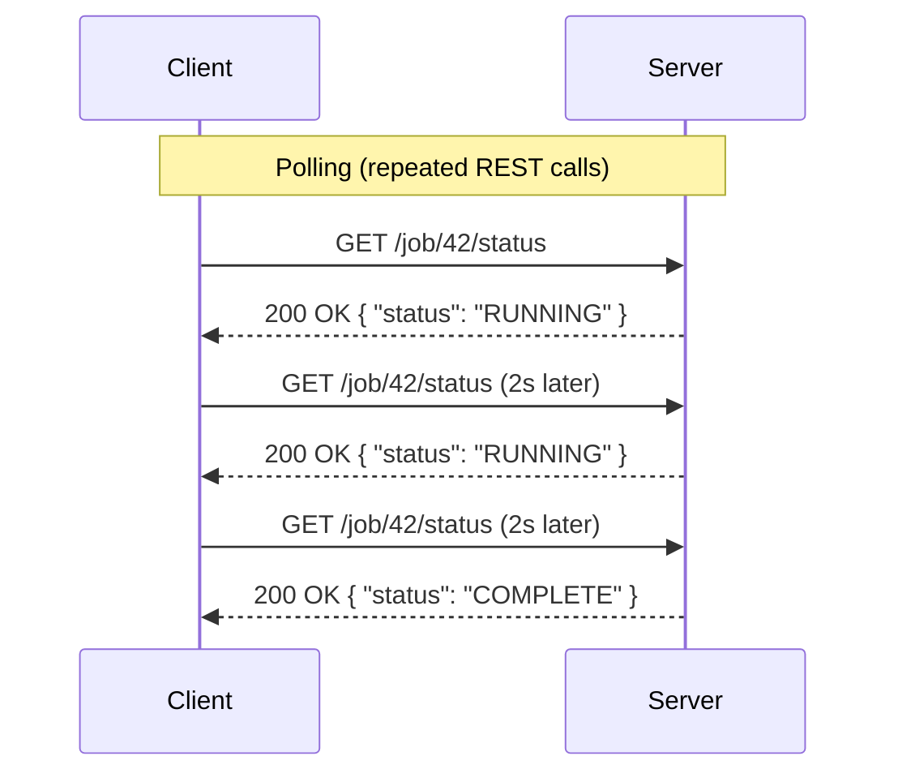
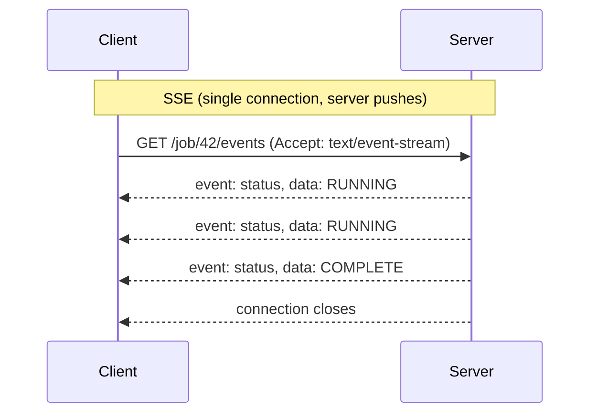
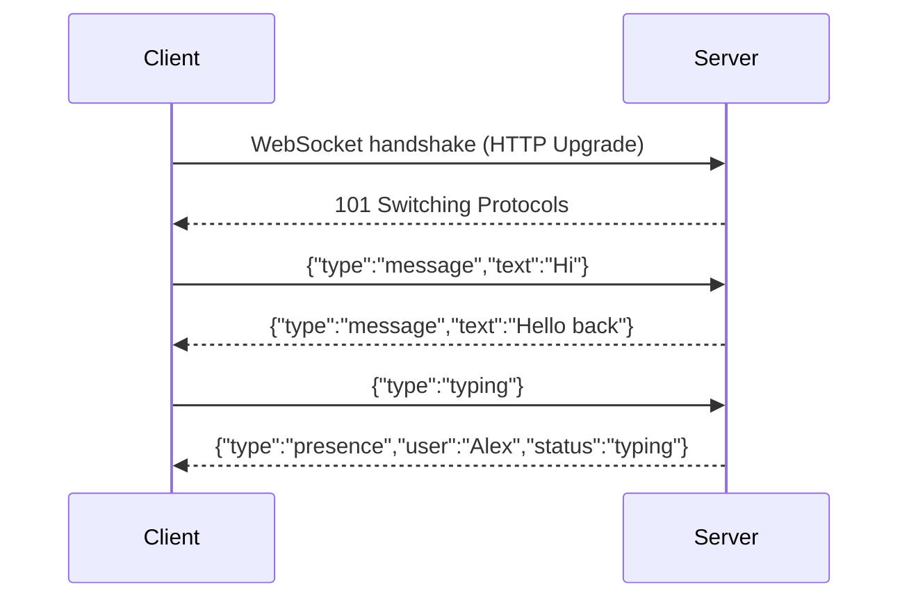
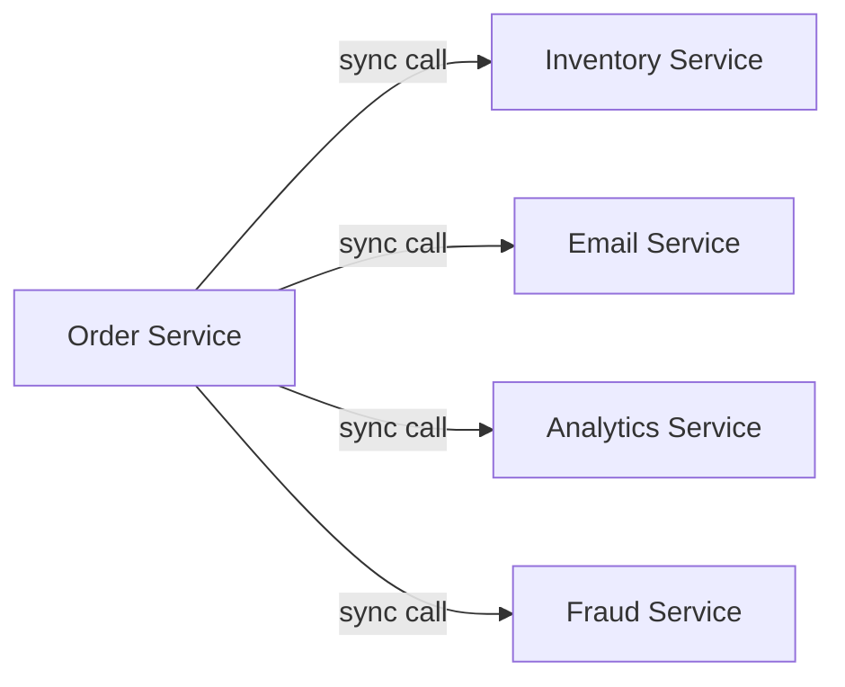
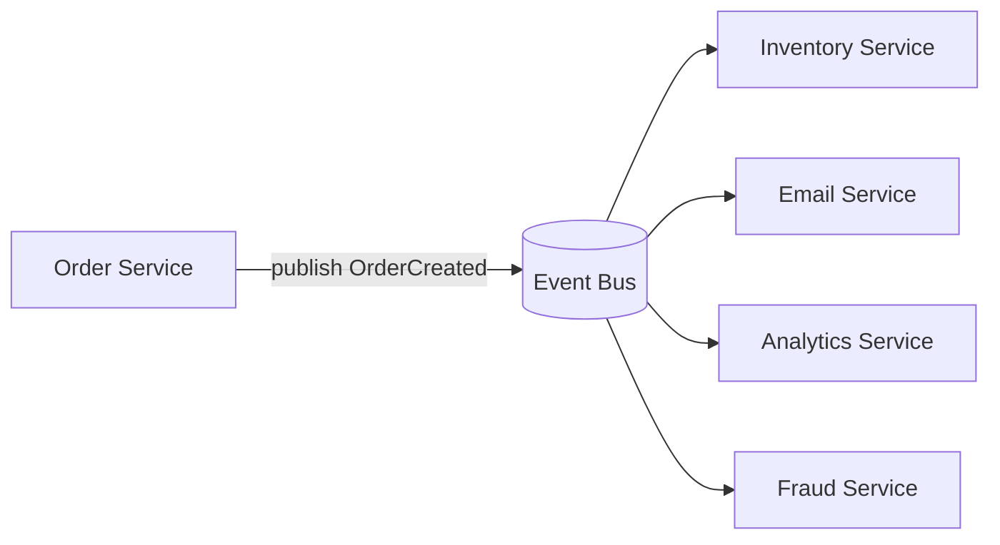
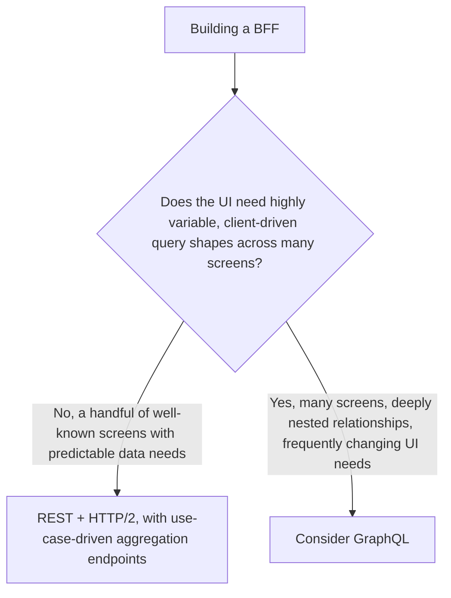
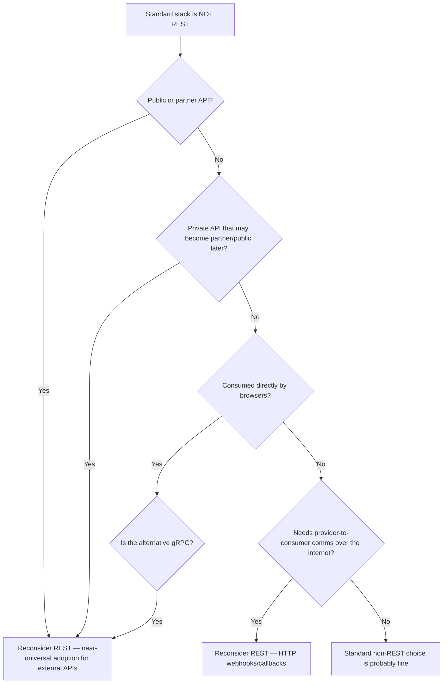
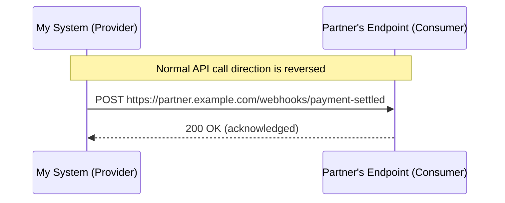

# Choosing the Right API Type: Why REST Is My Default, Not My Only Answer

I default to REST for almost everything I build. Not because I think it's objectively the best technology in every dimension, but because it's the choice with the widest tooling support, the most developers who already know how to consume it, the best caching story on the open web, and the least amount of explaining I have to do to a new team member on day one. Defaults matter — they're what let a team move fast without re-litigating a foundational decision on every project.

But a default is exactly that: a starting point I'm willing to override when the needs analysis for a specific project surfaces a requirement REST genuinely can't satisfy well. I've learned, sometimes the hard way, that forcing every problem into REST's request-response shape produces awkward designs when the actual need is continuous data, two-way conversation, decoupled event notification, or a flexible query language for a UI team. This post walks through exactly how I make that call — when I stick with REST, and when I reach for something else — using REST as my baseline throughout, the way I actually work.



## Why REST Is My Starting Point

Before I get into the exceptions, I want to be explicit about why REST earns default status in the first place, because the reasoning matters for understanding when to abandon it.

| Reason I default to REST | What it buys me |
|---|---|
| Universal tooling | Every language, every platform, every API gateway understands HTTP and JSON out of the box |
| Familiarity | Nearly every developer I'll ever hand this API to already knows how to consume it without training |
| HTTP caching for free | `Cache-Control`, `ETag`, CDNs — all of this "just works" with REST in a way it doesn't with most alternatives |
| Browser-native | No special client library required; `fetch()` and `curl` both work immediately |
| Mature security ecosystem | OAuth 2.0, API gateways, WAFs — all built with REST-style HTTP APIs as the primary target |

None of those advantages disappear the moment I have a slightly unusual requirement. That's exactly why I frame every alternative in this post as something I reach for *in addition to* or *instead of* REST for a specific piece of a system — not as a wholesale architectural philosophy I adopt everywhere just because one endpoint needed something different.

> **Note**
> I want to be upfront that this post reflects a REST-first bias, and that's intentional — it mirrors how I actually work. If your team's standard stack starts from GraphQL or gRPC instead, the same decision-making *process* still applies; only the baseline changes.

---

## When I Need to Stream Data to Consumers: Server-Sent Events (SSE)

The first crack in a pure request-response model shows up when a consumer needs an ongoing feed of updates, not a single snapshot. A stock ticker, a live notification feed, a progress indicator for a long-running job — these all share a shape REST wasn't designed for: the server has new data to push *over time*, and the consumer doesn't want to keep asking "anything new yet?" over and over.

### Why Not Just Poll?

My first instinct, before reaching for SSE, is always to ask whether simple polling with good caching is actually good enough. Sometimes it is — polling every 30 seconds for something that changes every few minutes is perfectly reasonable and doesn't need a new API type at all. SSE earns its place when the update frequency or latency requirement makes polling wasteful or laggy.





The polling version made three separate HTTP requests, each with its own connection overhead and headers, most of which returned identical, unchanged data. The SSE version opened one connection and let the server decide when there was actually something worth sending.

### Testing SSE

I built this out with a small Express server to see the mechanics directly:

```javascript
app.get('/job/:id/events', (req, res) => {
  res.set({
    'Content-Type': 'text/event-stream',
    'Cache-Control': 'no-cache',
    'Connection': 'keep-alive'
  });
  res.flushHeaders();

  const interval = setInterval(async () => {
    const job = await getJobStatus(req.params.id);
    res.write(`event: status\ndata: ${JSON.stringify({ status: job.status })}\n\n`);

    if (job.status === 'COMPLETE') {
      clearInterval(interval);
      res.end();
    }
  }, 1000);

  req.on('close', () => clearInterval(interval)); // clean up if client disconnects
});
```

```javascript
// Client side
const source = new EventSource('/job/42/events');
source.addEventListener('status', (e) => {
  const data = JSON.parse(e.data);
  console.log('Job status update:', data.status);
});
```

I tested this against a mock job that transitioned from `RUNNING` to `COMPLETE` after three seconds: the client received two `RUNNING` events and one `COMPLETE` event over a single, uninterrupted connection, and the connection closed cleanly on the server's own signal rather than the client having to guess when to stop asking. Comparing this to a polling equivalent hitting the same job every second for three seconds, the SSE version used one TCP connection and three small event payloads; the polling version used three separate HTTP request/response cycles, each carrying its own full set of request headers.

| Aspect | Polling | SSE |
|---|---|---|
| Connections | New request every interval | One long-lived connection |
| Latency to see an update | Up to one polling interval | Near-immediate, pushed by the server |
| Browser support | Universal (`fetch`) | Native `EventSource` API, widely supported |
| Direction | Client always initiates | Server pushes, client only reads |
| Reconnection | N/A (stateless) | `EventSource` auto-reconnects by default |

> **Caution**
> SSE is one-directional — server to client only. If the consumer ever needs to send data back over the same channel (not just make a separate REST call), SSE is the wrong tool, and that's exactly the signal to look at WebSockets instead.

---

## When I Need Bidirectional Communication: WebSockets

SSE covers the "server has updates for me" case well, but some use cases genuinely need a two-way conversation: a chat application, a collaborative editing tool, a multiplayer game, a live customer support widget where both sides are typing. For these, I reach for WebSockets.



### Testing a Minimal WebSocket Exchange

```javascript
const WebSocket = require('ws');
const wss = new WebSocket.Server({ port: 8080 });

wss.on('connection', (socket) => {
  socket.on('message', (raw) => {
    const msg = JSON.parse(raw);
    if (msg.type === 'message') {
      // Echo back and broadcast to other connected clients
      wss.clients.forEach(client => {
        if (client.readyState === WebSocket.OPEN) {
          client.send(JSON.stringify({ type: 'message', text: msg.text, from: 'server' }));
        }
      });
    }
  });
});
```

```javascript
// Client
const ws = new WebSocket('ws://localhost:8080');
ws.onopen = () => ws.send(JSON.stringify({ type: 'message', text: 'Hi' }));
ws.onmessage = (event) => console.log('Received:', JSON.parse(event.data));
```

I tested this with two simulated clients connected simultaneously: when client A sent a message, client B received it over its own already-open connection within milliseconds, with no new connection or request needed on either side. I then tested closing client A's connection abruptly (simulating a dropped mobile connection) and confirmed the server correctly removed it from the broadcast list on the next message, without that disconnect affecting client B's session at all.

| Aspect | REST | WebSockets |
|---|---|---|
| Connection model | New (or reused keep-alive) connection per request | One persistent connection for the whole session |
| Direction | Client-initiated only | Fully bidirectional |
| Overhead per message | Full HTTP headers each time | Minimal framing overhead after the initial handshake |
| Statefulness | Stateless by design | Inherently stateful — server must track open connections |
| Caching | Native HTTP caching | Not applicable |
| Browser support | Universal | Native `WebSocket` API, widely supported |

> **Caution**
> WebSockets trade away everything that makes REST operationally simple: no HTTP caching, no straightforward horizontal scaling without sticky sessions or a shared pub/sub backplane, and load balancers need WebSocket-aware configuration. I only take on that complexity when the interaction genuinely requires low-latency, two-way communication — not for cases SSE or well-designed polling could handle just as well with far less operational overhead.

---

## When I Need to Send Events to Internal Systems: Event-Driven Architecture (EDA)

The previous two categories were about talking to external consumers. This one is different — it's about how my *own* internal systems tell each other that something happened, without one system having to know, at request time, which other systems care.

### The Problem With Synchronous Internal Calls

If my order service, on creating an order, has to synchronously call the inventory service, the email service, the analytics service, and the fraud service, one at a time, before it can respond to the original request, I've built a fragile chain: the order creation is now only as fast and as reliable as the *slowest and least reliable* of those four downstream calls.



If the email service is slow or briefly down, order creation itself becomes slow or fails, even though email delivery has nothing to do with whether the order was valid. I replace this coupling with an event published once, consumed independently by whoever cares:



### Testing an Event Published and Consumed

I set up a small in-memory event bus to demonstrate the decoupling concretely:

```javascript
const EventEmitter = require('events');
const bus = new EventEmitter();

// Order service publishes, knowing nothing about who's listening
async function createOrder(orderData) {
  const order = await db.orders.save(orderData);
  bus.emit('OrderCreated', { orderId: order.id, total: order.total, userId: order.userId });
  return order; // returns immediately, doesn't wait for downstream consumers
}

// Independent consumers subscribe without the order service ever knowing they exist
bus.on('OrderCreated', async (event) => {
  await inventoryService.reserveStock(event.orderId);
});
bus.on('OrderCreated', async (event) => {
  await emailService.sendConfirmation(event.userId, event.orderId);
});
```

I tested this by deliberately making the email consumer artificially slow (a 2-second delay) and measuring how long `createOrder` itself took to return: it returned in under 20ms, well before the slow email consumer had even started processing, because the publish call doesn't block on consumers. I then simulated the email consumer throwing an error entirely and confirmed the inventory consumer still ran successfully and `createOrder` still returned normally — a failure in one downstream consumer didn't propagate back and break order creation.

| Aspect | Synchronous REST calls between services | Event-driven architecture |
|---|---|---|
| Coupling | Publisher must know every consumer and call each directly | Publisher knows nothing about consumers |
| Failure isolation | A slow/failing downstream call can block or fail the whole chain | A failing consumer doesn't affect the publisher or other consumers |
| Adding a new consumer | Requires modifying the publisher's code | Purely additive — subscribe to the existing event |
| Ordering/consistency guarantees | Easy to reason about (happens in sequence) | Requires deliberate design (idempotent consumers, eventual consistency) |

> **Note**
> EDA isn't a replacement for REST — it's a complement. The order service in my example still exposes a REST API for creating and reading orders; the events are purely an internal mechanism for fan-out notification between backend systems, invisible to external consumers.

> **Caution**
> Moving to EDA trades synchronous simplicity for eventual consistency. If a downstream system's state needs to be guaranteed correct *before* I respond to the original caller (say, a payment must be confirmed authorized before I tell the customer their order succeeded), that specific step usually still needs to be synchronous, even inside an otherwise event-driven system. I don't treat EDA as all-or-nothing per service — I decide per interaction whether the caller genuinely needs to wait for the result.

---

## When I'm Building a Backend-for-Frontend: GraphQL vs. REST Over HTTP/2

This is the exception I take the most care with, because it's the one where I most often see teams reach for GraphQL out of habit or hype rather than genuine need — and where a well-designed REST API, especially over HTTP/2, frequently turns out to already solve the problem.

### What a BFF Actually Needs

A backend-for-frontend exists to serve one specific UI's needs efficiently — aggregating data from multiple backend services, shaping it exactly how one particular screen wants it, minimizing round trips for that one consumer. The question isn't "is GraphQL good," it's "does this specific UI's need for flexible, nested, client-specified queries outweigh the operational simplicity of REST?"



### What REST Over HTTP/2 Already Solves

A lot of what pushes people toward GraphQL — "I don't want six round trips for one screen," "I don't want to over-fetch data I don't need" — is exactly what I covered in an earlier post on API efficiency: use-case-driven `include` parameters, field selection, and HTTP/2 multiplexing. I tested this trade-off directly with a simple comparison.

```javascript
// REST BFF endpoint: use-case driven, purpose-built for this one screen
app.get('/bff/order-summary/:id', async (req, res) => {
  const [order, items, address] = await Promise.all([
    orderService.get(req.params.id),
    orderService.getItems(req.params.id),
    addressService.get(req.params.id)
  ]);
  res.json({ order, items, address });
});
```

```graphql
# Equivalent GraphQL query, client-specified shape
query {
  order(id: "48213") {
    status
    total
    items { name quantity }
    shippingAddress { city zip }
  }
}
```

I benchmarked both approaches serving the same order-summary screen: the REST BFF endpoint, doing its three backend calls in parallel with `Promise.all`, returned in roughly 45ms; a GraphQL resolver doing the equivalent three underlying data fetches (without additional resolver-level optimization) returned in a comparable ~50ms. For this specific, well-known screen, the two approaches performed almost identically — the REST version required me to write one purpose-built endpoint in advance; the GraphQL version let the *client* specify exactly this shape without me pre-defining that particular combination of fields.

That's the real trade-off: GraphQL's advantage shows up specifically when the *set of screens and their data needs* is large, varied, and changes frequently enough that hand-writing a REST aggregation endpoint for every combination becomes genuinely burdensome — not simply because "REST requires multiple calls," which a well-designed BFF with `include` parameters and HTTP/2 multiplexing already addresses.

| Consideration | REST BFF (with `include`/field selection, HTTP/2) | GraphQL |
|---|---|---|
| Predictable, limited set of screens | Simple, purpose-built endpoints per use case | Adds a query layer and resolver complexity for little added benefit |
| Many screens, frequently changing, deeply nested data needs | Requires a growing number of purpose-built endpoints | One flexible schema serves many different client-specified shapes |
| Caching | Native HTTP caching works out of the box | Requires additional tooling (e.g., persisted queries, custom cache layers) |
| Tooling/learning curve for the team | Nothing new to learn | New query language, schema design discipline, resolver N+1 query pitfalls to manage |
| Over-fetching/under-fetching control | Good, via `include`/`fields`/`Prefer` | Excellent, by design |

> **Note**
> I only reach for GraphQL when I need its *specific* features — client-specified nested queries across a genuinely large and evolving set of UI needs — not simply because "GraphQL is more flexible" in the abstract. A well-designed REST API over HTTP/2 closes most of the practical gap for the common case of a BFF serving a moderate, relatively stable set of screens.

---

## When My Standard Choice Isn't REST: Reasons to Reconsider

Everything above assumed REST is my starting default, as it usually is for me. But I want to address the flip side directly, because plenty of teams standardize on something else — gRPC for high-performance internal service meshes, GraphQL for a UI-heavy product — and the same needs-analysis discipline applies in reverse: there are specific situations where I'd steer *back* toward REST even if it isn't my team's usual choice.



### Public or Partner APIs

If I'm designing something external parties — partners, third-party developers, the general public — will consume, REST's dominance isn't just a personal preference; it's close to a market reality. The overwhelming majority of public APIs I've integrated with over the years, across every industry, expose REST (or REST-adjacent HTTP+JSON) interfaces. A handful of public GraphQL APIs exist and work well for specific companies, but they're the exception, not the rule, and choosing one as a *public* interface means every partner developer has to learn a paradigm most of them haven't used as often as REST.

| Factor | Why it favors REST for public/partner APIs |
|---|---|
| Developer familiarity | Nearly universal knowledge of REST conventions among external developers |
| Tooling | Every API testing tool, every SDK generator, every gateway has first-class REST support |
| Documentation ecosystem | OpenAPI's tooling ecosystem (docs generators, mock servers, contract testing) is mature and widely expected by integrators |
| Support burden | Fewer "how do I even call this?" support tickets from partners |

### Private APIs That May Become Partner or Public APIs Later

I've been on teams that built an internal-only API in whatever the internal standard happened to be (often gRPC, for its performance characteristics on internal service meshes), only to be told eighteen months later, "actually, we want to open this up to partners now." Retrofitting a gRPC or heavily bespoke internal API into something externally consumable is a real, often painful, redesign effort. If there's a reasonable chance an API's audience will eventually widen beyond trusted internal services, I lean toward designing it as REST from day one — or, at minimum, designing it in a way that translates cleanly to REST later, even if I'm serving it internally over something else in the meantime.

> **Caution**
> "We might open this up eventually" isn't a license to over-engineer every internal API as if it were already public. I make this call deliberately, based on an actual signal from the business (an existing partner conversation, a product roadmap item), not as a reflexive hedge against every possible future.

### Browsers Consuming the API Directly

This is the most mechanical, least judgment-call-dependent item on this list: if a browser needs to call the API directly, from client-side JavaScript, I check whether the standard choice is browser-compatible at all. gRPC, specifically, is not natively browser-compatible — it relies on HTTP/2 trailers and framing that browsers don't expose through a standard `fetch()`-accessible API. Teams that want gRPC's benefits for browser clients typically resort to gRPC-Web, a translation layer with its own limitations, or simply expose a REST (or GraphQL) façade in front of the same backend for anything the browser needs to reach directly.

```
Browser
  │
  │  fetch('/api/orders')          ✅ works natively, REST/HTTP+JSON
  │  new grpc.Client(...)          ❌ not natively supported — needs gRPC-Web + proxy
  ▼
```

I tested this distinction directly: a plain `fetch()` call against a REST endpoint from browser JavaScript worked immediately, with zero additional tooling. Attempting the equivalent against a raw gRPC service failed at the browser level — the browser has no built-in way to speak gRPC's HTTP/2-framed binary protocol directly, confirming why any browser-facing surface on top of a gRPC backend needs an explicit REST or gRPC-Web translation layer in front of it.

### Provider-to-Consumer Communication Over the Internet

The last case flips the usual direction of communication: instead of a consumer calling my API, *I* need to call out to a consumer's system — a payment provider telling a merchant "this payment settled," a shipping company telling a customer's system "this package shipped." For this, I use HTTP webhooks (sometimes called callbacks), which are, functionally, still REST-style HTTP+JSON — just with the roles reversed.



```javascript
async function notifyPartnerOfSettlement(partnerWebhookUrl, payload) {
  const signature = signPayload(JSON.stringify(payload), sharedSecret);
  const response = await fetch(partnerWebhookUrl, {
    method: 'POST',
    headers: {
      'Content-Type': 'application/json',
      'X-Signature': signature
    },
    body: JSON.stringify(payload)
  });

  if (!response.ok) {
    await scheduleRetry(partnerWebhookUrl, payload); // webhooks need retry/backoff logic
  }
}
```

I tested this against a mock partner endpoint that intentionally failed on the first two attempts and succeeded on the third: my retry logic correctly re-attempted delivery with exponential backoff and stopped retrying once the partner returned a `200`. This retry behavior is the main design difference from a typical inbound REST endpoint — because I'm now the one depending on someone else's uptime, I have to plan for their endpoint being briefly unreachable in a way that a normal REST API, which only has to respond to requests rather than initiate them, doesn't.

| Consideration | Why webhooks fit this need |
|---|---|
| Direction | I need to *push* to the consumer, not wait for them to poll me |
| Ubiquity | Every platform, regardless of its internal stack, can stand up an HTTP endpoint to receive a webhook |
| Simplicity for the receiver | The partner just needs a standard HTTP server — no special client library required |
| What it requires of me | Retry/backoff logic, signature verification (covered in an earlier post), and idempotency on the receiving end so a retried delivery doesn't double-process |

---

## Bringing It All Together

| Requirement | My default | When I'd choose something else |
|---|---|---|
| General request-response API | REST | — |
| Streaming updates to consumers | REST + polling (if infrequent) | SSE, when polling is too laggy or wasteful |
| True two-way, low-latency communication | — | WebSockets |
| Internal service-to-service notification | — | EDA (message bus/broker) |
| Backend-for-frontend, few stable screens | REST with `include`/field selection, HTTP/2 | GraphQL, only if query needs are large and constantly evolving |
| Public or partner-facing API | REST | Rarely GraphQL, almost never gRPC directly |
| Private API likely to become partner/public | REST (or REST-compatible design) | — |
| Browser-consumed API | REST (or GraphQL) | Never raw gRPC without a translation layer |
| Provider-initiated notification to a consumer | HTTP webhook/callback | — |

## Closing Thoughts

Every alternative I've walked through in this post exists to solve a genuine mismatch between what REST does well — stateless, cacheable, universally-tooled request-response — and a specific requirement that shape can't comfortably express: a continuous stream, a real two-way conversation, a decoupled internal notification, a highly variable client-driven query shape, or communication that has to flow in the opposite direction entirely. None of them are upgrades over REST in some general sense; they're better fits for the narrow situations they were built for, and worse fits for everything else REST already handles well.

The discipline I try to hold myself to is running through this same list of questions honestly, for every project, rather than either forcing every requirement into my team's usual stack out of inertia, or reaching for the newest, most interesting technology because a requirement merely *resembles* one of these cases. REST earns its place as my default because it's right far more often than it's wrong — but "far more often" isn't "always," and the moment a needs analysis genuinely surfaces one of these mismatches, I'd rather make the deliberate switch than force a bad fit and pay for it in complexity and awkward workarounds for years afterward.
