# Describing Data with JSON Schema in OpenAPI

## JSON Schema: An Independent Format Used By OpenAPI

**JSON Schema** is its own, separate specification — it exists independently of OpenAPI and is used broadly anywhere JSON data needs to be described and validated, not just in APIs. OpenAPI doesn't reinvent a way to describe data; it **adopts JSON Schema** as the format for its `schema` properties, wherever fine-grained data needs to be defined.

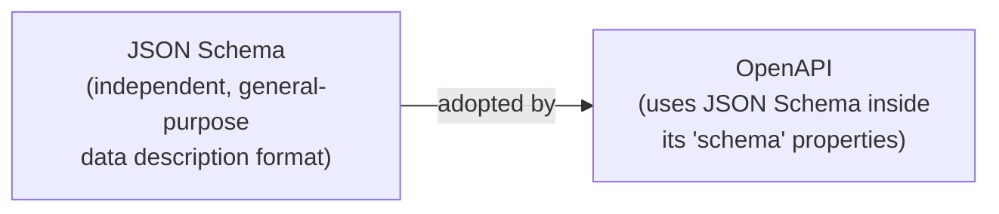

This matters practically: knowledge of JSON Schema is portable — the same syntax and rules learned here apply outside of OpenAPI too, in any context that validates or describes JSON data.

---

## When to Add Data Descriptions: After HTTP Operations

Following the staged design flow already established, JSON Schemas are added to the OpenAPI document **after** the HTTP operations (paths, methods, parameters, responses) have been sketched out — not before.

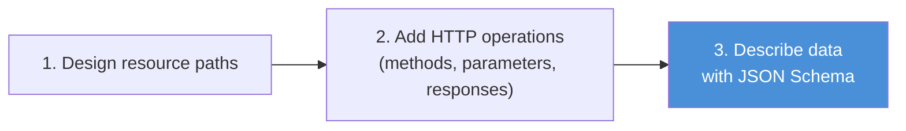

This ordering keeps the same discipline seen throughout the whole design process: settle the *shape* of the interaction first (what operation, what method, what status codes), then fill in the *detailed data* afterward. Trying to write precise schemas before the surrounding HTTP structure is stable invites rework.

---

## Reusable Resource Model Schemas: `components.schemas`

Rather than writing out a resource's data model inline, repeatedly, everywhere it's used, resource models are defined **once** as **reusable schemas** under a dedicated top-level section: `components.schemas`.

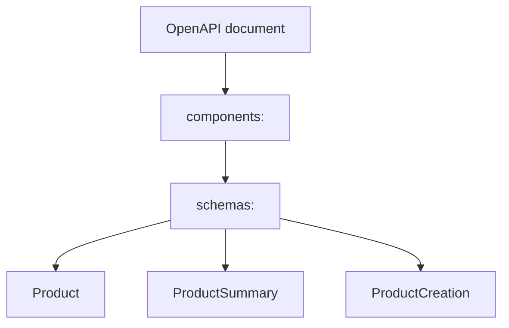

```yaml
components:
  schemas:
    Product:
      type: object
      properties:
        productReference:
          type: number
        name:
          type: string
        price:
          type: number
    ProductSummary:
      type: object
      properties:
        productReference:
          type: number
        name:
          type: string
```

Two concrete benefits of doing this:

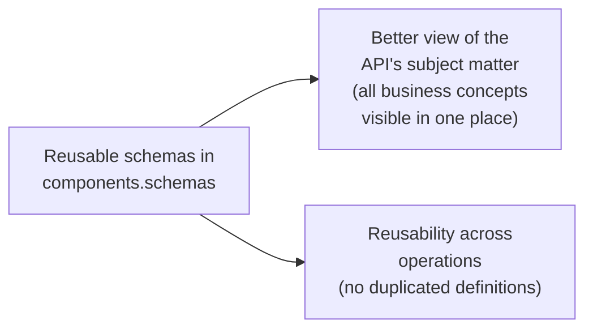

- **Better subject-matter view** — having every resource model collected in one section gives anyone reading the document a clear picture of the API's underlying business concepts, independent of which specific operations happen to use them.
- **Reusability** — the same schema definition can be referenced from many different operations (create, read, update, search) instead of being copy-pasted and redefined each time, which is both less work and less error-prone.

This directly echoes the earlier **data modeling** stage, where a single **complete model** was designed first and then several other models (summarized, minimal, creation, etc.) were **derived** from it — `components.schemas` is exactly where each of those derived models gets its own reusable definition.

---

## The Building Blocks of a JSON Schema

### Every schema starts with a `type`

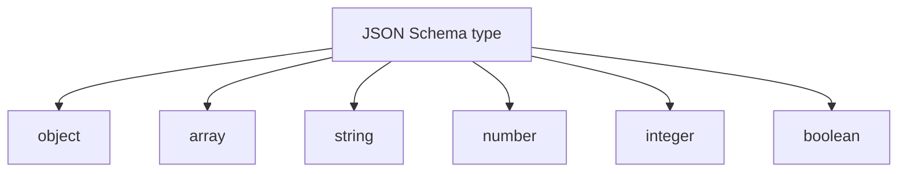

These map directly back to the **portable JSON data types** established during data modeling — this is where those earlier type decisions actually get written down formally.

### Objects: `properties` and `required`

An `object` schema describes something with named fields. Its structure has two key parts:

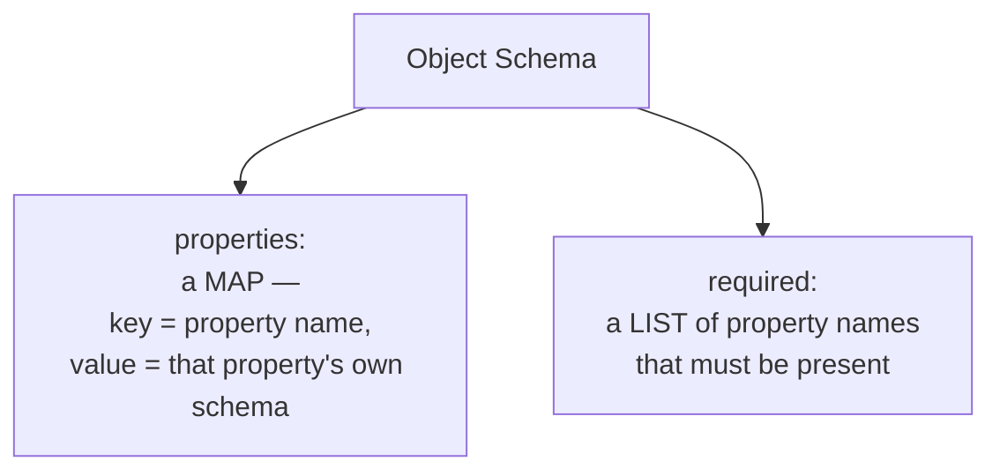

```yaml
Product:
  type: object
  properties:
    productReference:
      type: number
    name:
      type: string
    price:
      type: number
  required:
    - productReference
    - name
```

Notice that **each individual property's value is itself a schema** — this is what makes JSON Schema composable: a property can be a simple type (`string`, `number`) or something more complex, like a nested `object` or an `array`, following the exact same rules recursively.

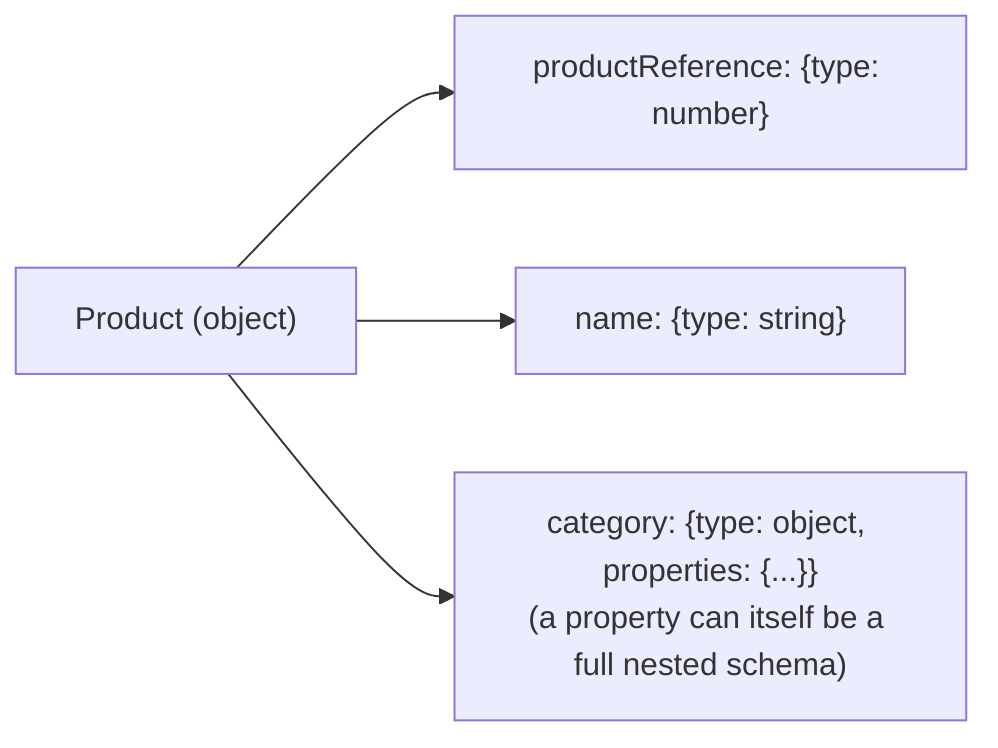

The `required` list only names properties that are **mandatory** — any property not listed there is implicitly optional, mirroring the same optional-by-default logic used for parameters described earlier.

### Arrays: the `items` property

An `array` schema describes a list, and its `items` property holds the schema that describes **each element** of that list.

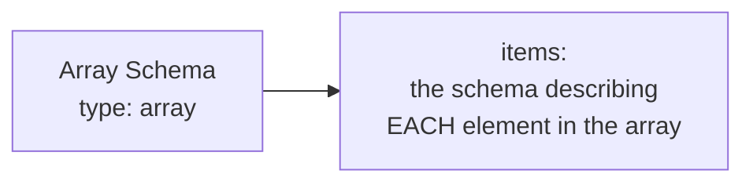

```yaml
type: array
items:
  type: object
  properties:
    productReference:
      type: number
    name:
      type: string
```

This is an **inline array schema** — the element type is defined directly, right there, rather than pointing to something reusable elsewhere.

---

## Referencing Reusable Schemas with `$ref`

Instead of repeating a schema inline every time it's needed, a schema defined once under `components.schemas.SomeName` can be **referenced** from anywhere else in the document using the `$ref` property.

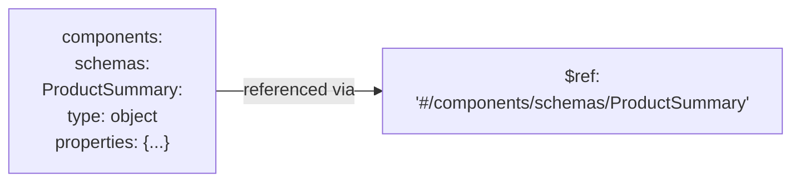

The value of `$ref` is a **JSON Pointer** — a path-like string that navigates to the exact location of the reusable definition inside the document:

```
#/components/schemas/ProductSummary
 │           │        │
 │           │        └── the schema's name (the key under schemas)
 │           └── the schemas map
 └── starts from the root of the current document
```

### Example: an array of a referenced schema

Putting arrays and references together — this is a very common real-world pattern, where a search operation returns an array, and each element of that array is a reusable schema rather than an inline one:

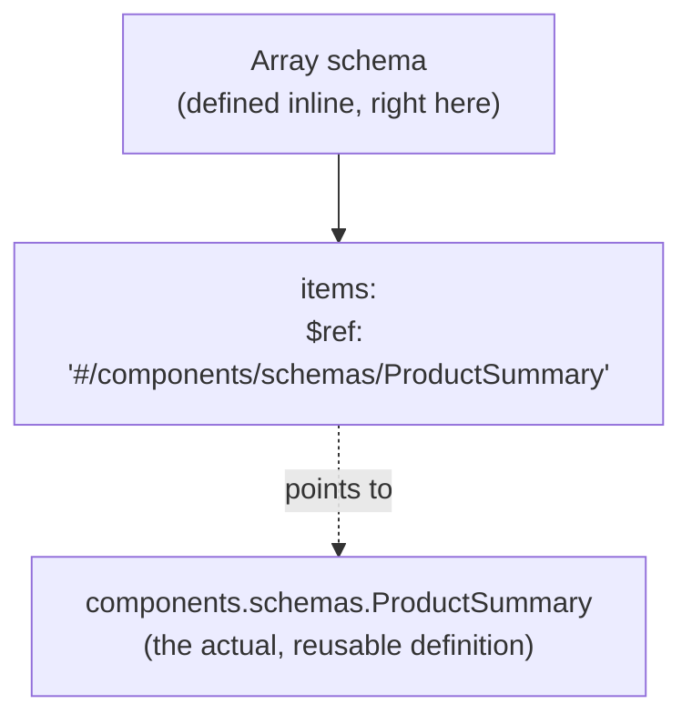

```yaml
responses:
  "200":
    description: Products matching filters
    content:
      application/json:
        schema:
          type: array
          items:
            $ref: '#/components/schemas/ProductSummary'
```

Here, the **array itself is inline** (defined directly in the response), but its **elements' schema is a reference** — pointing to the `ProductSummary` reusable schema defined once under `components.schemas`. This is exactly the kind of composition that keeps the document both concise and consistent: the array shape is specific to this one response, but the shape of *what's inside it* is shared and reused everywhere `ProductSummary` applies.

---

## Where Schemas Get Used: Operation Inputs and Outputs

Recall from the HTTP-operations stage that every `schema` property — inside `parameters`, inside `requestBody.content`, inside `responses...content` — was left as a placeholder for detailed data. This is where those placeholders actually get filled in, either with inline definitions or with `$ref` pointers to `components.schemas`.

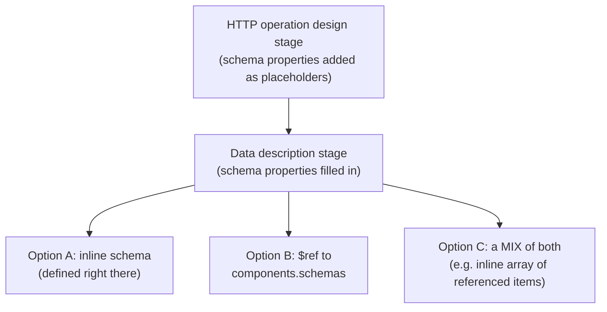

---

## Why Prefer References Over Duplication

The strong recommendation is to **use `$ref` to reusable schemas** rather than writing the same data shape inline, repeatedly, across multiple operations.

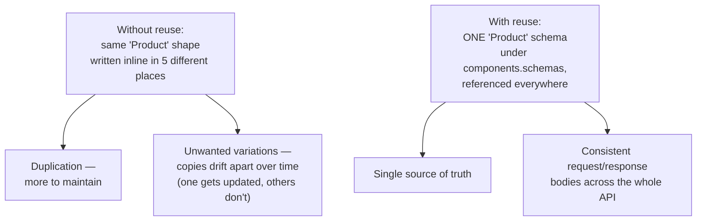

The risk being avoided here isn't just extra typing — it's **drift**. If the same conceptual data shape is defined inline in multiple places, there's nothing stopping those copies from silently diverging over time as the API evolves (someone updates one operation's inline schema but forgets the other four). Referencing a single shared definition eliminates that risk structurally, rather than relying on discipline to keep copies in sync.

---

## Describing Resource Model Derivations as Reusable Schemas

This ties directly back to the **seven typical data models** (complete, summarized, minimal, identifier, creation, replacement, modification) from the data-modeling stage — each derived model gets its **own reusable schema** entry under `components.schemas`, not just the base "complete" model.

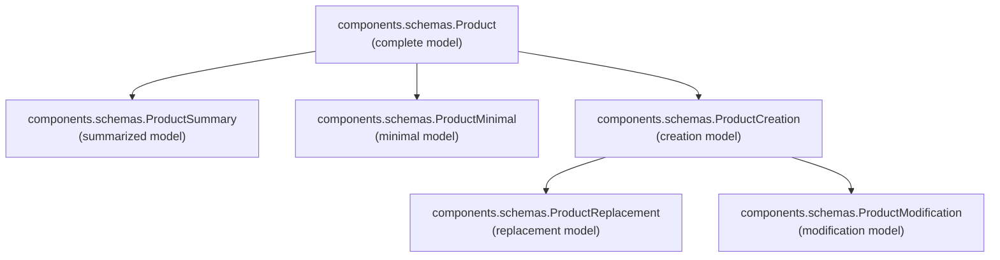

```yaml
components:
  schemas:
    Product:
      type: object
      properties:
        productReference: { type: number }
        name: { type: string }
        price: { type: number }
        category: { type: string }
      required: [productReference, name, price]

    ProductSummary:
      type: object
      properties:
        productReference: { type: number }
        name: { type: string }
      required: [productReference, name]

    ProductCreation:
      type: object
      properties:
        name: { type: string }
        price: { type: number }
        category: { type: string }
      required: [name, price]
```

Each operation then simply **references** the specific derived schema that fits its role — search responses reference `ProductSummary`, create request bodies reference `ProductCreation`, and so on — rather than each operation inventing its own version of "what a product looks like."

---

## Summary: The Three Ways a `schema` Property Can Be Filled

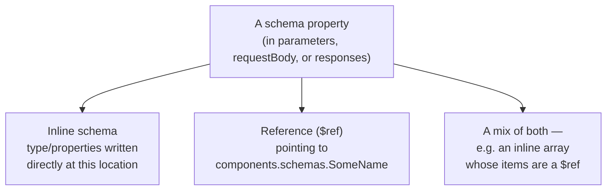

The general guidance running through all of this: use **inline schemas** for shapes that are genuinely one-off and specific to a single location, and use **references to `components.schemas`** for anything representing a reusable business concept or a derived resource model — which, in practice, covers most of the meaningful data in a well-designed API.
