# Describing HTTP Operations with OpenAPI

## What an API Specification Actually Is

An **API specification** is a **data format** — a standardized way of describing an API's structure (its resources, operations, inputs, outputs, and data models) so that the description itself can be read, validated, and processed by tools, not just by humans reading prose documentation.

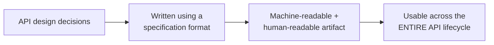

Because it's a structured, standardized format — not just free-form documentation — a specification document isn't limited to the design phase. The same document can be used during development (to scaffold code), testing (to validate real responses against the declared contract), deployment (to configure gateways), and consumption (to generate documentation or client SDKs).

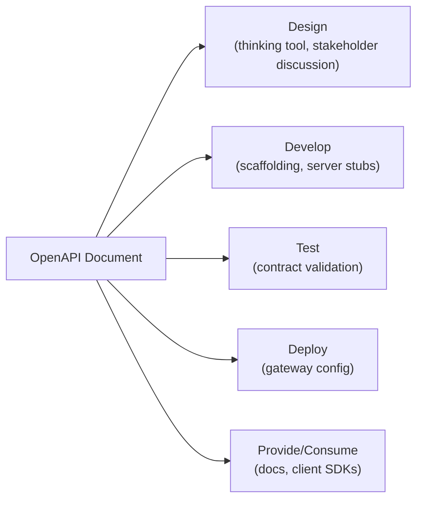

### OpenAPI: the industry standard for REST

The **OpenAPI Specification** — previously known as the **Swagger Specification** before being renamed — is the de facto industry standard format specifically for describing REST APIs. Its wide adoption is exactly why translating your design work into it (rather than keeping it in a private spreadsheet forever) pays off: a huge ecosystem of tools already knows how to read it.

---

## Why Use OpenAPI *During* Design (Not Just After)

It might seem like writing a formal specification document is something you'd do only *after* the design is finalized, as a documentation step. But there are real benefits to writing it **during** design, alongside the earlier resource/operation/data-modeling work:

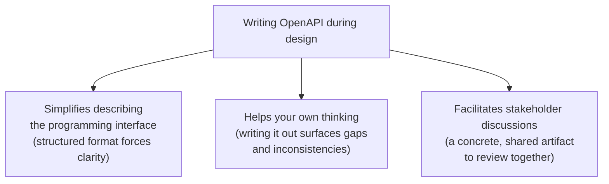

- **Simplifies description** — OpenAPI's structure (paths, methods, parameters, responses) mirrors the exact elements already being designed, so filling it in is a natural continuation of the work rather than a separate translation task done later.
- **Helps your thinking** — the act of trying to express a design decision in a strict, structured format often exposes ambiguity or gaps that were easy to gloss over in looser notes or a spreadsheet.
- **Facilitates stakeholder discussion** — a real OpenAPI document (especially rendered through a documentation tool) gives non-designers something concrete and visual to react to, rather than an abstract conversation.

---

## Specification-First vs. Code-First

There are two general approaches to producing an OpenAPI document, and the choice affects when in the process you actually write it.

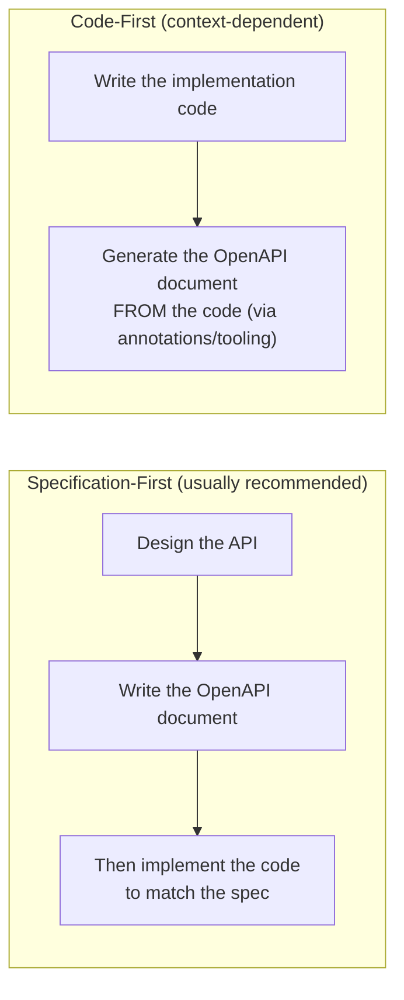

- **Specification-first** is the generally recommended approach: the OpenAPI document is authored deliberately, as a design artifact, *before* implementation — which fits naturally with everything covered so far (observing operations, mapping to HTTP, modeling data) since the specification becomes the direct output of that design work.
- **Code-first** — writing the implementation first and generating the spec from code annotations — is sometimes more practical depending on context (e.g., an existing codebase, team tooling preferences, or time constraints), even though it inverts the design-first philosophy. The right choice depends on the situation rather than being a hard rule.

---

## When to Start Filling In the Document

The OpenAPI document doesn't need to wait until HTTP mapping and data modeling are both fully finished — it can be filled in **in parallel** with that work, and can actually be **initiated as soon as resource paths are being designed**.

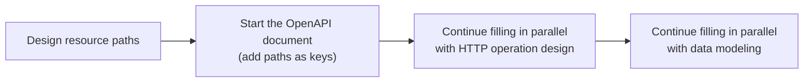

This incremental approach means the document grows organically alongside the design decisions themselves, rather than being a big separate write-up task at the end.

---

## Structuring Paths and Path Parameters

### Resource paths as keys

Each resource path (e.g., `/products`) becomes a **key** directly under the top-level `paths` object.

```yaml
paths:
  /products:
    ...
  /products/{productId}:
    ...
```

### Path parameters must be explicitly declared

A path parameter (the `{productId}` portion) isn't automatically understood just by appearing in the path string — it must be **explicitly defined** in a `parameters` list at the **path level** (i.e., directly under the path key, applying to all operations on that path, not nested inside one specific method).

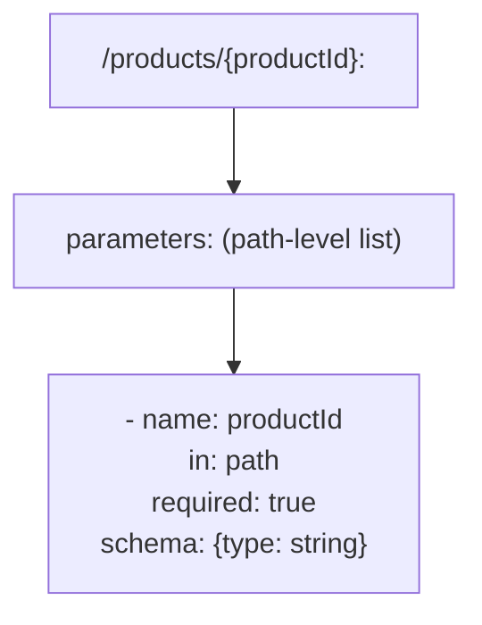

**Critical rule: a path parameter's `required` flag must be explicitly set to `true`.** Since a path parameter is, by definition, part of the URL structure itself, it can never actually be optional — omitting it would mean the URL doesn't match the path pattern at all. OpenAPI still requires this to be declared explicitly rather than assumed, to keep the document unambiguous and machine-validatable.

```yaml
paths:
  /products/{productId}:
    parameters:
      - name: productId
        in: path
        required: true
        schema:
          type: string
```

---

## Structuring Operations (HTTP Methods)

The HTTP method representing an operation becomes a **key**, written in **lowercase**, nested directly under its resource path.

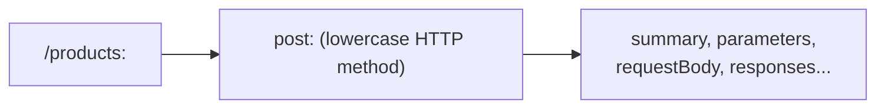

```yaml
paths:
  /products:
    post:
      summary: Add a product to the catalog
```

Every HTTP method used against that path (`get`, `post`, `put`, `patch`, `delete`) gets its own sibling key, each describing a distinct operation.

---

## Describing Inputs: Parameters and Request Body

Inputs split into two different places depending on their location, mirroring the earlier design rule about where input data goes (path/query/header vs. body).

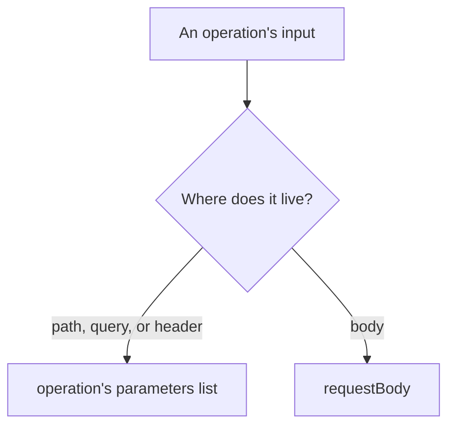

### Header or query parameters → the operation's `parameters` list

```yaml
      parameters:
        - name: category
          in: query
          required: false
          schema:
            type: string
```

### Body data → `requestBody`

```yaml
      requestBody:
        content:
          application/json:
            schema:
              type: object
              properties:
                name:
                  type: string
                price:
                  type: number
```

### The `in` property: declaring location

Every parameter entry has an `in` property stating exactly where it belongs in the actual HTTP request:

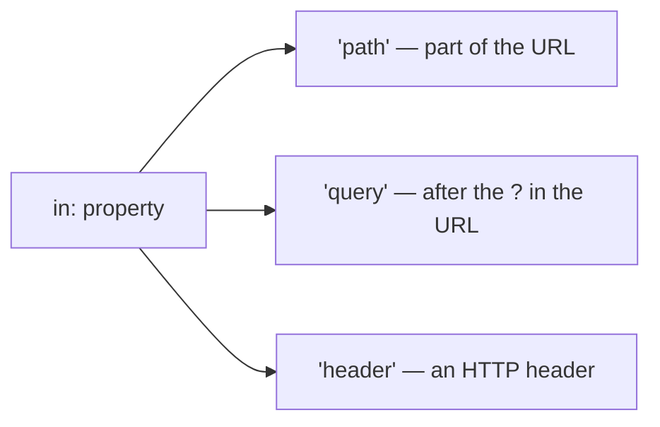

### Required vs. optional parameters

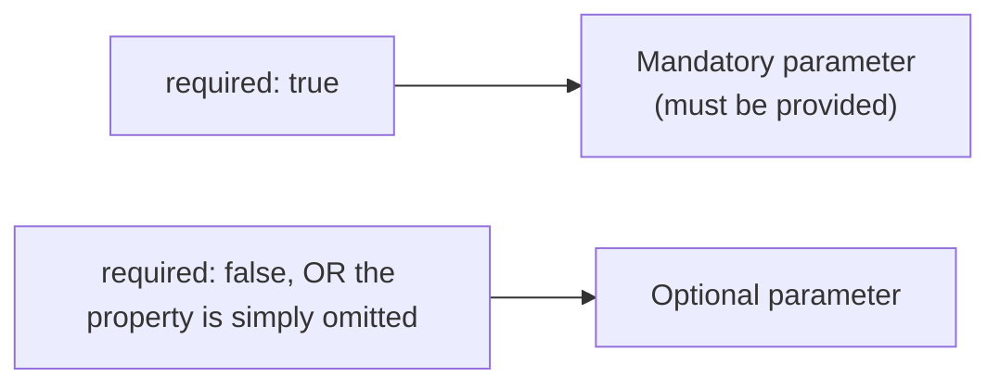

This is a subtle but important detail: unlike some formats where you must explicitly mark something optional, OpenAPI treats **the absence of `required`** the same as `required: false` — both mean the parameter is optional. Only path parameters are the exception, where `required: true` must always be explicit (as covered above), since they can never truly be optional.

### Making the request body visible in documentation tools

Filling in the `content` property of `requestBody` — specifying the media type (`application/json`) and its `schema` — isn't just a formality. It's specifically what allows documentation-rendering tools (like Swagger UI or Redoc) to actually **display** the expected request body to a reader. An empty or missing `content` block means documentation tools have nothing to show, even if the operation technically requires a body.

---

## Where Fine-Grained Data Gets Described: `schema`

The `schema` property — appearing inside parameter definitions, inside `requestBody.content`, and inside response bodies — is specifically where the **fine-grained data models** (the detailed field names, types, and structures worked out during data modeling) actually get expressed, using JSON Schema syntax.

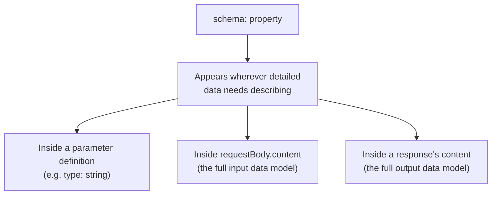

Think of `schema` as the **connector** between the HTTP-level structure (paths, methods, parameter locations) already covered, and the data-modeling work (complete, creation, summarized models, etc.) covered separately — `schema` is where those detailed models actually get written down in the document.

---

## Describing Outputs: Responses

### Status codes as keys

Each possible HTTP status code an operation can return becomes a **key** under that operation's `responses` property.

```yaml
      responses:
        "200":
          description: Product found
        "404":
          description: Product not found
        "500":
          description: Unexpected server error
```

### When to merge vs. split output descriptions

An important nuance: if multiple different outcomes happen to share the same status code, it's tempting to just merge their descriptions together under one entry. This is only appropriate under specific conditions:

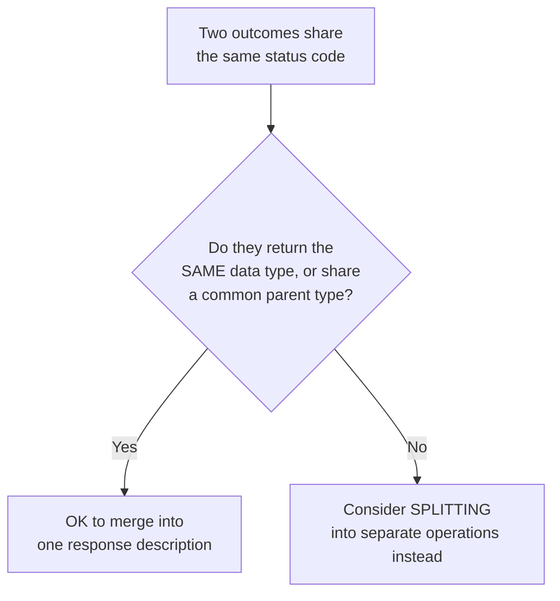

If two different failure scenarios both return `400`, for example, but return **structurally unrelated** data, forcing them into a single merged description under `"400"` obscures the real difference between them and makes the document (and the consumer's error-handling logic) harder to reason about. In cases like that, it may indicate the operation itself is trying to do too much and should be reconsidered — potentially split into two more focused operations — rather than just papering over the mismatch in the documentation.

### Response headers vs. response body

Just like requests, a response can carry data in two places:

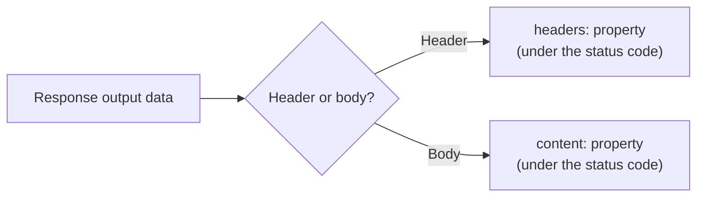

```yaml
      responses:
        "201":
          description: Product created
          headers:
            Location:
              description: URL of the newly created product
              schema:
                type: string
          content:
            application/json:
              schema:
                type: object
                properties:
                  productReference:
                    type: number
```

A worked example: a response header definition requires, at minimum, a **header name** (the YAML key itself) and a **header description** — and importantly, unlike request parameters, **a response header is always considered present when declared** (there's no `required` flag to set for it, since the provider controls whether to send it). Including at least a `description` is what's needed to make the header definition valid and meaningful within the document.

---

## Keeping the Document Human-Readable

Beyond the structural, machine-readable pieces, OpenAPI provides two properties specifically for human context: `summary` and `description`.

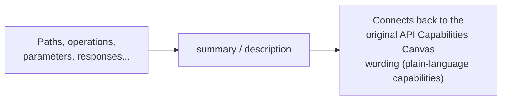

Using `summary` (short) or `description` (longer, more detailed) consistently throughout the document means every technical element — a path, an operation, a parameter, a response — retains a plain-language explanation tying it back to the original business capability it represents. This matters for two audiences:

- **Other people** reading the document later (other engineers, stakeholders, API consumers browsing generated documentation) who need to understand *why* an element exists, not just its technical shape.
- **Your own later self** — design decisions that feel obvious in the moment are easy to forget the reasoning behind months later; a good `description` preserves that context permanently inside the artifact itself.

```yaml
paths:
  /products:
    get:
      summary: Search for products
      description: >
        Returns products matching the given filters,
        supporting the "Search for products to buy" use case
        from the Online Shopping capability analysis.
```

This closes the loop all the way back to where the whole design process started: a plain-language capability like "Search for products," carried through resource/action identification, HTTP mapping, and data modeling, now lives in a standardized, tool-readable OpenAPI document — while still preserving, in `summary`/`description`, the original human meaning that justified every technical decision made along the way.
