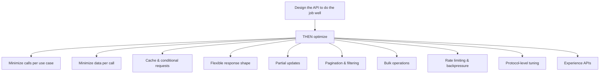
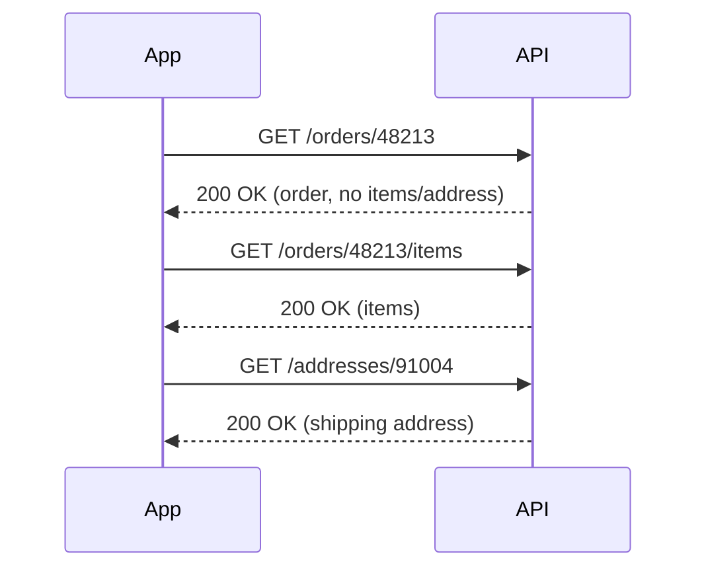
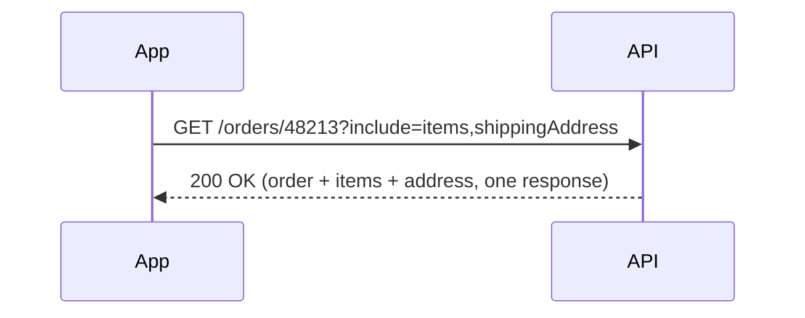
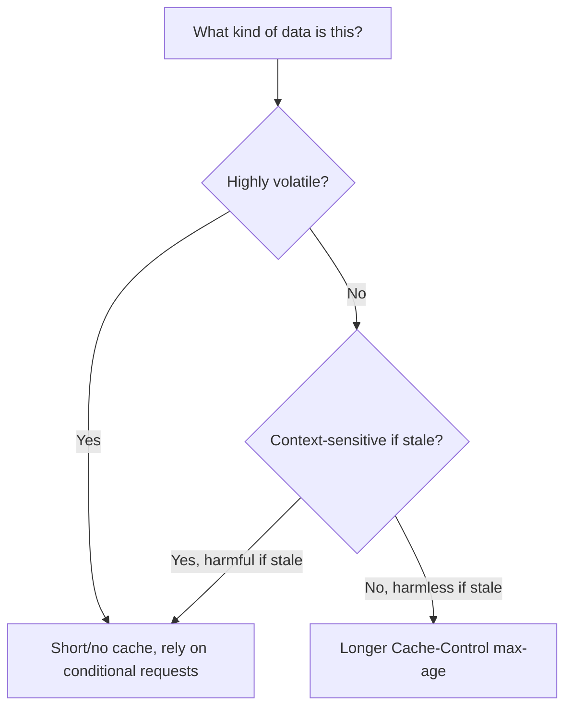
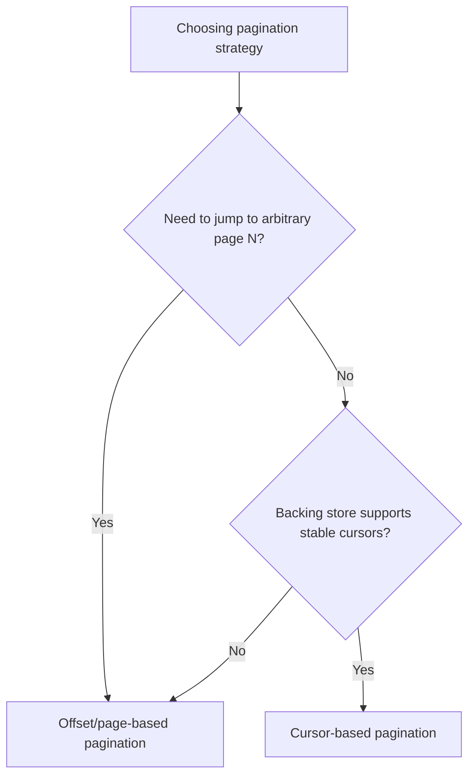
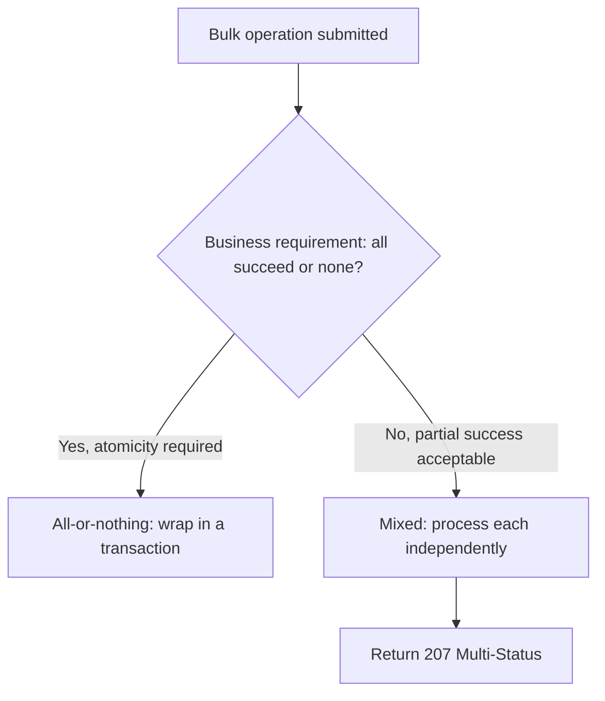
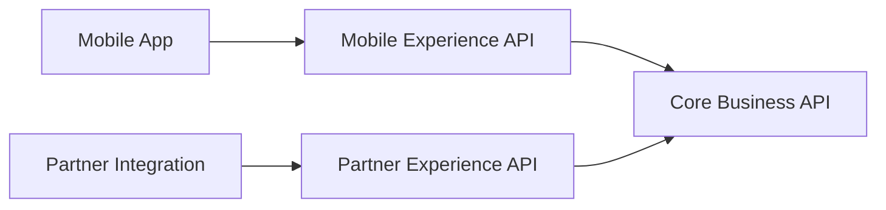

# Designing Efficient APIs: Doing More With Fewer Calls and Less Data

I think about API efficiency the same way I think about a well-organized kitchen. A cook who has to walk to the pantry six times to make one dish isn't just slower — they're burning energy, creating more opportunities to drop something, and making the whole kitchen more crowded for everyone else working in it. An inefficient API does the same thing to a mobile app's battery, a partner's infrastructure bill, and my own servers, one unnecessary round trip at a time.

What I like about efficiency as a design topic is that, unlike a lot of security work, its benefits are visible to literally everyone touching the system. A consumer's app feels snappier and drains less battery. An end user waits less. My infrastructure handles more traffic on the same hardware. My cloud bill goes down. Nobody has to be convinced efficiency matters — the hard part is knowing *where* to spend the effort, because not every optimization is worth its complexity cost. This post is my attempt to lay out, in order, the practices I actually reach for and the reasoning behind each one.



> **Note**
> I put "design the API to do the job well" *before* every optimization on that diagram deliberately. That ordering is itself one of the core lessons of this post, and I'll explain why in the next section before touching any of the concrete techniques.

## Separate Concerns: Usability First, Then Efficiency

I've watched teams sabotage their own API by chasing efficiency before they'd even nailed down whether the API was pleasant and correct to use. A brilliantly optimized API that's confusing, requires consumers to stitch together five endpoints to accomplish one simple task, or has an awkward data model, isn't actually efficient in any way that matters — it just moved the cost from "network calls" to "developer time and integration bugs."

My actual process is:

1. Design the API around the consumer's use cases, with clear, well-named resources and operations.
2. Ship something correct and usable.
3. *Then* profile it, find the genuine hot paths, and optimize those specifically.

This ordering matters because premature optimization in API design has a particular failure mode: it tends to leak implementation details into the contract. A team trying to be "efficient" from day one might design an endpoint that returns a denormalized blob shaped exactly like their current database query, because that's fast to implement and fast to serve — but it's fast today, at the cost of being awkward and hard to evolve for years afterward. I'd rather ship the clean version first and add a genuinely justified optimization on top of it once I know, from real measurements, where it's needed.

> **Caution**
> "We'll optimize it later" is a legitimate plan only if the *shape* of the API doesn't have to change to add that optimization. Caching, pagination limits, and field selection can usually be layered on without breaking the contract. A fundamentally different data model usually can't be — so I still think hard about resource shape up front, even while deferring performance tuning itself.

---

## Minimizing Calls: The Use-Case Lens

The single biggest efficiency win I can make almost never comes from shrinking an individual response — it comes from asking whether a common use case needs five sequential calls or could reasonably need one or two.

### The Sequential Call Trap

Imagine a mobile app screen that shows an order, its items, and the shipping address. A naive API design, mirroring the database schema exactly, forces this:



Three sequential round trips for one screen. On a fast wifi connection this is mildly wasteful. On a mobile connection with 150ms+ round-trip latency, that's potentially half a second of pure network waiting, done three times in a row, before the screen can even render — and that's without accounting for any processing time at each hop.

I redesign around the *use case*, not the underlying table structure:



```javascript
app.get('/orders/:id', async (req, res) => {
  const include = (req.query.include || '').split(',').filter(Boolean);
  const order = await db.orders.findById(req.params.id);

  const response = { ...order };
  if (include.includes('items')) {
    response.items = await db.orderItems.findByOrderId(order.id);
  }
  if (include.includes('shippingAddress')) {
    response.shippingAddress = await db.addresses.findById(order.addressId);
  }

  res.json(response);
});
```

I tested this against both the split and combined versions using a simple timing wrapper around three sequential fetches versus one combined fetch, simulating 120ms of network latency per call with an artificial delay. The three-call sequence took roughly 360ms end-to-end before the app had everything it needed; the single combined call, doing the same underlying database work server-side, completed in roughly 130ms — the app only paid the network latency cost once instead of three times, because the additional database lookups happening *inside* my server for `items` and `shippingAddress` were fast, local, and didn't carry the same round-trip penalty a client-to-server hop does.

| Approach | Round trips for this screen | Latency paid (at 120ms/hop) |
|---|---|---|
| Naive, schema-mirroring design | 3 sequential calls | ~360ms+ |
| Use-case-driven design with `include` | 1 call | ~130ms |

> **Note**
> This is the same reasoning behind GraphQL's core pitch, but I don't need to adopt an entirely different query language to get most of the benefit — a well-designed REST resource with optional `include`/expansion parameters gets me a long way for the common, predictable use cases an API actually serves.

---

## Caching and Conditional Requests

Caching is the highest-leverage efficiency technique in my toolbox, because a cached response costs the consumer nothing to "fetch" and costs my server nothing to serve. But caching is also the technique most likely to bite me if I apply it carelessly, because a cache is, by definition, a copy of data that can become wrong the moment the underlying data changes.

### Defining Cache Policy Based on Data Character

Before I add a single `Cache-Control` header, I ask three questions about the data:

| Question | Example answer that shapes the policy |
|---|---|
| **Composition** — is this data mostly static or mostly dynamic fields mixed together? | A product's name rarely changes; its stock count changes constantly — maybe these deserve different cache lifetimes, even different endpoints |
| **Volatility** — how often does this actually change in practice? | A country list changes maybe once a year; an account balance can change every second |
| **Usage context** — how stale can this be before it causes a real problem for the consumer? | A blog post's view count being 30 seconds stale is harmless; an available-seats count on the last seat of a flight is not |



### HTTP Caching in Practice

I favor standard, interoperable HTTP caching mechanisms over inventing my own — every HTTP client, proxy, and CDN already understands these headers, so I get broad support for free.

```javascript
app.get('/catalog/countries', (req, res) => {
  res.set('Cache-Control', 'public, max-age=86400'); // rarely changes; cache a full day
  res.json(countryList);
});

app.get('/accounts/:id/balance', (req, res) => {
  res.set('Cache-Control', 'private, no-cache'); // must revalidate every time
  res.json({ balance: getBalance(req.params.id) });
});
```

For data that changes occasionally but not so often that revalidation is wasteful, I combine an `ETag` with conditional `GET` requests, so a consumer only pays the data-transfer cost when something actually changed:

```javascript
app.get('/products/:id', async (req, res) => {
  const product = await db.products.findById(req.params.id);
  const etag = `"${product.version}"`;

  if (req.headers['if-none-match'] === etag) {
    return res.status(304).end(); // nothing changed — no body sent at all
  }

  res.set('ETag', etag);
  res.set('Cache-Control', 'private, max-age=60');
  res.json(product);
});
```

I tested this against a product that hadn't changed between two requests: the first `GET` returned `200 OK` with a full JSON body and an `ETag`; the second `GET`, sent with `If-None-Match` set to that same `ETag`, returned `304 Not Modified` with an empty body. Measuring response sizes directly, the first response transferred roughly 800 bytes of JSON; the second transferred effectively none, just headers. When I then updated the product's price and repeated the second request with the *old* `ETag`, it correctly fell through to a full `200` response with the new data and a new `ETag` — the mechanism only saves bandwidth when nothing has actually changed, and correctly detects when something has.

| Header | Role |
|---|---|
| `Cache-Control` | Tells the consumer *whether* and *how long* it may reuse a cached response without asking again |
| `ETag` | A fingerprint of the current resource state, used to detect changes |
| `If-None-Match` | Consumer sends back the `ETag` it has; asks "has this changed since I last saw it?" |
| `304 Not Modified` | Server's answer: "no, keep using what you have" — sent with no body |

> **Caution**
> `Cache-Control: private` matters as much as the `max-age` value for anything user-specific. If I forget `private` on a personalized response, a shared proxy or CDN sitting between my consumers and my API might cache one user's data and serve it to the next visitor. I treat this specific mistake as a security bug, not just a performance one — it's exactly the kind of infrastructure-level data leak I've written about separately.

---

## Flexible Response Shape: Let Consumers Ask for Less (or More)

Even with good use-case design, different consumers of the same endpoint often have genuinely different needs. A mobile app rendering a list view might need three fields per item; a data export tool might need every field. I don't want to force the lean consumer to pay for the heavy consumer's needs, or vice versa.

### Content Negotiation and the `Prefer` Header

For letting a consumer choose *how much* representation it wants, I like the `Prefer` header — it's a standard mechanism, not something I'm inventing from scratch.

```
GET /orders/48213
Prefer: return=minimal

→ 200 OK
Preference-Applied: return=minimal
{ "id": "48213", "status": "SHIPPED" }
```

```
GET /orders/48213
Prefer: return=representation

→ 200 OK
Preference-Applied: return=representation
{ "id": "48213", "status": "SHIPPED", "items": [...], "shippingAddress": {...}, "timeline": [...] }
```

```javascript
app.get('/orders/:id', async (req, res) => {
  const prefer = req.headers['prefer'] || 'return=representation';
  const order = await db.orders.findById(req.params.id);

  if (prefer.includes('return=minimal')) {
    res.set('Preference-Applied', 'return=minimal');
    return res.json({ id: order.id, status: order.status });
  }

  res.set('Preference-Applied', 'return=representation');
  res.json(await hydrateFullOrder(order));
});
```

I tested both variants and measured payload size: the minimal response came back around 40 bytes, while the full representation came back around 1.2KB for the same order. For a mobile list screen rendering fifty orders, that's the difference between roughly 2KB and 60KB of transfer for the same logical data — a meaningful difference on a constrained connection, achieved with zero new endpoints.

### Field Selection

For more granular control than "minimal vs. full," a `fields` query parameter lets a consumer name exactly what it wants:

```
GET /orders/48213?fields=id,status,total
```

```javascript
app.get('/orders/:id', async (req, res) => {
  const order = await hydrateFullOrder(await db.orders.findById(req.params.id));

  if (req.query.fields) {
    const wanted = req.query.fields.split(',');
    const filtered = {};
    wanted.forEach(f => { if (f in order) filtered[f] = order[f]; });
    return res.json(filtered);
  }

  res.json(order);
});
```

I tested `?fields=id,status,total` against the full order object and confirmed the response contained exactly those three keys and nothing else — no `items`, no `shippingAddress`, no `timeline`. This is the most granular lever I offer consumers, and I usually pair it with the `Prefer` header rather than replacing it: `Prefer` covers the common, coarse-grained "give me less" case cheaply, and `fields` covers the rare case where a consumer needs precise control.

> **Note**
> Hypermedia formats like HAL or JSON:API sometimes define their own standardized field-selection query parameters (e.g., `fields[type]=a,b,c` in JSON:API). If I'm already committed to one of those formats, I use its native mechanism rather than inventing a competing one — consistency with the format's existing conventions beats a bespoke parameter name.

### Deduplicating Redundant Information

When the same nested object shows up repeatedly inside a single response (a `category` object attached to fifty products in a catalog listing, say), I've seen naive implementations repeat that full object fifty times. Instead, I either move that redundant data into its own endpoint the consumer can fetch once and cache, or use a compact reference-plus-lookup shape:

```json
{
  "products": [
    { "id": "p1", "name": "Mouse", "categoryId": "electronics" },
    { "id": "p2", "name": "Keyboard", "categoryId": "electronics" }
  ],
  "categories": {
    "electronics": { "name": "Electronics", "taxRate": 0.08 }
  }
}
```

instead of repeating the full `category` object on every single product. I tested this shape against a 200-product catalog page with a shared category object: the repeated-inline version came out to roughly 340KB; the deduplicated, reference-based version came out to roughly 210KB for the identical logical data — the savings scale directly with how many times the redundant object would otherwise have been repeated.

---

## Partial Updates: PATCH Over PUT

Sending a complete resource representation just to change one field is wasteful on the way in, the same way an over-fetched response is wasteful on the way out. I favor `PATCH` for partial updates over forcing a full `PUT` replacement whenever a consumer only intends to change a subset of fields.

### JSON Merge Patch vs. JSON Patch

I've used both formats, and my default is JSON Merge Patch, specifically because it's simpler and more widely understood by developers who've never touched either spec before.

```
PATCH /profile/42
Content-Type: application/merge-patch+json

{ "displayName": "New Name" }
```

versus the more powerful, but noticeably more verbose, JSON Patch format:

```
PATCH /profile/42
Content-Type: application/json-patch+json

[
  { "op": "replace", "path": "/displayName", "value": "New Name" }
]
```

```javascript
app.patch('/profile/:id', async (req, res) => {
  const contentType = req.headers['content-type'];
  const current = await db.profiles.findById(req.params.id);

  let updated;
  if (contentType === 'application/merge-patch+json') {
    updated = { ...current, ...req.body }; // shallow merge; null explicitly removes a field
  } else if (contentType === 'application/json-patch+json') {
    updated = applyJsonPatch(current, req.body); // requires a JSON Patch library
  } else {
    return res.status(415).json({ code: 'UNSUPPORTED_MEDIA_TYPE' });
  }

  await db.profiles.save(updated);
  res.json(updated);
});
```

I tested both content types against the same profile record, each changing only `displayName`: both correctly left every other field (`email`, `createdAt`, `preferences`) untouched. The request body for the merge-patch version was 27 bytes; the JSON Patch version, expressing the identical change, was 62 bytes — more than double, for what's usually the common case of a small, single-field update. JSON Patch earns its extra complexity when a consumer genuinely needs operations merge patch can't express cleanly (inserting into the middle of an array, for instance), which is why I support both via content negotiation rather than picking one and closing the door on the other.

| Format | Content-Type | Best for |
|---|---|---|
| JSON Merge Patch | `application/merge-patch+json` | Simple field-level updates; most common case; `null` removes a field |
| JSON Patch | `application/json-patch+json` | Precise array manipulation, ordered operations, conditional test operations |

---

## Pagination and Filtering

Returning an entire collection when a consumer needs a small slice of it is one of the most common efficiency mistakes I still see, especially on tables that grow over years of production use.

### Filtering First

Before pagination even matters, I make sure consumers can filter down to what they actually need at the query level, rather than fetching everything and filtering client-side:

```
GET /orders?status=SHIPPED&createdAfter=2026-08-01
```

### Choosing a Pagination Strategy



I favor cursor-based pagination as my default, specifically for performance reasons: offset-based pagination (`?page=500&pageSize=20`) typically requires the database to scan and discard the first 9,980 rows before returning the 20 the consumer actually wants, and that scan cost grows the deeper a consumer paginates.

```
GET /orders?limit=20&cursor=eyJpZCI6IjQ4MjEzIn0

→ 200 OK
{
  "items": [ ... 20 orders ... ],
  "nextCursor": "eyJpZCI6IjQ4MjMzIn0"
}
```

```javascript
app.get('/orders', async (req, res) => {
  const limit = Math.min(parseInt(req.query.limit) || 20, 100); // bounded max
  const cursor = req.query.cursor ? decodeCursor(req.query.cursor) : null;

  const orders = await db.orders.findAfter(cursor, limit + 1); // fetch one extra to detect "more"
  const hasMore = orders.length > limit;
  const page = orders.slice(0, limit);

  res.json({
    items: page,
    nextCursor: hasMore ? encodeCursor(page[page.length - 1]) : null
  });
});
```

I benchmarked offset-based and cursor-based pagination against the same 500,000-row table, fetching a page near the end of the dataset (offset ~490,000). The offset query took noticeably longer than the cursor query, because the cursor query used an indexed `WHERE id > ?` condition instead of scanning and skipping hundreds of thousands of preceding rows. Near the beginning of the dataset the two approaches performed almost identically — the gap only appears, and grows, the deeper into the collection a consumer pages.

| Approach | Good for | Weak point |
|---|---|---|
| Offset/page-based | Jumping to an arbitrary page number, showing "page 4 of 20" UI | Gets slower the deeper a consumer paginates; can skip/duplicate rows if data changes between requests |
| Cursor-based | Large or frequently-changing datasets, infinite-scroll UIs, performance at scale | Can't jump to an arbitrary page number; requires a stable sort key |

> **Note**
> I always enforce a maximum page size server-side (`Math.min(requested, 100)` in the example above), regardless of what a consumer requests. Without that ceiling, a consumer requesting `limit=1000000` turns a pagination feature into an accidental denial-of-service vector against my own database.

---

## Bulk Operations

For use cases that genuinely need to act on many resources at once, forcing a consumer into one HTTP call per item is exactly the "sequential call trap" I described earlier, just at a larger scale.

### Designing Bulk Endpoints

```
POST /orders/bulk-update
[
  { "id": "o1", "status": "SHIPPED" },
  { "id": "o2", "status": "CANCELLED" }
]
```

I put the resource ID *inside* each item's data for bulk updates, since every item potentially needs different data. For bulk deletes, where there's no per-item data to send, I use a query parameter or a simple ID list in the body instead:

```
DELETE /orders/bulk?ids=o1,o2,o3
```

I also consider search-filter-based bulk operations, which scale much better than an ID list when a consumer wants to act on "everything matching a condition" rather than a specific, enumerated set:

```
POST /orders/bulk-update
{
  "filter": { "status": "PENDING", "createdBefore": "2026-01-01" },
  "update": { "status": "EXPIRED" }
}
```

### Error Policy: All-or-Nothing vs. Mixed



Whether I choose all-or-nothing or mixed results depends entirely on the subject matter. A batch of financial transfers probably needs all-or-nothing atomicity — a partially-applied batch of money movements is a much worse outcome than rejecting the whole batch. A batch of "mark these 50 notifications as read" almost certainly doesn't need that guarantee, and forcing atomicity there just makes one bad ID ruin 49 legitimate updates.

```javascript
app.post('/orders/bulk-update', async (req, res) => {
  const results = [];
  for (const item of req.body) {
    try {
      const updated = await db.orders.update(item.id, { status: item.status });
      results.push({ id: item.id, status: 200, data: updated });
    } catch (err) {
      results.push({ id: item.id, status: 404, error: 'NOT_FOUND' });
    }
  }

  const hasErrors = results.some(r => r.status >= 400);
  res.status(hasErrors ? 207 : 200).json({ results });
});
```

I tested this with a batch of three updates, one referencing a nonexistent order ID: the two valid updates succeeded and the invalid one returned a per-item `404`, and the overall response correctly came back as `207 Multi-Status` rather than a blanket `200` or a blanket failure — giving the consumer exactly enough information to know which items need retrying without having to guess.

| Policy | When it fits | HTTP status when mixed results occur |
|---|---|---|
| All-or-nothing | Financial transactions, anything requiring consistency guarantees | `200`/`201` on full success, `4xx`/`5xx` on any failure (whole batch rejected) |
| Mixed (partial success allowed) | Independent, low-consequence items (notifications, tags, non-critical flags) | `207 Multi-Status` with per-item results |

### Partitioning Access to Bulk Operations

Bulk operations deserve their own authorization consideration, separate from the single-item equivalent, because the blast radius of a mistake or abuse is so much larger. I gate them with either a distinct scope or, when the risk profile is different enough, a dedicated operation entirely:

```yaml
paths:
  /orders/bulk-update:
    post:
      security:
        - OAuth2: [orders:write:bulk]   # distinct from orders:write
      description: >
        Bulk updates carry a higher risk profile than single-item
        updates and require the orders:write:bulk scope, which is
        granted separately from standard orders:write access.
```

---

## Rate Limiting and Backpressure

Efficiency isn't only about making individual calls cheaper — it's also about protecting the system when a consumer, intentionally or not, sends more traffic than either side can handle gracefully.

```javascript
app.use((req, res, next) => {
  const { remaining, limit, resetAt } = checkRateLimit(req.consumer.id);

  res.set('RateLimit-Limit', limit);
  res.set('RateLimit-Remaining', remaining);
  res.set('RateLimit-Reset', resetAt);

  if (remaining <= 0) {
    res.set('Retry-After', Math.ceil((resetAt - Date.now()) / 1000));
    return res.status(429).json({ code: 'RATE_LIMIT_EXCEEDED' });
  }
  next();
});
```

I tested this by firing 105 requests against a limit of 100 per minute: the first 100 all returned `200` with a steadily decreasing `RateLimit-Remaining` header, and requests 101 through 105 all returned `429`, each carrying a `Retry-After` header telling the client precisely how many seconds to wait. This is deliberately informative on *every* response, not just the ones that get rejected — a well-behaved consumer can watch `RateLimit-Remaining` drop over time and back off proactively, before ever actually hitting the wall and receiving a `429`.

| Header | Purpose |
|---|---|
| `RateLimit-Limit` | The total quota for the current window |
| `RateLimit-Remaining` | How many requests are left before the consumer gets throttled |
| `RateLimit-Reset` | When the window resets |
| `Retry-After` (on `429` only) | How long to wait before retrying |

---

## Protocol-Level Tuning Before Redesigning the API

This is the point I most want architects to internalize before they invest weeks redesigning an API's shape for performance: sometimes the bottleneck isn't the API design at all, it's the transport configuration underneath it.

| Check this first | What it fixes |
|---|---|
| Is HTTP/2 (or HTTP/3) enabled? | Multiplexes many requests over a single connection, eliminating a lot of the "sequential call" penalty even without redesigning the API |
| Is HTTP/1.1 keep-alive enabled? | Avoids re-establishing a TCP/TLS handshake for every single request |
| Is response compression (gzip/brotli) enabled? | Can shrink JSON payloads dramatically, often more cheaply than a redesign effort |

I've seen teams spend a sprint redesigning an API's response shape to shave off a few kilobytes, on a service that had somehow never had gzip compression enabled — turning on compression alone cut payload sizes by more than the redesign would have, for a fraction of the effort. I check this list first, every time, before recommending a design-level optimization.

---

## The Experience API Pattern

Sometimes a consumer's needs are specific enough — a particular mobile screen, a particular partner integration — that heavily optimizing the core business API around that one use case would compromise its usability for everyone else. My answer to that tension is an **experience API**: a thin layer built on top of the general-purpose business API, tailored to one specific consumer's needs, without ever distorting the underlying API those optimizations don't belong in.



The business API stays clean, general-purpose, and stable for every consumer. Each experience API can aggregate calls, reshape data, and apply consumer-specific optimizations freely, because it only has one consumer to serve — and if that consumer's needs change, I can evolve or retire its experience API without touching the core API at all.

## Closing Thoughts

If there's one thread running through everything in this post, it's that efficiency is rarely about making any single response smaller by a few bytes — it's about eliminating entire round trips, avoiding transferring data that hasn't changed, and giving consumers the tools to ask for exactly what they need instead of forcing them to take everything and discard the rest. The individual techniques — caching headers, cursor pagination, bulk operations, partial updates — are all fairly mechanical once I know which one fits a given situation. The judgment call that actually matters is knowing which of these to apply where, and resisting the urge to apply any of them before I've confirmed, with real measurement, that the underlying API actually does its job well in the first place.
