# Designing User-Friendly API Data

## Beyond Functionality: Why User-Friendliness Matters

An API can technically fulfill every business need and still be frustrating, confusing, or unpleasant to use. **User-friendliness** is a separate, additional quality layer on top of raw functionality — it's about *how easy and enjoyable* it is for a consumer to actually work with the API.

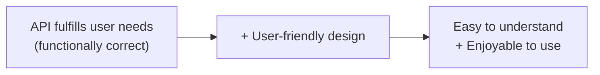

This isn't a soft, optional nicety — design choices actively **attract or repel** developers who might adopt the API, and directly affect how much effort (or friction) they experience integrating with it. Good design can genuinely be a **source of joy**; bad design turns routine integration work into a frustrating slog, regardless of whether the underlying functionality is sound.

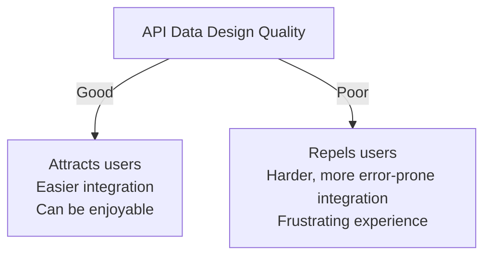

---

## Where User-Friendliness Applies

User-friendliness isn't confined to one part of an API's data — it needs to be considered **everywhere data appears**, regardless of context:

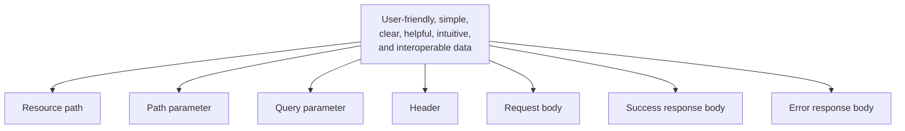

Every one of these surfaces is something a consumer has to read, understand, and correctly work with — inconsistency or confusion in any of them creates friction.

| Context | Example | User-friendliness concern |
|---|---|---|
| Resource path | `/products/{productId}` | Clear naming, correct nesting |
| Path parameter | `productId` | Meaningful, unambiguous identifier |
| Query parameter | `?category=electronics&sort=price` | Intuitive filter/sort names |
| Header | `Idempotency-Key` | Use standard, recognizable headers |
| Request body | `{ "name": "...", "price": 19.99 }` | Simple, well-typed, well-organized |
| Success response body | `{ "productReference": 123, "name": "..." }` | Readable, consistent, complete enough |
| Error response body | `{ "code": "OUT_OF_STOCK", "message": "..." }` | Human-readable, actionable |

---

## A Distinct Second Data-Modeling Pass

For an efficient process, user-friendliness is deliberately handled as a **second, separate pass** over the data — done only *after* the first pass has already confirmed the data actually fulfills user needs.

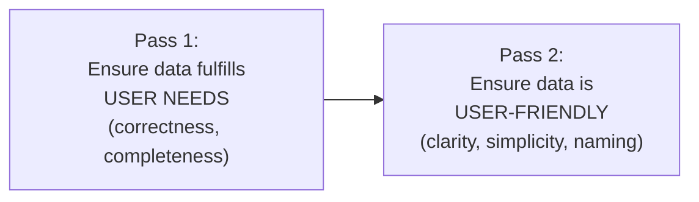

This separation mirrors a pattern already seen earlier in the process (like the nominal-path-first, alternative-paths-second approach to use case analysis): don't try to solve two different kinds of problems simultaneously. Get the substance right first, then refine the presentation and usability — trying to do both at once risks getting bogged down in naming debates before you've even confirmed the data is correct in the first place.

---

## Making Data Ready to Use

The first concern in the user-friendliness pass: is the data actually usable **as delivered**, or does the consumer have to do extra work to make it useful?

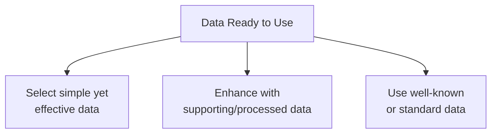

- **Simple yet effective** — prefer the simplest data shape that still fully accomplishes what the consumer needs; don't over-engineer.
- **Supporting/processed data** — sometimes it's worth adding *derived* data alongside raw data, so the consumer doesn't have to compute something themselves (e.g., returning a pre-calculated total alongside line items, instead of forcing every consumer to redo that math).
- **Well-known or standard data** — reuse formats and conventions the consumer is likely to already understand, rather than inventing something novel that requires learning.

### Numbers: don't format them as strings unnecessarily

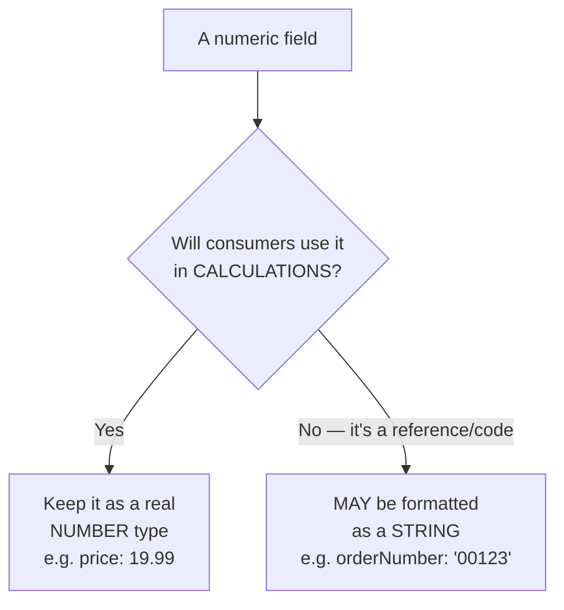

If a value is genuinely numeric and consumers might do math with it (price, quantity, totals), keep it as an actual JSON `number` — encoding it as a string (`"19.99"`) forces every consumer to parse it back into a number before they can use it, which is pure friction with no benefit.

However, **numeric-looking references or codes** — things like an order number, a product SKU, or a zip code — often benefit from being **strings**, even though they're composed of digits. This is because such values are identifiers, not quantities: they're never added, multiplied, or averaged, and treating them as strings avoids issues like leading zeros being silently dropped (`00123` → `123`) when parsed as a real number.

**Avoid — number that consumers must parse:**
```json
{
  "price": "19.99",
  "quantity": "3"
}
```

**Prefer — real numbers, ready to use in calculations:**
```json
{
  "price": 19.99,
  "quantity": 3
}
```

**Prefer — string for a reference/code, even though it looks numeric:**
```json
{
  "orderNumber": "00123",
  "zipCode": "02139"
}
```

### Avoid non-human-readable codes

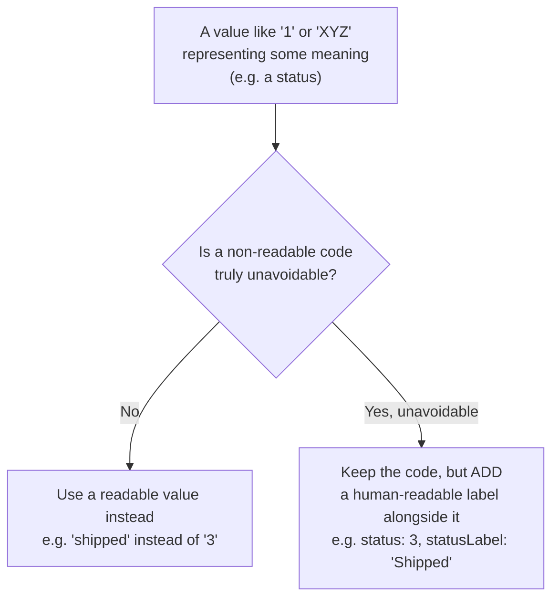

Cryptic codes (`1`, `XYZ`) force every consumer to maintain their own lookup table just to understand what a value means — this is a significant, avoidable source of confusion. When such codes truly can't be avoided (e.g., they're mandated by an external system or legacy convention), pairing them with a human-readable label mitigates the problem.

**Avoid — cryptic code with no context:**
```json
{
  "status": 3
}
```

**Prefer — readable value directly:**
```json
{
  "status": "shipped"
}
```

**Acceptable — code unavoidable, but paired with a label:**
```json
{
  "status": 3,
  "statusLabel": "Shipped"
}
```

### Dates and times: ISO 8601

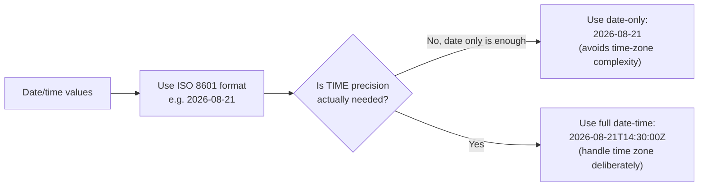

**ISO 8601** is the standard specifically because it's unambiguous and widely understood across languages and platforms, unlike locale-specific formats (`08/21/2026` — is that August 21st or the 8th day of month 21?). Just as important: only include **time precision** when it's genuinely needed. Adding a full timestamp when only a date matters (e.g., a birthdate, or a delivery date) needlessly drags in time-zone handling complexity that the consumer then has to deal with for no real benefit.

**Avoid — ambiguous, locale-specific format:**
```json
{
  "birthDate": "08/21/2026"
}
```

**Prefer — date only, ISO 8601, when time doesn't matter:**
```json
{
  "birthDate": "2026-08-21"
}
```

**Prefer — full date-time, ISO 8601, when time genuinely matters:**
```json
{
  "orderPlacedAt": "2026-08-21T14:30:00Z"
}
```

| Situation | Format to use | Example |
|---|---|---|
| Only the day matters (birthdate, delivery date) | Date only | `2026-08-21` |
| Exact moment matters (event logging, timestamps) | Full date-time with time zone | `2026-08-21T14:30:00Z` |
| Ambiguous locale format | Never use | `08/21/2026` ❌ |

---

## Organizing Data

Well-organized data is inherently easier to read, understand, and process programmatically.

### Grouping properties into objects

Properties that conceptually belong together should be **grouped into nested objects**, rather than left flat at the top level. A common, recognizable pattern is naming these groups after the concepts they represent — e.g., `billingAddress` and `shippingAddress` rather than a flat pile of `billingStreet`, `billingCity`, `shippingStreet`, `shippingCity`.

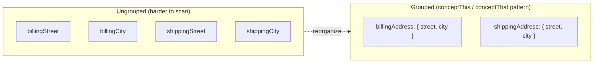

**Avoid — flat, ungrouped properties:**
```json
{
  "billingStreet": "1 Main St",
  "billingCity": "Boston",
  "shippingStreet": "2 Elm St",
  "shippingCity": "Cambridge"
}
```

**Prefer — grouped into nested objects:**
```json
{
  "billingAddress": {
    "street": "1 Main St",
    "city": "Boston"
  },
  "shippingAddress": {
    "street": "2 Elm St",
    "city": "Cambridge"
  }
}
```

### Grouping similar elements into arrays

Repeated, similar elements belong in an **array**, following the common `item1` … `itemN` pattern conceptually — i.e., a list of like things, not separately numbered top-level fields (`item1`, `item2`, `item3` as distinct properties).

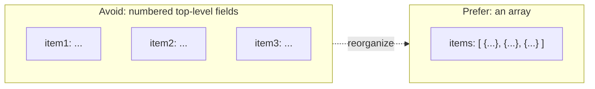

**Avoid — numbered top-level fields:**
```json
{
  "item1": "Cowboy Bebop",
  "item2": "Macross",
  "item3": "Patlabor"
}
```

**Prefer — an array of similar elements:**
```json
{
  "items": ["Cowboy Bebop", "Macross", "Patlabor"]
}
```

### Sorting for usability

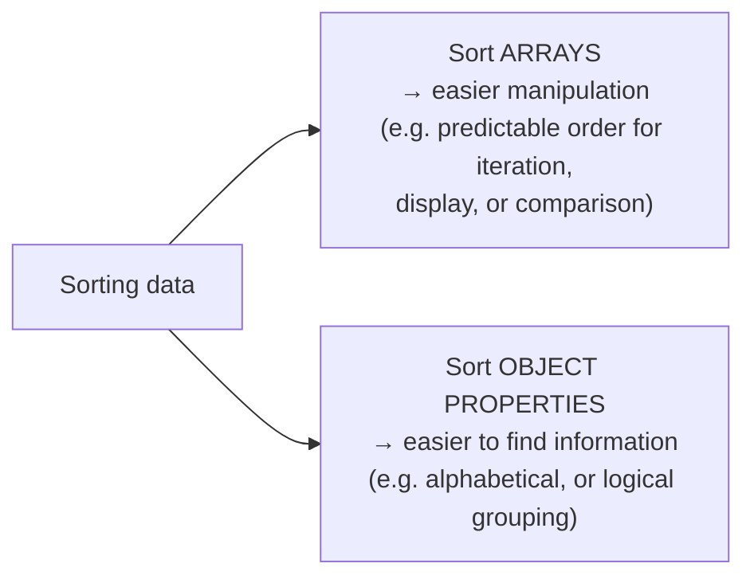

Both forms of sorting reduce cognitive load: a consumer scanning a response for a specific field, or iterating a list expecting a consistent order, benefits directly from data that's been deliberately organized rather than left in arbitrary insertion order.

**Example — sorted array (by name) and sorted object properties (alphabetical):**
```json
{
  "category": "Anime",
  "name": "Cowboy Bebop",
  "price": 24.99,
  "products": [
    { "name": "Cowboy Bebop", "price": 24.99 },
    { "name": "Macross", "price": 19.99 },
    { "name": "Patlabor", "price": 22.5 }
  ]
}
```

| Organizing technique | Purpose | Example |
|---|---|---|
| Group properties into an object | Show a concept belongs together | `billingAddress: { street, city }` |
| Group similar elements into an array | Represent a list of like things | `items: [...]` |
| Sort arrays | Predictable iteration/display order | Sort `products` by `name` |
| Sort object properties | Easier to find a specific field | Alphabetical property order |

---

## Keeping Data Models Appropriately Sized

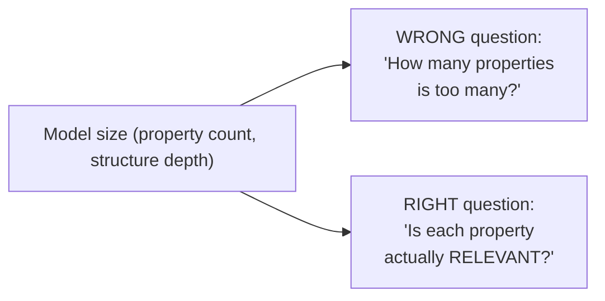

Smaller models are generally easier to understand and process — but the goal isn't to arbitrarily minimize property count or nesting depth as if there's a fixed "correct" number. The real question for every property and every layer of structure is whether it's **relevant** to what the model represents. A large model made entirely of genuinely relevant, necessary properties is better than an artificially trimmed-down model that leaves out something consumers actually need.

---

## Embedding Resources Within Other Resources

When one resource references another (e.g., an order referencing a customer, or a product referencing a category), there's a choice of **how much detail** to embed.

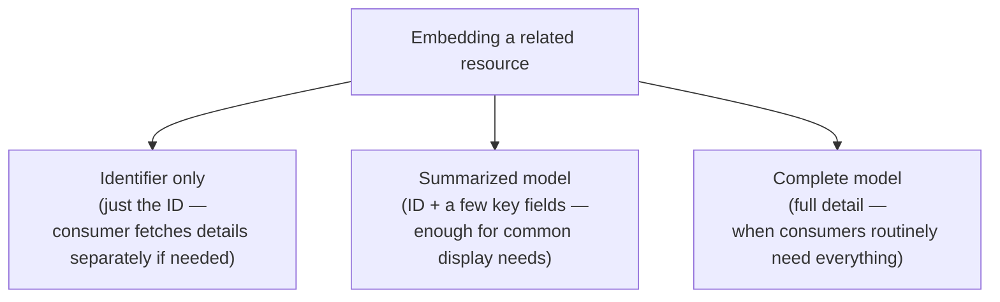

The choice depends on what's genuinely useful to the consumer in that specific context: enough data to be immediately useful, without over-fetching detail that's rarely needed and adds payload weight.

**Identifier only:**
```json
{
  "orderId": 456,
  "customerId": 789
}
```

**Summarized model embedded:**
```json
{
  "orderId": 456,
  "customer": {
    "customerId": 789,
    "name": "Ana Diaz"
  }
}
```

**Complete model embedded:**
```json
{
  "orderId": 456,
  "customer": {
    "customerId": 789,
    "name": "Ana Diaz",
    "email": "ana@example.com",
    "loyaltyTier": "gold",
    "memberSince": "2021-03-14"
  }
}
```

| Embedding depth | When to use |
|---|---|
| Identifier only | Consumer rarely needs related data; keep payload light |
| Summarized model | Common case — enough for typical display needs |
| Complete model | Consumers routinely need full related detail |

### Never embed large arrays directly

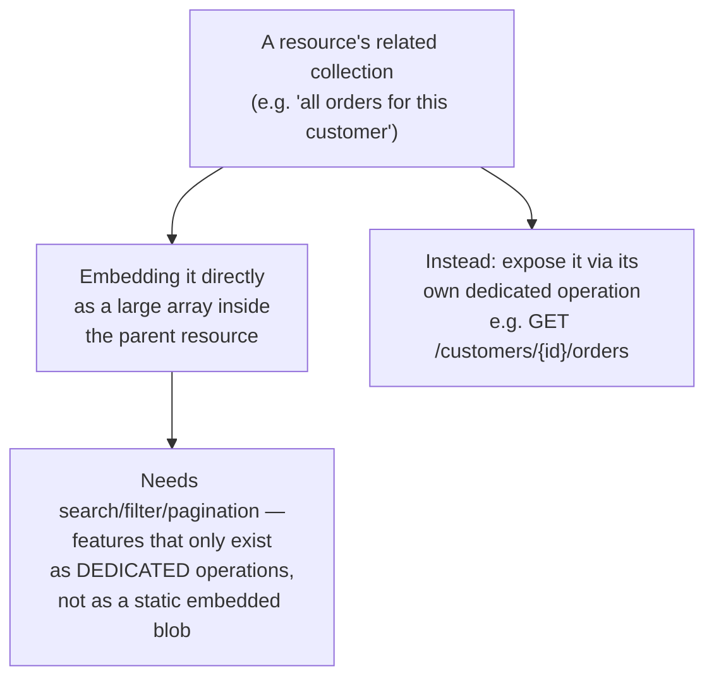

Embedding a potentially large, unbounded collection directly inside another resource is a trap: as soon as that collection grows, consumers need to search, filter, sort, or paginate through it — capabilities that simply don't exist on a static embedded array. The correct approach is to expose that collection through its own dedicated operation (its own path, with its own search/pagination support), and reference it from the parent (e.g., by identifier or a link) rather than inlining the whole thing.

**Avoid — unbounded array embedded directly:**
```json
{
  "customerId": 789,
  "name": "Ana Diaz",
  "orders": [
    { "orderId": 1, "total": 42.0 },
    { "orderId": 2, "total": 17.5 }
    /* ... could be hundreds or thousands more ... */
  ]
}
```

**Prefer — reference to a dedicated, paginated operation:**
```json
{
  "customerId": 789,
  "name": "Ana Diaz",
  "ordersUrl": "/customers/789/orders"
}
```
```
GET /customers/789/orders?page=2&pageSize=20
```

---

## Naming: A Deliberately Later Step

For an efficient process, naming is handled **last**, after concepts have already been identified, typed, formatted, and organized — not simultaneously with those other decisions.

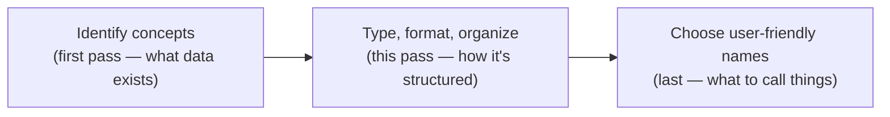

Trying to pick the "perfect" name for something before its type, format, and place in the structure are settled tends to produce wasted effort — a name chosen early often needs revisiting once the surrounding structure changes.

### Rules for easy-to-understand names

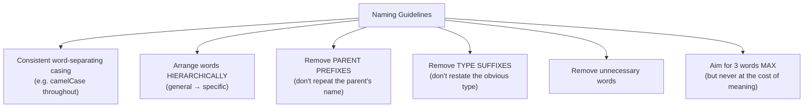

- **Simple, consistent casing** — pick one convention (e.g., `camelCase`) and apply it uniformly so word boundaries are always predictable.
- **Hierarchical word order** — order words from general to specific, e.g., `productCategory` rather than `categoryOfProduct`, so related fields naturally sort and scan together.
- **Remove parent prefixes** — inside a `product` object, a field should be `name`, not `productName` — the parent context already establishes what it belongs to; repeating it is redundant.
- **Remove type suffixes** — avoid restating the obvious type in the name itself, e.g., `price` rather than `priceNumber` or `priceValue`.
- **Remove unnecessary words** — strip filler words that don't add real meaning.
- **Three words max, but meaning wins** — as a general target, keep names to three words or fewer for scannability, but never sacrifice actual clarity just to hit that number. A slightly longer name that's unambiguous beats a short one that's confusing.

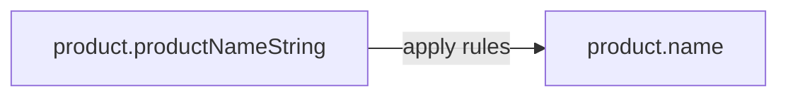

| Naming rule | Before | After |
|---|---|---|
| Remove parent prefix | `product.productName` | `product.name` |
| Remove type suffix | `product.priceNumber` | `product.price` |
| Hierarchical word order | `categoryOfProduct` | `productCategory` |
| Remove unnecessary words | `theProductDisplayName` | `name` |
| Consistent casing | `product_Name`, `Price_USD` | `name`, `price` |

**Before applying naming rules:**
```json
{
  "productProductNameString": "Cowboy Bebop",
  "productPriceNumberValue": 24.99,
  "productCategoryOfProductString": "Anime"
}
```

**After applying naming rules:**
```json
{
  "name": "Cowboy Bebop",
  "price": 24.99,
  "category": "Anime"
}
```

---

## Standards and Interoperability

### Prefer standard or preexisting models

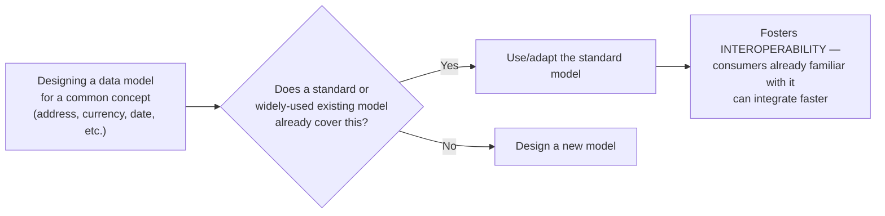

Reinventing a data shape for something that already has an established standard (currency codes, country codes, address formats, date/time formats) creates unnecessary friction for consumers who already know the standard and now have to learn a bespoke variant instead.

### Consistency at the right scope

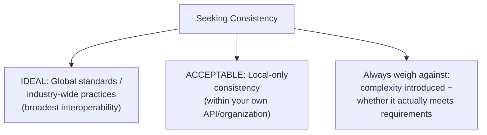

The aspiration is to align with **global standards or broad industry practices** wherever reasonably possible, since that maximizes interoperability for the widest range of consumers. But this isn't an absolute requirement — **local-only consistency** (being internally consistent within your own API or organization, even without matching a global standard) is a legitimate and sufficient outcome in many cases. The deciding factor is a genuine tradeoff: does adopting a broader standard introduce more complexity than it's worth, and does it actually satisfy the real requirements at hand? If not, staying locally consistent is a perfectly acceptable choice rather than a compromise to feel guilty about.

**Example — using established standards instead of inventing formats:**
```json
{
  "currency": "USD",
  "country": "US",
  "language": "en-US",
  "orderPlacedAt": "2026-08-21T14:30:00Z"
}
```
Here `currency` follows ISO 4217, `country` follows ISO 3166-1 alpha-2, `language` follows BCP 47, and the timestamp follows ISO 8601 — none of these formats were invented for this API; all are widely recognized standards.

| Common concept | Standard to reuse |
|---|---|
| Currency | ISO 4217 (`USD`, `EUR`) |
| Country | ISO 3166-1 alpha-2 (`US`, `FR`) |
| Language/locale | BCP 47 (`en-US`, `fr-FR`) |
| Date/time | ISO 8601 |

---

## Quick Reference: All Guidelines at a Glance

| Concern | Guideline |
|---|---|
| Process order | Fulfill user needs first, refine user-friendliness second |
| Numbers | Keep real numeric values as `number`; identifiers/codes may be `string` |
| Cryptic codes | Avoid; if unavoidable, add a human-readable label |
| Dates/times | ISO 8601; add time precision only when truly needed |
| Grouping | Group related properties into objects; group like items into arrays |
| Sorting | Sort arrays and object properties for predictability and findability |
| Model size | Judge by relevance of each property, not an arbitrary count |
| Embedding | Identifier, summary, or complete model — never an unbounded array |
| Naming order | Identify → type/format/organize → name (last) |
| Naming style | Consistent casing, hierarchical order, no redundant prefixes/suffixes, ≤3 words when possible |
| Standards | Prefer global/industry standards; local-only consistency is acceptable when justified |
