# Designing User-Friendly, Interoperable APIs

## The Top Level: The API as a Whole

Everything covered so far builds up a hierarchy — user-friendly **data**, made of user-friendly **operations**, arranged into user-friendly **flows**. This final layer is about the **API itself** as a complete, coherent whole.

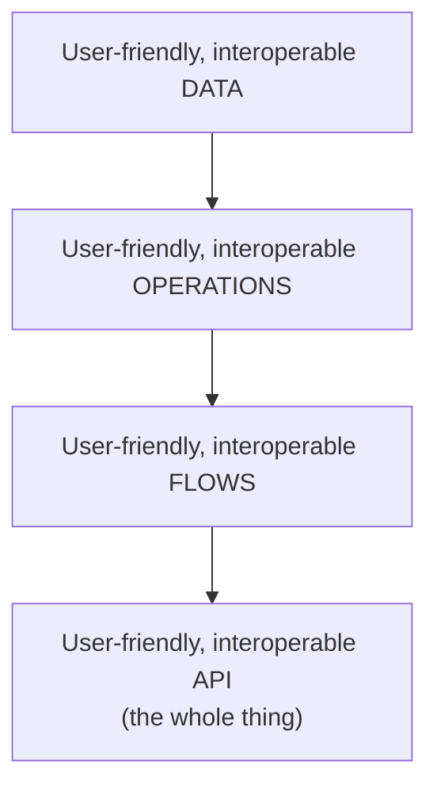

A user-friendly API adds two more qualities on top of everything below it:

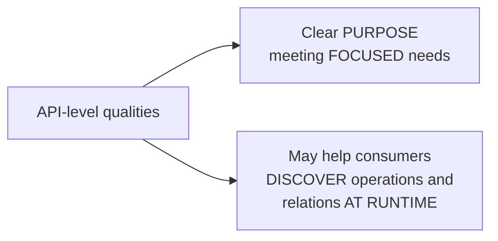

- **Clear, focused purpose** — the API should have an identifiable, coherent scope, not be a sprawling grab-bag of unrelated capabilities.
- **Runtime discoverability** — optionally, consumers can be helped to discover what operations exist and how resources relate to each other dynamically, while actually using the API, rather than needing to consult external documentation for everything.

---

## When One API Becomes Too Many Concerns

A single API can technically satisfy every user need identified, yet still end up **complicated to understand** simply because it's grown to cover too much ground. Deciding whether to split an API happens **after** flows have already been optimized — it's one of the last structural decisions made in the design process.

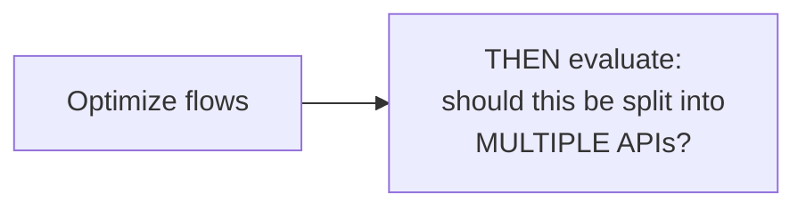

### How to decide on a split

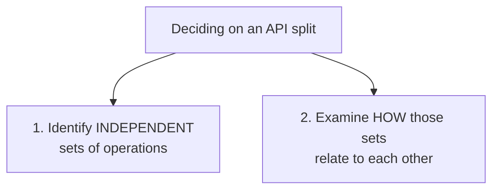

The core technique is grouping operations into **independent sets** — clusters of operations that are heavily related to each other but only loosely (or not at all) related to operations outside that cluster.

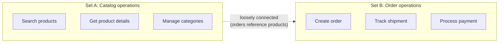

**Important caveat:** these subdomains are rarely perfectly clean-cut. They **can and often do share connections** — an order genuinely does reference a product, for example — so the goal isn't to find a split with zero relationships crossing the boundary, but rather to find a split where each resulting group is internally cohesive and the cross-group connections are manageable (e.g., via shared identifiers, not deeply intertwined business logic).

| Signal | Suggests |
|---|---|
| Operations frequently called together, in the same flows | Likely belong in the same API |
| Operations share the same core resources | Likely belong in the same API |
| Operations serve very different consumer types or use cases | Candidate for splitting |
| Operations only connect via a simple reference (an ID) | Can often be split, with the reference as the connecting point |

---

## Naming the API

### Why the name matters

An API's **name** does real design work — it establishes the API's **boundaries** (what's in scope, what isn't) and is often the very first thing a potential consumer encounters, shaping their expectations before they've read a single endpoint.

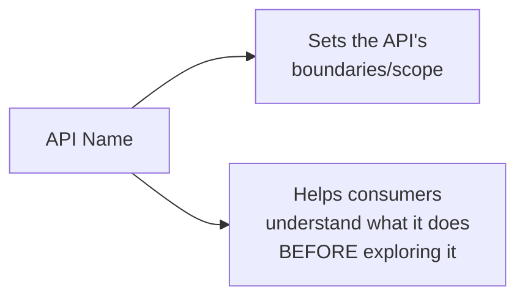

### What to name it after

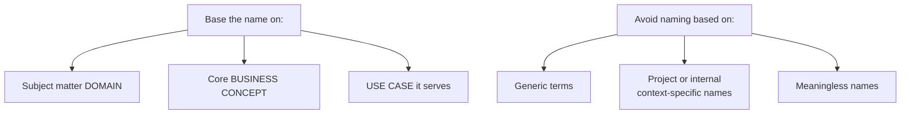

| Good naming basis | Example | Why it works |
|---|---|---|
| Subject matter domain | `Catalog API` | Clearly signals scope: product/catalog concerns |
| Business concept | `Payments API` | Immediately understandable business purpose |
| Use case | `Checkout API` | Names the specific job it does |

| Naming to avoid | Example | Why it fails |
|---|---|---|
| Generic term | `Data API`, `Backend API` | Tells a consumer nothing about scope |
| Project/internal codename | `Project Phoenix API` | Meaningless to anyone outside the internal team |
| Meaningless/arbitrary | `API v2`, `Core Service API` | Doesn't communicate purpose at all |

```
Avoid: "Project Phoenix API"        →  Prefer: "Catalog API"
Avoid: "Backend Data API"           →  Prefer: "Customer Profile API"
Avoid: "Core Service API"           →  Prefer: "Payments API"
```

---

## Runtime Discoverability

The second API-level quality — helping consumers discover operations and relations **while using the API**, not just from static documentation — has several concrete techniques.

### `OPTIONS`: discovering available methods without fetching data

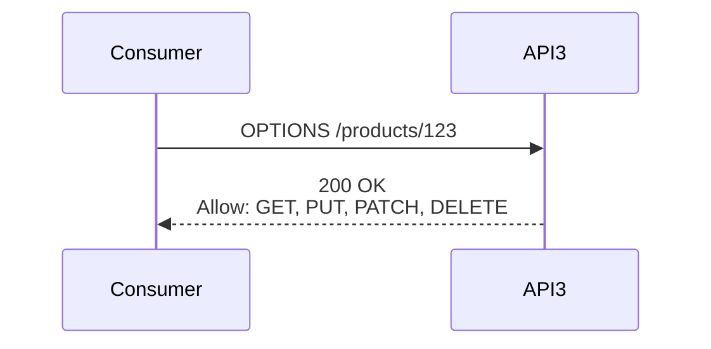

The `OPTIONS` HTTP method lets a consumer ask a server **which HTTP methods are actually supported** on a given resource, **without** retrieving the resource's actual data. The response's `Allow` header lists what's available.

```
OPTIONS /products/123

→ 200 OK
Allow: GET, PUT, PATCH, DELETE
```

This is useful for a consumer that wants to dynamically decide what actions to offer (e.g., only show a "Delete" button in a UI if `DELETE` actually appears in the `Allow` header for that specific resource instance) — without needing to first fetch the resource just to find that out, and without needing this logic hardcoded from documentation alone.

### `Link` header: pagination, formats, and resource relations

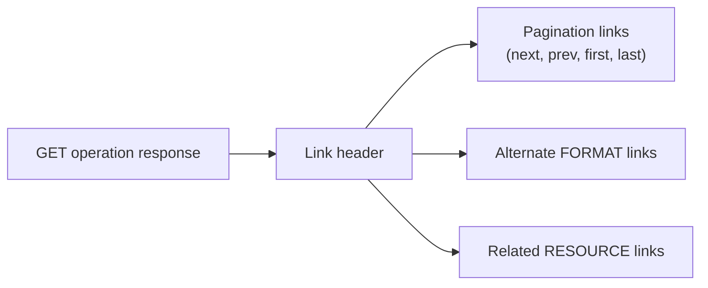

```
GET /products?page=2&pageSize=20

→ 200 OK
Link: <https://api.example.com/products?page=3&pageSize=20>; rel="next",
      <https://api.example.com/products?page=1&pageSize=20>; rel="prev",
      <https://api.example.com/products?page=1&pageSize=20>; rel="first",
      <https://api.example.com/products?page=8&pageSize=20>; rel="last"
```

```
GET /products/123

→ 200 OK
Link: <https://api.example.com/products/123.xml>; rel="alternate"; type="application/xml",
      <https://api.example.com/products/123/reviews>; rel="reviews"
```

| `rel` value | Meaning |
|---|---|
| `next` / `prev` | Adjacent pages in a paginated list |
| `first` / `last` | First/last page of a paginated list |
| `alternate` | The same resource in a different format |
| A custom relation (`reviews`, `category`) | A related resource, discoverable without prior knowledge of its exact URL |

This lets a consumer navigate — page through results, switch formats, or follow relationships to other resources — by **following links returned in the response**, rather than needing to hardcode URL construction logic based on documentation alone.

### Use a standard hypermedia format

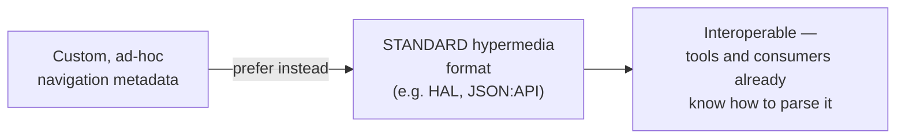

Rather than inventing a bespoke way to embed navigation metadata (links, relations) into responses, using an established **standard hypermedia format** means the resulting metadata is genuinely interoperable — generic client libraries and tools built against that standard can parse and navigate the API automatically, without custom integration work per API.

```json
// Example using HAL (Hypertext Application Language) format
{
  "productReference": 123,
  "name": "Cowboy Bebop",
  "price": 24.99,
  "_links": {
    "self": { "href": "/products/123" },
    "reviews": { "href": "/products/123/reviews" },
    "category": { "href": "/categories/anime" }
  }
}
```

### When to actually invest in browsing/hypermedia capabilities

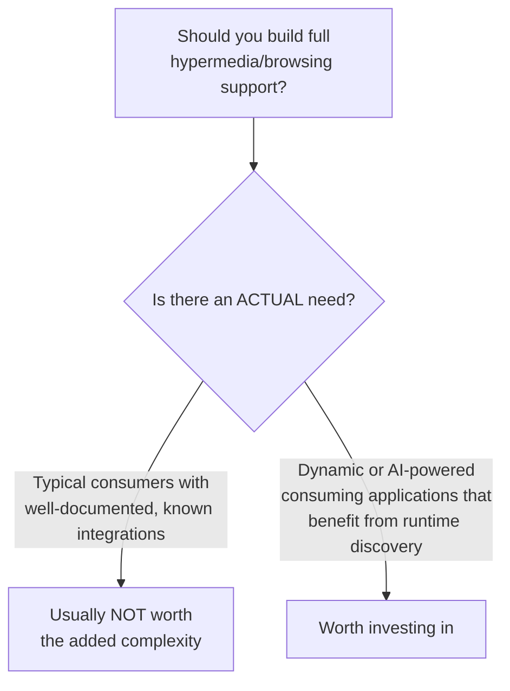

This is framed as an explicit cost/benefit decision, not a default requirement. Full hypermedia-driven browsing capability adds real design and implementation complexity — it's specifically worth that investment in contexts like **dynamic or AI-powered consuming applications**, which genuinely benefit from being able to discover and navigate an API's capabilities and relationships at runtime rather than relying on a fixed, pre-programmed integration. For a typical, well-documented API consumed by developers who read the docs once and hardcode the integration, that extra machinery often isn't worth the cost.

---

## Consolidated Checklist

| Concern | Guideline |
|---|---|
| API-level qualities | Clear, focused purpose; optional runtime discoverability |
| Splitting timing | Evaluate only after flows are already optimized |
| Splitting method | Identify independent operation sets; expect some cross-connections |
| Naming basis | Subject matter domain, business concept, or use case |
| Naming to avoid | Generic, project/context-specific, or meaningless names |
| `OPTIONS` | Reveals available methods (`Allow` header) without fetching data |
| `Link` header | Pagination, alternate formats, related resources |
| Hypermedia format | Prefer a standard format (e.g., HAL) over ad-hoc metadata |
| Browsing/discovery investment | Build only when genuinely needed — e.g., dynamic or AI-powered consumers |
