# Designing User-Friendly, Interoperable Operation Flows

## What Is an Operation Flow?

An **operation flow** is the **sequence of API calls** a consumer has to make, in order, to actually accomplish a use case. It's the "story" formed by chaining individual operations together — not any single operation in isolation.

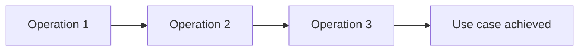

**Example flow — "Buy a product":**

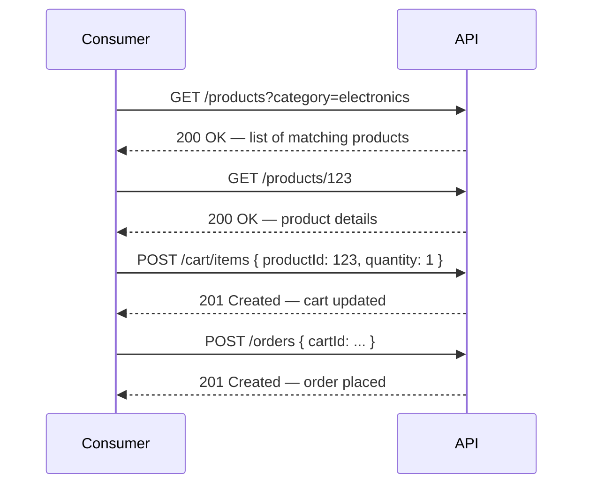

---

## Why Flows Need Their Own Design Attention

Even if every individual operation in a flow is well-designed on its own — user-friendly data, guessable paths, appropriate methods — the **flow as a whole** can still be clunky, rigid, or inefficient. Flow design is a distinct concern layered on top of everything covered so far.

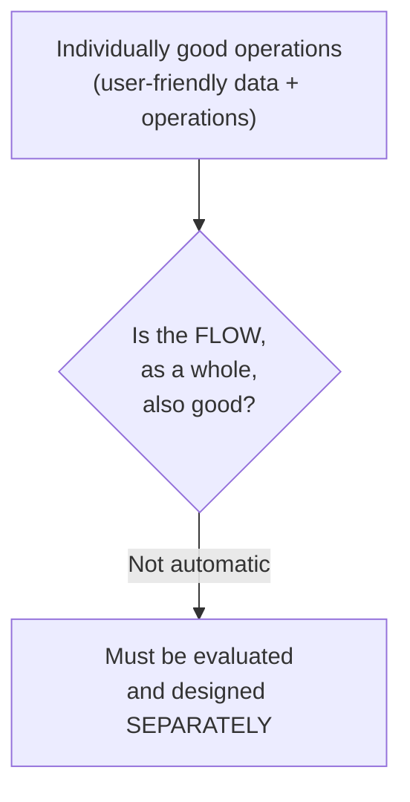

A flow can be bad even when every step in it is individually well-designed — for example, requiring five sequential calls where two would do, or forcing a strict linear order when consumers legitimately need to jump in partway through.

---

## Principle 1: Design Concise Flows

The fewer steps required to accomplish a use case, the better. Every additional required step is additional friction, additional network round-trips, and additional chances for something to fail partway through.

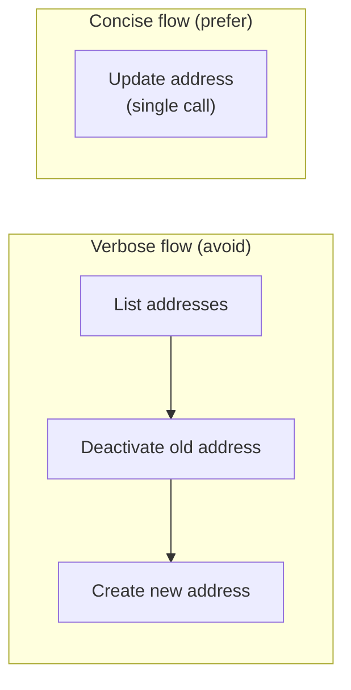

This directly echoes the earlier address-update example: three separate calls collapsed into one atomic operation is exactly this "conciseness" principle in action.

```
Verbose (3 calls):
GET    /customers/456/addresses
PATCH  /customers/456/addresses/1  { "status": "inactive" }
POST   /customers/456/addresses    { "street": "...", "status": "active" }

Concise (1 call):
PUT    /customers/456/address      { "street": "..." }
```

---

## Principle 2: Design Flexible Flows

### Support various contexts, not just one UI

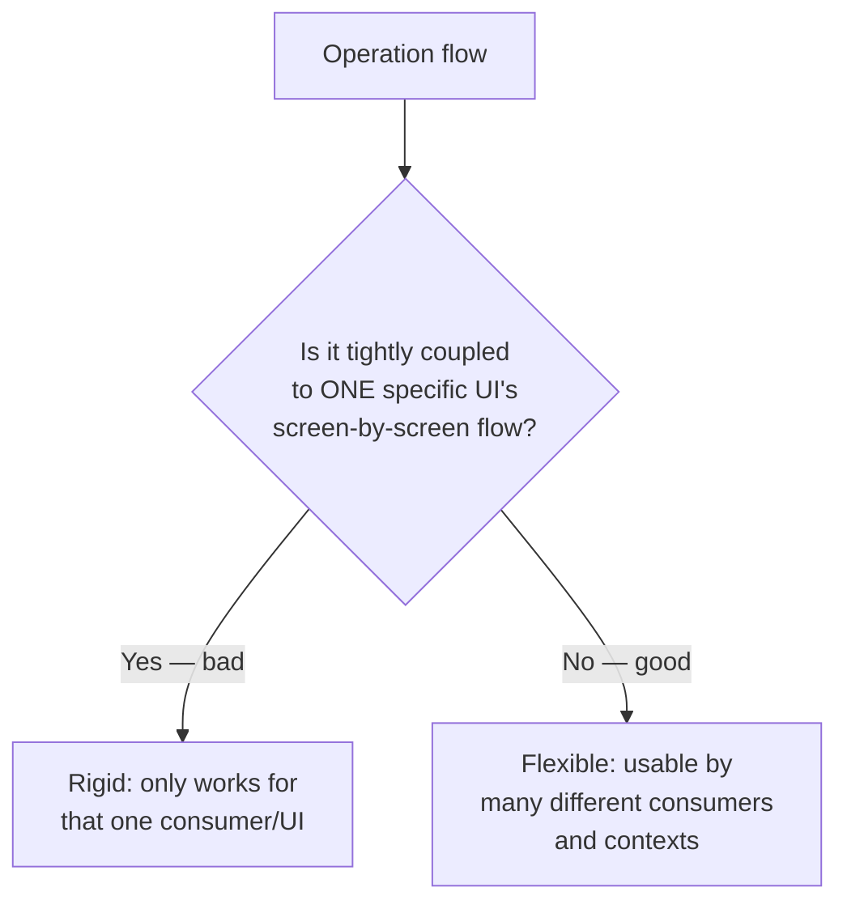

This connects to the earlier caution against mapping API design to UI flows. If a flow is built assuming one specific screen sequence (step 1 must be screen A, step 2 must be screen B...), any other consumer — a different app, a batch import tool, a partner integration — is forced to awkwardly conform to that same rigid sequence even when it doesn't fit their actual needs.

### Allow entry at later steps, not just the beginning

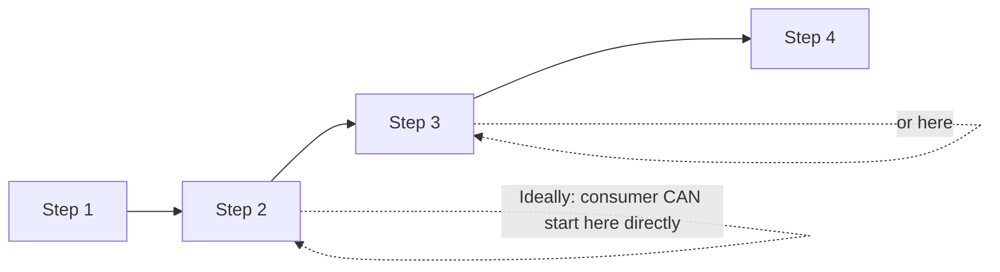

Ideally, a consumer who already has the data or context that would normally come from earlier steps should be able to **skip straight to a later step**, rather than being forced to march through the entire sequence from the beginning every time — even when some of it is redundant for their situation.

**Example:** an order-checkout flow shouldn't force every consumer through "search products → view product → add to cart" if a partner integration already knows exactly which product and quantity it wants — that partner should be able to call the "add to cart" or "create order" step directly.

---

## Principle 3: Operations Must Serve the Flow's Context

Every operation used within a flow should genuinely meet the needs of that specific point in the flow — and should help the consumer move on to whatever the **next logical operation** in the flow is. This often means an operation's output should include exactly what's needed as input for the *next* step.

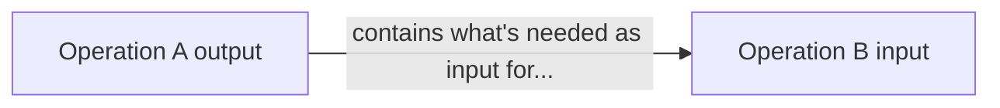

```json
// Step 1 output: creating a cart
// POST /carts → 201 Created
{
  "cartId": "c789",
  "items": []
}
```
```
// Step 2 input directly uses cartId from step 1's output — no extra lookup needed
POST /carts/c789/items
{ "productId": 123, "quantity": 1 }
```

---

## Principle 4: Reuse Similar Patterns Across Similar Flows

If several flows in the API share a similar underlying shape (e.g., multiple "create X, then confirm X" flows across different resource types), they should follow the **same structural pattern** consistently, rather than each one inventing its own slightly different sequence.

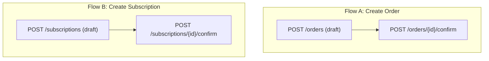

A consistent "create as draft, then confirm" pattern used identically across every resource type that needs it means a consumer who's learned the pattern once from any single flow can correctly guess how *every other* similar flow in the API works — making the whole API more **guessable and easy to use** as a system, not just operation by operation.

---

## When Flow Optimization Happens

Flow optimization is deliberately done **after** individual data and operation user-friendliness/interoperability work is already finished — same staged-refinement philosophy seen throughout this whole design process.

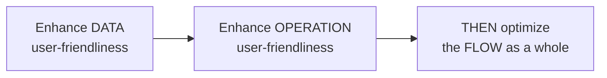

---

## Finding Optimization Opportunities

Three questions guide the search for flow improvements:

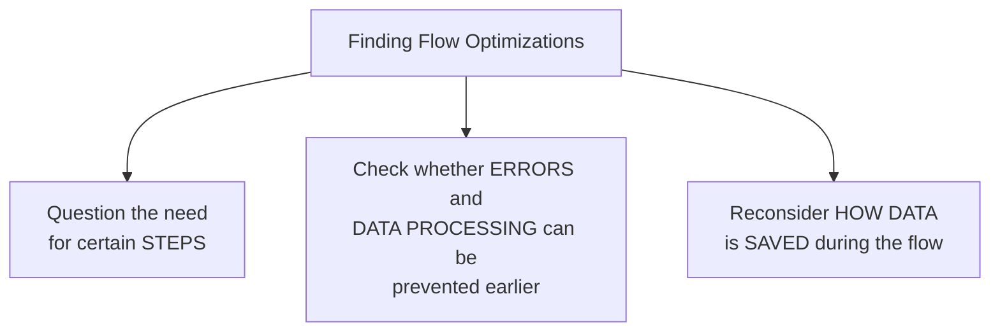

### 1. Question the need for certain steps

For every step, ask: is this step *actually necessary*, or is it just historically how it's been done? A step that only exists to fetch data the server could derive or already has access to is a candidate for removal.

### 2. Check whether errors/processing can be prevented

If a later step commonly fails because of something that could have been checked or handled earlier, moving that validation earlier (or building it into an earlier step) prevents wasted round-trips and frustrating late-stage failures.

### 3. Reconsider how data is saved

Sometimes the *sequencing* of when data gets persisted during a flow is itself the source of friction — this is expanded on below in the partial-saving section.

---

## Techniques for Optimizing a Flow

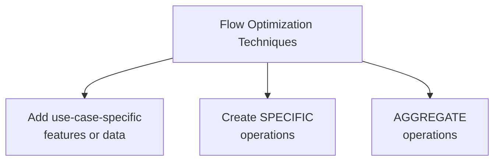

### Add use-case-specific features or data

Sometimes a flow can be shortened by simply enriching an existing operation with something extra tailored to a common use case, rather than requiring a separate call.

```json
// Before: separate call needed to check stock before adding to cart
GET /products/123/stock  → { "available": 5 }
POST /cart/items { "productId": 123, "quantity": 1 }

// After: stock info added directly to the product read response
GET /products/123 → { "productReference": 123, "name": "...", "stockAvailable": 5 }
POST /cart/items { "productId": 123, "quantity": 1 }
```

### Create specific operations

Instead of forcing a consumer through several generic operations to achieve one common, specific goal, a dedicated operation can be created that directly represents that goal.

```
Generic (multi-step):
GET  /products/123
PATCH /products/123 { "status": "discontinued" }
POST /notifications { "type": "product-discontinued", "productId": 123 }

Specific (one step):
POST /products/123/discontinue
```

### Aggregate operations

Multiple related operations can be **combined into one** that performs several actions together as a single atomic call — similar in spirit to the earlier address-update collapsing.

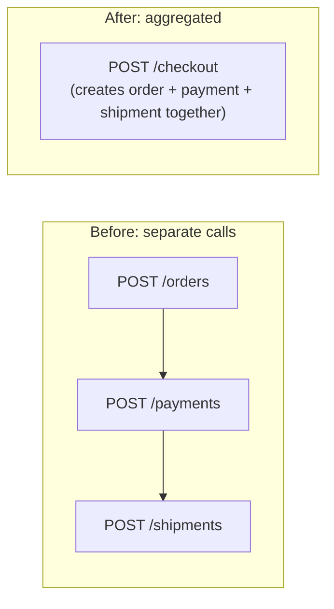

---

## The Caution: Don't Sacrifice Clarity for Optimization

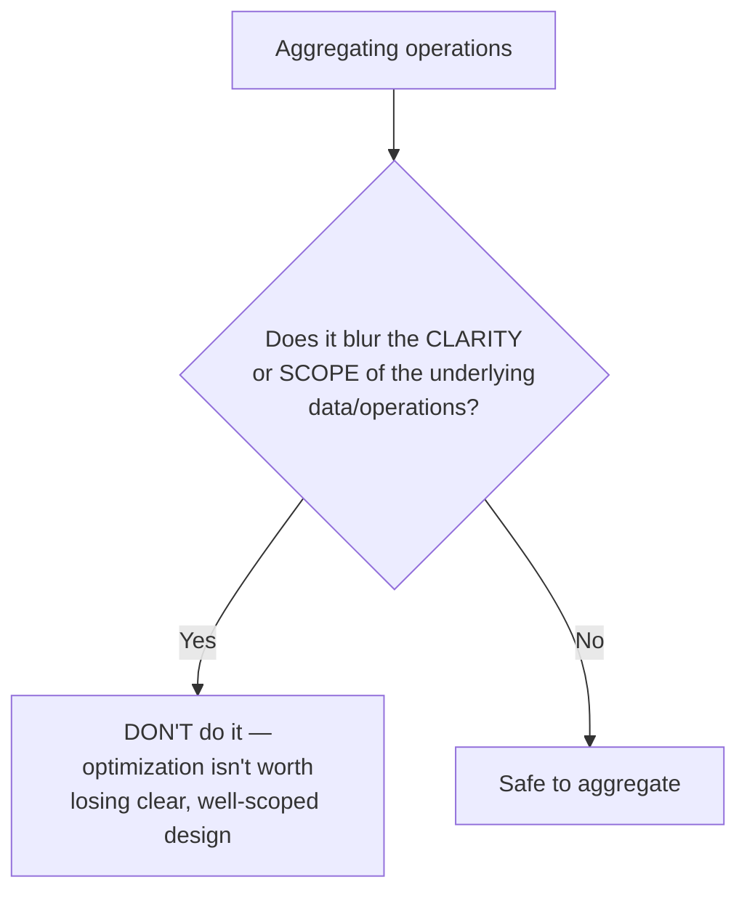

This is an explicit guardrail: reducing the number of calls is valuable, but **not at the cost of clarity**. An aggregated "do everything" operation that becomes vague about what it actually does, or that mixes unrelated concerns together just to save a round-trip, has traded a real problem (verbosity) for a worse one (an unclear, poorly-scoped operation). Every optimization should be checked against this tradeoff before being adopted.

---

## Partial Data-Saving in Multi-Step Flows

For flows where a consumer builds up data over multiple steps (e.g., a multi-page form, a draft order, a long registration process), the API should support **saving progress incrementally**, not force an all-or-nothing single submission.

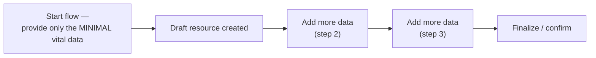

```
POST   /applications              { "applicantName": "Ana Diaz" }   → creates a draft, minimal data only
PATCH  /applications/a1           { "email": "ana@example.com" }    → adds more data later
PATCH  /applications/a1           { "documents": [...] }            → adds more data later still
POST   /applications/a1/submit                                       → finalizes
```

The key requirement: **initiating the flow should only require the minimal vital data**, so consumers aren't blocked from starting just because they don't yet have every piece of information — they can collect the rest incrementally as it becomes available.

### Split validation from completion

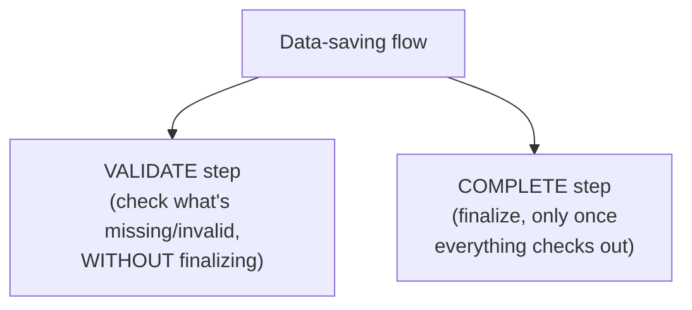

```
GET  /applications/a1/validation
→ 200 OK
{
  "isComplete": false,
  "missingFields": ["documents"],
  "issues": []
}

POST /applications/a1/submit
→ 400 Bad Request (if still incomplete)
{
  "title": "Application incomplete",
  "detail": "Missing required field: documents"
}
```

Separating a **validation check** from the actual **completion/submission** action lets consumers (and end users, through their UI) verify what's missing or wrong *before* attempting to finalize — rather than only discovering problems as a rejected final submission, which is a much worse experience, especially in a long multi-step flow.

### Support both full (single-step) and partial (multi-step) saving

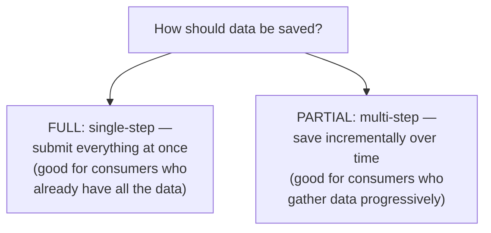

```
Full (single call — e.g. a partner system with all data ready):
POST /applications
{
  "applicantName": "Ana Diaz",
  "email": "ana@example.com",
  "documents": [...]
}
→ 201 Created (already complete)

Partial (multiple calls — e.g. a human filling out a long form):
POST  /applications          { "applicantName": "Ana Diaz" }
PATCH /applications/a1       { "email": "ana@example.com" }
PATCH /applications/a1       { "documents": [...] }
POST  /applications/a1/submit
```

Offering both options lets each consumer choose whichever approach genuinely fits their situation — a fully-informed backend integration shouldn't be forced through an artificial multi-step dance, and a human filling out a form over several sessions shouldn't be forced to provide everything in one shot.

---

## Consolidated Checklist

| Concern | Guideline |
|---|---|
| Step count | Keep flows as concise as possible; collapse unnecessary multi-step sequences |
| Flexibility | Don't couple flows to one UI's screen order; allow entry at later steps |
| Operation fit | Each operation should serve its flow context and feed naturally into the next step |
| Consistency | Reuse the same flow patterns across similar use cases |
| Timing | Optimize flows only after individual data/operation user-friendliness is done |
| Finding optimizations | Question unnecessary steps; prevent errors/processing earlier; reconsider data-saving timing |
| Optimization techniques | Use-case-specific enrichment, dedicated operations, aggregation |
| Aggregation guardrail | Never sacrifice clarity or scope for fewer calls |
| Partial saving | Require only minimal vital data to start; allow incremental additions |
| Validation vs. completion | Separate "check what's missing" from "finalize" |
| Save modes | Support both full single-step and partial multi-step saving |
