# Designing User-Friendly, Interoperable Operations

## What Makes an Operation User-Friendly and Interoperable

User-friendliness isn't just about individual data fields — it also applies to the **operation** as a whole: the path, the method, the inputs it demands, and the outputs it returns.

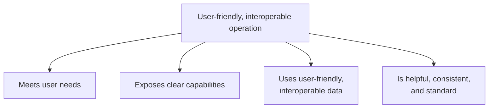

| Quality | What it means in practice |
|---|---|
| Meets user needs | The operation actually does what the consumer needs — no more, no less |
| Exposes clear capabilities | A consumer can tell what the operation does just from its shape |
| User-friendly, interoperable data | Follows the data-design guidelines already established (types, naming, standards) |
| Helpful, consistent, standard | Predictable behavior, error handling, and conventions across the whole API |

---

## When This Work Happens: A Combined Second Pass

Data user-friendliness and operation user-friendliness are worked on **simultaneously**, in a **second pass**, done only after the programming interface has already been designed to correctly "do the job" (i.e., after resources, HTTP mappings, and functional data models are settled).

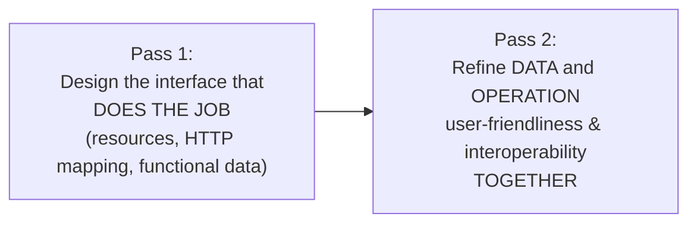

Unlike the earlier data-only second pass, this stage treats data and operation refinements as one combined effort — since a lot of operation-level user-friendliness (like what an error response looks like, or how list results are formatted) is really about the *data* those operations produce.

---

## Designing Guessable Operations: Paths and Methods

### Use appropriate HTTP methods

The right HTTP method (established earlier during CRUD-to-HTTP mapping) is itself a major contributor to guessability — a consumer familiar with REST conventions can predict behavior just from seeing `GET`, `POST`, `PUT`, `PATCH`, or `DELETE`.

### Meaningful, hierarchical paths

Every path segment should have a **specific, understandable purpose**, following a consistent, predictable pattern as resources nest:

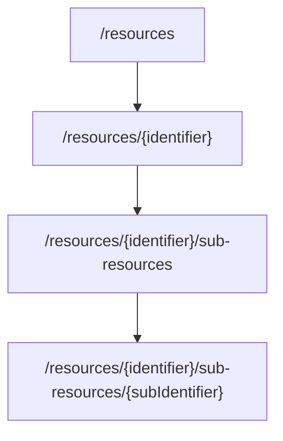

| Path | Meaning |
|---|---|
| `/products` | The products collection |
| `/products/{productId}` | One specific product |
| `/products/{productId}/reviews` | The reviews collection for one specific product |
| `/products/{productId}/reviews/{reviewId}` | One specific review of one specific product |

```
GET  /products                                → search products
GET  /products/{productId}                    → read one product
GET  /products/{productId}/reviews            → list reviews for a product
GET  /products/{productId}/reviews/{reviewId} → read one review
```

Once a consumer learns this pattern once, they can **guess** the shape of paths for resources they haven't even seen yet — that predictability is the whole point.

### Globally unique IDs → shorter, flatter paths

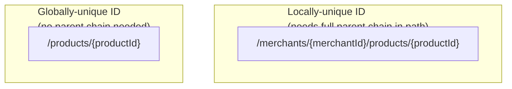

If a resource's identifier is only unique *within* its parent (e.g., product IDs restart at 1 for every merchant), the path is forced to include the full parent chain just to disambiguate. If the identifier is **globally unique** instead (e.g., a UUID, or a database-wide auto-increment), the resource can often be addressed directly — producing **shorter paths that need fewer path parameters**, which is simpler for consumers to construct and remember.

```
Locally-unique ID: /merchants/456/products/789
Globally-unique ID: /products/789
```

---

## Making Input Data Easy to Provide

Every input — path parameters, query parameters, headers, and body — should be **easy to provide**. There are four concrete techniques:

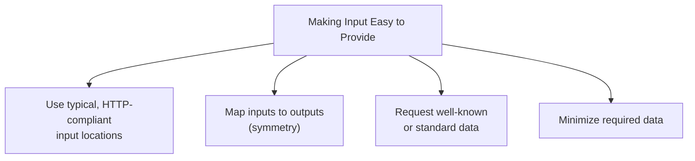

### 1. Typical, HTTP-compliant locations

Put each input where a REST-experienced consumer would expect to find it — identifiers in the path, filters in the query string, resource data in the body — following the rules already covered in HTTP mapping. Deviating from these conventions (e.g., putting a filter in a header for no reason) breaks the guessability the whole design relies on.

### 2. Map inputs to outputs

If an operation's output includes a field, an operation that lets a consumer *set* that same conceptual value should use a matching input name/shape. This symmetry means a consumer who already understands the output structure can immediately understand what input is expected, without learning a second vocabulary.

```json
// GET /products/{id} → output
{
  "productReference": 123,
  "name": "Cowboy Bebop",
  "price": 24.99
}
```
```json
// PUT /products/{id} → input (same field names/shapes)
{
  "name": "Cowboy Bebop",
  "price": 26.99
}
```

### 3. Well-known or standard data

Same principle as with output data: prefer standard formats and conventions for input too (ISO country codes, ISO 8601 dates, etc.) rather than inventing bespoke input formats.

### 4. Minimize required data

Fewer required inputs mean less work and fewer chances for a consumer to get something wrong.

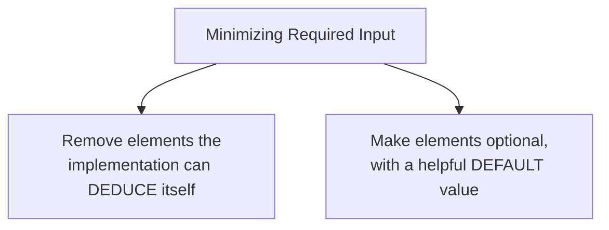

**Remove deducible input** — if the server can figure something out on its own (e.g., inferring `currency` from the authenticated user's account region, or computing `totalPrice` from line items instead of requiring the consumer to send it), don't make the consumer supply it.

**Optional with defaults** — when a value has a sensible default most consumers would want anyway, make it optional rather than mandatory.

```
Before: POST /orders  requires { items, currency, locale, shippingSpeed }
After:  POST /orders  requires { items }
                       optional: currency (default: account currency)
                                 locale (default: account locale)
                                 shippingSpeed (default: "standard")
```

| Input | Before | After |
|---|---|---|
| `currency` | Required | Optional — defaults to account currency |
| `locale` | Required | Optional — defaults to account locale |
| `shippingSpeed` | Required | Optional — defaults to `"standard"` |
| `items` | Required | Required (genuinely can't be deduced) |

---

## Returning Ready-to-Use Responses

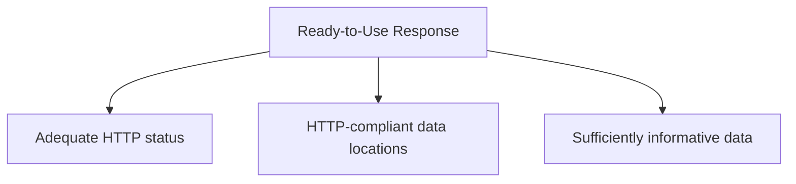

### Return the complete resource, not the minimal model, on create/update

Earlier data-modeling guidance suggested a **minimal model** (just the identifier) as output for create operations — but for user-friendliness, this default is revisited: it's generally more helpful to return the **complete resource** after a successful create or update, so the consumer doesn't need to immediately issue a follow-up `GET` just to see the result of what they just did.

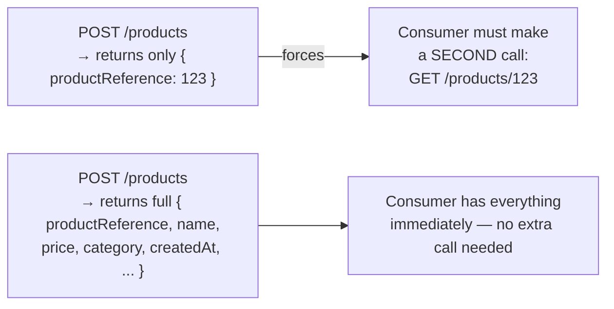

```json
// Preferred: 201 Created returns the full resource
{
  "productReference": 123,
  "name": "Cowboy Bebop",
  "price": 24.99,
  "category": "Anime",
  "createdAt": "2026-08-21T14:30:00Z"
}
```

### Consider enriching list responses too

Lists don't have to be limited to the strict "summarized model" if consumers and the subject matter would benefit from more — don't be afraid to include extra useful fields in list results if it genuinely helps meet user needs, even if it goes beyond the minimal summary originally planned.

---

## Filter, Sort, and Pagination for List/Search Operations

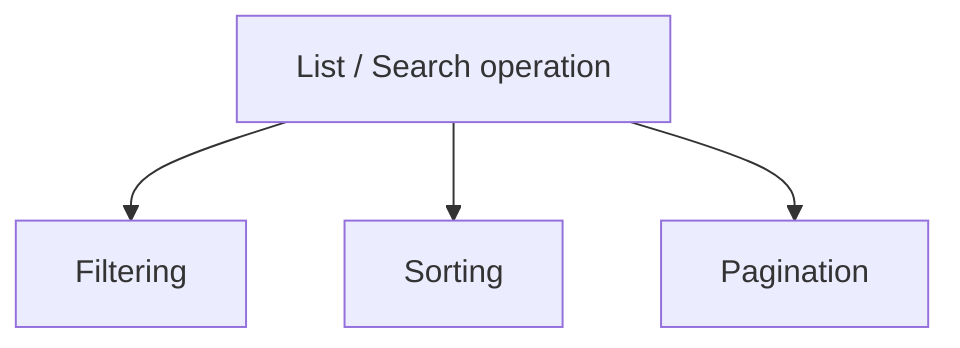

```
GET /products?category=electronics&sort=-price&page=2&pageSize=20
```

| Feature | Purpose | Example query parameter |
|---|---|---|
| Filter | Narrow results by criteria | `?category=electronics` |
| Sort | Control result ordering | `?sort=-price` (descending price) |
| Pagination | Limit and page through large result sets | `?page=2&pageSize=20` |

These features should be added **proportionally** to actual need — adding every conceivable filter/sort option "just in case" adds unnecessary complexity to both the implementation and the documentation. Balance what's genuinely useful against what adds maintenance and cognitive burden.

### All query parameters must be optional

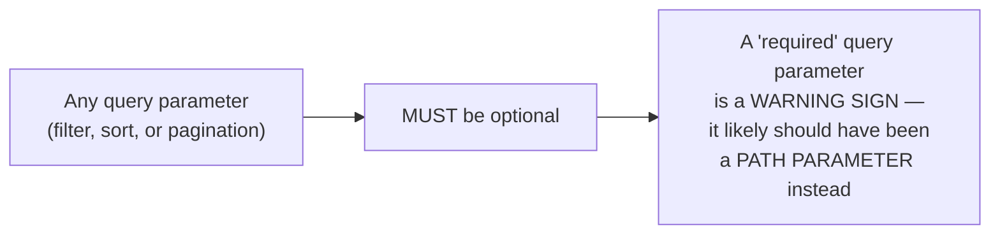

If a query parameter turns out to genuinely be mandatory for the operation to make sense, that's usually a signal the design is wrong — that value probably identifies something core to the request and belongs in the **path** instead, not the query string.

```
Suspicious: GET /products?merchantId=456  (merchantId required)
Better:     GET /merchants/456/products    (merchantId as a path parameter)
```

### Return filter, sort, and pagination metadata

A list/search response shouldn't just return the raw matching data — it should also return **metadata** describing the current filter/sort/pagination state, so consumers can build pagination UI, know how many total results exist, etc.

```json
{
  "data": [
    { "productReference": 1, "name": "Cowboy Bebop" },
    { "productReference": 2, "name": "Macross" }
  ],
  "pagination": {
    "page": 2,
    "pageSize": 20,
    "totalItems": 143,
    "totalPages": 8
  },
  "sort": "-price",
  "filters": {
    "category": "electronics"
  }
}
```

### Put list data under a generic property name

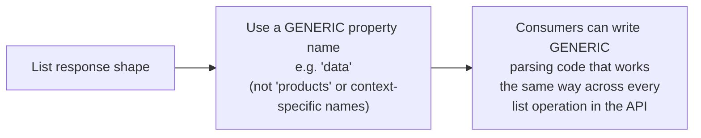

```json
{
  "data": [ { "productReference": 1, "name": "Cowboy Bebop" } ],
  "pagination": { "page": 1, "pageSize": 20, "totalItems": 143 }
}
```

Using a consistent, generic key like `data` for the actual list content — rather than a resource-specific name like `products` — means a consumer's generic list-handling code (pagination logic, loading state, etc.) can be reused identically across every list endpoint in the API, instead of needing to know a different property name per resource.

---

## Content Negotiation: Multiple Formats and Translation

### Format negotiation

An API can support multiple representation formats (JSON, XML, etc.) for the same resource, using standard HTTP **content negotiation** headers rather than separate endpoints per format.

```mermaid
sequenceDiagram
    participant Client
    participant Server
    Client->>Server: GET /products/123<br/>Accept: application/xml
    Server-->>Client: 200 OK<br/>Content-Type: application/xml<br/>&lt;product&gt;...&lt;/product&gt;
    Client->>Server: POST /products<br/>Content-Type: application/xml<br/>&lt;product&gt;...&lt;/product&gt;
    Server-->>Client: 201 Created
```

| Header | Direction | Purpose |
|---|---|---|
| `Accept` | Request | What format the client wants back |
| `Content-Type` | Request | What format the client is sending |
| `Content-Type` | Response | What format the server actually sent |

```
GET /products/123
Accept: application/xml

→ 200 OK
Content-Type: application/xml
<product><productReference>123</productReference>...</product>
```

### Language negotiation

The same negotiation mechanism, using `Accept-Language`, lets a server return translated content.

```
GET /products/123
Accept-Language: fr-FR

→ 200 OK
{
  "productReference": 123,
  "name": "Cowboy Bebop",
  "description": "Un classique de l'animation..."
}
```

**Crucial limit:** only **human-facing text** should be translated — the actual field/property names and any codes must remain untouched regardless of language, since they're part of the API's structural contract, not something a human reads directly.

```json
// Correct: only the human-readable "description" is translated
{
  "productReference": 123,
  "status": "shipped",
  "description": "Un classique de l'animation, sorti en 1998."
}

// WRONG: never translate field names or status codes
{
  "référenceProduit": 123,
  "statut": "expédié"
}
```

---

## Error Feedback

### General qualities of good error feedback

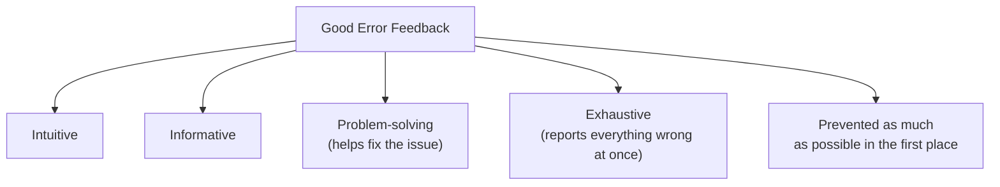

### Be flexible about input, strict about output

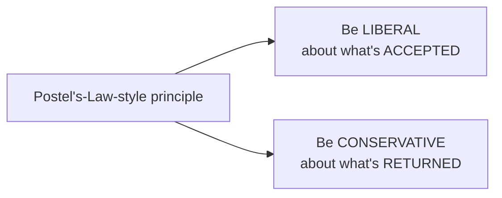

| Situation | Guidance |
|---|---|
| Update operation body | Accept a **complete model**, even if only some fields changed, to reduce friction |
| Input format variants | Accept reasonable variants (e.g., different date formats, casing) where practical |
| Output format | Always return one **standardized**, predictable format — never vary it based on what was received |

```
Accept flexible input:
PUT /products/123
{ "name": "Cowboy Bebop", "price": 24.99, "category": "Anime", "inStock": true }
  → all fields accepted, even if some values are unchanged

Always return standardized output:
200 OK
{ "productReference": 123, "name": "Cowboy Bebop", "price": 24.99, ... }
  → same shape and format every time, regardless of input variant
```

### Choosing the right status code, including the empty-list exception

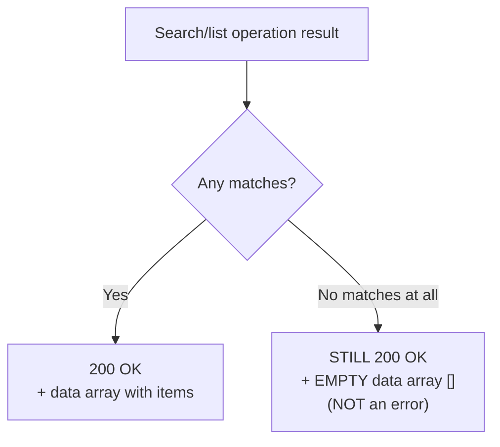

An important, easy-to-get-wrong rule: a search that legitimately finds **zero results** is not an error — it's a normal, successful outcome. It should return `200 OK` with an **empty array**, not a `404` or other error status.

```json
// GET /products?category=nonexistent-category
// Still 200 OK — this is a valid, successful "no results" outcome
{
  "data": [],
  "pagination": { "page": 1, "pageSize": 20, "totalItems": 0, "totalPages": 0 }
}
```

### Error feedback must describe the problem and help fix it

Both **human-readable** and **machine-readable** error information should be included — humans reading logs or debugging need a clear description, while consumer code needs a stable, parseable code to branch logic on.

```json
{
  "type": "https://example.com/errors/insufficient-stock",
  "title": "Insufficient stock",
  "status": 400,
  "detail": "Only 2 units of product 123 are available, but 5 were requested.",
  "instance": "/orders/789"
}
```

| Field | Audience | Purpose |
|---|---|---|
| `type` / `title` | Machine + human | Stable, categorized error identifier |
| `status` | Machine | HTTP status code, duplicated for convenience |
| `detail` | Human | Specific, readable explanation of what went wrong |
| `instance` | Machine | Reference to the specific request/resource involved |

### Return all errors at once

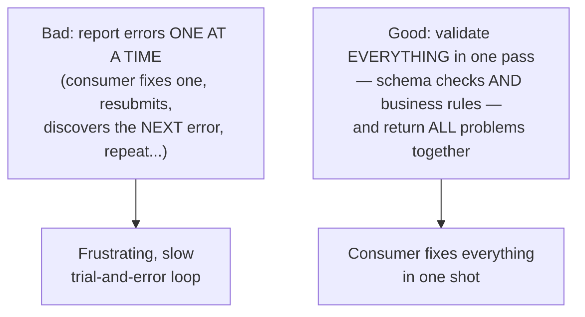

The implementation should ideally run **all** applicable checks in a single pass — both basic schema validation (e.g., a missing required field like a destination account) and deeper business-rule validation (e.g., insufficient balance) — and report every problem found, rather than stopping at the first error and forcing the consumer through repeated trial-and-error submissions.

```json
{
  "type": "https://example.com/errors/validation-failed",
  "title": "Validation failed",
  "status": 400,
  "errors": [
    {
      "field": "destinationAccount",
      "detail": "This field is required."
    },
    {
      "field": "amount",
      "detail": "Insufficient balance: requested 500.00, available 320.00."
    }
  ]
}
```

### Use standard error formats

Rather than inventing a custom error response shape, use an established standard — **"Problem Details for HTTP APIs"** (RFC 7807 / RFC 9457) is specifically named as a good fit. Its structure (`type`, `title`, `status`, `detail`, `instance`, and extensible custom fields) is already shown in the examples above — adopting it means consumers who've seen it in other APIs already know how to parse your errors too, for free.

---

## Operation Granularity and Consistency

### Check that each operation has appropriate granularity

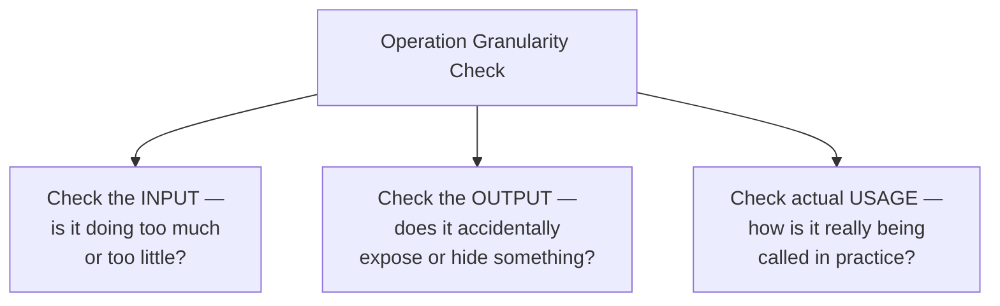

An operation shouldn't unintentionally **hide another capability** inside itself — for example, an "Update product" operation that silently also updates the product's category-relationship if a category ID happens to be included, without that being a clearly separate, intentional operation. This connects back to the earlier warning about business logic — operations should have a clear, singular, well-scoped purpose, confirmed by examining what real consumer usage actually looks like once available.

### Consistency across the whole API

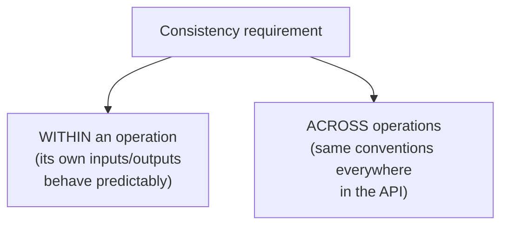

Input data, output data, features (filtering, pagination, error formats), and general behaviors must stay **consistent** — both within a single operation and across every operation in the API. A consumer who's learned how filtering works on one list endpoint should be able to correctly predict how filtering works on every other list endpoint, without re-reading documentation from scratch each time.

---

## Consolidated Checklist

| Area | Key rules |
|---|---|
| Paths | Hierarchical, meaningful segments; globally unique IDs to shorten paths |
| Methods | Use appropriate, standard HTTP methods |
| Input | Typical HTTP locations; mirror output shapes; standard formats; minimize required fields |
| Create/update output | Return the complete resource, not just an identifier |
| Lists | Add filter/sort/pagination as needed; all query params optional; return metadata; generic `data` key |
| Content negotiation | `Accept`/`Content-Type` for format; `Accept-Language` for human text only |
| Input flexibility | Liberal in what's accepted (full model on update, format variants); conservative in what's returned |
| Empty search results | `200 OK` + empty array — never an error |
| Errors | Human- and machine-readable; return all problems in one pass; use a standard format (Problem Details) |
| Granularity | No hidden capabilities; verify via input, output, and real usage |
| Consistency | Same conventions within and across every operation |
