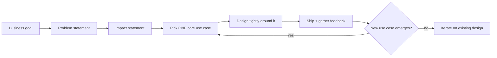
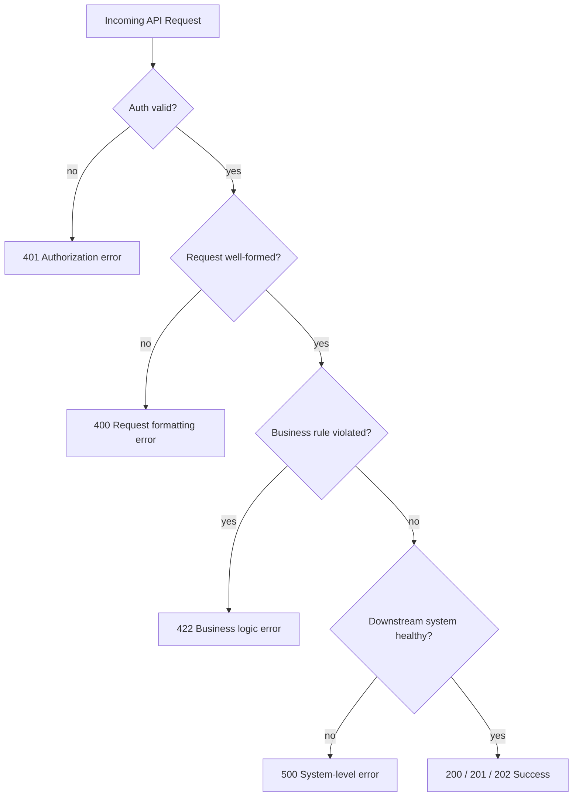
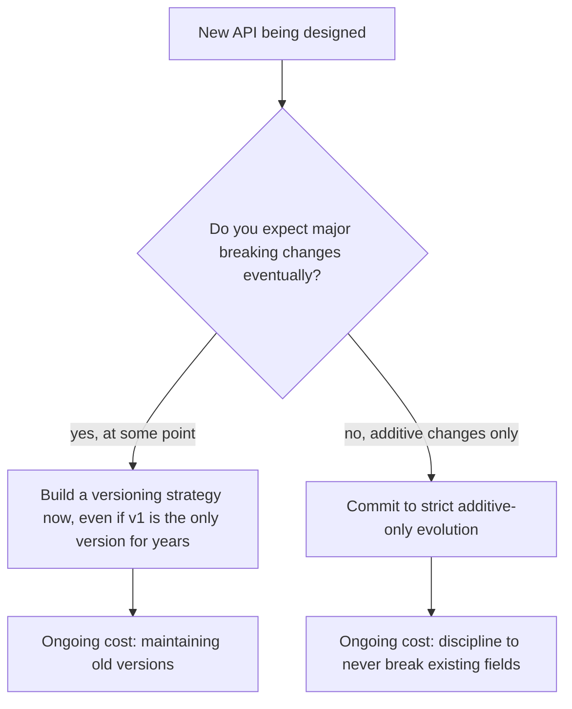
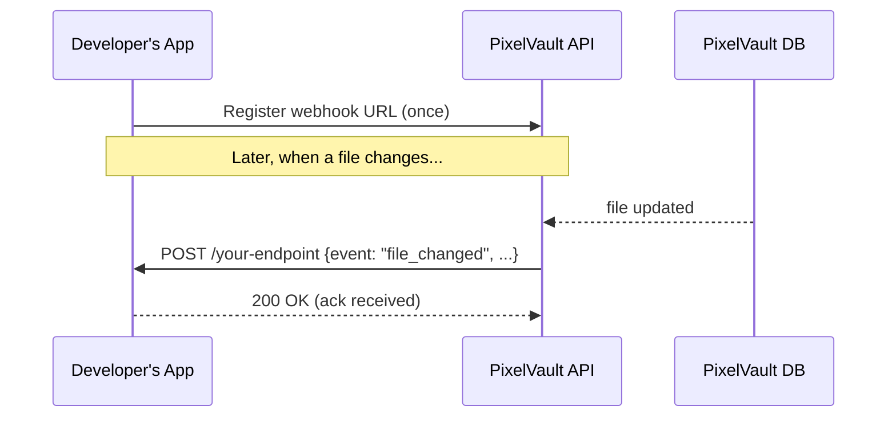
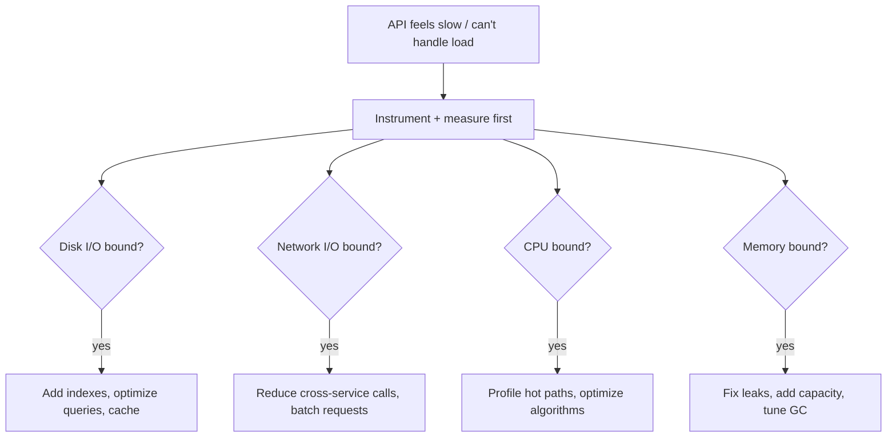
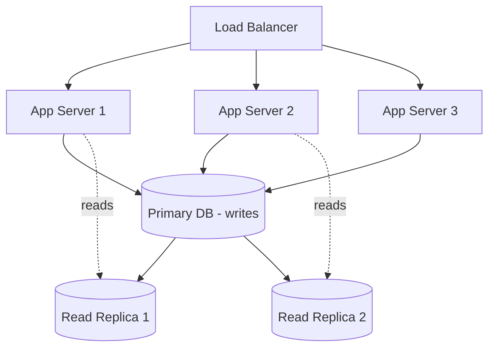
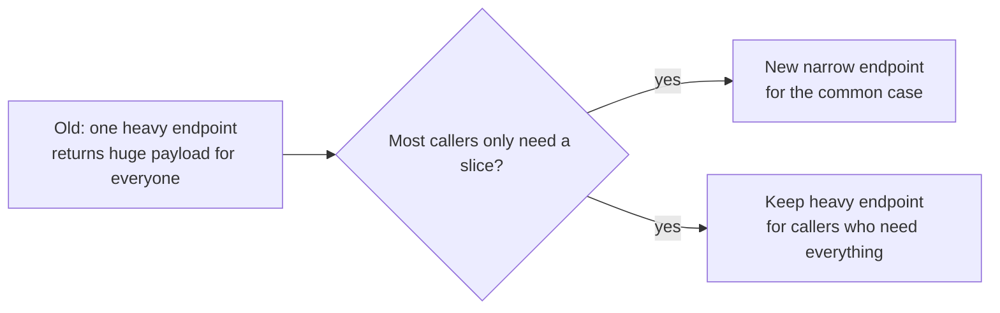
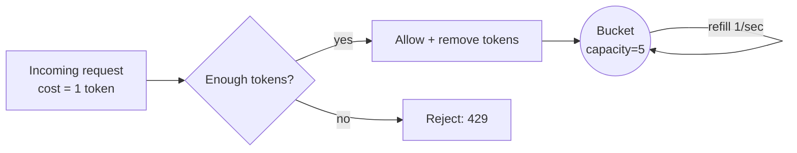

# Designing and Scaling APIs That Developers Actually Enjoy Using

I've spent enough time building, breaking, and rebuilding APIs to have opinions about this stuff, and in this post I want to walk through everything I've learned about designing APIs well and then keeping them alive once real traffic shows up. This got long — I'm covering design philosophy, developer experience, a full worked example, and then the scaling toolbox (throughput, caching, pagination, rate-limiting, SDKs). Grab a coffee.

I'll be honest upfront: none of this is exotic. Good API design is mostly about empathy for the person on the other end of the HTTP request, and good scaling is mostly about knowing where your bottlenecks actually are instead of guessing. But the details matter a lot, so let's get into them.

---

## Table of Contents

1. [Designing for Real Use Cases, Not Imaginary Ones](#part-1)
2. [What Makes a Developer Experience Great](#part-2)
3. [Making Your API Extensible](#part-3)
4. [A Worked Example: Designing the PixelVault API](#part-4)
5. [Scaling APIs: Throughput, Bottlenecks, and Hardware](#part-5)
6. [Caching Without Shooting Yourself in the Foot](#part-6)
7. [Evolving an API's Design as It Grows](#part-7)
8. [Pagination: Offset vs. Cursor](#part-8)
9. [Rate-Limiting: Algorithms, Headers, and Policy](#part-9)
10. [Developer SDKs](#part-10)
11. [Closing Thoughts](#part-11)

---

<a id="part-1"></a>
## 1. Designing for Real Use Cases, Not Imaginary Ones

When I sit down to design an API, the very first thing I try to do is resist the urge to start writing endpoints. It's tempting — I open my editor, I start sketching `GET /users`, `POST /items`, and I feel productive. But that productivity is usually pointed in the wrong direction, because I haven't yet answered the two questions that should come before any of it:

- What should a developer using this API actually be able to *do*?
- What kind of application should they be able to build with it?

For some products the answer is narrow: "developers should be able to charge a customer's card." For others it's broad: "developers should be able to build a full interactive experience on top of our data." Either answer is fine, but you need to know which one you're aiming for, because it changes everything downstream — your resource model, your auth scopes, even your error taxonomy.

> **Note:** I've found it useful to write this down as a single sentence before touching any tooling. If I can't compress the goal into one sentence, that's usually a sign I don't understand the use case well enough yet.

### The trap of internal architecture leaking into your API

One mistake I see constantly (and have made myself) is designing the API around how the backend happens to be organized instead of around the experience an outside developer should have. If your internal system splits "files" into three microservices for organizational reasons, that's your business — a third-party developer shouldn't need to know or care. When implementation details leak into the public contract, you end up with:

- endpoint names that only make sense if you already understand your own codebase
- inconsistent shapes for what is conceptually the same resource
- a permanent tax on every future refactor, because now external clients depend on your internal seams

### Avoid solving every hypothetical at once

Early in a design, it's incredibly easy to spiral into "what if" scenarios. What if someone wants bulk uploads? What if someone wants real-time sync? What if someone wants to filter by seventeen different fields? These are useful questions to *ask*, but dangerous ones to *solve* all at once, because trying to satisfy every hypothetical up front usually produces a bloated, unfocused v1 that ships late and still doesn't fit anyone's actual workflow.

My rule of thumb: pick one concrete workflow, design tightly around it, ship it, and let feedback tell you what to add next.



---

<a id="part-2"></a>
## 2. What Makes a Developer Experience Great

I think about developer experience the same way a product team thinks about user experience — except the "user" is someone reading your docs at 11pm trying to hit a deadline, and they have approximately zero patience for friction. Developers abandon bad APIs quickly. There's no loyalty tax that keeps them around while you improve things; they just leave and use a competitor's API, or build the feature themselves.

### 2.1 Make it fast to get started

The single biggest lever I've found for developer adoption is time-to-first-successful-call. If someone can go from "I found your API" to "I got a 200 response with real data" in under five minutes, they trust you. If it takes forty-five minutes of OAuth flow debugging before they see anything, they start looking elsewhere.

Things that help:

- **Interactive docs / sandboxes** — letting someone try an endpoint from the browser without writing a single line of code first.
- **Getting-started guides**, distinct from your full reference documentation. A spec tells you *everything*; a guide tells you the *one path* that gets you to a working call.
- **Pre-generated tokens or easy sandbox auth** so people aren't fighting OAuth before they've even seen a response.

> **Caution:** If your API is protected by OAuth and you don't give developers an easy way to generate a token in the UI (instead of implementing the whole flow themselves just to test something), you *will* see meaningful drop-off at that step. I've watched this happen — people bounce right there.

### 2.2 Consistency is a feature

This is the one I probably harp on the most, because inconsistency compounds in a way that's easy to underestimate. If a resource is called `users` in one endpoint and `members` in another, every developer integrating with you now has to hold both names in their head, write code that reconciles them, and hope you don't introduce a third name later.

The same goes for response *shapes*. If a `user` field is sometimes an integer ID and sometimes a full object, every consumer of your API has to branch on the type before they can do anything useful with it. That's not a hypothetical inconvenience — it's code that every single integrator has to write, forever, until you fix it (which, because it's now a breaking change, you probably won't).

| Inconsistency Type | Example | Cost to Developers |
|---|---|---|
| Naming drift | `users` vs `members` for the same resource | Extra mental mapping, duplicated logic |
| Type drift | `user` is sometimes an ID, sometimes an object | Defensive type-checking in every client |
| Casing drift | `snake_case` in one endpoint, `camelCase` in another | Serialization bugs, extra config |
| Error shape drift | Some endpoints return `{error: "..."}`, others return plain strings | Can't build one generic error handler |
| Pagination drift | Offset params here, cursor params there | Two pagination code paths per SDK |

The value of consistency isn't aesthetic — it's that a developer should be able to *guess* how a new endpoint behaves before reading the docs, because it rhymes with everything else you've built. That's what actually reduces support burden on your side, too.

### 2.3 Make troubleshooting easy — meaningful errors

An error can occur anywhere along the request's path: auth, business logic, a downstream database hiccup. What separates a good API from a frustrating one is whether those errors are **specific, unambiguous, and actionable.**

I like errors that give me:
1. A machine-readable code my code can branch on.
2. A human-readable message I can show a person or paste into a bug report.
3. (Ideally) a link to relevant docs.

Here's a comparison I keep coming back to when designing error codes:

| Situation | Good error code | Bad error code |
|---|---|---|
| Auth token was revoked | `token_revoked` | `invalid_auth` |
| A string field exceeded its max length | `name_too_long` | `invalid_name` |
| Credit card expired | `expired_card` | `invalid_card` |
| Refund attempted twice | `charge_already_refunded` | `cannot_refund` |

The "bad" column isn't wrong exactly — it's just *vague*. `invalid_card` could mean expired, could mean malformed, could mean declined. `expired_card` tells the developer (and their end user) exactly what happened and what to do about it.

It also helps to group your errors into categories early, before you've written a hundred ad hoc error strings scattered across the codebase:



And here's roughly how I like to lay that mapping out in a spec, once the categories are settled:

| Error Category | HTTP Status | Example Machine Code | Example Message |
|---|---|---|---|
| System-level | 500 | — | (generic, don't leak internals) |
| Business logic | 429 | `rate_limit_exceeded` | "You've been rate-limited. Retry after the `Retry-After` header value." |
| Request formatting | 400 | `missing_required_parameter` | "Your request was missing a `name` parameter." |
| Authorization | 401 | `invalid_token` | "The provided access token is not valid." |

> **Note:** It's worth deciding, on purpose, when to be specific versus when to be deliberately vague. Being specific about a missing parameter is helpful. Being specific about *why* a database connection failed is a security liability — you don't want to leak internal infrastructure details to the outside world.

### 2.4 Build tooling for troubleshooting

Beyond returning good errors, invest in logging and dashboards — both for yourself and, where reasonable, for your developers. A dashboard that lets a developer see their own recent requests, response codes, and latencies will resolve a huge fraction of "why isn't this working" support tickets before they're even filed.

> **Caution:** If you're logging full request payloads for debugging, scrub personally identifiable information (PII) before it ever hits a log aggregator. This isn't optional — it's a compliance and trust issue, and it's much easier to build the redaction in from day one than to retrofit it after your logs already contain a year of unredacted customer data.

---

<a id="part-3"></a>
## 3. Making Your API Extensible

No matter how good your initial design is, your product will change, and your API needs a strategy for absorbing that change without breaking everyone who depends on it.

### 3.1 Get feedback from top partners early

Before you roll a change out broadly, give a small set of trusted developers early access — a beta or "early adopter" channel. This catches design problems while they're cheap to fix, instead of after thousands of integrations depend on the old behavior.

### 3.2 Decide on versioning early, even if you don't need it yet

Versioning is one of those things that's much cheaper to build in from the start than to retrofit. If you wait until you desperately need to make a breaking change, you'll discover that your codebase has no clean seam to hang a version boundary on, and every fix becomes an archaeology project.

That said — versioning has real ongoing cost (you have to support old versions), so if you genuinely expect your API to evolve mostly through *additive*, backward-compatible changes, you can reasonably skip formal versioning and just commit to additive-only evolution instead.



### 3.3 A cautionary tale worth internalizing

I think about this pattern a lot: a company changes its core data model (say, moving from single-tenant users to a federated multi-workspace model), and existing user IDs are about to change as a result. Left alone, that would silently break every third-party integration depending on those IDs.

The fix, in cases like this, is usually a **translation layer** — a piece of infrastructure that transparently maps old identifiers to new ones so that existing integrations keep working without modification. It's more work, and it can delay a launch by months, but it's the difference between "we shipped a big architecture change smoothly" and "we broke every integration our partners built on day one."

> **Note:** If you ever find yourself needing to change an identifier scheme, ask whether a translation/compatibility layer is feasible before you ask whether it's *necessary*. It usually is feasible, and it usually is necessary.

---

<a id="part-4"></a>
## 4. A Worked Example: Designing the PixelVault API

Let me make all of this concrete with a fictional example I'll use for the rest of this post. Imagine I'm the lead engineer at **PixelVault**, a startup that lets people privately archive photos and documents. We've got steady growth, a pile of archival metadata, and leadership wants a public API within the quarter.

### 4.1 Problem and impact statements

Before writing a single endpoint, I'd write this down:

**Problem:** Our customers currently get file metadata out of PixelVault only by exporting CSVs and manually uploading them into other tools. There's no programmatic way for third-party integrations to access this data.

**Impact:** Once we ship an API, developers building business integrations can create plugins on top of our metadata, and our existing customers will be able to use PixelVault in workflows that weren't possible before — which should increase daily engagement.

That's three parties in play: the PixelVault business, our customers, and third-party developers. Naming all three explicitly, instead of leaving it implicit, helps avoid stakeholder confusion later ("wait, who exactly is this API for?").

### 4.2 User stories

I like the classic template here: *As a [user type], I want [action], so that [outcome].*

- As a developer, I want to list a user's files, so I can show what they've archived.
- As a developer, I want to fetch a single file's details, so I can display its metadata.
- As a developer, I want to upload files on a user's behalf, so they don't have to leave my app.
- As a developer, I want to edit file metadata on a user's behalf, so they can rename or annotate from within my app.

Notice what's *not* in that list: deleting files. I'm calling that out on purpose — I'll come back to it.

### 4.3 Choosing an architecture paradigm

| Paradigm | Pros for PixelVault | Cons for PixelVault | Selected? |
|---|---|---|---|
| REST | Resource-oriented model maps cleanly onto "files" as a resource; operations are basically CRUD | Long-term commitment to a resource model; less flexible if we need lots of custom actions later | ✅ |
| RPC | Easy to add arbitrary actions beyond CRUD | We don't currently need actions outside CRUD, so this flexibility isn't earning its complexity yet | ❌ |
| GraphQL | Flexible querying, smaller payloads | Meaningfully more implementation complexity; no client need for it yet | ❌ |

REST wins here because it matches the shape of the actual problem — the underlying data really is resource-oriented, and the operations really are close to CRUD. I want to flag something important about this table: **the "right" answer isn't universal.** If PixelVault's use cases had needed heavy custom actions (`file.archive_to_cold_storage()`, `file.request_manual_review()`), RPC would look a lot more attractive. Fill this table out honestly for *your* use case, not by copying mine.

### 4.4 Authentication and scopes

Since some files are sensitive, I'd reach for OAuth 2.0 with short-lived access tokens and refresh tokens, rather than something like Basic Auth.

For scopes, I like starting from a resource/operation matrix:

| Resource | Operation |
|---|---|
| Files & metadata | Create |
| Files & metadata | Read |
| Files & metadata | Update |
| Files & metadata | Delete |

And then deciding, deliberately, how granular the scopes need to be. I could do one blanket `files` scope, split into `read`/`write`, or go fully granular per-operation. For PixelVault, I'd drop `delete` from the public API entirely for v1 — it's the riskiest, least-requested operation, and cutting it simplifies the whole scope story:

| Resource | Operation | Scope |
|---|---|---|
| Files & metadata | Create | `write` |
| Files & metadata | Read | `read` |
| Files & metadata | Update | `write` |

> **Note:** Cutting scope isn't a failure of ambition — it's a design decision. Saying "no delete endpoint yet" is a perfectly legitimate way to reduce both your attack surface and your spec's complexity for a v1 launch. You can always add it later; removing something you shipped is much harder.

### 4.5 Writing the spec

A spec is both a thinking tool and a communication artifact. I like starting with a short summary block:

```
Title: Proposal — PixelVault API v1
Authors: (you + reviewers)

Problem:
  Customers currently export/import file metadata via CSV; there's
  no programmatic access for third-party integrations.

Solution:
  A REST API exposing read/write access to file metadata.

Implementation:
  REST, because the resource model matches our file/metadata shape
  and the required operations map cleanly to CRUD.

Authentication:
  OAuth 2.0 with refresh tokens and token expiry.

Considered but deferred:
  - WebHooks (phase 2 — outlined below)
  - DELETE operation (deferred as high-risk / low-need for v1)
```

Then I'd get into endpoint-level detail. Here's how I'd lay that out for PixelVault:

| Method & URI | Inputs | Success Output | Scope |
|---|---|---|---|
| `GET /files` | optional: `limit`, `cursor`, `updated_after` | `200 OK` — array of file objects | `read` |
| `GET /files/:id` | — | `200 OK` — single file object | `read` |
| `PATCH /files/:id` | `name`, `notes` (updatable fields) | `202 Accepted` — updated file object | `write` |
| `POST /files` | required: `name`; optional: `notes` | `201 Created` — new file object | `write` |

And a general error table for the whole API:

| Status | Meaning | Example Body |
|---|---|---|
| 400 | Bad request — missing/invalid params | `{"error": "missing_parameter", "message": "Missing: name"}` |
| 401 | Unauthorized — bad/expired token | `{"error": "unauthorized", "message": "Token is not valid."}` |
| 403 | Forbidden — valid auth, no permission | `{"error": "forbidden", "message": "No access to file <id>."}` |
| 404 | Not found | `{"error": "file_not_found", "message": "File <id> not found."}` |
| 429 | Rate-limited | `{"error": "too_many_requests", "message": "Retry in <n> minutes."}` |
| 500 | Server error | (generic, no internal details leaked) |

### 4.6 Scenario 2: adding WebHooks

Fast-forward a few months. The REST API launched fine, but developers keep telling me they're polling `GET /files/:id` constantly just to detect changes, and it's putting real load on our infrastructure. That's a signal to add an event-driven layer.

**New problem statement:** the only way to detect file changes today is polling, up to once a minute per file, which doesn't scale for us or for developers.

**New user story:** As a developer, I want to receive an update when a file is added, changed, or removed, so I don't have to continuously poll.

| Paradigm | Pros | Cons | Selected? |
|---|---|---|---|
| WebHooks | Push-based; no idle connections to maintain | Need dedup/retry infra if file changes are very frequent | ✅ |
| WebSockets | Useful for UI clients | We don't want developers building alternate UIs on our data; no need for long-lived connections here | ❌ |
| HTTP Streaming | Good for high-frequency pushes | Our change frequency per file is low; not worth the complexity | ❌ |

WebHooks wins because the actual need — "tell me when something changes" — is a good fit for a push model, and we don't need the persistent-connection overhead of WebSockets or streaming.



Sample event payload:

```json
{
  "id": "f_9F3kd",
  "resource_type": "file",
  "event_type": "changed",
  "name": "invoice_march.pdf",
  "last_updated": 1719000000,
  "uri": "https://api.pixelvault.dev/files/f_9F3kd"
}
```

> **Caution:** Whatever you choose to include in a webhook payload, remember it's now part of your public contract too — changing its shape later is a breaking change just like an endpoint response would be. I usually keep webhook payloads intentionally thin (an ID + a `uri` back to the full resource) rather than embedding the entire object, since that gives me room to change the full resource shape without breaking every webhook consumer.

### 4.7 Getting feedback before you build

None of the above should be treated as final until real stakeholders have poked holes in it. A few things I've found actually work:

- Ask a developer who'd realistically build an integration to read the spec and tell you where they'd get stuck — not just "does this look good?"
- Stand up a mock server that returns fixed sample payloads matching your spec, so frontend/integration work can happen in parallel with backend implementation.
- Run a short private beta before general availability, specifically to catch the things you didn't think to ask about.

> **Note:** When soliciting feedback, ask specific questions ("what broke when you tried the WebHooks flow?") instead of vague ones ("did you like it?"). Specific questions get you specific, actionable answers.

---

<a id="part-5"></a>
## 5. Scaling APIs: Throughput, Bottlenecks, and Hardware

Okay — the API is designed, it shipped, and now it's popular. Congratulations, you have a new problem: scale.

### 5.1 Find your bottleneck before you touch anything

I cannot stress this enough: don't start "optimizing" until you know what's actually slow. Guessing wastes engineering time and sometimes makes things worse. Bottlenecks generally sort into four buckets:

| Bottleneck | Typical Cause | How I'd Detect It |
|---|---|---|
| Disk I/O | Expensive DB queries, local disk access | Slow query logs, DB profiling |
| Network I/O | Cross-datacenter calls, chatty downstream services | APM traces, latency breakdowns per hop |
| CPU | Inefficient code, expensive computation | Code-level profiling / flame graphs |
| Memory | Insufficient RAM, memory leaks | Memory usage dashboards, GC pause metrics |



### 5.2 Vertical vs. horizontal scaling

| | Vertical Scaling | Horizontal Scaling |
|---|---|---|
| **What it means** | Bigger machine (more CPU/RAM/disk) | More machines, load-balanced |
| **Ceiling** | Hits a hard limit eventually | Scales much further |
| **Operational complexity** | Lower — one machine to manage | Higher — needs load balancing, sharding, coordination |
| **Good default?** | Fine early on, or for stateful pieces that resist sharding | Generally preferred for anything expected to keep growing |

I generally prefer horizontal scaling as the long-term default, because vertical scaling always runs into a ceiling — there's only so big a single machine gets, and you eventually have to solve the distributed problem anyway. Might as well build for it from a reasonable point rather than being forced into a rushed migration later.



### 5.3 Database indexes

An index lets the database jump straight to relevant rows instead of scanning the whole table. If I frequently look up users by email, an index on `email` turns an O(n) scan into something closer to O(log n).

```sql
-- Without an index: full table scan on every lookup
SELECT * FROM users WHERE email = 'jamie@example.com';

-- Add the index once:
CREATE INDEX idx_users_email ON users(email);

-- Now the same query uses the index instead of scanning every row
```

> **Caution:** Indexes aren't free. Every index adds storage overhead and slows down writes (since the index has to be updated on every insert/update/delete too). I try to index columns that show up in `WHERE`, `ORDER BY`, and `GROUP BY` clauses for genuinely hot queries — not every column that theoretically *might* get queried someday.

### 5.4 Doing expensive work asynchronously

If a request involves something slow that doesn't need to block the response — indexing a file for search, sending a notification, generating a thumbnail — move it off the request path into a background job.

```python
# Synchronous version — the client waits for indexing to finish
def upload_file(file_data):
    file_id = save_file(file_data)
    update_search_index(file_id)   # slow, and blocks the response
    return {"id": file_id, "status": "uploaded"}

# Asynchronous version — the client gets a fast response,
# indexing happens on a worker
def upload_file(file_data):
    file_id = save_file(file_data)
    task_queue.enqueue("update_search_index", file_id)  # fire and forget
    return {"id": file_id, "status": "uploaded"}
```

### Scaling throughput — quick checklist

- [ ] Measure before optimizing — find the actual bottleneck category
- [ ] Prefer horizontal scaling for anything that needs to keep growing
- [ ] Add indexes for hot query columns, but don't over-index
- [ ] Push non-blocking work into a queue
- [ ] Avoid database queries inside loops (the classic N+1 trap)

---

<a id="part-6"></a>
## 6. Caching Without Shooting Yourself in the Foot

Caching is probably the single highest-leverage scaling technique available, and it's also the one most likely to bite you if you're careless about invalidation.

The basic pattern:

```python
def get_user_profile(user_id, cache, db):
    cache_key = f"user_profile:{user_id}"
    cached = cache.get(cache_key)
    if cached is not None:
        return cached

    profile = db.query_user_profile(user_id)  # the expensive path
    cache.set(cache_key, profile, ttl_seconds=300)
    return profile
```

| Caching Layer | What It's Good For | Watch Out For |
|---|---|---|
| Application-level (Redis/Memcached) | Frequently-read, rarely-changed data | Stale reads if invalidation is sloppy |
| Edge caching (CDN-adjacent) | Public, cacheable API responses close to end users | Not suitable for personalized/sensitive data |
| Client-side caching | Reducing repeat calls from the same client | Client might not know when to bust its own cache — good `ETag`/`Cache-Control` headers help here |

> **Caution:** The classic caching bug isn't "cache misses are slow" — it's "the cache said yes, but the data changed 10 minutes ago and nobody invalidated it." Whenever you add caching, decide *explicitly* whether you're going to invalidate on write or just let entries expire on a TTL. Don't leave this undecided; it will bite you in a support ticket eventually.

A real-world pattern worth knowing about: some teams have found that when a client fetches an entire application's state on every reconnect — every user, every channel, everything — it works fine for small accounts and becomes brutally slow for large ones. The fix in cases like that is usually a lazy-loading cache layer sitting between clients and the backend: clients request only what they need to render right now, and the cache serves those narrow queries fast instead of shipping the whole world on every connect. If you're building any kind of "client needs current state" API, it's worth designing for on-demand fetching from day one rather than "ship everything up front," because that pattern scales badly exactly when your biggest customers arrive.

---

<a id="part-7"></a>
## 7. Evolving an API's Design as It Grows

Your first design will not survive contact with real usage patterns unchanged, and that's fine. Here's what I reach for.

### 7.1 Introduce push-based access patterns to kill polling

If developers are polling a REST endpoint to detect changes, that's a strong signal to offer WebHooks or a streaming/subscription mechanism instead. I mentioned earlier that one well-known study found that only a small fraction of polling calls actually returned new data — meaning the overwhelming majority of that traffic was pure waste. Moving high-frequency pollers to a push model can cut server load by a large multiple, and it makes the client experience faster too, since they hear about changes immediately instead of on their next poll interval.

### 7.2 Add new, narrower API methods instead of overloading existing ones

Sometimes an endpoint starts out reasonable and grows into a monster because it's trying to serve every use case at once. If most callers only need a small slice of what an endpoint returns, consider splitting it: keep the "everything" endpoint for the few callers who need it, and add a narrow, fast endpoint for the common case.



### 7.3 Support bulk operations

If developers commonly need to do the same operation on many items, give them a bulk endpoint instead of forcing N individual calls.

```http
POST /channels/C0GEV71/invite
Content-Type: application/json

{
  "users": ["U1234567890", "U2345678901", "U3456789012"]
}
```

One request instead of three (or three hundred) — fewer round trips for the developer, less load on your infrastructure.

### 7.4 Let developers filter what comes back

| Filter Type | What It Does | Example |
|---|---|---|
| Search | Match on keywords/patterns | `?q=invoice` |
| Date | Only return items after/before a point in time | `?updated_after=2026-01-01T00:00:00Z` |
| Order | Control sort order | `?sort=created_at&order=desc` |
| Field selection | Include/exclude expensive fields | `?fields=id,name` (omit heavy fields like full content) |

Every field a developer doesn't need but receives anyway is wasted bandwidth and wasted compute on your side to generate it. Field selection sounds like a minor nicety, but at scale it's a meaningful cost lever.

---

<a id="part-8"></a>
## 8. Pagination: Offset vs. Cursor

Once an endpoint returns "a list of things," you need a pagination strategy, and the two dominant approaches trade off very differently.

### 8.1 Offset-based pagination

```sql
SELECT * FROM items
ORDER BY id ASC
LIMIT 10 OFFSET 40;   -- page 5, page size 10
```

```http
GET /items?page=5&per_page=10
```

**Pros:** dead simple to implement on both ends, and it lets a UI jump straight to "page 12" without walking through every page in between.

**Cons:**
- Large offsets get expensive — the database still has to count and skip every row before the offset, even though it's throwing that work away.
- Unreliable under concurrent writes: if an item gets inserted while someone's paging through, they can see a duplicate; if one gets deleted, they can silently skip an item.
- Awkward in sharded/distributed systems, where a large offset might mean scanning across multiple shards just to find the starting point.

### 8.2 Cursor-based pagination

Instead of "skip N rows," the client passes an opaque pointer to *where it left off*, and the server returns the next chunk plus a new cursor.

```sql
SELECT * FROM items
WHERE created_at < 1719000000   -- the cursor from the previous response
ORDER BY created_at DESC
LIMIT 10;
```

I tested a minimal simulation of this to make sure the mental model holds up in code, not just in theory:

```python
"""Simulates cursor-based pagination over an in-memory dataset,
mimicking `WHERE id > cursor ORDER BY id LIMIT n` on a real table."""

DATA = [{"id": i, "name": f"item-{i}"} for i in range(1, 101)]


def get_page(cursor: int = 0, page_size: int = 10):
    page = [row for row in DATA if row["id"] > cursor][:page_size]
    next_cursor = page[-1]["id"] if len(page) == page_size else None
    return page, next_cursor


cursor = 0
while True:
    page, cursor = get_page(cursor, page_size=25)
    if not page:
        break
    print(f"ids {page[0]['id']}-{page[-1]['id']} (next_cursor={cursor})")
    if cursor is None:
        break
```

Running this against 100 fake items produces exactly what you'd expect:

```
ids 1-25 (next_cursor=25)
ids 26-50 (next_cursor=50)
ids 51-75 (next_cursor=75)
ids 76-100 (next_cursor=100)
```

Each item appears exactly once, in order, regardless of what else happens to the table concurrently — that's the whole point.

### 8.3 Choosing what goes in the cursor

| Cursor Type | Example | Notes |
|---|---|---|
| Unique ID | `max_id=333165023` | Simple; works well when IDs are sequential |
| Timestamp | `since=1719000000` | Natural fit for feeds/timelines |
| Opaque encoded string | `cursor=eyJpZCI6MTIzfQ==` | Can pack multiple fields (ID + shard pointer); harder for clients to misuse |

> **Note:** Don't encode sensitive information into a cursor and assume it's hidden — opaque strings are usually just base64 or similarly trivial to decode. Treat cursor contents as visible to the client, even if they look like gibberish.

### 8.4 Side-by-side comparison

| | Offset-Based | Cursor-Based |
|---|---|---|
| Implementation complexity | Low | Medium |
| Performance at large depth | Degrades (large `OFFSET` is expensive) | Stays fast (indexed range query) |
| Consistency under concurrent writes | Can duplicate/skip items | Each item returned exactly once |
| Can jump to an arbitrary page | Yes | No — must walk page by page |
| Good fit for | Small-to-medium datasets, UI page numbers | Large, high-churn datasets, infinite scroll, feeds |

### Pagination checklist

- [ ] Set sane default *and* maximum page sizes (don't let someone request 1,000,000 rows because they can)
- [ ] For large or fast-changing datasets, default to cursor-based, not offset-based
- [ ] Return a `next_page` / `next_cursor` field, and treat `null` as "end of list" — never make the client guess
- [ ] Sort newer-first when that matches the typical use case, so clients interested only in recent items don't have to paginate to the end
- [ ] Never leak sensitive data through the cursor value

---

<a id="part-9"></a>
## 9. Rate-Limiting: Algorithms, Headers, and Policy

Rate-limiting exists for two reasons, and I think it's worth stating both explicitly because they lead to slightly different policies:

1. **Protect infrastructure** — one runaway script (malicious or just buggy) shouldn't be able to take your whole API down.
2. **Protect the product** — stop abuse patterns like mass account creation or spam.

### 9.1 Policy decisions to make before you write any code

| Decision | Options | My Default |
|---|---|---|
| Granularity | Global limit vs. per-endpoint limits | Per-endpoint, if some endpoints are meaningfully more expensive than others |
| Scope | Per-user, per-app, or per-IP | Per-user/app for authenticated calls, per-IP for unauthenticated |
| Bursts | Allow occasional bursts above sustained rate? | Yes, if the traffic pattern is naturally bursty (e.g. batch imports) |
| Exceptions | Grant higher limits to trusted partners? | Yes, but only after understanding *why* they need it |

### 9.2 Token bucket

Good when you want a steady sustained rate but you're willing to tolerate the occasional burst.

```python
import time
import threading

class TokenBucket:
    """A simple thread-safe token bucket rate limiter."""

    def __init__(self, capacity: int, refill_rate: float):
        self.capacity = capacity
        self.tokens = capacity
        self.refill_rate = refill_rate  # tokens added per second
        self.last_checked = time.monotonic()
        self.lock = threading.Lock()

    def _refill(self):
        now = time.monotonic()
        elapsed = now - self.last_checked
        added = elapsed * self.refill_rate
        self.tokens = min(self.capacity, self.tokens + added)
        self.last_checked = now

    def allow_request(self, cost: int = 1) -> bool:
        with self.lock:
            self._refill()
            if self.tokens >= cost:
                self.tokens -= cost
                return True
            return False
```

I ran this with a bucket capacity of 5 and a refill rate of 1 token/second, then fired 7 requests as fast as possible:

```
First 7 rapid requests: [True, True, True, True, True, False, False]
After 2s wait: True
```

Exactly what you'd want: the first five (the burst capacity) succeed, the next two get rejected, and after waiting long enough for a token to regenerate, the next request succeeds again.



### 9.3 Fixed-window counter

Simple, but has a real gotcha: it can allow up to *twice* the intended rate right around a window boundary, because a client can max out the tail of one window and the head of the next window back to back.

```python
# Roughly:
# key = f"{user_id}:{current_minute}"
# incr(key); if get(key) > limit: reject
# key expires automatically after the minute passes
```

If your traffic pattern can tolerate that kind of boundary burst, it's an easy, cheap option. If it can't, look at sliding window instead.

### 9.4 Sliding-window counter

This smooths out the fixed-window boundary problem by tracking a rolling window instead of a hard-reset one.

```python
import time
from collections import deque

class SlidingWindowCounter:
    """Sliding-window rate limiter using a deque of request timestamps."""

    def __init__(self, limit: int, window_seconds: float):
        self.limit = limit
        self.window_seconds = window_seconds
        self.hits = deque()

    def allow_request(self) -> bool:
        now = time.monotonic()
        while self.hits and now - self.hits[0] > self.window_seconds:
            self.hits.popleft()
        if len(self.hits) < self.limit:
            self.hits.append(now)
            return True
        return False
```

Tested with a limit of 3 requests per 1-second window:

```
[True, True, True, False, False]
after window resets: True
```

The first three succeed, the next two are rejected within the same window, and once the window fully rolls past, capacity opens back up. No boundary-doubling exploit like the fixed-window version has.

### 9.5 Choosing between the three

| Algorithm | Handles Bursts? | Boundary Exploit? | Implementation Effort | Good Fit |
|---|---|---|---|---|
| Token bucket | Yes, gracefully | No | Low | APIs that expect natural burstiness |
| Fixed window | No (rejects hard at limit) | **Yes** — up to 2x at boundaries | Very low | Simple cases where the exploit is acceptable |
| Sliding window | No | No | Medium | Traffic that must stay genuinely steady |

### 9.6 Being a good citizen about it: status codes and headers

When a request gets rejected, return `429 Too Many Requests`, and include a `Retry-After` header so clients can back off intelligently instead of guessing.

```http
HTTP/1.1 429 Too Many Requests
Retry-After: 36
```

I also like exposing rate-limit state proactively, so clients can throttle themselves *before* they get rejected:

```http
HTTP/1.1 200 OK
X-RateLimit-Limit: 60
X-RateLimit-Remaining: 59
X-RateLimit-Reset: 1719003600
```

> **Note:** Document your rate limits clearly, and document them *before* developers hit them in production. Nothing erodes trust faster than an undocumented limit that suddenly starts rejecting a developer's production traffic with no warning.

> **Caution:** If you're planning to introduce new (or stricter) rate limits on an API that previously had none — or had unenforced ones — treat it as a breaking change. Dark-launch the new limits first (log what *would* be rejected without actually rejecting anything), see who'd be affected, and give those developers a grace period before you flip it on for real.

---

<a id="part-10"></a>
## 10. Developer SDKs

If you're going to invest in an SDK, treat it as an extension of your API's design philosophy — it should encode the best practices you want developers following, not just wrap raw HTTP calls.

### What I try to bake into every SDK

| Concern | What the SDK Should Do |
|---|---|
| Rate limits | Read `X-RateLimit-*` headers automatically; slow down before hitting 429 |
| Pagination | Provide an iterator/generator so developers don't hand-roll cursor loops |
| Compression | Use `gzip` by default to cut bandwidth |
| Local caching | Optional, short-TTL caching of frequent lookups |
| Error handling | Reject obviously-invalid requests locally before they hit the network |
| Retries | Exponential back-off on retryable errors, not naive immediate retry |

A minimal exponential back-off pattern I reach for constantly:

```python
import time
import random

def call_with_backoff(fn, max_attempts=5, base_delay=0.5):
    for attempt in range(max_attempts):
        try:
            return fn()
        except RetryableError:
            if attempt == max_attempts - 1:
                raise
            delay = base_delay * (2 ** attempt) + random.uniform(0, 0.1)
            time.sleep(delay)
```

The `random.uniform(0, 0.1)` jitter at the end matters more than it looks — without it, a bunch of clients that all failed at the same moment will all retry at the same moment too, which just recreates the traffic spike you were trying to avoid.

> **Caution:** Bugs in an SDK are expensive in a way that bugs in your own backend aren't — fixing a backend bug is one deploy; fixing an SDK bug requires *every developer using it* to upgrade. Test SDKs thoroughly before release, and be conservative about what you ship in a point release versus a major version bump.

---

<a id="part-11"></a>
## 11. Closing Thoughts

If I had to compress this entire post into a handful of principles, it'd be these:

1. **Design around real use cases**, not imagined ones — and resist solving every hypothetical before you've shipped anything.
2. **Consistency is a feature.** It reduces cognitive load for every developer, on every call, forever.
3. **Errors should be specific and actionable**, except where specificity would leak something sensitive.
4. **Measure before you scale.** Guessing at bottlenecks wastes time and sometimes makes things worse.
5. **Cursor-based pagination and token-bucket-style rate-limiting** are good defaults for anything expected to grow — offset pagination and fixed windows are fine until they suddenly aren't.
6. **Your SDK is part of your API's design.** It should encourage the behavior you want, not just be a thin HTTP wrapper.

None of this is about chasing some platonic ideal of "perfect API design." It's about making deliberate trade-offs, writing them down, and revisiting them as real usage teaches you things you couldn't have known up front. The MyFiles — sorry, *PixelVault* — example I walked through here started with four user stories and a REST-vs-RPC-vs-GraphQL table, and every later scaling decision (webhooks, pagination strategy, rate-limit algorithm) traced directly back to a specific pain point someone actually reported. That's the pattern I'd encourage you to follow: let real feedback, not speculation, drive what you build next.

Thanks for reading this whole thing — I know it ran long, but API design is one of those topics where the details really do matter, and I'd rather over-explain the reasoning than hand you a checklist with no context behind it.
