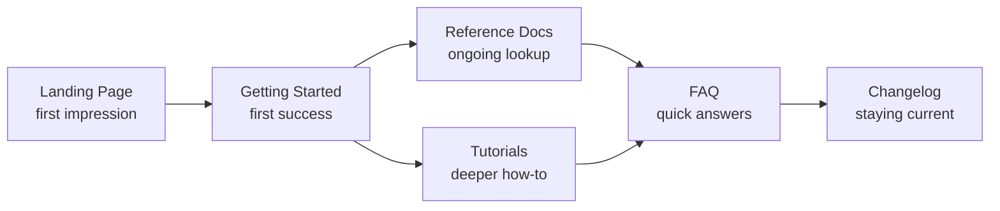
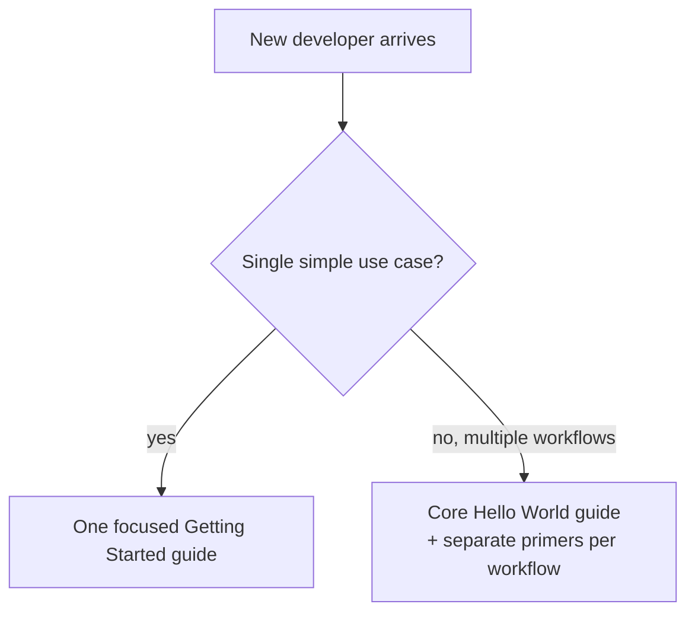
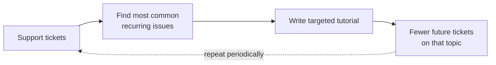
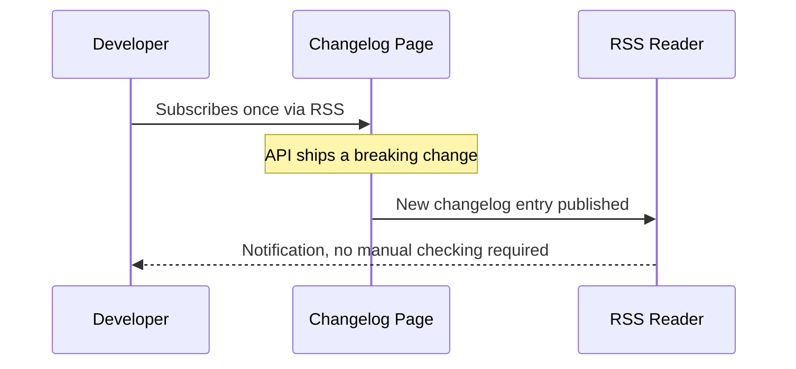
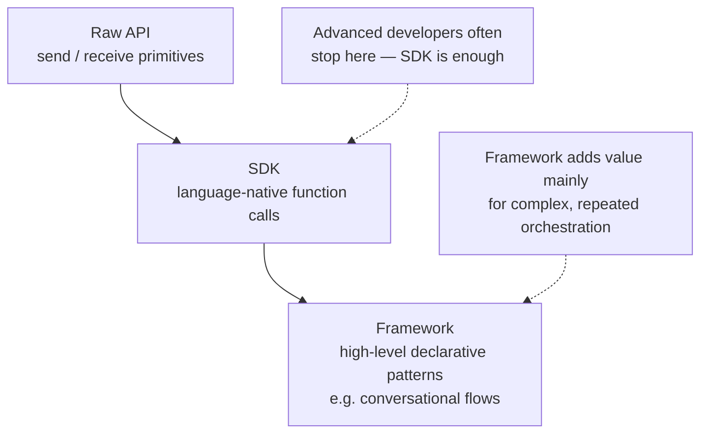
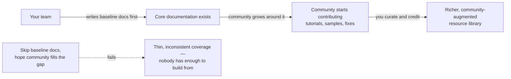
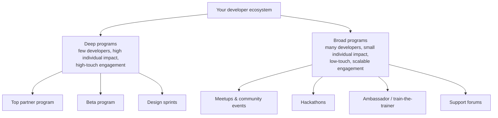
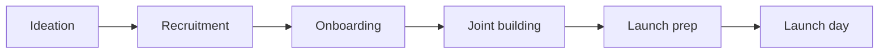
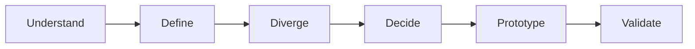
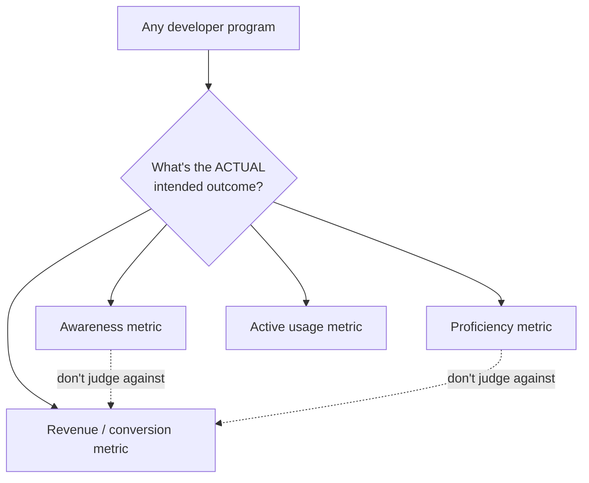

# Developer Resources and Developer Programs: Turning a Good API Into a Thriving Ecosystem

I've written before about designing APIs well and managing change without breaking people. This post is about the layer that sits on top of both of those things — the resources you build so developers can actually learn your API, and the ongoing programs you run so they stick around and succeed with it. I think this is the most underinvested part of API work, honestly. Teams will spend months getting the endpoint shapes right and then ship documentation that reads like it was written the night before launch, by someone who already knows everything the reader doesn't.

I'm going to walk through the full stack of developer resources — docs, samples, SDKs, tooling, rich media, community — and then the programs layer that keeps an ecosystem alive over time: partner programs, betas, hackathons, ambassador programs, and how you measure whether any of it is actually working. I tested a couple of small scripts along the way (a reference-doc generator and a credit-allocation simulator) because I wanted the code in this post to actually run, not just look plausible.

---

## Table of Contents

1. [Why Documentation Is Not One Document](#part-1)
2. [Getting Started Guides and Time to Hello World](#part-2)
3. [Reference Documentation](#part-3)
4. [Tutorials and FAQs](#part-4)
5. [The Landing Page and the Changelog](#part-5)
6. [Terms of Service](#part-6)
7. [Samples, Snippets, SDKs, and Frameworks](#part-7)
8. [Development Tools: Debugging, Sandboxes, API Testers](#part-8)
9. [Rich Media and Community Contribution](#part-9)
10. [Developer Programs: The Breadth/Depth Framework](#part-10)
11. [Deep Developer Programs](#part-11)
12. [Broad Developer Programs](#part-12)
13. [Measuring Developer Programs](#part-13)
14. [Closing Thoughts](#part-14)

---

<a id="part-1"></a>
## 1. Why Documentation Is Not One Document

The mistake I see most often is treating "documentation" as a single artifact — one big page, or one auto-generated reference site, and calling it done. In practice, good documentation is actually a *set* of distinct artifacts, each serving a different moment in a developer's relationship with your API:



Each of these has a different job, a different ideal length, and a different reader mindset. Conflating them is how you end up with a "getting started" page that's actually a 4,000-word reference doc, which fails at both jobs simultaneously — too long to onboard someone quickly, too shallow to be a real reference.

> **Note:** If I had to rank these by leverage, I'd put the Getting Started guide first. It's the thing standing between "a developer found your API" and "a developer actually tried it." Everything downstream depends on that first success happening quickly.

---

<a id="part-2"></a>
## 2. Getting Started Guides and Time to Hello World

I really like the framing of **Time to Hello World (TTHW)** as a metric, because it turns something fuzzy ("is onboarding good?") into something you can actually track and improve. The "Hello World" doesn't have to be literal — it might be the first successful API call, the first WebSocket event received, or the first webhook payload landing in an inbox. The point is: how long does it take a brand-new developer to get *one undeniable signal of success*?

### What separates a good Getting Started guide from a mediocre one

| Principle | What It Looks Like in Practice |
|---|---|
| Don't assume prior knowledge | Link every unfamiliar term out to a glossary or deeper doc instead of assuming the reader already knows it |
| Stay on the happy path | Assume success; link out to troubleshooting docs for failure cases rather than cluttering the main flow |
| Show real inputs and outputs | Actual command-line examples, actual response payloads — not placeholder pseudo-code |
| Cover every permutation | If there are multiple request/response shapes, show all of them, not just the simplest one |
| Show minimal working code | A short, runnable sample beats a long conceptual explanation |
| End with a clear next step | Never leave the reader at a dead end — link to what to read or build next |

> **Caution:** Don't try to cram every use case into a single Getting Started guide once your API covers more than one workflow. I've seen this backfire — a guide trying to be "the one guide for everything" ends up serving no single use case well. Split it: one focused "hello world" path, plus separate short primers for each major workflow ("Storing Your First File," "Setting Up Authentication," etc.).



---

<a id="part-3"></a>
## 3. Reference Documentation

Reference docs are a completely different animal from a Getting Started guide, and I think the biggest mental shift is: **reference documentation is not meant to be read top to bottom.** It's meant to be *landed on* from a search result, read in isolation, and then abandoned. That single fact should shape almost every decision you make about how to structure it.

### Practical implications of "developers land on one page, not the whole doc"

- **Repeat yourself on purpose.** If the same error appears on two endpoints, document it fully on both pages. A developer who lands directly on one page via Google search will never see the other page's explanation.
- **One page per method.** This maximizes discoverability (search engines index granular pages far better than one giant page) and gives you room to go deep on a single endpoint without bloating everything else.
- **Include real examples inline**, not just abstract parameter tables — the parameter table tells you the shape, the example tells you what it actually looks like in practice.

### A tiny simulation of auto-generated reference pages

A lot of teams generate reference docs straight from a machine-readable spec (OpenAPI/Swagger being the most common), which keeps the reference in sync with the actual API instead of drifting out of date by hand. I built a minimal version of that idea to make the mechanism concrete — take a small spec, generate one markdown page per endpoint automatically:

```python
SPEC = {
    "endpoints": [
        {
            "method": "GET",
            "path": "/images/{id}",
            "summary": "Fetch a single transformed image",
            "params": [
                {"name": "id", "type": "string", "required": True, "in": "path"},
                {"name": "width", "type": "integer", "required": False, "in": "query"},
            ],
            "errors": [
                {"code": "image_not_found", "status": 404},
                {"code": "invalid_dimensions", "status": 400},
            ],
        },
        {
            "method": "POST",
            "path": "/images",
            "summary": "Upload and transform a new image",
            "params": [
                {"name": "file", "type": "binary", "required": True, "in": "body"},
                {"name": "watermark", "type": "boolean", "required": False, "in": "body"},
            ],
            "errors": [
                {"code": "invalid_dimensions", "status": 400},
                {"code": "file_too_large", "status": 400},
            ],
        },
    ]
}

def render_page(endpoint: dict) -> str:
    lines = [f"# {endpoint['method']} {endpoint['path']}", "", endpoint["summary"], ""]
    lines.append("## Parameters")
    for p in endpoint["params"]:
        req = "required" if p["required"] else "optional"
        lines.append(f"- `{p['name']}` ({p['type']}, {req}, in {p['in']})")
    lines.append("")
    lines.append("## Errors")
    for e in endpoint["errors"]:
        lines.append(f"- `{e['code']}` — HTTP {e['status']}")
    return "\n".join(lines)
```

Running this against the two-endpoint spec above produces exactly the kind of self-contained, per-endpoint pages I described — including the deliberate duplication of the `invalid_dimensions` error, which shows up fully documented on *both* pages, not just linked from one to the other:

```
--- Generated page for /images/{id}:GET ---
# GET /images/{id}

Fetch a single transformed image

## Parameters
- `id` (string, required, in path)
- `width` (integer, optional, in query)

## Errors
- `image_not_found` — HTTP 404
- `invalid_dimensions` — HTTP 400

--- Generated page for /images:POST ---
# POST /images

Upload and transform a new image

## Parameters
- `file` (binary, required, in body)
- `watermark` (boolean, optional, in body)

## Errors
- `invalid_dimensions` — HTTP 400
- `file_too_large` — HTTP 400

Total pages generated: 2
```

That's a toy example, but the principle scales directly to real tooling: define your API's shape once, in one machine-readable place, and generate documentation (and ideally SDKs — more on that later) from that single source of truth instead of hand-maintaining prose that inevitably drifts from the real behavior.

---

<a id="part-4"></a>
## 4. Tutorials and FAQs

### Tutorials

I think of tutorials as the answer to a very specific kind of question: "how do I accomplish *this particular thing*?" — as opposed to reference docs, which answer "what does this particular endpoint do?"

A framing I keep coming back to: **"How to X with Y."** *"How to secure your webhook endpoint with HMAC signatures."* *"How to paginate through a large dataset with cursor-based pagination."* That title format forces you to be concrete about both the goal and the tool, which keeps the tutorial from sprawling into a general reference doc in disguise.

> **Note:** The best source of tutorial topics isn't guessing — it's your support queue. Whatever generates the most tickets is exactly what should get a dedicated tutorial next. I'd treat this as a recurring process, not a one-time audit, because the topics that confuse people shift as your API evolves.



> **Caution:** Tutorials rot silently. Unlike a broken endpoint, a stale tutorial doesn't throw an error — it just quietly misleads people until enough of them file support tickets for you to notice. Whenever you ship an API change, treat "which tutorials reference this?" as part of the change checklist, not an afterthought.

### FAQs

An FAQ page is deceptively simple in format — bolded question, plain-text answer — but the hard part isn't the formatting, it's sourcing genuinely common questions instead of ones you *assume* are common. A few sources I'd actually trust over gut feeling:

- A recurring sync with the support team about their most frequent tickets
- Searching your own product's tag on Stack Overflow for the highest-voted questions
- Talking to sales/partnerships about what prospective developers ask before they even sign up
- An open submission form on the FAQ page itself, inviting developers to suggest questions

---

<a id="part-5"></a>
## 5. The Landing Page and the Changelog

### The landing page is doing more work than it looks like

The developer landing page is the first thing a prospective integrator sees, and it has to answer, almost instantly: *is this the right tool for what I'm trying to build?* If the answer isn't obvious within a few seconds of skimming, they bounce — and they usually don't come back to look harder later.

A landing page that's actually pulling its weight typically has:

| Section | Purpose |
|---|---|
| Short value proposition | What is this API for, in one or two sentences |
| Clear call to action | "Get Started" linking straight to the onboarding guide |
| Links to key resources | Reference docs, samples, SDKs, community |

> **Note:** This page also serves *returning* developers, not just first-timers — don't design it purely as a marketing splash page. Returning developers use it as a hub to find the changelog, the SDK downloads, or the support forum, so it needs real navigational utility, not just persuasive copy.

> **Caution:** Search discoverability matters more for this page than almost any other page on your site, because "search engine result" is the most common way developers actually arrive. If your landing page and top reference pages aren't well-indexed, you're losing a huge fraction of potential adoption before anyone even sees your product.

### The changelog: your ongoing promise of transparency

Once your API has any real history of change, a changelog page becomes essential — not as a formality, but as the concrete evidence that you take backward compatibility and communication seriously (topics I went deep on in my last post). I like pairing the changelog with an RSS feed specifically, because it lets developers passively subscribe once instead of needing to remember to check back manually.



> **Note:** Different audiences genuinely prefer different channels — some developers live in RSS readers, some only check email, some only see things you post to Twitter/X. A changelog page is necessary but not sufficient; pair it with whatever channel your specific audience actually monitors (I covered audience segmentation for exactly this reason in my previous post).

---

<a id="part-6"></a>
## 6. Terms of Service

I almost skipped this section when planning this post, and then reminded myself that a Terms of Service (ToS) document is genuinely one of the most load-bearing pieces of developer-facing content you'll write, even though almost nobody enjoys writing it. It's the baseline that makes enforcement possible — if a developer misuses your API and you haven't defined "misuse" anywhere, you have very little standing to act.

A well-scoped ToS should cover, at minimum:

| Topic | Question It Answers |
|---|---|
| Rate limits | How much traffic is a developer allowed to send? |
| Data retention | How long can data pulled from the API be kept, and for what purposes? |
| Privacy | What can be done with any personally identifiable information (PII) returned by the API? |
| Non-allowed use cases | Are there prohibited categories (adult content, gambling, etc.)? |
| API license | Can the API be resold, or embedded inside another paid API? |
| Additional requirements | Are developers required to post privacy disclosures in their own apps? |

> **Caution:** Have this reviewed (ideally drafted) by actual legal counsel — this is the one section in this whole post where "I did my best" engineering intuition genuinely isn't a substitute for the right expertise. Getting this wrong isn't a documentation bug, it's a liability.

> **Note:** A ToS is not something you write once and forget. Explicitly reserve the right to update it as your ecosystem evolves, and — just as importantly — keep it short enough that developers might actually read it. A ten-page legal wall of text that nobody reads doesn't actually set expectations; it just creates the appearance of having set them.

---

<a id="part-7"></a>
## 7. Samples, Snippets, SDKs, and Frameworks

### Code samples vs. snippets — these are not the same thing, and conflating them causes real problems

| | Code Samples | Snippets |
|---|---|---|
| Length | Full, runnable programs | Single-digit lines of code |
| Self-contained? | Yes — includes imports, setup, everything needed to run | No — meant to be read as a fragment pulled from a larger context |
| Where it lives | Its own repo or dedicated samples page | Inline inside a tutorial, reference doc, or FAQ answer |
| Goal | Demonstrate a full realistic use case end to end | Illustrate one specific call or pattern quickly |

> **Note:** A "reference app" is a special, harder case of a code sample — a full example that solves a real business use case, not just an isolated API call. The tension I've run into building these: the more polished and use-case-specific a reference app gets, the harder it becomes for a developer to extract the general pattern they actually need for *their* different use case. If you build one, resist over-optimizing it for its own demo scenario — a little rough-around-the-edges is fine if it keeps the underlying pattern legible.

I'd also flag a practical language-switcher pattern for snippets specifically — showing the same short snippet in multiple languages, letting the developer pick their own, rather than forcing everyone through a single language's example. It sounds like a minor UX nicety, but for developers scanning quickly, it removes an entire layer of "let me mentally translate this from language X to my language Y" friction.

> **Caution:** Samples and snippets are exactly as prone to silent rot as tutorials — maybe worse, because a code sample that no longer compiles against your current API is actively worse than no sample at all. It actively costs a developer time debugging *your* stale example rather than their own code. Whenever your API changes in a way that touches a documented sample, updating that sample needs to be part of the change, not a follow-up ticket someone might get to eventually.

### SDKs: thin wrappers that carry real responsibility

An SDK is essentially a code library that wraps your raw HTTP API so developers can call functions instead of assembling requests by hand. I covered the technical scaling-related SDK concerns (rate-limit awareness, pagination helpers, retry/backoff) in an earlier post, so I won't repeat that here — but a few points specific to the *resource* side of SDKs:

- **The public interface needs to be clean and well-documented; the internals don't.** Feel free to optimize, minify, or otherwise make the guts of an SDK ugly — developers never see that layer, and it's not part of your documentation contract.
- **Only build SDKs in languages your actual developers use.** Unlike a code sample (which is at least readable cross-language as a reference), an SDK in a language nobody in your audience uses is genuinely dead weight.
- **SDKs must ship in lockstep with API changes.** If the underlying API gets a new capability and the SDK doesn't expose it, every developer relying on that SDK is functionally locked out of the new feature, even though the raw API supports it.

> **Note:** I've found it genuinely useful to track SDK usage separately from raw API usage. Maintaining multiple language SDKs is expensive, ongoing work — the data on which ones are actually being used (versus which ones were built speculatively and never adopted) is what tells you where to keep investing.

### Frameworks go one layer deeper than SDKs

A framework doesn't just wrap the API — it wraps a *use case* on top of the API. A good mental example: imagine a base chat API that only exposes "send message" and "receive message" primitives. That's genuinely enough for an experienced developer to build a bot from scratch. But building a conversational flow — asking a user a question, waiting for their specific reply, branching logic off it — on top of raw send/receive primitives is real, repeated, non-trivial work. A framework built specifically for that conversational pattern collapses all of it into something declarative:

```javascript
controller.hears(
  ['hello', 'hi', 'greetings'],
  ['direct_mention', 'mention', 'direct_message'],
  function(bot, message) {
    bot.reply(message, 'Hello!');
  }
);
```

The developer states *what* they want to happen (hearing certain phrases, via certain channels, triggering a certain reply) and the framework owns *how* that actually gets wired up under the hood.

> **Caution:** Not every API needs a framework, and building one you don't need is pure ongoing maintenance cost with no corresponding benefit. If your API is already simple and intuitive to use directly, a framework can add a layer of opinionated complexity that experienced developers actively resent having to learn *on top of* the API itself. Reserve frameworks for genuinely repeated, non-trivial orchestration patterns — not as a default add-on for every API you ship.



---

<a id="part-8"></a>
## 8. Development Tools: Debugging, Sandboxes, API Testers

Even with excellent error messages (which I covered in detail in my first post in this series), developers still need tooling to *see* what's actually happening with their requests — not just be told after the fact that something failed.

| Tool Type | What It Solves |
|---|---|
| Request/response logs page | Lets a developer see exactly what they sent and what came back, without needing to add their own logging |
| Sandbox environment | A safe, isolated space to test destructive operations (delete, overwrite) without touching real data |
| API tester / interactive explorer | Lets a developer try a real call directly from the browser, often without writing any code at all |

> **Note:** The simplest option — a page showing recent request logs tied to a developer's account — solves the overwhelming majority of "why isn't this working" support tickets before they're even filed. I'd build this before investing in a fancier step-by-step debugger; it has a much better cost-to-impact ratio.

An interactive API explorer deserves special mention because it removes an entire class of onboarding friction: a developer doesn't need to write a single line of code, set up auth in their own environment, or install anything — they just fill in parameters in a form and see a real response. That's an extremely low-friction way to validate "does this API actually do what I think it does?" before someone commits real development time to integrating with it.

---

<a id="part-9"></a>
## 9. Rich Media and Community Contribution

### Not everyone learns the same way

Written docs are the default, but plenty of developers absorb technical content faster through video, live sessions, or webinars. I don't think this means every team needs a full video production pipeline — it means being honest about the return on investment before committing resources.

| Format | Investment | Best For |
|---|---|---|
| Recorded live session (conference talk, meetup) | Low — just record what you're already doing | Reaching people who couldn't attend live |
| Polished tutorial video | Medium-to-high — scripting, editing, multiple takes | Evergreen "how it works" content |
| Live office hours | Low ongoing cost, but requires a recurring time commitment | Direct Q&A, community cross-learning |
| Webinar / online training | Medium — requires prep, but scales to many attendees per session | Structured, hands-on group learning |

> **Note:** Short videos dramatically outperform long ones. Viewership tends to drop sharply past roughly the two-minute mark, which is a real constraint on how much you can cram into a single video — better to split a complex topic into several short videos than one long one nobody finishes.

> **Caution:** Recording sessions live at events can meaningfully outperform your entire in-person audience for that tour, in terms of total lifetime views — but only if you actually commit to recording and publishing consistently. A handful of ad hoc, inconsistently-produced recordings tends to underperform a smaller number of deliberately-produced ones. Decide up front whether you're doing this seriously or not at all.

### Community contribution: the resource you don't have to build alone

A healthy community eventually starts generating some of these resources *for* you — tutorials, code samples, bug fixes, even videos. That's genuinely valuable, but I want to flag a trap I've seen teams fall into: treating community contribution as a *substitute* for your own baseline docs rather than an addition on top of them.



> **Note:** Always credit contributors explicitly. It costs you nothing and it's the single biggest lever for getting *more* community contribution — visible recognition is what turns one person's one-off contribution into an ongoing habit, and into other people deciding to contribute too.

> **Caution:** Community-contributed content has the same staleness problem as your own docs, except now you don't directly control the fix. When your API changes in a way that breaks a community tutorial or sample, work with the original contributor to update it, or clearly label which API version it's valid for — an unlabeled, silently-outdated community tutorial actively damages trust in your whole resource library, not just that one page.

---

<a id="part-10"></a>
## 10. Developer Programs: The Breadth/Depth Framework

Once the resource layer exists, the next question is: how do you actively drive adoption, rather than just waiting for developers to discover what you've built? This is where developer *programs* come in, and I've found it genuinely clarifying to sort them along two axes.



| | Deep Programs | Broad Programs |
|---|---|---|
| Audience size | Small — a handful of top partners | Large — hundreds to thousands |
| Individual impact per developer | High — a single top partner can move real business metrics | Low individually, high in aggregate |
| Engagement style | One-to-few, "white glove" | One-to-many, scalable |
| Resource cost per developer reached | High | Low |

Neither category is inherently more important — they solve genuinely different problems, and most mature ecosystems run both simultaneously.

---

<a id="part-11"></a>
## 11. Deep Developer Programs

### Top partner program

This starts with an honest use-case analysis: for each major thing your API enables, who are the biggest potential users? I like mapping this out explicitly rather than relying on whoever happens to reach out first:

| Use Case | Example Top-Target Partners |
|---|---|
| Thumbnailing and resizing | Large e-commerce marketplaces, major news sites |
| Watermarking | Stock photo agencies, licensing platforms |
| Mobile optimization | High-traffic photo/video-sharing apps |

You can run the same exercise by industry instead of use case if that maps more cleanly onto your business:

| Industry | Example Top-Target Companies |
|---|---|
| Automotive imagery | Major car manufacturers |
| Advertising | Large agency holding groups |
| Social networks | Major consumer social platforms |

> **Note:** These engagements are genuinely "white glove" — one partner engineer working closely with a small number of accounts, tailoring support to each one's specific architecture and needs. That's expensive per-developer, which is exactly why it's reserved for the partners whose success moves your business metrics meaningfully.

### Beta programs — a concrete six-stage flow

A structured beta program I've seen work well, roughly:

1. **Ideation** — cross-functional group (engineering, product, marketing, dev rel, business development) identifies target partners and use cases, months ahead of release.
2. **Recruitment** — partner engineering + business development pitch the opportunity and get committed participants.
3. **Onboarding** — partners receive a draft spec and documentation; their early feedback shapes the final spec before general release.
4. **Joint building** — weekly working sessions, resolving bugs and design feedback together.
5. **Launch prep** — coordinated marketing materials, quotes, blog posts.
6. **Launch day** — synchronized public launch with the partners' own announcements.



> **Caution:** For any given beta partner, your project might genuinely be a low priority on *their* roadmap, no matter how excited they seemed during recruitment — this leads to real delays or silent dropout. I'd treat this as a structural risk to plan around rather than a personal letdown: recruit more partners than you strictly need, stay hands-on and set explicit shared expectations, and never structure a launch such that a single partner's participation is a single point of failure.

### Design sprints

I genuinely enjoy running these, and I think they're underused outside of internal product teams — they work just as well as a *partner*-facing tool. The condensed version:



- **Understand** — pool context from both sides: your API's capabilities, the partner's technology, shared business goals, and real end-user pain points.
- **Define** — pin down the *problem*, explicitly resisting the urge to jump to a solution yet.
- **Diverge** — everyone independently sketches several possible solutions (I've seen six-to-eight per person work well), captured tersely (sticky notes work great for this — one idea per note).
- **Decide** — narrow to one direction via group vote or a structured risk/benefit comparison.
- **Prototype** — build just enough (mockup or working prototype) for a real user to react to.
- **Validate** — get actual end users and internal stakeholders to try it and give feedback.

> **Note:** One underrated benefit of running a design sprint: it compresses what would otherwise be many separate partner meetings, spread over weeks, into a single focused session where the whole group is aligned in the room at once.

---

<a id="part-12"></a>
## 12. Broad Developer Programs

Broad programs trade individual depth for scale — the goal is reaching as many developers as possible without needing a dedicated human relationship with each one.

### Meetups and community events

The core value proposition here is that a healthy community becomes largely *self-sustaining* — you're not personally running every event, you're enabling volunteer community leaders with content, branding assets, and light ongoing support. A small central team can realistically support hundreds of independently-run local meetups this way.

> **Note:** Not every API needs its own dedicated community from scratch. If an existing community already serves an adjacent audience, contributing content *into* that existing space can be far more efficient than trying to bootstrap a brand-new one from zero.

### Hackathons

These contribute primarily to *awareness* and *proficiency* in the funnel sense — they're not, on their own, a reliable lever for converting people directly into paying customers, and I think it's important to set that expectation honestly before running one.

> **Caution:** Unstructured hackathons fail more often than structured ones. If participants show up without a clear topic, time frame, and desired outcome, a huge fraction of the available time gets burned on coordination rather than building. Be explicit about structure up front, and provide simple connective tooling (something as basic as a shared idea-tracking spreadsheet genuinely helps).

### Speaking at events and sponsorships

Speaking reaches people directly in the room, but the real multiplier is recording — a talk given once can be watched thousands of times afterward, often outperforming the live audience it was originally delivered to.

> **Caution:** Event sponsorships bundled with speaking slots can be genuinely expensive. Before committing, verify you're actually reaching the right audience composition (developers, specifically, not just generally business-adjacent attendees) and the right volume, relative to cost — plenty of community-run events will host a relevant talk for free.

### Ambassador / train-the-trainer programs

The core mechanic here: identify a small number of genuinely proficient, engaged community members, build a real relationship with them, and equip them to teach and represent your platform within the broader community — multiplying your reach well beyond what your own team could do directly.

> **Note:** This kind of program can start extremely lean — a handful of relationships, some shared branded materials, and a recurring informal check-in — long before it becomes a large formal initiative. The credibility comes from consistency and genuine reciprocity, not program size.

### Support channels

| Channel | Trade-off |
|---|---|
| Company-run email/ticket support | High quality control, but doesn't scale without headcount |
| Dedicated support forum | Scales via community answers, needs active moderation |
| Stack Overflow presence | Reaches developers where they already are searching; requires proactively monitoring and answering your own tag |

### Credit programs

If your API costs money, offering usage credits to promising developers (via startup incubators, application size, or similar criteria) can meaningfully accelerate adoption among people likely to convert into paying customers later — but budget is finite, and allocation needs a real policy, not ad hoc judgment calls.

I built a small simulation of a tiered credit-allocation policy to make the trade-off concrete — prioritizing applicants by estimated future usage, within a hard total budget:

```python
APPLICANTS = [
    {"name": "startup_a", "tier": "seed_incubator", "monthly_est_usage_usd": 40},
    {"name": "startup_b", "tier": "growth", "monthly_est_usage_usd": 300},
    {"name": "hobbyist_c", "tier": "hobbyist", "monthly_est_usage_usd": 5},
    {"name": "startup_d", "tier": "growth", "monthly_est_usage_usd": 900},
]

TIER_CREDIT = {
    "hobbyist": 25,
    "seed_incubator": 100,
    "growth": 500,
}

def allocate_credits(applicants, tier_table, total_budget):
    allocations = []
    remaining = total_budget
    ranked = sorted(applicants, key=lambda a: a["monthly_est_usage_usd"], reverse=True)
    for app in ranked:
        grant = tier_table.get(app["tier"], 0)
        if grant <= remaining:
            allocations.append({**app, "credit_granted": grant})
            remaining -= grant
        else:
            allocations.append({**app, "credit_granted": 0, "note": "budget exhausted"})
    return allocations, remaining
```

Running this with a $600 total budget produces exactly the trade-off you'd want visible:

```
startup_d   (growth, $900 est. usage) -> granted $500
startup_b   (growth, $300 est. usage) -> granted $0, budget exhausted
startup_a   (seed_incubator, $40 est. usage) -> granted $100
hobbyist_c  (hobbyist, $5 est. usage) -> granted $0, budget exhausted
Remaining budget: $0
```

`startup_d`, the highest-estimated-usage applicant, gets funded first and consumes most of the budget — leaving `startup_b`, a genuinely promising growth-tier applicant, unfunded purely because it was ranked second. That's exactly the kind of trade-off a real credit program has to make explicit and defensible, rather than leaving to whoever happens to ask first.

> **Caution:** Credits are real money leaving your budget, and they're abusable — the same way a rate limit needs a real policy (see my earlier post on this), a credit program needs criteria for who qualifies and ongoing tracking of whether recipients actually convert into paying usage. Handing out credits without measuring downstream conversion tells you nothing about whether the program is working.

---

<a id="part-13"></a>
## 13. Measuring Developer Programs

This is the section I think gets skipped most often, and it's the one that actually determines whether any of the above is worth continuing to fund. For every program, I want to know three things going in:

1. What does this program actually do?
2. What inputs (time, budget, headcount) does it require?
3. What outcome should it produce, and did it actually produce that?

| Program | Description | Inputs | Outcome |
|---|---|---|---|
| Top partner program | Map and actively drive top partners to build on the API | Map 15 partners, actively work with 10 this quarter | 5 top partners actively using the API by quarter end |
| Beta program | Get partner feedback and co-launch new features | Work with 7 beta partners on feature X | 10 feature requests + 10 bugs captured; feature launches with 5 partners live from day one |
| Hackathons | Drive awareness and proficiency | Run 5 hackathons this quarter | 1,000 developers create an API token during the events |
| Speaking at events | Drive awareness | Speak at 7 major developer events | 15,000 developers reached (live + recordings); 5,000 new site visitors |

> **Caution:** It's genuinely easy to judge a program against the wrong outcome. I've heard people dismiss hackathons as "useless" because they didn't produce paying customers directly — but paying customers was never the honest expected outcome of a hackathon; awareness and proficiency were. Judging a program against a goal it was never actually designed to hit tells you nothing real about whether it's working — it just tells you the measurement was mismatched to the program from the start.



---

<a id="part-14"></a>
## 14. Closing Thoughts

If I compress this whole post down to what I'd want to remember:

1. **Documentation isn't one artifact.** A landing page, a Getting Started guide, reference docs, tutorials, an FAQ, and a changelog each serve a distinct moment in a developer's journey — conflating them weakens all of them at once.
2. **Reference docs are landed on, not read start-to-finish.** Repeat information across pages deliberately; don't assume anyone reads the whole thing in order.
3. **Samples, snippets, and SDKs rot silently** the moment your API changes underneath them. Treat updating them as part of the change itself, not a follow-up task.
4. **Frameworks earn their complexity only for genuinely repeated, non-trivial orchestration** — don't build one just because SDKs feel incomplete without one.
5. **Deep and broad developer programs solve different problems.** A handful of white-glove partner relationships and a scalable hackathon/community program aren't competing strategies — most healthy ecosystems run both.
6. **Every program needs an honest, explicit expected outcome before you run it** — otherwise you'll either kill something that's quietly working, or keep funding something that never had a chance of hitting the metric you're judging it against.

The pattern that ties this whole post together, and honestly the whole series, is the same one: developers extend real trust to your API when they invest time learning it and building on it. Documentation that respects their time, samples that actually still work, and programs that are honest about what they're for and aren't — that's how you keep earning that trust instead of slowly spending it down.

Thanks for reading — if you want me to go deeper on any single piece here (running an actual design sprint end to end, or the mechanics of an ambassador program), let me know and I'll take a full post at it.
