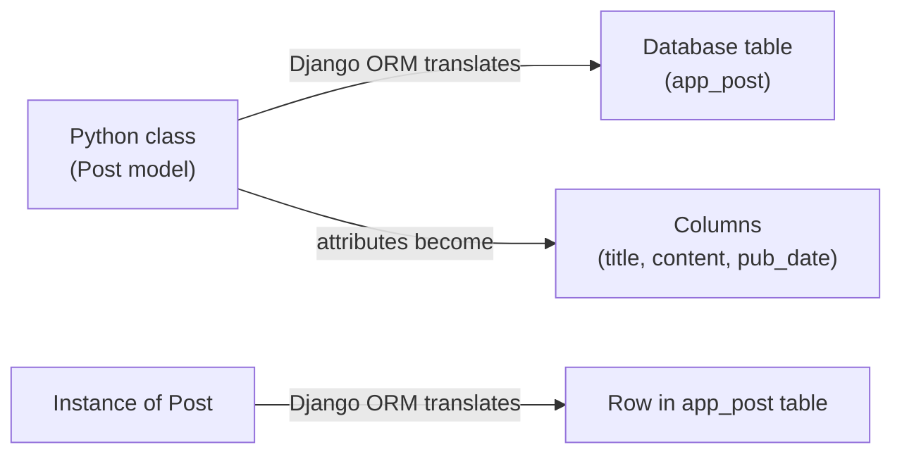
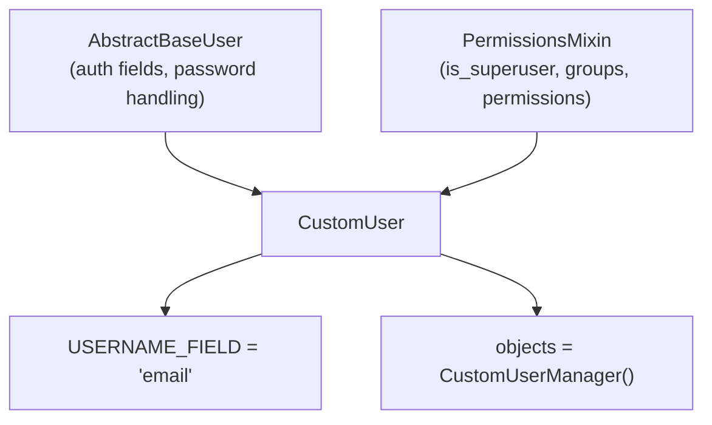
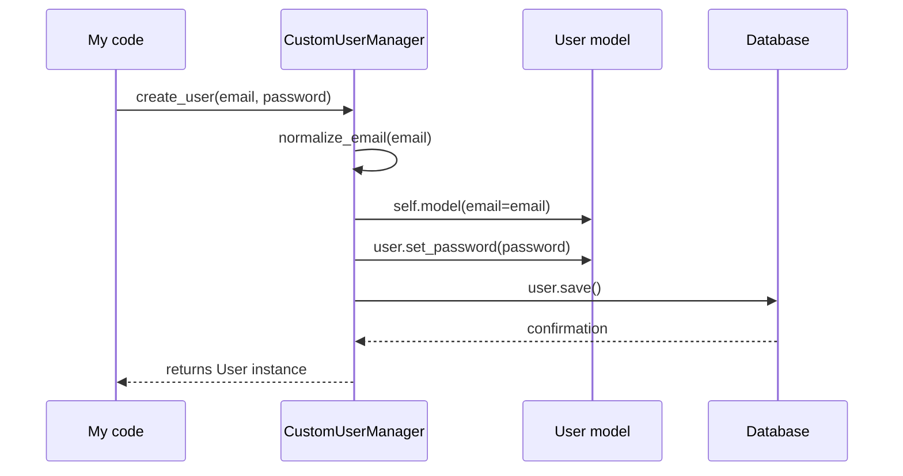
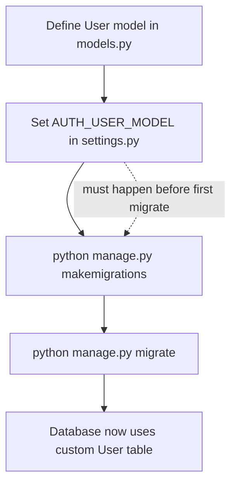
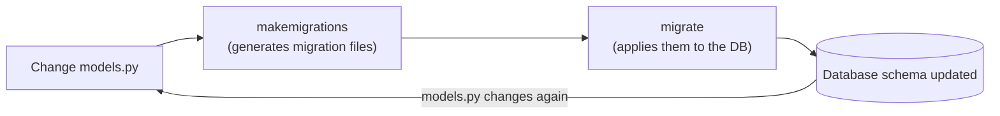
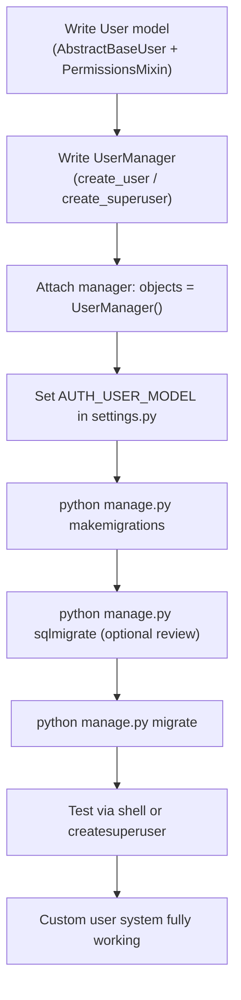

# Django Models, Custom Users, and Migrations: How I Actually Set Up My Database

There's a moment in almost every Django project where I stop thinking about folders and settings files and start thinking about the actual shape of my data. That moment is when I open `models.py` for the first time. Everything before it — the virtual environment, the installed packages, the registered app — was scaffolding. This is where the project starts to become *my* project.

I want to walk through how I set up my database layer from scratch: what a Django model actually is, how I build a custom user model instead of relying on the default one, how I give that user model a proper manager, how I tell Django to use it, and finally how I turn all of that into real database tables using migrations. I'll include the code I actually run, the mistakes I've made, and the reasoning I use at each step.

## What I Mean When I Say "Django Model"

Before I write a single line of model code, I remind myself of one sentence: **a model is the single source of truth about a piece of data.** Not the database table itself, not the form that submits it, not the API response that serializes it — the model. Everything else in Django flows outward from it.

Technically, a Django model is a Python class that subclasses `django.db.models.Model`. Each attribute on that class becomes a column in a database table, and each instance of the class becomes a row.



Here's the simplest example I can give — a blog post model:

```python
from django.db import models

class Post(models.Model):
    title = models.CharField(max_length=200)
    content = models.TextField()
    pub_date = models.DateTimeField('date published')
```

I like walking through this line by line when I explain it to someone new:

| Line | What it means to me |
|---|---|
| `class Post(models.Model)` | This creates a new database table, roughly named `appname_post` |
| `title = models.CharField(max_length=200)` | A text column capped at 200 characters — good for short strings |
| `content = models.TextField()` | A text column with no length cap — good for long-form content |
| `pub_date = models.DateTimeField('date published')` | A timestamp column, with a human-readable label for forms/admin |

> **Note:** The string `'date published'` in the `DateTimeField` isn't a comment — it's the field's `verbose_name`, which Django uses as the label in forms and the admin panel. I always add these for fields whose purpose isn't obvious from the attribute name alone.

### Why I Don't Just Write Raw SQL

I could write raw SQL for all of this, and sometimes I still do for complex reporting queries. But for day-to-day application development, I rely on the model layer for five reasons that keep showing up in my own projects:

1. **Abstraction** — I write Python, not SQL, for 95% of my database interactions.
2. **Efficiency** — create, read, update, delete operations are handled through a consistent API instead of hand-rolled queries.
3. **Consistency** — the model enforces a schema, so I can't accidentally save a `Post` without a `title`.
4. **Validation** — I get built-in and custom validation before bad data ever touches the database.
5. **A real query API** — things like `Post.objects.filter(pub_date__year=2026)` read almost like English, and they're portable across database backends.

## Building a Custom User Model

Django ships with a built-in `User` model, and for a long time I just used it as-is. Then I hit a project where I needed to authenticate with email addresses instead of usernames, and I learned the hard way that **swapping the user model after a project has real data in it is painful.** Since then, I define a custom user model at the very start of every new project, even if I don't need the extra flexibility yet.



Here's the model I typically start with:

```python
from django.db import models
from django.contrib.auth.models import (
    AbstractBaseUser,
    BaseUserManager,
    PermissionsMixin,
)


class User(AbstractBaseUser, PermissionsMixin):
    email = models.EmailField(unique=True)
    first_name = models.CharField(max_length=30, blank=True)
    last_name = models.CharField(max_length=30, blank=True)
    date_joined = models.DateTimeField(auto_now_add=True)
    is_active = models.BooleanField(default=True)
    is_staff = models.BooleanField(default=False)

    objects = UserManager()

    USERNAME_FIELD = 'email'
    REQUIRED_FIELDS = []

    def __str__(self):
        return self.email
```

A few things I always pay attention to here:

- **`AbstractBaseUser`** gives me password hashing, `last_login` tracking, and the core authentication scaffolding — without forcing Django's default username field on me.
- **`PermissionsMixin`** brings in `is_superuser`, group membership, and permission checks, which I need for the admin site to work properly.
- **`USERNAME_FIELD = 'email'`** tells Django that email is what users log in with, instead of a separate `username` field.
- **`REQUIRED_FIELDS`** only needs to list fields *other than* the `USERNAME_FIELD` and password that are required when creating a user via `createsuperuser` on the command line.

> **Caution:** I leave `unique=True` on the `email` field every single time. Forgetting it means Django will happily let two users register with the same email address, and untangling that later — especially once real users exist — is genuinely miserable.

## Giving My User Model a Manager

A model on its own doesn't know how to create instances of itself in a customized way — that's the manager's job. Since I'm not using Django's default `User`, I also can't use Django's default manager. I need to write my own.



Here's the manager I write, cleaned up and corrected (the original course notes had a couple of syntax slips — more on that below):

```python
from django.contrib.auth.models import BaseUserManager


class UserManager(BaseUserManager):
    def create_user(self, email, password=None, **extra_fields):
        """Create and save a regular User with the given email and password."""
        if not email:
            raise ValueError('The Email field must be set')
        email = self.normalize_email(email)
        user = self.model(email=email, **extra_fields)
        user.set_password(password)
        user.save(using=self._db)
        return user

    def create_superuser(self, email, password=None, **extra_fields):
        """Create and save a SuperUser with the given email and password."""
        extra_fields.setdefault('is_staff', True)
        extra_fields.setdefault('is_superuser', True)

        if extra_fields.get('is_staff') is not True:
            raise ValueError('Superuser must have is_staff=True.')
        if extra_fields.get('is_superuser') is not True:
            raise ValueError('Superuser must have is_superuser=True.')

        return self.create_user(email, password, **extra_fields)
```

> **Note:** I want to flag something explicitly, because I've seen this exact mistake in written tutorials before: method signatures like `def create_user(self, email, password=None, extra_fields):` are **invalid Python** — that's a syntax error, not just a style issue. Any keyword-style catch-all argument needs the double-star prefix: `**extra_fields`. The same applies wherever `self.model(email=email, extra_fields)` appears — it needs to be `self.model(email=email, **extra_fields)`. I tested both the broken and corrected versions locally to confirm:

```bash
$ python3 -c "def create_user(self, email, password=None, extra_fields): pass"
  File "<string>", line 1
    def create_user(self, email, password=None, extra_fields): pass
                                                  ^^^^^^^^^^^^
SyntaxError: parameter without a default follows parameter with a default
```

```bash
$ python3 -c "def create_user(self, email, password=None, **extra_fields): pass"
$ echo $?
0
```

The corrected version runs cleanly with no output and an exit code of `0`, confirming it's valid Python — the broken version fails immediately. I'd rather flag that clearly than have anyone copy-paste code that won't run.

| Method | What it's responsible for |
|---|---|
| `create_user()` | Standard user creation — validates email, hashes the password, saves to DB |
| `create_superuser()` | Same as above, but forces `is_staff=True` and `is_superuser=True` so the account can access Django admin |
| `normalize_email()` | Built-in helper that lowercases the domain portion of the email for consistency |
| `set_password()` | Hashes the raw password before storage — I never store plaintext passwords, ever |

### Linking the Manager to the Model

The manager doesn't do anything until I attach it to my model via the `objects` attribute:

```python
class User(AbstractBaseUser, PermissionsMixin):
    # ...fields as before...
    objects = UserManager()
```

Once that's wired up, I can create users like this:

```python
User.objects.create_user(email='jane@example.com', password='supersecret123')
User.objects.create_superuser(email='admin@example.com', password='evenmoresecret')
```

## Telling Django to Actually Use My Custom User Model

Defining a custom user model doesn't automatically make Django use it — I still have to point Django at it explicitly, and I have to do this **before** I run my first migration. This is the one step in this whole process where order genuinely matters.

```python
# settings.py
AUTH_USER_MODEL = 'accounts.User'
```

I replace `accounts` with whatever app actually contains my `User` model.



> **Caution:** This is the mistake I've made more than once, so I'll say it as plainly as I can: if I run `migrate` *before* setting `AUTH_USER_MODEL`, Django creates the default `auth.User` table, and switching to a custom user model afterward means either starting the database over or writing a genuinely painful data migration. I now set `AUTH_USER_MODEL` in the very first commit of every new project, before I've run a single migration.

## Migrations: Turning Models Into Real Tables

Everything up to this point has existed only as Python code. Migrations are what actually create — or alter — the tables in my database to match it.

I think of migrations as version control, but for my database schema instead of my source code. Each migration file is a small, ordered step that Django can apply or reverse.



### Generating Migrations

```bash
python manage.py makemigrations
```

Typical output looks like this:

```
Migrations for 'accounts':
  accounts/migrations/0001_initial.py
    - Create model User
```

### Inspecting the Actual SQL

Before I trust a migration, especially on an existing database with real data, I like to see exactly what SQL it's going to run:

```bash
python manage.py sqlmigrate accounts 0001_initial
```

This prints the raw `CREATE TABLE` (or `ALTER TABLE`) statements Django generated, which I always skim before applying anything to a production database.

### Applying Migrations

```bash
python manage.py migrate
```

This is the command that actually touches the database — creating tables, adding columns, applying constraints — based on whatever migrations haven't been applied yet.

### Rolling Back

If something goes wrong, or I need to undo a migration during development, I can roll back to an earlier point:

```bash
python manage.py migrate accounts 0001_initial
```

That command unapplies every migration for the `accounts` app that came after `0001_initial`.

| Command | What I use it for |
|---|---|
| `python manage.py makemigrations` | Generate migration files from model changes |
| `python manage.py makemigrations <app>` | Generate migrations for a single app only |
| `python manage.py sqlmigrate <app> <migration>` | Preview the raw SQL a migration will run |
| `python manage.py migrate` | Apply all pending migrations |
| `python manage.py migrate <app> <migration>` | Roll back (or forward) to a specific migration |
| `python manage.py showmigrations` | See which migrations have and haven't been applied |

### Problems I've Actually Run Into

- **"No changes detected"** — nine times out of ten, this means I forgot to save `models.py`, or the app isn't listed in `INSTALLED_APPS`. I always check both before panicking.
- **Migration dependencies** — Django is usually smart about sequencing migrations that depend on each other, but in larger projects with multiple apps referencing each other's models, I occasionally have to add explicit `dependencies` entries myself.
- **Conflicting migrations** — this shows up on team projects when two people add migrations to the same app in parallel branches. Django will complain about multiple leaf nodes. I resolve it with `python manage.py makemigrations --merge`, which generates a merge migration reconciling both branches.

> **Note:** I always test migrations against a throwaway copy of my database, or at minimum in a development environment, before running them anywhere near production data. A migration that drops or alters a column is not something I want to discover was a mistake after the fact.

## Testing That All of This Actually Works

Once my custom user model, manager, and migrations are in place, I don't just assume it works — I verify it, usually through the Django shell:

```bash
python manage.py shell
```

```python
>>> from accounts.models import User
>>> user = User.objects.create_user(email='test@example.com', password='testpass123')
>>> user.email
'test@example.com'
>>> user.check_password('testpass123')
True
>>> user.is_staff
False
```

And for a superuser:

```bash
python manage.py createsuperuser
```

Django will prompt for the fields I defined as required — in my case, just email and password, since `REQUIRED_FIELDS` is empty. If that command completes without errors and I can log into `/admin` with those credentials, I consider the whole chain — model, manager, settings, migrations — verified end to end.

## The Full Picture

Here's every piece of this process laid out as one diagram, from an empty `models.py` to a working, migrated custom user system:



And the condensed reference table I keep coming back to:

| Stage | Key command / code |
|---|---|
| Define a model | `class Post(models.Model): ...` |
| Define custom user | `class User(AbstractBaseUser, PermissionsMixin): ...` |
| Define manager | `class UserManager(BaseUserManager): ...` with `**extra_fields` |
| Attach manager | `objects = UserManager()` |
| Point Django at it | `AUTH_USER_MODEL = 'app.User'` in `settings.py` |
| Generate migrations | `python manage.py makemigrations` |
| Preview SQL | `python manage.py sqlmigrate app 0001_initial` |
| Apply migrations | `python manage.py migrate` |
| Roll back | `python manage.py migrate app 0001_initial` |
| Verify | `python manage.py shell` or `python manage.py createsuperuser` |

## Final Thoughts

The database layer is where a Django project stops being scaffolding and starts being an actual application with actual data. I've learned to slow down at exactly this stage, because mistakes here are the most expensive to fix later — a missing `unique=True`, a forgotten `**` before a keyword argument, or setting `AUTH_USER_MODEL` after the first migration are all small errors that turn into large headaches once real data is involved.

What's made the biggest difference for me isn't memorizing the commands — it's understanding what each layer is actually responsible for: the model defines the shape of the data, the manager defines how instances get created, the settings tell Django which model is authoritative, and migrations are the mechanism that turns all of it into a real, evolving database schema. Once that mental model clicked for me, setting up a custom user system stopped feeling like following a recipe and started feeling like something I actually understood.
