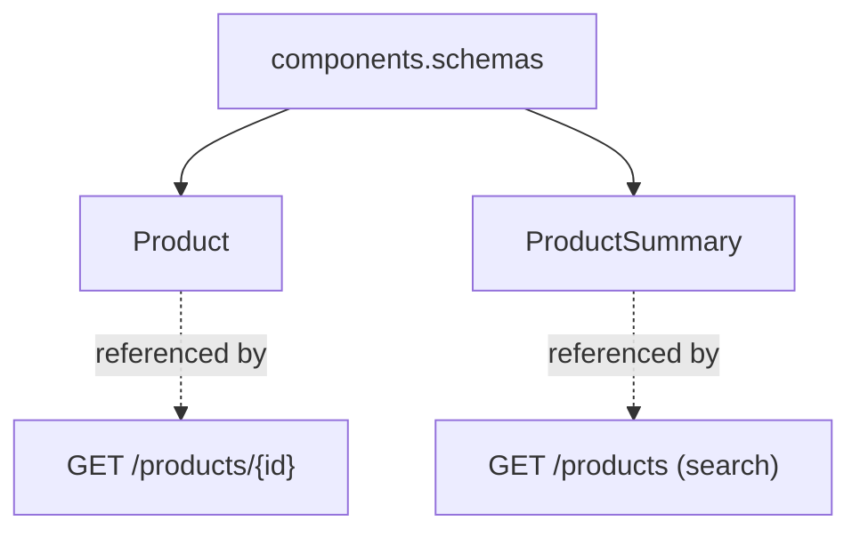
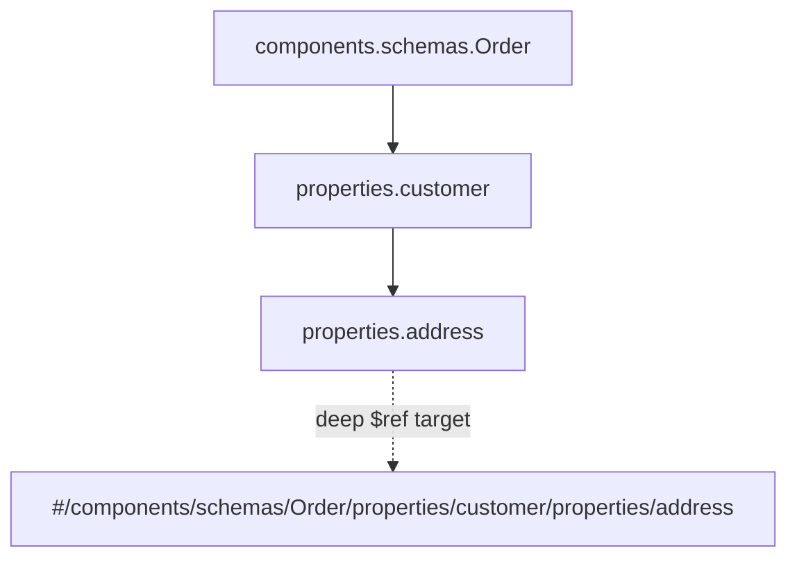
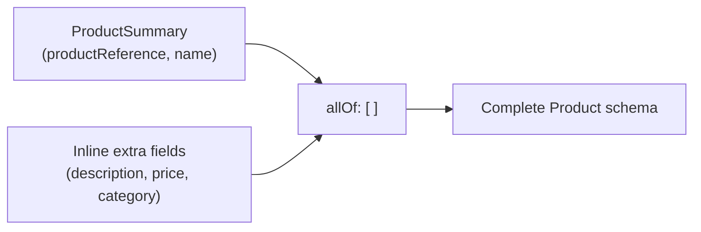
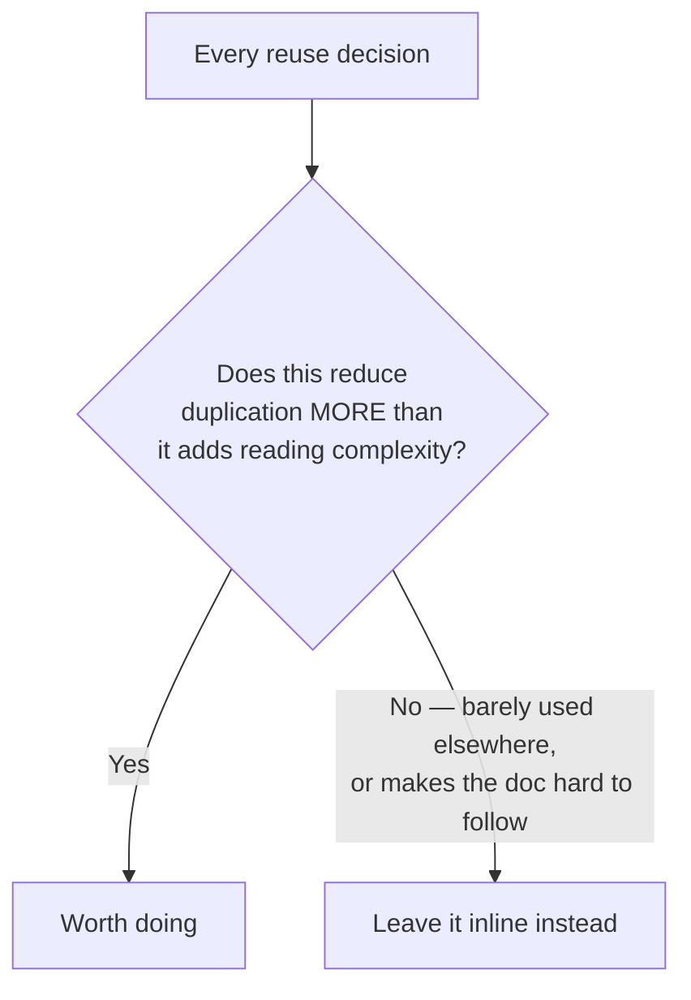
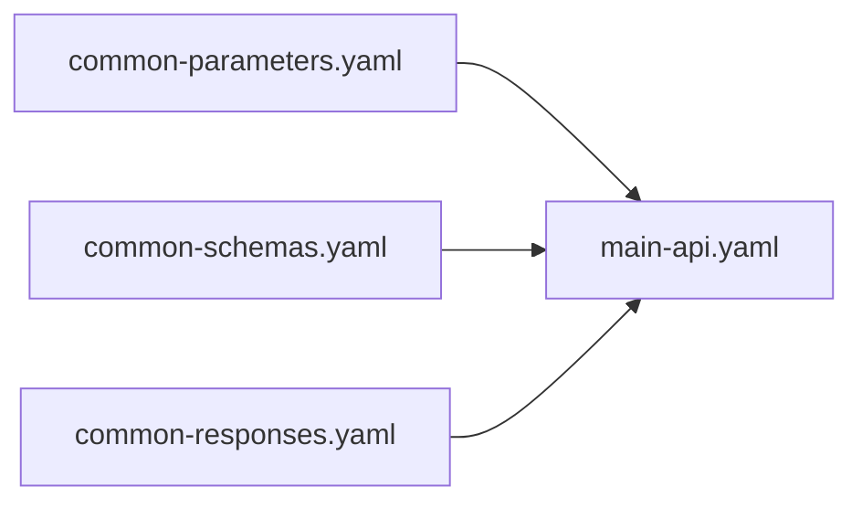

# Enriching OpenAPI Documents with Reusable Components

I've spent a lot of time going back and forth between "what does this API actually need to do" and "how do I write that down in OpenAPI," and one lesson keeps coming back to me: those two activities want to happen at different speeds, and if I let them collide, I end up with a worse design *and* a messier document. So before I get into the mechanics of `components.schemas`, `$ref`, `allOf`, and all the other reuse machinery OpenAPI gives me, I want to start with the discipline that makes all of it worth doing in the first place.

## Don't Let OpenAPI Machinery Leak Into Design Thinking

When I'm still deciding what a resource looks like, or what an operation's inputs and outputs should be, I try hard not to let OpenAPI-specific concerns sneak into that thinking. Things like "should this be a `$ref` or inline?", "should I use `allOf` here?", "is this worth its own reusable parameter?" — these are all *representation* questions, not *design* questions. If I start worrying about them too early, I end up making design decisions to satisfy the document's structure instead of the actual user need, which is exactly backwards.


My rule of thumb: get the essential information into the document first — the paths, methods, inline schemas, whatever's needed to describe the API correctly — and only *afterward* go back and ask whether it can be better organized. Optimization is a refinement pass, not a first draft concern.

> **Note:** This mirrors something I keep running into throughout API design generally — data user-friendliness, operation user-friendliness, flow optimization — they're all treated as later passes, done once the substance is right. OpenAPI document optimization is just the same philosophy applied to the artifact itself.

---

## Reusable Schemas: The Foundation of Everything Else

The first and most important reuse mechanism I lean on is `components.schemas`. Instead of writing out a data shape every single place it's needed, I define it once and reference it everywhere.



Here's the pattern I use — I've validated this snippet is syntactically correct YAML before including it here:

```yaml
paths:
  /products/{productId}:
    get:
      summary: Get product details
      responses:
        "200":
          description: Product found
          content:
            application/json:
              schema:
                $ref: '#/components/schemas/Product'
components:
  schemas:
    Product:
      type: object
      properties:
        productReference:
          type: number
        name:
          type: string
        price:
          type: number
      required:
        - productReference
        - name
```

The `$ref` value here — `#/components/schemas/Product` — is a **JSON Pointer**. I like to think of it almost like a file path inside the document itself:

| Segment | Meaning |
|---|---|
| `#` | Start from the root of this document |
| `/components` | Go into the `components` object |
| `/schemas` | Go into the `schemas` map within it |
| `/Product` | Land on the schema named `Product` |

Once I have this in place, every single operation that deals with a `Product` points back to the same single source of truth. If the shape of a product ever changes, I change it in exactly one place, and every operation referencing it picks up the update automatically. That consistency is really the whole point.

---

## Overriding a Reused Schema's Description

One thing that tripped me up the first time I used `$ref` heavily: what if the reusable schema has its own `description`, but I want a *different*, more contextual description at one specific usage site?

The answer turned out to be simpler than I expected — I just place a `description` property directly next to the `$ref`, and it overrides the one baked into the reusable schema at that particular usage point.

```yaml
components:
  schemas:
    Category:
      type: object
      description: A product category
      properties:
        id:
          type: string
        name:
          type: string
paths:
  /products/{productId}:
    get:
      responses:
        "200":
          description: Product found
          content:
            application/json:
              schema:
                type: object
                properties:
                  category:
                    description: The category this product currently belongs to
                    allOf:
                      - $ref: '#/components/schemas/Category'
```

> **Caution:** I can't just write `description` as a sibling of `$ref` directly in every OpenAPI-tooling implementation the same way — some strict JSON Schema processors ignore sibling keywords next to `$ref`. That's actually *why* I wrapped it in `allOf` here: combining the reference with an inline object that only contains `description` sidesteps that ambiguity cleanly and works consistently.

---

## Reaching Into Inner Schemas with Deep References

Sometimes I don't want to reference an entire schema — I want to point at a smaller piece nested *inside* one. Rather than pulling that inner piece out into its own tiny, disconnected reusable schema (which can quickly turn `components.schemas` into a cluttered mess of fragments nobody remembers the purpose of), I can target it directly with a deeper JSON Pointer path.



```yaml
components:
  schemas:
    Order:
      type: object
      properties:
        orderId:
          type: string
        customer:
          type: object
          properties:
            name:
              type: string
            address:
              type: object
              properties:
                street:
                  type: string
                city:
                  type: string
paths:
  /shipping-labels:
    post:
      requestBody:
        content:
          application/json:
            schema:
              type: object
              properties:
                destination:
                  $ref: '#/components/schemas/Order/properties/customer/properties/address'
```

I find this genuinely useful when I only need to reuse one nested fragment in one or two places — it avoids the alternative of either duplicating that inner shape inline (drift risk) or promoting it to a full top-level reusable schema that doesn't really deserve that level of prominence on its own.

---

## Read-Only vs. Write-Only: Building Unique Read-and-Write Schemas

This is one I got burned by early on. I wanted a single `Product` schema to serve both as the shape returned in responses *and* the shape accepted in request bodies. The problem: some fields (like an auto-generated `productReference` or a server-set `createdAt`) only make sense in responses — a consumer should never be expected to *send* them.

The `readOnly` flag solves this cleanly:

```yaml
components:
  schemas:
    Product:
      type: object
      properties:
        productReference:
          type: number
          readOnly: true
        name:
          type: string
        price:
          type: number
        createdAt:
          type: string
          format: date-time
          readOnly: true
```

With `readOnly: true` set on a property, tooling understands that this field belongs in **responses only** — it gets automatically excluded from what's expected in a request body, even though I'm still using one single schema definition. This lets me keep one unified `Product` schema instead of maintaining separate near-identical "input Product" and "output Product" schemas by hand.

There's also a `writeOnly` flag, which does the mirror-image thing — marking a property as request-only (a classic example being a `password` field that gets accepted on creation but should never be echoed back in a response). I'll be straightforward about my own stance here, since it's an explicit warning I hold onto:

> **Caution:** I try to avoid `writeOnly` where I reasonably can. It introduces a real asymmetry between what goes into a request and what comes back out, and that mismatch — a field that silently exists on one side but not the other — is exactly the kind of subtle inconsistency that trips up client code down the line, especially generated SDKs that reflect the schema literally. `readOnly` feels safer to me because it only ever *removes* something from the request side; it doesn't introduce a field that disappears without a trace after being submitted.

---

## Merging Schemas with `allOf`

Sometimes I already have a smaller, focused schema — say, `ProductSummary` — and I want a bigger, "complete" schema that includes everything in the summary *plus* some additional fields, without redefining the shared fields all over again. `allOf` lets me merge schemas together.



```yaml
components:
  schemas:
    ProductSummary:
      type: object
      properties:
        productReference:
          type: number
        name:
          type: string
    Product:
      allOf:
        - $ref: '#/components/schemas/ProductSummary'
        - type: object
          properties:
            description:
              type: string
            price:
              type: number
            category:
              type: string
```

What I like about this pattern is that it makes the *relationship* between my derived data models explicit and visible right in the schema itself — a reader can immediately see that `Product` builds on top of `ProductSummary`, rather than that relationship only existing implicitly in my head (or in a spreadsheet somewhere that isn't the actual API document).

---

## Finding the Balance

At this point I want to pause and be honest about something: every one of these techniques — deep references, `allOf` merging, splitting read/write schemas — adds a bit of indirection. Someone reading my document now has to mentally resolve references, follow `allOf` chains, and remember which flags apply where, instead of just reading one flat, self-contained schema.



I don't apply every optimization technique to every schema just because I *can*. If something is genuinely only used once, or if merging it via `allOf` would make the document harder to follow than just writing it out plainly, I leave it inline. The goal was never "maximum reuse" — it's a genuinely more maintainable, consistent document, and past a certain point, more indirection works against that goal instead of for it.

---

## Beyond Schemas: Reusing Parameters, Request Bodies, Headers, and Responses

Schemas get most of the attention, but `components` supports reuse for basically every other piece of an OpenAPI document too. Before I get into those, there's one important rule about **where parameters get declared** that I always check first.

### Path-Level Parameters to Avoid Duplication

If a parameter genuinely applies to **every operation** on a given path — the most common example being a path parameter like `productId` — I always define it once at the **path level**, rather than repeating it separately inside every single method (`get`, `put`, `patch`, `delete`) underneath that path.

```yaml
paths:
  /products/{productId}:
    parameters:
      - name: productId
        in: path
        required: true
        schema:
          type: string
    get:
      summary: Get product details
      responses:
        "200":
          description: Product found
    put:
      summary: Replace a product
      responses:
        "200":
          description: Product updated
```

Both `get` and `put` here automatically inherit the `productId` parameter from the path level — I don't repeat it under each method. It's a small thing, but multiplied across a document with a dozen resources and four or five operations each, this genuinely saves a lot of duplicated, easy-to-desync boilerplate.

### `components.parameters`: Reusable Individual Parameters

For parameters that get reused **across different paths** (not just across methods on the *same* path), I promote them into `components.parameters` and reference them with `$ref`.

```yaml
components:
  parameters:
    ProductIdPathParam:
      name: productId
      in: path
      required: true
      schema:
        type: string
paths:
  /products/{productId}:
    parameters:
      - $ref: '#/components/parameters/ProductIdPathParam'
    get:
      responses:
        "200":
          description: Product found
```

### Reusable Object Query Parameters: Grouping Related Parameters

One pattern I didn't expect to need until I actually ran into a document with a dozen near-identical pagination parameters scattered everywhere: I can define a **reusable object-shaped query parameter** that bundles several related query values together, using `style: deepObject` so it still gets serialized correctly as individual query string keys.

```yaml
components:
  parameters:
    PaginationParams:
      name: pagination
      in: query
      style: deepObject
      explode: true
      schema:
        type: object
        properties:
          page:
            type: integer
          pageSize:
            type: integer
paths:
  /products:
    get:
      parameters:
        - $ref: '#/components/parameters/PaginationParams'
      responses:
        "200":
          description: Products list
```

This lets me reference "the pagination parameters" as one single reusable unit everywhere I need pagination, instead of individually re-declaring `page` and `pageSize` as two separate parameters on every single list operation.

### `components.requestBodies`: Reusable Request Bodies

The same logic applies to entire request bodies. If several operations legitimately expect the same request body shape, I define it once.

```yaml
components:
  requestBodies:
    ProductCreation:
      required: true
      content:
        application/json:
          schema:
            type: object
            properties:
              name:
                type: string
              price:
                type: number
paths:
  /products:
    post:
      requestBody:
        $ref: '#/components/requestBodies/ProductCreation'
      responses:
        "201":
          description: Product created
```

### `components.headers`: Reusable Response Headers

Headers that show up repeatedly across many responses — rate-limit info is my go-to example — get the same treatment.

```yaml
components:
  headers:
    RateLimitRemaining:
      description: Number of requests remaining in the current window
      schema:
        type: integer
paths:
  /products:
    get:
      responses:
        "200":
          description: Products list
          headers:
            X-RateLimit-Remaining:
              $ref: '#/components/headers/RateLimitRemaining'
```

### `components.responses`: Reusable Whole Responses

Finally, entire response definitions — not just their schemas, but the full description, headers, and content together — can be made reusable too. My favorite candidate for this is a generic `404 Not Found` response, since it tends to look the same across dozens of operations.

```yaml
components:
  responses:
    NotFound:
      description: The requested resource was not found
      content:
        application/json:
          schema:
            type: object
            properties:
              title:
                type: string
              status:
                type: integer
paths:
  /products/{productId}:
    get:
      responses:
        "200":
          description: Product found
        "404":
          $ref: '#/components/responses/NotFound'
```

Here's the full family of reusable component types side by side, since I find it useful to have them all in one place:

| Component section | Reuses | `$ref` target pattern |
|---|---|---|
| `components.schemas` | Data shapes | `#/components/schemas/SchemaId` |
| `components.parameters` | Individual or grouped parameters | `#/components/parameters/ParameterId` |
| `components.requestBodies` | Entire request bodies | `#/components/requestBodies/RequestBodyId` |
| `components.headers` | Response headers | `#/components/headers/HeaderId` |
| `components.responses` | Entire response definitions | `#/components/responses/ResponseId` |

---

## Building a Library of Components Across Files

Once I have a decent number of reusable schemas, parameters, and responses, I've started keeping them in **separate, standalone files** — valid, independently-editable OpenAPI or plain JSON Schema files — rather than cramming everything into one enormous document.



I do this for a genuinely practical reason: components like a standard `404` response, a `RateLimitRemaining` header, or a shared `Address` schema often aren't specific to just *one* API — they're patterns I reuse across several APIs in the same organization. Keeping them in dedicated, independently-valid files means I can maintain that shared library once and pull it into multiple API documents, rather than copy-pasting the same components repeatedly into every new API I design.

> **Note:** The practical mechanics of referencing across separate files (rather than within one document) use the same `$ref` mechanism, just with a file path prefix ahead of the `#` fragment — but the conceptual reuse benefit is identical to everything covered above.

---

## Wrapping Up

If I had to compress everything here into one takeaway, it's this: reuse in OpenAPI isn't about making the document as terse as technically possible — it's about making the document **trustworthy**. Every time I define something once and reference it everywhere, I remove one more place where two copies could quietly drift apart. But I try to hold that against the real cost of indirection, and I only reach for `$ref`, `allOf`, deep references, and separate component libraries when the reuse genuinely outweighs the extra hop a reader now has to take to understand what's actually there. Get the essentials down first, then optimize — that's the order that's worked for me every time.
