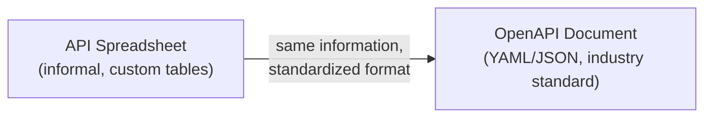
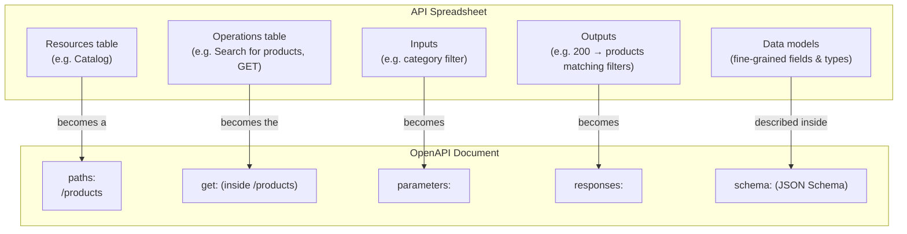
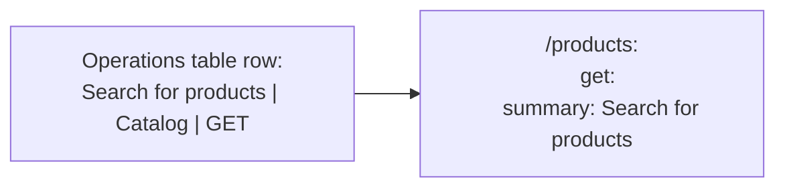
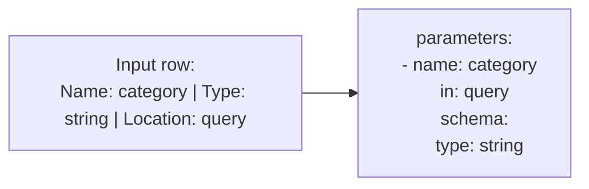
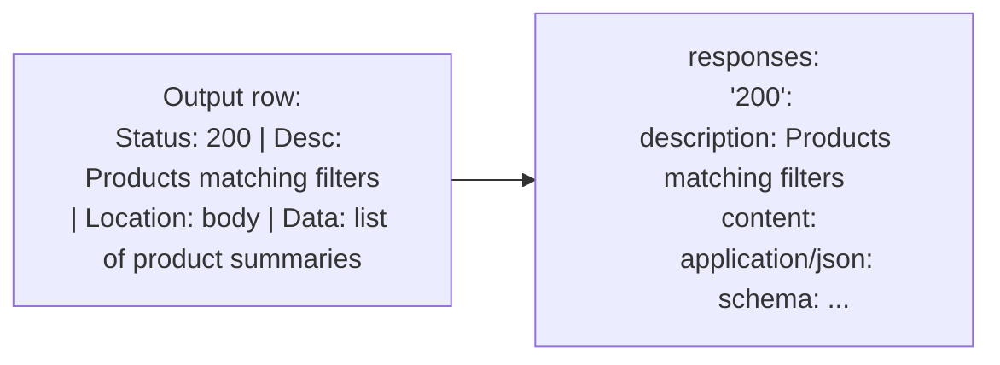
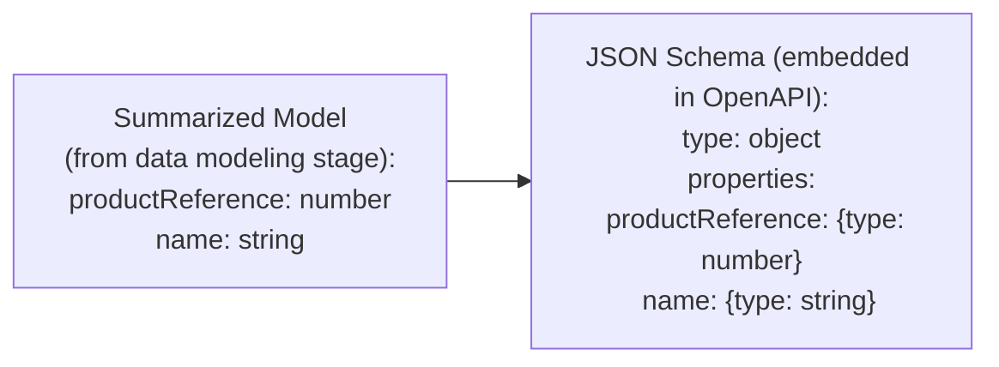
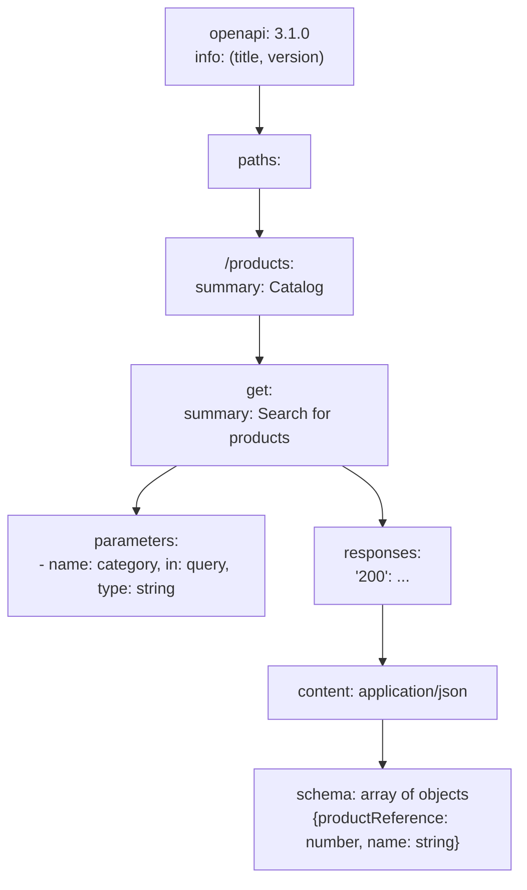
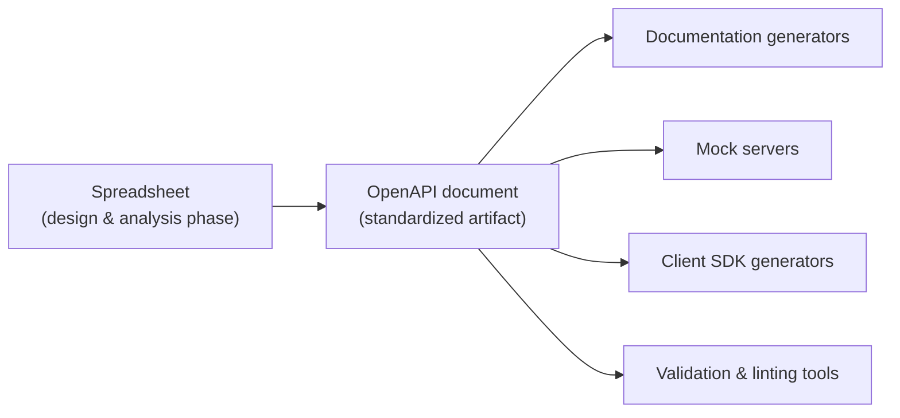

# From API Spreadsheet to OpenAPI Document

Everything gathered so far — resources, operations, inputs, outputs, and data models — has been tracked informally in a spreadsheet. This same information can be expressed in a **standardized, machine-readable format**: an **OpenAPI document**. This isn't a new design step — it's a **translation** of the exact same design decisions into a format tools, consumers, and documentation generators can all understand consistently.



---

## Why Make This Translation at All

A spreadsheet is great for the messy, iterative work of *discovering* resources, operations, and data — free-form columns, easy reorganizing, easy pivoting. But it's a custom format only your team understands. An **OpenAPI document** describes the exact same design using a **standard specification** that:

- Tooling can validate, render into interactive documentation, or use to generate client/server code
- Any developer familiar with OpenAPI can read, without needing to learn your team's spreadsheet conventions
- Can be version-controlled, diffed, and reviewed like real source code

So the spreadsheet is the **working notebook**; the OpenAPI document is the **published, structured deliverable**.

---

## The Mapping, Piece by Piece



### 1. Resources → `paths`

The spreadsheet's **Resources table** entry for "Catalog" corresponds to a **path** in the OpenAPI document — specifically, the `/products` key under the top-level `paths` section. The path itself *is* the resource's address.

```yaml
paths:
  /products:
    summary: Catalog
```

### 2. Operations → HTTP method properties under a path

The spreadsheet's **Operations table** entry — "Search for products," which targets the "Catalog" resource using `GET` — becomes the `get` property nested inside `/products`. Each HTTP method used on that path (`get`, `post`, `put`, `delete`, etc.) gets its own key.



```yaml
paths:
  /products:
    get:
      summary: Search for products
```

### 3. Inputs → `parameters`

The spreadsheet's input row — a "category" filter, located in the **query**, typed as a **string** — becomes an entry in the `parameters` array, nested under the specific operation (`get`).



Every field from the spreadsheet's input row has a direct counterpart:

| Spreadsheet column | OpenAPI field |
|---|---|
| Name | `name` |
| Location (query, path, header...) | `in` |
| Type | `schema.type` |

```yaml
      parameters:
        - name: category
          in: query
          schema:
            type: string
```

### 4. Outputs → `responses`

The spreadsheet's output row — status `200`, description "Products matching filters," data located in the **body**, containing a "list of product summaries" — becomes an entry under `responses`, keyed by status code.



```yaml
      responses:
        "200":
          description: Products matching filters
          content:
            application/json:
              schema:
                type: array
                items:
                  type: object
                  properties:
                    productReference:
                      type: number
                    name:
                      type: string
```

### 5. Data models → JSON Schema, nested inside responses/parameters

The fine-grained **data models** — the detailed field-by-field breakdown (name, type, required status) worked out during data modeling — are expressed using **JSON Schema**, embedded directly inside the relevant `parameters` or `responses.content.schema` sections.

In the example, the "list of product summaries" output data model becomes an `array` schema whose `items` are `object`s with two properties: `productReference` (a `number`) and `name` (a `string`) — this is exactly the **summarized model** discussed earlier, expressed as JSON Schema.



---

## The Complete Picture



Every layer of the OpenAPI document mirrors a table (or a specific row within a table) from the spreadsheet:

| Spreadsheet | OpenAPI equivalent |
|---|---|
| Resources table | `paths` (each resource → a path) |
| Operations table | HTTP method key under a path (`get`, `post`, ...) |
| Inputs (per operation) | `parameters` array |
| Outputs (per operation) | `responses` object, keyed by status code |
| Data models (fine-grained fields) | JSON Schema, nested inside `parameters`/`responses` |

---

## Why This Matters Going Forward

Because OpenAPI is a **standardized specification**, once your design is expressed this way, an entire ecosystem of tooling becomes available: interactive documentation generators, mock servers, client SDK generators, automated request/response validators, and design-linting tools. The spreadsheet got you to a correct, thoroughly analyzed design — the OpenAPI document is what lets that design actually integrate into real development, testing, and consumer-facing tooling.


