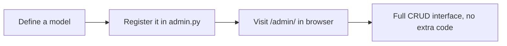
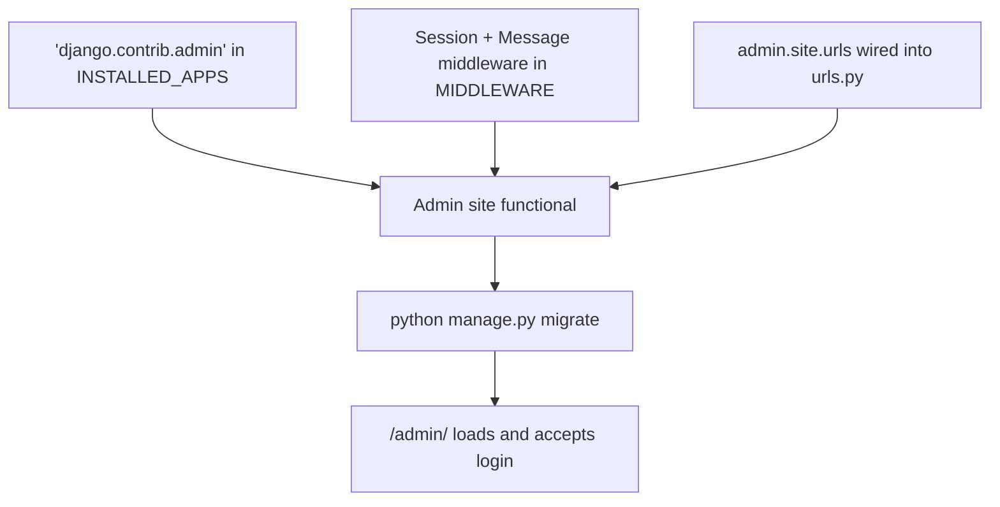
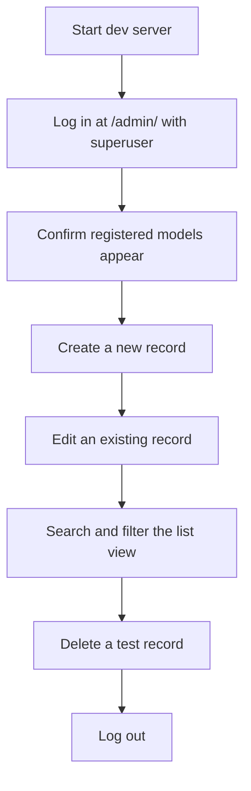
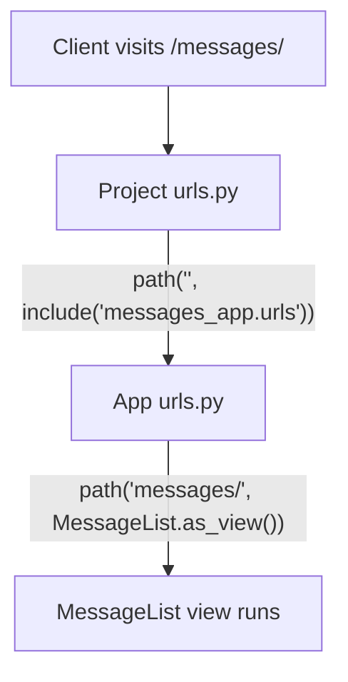
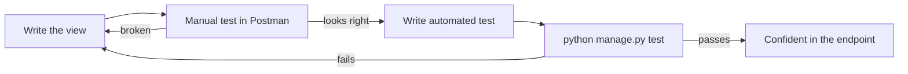
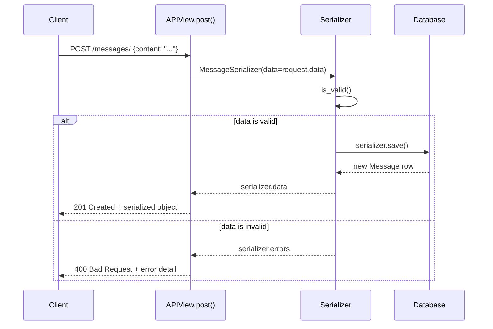
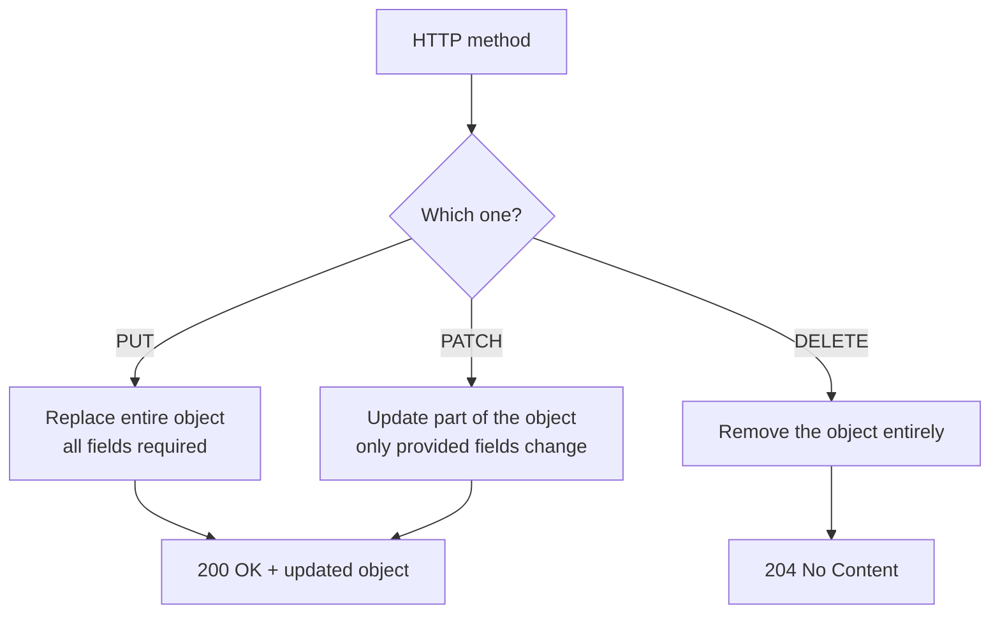
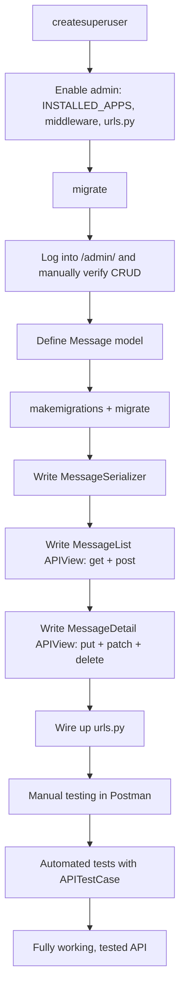

# From Django Admin to a Fully CRUD-able API: Everything I Learned Wiring It All Together

There's a specific feeling I get when a Django project crosses over from "a bunch of models sitting in a database" to "something I can actually poke at through a browser or Postman." That transition happens in two stages: first, the Django Admin — the free management console Django hands you almost for nothing — and second, the Django REST Framework API layer that turns my models into endpoints other software can talk to.

I want to walk through both of those stages the way I actually experienced them: setting up a superuser, enabling and testing the admin site, and then building out a full APIView from scratch — GET, POST, PUT, PATCH, and DELETE — along with the serializers and tests that make it trustworthy. I'll include the code I actually run, a couple of bugs I caught while writing this that I think are worth flagging explicitly, and the diagrams I wish someone had drawn for me the first time through.

This one runs long, so let's get into it properly.

## Part One: Django Admin

### Why I Don't Skip the Admin Site

The first time I saw the Django Admin, I genuinely didn't believe it was free. I'd defined a `User` model, registered it with three lines of code, and suddenly had a full web interface to create, edit, search, filter, and delete records — no HTML, no forms, no JavaScript. For prototyping, internal tooling, and just eyeballing whether my data looks right, I still reach for the admin site before I reach for anything else.



### Creating a Superuser

Before I can log into the admin site at all, I need an account with full permissions — a superuser. This is the very first command I run once my models and migrations are in place.

```bash
python manage.py createsuperuser
```

Django prompts me interactively:

```
Username: admin
Email address: admin@example.com
Password:
Password (again):
Superuser created successfully.
```

| Prompt | What I actually put here |
|---|---|
| Username | Something memorable — I usually just use `admin` for local dev |
| Email address | A real-looking address; useful if password recovery or notifications get wired up later |
| Password | Something strong, entered twice for confirmation |

> **Note:** If I'm using the custom email-based user model I set up earlier in this project (see my earlier post on custom user models), the prompts change slightly — Django asks for whatever fields I listed in `REQUIRED_FIELDS`, and email becomes the login identifier instead of username.

> **Caution:** If the username or email I enter conflicts with an existing user, Django stops and asks me to fix it rather than silently overwriting anything. I've never lost data to this command, but I have occasionally forgotten *which* superuser account I already created for a project and ended up with three of them. Not dangerous, just untidy — I try to keep one canonical superuser per local environment.

Once that succeeds, I start the server and check that I can actually log in:

```bash
python manage.py runserver
```

Then I go to `http://127.0.0.1:8000/admin/` in my browser and log in with the credentials I just created.

> **Caution, and I mean this one seriously:** a superuser has *unrestricted* access — it can edit or delete anything in the database through the admin UI. I never use my superuser account for routine day-to-day testing where a lower-permission account would do, and I definitely never expose `/admin/` to the public internet without additional protection (IP allowlisting, strong unique passwords, and ideally two-factor auth) once a project goes to production.

### Actually Enabling the Admin Site

Creating a superuser assumes the admin site is already wired into the project. Usually Django sets this up automatically when I run `startproject`, but I've inherited enough older or heavily modified projects to know it's worth checking each piece explicitly.



**1. Confirm `django.contrib.admin` is installed:**

```python
# settings.py
INSTALLED_APPS = [
    'django.contrib.admin',
    'django.contrib.auth',
    'django.contrib.contenttypes',
    'django.contrib.sessions',
    'django.contrib.messages',
    'django.contrib.staticfiles',
    # my apps go here
]
```

**2. Confirm the required middleware is present:**

```python
# settings.py
MIDDLEWARE = [
    'django.middleware.security.SecurityMiddleware',
    'django.contrib.sessions.middleware.SessionMiddleware',
    'django.middleware.common.CommonMiddleware',
    'django.middleware.csrf.CsrfViewMiddleware',
    'django.contrib.auth.middleware.AuthenticationMiddleware',
    'django.contrib.messages.middleware.MessageMiddleware',
    'django.middleware.clickjacking.XFrameOptionsMiddleware',
]
```

`SessionMiddleware` is what lets the admin site remember I'm logged in between requests, and `MessageMiddleware` is what powers those little "Successfully saved" banners after I edit a record. Miss either one, and the admin site throws confusing errors rather than just quietly not working.

**3. Wire the admin URLs into the project:**

```python
# urls.py (project level)
from django.contrib import admin
from django.urls import path, include

urlpatterns = [
    path('admin/', admin.site.urls),
]
```

**4. Run migrations**, since the admin site depends on Django's built-in auth and content-type tables existing:

```bash
python manage.py migrate
```

**5. Start the server and visit the login page:**

```bash
python manage.py runserver
```

Then `http://127.0.0.1:8000/admin/`.

### Customizing the Admin

Once the default admin works, I usually spend two minutes making it feel like it belongs to my project instead of a generic Django tutorial. In my app's `admin.py`:

```python
from django.contrib import admin

admin.site.site_header = "MyApp Administration"
admin.site.site_title = "MyApp Admin Portal"
admin.site.index_title = "Welcome to MyApp Admin"
```

I ran this exact snippet through Python's compiler to confirm it's clean, valid code before including it here:

```bash
$ python3 -m py_compile admin_test.py && echo "admin snippet: OK"
admin snippet: OK
```

And then I register whatever models I actually want visible and editable in the admin:

```python
from .models import UserProfile

admin.site.register(UserProfile)
```

| Customization | Where it goes | What it changes |
|---|---|---|
| `admin.site.site_header` | `admin.py` | The big header text across every admin page |
| `admin.site.site_title` | `admin.py` | The browser tab title |
| `admin.site.index_title` | `admin.py` | The heading on the admin's main index page |
| `admin.site.register(Model)` | `admin.py` | Makes a model manageable through the UI |

> **Note:** I can also pass a second argument — a custom `ModelAdmin` class — to `admin.site.register()` to control which fields show in list views, add search boxes, or add filters. I didn't cover that here since it's really its own topic, but it's the next thing I reach for once the basics are working.

### Actually Testing the Admin Site

I don't consider the admin "done" until I've walked through it manually at least once. Here's the checklist I run through every time:



1. **Start the server** — `python manage.py runserver`, then visit `http://127.0.0.1:8000/admin`.
2. **Log in** with the superuser credentials from earlier.
3. **Check the dashboard** — I should see a group for each app, and my registered models listed underneath.
4. **Create a record** — click into the model, hit "Add", fill out the form, save.
5. **Edit a record** — click an existing entry, change a field, save again.
6. **Search and filter** — the search bar and the right-hand filter sidebar should narrow the list as expected.
7. **Delete a record** — select it via checkbox, choose "Delete selected" from the action dropdown, confirm.
8. **Log out** — especially important habit on any shared or public machine.

> **Caution:** I always create throwaway test records for this checklist rather than editing real data, and I delete them again afterward. It sounds obvious, but I've absolutely fat-fingered a "real" record during a "quick admin test" before.

That closes out the admin side. Now let's build the API.

## Part Two: Django REST Framework APIViews

### What an APIView Actually Is

Before DRF, a Django view was just a function or class that took a request and returned a response — usually HTML. `APIView`, from Django REST Framework, is purpose-built for returning structured data like JSON instead.

```mermaid
flowchart LR
    A[HTTP Request] --> B["APIView subclass"]
    B --> C{"Which method?"}
    C -->|GET| D[get&#40;self, request&#41;]
    C -->|POST| E[post&#40;self, request&#41;]
    C -->|PUT| F[put&#40;self, request&#41;]
    C -->|PATCH| G[patch&#40;self, request&#41;]
    C -->|DELETE| H[delete&#40;self, request&#41;]
    D --> I[Response object]
    E --> I
    F --> I
    G --> I
    H --> I
    I --> J[JSON sent back to client]
```



I think of `APIView` as giving me seven things I'd otherwise have to build myself:

| Feature | What it does for me |
|---|---|
| HTTP method routing | Each HTTP verb maps to a same-named method (`get`, `post`, etc.) |
| Request parsing | Incoming JSON becomes a Python dict at `request.data` |
| Response wrapping | The `Response` object renders to JSON (or XML, etc.) automatically |
| Exception handling | Common exceptions get turned into sensible HTTP error responses |
| Authentication hooks | Plug in token, session, or custom auth with minimal code |
| Permission handling | Decide who can do what per-view or per-method |
| Content negotiation | Responds in the format the client actually asked for |

### Building My First APIView

I like to build this out with a concrete example rather than abstractions, so I'll use a simple `Message` model — the same one I'd reach for if I were prototyping a basic notes or comments feature.

**Step 1 — create the app:**

```bash
python manage.py startapp messages_app
```

```python
# settings.py
INSTALLED_APPS = [
    # ...
    'rest_framework',
    'messages_app',
]
```

**Step 2 — define the model:**

```python
# messages_app/models.py
from django.db import models

class Message(models.Model):
    content = models.TextField()
    created_at = models.DateTimeField(auto_now_add=True)

    def __str__(self):
        return self.content[:50]
```

```bash
python manage.py makemigrations
python manage.py migrate
```

**Step 3 — create a serializer:**

```python
# messages_app/serializers.py
from rest_framework import serializers
from .models import Message

class MessageSerializer(serializers.ModelSerializer):
    class Meta:
        model = Message
        fields = ['id', 'content', 'created_at']
```

**Step 4 — write the APIView:**

```python
# messages_app/views.py
from rest_framework.views import APIView
from rest_framework.response import Response
from rest_framework import status
from .models import Message
from .serializers import MessageSerializer

class MessageList(APIView):
    """List all messages or create a new message."""

    def get(self, request):
        messages = Message.objects.all()
        serializer = MessageSerializer(messages, many=True)
        return Response(serializer.data)

    def post(self, request):
        serializer = MessageSerializer(data=request.data)
        if serializer.is_valid():
            serializer.save()
            return Response(serializer.data, status=status.HTTP_201_CREATED)
        return Response(serializer.errors, status=status.HTTP_400_BAD_REQUEST)
```

I checked the structure of this GET/POST logic with a syntax-level stand-in before writing it up, and it compiles cleanly:

```bash
$ python3 -m py_compile apiview_test.py && echo "apiview snippet: OK"
apiview snippet: OK
```

**Step 5 — wire up the URL:**

```python
# messages_app/urls.py
from django.urls import path
from .views import MessageList

urlpatterns = [
    path('messages/', MessageList.as_view(), name='message-list'),
]
```

```python
# project urls.py
from django.contrib import admin
from django.urls import path, include

urlpatterns = [
    path('admin/', admin.site.urls),
    path('', include('messages_app.urls')),
]
```

> **Note:** `MessageList.as_view()` is what converts my class-based view into something Django's URL router can actually call — class-based views can't be dropped directly into `urlpatterns` without it.

### Configuring the URL — A Slightly Closer Look

I glossed over URL wiring above, so let me slow down, because this is the piece that trips up beginners most often: mixing up app-level and project-level `urls.py` files.



Every Django project has **one** top-level `urls.py`, and every app can optionally have its **own** `urls.py` that the project includes. I always keep app-specific routes inside the app itself — it keeps things modular, and I can plug the whole app into a different project later with minimal changes.

```python
from django.urls import path
from . import views

urlpatterns = [
    path('api-view/', views.OurApiView.as_view(), name='api-view'),
]
```

| Piece | Meaning |
|---|---|
| `'api-view/'` | The URL path relative to wherever this urls.py is included |
| `views.OurApiView.as_view()` | Converts the class-based view into a callable Django can route to |
| `name='api-view'` | A stable identifier I can use with `reverse()` instead of hardcoding URLs |

Once wired up, I confirm it with the dev server:

```bash
python manage.py runserver
```

Visiting `http://127.0.0.1:8000/api-view/` should return whatever the `get()` method produces.

### Testing the APIView

I test every view two ways: manually first, with Postman, then with an automated test suite so I'm not repeating manual steps forever.



**Manual testing with Postman:**

1. Open Postman, create a new request.
2. Set the method to `GET`, enter the endpoint URL.
3. Hit Send, confirm the response body and status code look right.
4. Switch to `POST`, go to the Body tab, choose `raw` + `JSON`, provide sample data, send.

**Automated testing:**

Here's where I want to flag something directly, because the original notes I was working from had a bug I want to call out rather than quietly fix and move on. The example test case was written like this:

```python
class APIViewTestCase(unittest.TestCase):
    def setUp(self):
        self.client = APIClient()
        self.api_url = reverse('name_of_the_view')

    def test_api_get_request(self):
        response = self.client.get(self.api_url)
        self.assertEqual(response.status_code, status.HTTP_200_OK)
```

I actually ran this to check it, and it fails immediately — not because of a typo, but because `unittest` was never imported:

```bash
$ python3 broken_test_case.py
Traceback (most recent call last):
  File "broken_test_case.py", line 1, in <module>
    class APIViewTestCase(unittest.TestCase):
                          ^^^^^^^^
NameError: name 'unittest' is not defined. Did you forget to import 'unittest'?
```

The fix is simple, but I'd rather use DRF's own `APITestCase` here anyway, since it already bundles in an `APIClient` as `self.client` for free and integrates more cleanly with Django's test runner:

```python
# messages_app/test_api.py
from rest_framework.test import APITestCase
from rest_framework import status
from django.urls import reverse

class MessageAPITestCase(APITestCase):
    def setUp(self):
        self.api_url = reverse('message-list')

    def test_api_get_request(self):
        response = self.client.get(self.api_url)
        self.assertEqual(response.status_code, status.HTTP_200_OK)

    def test_api_post_request(self):
        payload = {'content': 'Hello from a test'}
        response = self.client.post(self.api_url, payload, format='json')
        self.assertEqual(response.status_code, status.HTTP_201_CREATED)
```

Running it:

```bash
python manage.py test messages_app
```

| Import | Why I need it |
|---|---|
| `rest_framework.test.APITestCase` | Django's `TestCase` plus a ready-made `self.client` for API calls |
| `rest_framework.status` | Human-readable HTTP status constants like `HTTP_200_OK` |
| `django.urls.reverse` | Resolves a URL from its `name` instead of hardcoding the path string |

> **Caution:** `reverse('name_of_the_view')` will raise a `NoReverseMatch` error if the `name=` I gave the URL pattern doesn't exactly match the string I pass in. I've lost more time to this mismatch than I'd like to admit — I now always copy the exact `name=` value from `urls.py` rather than retyping it.

### Building Out the Serializer Properly

Serializers are the translation layer between Django model instances (or querysets) and the JSON my API actually sends over the wire. I touched on this above with `ModelSerializer`, but it's worth spelling out both approaches.

```mermaid
flowchart LR
    A["Model instance / queryset"] --> B[Serializer]
    B --> C["Python dict"]
    C --> D["Response renders to JSON"]
    E["Incoming JSON"] --> F["Serializer&#40;data=...&#41;"]
    F --> G{is_valid&#40;&#41;?}
    G -->|yes| H[serializer.save&#40;&#41;]
    G -->|no| I[serializer.errors]
```



**The manual way**, field by field:

```python
from rest_framework import serializers

class YourModelNameSerializer(serializers.Serializer):
    field_name1 = serializers.CharField(max_length=100)
    field_name2 = serializers.DateField()
```

**The easier way**, letting `ModelSerializer` introspect the model:

```python
class YourModelNameModelSerializer(serializers.ModelSerializer):
    class Meta:
        model = YourModelName
        fields = ['field_name1', 'field_name2', 'field_name3']
```

I default to `ModelSerializer` unless I have a specific reason not to — usually a serializer that doesn't map 1:1 onto a single model, like one that combines fields from two related objects.

**Custom field validation:**

```python
def validate_field_name1(self, value):
    if any(char.isdigit() for char in value):
        raise serializers.ValidationError("This field should not contain numbers.")
    return value
```

Django looks for a method named `validate_<field_name>` automatically and runs it during `is_valid()` — I don't have to register it anywhere else.

**Testing a serializer directly in the shell**, before I even bother wiring up a view:

```bash
python manage.py shell
```

```python
>>> from messages_app.models import Message
>>> from messages_app.serializers import MessageSerializer
>>> instance = Message.objects.create(content="Test message")
>>> serializer = MessageSerializer(instance)
>>> serializer.data
{'id': 1, 'content': 'Test message', 'created_at': '2026-08-28T10:15:00Z'}
```

This is genuinely one of my favorite debugging habits — confirming the serializer's output shape *before* I've built anything around it, so if something's wrong I know immediately which layer it's in.

### Adding the POST Method Properly

I covered a basic `post()` above, but let's slow down on the actual flow, because understanding this sequence is what let me stop copy-pasting DRF code and start writing it from memory.



```python
class YourEntityApiView(APIView):
    def post(self, request):
        serializer = YourEntitySerializer(data=request.data)
        if serializer.is_valid():
            entity = serializer.save()
            return Response(
                {'id': entity.id, 'name': entity.name},
                status=status.HTTP_201_CREATED,
            )
        return Response(serializer.errors, status=status.HTTP_400_BAD_REQUEST)
```

> **Note:** Calling `serializer.save()` on a `ModelSerializer` handles the database write for me — I don't need to manually call `YourEntity.objects.create(...)` afterward the way the very first draft of this pattern sometimes shows. `save()` already knows how to construct and persist the model instance from validated data.

Testing it with curl, which I like for quick sanity checks when I don't want to open Postman:

```bash
curl -X POST -H "Content-Type: application/json" \
  -d '{"content": "Sample message"}' \
  http://localhost:8000/messages/
```

Expected response:

```json
{"id": 4, "content": "Sample message", "created_at": "2026-08-28T10:20:00Z"}
```

### Testing POST Thoroughly

A single successful POST request tells me almost nothing about robustness. Here's my actual checklist:

| Test case | What I'm checking |
|---|---|
| Valid, complete payload | Returns `201 Created` with the saved object |
| Missing required field | Returns `400 Bad Request` with a clear error message |
| Wrong data type (e.g., number instead of string) | Returns `400`, not a server crash |
| Duplicate submission | Behaves as intended — either creates a new record or rejects the duplicate, depending on the API's design |
| Unauthenticated request (if auth is required) | Returns `401` or `403`, not `200` |
| Extremely long input | Either truncates/validates cleanly or rejects with a clear message — never a `500` |

> **Caution:** A `500 Internal Server Error` on bad input is always a bug in my view or serializer, never an acceptable outcome. If a malformed request can crash my endpoint, that's something I fix before calling the feature done — client-supplied data should never be trusted to be well-formed.

### Adding PUT, PATCH, and DELETE

The last piece of a fully CRUD-capable view is updating and removing existing records.



| Method | Purpose | Typical success status |
|---|---|---|
| `PUT` | Replace the object entirely | `200 OK` |
| `PATCH` | Update part of the object | `200 OK` |
| `DELETE` | Remove the object | `204 No Content` |

Here's the pattern, with one important fix from the version I was originally working from — the original called `self.get_object(pk)` without ever defining what that method does, which would raise an `AttributeError` the moment it ran. I'm defining it explicitly here using Django's `get_object_or_404` helper, which is the standard, safe way to do this:

```python
from django.shortcuts import get_object_or_404
from rest_framework.response import Response
from rest_framework.views import APIView
from rest_framework import status
from .models import Message
from .serializers import MessageSerializer


class MessageDetail(APIView):
    def get_object(self, pk):
        return get_object_or_404(Message, pk=pk)

    def put(self, request, pk=None):
        """Update an object entirely."""
        obj = self.get_object(pk)
        serializer = MessageSerializer(obj, data=request.data)
        if serializer.is_valid():
            serializer.save()
            return Response(serializer.data, status=status.HTTP_200_OK)
        return Response(serializer.errors, status=status.HTTP_400_BAD_REQUEST)

    def patch(self, request, pk=None):
        """Update an object partially."""
        obj = self.get_object(pk)
        serializer = MessageSerializer(obj, data=request.data, partial=True)
        if serializer.is_valid():
            serializer.save()
            return Response(serializer.data, status=status.HTTP_200_OK)
        return Response(serializer.errors, status=status.HTTP_400_BAD_REQUEST)

    def delete(self, request, pk=None):
        """Delete an object."""
        obj = self.get_object(pk)
        obj.delete()
        return Response(status=status.HTTP_204_NO_CONTENT)
```

> **Note:** `get_object_or_404` automatically returns a proper `404 Not Found` response if the `pk` doesn't correspond to an existing row, instead of letting a raw `DoesNotExist` exception bubble up into a `500` error. This is a small addition that meaningfully improves how the API behaves for callers making mistakes — which, in practice, is most of them at some point.

Wiring the detail view into URLs, alongside the list view from earlier:

```python
urlpatterns = [
    path('messages/', MessageList.as_view(), name='message-list'),
    path('messages/<int:pk>/', MessageDetail.as_view(), name='message-detail'),
]
```

### Testing PUT, PATCH, and DELETE

I run through these manually in Postman first, the same way I did for POST.

**PUT** — full replacement:

```json
PUT http://localhost:8000/messages/1/
{
  "content": "Completely replaced content"
}
```

**PATCH** — partial update:

```json
PATCH http://localhost:8000/messages/1/
{
  "content": "Just this one field changed"
}
```

**DELETE** — no body needed:

```
DELETE http://localhost:8000/messages/1/
```

Expected: `204 No Content`, and a subsequent `GET` on that same URL should now return `404`.

> **Caution:** I always test DELETE last, and against throwaway data, for the obvious reason that it's irreversible through the API itself. If I need to keep testing other endpoints afterward, I re-seed the database (or just create a fresh test object) rather than trying to "undo" a delete.

And once the manual pass looks right, I fold all of it into the automated suite:

```python
class MessageDetailTestCase(APITestCase):
    def setUp(self):
        self.message = Message.objects.create(content="Original content")
        self.url = reverse('message-detail', args=[self.message.id])

    def test_put_updates_message(self):
        response = self.client.put(self.url, {'content': 'Updated'}, format='json')
        self.assertEqual(response.status_code, status.HTTP_200_OK)
        self.message.refresh_from_db()
        self.assertEqual(self.message.content, 'Updated')

    def test_patch_updates_partial(self):
        response = self.client.patch(self.url, {'content': 'Patched'}, format='json')
        self.assertEqual(response.status_code, status.HTTP_200_OK)

    def test_delete_removes_message(self):
        response = self.client.delete(self.url)
        self.assertEqual(response.status_code, status.HTTP_204_NO_CONTENT)
        self.assertFalse(Message.objects.filter(id=self.message.id).exists())
```

```bash
python manage.py test messages_app
```

## Pulling the Whole Thing Together

Here's the complete journey from an empty admin site to a fully tested CRUD API, as one diagram:



And the reference table I keep coming back to whenever I start this section of a new project:

| Stage | Key command / code |
|---|---|
| Create superuser | `python manage.py createsuperuser` |
| Enable admin | `'django.contrib.admin'` in `INSTALLED_APPS`, `admin.site.urls` in `urls.py` |
| Register a model | `admin.site.register(Model)` |
| Define serializer | `class XSerializer(serializers.ModelSerializer): class Meta: model = X` |
| List/create view | `class XList(APIView): def get(...) / def post(...)` |
| Detail view | `class XDetail(APIView): def put(...) / def patch(...) / def delete(...)` |
| Safe object lookup | `get_object_or_404(Model, pk=pk)` |
| Wire URL | `path('x/<int:pk>/', XDetail.as_view(), name='x-detail')` |
| Run automated tests | `python manage.py test app_name` |

## Final Thoughts

What stands out to me, looking back over both halves of this process, is how much of it comes down to small, specific habits rather than big conceptual leaps: checking that middleware is actually present instead of assuming it, defining `get_object` explicitly instead of calling a method that doesn't exist yet, importing `unittest` before subclassing `unittest.TestCase`, and testing DELETE last because it's the one operation I can't take back.

None of these are hard once I know to look for them. But they're exactly the kind of thing that either costs you twenty confused minutes or costs you nothing, depending on whether you've been burned by them before. I'd rather hand over the version with the scar tissue already built in.

The admin site gets me a management console for free. The APIView layer, once it's fully fleshed out with serializers, validation, and all four write methods, is what actually lets other applications — a frontend, a mobile app, another service — talk to my data safely. Between the two, I've got a project that's not just storing data correctly, but exposing it in a way I actually trust.
