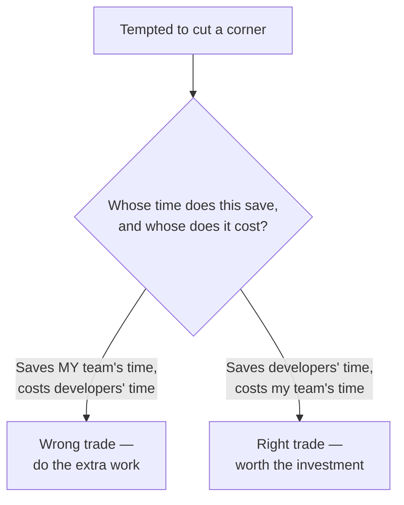
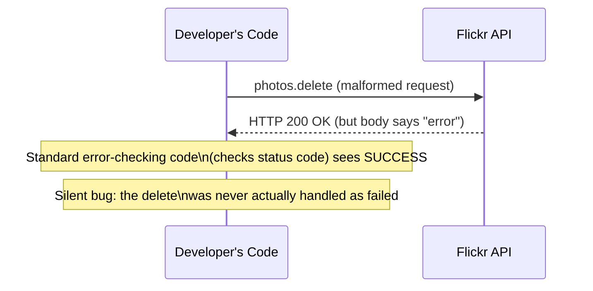
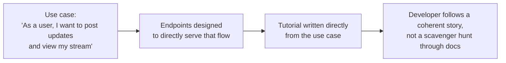
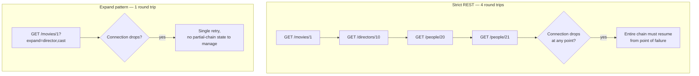
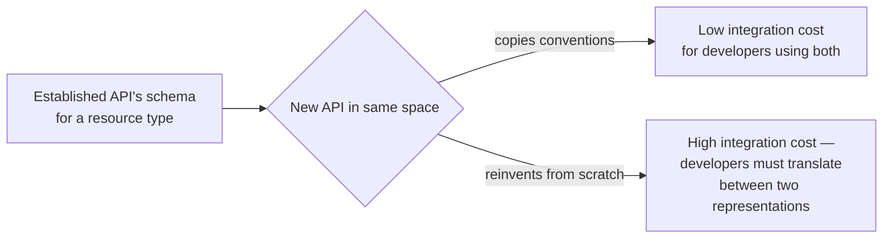
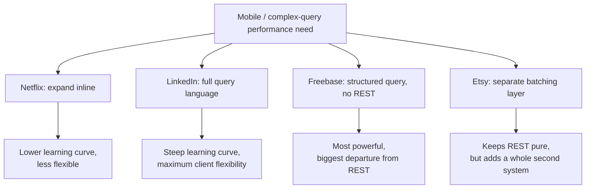
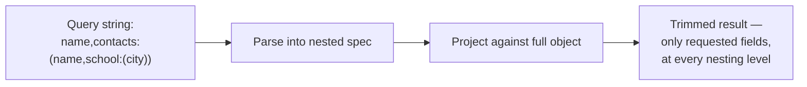
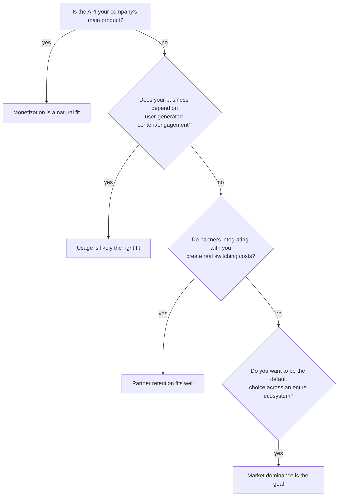
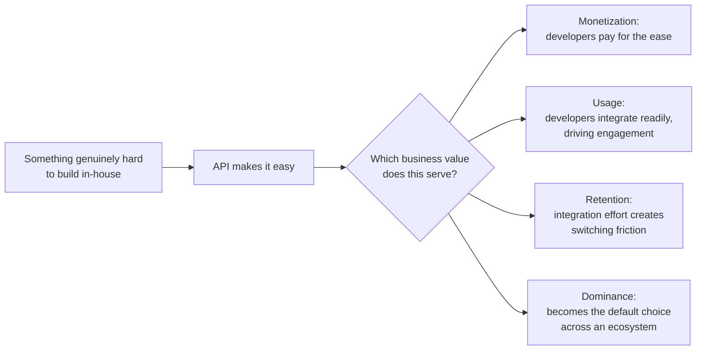

# Guiding Principles for API Design, and How I Think About API Business Value

I want to shift gears a bit for this post. I've spent a lot of this series on mechanics — HTTP verbs, status codes, scaling, architecture. This time I want to talk about the *judgment calls* that sit above all of that: the guiding principles I actually hold in my head while designing an API, and the harder question of how you figure out whether your API is even worth building in the first place, and how you'd know if it's working.

I built and tested two small pieces of code for this post because I think two of the ideas here — "REST isn't always the right call for every use case" and "business value has to translate into real metrics" — are much more convincing demonstrated than asserted. One measures the actual cost, in real network round trips, of strict REST versus an "expand" pattern like Netflix's. The other is a working nested field-selection query parser in the spirit of what LinkedIn built. Both are below, with real output.

---

## Table of Contents

1. [Don't Surprise Your Users](#part-1)
2. [The Flickr Cautionary Tale, Concretely](#part-2)
3. [Don't Make Me Think](#part-3)
4. [Focus on Use Cases, Not Just Endpoints](#part-4)
5. [The Mobile Use Case, Tested](#part-5)
6. [Copy Successful APIs](#part-6)
7. [REST Is Not Always Best](#part-7)
8. [Four Ways to Handle "REST Doesn't Fit This Use Case"](#part-8)
9. [A Working Field-Selection Query Language](#part-9)
10. [Focus on the Developer Experience](#part-10)
11. [Defining Business Value](#part-11)
12. [Turning Business Value Into Real Metrics](#part-12)
13. [Mapping Business Value to Use Cases](#part-13)
14. [Closing Thoughts](#part-14)

---

<a id="part-1"></a>
## 1. Don't Surprise Your Users

I want to start with the principle I think is easiest to state and hardest to actually hold onto under deadline pressure: **don't surprise your users.** Developers are your customers — even your internal developers, even when your API doesn't produce revenue directly. I think the honest test is this: would you cut this corner on your paid, revenue-producing product? If not, don't cut it on the API either, just because the API isn't the thing directly generating money.

The trap I've seen play out repeatedly: it would genuinely be easier, from the API team's side, to use `POST` for every write operation — creates, updates, deletes, all funneled through one verb. That's less code to write and fewer edge cases to think through. But it's a real cost shifted onto every developer consuming the API, who now has to learn your bespoke convention instead of relying on the one they already know from every other REST API they've touched.

> **Note:** I think the right question to ask, every time you're tempted to cut a corner: *whose time am I spending to save my own?* If the answer is "my developer customers' time," that's the wrong trade, even when it's the faster one for my own team today.



---

<a id="part-2"></a>
## 2. The Flickr Cautionary Tale, Concretely

I think Flickr's API is the single clearest real-world illustration of what happens when you deviate from convention without a strong enough reason. Flickr called its API RESTful (later softened to "REST-like"), but it's really a method-based, action-oriented API wearing REST's branding.

| Flickr's Actual Pattern | What True REST Would Look Like |
|---|---|
| `GET /rest/?method=flickr.activity.userPhotos` | `GET /rest/activity/userPhotos` |
| `POST /rest/?method=flickr.favorites.add` | `POST /rest/favorites` |
| `POST /rest/?method=flickr.favorites.remove` | `DELETE /rest/favorites/:id` |
| `POST /rest/?method=flickr.photos.delete&photo_id=value` | `DELETE /rest/photos/:id` |

Notice the pattern: every single call hits the *same* base URL, and the actual operation is buried in a `method` query parameter instead of being expressed through the URI and HTTP verb the way REST convention expects. That means standard REST client libraries — the ones a developer already has, already trusts, already knows how to debug — simply don't work cleanly against this API. Every developer touching Flickr has to write special-case code just for Flickr, instead of reusing patterns that work everywhere else.

### The error handling compounds the problem

Flickr's API doesn't use standard HTTP status codes for failures. A failed call still comes back with a `2XX` (success) status code, with the actual error embedded in the response body instead. That's a genuinely dangerous antipattern — any client library or monitoring tool that checks the HTTP status code alone (which is the entire point of having status codes) will report the call as successful even when it failed.



> **Caution:** I think this is the single most instructive part of the Flickr story: it's not just "nonstandard is annoying." A `2XX` status on an actual failure is actively *dangerous*, because it defeats the entire error-checking mechanism most HTTP client code relies on by default. Developers who don't specifically know to inspect the body of every "successful" Flickr response will silently miss real failures.

> **Note:** I think the saddest part of this story is that Flickr can't easily fix it anymore. A true REST overhaul would be a genuinely breaking change for every existing client — exactly the versioning cost I covered in an earlier post, where the first version's design choices echo for years. Flickr made this decision early, and now it's stuck with it indefinitely, because the migration cost for its entire developer base outweighs the ongoing cost of staying inconsistent. That's a strong argument for getting this right *before* you have real adoption, not after.

---

<a id="part-3"></a>
## 3. Don't Make Me Think

I like borrowing this phrase from web usability writing, because it applies to API design almost without modification. The test: does a developer have to stop and puzzle over what your API is doing, or does it behave the way they already expect from every other well-designed API they've used?

A specific trap I want to call out: **don't expose your backend database schema as your API.** Your internal data model was optimized for your storage and query needs, not for the experience of an external developer. I've seen APIs that are essentially a thin JSON wrapper over raw database tables — foreign keys as opaque IDs, internal-only status enums, columns that only make sense in the context of your own backend logic. That's optimizing for the wrong audience.

> **Note:** I think of this as the API-layer version of the "APIs as side products" problem I covered when writing about API First. If your API is just your database with a JSON coat of paint, you haven't actually designed an interface — you've just exposed your implementation and called it one.

---

<a id="part-4"></a>
## 4. Focus on Use Cases, Not Just Endpoints

I genuinely believe this is the single highest-leverage habit in API design: **describe the workflow a developer wants to accomplish, in plain language, before you design a single endpoint.** I like the classic agile framing here — "As an X, I want to Y, so that I can Z" — because it forces you to name the actor, the action, and the *reason*, not just the technical operation.

A use case isn't the same thing as an endpoint list. "As a Twitter user, I want to post updates and view my message stream, so I can share information and keep up with people I follow" is a use case. `POST /statuses` and `GET /timeline` are the endpoints that *implement* it — but if you design the endpoints first and try to back-fill the use case, you tend to end up with a technically complete but practically awkward API, because nothing forced you to think about the actual sequence a developer needs to follow.



> **Note:** I've found use cases genuinely useful at *every* stage — not just design. They tell you what to build first (release incrementally around specific use cases rather than trying to ship "the whole API" at once), they become your tutorials almost verbatim once written down clearly, and they give you a natural way to communicate to developers exactly what kind of client you expect them to build.

---

<a id="part-5"></a>
## 5. The Mobile Use Case, Tested

Mobile deserves its own section because I think it's the single use case most likely to force you away from strict, one-resource-per-call REST — and I wanted to actually measure why, rather than just assert it.

The concrete requirements mobile imposes:

| Requirement | Why |
|---|---|
| Single call per screen | Mobile devices don't parallelize well, and each round trip adds real latency |
| Minimal data size | Bandwidth is genuinely constrained, especially on cellular connections |
| Ability to specify exactly which fields are needed | Every unnecessary byte costs real time and battery |
| Resilience to dropped connections | A user walking into an elevator or a tunnel can lose connectivity mid-request at any moment |

I built a small simulation to actually measure the cost difference between "strict REST: one call per resource" and "expand pattern: bundle related resources into one call" — using a simplified movie/director/cast lookup, the same shape as the Netflix example I've referenced elsewhere in this series.

```python
DB = {
    "movies": {1: {"title": "Arrival", "director_id": 10, "cast_ids": [20, 21]}},
    "directors": {10: {"name": "Denis Villeneuve"}},
    "people": {20: {"name": "Amy Adams"}, 21: {"name": "Jeremy Renner"}},
}

CALL_LATENCY = 0.05  # simulate 50ms per network round trip

class APIClient:
    def __init__(self):
        self.call_count = 0

    def _call(self, resource, table, key):
        self.call_count += 1
        time.sleep(CALL_LATENCY)
        return DB[table][key]

    # Strict REST: one call per resource
    def get_movie_strict_rest(self, movie_id):
        movie = self._call("movie", "movies", movie_id)
        director = self._call("director", "directors", movie["director_id"])
        cast = [self._call("person", "people", pid) for pid in movie["cast_ids"]]
        return {"movie": movie, "director": director, "cast": cast}

    # Expand pattern: one call, server assembles everything
    def get_movie_expanded(self, movie_id):
        self.call_count += 1
        time.sleep(CALL_LATENCY)  # still one round trip, no matter what's bundled inside
        movie = DB["movies"][movie_id]
        director = DB["directors"][movie["director_id"]]
        cast = [DB["people"][pid] for pid in movie["cast_ids"]]
        return {"movie": movie, "director": director, "cast": cast}
```

Running both against the exact same data (one movie, one director, two cast members):

```
Strict REST: 4 calls, 201ms
Expanded API: 1 call, 50ms

Speedup: 4.0x fewer round trips
Data returned is identical either way: True
```

Four round trips versus one, for *identical data*. And that last line matters — the expand pattern isn't giving the client less information or a worse experience; it's giving the exact same data with a quarter of the network overhead. On a real mobile connection, where each round trip carries real latency (not the simulated 50ms here, but often 200ms+ on a weak connection) plus real risk of the connection dropping mid-sequence, that 4x difference compounds into a genuinely different user experience — the strict-REST version has four separate chances to fail if the user walks into an elevator partway through, while the expanded version has exactly one.



> **Caution:** I want to be fair to strict REST here — this isn't an argument that expand patterns are universally better. A client that only ever needs the movie title, never the director or cast, pays a real cost under the expand pattern too: a larger default payload than it needed. The right call depends on your actual use case's access pattern, which is exactly why "focus on use cases" (the previous section) has to come *before* you decide how literally to apply REST purity.

---

<a id="part-6"></a>
## 6. Copy Successful APIs

I think there's a strange, mostly unfounded fear I've seen among API teams: that sharing your resource schema publicly gives away some kind of competitive advantage. I don't buy this, and I don't think the evidence supports it either. Once your API is live, the schema is discoverable by anyone who calls it — it was never actually secret. Your real competitive advantage is the quality of your underlying data and the algorithms that produce your responses, not the *shape* of the JSON you happen to return.

> **Note:** There's a real, concrete upside to converging on shared conventions across an industry — if a "fitness" API's `steps`, `weight`, and `calories_burned` fields look similar to an established platform's, a developer integrating both APIs together does dramatically less translation work. Consistency doesn't just help inside your own API (as I covered when discussing that principle in an earlier post) — it helps *across* an entire ecosystem of related APIs, which lowers the barrier to entry for anyone trying to build something that spans multiple providers.



> **Caution:** "Copy successful APIs" doesn't mean "copy blindly." Go back to the Flickr example — you wouldn't want to model a new API's conventions after Flickr's method-based approach just because Flickr is well-known and successful in its own right. Evaluate what you're borrowing against the same principles I've laid out in this whole series, not just against the borrowed API's popularity.

---

<a id="part-7"></a>
## 7. REST Is Not Always Best

I've hedged carefully throughout this series, calling most of what I write about "REST-based" rather than strictly "REST," and I want to be explicit about why here. Strict REST — exactly one resource per call, pure noun-based addressing, no bundling — is an excellent *default*, but it's a default, not a law of nature. When strict REST genuinely conflicts with a real use case (mobile being the clearest example, which I just measured above), usability should win.

> **Note:** I want to be careful not to contradict the "don't surprise your users" principle from earlier in this post. The resolution I use: deviating from strict REST for a *well-communicated, well-documented, genuinely use-case-driven reason* is different from deviating out of laziness or inconsistency. Flickr's problem wasn't that it deviated from REST — plenty of great APIs do, for good reasons. Flickr's problem was deviating *without* a coherent alternative convention and without adequate documentation to compensate.

---

<a id="part-8"></a>
## 8. Four Ways to Handle "REST Doesn't Fit This Use Case"

I think it's genuinely useful to look at how different companies solved the exact same underlying tension — strict REST's overhead versus mobile/complex-query performance needs — because they reached meaningfully different solutions, each defensible given their specific constraints.

### Netflix: expand related resources inline

This is the pattern I tested above — a client can request a resource and explicitly ask for related resources to be expanded inline in the same response, rather than requiring separate follow-up calls. Netflix paired this with hypermedia links, so a client can programmatically discover what's expandable without needing to hardcode that knowledge.

### LinkedIn: a full nested query language

LinkedIn went further, building an explicit query language letting a client specify precisely which fields — down to arbitrarily nested sub-fields — it wants returned. I'll build and test a working version of this pattern in the next section.

### Freebase: no REST at all, one endpoint, structured queries

Freebase (since deprecated) didn't use REST conventions at all — every query hit the same endpoint, and the client sent a structured JSON object expressing exactly what it wanted, receiving back an object matching that same shape. Because it ran on a graph database under the hood, even genuinely complex nested queries returned in tens of milliseconds.

### Etsy: a separate batching system, kept apart from the core REST API

Etsy took a different structural approach: keep the core REST API strictly RESTful, but build a *separate* batching layer (BeSpoke) specifically for clients — mainly mobile — that need to bundle several logically related resources into one response. Etsy deliberately owns the exact shape of each batched endpoint, so a client can't request an arbitrary ad hoc bundle; new batch endpoints require going back to Etsy.

| Approach | Core API Stays Pure REST? | Client Flexibility | Complexity Cost |
|---|---|---|---|
| Netflix (expand) | Mostly — expansion is additive | Medium — client picks what to expand | Low-medium |
| LinkedIn (query language) | No — every call requires field specification | High — client controls exact shape | High, steep learning curve |
| Freebase (structured query) | No — no REST conventions at all | Very high — arbitrary structured queries | High, but exceptionally fast |
| Etsy (separate batching layer) | Yes — REST API untouched | Low — API owner controls bundle shapes | Medium — a second system to maintain |



> **Note:** I don't think there's a single right answer among these four. The right choice depends on how complex your actual data relationships are (Freebase's graph structure genuinely warranted a different approach than a simple movie/director/cast lookup would), how much learning-curve cost your developer base can absorb, and how much ongoing engineering investment you're willing to make in a second system alongside your core REST API.

---

<a id="part-9"></a>
## 9. A Working Field-Selection Query Language

I wanted to actually build a minimal version of LinkedIn's nested field-selection pattern, because I think "specify exactly which fields you want, including nested sub-objects" is powerful enough to be worth understanding at the implementation level, not just conceptually.

The syntax I built: `"name,contacts:(name,school:(city))"` — meaning "give me the top-level `name` field, plus each contact's `name`, plus each contact's school's `city` only."

```python
import re

def parse_field_spec(spec: str):
    """Parses 'name,contacts:(name,school:(city))' into a nested dict of wanted fields."""
    tokens = re.findall(r'[a-zA-Z_]+|[:(),]', spec)
    def parse(tokens, idx):
        result = {}
        while idx < len(tokens):
            name = tokens[idx]
            idx += 1
            if idx < len(tokens) and tokens[idx] == ":":
                idx += 2  # skip ':' and '('
                sub, idx = parse(tokens, idx)
                result[name] = sub
                idx += 1  # skip ')'
            else:
                result[name] = True
            if idx < len(tokens) and tokens[idx] == ",":
                idx += 1
            else:
                break
        return result, idx
    parsed, _ = parse(tokens, 0)
    return parsed


def project(data, field_spec):
    """Applies a parsed field spec to trim `data` down to only requested fields."""
    if isinstance(data, list):
        return [project(item, field_spec) for item in data]
    result = {}
    for field, sub in field_spec.items():
        if field not in data:
            continue
        result[field] = data[field] if sub is True else project(data[field], sub)
    return result
```

Testing it against a realistically nested user record — a user with two contacts, each with their own school information:

```python
FULL_USER = {
    "id": 1,
    "name": "Grace Hopper",
    "email": "grace@example.com",
    "contacts": [
        {"id": 2, "name": "Ada Lovelace", "school": {"name": "N/A", "city": "London"}},
        {"id": 3, "name": "Alan Turing", "school": {"name": "King's College", "city": "Cambridge"}},
    ],
}
```

Running the query `"name,contacts:(name,school:(city))"` against it:

```
Parsed spec: {'name': True, 'contacts': {'name': True, 'school': {'city': True}}}

Query: name,contacts:(name,school:(city))
Result: {'name': 'Grace Hopper', 'contacts': [{'name': 'Ada Lovelace', 'school': {'city': 'London'}}, {'name': 'Alan Turing', 'school': {'city': 'Cambridge'}}]}
```

Compare that trimmed result to the full untrimmed record — notice `id` and `email` are gone from the top level, and `id` and the school's `name` field are gone from each nested contact, exactly as requested:

```
Full: {'id': 1, 'name': 'Grace Hopper', 'email': 'grace@example.com', 'contacts': [{'id': 2, 'name': 'Ada Lovelace', 'school': {'name': 'N/A', 'city': 'London'}}, ...]}
```



> **Note:** Notice how much work this parser is doing compared to a flat `?fields=name,size` filter (which I tested in an earlier post on HTTP fundamentals). A flat filter only ever trims the *top level*; this recursive version can reach arbitrarily deep into nested structures. That extra power is exactly why LinkedIn's approach has a steeper learning curve than a simple query parameter — the client has to understand nesting syntax, not just a comma-separated list.

> **Caution:** I want to be honest about the real cost of this pattern, mirroring what the source material makes clear: because every call requires explicit field specification with no default full representation, developers have to actively *learn* which fields exist and how to request them before they can get a useful response at all. That's a genuinely steeper onboarding curve than a resource that just returns something reasonable by default. If you build something like this, invest disproportionately in documentation and example queries — the "Getting Started" guide carries even more weight here than usual.

---

<a id="part-10"></a>
## 10. Focus on the Developer Experience

I've said this in different words throughout this series, but I want to restate it specifically in the context of guiding principles: your API's success is determined at least as much by what happens *after* release — documentation, support, consistency maintained over time — as by the initial design decisions.

### Share more than instinct suggests

I've become a real believer in radical transparency with developers: share your business value, share your success metrics, share your schema model even while it's still under construction. I think the instinct to withhold this ("developers just want the docs, they don't care about our business reasoning") is usually wrong. Telling developers *why* you built something signals that you're serious about the platform's future — which matters enormously when someone is deciding whether to invest real engineering time on top of you.

> **Note:** Even when you genuinely can't share the underlying business reason for a decision (competitive sensitivity, legal constraints, whatever it might be), *tell developers that a change happened and that it was deliberate*, rather than leaving them to conclude it was arbitrary or could be reversed on a whim. An unexplained silent change reads as instability; an acknowledged-but-unexplained change reads as a company that at least knows what it's doing.

### Consistency remains the throughline

I keep returning to this principle across every post in this series because it keeps being the right lens: a user retrieved by drilling into an organization should look identical to the same user retrieved via search. Status codes should behave the same way across every resource type. If you support an expand or query mechanism, it needs to work the same way everywhere it's offered, not slightly differently per endpoint depending on which team built it.

### Documentation should tell a story, not just describe fields

I think this is the most underrated point in the whole chapter I'm drawing from here. Most API reference documentation answers "how does this work?" — but the question developers actually arrive with is "what can I do with this, and how do I do it?" Those are genuinely different questions, and documentation that only answers the first one leaves new developers stranded.

| What Reference Docs Answer | What New Developers Actually Need First |
|---|---|
| "This endpoint accepts these parameters and returns this shape" | "What can I build with this API?" |
| "Here is the complete list of fields" | "What's the smallest thing I can do to see it work?" |
| Isolated, alphabetized endpoint descriptions | A coherent story: authenticate → make one meaningful call → see a real result |

> **Note:** I'd treat a "Getting Started" narrative — genuinely answering "do I need auth, how do I get credentials quickly, what does one real call look like, how do I make that call in a common library" — as non-negotiable, regardless of how skilled you assume your audience is. I've watched genuinely excellent engineers get stuck simply because they'd never worked with a web API before; assuming baseline familiarity you haven't actually verified is a real, recurring failure mode.

---

<a id="part-11"></a>
## 11. Defining Business Value

Now I want to shift from design principles to something I think gets skipped far too often: figuring out, concretely, *why* your API exists, in terms your executive team would actually find convincing.

I like the elevator-pitch test I've mentioned before in this series: if your CEO asked you in an elevator why you have an API, could you answer in one clear sentence tied to something the business actually cares about? "Developer engagement" fails this test. "Establish market leadership by becoming the default integration point for consumer device manufacturers" passes it.

Four business value models come up repeatedly:

| Business Value | When It Fits | Example |
|---|---|---|
| Monetization | The API *is* the product | Twilio — you pay per call |
| Usage | Your business depends on user-generated content/engagement | Twitter, Facebook — more activity means more ad value |
| Partner retention | Integration cost creates switching friction | FedEx — once integrated, switching shipping providers is expensive |
| Market dominance | You want to be the default choice across an entire ecosystem | Netflix — the default streaming integration for device manufacturers |

> **Caution:** I want to flag something the source material is honest about, and I think it's genuinely important: monetization is often the *wrong* goal when your API is supporting a main product rather than being the product itself. If you charge for API access while your core business is something else entirely, you risk actively suppressing the adoption that would have strengthened your main product. Pick the value model that matches what your API's actual relationship to your business is — don't default to monetization just because it feels like the most obviously "businessy" answer.



---

<a id="part-12"></a>
## 12. Turning Business Value Into Real Metrics

This is where I think most teams stumble, even after correctly identifying their business value. The default, easy-to-reach-for metrics — number of API keys issued, raw call volume — genuinely don't demonstrate business value, no matter how compelling they feel internally to the API team.

| Weak Metric | Why It's Weak | Stronger Alternative Tied to Business Value |
|---|---|---|
| Number of developer keys issued | Most keys sit unused after initial signup | Number of *actively used* keys with sustained traffic |
| Raw API call volume | Includes trial/testing traffic that never converts | Revenue-per-customer, or high-volume-account count (monetization) |
| "Number of applications registered" | Doesn't distinguish abandoned projects from real integrations | Percentage of applications still active 6–12 months later (partner retention) |

I like laying this out per business-value model, because "the right metric" genuinely differs depending on what you're actually trying to demonstrate:

| Business Value | Weak Metric | Stronger Metric |
|---|---|---|
| Monetization | Total calls per month | Trial accounts converted to paying customers; high-revenue account count |
| Usage | Signups | Platform writes as a percentage of total system updates; sign-in activity via the API |
| Partner retention | Number of integrations built | Percentage of integrations still active 6–12 months out |
| Market dominance | Developer signups | Device/platform reach relative to competitors; engagement time on integrated platforms |

> **Note:** I'd specifically push back on "number of calls" as a headline metric for almost any business value model, because it doesn't distinguish a real, sustained integration from a developer who tried your API once at a hackathon and never came back. The *quality* signal — does usage persist, does it convert, does it correlate with the actual business outcome you named — is what your executive team actually needs to see to keep funding the platform.

---

<a id="part-13"></a>
## 13. Mapping Business Value to Use Cases

Once you know your business value and your metrics, the last step is generating use cases specifically designed to move those metrics — not just "use cases in general."

I think the pattern that shows up most clearly across real companies: **making something hard genuinely easy is the core value proposition, regardless of which business-value model you're pursuing.** A company built around monetization (Twilio simplifying telephony, SendGrid simplifying transactional email) succeeds because it takes something painful to build in-house and makes it trivially easy to integrate instead. A company built around usage (Twitter, making it effortless to write to and read from an activity stream) succeeds for the same underlying reason, just applied to a different value model.



> **Note:** I think this is genuinely the most transferable insight in this whole post: whatever your specific business value model is, the underlying mechanism is almost always the same — find something painful, make it easy, and the specific way you capture that value (direct payment, engagement, retention, or ecosystem dominance) is really a downstream business-model decision layered on top of that same core act of usefulness.

---

<a id="part-14"></a>
## 14. Closing Thoughts

If I compress this whole post down to what I want to remember:

1. **"Don't surprise your users" is a discipline, not a one-time decision.** Every corner-cutting temptation deserves the same question: whose time am I actually spending?
2. **Flickr's real lesson isn't "avoid method-based APIs"** — it's that combining non-standard conventions with non-standard error handling compounds into something genuinely dangerous, not just inconvenient, and that the fix becomes harder to ship the longer real adoption exists.
3. **Use cases should come before endpoints**, every time, and I tested exactly why: a strict-REST implementation of a real mobile use case cost 4x the round trips of an expand-pattern implementation, for identical data.
4. **REST is the right default, not a law** — Netflix, LinkedIn, Freebase, and Etsy all solved the same underlying tension in genuinely different, defensible ways, and I built a working version of LinkedIn's nested field-selection approach to show exactly how much more powerful (and how much more learning-curve cost) that pattern carries compared to a flat filter.
5. **Documentation should answer "what can I do" before "how does this work"** — the reference-doc-first instinct most teams default to answers the wrong question for a new developer's actual first need.
6. **Business value has to survive the elevator-pitch test**, and the metrics you track have to actually trace back to that value — "number of API keys issued" almost never does, no matter how good it looks on an internal dashboard.

The thread connecting this post to the rest of the series: every principle here is really an instance of the same underlying commitment — respecting the time and trust of the people building on your API, and being honest with yourself (and your executive team) about what your API is actually *for*. Design principles without a clear business rationale drift; business rationale without disciplined design principles produces something technically justified but genuinely unpleasant to build on. You need both, held at the same time, for the whole thing to actually work.

Thanks for reading — if you'd like a deeper dive into any single piece here (building out a fuller version of the nested query parser, or a longer walkthrough of metric design for a specific business model), let me know and I'll take a dedicated post at it.
