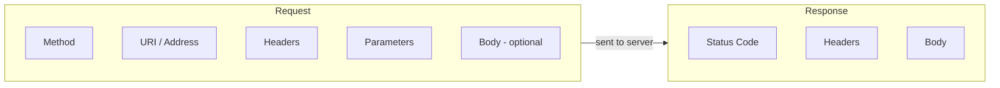
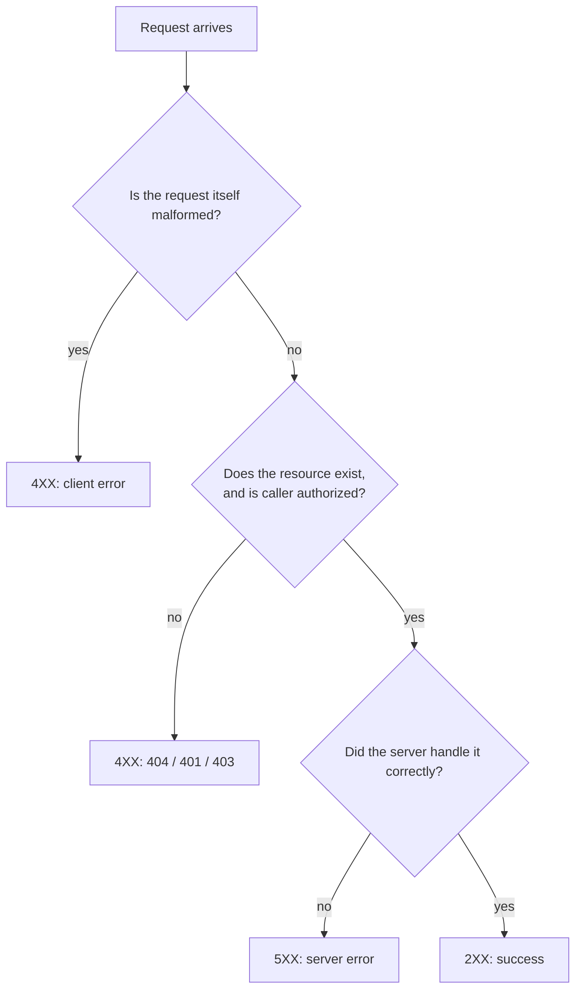
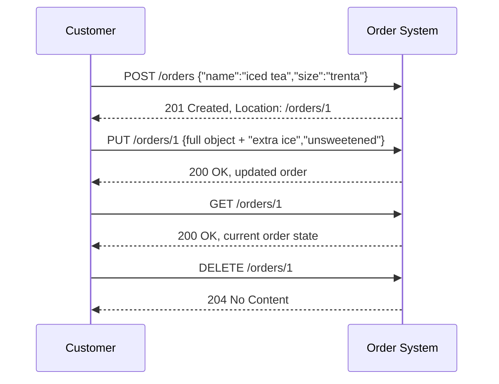
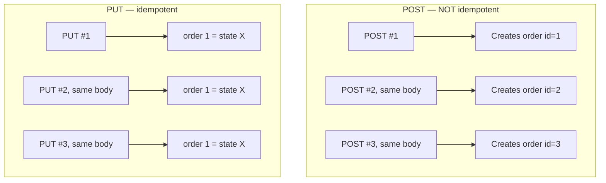
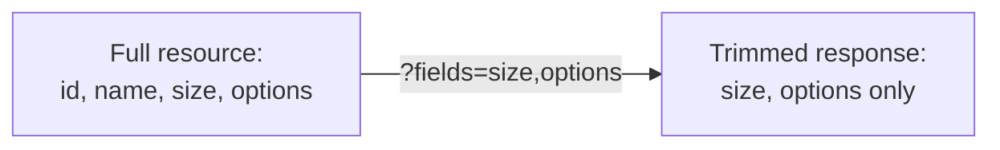
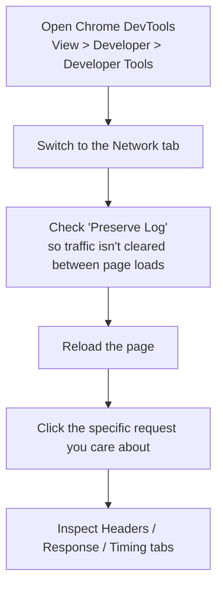

# HTTP Fundamentals for REST APIs: What's Actually Happening on the Wire

I want to go one level deeper than I have in previous posts in this series. I've talked a lot about design philosophy, developer experience, and architecture — but none of that matters if you don't have a genuinely solid grip on what's actually happening inside a single HTTP transaction. This post is my attempt to lay that foundation properly: addressability, status codes, verbs, headers, parameters, and idempotency — the pieces that make REST work at all.

I built a small "orders" API specifically for this post (an iced tea ordering system, in the spirit of a Starbucks order) and ran real, tested `curl` sequences against it to demonstrate the concepts that are hardest to grasp just by reading about them — especially idempotency, which I think is one of the most misunderstood ideas in API design. Every output shown below is real, not reconstructed from memory.

---

## Table of Contents

1. [The Anatomy of an HTTP Transaction](#part-1)
2. [Addressability: Everything Needs a Unique Identifier](#part-2)
3. [Status Codes: The Five Families](#part-3)
4. [The Body: Where the Actual Content Lives](#part-4)
5. [HTTP Verbs Mapped to a Real Order Flow](#part-5)
6. [Idempotency, Tested and Proven](#part-6)
7. [Headers vs. Parameters](#part-7)
8. [Filtering and Field Selection, Tested](#part-8)
9. [REST Best Practices Built on These Fundamentals](#part-9)
10. [Inspecting Traffic Yourself](#part-10)
11. [Troubleshooting and Defensive Coding](#part-11)
12. [Closing Thoughts](#part-12)

---

<a id="part-1"></a>
## 1. The Anatomy of an HTTP Transaction

Every single HTTP interaction, no matter how complex the system behind it, reduces to exactly two messages: a request from client to server, and a response back. There's no persistent connection state beyond that single exchange — each request/response pair stands alone.



I think the cleanest way to internalize this is: **the request says what you want and where; the response says what happened and with what.** Everything else — headers, parameters, bodies — is detail layered onto that basic shape.

---

<a id="part-2"></a>
## 2. Addressability: Everything Needs a Unique Identifier

Every HTTP request targets a specific resource, identified by a URI (uniform resource indicator). A URI has two parts: the server and the path.

| Full URL | Server | Path |
|---|---|---|
| `http://www.google.com/` | `www.google.com` | `/` |
| `http://gmail.com/` | `gmail.com` | `/` |
| `http://irresistibleapis.com/demo/` | `irresistibleapis.com` | `/demo/` |

> **Note:** I think of the URI as the single most important design decision you make for any given resource, because unlike almost everything else in your API, changing it later is a genuinely disruptive breaking change — every client that stored or constructed that address has to be updated. I covered exactly this trade-off (URI-based versioning vs. header-based) in an earlier post on managing change, and addressability is the root reason URIs carry that weight.

---

<a id="part-3"></a>
## 3. Status Codes: The Five Families

I like the plain-English framing for the five status code families, because it's honestly more useful day-to-day than memorizing the formal RFC language:

| Range | Plain-English Meaning | Formal Meaning |
|---|---|---|
| 2XX | "Cool!" | Success |
| 3XX | "Ask that guy over there" | Redirect |
| 4XX | "You messed up" | Client error |
| 5XX | "We messed up" | Server error |



A few specific 4XX codes are worth knowing cold, because they map onto genuinely distinct failure reasons that deserve genuinely distinct handling:

| Code | Meaning | Common Cause |
|---|---|---|
| 400 | Malformed request | Missing or badly formatted parameters/headers |
| 401 | Authentication error | The server doesn't know who's asking — bad or missing credentials |
| 403 | Authorization error | The server knows who's asking, but they're not allowed to do this |
| 404 | Not found | The resource doesn't exist |
| 405 | Method not allowed | You sent a `PUT` where the API expects a `POST`, or similar |

> **Note:** I find the 401-vs-403 distinction gets muddled constantly, so here's the mental shortcut I use: 401 is "I don't know who you are" (like a missing or invalid driver's license), 403 is "I know exactly who you are, and the answer is still no." Conflating these in your own API design makes debugging genuinely harder for developers, because the fix for each is completely different — 401 means "check your credentials," 403 means "you need different permissions entirely."

> **Note:** As a fun aside — status code 418 ("I'm a teapot") is a real, if joking, part of HTTP history. The W3C included it in an April Fools' RFC for a "coffeepot control protocol" back in 1998, and it's technically still a valid HTTP status code today. I don't recommend building your error handling around it, but it's a nice reminder that even standards bodies have a sense of humor occasionally.

---

<a id="part-4"></a>
## 4. The Body: Where the Actual Content Lives

The body carries the substantive payload of a request or response. For `GET` requests, there's normally no request body at all — you're not sending anything, just asking for something. For `POST` and `PUT`, the request body carries the data the server needs to create or update the resource. The response body, for a successful `GET`, carries the resource's current representation.

| Operation | Request Body? | Response Body? |
|---|---|---|
| `GET` | No | Yes — the resource |
| `POST` | Yes — the new resource's data | Yes — the created resource |
| `PUT` | Yes — the full replacement data | Yes (or empty, depending on convention) |
| `DELETE` | No | Usually empty |

---

<a id="part-5"></a>
## 5. HTTP Verbs Mapped to a Real Order Flow

I built an actual "orders" API — an iced tea ordering system — specifically to walk through each verb against something concrete rather than abstract. Here's the mapping I built it around:

| CRUD Action | HTTP Verb | Address |
|---|---|---|
| Order a new drink | `POST` | `/orders` (the collection) |
| Update an existing order | `PUT` | `/orders/1` (the specific item) |
| Check the current order | `GET` | `/orders/1` |
| Cancel the order | `DELETE` | `/orders/1` |



Here's the real Flask implementation I built to actually run this flow, rather than just describe it:

```python
from flask import Flask, jsonify, request

app = Flask(__name__)
orders = {}
next_id = 1

@app.route("/api/v1.0/orders", methods=["GET", "POST"])
def orders_collection():
    global next_id
    if request.method == "GET":
        name_filter = request.args.get("name")
        size_filter = request.args.get("size")
        results = []
        for oid, order in orders.items():
            if name_filter and order.get("name") != name_filter:
                continue
            if size_filter and order.get("size") != size_filter:
                continue
            results.append({"id": oid, **order})
        return jsonify(results), 200

    elif request.method == "POST":
        data = request.get_json(silent=True)
        if not data or "name" not in data or "size" not in data:
            return jsonify({
                "error": "missing_parameter",
                "message": "Request must include 'name' and 'size'."
            }), 400
        oid = next_id
        orders[oid] = {"name": data["name"], "size": data["size"], "options": []}
        next_id += 1
        resp = jsonify({"id": oid, **orders[oid]})
        resp.status_code = 201
        resp.headers["Location"] = f"/api/v1.0/orders/{oid}"
        return resp
```

> **Note:** Notice the `Location` header on a successful `POST` — that's not decoration, it's genuinely useful. It tells the client exactly where the resource it just created now lives, without them having to guess or construct the URL themselves from the response body.

---

<a id="part-6"></a>
## 6. Idempotency, Tested and Proven

This is the concept I think gets the least intuitive treatment in most API writing, so I wanted to actually *prove* it rather than just assert it. Here's the definition: **an idempotent operation produces the exact same result no matter how many times you repeat it.** `GET`, `PUT`, and `DELETE` are supposed to be idempotent. `POST` is explicitly *not* — every `POST` is a new creation.

### Proving POST is not idempotent

I sent the exact same `POST` request — an iced tea, size trenta — three times in a row against my running server:

```bash
$ curl -H "Content-Type: application/json" -X POST -d '{"name":"iced tea","size":"trenta"}' \
    http://127.0.0.1:5066/api/v1.0/orders
{"id":1,"name":"iced tea","options":[],"size":"trenta"}

$ curl -H "Content-Type: application/json" -X POST -d '{"name":"iced tea","size":"trenta"}' \
    http://127.0.0.1:5066/api/v1.0/orders
{"id":2,"name":"iced tea","options":[],"size":"trenta"}

$ curl -H "Content-Type: application/json" -X POST -d '{"name":"iced tea","size":"trenta"}' \
    http://127.0.0.1:5066/api/v1.0/orders
{"id":3,"name":"iced tea","options":[],"size":"trenta"}
```

Identical request body, three completely different results — `id: 1`, `id: 2`, `id: 3`. Confirming with a `GET` on the full list:

```bash
$ curl http://127.0.0.1:5066/api/v1.0/orders
[{"id":1,"name":"iced tea","options":[],"size":"trenta"},
 {"id":2,"name":"iced tea","options":[],"size":"trenta"},
 {"id":3,"name":"iced tea","options":[],"size":"trenta"}]
```

Three separate orders now exist in the system. That's `POST` behaving exactly as it should — every call is a *new* creation, by design.

### Proving PUT is idempotent

Now the same experiment, but with `PUT` against order `1` — sending the exact same full update three times in a row:

```bash
$ curl -H "Content-Type: application/json" -X PUT \
    -d '{"name":"iced tea","size":"trenta","options":["extra ice","unsweetened"]}' \
    http://127.0.0.1:5066/api/v1.0/orders/1
{"id":1,"name":"iced tea","options":["extra ice","unsweetened"],"size":"trenta"}

$ curl -H "Content-Type: application/json" -X PUT \
    -d '{"name":"iced tea","size":"trenta","options":["extra ice","unsweetened"]}' \
    http://127.0.0.1:5066/api/v1.0/orders/1
{"id":1,"name":"iced tea","options":["extra ice","unsweetened"],"size":"trenta"}

$ curl -H "Content-Type: application/json" -X PUT \
    -d '{"name":"iced tea","size":"trenta","options":["extra ice","unsweetened"]}' \
    http://127.0.0.1:5066/api/v1.0/orders/1
{"id":1,"name":"iced tea","options":["extra ice","unsweetened"],"size":"trenta"}
```

Every single response is byte-for-byte identical. That's the whole idea of idempotency, demonstrated rather than just claimed: no matter how many times a client retries this exact `PUT`, the server ends up in the same final state.



> **Caution:** Idempotency matters far beyond a theoretical nicety — it's the entire reason retry logic is safe. If a client's connection drops right after sending a `PUT` and it's genuinely unsure whether the server received it, safely retrying is trivial: the worst case is the exact same update landing twice, which changes nothing. Retry that same uncertainty with a `POST`, though, and you risk creating duplicate resources — exactly the kind of bug that shows up as "why does this customer have three identical orders?" three weeks after a flaky network day. I covered exponential back-off retry patterns for SDKs in an earlier post; idempotency is precisely *why* automatic retries are safe to build for some verbs and dangerous to build blindly for others.

> **Note:** `PATCH` exists specifically for partial updates (changing just one field without resending the whole object), but as the source material I'm drawing from points out, it's inconsistently implemented across real-world APIs, and using it correctly requires the client to have a genuinely deep understanding of your data model's merge semantics. `PUT` with a full-object replacement is a much safer default to design around, even though it costs a slightly larger request body.

---

<a id="part-7"></a>
## 7. Headers vs. Parameters

I think the header-vs-parameter distinction is genuinely confusing the first time you encounter it, because both *can* carry similar-looking information. The distinction I've settled on: **headers describe context for the transaction as a whole; parameters describe specifics about the requested resource itself.**

The analogy I like: when you walk into a coffee shop in a country where you're not sure the staff speaks your language, you might address the cashier in your preferred language up front — that's like a header, setting context for the *entire* exchange. Asking specifically for "the Trenta, not the Venti" is more like a parameter — refining exactly what you want from *this specific* request.

### Common request headers

| Header | Example | Meaning |
|---|---|---|
| `Accept` | `application/json` | Preferred response format |
| `Accept-Language` | `en-US` | Preferred response language |
| `User-Agent` | `Mozilla/5.0 ...` | What kind of client is making the request |
| `Content-Length` | `128` | Size of the request body, for integrity verification |
| `Content-Type` | `application/json` | Format of the body being sent |

### Common response headers

| Header | Example | Meaning |
|---|---|---|
| `Content-Type` | `application/json` | Format of the response body |
| `Access-Control-Allow-Methods` | `GET, PUT, POST, DELETE` | Which HTTP methods this resource permits |
| `Access-Control-Allow-Origin` | `*` or a specific domain | Which origins are allowed to call this resource |

> **Note:** The `Accept` header can list multiple acceptable formats in priority order (e.g., `application/json, application/xml;q=0.9, */*;q=0.8`) — the server should honor the client's most-preferred format it can actually produce, falling back down the list. I'd treat honoring this correctly as part of respecting your developers' stated preferences, the same principle I discussed with content negotiation in my very first post on API design.

---

<a id="part-8"></a>
## 8. Filtering and Field Selection, Tested

Parameters, appended to the URI after a `?`, are how a client narrows down exactly what it wants — most commonly on `GET` requests. I tested both filtering (which items come back) and field selection (which fields of each item come back) against my running orders API.

### Filtering a collection

```bash
$ curl "http://127.0.0.1:5066/api/v1.0/orders?name=iced%20tea&size=trenta"
[{"id":1,"name":"iced tea","options":["extra ice","unsweetened"],"size":"trenta"}]
```

Out of several orders in the system (a trenta iced tea, a venti iced tea, and a trenta latte), only the one matching *both* filters — name `iced tea` **and** size `trenta` — comes back.

> **Note:** Notice `iced%20tea` in the URL — the space character has to be percent-encoded to travel safely inside a URI. Browsers do this automatically when you type into an address bar, but if you're building a client by hand (or generating URLs programmatically), you need to run values through a proper URL encoder yourself, or you risk the server misparsing your query string entirely.

### Field selection on a single resource

```bash
$ curl "http://127.0.0.1:5066/api/v1.0/orders/1?fields=size,options"
{"options":["extra ice","unsweetened"],"size":"trenta"}
```

The full order object has an `id`, `name`, `size`, and `options` — but I asked for only `size` and `options`, and that's exactly what came back, with `id` and `name` trimmed out entirely.



> **Note:** This kind of field-trimming is genuinely valuable for mobile clients specifically, where every byte of bandwidth and every millisecond of parse time is a real cost — I covered this exact use case when discussing mobile as a driving force behind API design decisions in an earlier post. Getting *only* what you need rather than the full object every time is a small feature with outsized real-world impact for exactly the clients most likely to be on unreliable connections.

### Errors, tested

I also wanted to confirm the API fails predictably rather than crashing when given bad input — sending a `POST` missing the required `size` field:

```bash
$ curl -H "Content-Type: application/json" -X POST -d '{"name":"mystery drink"}' \
    http://127.0.0.1:5066/api/v1.0/orders
{"error":"missing_parameter","message":"Request must include 'name' and 'size'."}
HTTP status: 400
```

And requesting an order that was never created:

```bash
$ curl http://127.0.0.1:5066/api/v1.0/orders/999
{"error":"order_not_found","message":"No order 999"}
HTTP status: 404
```

And finally, confirming `DELETE` genuinely removes the resource — deleting order `2`, then immediately trying to `GET` it:

```bash
$ curl -X DELETE http://127.0.0.1:5066/api/v1.0/orders/2
[empty body]
DELETE status: 204

$ curl http://127.0.0.1:5066/api/v1.0/orders/2
{"error":"order_not_found","message":"No order 2"}
GET after delete status: 404
```

`204 No Content` on the successful delete (no body needed — there's nothing left to describe), followed by a clean `404` confirming the resource is actually gone. Every failure mode I tested returned a predictable status code paired with a machine-readable error and a human-readable message — exactly the error design principles I covered in my very first post in this series, now demonstrated against a real, running server instead of just described in the abstract.

---

<a id="part-9"></a>
## 9. REST Best Practices Built on These Fundamentals

Once you actually understand the HTTP fundamentals above, REST best practices stop feeling like arbitrary rules and start feeling like the obvious consequence of taking HTTP seriously.

| Best Practice | Why It Follows From HTTP Fundamentals |
|---|---|
| Resources are nouns, not verbs | `POST /orders`, never `GET /create_order` — the verb is already carried by the HTTP method itself; encoding it again in the URL is redundant and, worse, can create the exact GET-triggers-deletion danger I demonstrated with real code in an earlier post |
| Every resource has a unique URI | Falls directly out of addressability — there's no other way to unambiguously identify what a request targets |
| Use the right status code family | 2XX/3XX/4XX/5XX each signal a genuinely different category of outcome, and clients build real logic around which family they got back |
| PUT and DELETE should be idempotent | I proved this above — it's what makes retries safe |

> **Note:** I want to flag something the material I'm drawing from is honest about: strict REST purity sometimes needs to flex for real use cases. A mobile client that needs everything for one screen in a single call might genuinely push against "resources should be pure nouns with no bundling." That's fine — the goal isn't dogmatic REST compliance, it's serving your actual developers' actual use cases as well as possible, using REST's conventions as the default *because* they're well-understood, not because deviating from them is inherently wrong.

---

<a id="part-10"></a>
## 10. Inspecting Traffic Yourself

I think there's real value in walking through *how* to actually watch this traffic happen, not just knowing that you can. Chrome's built-in DevTools are the lowest-friction option for anyone starting out:



> **Caution:** Preserving logs adds real overhead to how Chrome tracks requests, which is exactly why it's off by default — leave it enabled only while you're actively debugging, not as a permanent setting, or you'll accumulate a genuinely large amount of retained network history over a long browsing session.

> **Note:** A browser can only meaningfully inspect `GET` requests you triggered by navigating or by the page's own JavaScript — it can't manually fire an arbitrary `PUT` or `DELETE` on your behalf the way `curl` or a dedicated API client can. For full CRUD exploration, pair a browser's Network tab (great for watching what a real application does) with `curl` or Postman (great for constructing whatever request you actually want to send).

---

<a id="part-11"></a>
## 11. Troubleshooting and Defensive Coding

### Make failures genuinely diagnosable

I've said this before in this series in different words, but it bears repeating in the specific context of raw HTTP: the entire value of building on HTTP instead of some proprietary tightly coupled protocol is that the transaction is *inspectable*. A sniffer, a browser's Network tab, or a simple `curl -v` shows you exactly what went over the wire, in both directions. That transparency is wasted if your API's actual error bodies don't say anything useful once you're looking at them.

> **Caution:** An authentication failure can come from several genuinely distinct causes — a wrong key, a malformed signature, a token passed in the wrong header entirely. Collapsing all of these into a single generic "401 Unauthorized" with no further detail in the body forces every developer hitting it to debug from scratch, every time, with no help from your system. Distinguish the causes in your error message wherever you safely can without leaking security-sensitive internals.

### Defensive coding on the client side

This is advice I'd give to anyone *consuming* an API, not just the people building one: don't assume a resource's shape will be perfectly stable forever, no matter how well-behaved the API provider is. Check that fields exist before using them. Handle unexpected status codes gracefully instead of assuming only the happy path will ever occur.

> **Note:** This matters disproportionately for mobile clients specifically. A web app can ship a fix within minutes of noticing a problem. A mobile app update can take days to weeks to actually reach most users, working through app-store review and gradual rollout. If a mobile client made a brittle assumption about response shape and that assumption turns out to be wrong, you're looking at a multi-week window of broken behavior for a real chunk of your user base — which is exactly why defensive parsing matters more, not less, for the clients that are hardest to patch quickly.

---

<a id="part-12"></a>
## 12. Closing Thoughts

If I compress this whole post down to what I want to remember:

1. **Every HTTP transaction is just two messages** — a request (method, address, headers, parameters, optional body) and a response (status code, headers, body) — and genuinely nothing more exotic than that underlies REST.
2. **Status codes are a communication contract, not decoration.** The 2XX/3XX/4XX/5XX families each promise something specific to the client, and 401 vs. 403 specifically is a distinction worth getting right rather than collapsing into one generic "access denied."
3. **Idempotency isn't abstract — I proved it with real requests.** Three identical `POST`s created three different orders; three identical `PUT`s produced the exact same result every time. That single tested difference is the entire reason safe automatic retries are possible for some verbs and dangerous for others.
4. **Headers carry transaction-wide context; parameters refine a specific request** — and getting that distinction right (rather than randomly picking one for a given piece of information) keeps your API predictable for the developers building against it.
5. **Filtering and field selection are small features with outsized impact** for exactly the clients that need it most — mobile apps on constrained bandwidth and unreliable connections.
6. **Meaningful errors and defensive client coding are two sides of the same coin.** A `400` with a clear machine-readable code and human-readable message, paired with a client that doesn't blindly assume the happy path, is what actually keeps a real integration resilient once it's out in the world.

Everything in this post is really just the HTTP-level mechanics underneath every higher-level principle I've written about elsewhere in this series — consistency, meaningful errors, scaling, API First. None of those matter if the fundamental request/response contract isn't solid, which is exactly why I wanted to slow down and actually run the requests this time instead of just describing what they'd do.

Thanks for reading — if there's a piece of HTTP you'd want a deeper, dedicated walkthrough of (content negotiation, conditional requests with `ETag`/`If-Match`, or CORS specifically), let me know and I'll take a full post at it.
