# HTTP Fundamentals, Resources, and Actions in REST API Design

## HTTP: The Protocol REST Is Built On

HTTP is a **synchronous, request–response protocol**. A client sends a request; the server processes it and sends back a response before anything else happens — there's no "fire and forget," the client waits for an answer.

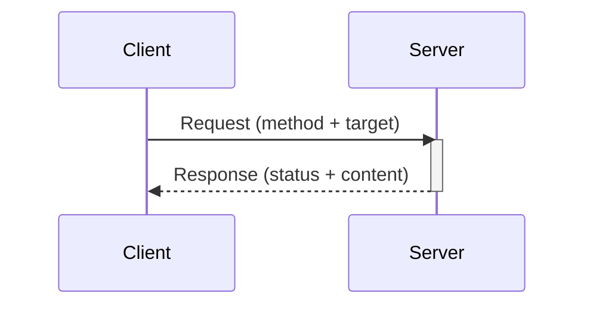

Interaction happens through **standardized methods** (`GET`, `POST`, `PUT`, `DELETE`, and others), each with a defined meaning. A **resource** — the thing being acted on — can be virtually anything: an HTML page, an image, a video, or structured data like JSON. HTTP doesn't care what the resource actually represents; it just needs a path to identify it and a method to describe the action being taken.

A **REST API** is a specific kind of web API: one that uses HTTP extensively and **respects its semantics** — meaning `GET` really only reads, `DELETE` really only deletes, status codes really reflect what happened, and so on, rather than using HTTP as a generic pipe that ignores its own conventions.

---

## The Three-Step Design Flow

Designing a REST interface from already-identified capabilities happens in three ordered steps:

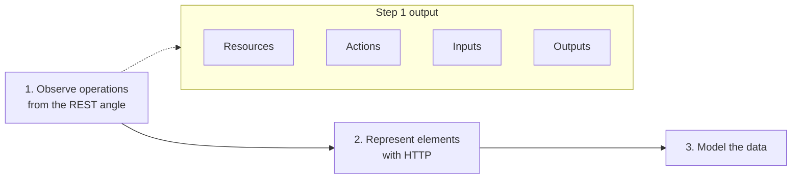

**Step 1** stays entirely in plain language (English or whatever language the team uses) — no HTTP methods, no paths, no status codes yet. The goal is purely to identify:
- what **resources** (business concepts) are involved,
- what **action** is being performed,
- what **inputs** the action needs,
- what **outputs** it can produce (success or failure).

Only in step 2 do these plain-language elements get mapped onto actual HTTP methods and paths, and only in step 3 does the detailed data (field names, types, structure) get designed.

---

## The Five CRUD Operations

Most API operations fall into one of five classic categories — **CRUD**: **C**reate, **R**ead (including search/list), **U**pdate, **D**elete.

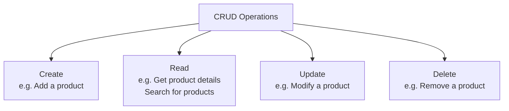

---

## What Is a Resource?

A resource is a **standalone business concept** — something that exists and can be manipulated on its own, as distinct from a **property**, which is just a small piece of data that only makes sense attached to something else.

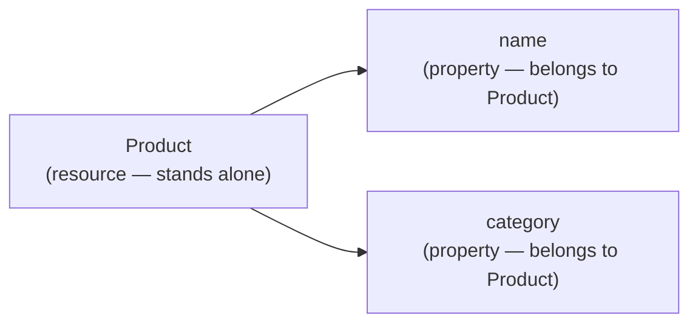

**Key rule:** one operation manipulates exactly **one** resource, but a single resource can be the target of **many different** operations.

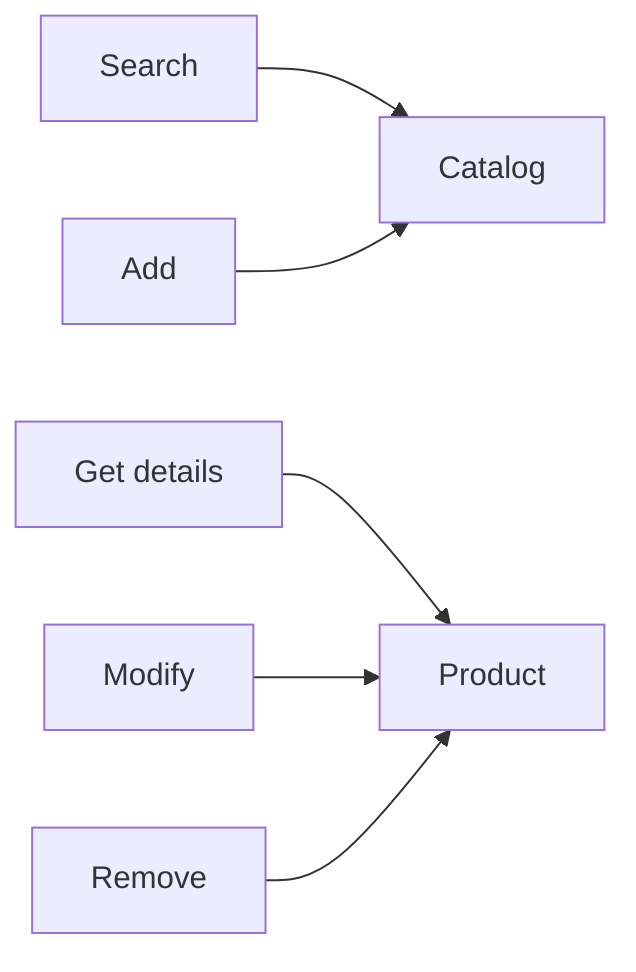

### How to find the resource: follow the main verb

The resource is whatever the **main verb** in the operation's description is acting on.

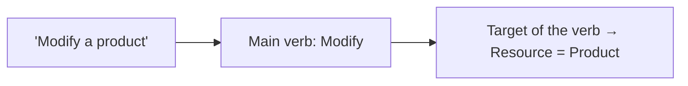

### Container vs. individual element

Whether the resource is the **element itself** or its **container** depends on the type of operation:

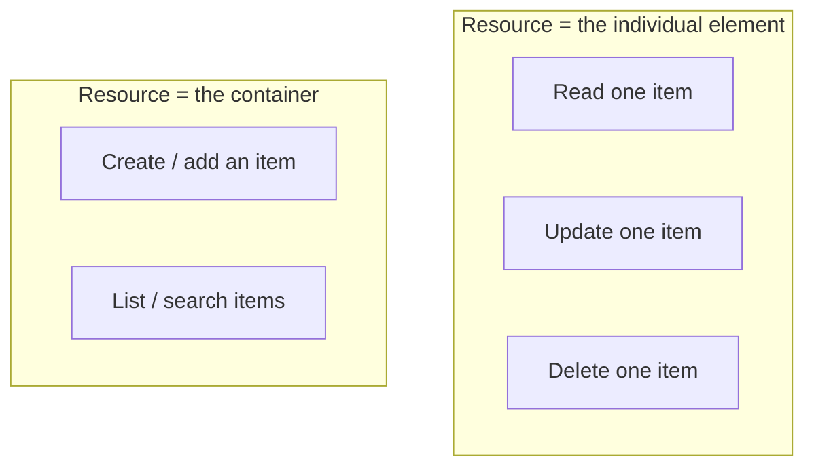

This makes intuitive sense: you can't "add a product" without a catalog to add it *to* — the catalog is what's really being modified (its contents change). But you *can* modify or delete a single, already-identified product directly — no container needed to describe that action.

---

## What Is an Action?

An action is simply the **main verb** applied to the resource identified above. Since the same verb is used to find both the resource and the action, these two identifications effectively happen together, from the same phrase.

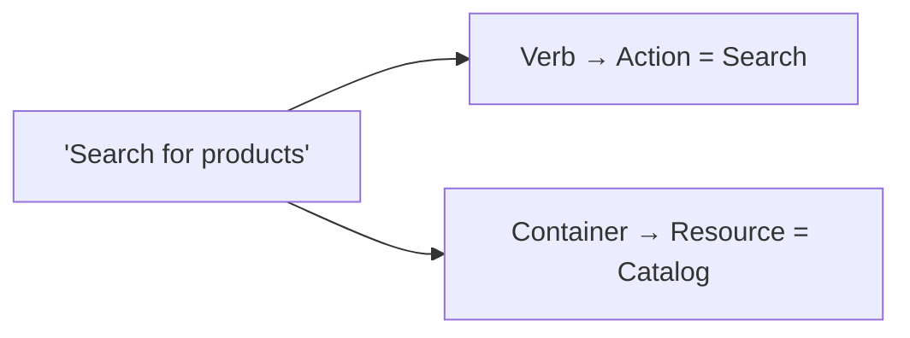

---

## Consolidating an Action's Inputs

A single action (say, "Modify") might be triggered from several different use-case steps throughout your capability analysis — each with its own listed inputs. Rather than keeping separate, possibly redundant input lists, you **merge** them into one consolidated list for the action.

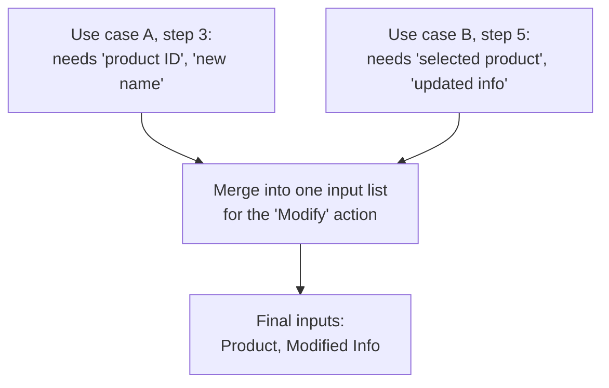

Two rules guide this merge:

1. **Use context-agnostic descriptions.** "Selected product" and "product ID" from two different use cases might really be the same input described differently — rewording them into one neutral, reusable description avoids ending up with duplicate entries that mean the same thing.

2. **Remove the operation's own resource from its input list** — *unless* the action genuinely needs more than one instance of that resource. For example, "Modify a product" doesn't need to list "Product" as an input separately, because the resource being modified *is* the product itself (it'll be identified by its path/location, not passed as a separate input). But an action like "Compare two products" would legitimately need multiple product instances listed as input, since more than one distinct instance of the same resource type is genuinely required.

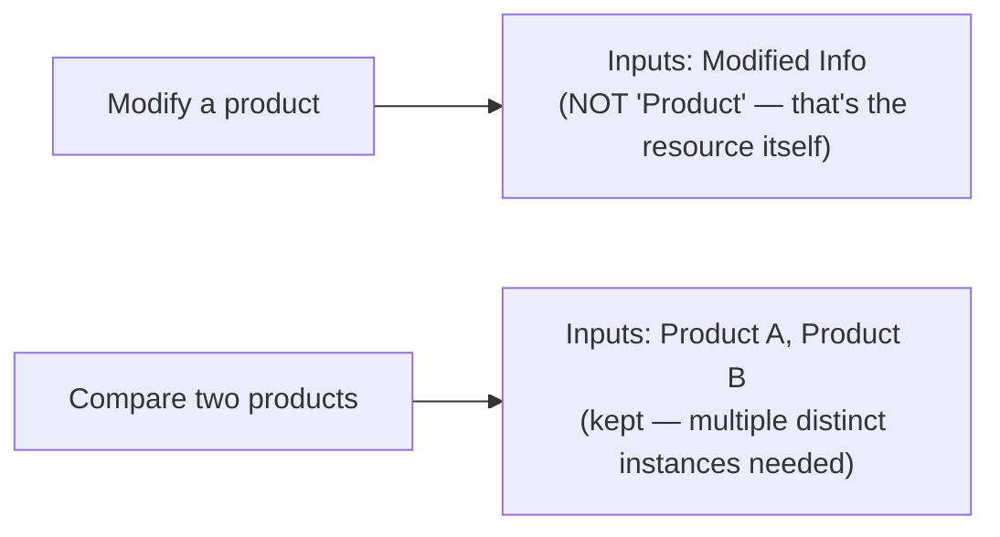

---

## Consolidating an Action's Outputs

The same merging logic applies to outputs. An action's **success** and **failure** outcomes, gathered from every use-case step that uses it, get combined into one output list.

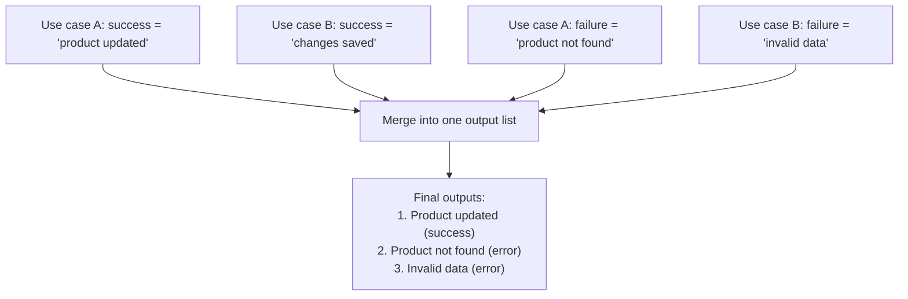

Each entry in the merged output list has three parts:

| Field | Meaning |
|---|---|
| **Description** | Plain-language explanation of the outcome |
| **Type** | `success` or `error` |
| **Data** *(optional)* | Any data returned alongside this outcome |

### Judge success/error from a neutral, context-agnostic perspective

This is a subtle but important point: what counts as "success" or "error" should be decided from the **action's own neutral perspective** — not from how any one particular consumer happens to interpret it.

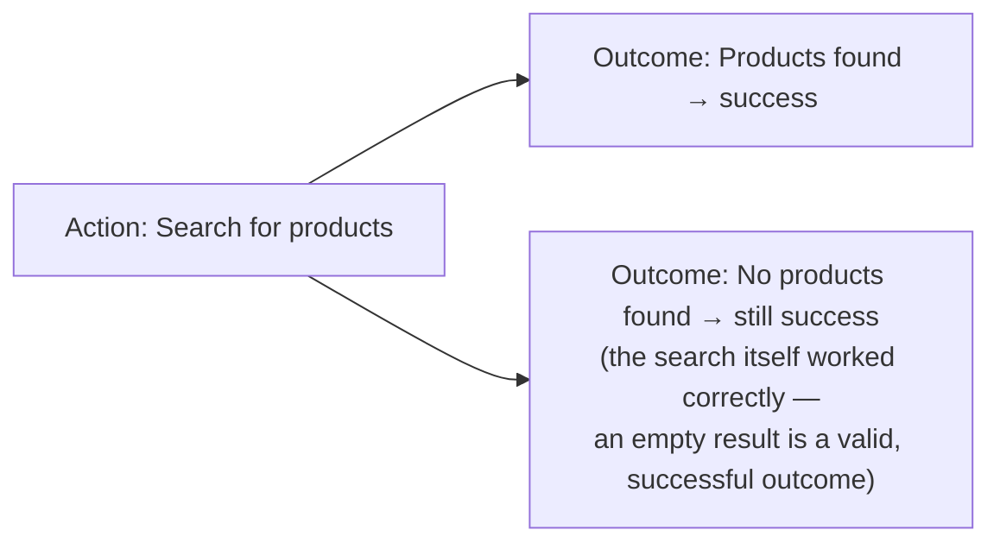

Different consumers might *feel* differently about the same outcome — one application might treat "no results found" as basically an error state to show the user, while another might treat it as a perfectly normal, expected outcome. But the action's own output list should reflect what **actually happened from the API's point of view**, not any single consumer's downstream interpretation. This keeps the design consistent and reusable across every consumer, instead of being biased toward how the first consumer you thought about happens to use it.
