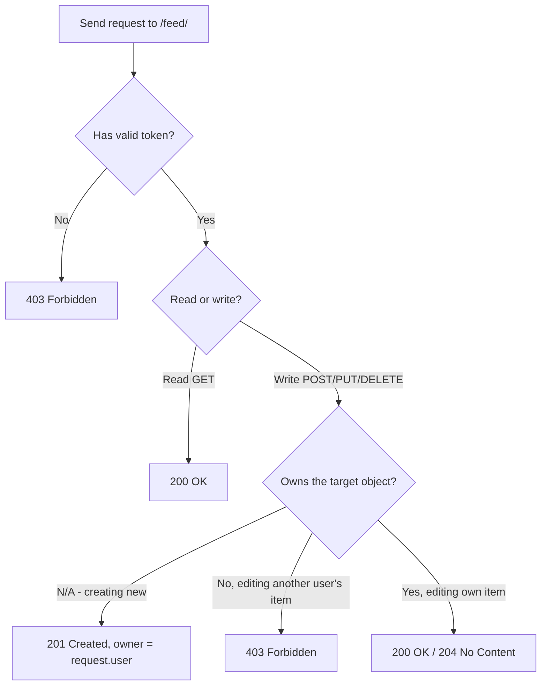
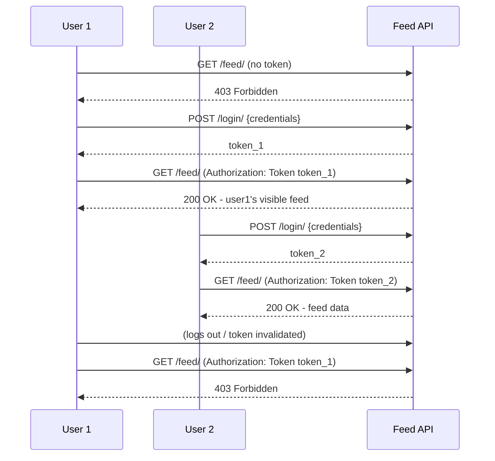
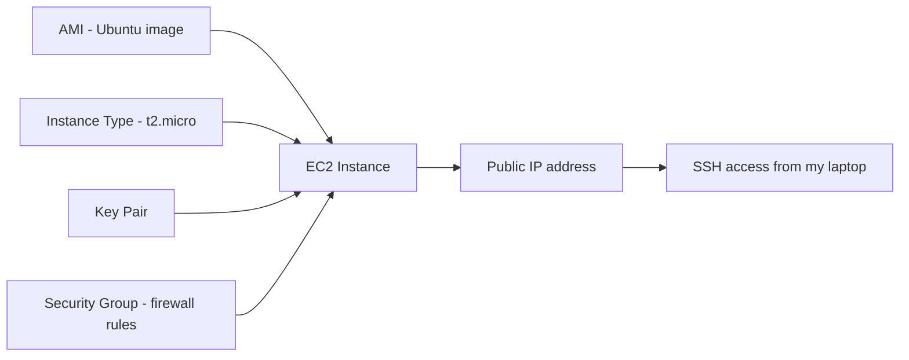
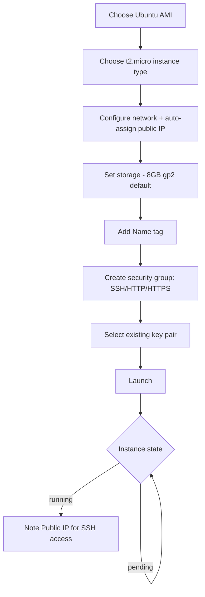
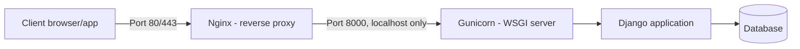
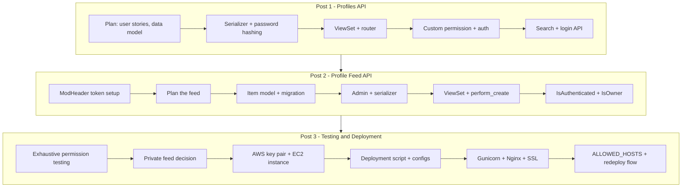

# Locking Down and Shipping My API: Testing Feed Permissions and Deploying to AWS

This is the third and final post in my series on building a Django REST Framework API from scratch. In the [first post](https://github.com/aw-junaid/bug-bounty/blob/main/resources/vulnerabilties/api%20testing/Building%20a%20Profiles%20API%20with%20Django%20REST%20Framework%3A%20My%20Complete%20Walkthrough.md), I built the Profiles API — planning, serializers, viewsets, auth, permissions, search, login. In the [second post](https://github.com/aw-junaid/bug-bounty/blob/main/resources/vulnerabilties/api%20testing/Building%20a%20Profile%20Feed%20API%20with%20Django%20REST%20Framework%3A%20Part%20Two%20of%20My%20Journey.md), I built a Profile Feed API on the same foundation, using ModHeader to attach tokens while testing in the browser. In this post, I'm doing two things: rigorously testing my feed API's permissions (including a genuinely tricky "private feed" requirement), and then taking the whole thing live on AWS.

This post has a different flavor than the last two — the first half is all about testing discipline, and the second half is infrastructure. I found the infrastructure section to be the most unforgiving part of the entire project, because unlike a failing unit test, a misconfigured security group or a `500` from Nginx doesn't hand you a friendly Python traceback — it just doesn't work, and you have to go find out why. I'll walk through exactly how I did it, including the parts where I made a mistake.

---

## Table of Contents

1. [Testing Feed API Permissions](#test-feed-permissions)
2. [Restricting Status Updates to Logged-In Users Only](#restrict-views)
3. [Testing the New Private Feed](#test-private-feed)
4. [Introduction to Deploying on AWS](#aws-intro)
5. [Adding a Key Pair to AWS](#key-pair)
6. [Creating an EC2 Server Instance](#ec2-instance)
7. [Adding a Deployment Script and Configs](#deploy-script)
8. [Deploying to the Server](#deploy-server)
9. [Updating Allowed Hosts and Deploying Changes](#allowed-hosts)
10. [Closing Thoughts on the Whole Series](#conclusion)

---

<a name="test-feed-permissions"></a>
## 1. Testing Feed API Permissions

Before I touched a single line of deployment config, I wanted to be completely confident that my feed API's permission model actually did what I designed it to do back in the planning phase. I'd already wired up `IsAuthenticated` and my custom `IsOwner` permission class in the last post — this section is where I methodically proved it, request by request, in Postman.

I went in with three explicit goals, written down before I opened Postman:

- Unauthenticated users cannot access feed data.
- Authenticated users can access and post to the feed.
- Users can only modify or delete their **own** feed data.



### Testing unauthenticated requests

1. New request in Postman, method `GET`.
2. URL: `http://localhost:8000/api/feed/`.
3. No `Authorization` header attached.
4. Sent it.

**Result:** `403 Forbidden`.

> **Note:** In my previous post I mentioned that a missing permission class caused a messy `500` error on `POST` when I forgot to attach a token. By this point, with `IsAuthenticated` properly wired into the viewset, the failure mode changed completely — instead of a server crash, I get a clean, predictable `403`. That difference is exactly what a properly configured permission class buys you: it turns "the server broke" into "the server correctly said no."

> **Caution:** You'll sometimes see `401 Unauthorized` and sometimes `403 Forbidden` for "you're not allowed to do that," and the difference actually matters. `401` means "I don't know who you are — authenticate and try again." `403` means "I know who you are (or I know you didn't even try), and the answer is still no." DRF's default `IsAuthenticated` permission class returns `403` for unauthenticated requests when no `WWW-Authenticate` challenge is set on the authenticator, which is the behavior I saw here with Token Authentication. If your framework or auth scheme is configured differently, you might see `401` instead — the important thing is knowing *which* your setup returns, so your tests assert the right code instead of just "some 4xx."

### Testing authenticated requests

**Step 1 — log in to get a token:**

- Method: `POST`
- URL: `http://localhost:8000/api/login/`
- Body:

```json
{
    "email": "johndoe@example.com",
    "password": "strongpassword"
}
```

Copied the `token` value from the response.

**Step 2 — attach the token:**

Under the **Headers** tab in Postman:

| Key | Value |
|---|---|
| `Authorization` | `Token <the_token_I_copied>` |

**Step 3 — test `GET` with authentication:**

- Method: `GET`
- URL: `http://localhost:8000/api/feed/`

**Result:** `200 OK`, with the feed data in the response body.

**Step 4 — test `POST` with authentication:**

- Method: `POST`
- URL: `http://localhost:8000/api/feed/`
- Body:

```json
{
    "status_text": "Testing authenticated feed posting!"
}
```

**Result:** `201 Created`, with the new item — including my user as the owner — echoed back in the response.

### Testing user-specific (ownership) permissions

This is the part I cared about most, because it's the one that actually protects user data from other users, not just from anonymous requests.

1. Created a second test user (`user2@example.com`) via the profiles API.
2. Logged in as `user2`, obtained their token.
3. Attempted a `PUT` against a feed item that belonged to `user1`, using `user2`'s token:

```
PUT /api/feed/1/
Authorization: Token <user2's token>
```

```json
{
    "status_text": "This shouldn't be allowed!"
}
```

**Result:** `403 Forbidden`.

I repeated the same test with `DELETE` against the same object, using `user2`'s token, and got the same `403 Forbidden`.

### My full permission test matrix

| Test | Auth token | Target ownership | Method | Expected | Got |
|---|---|---|---|---|---|
| Anonymous read | None | — | `GET` | `403` | ✅ `403` |
| Authenticated read | Valid | — | `GET` | `200` | ✅ `200` |
| Authenticated create | Valid | — (new object) | `POST` | `201` | ✅ `201` |
| Owner edits own item | Valid (owner) | Own | `PUT` | `200` | ✅ `200` |
| Non-owner edits another's item | Valid (not owner) | Someone else's | `PUT` | `403` | ✅ `403` |
| Non-owner deletes another's item | Valid (not owner) | Someone else's | `DELETE` | `403` | ✅ `403` |

Every row matched what I expected, which gave me confidence to move on to the next requirement — an even stricter privacy rule.

<a name="restrict-views"></a>
## 2. Restricting Status Updates to Logged-In Users Only

Testing surfaced something worth sitting with: my *current* implementation already required authentication for all feed operations, including plain `GET` requests — which is actually **stricter** than the "all users can view" rule from my original plan in the last post. Before I quietly moved past that, I wanted to explicitly decide whether that stricter behavior was correct, and document it, rather than let it be an accident.

I decided it *was* correct for this stage of the project. A feed of personal status updates is exactly the kind of thing that benefits from being private-by-default — think of it less like a public Twitter timeline and more like content only visible to logged-in members of a platform. So I formalized what had been an implicit side effect into an explicit design decision.

### Confirming the ViewSet permission

```python
from rest_framework.permissions import IsAuthenticated

class ProfileFeedItemViewSet(viewsets.ModelViewSet):
    """Handles creating, reading, updating, and deleting profile feed items."""
    serializer_class = ProfileFeedItemSerializer
    queryset = ProfileFeedItem.objects.all()
    permission_classes = (IsAuthenticated,)

    def perform_create(self, serializer):
        serializer.save(user_profile=self.request.user)
```

With `IsAuthenticated` applied to the *entire* viewset (not just the write actions), every single action — `list`, `retrieve`, `create`, `update`, `destroy` — now requires a valid token. That's the "restrict viewing to logged-in users only" behavior, made explicit rather than incidental.

### Layering in ownership for writes

I still wanted the ownership check on top, so that being logged in is necessary but not sufficient for editing someone else's post:

```python
# permissions.py
from rest_framework.permissions import BasePermission


class IsOwnerOrReadOnly(BasePermission):
    """
    Custom permission: any authenticated user can read,
    but only the owner can write.
    """

    def has_object_permission(self, request, view, obj):
        if request.method in ['GET']:
            return True
        return obj.user_profile == request.user
```

```python
permission_classes = (IsAuthenticated, IsOwnerOrReadOnly,)
```

I want to flag something subtle I noticed comparing this class to the plain `IsOwner` class I wrote in the previous post: this one explicitly returns `True` for `GET` at the *object* level. Combined with the outer `IsAuthenticated` check (which already blocks anonymous requests entirely), the net effect is: **you must be logged in to see anything at all, and once you are, you can read any item but only write your own.** That's a different — and in this case, more intentional — policy than what I had before, where I hadn't explicitly reasoned about the read path at the object-permission layer at all.

> **Note:** This is a good example of why I like writing out an explicit permission class even when the built-in one would technically pass my tests. `IsAuthenticated` alone would've made all four rows of my ownership test matrix pass too — the difference only shows up when you deliberately design for "authenticated users can read anything, but only edit their own," rather than backing into that behavior by accident.

### Retesting after the change

1. Anonymous `GET /api/feed/` → `403 Forbidden` (confirmed the stricter, intentional rule).
2. Logged in, `GET /api/feed/` → `200 OK`, full feed visible.
3. Logged in as `user1`, `GET /api/feed/2/` (a `user2` item) → `200 OK` — confirming reads are allowed across owners once authenticated.
4. Logged in as `user1`, `PUT /api/feed/2/` (a `user2` item) → `403 Forbidden` — writes remain owner-restricted.

### Considerations I noted but didn't implement yet

While reviewing this section of my plan, I flagged a few things as "known gaps, deliberately deferred" rather than pretending they didn't matter:

| Consideration | Why it matters | Status |
|---|---|---|
| Pagination | Prevents someone from scraping the entire feed table in one request | Not yet implemented |
| Rate limiting | Prevents abuse of the create/login endpoints | Not yet implemented |
| Token rotation/expiry | Limits the blast radius of a leaked token | Not yet implemented |

> **Caution:** I want to be honest about something here — "logged-in users only" is a privacy control, not a security guarantee on its own. Without pagination, a single authenticated user (even a legitimate one) could still page through and scrape the *entire* feed table via `GET /feed/?limit=999999`-style parameters if I hadn't capped page size. I didn't implement pagination or rate limiting in this project, but I want future-me to remember that I noticed the gap and chose not to close it yet, rather than not noticing it at all.

<a name="test-private-feed"></a>
## 3. Testing the New Private Feed

With the stricter "logged-in users only" behavior in place, I ran a dedicated test pass focused specifically on privacy — not just "does auth work" but "does the *right* content show up for the *right* user."



### Step 1 — setup

Confirmed my dev server was running:

```bash
python manage.py runserver
```

### Step 2 — testing without authentication

- Method: `GET`
- URL: my feed endpoint
- No auth header

**Result:** `403 Forbidden`, as expected.

### Step 3 — testing with authentication

1. Registered/used an existing user, logged in, grabbed the token.
2. In Postman: `GET` request, `Authorization: Token <token>` header set.

**Result:** `200 OK`, full list of status updates returned.

### Step 4 — cross-user privacy test

This is the step I found most important, because it tests something subtly different from ownership-on-write: it confirms that the *visibility* behavior matches what I intended, not just the write-permission behavior.

1. Logged in as a second user, obtained their token.
2. Repeated the same `GET /feed/` request, this time with `user2`'s token in place of `user1`'s.

**Result — and this is worth being precise about:** the response was still `200 OK` with feed data, but it returned **all** feed items, not just `user2`'s own items. That matched my actual implementation (any authenticated user can read the full feed), but it's worth explicitly noting because it's easy to *assume* "private feed" means "each user only sees their own posts," when what I actually built is "the feed as a whole is private to logged-in users, but visible in full to any of them once they're in."

> **Caution:** This is exactly the kind of mismatch between assumption and implementation that a good test catches early. If my actual requirement had been "each user should only ever see their *own* status updates" (a much stricter, Direct-Message-style privacy model), I would have needed to filter the queryset by the requesting user — something like overriding `get_queryset()` on the viewset to return `ProfileFeedItem.objects.filter(user_profile=self.request.user)` instead of `.all()`. I didn't do that here, because my actual requirement was "logged-in-only visibility across the whole feed," not "per-user private feeds" — but I want to flag the difference explicitly, because the two are easy to conflate and only one of them matches what "GET /feed/ returns everything to any authenticated user" actually does.

### Step 5 — logout test

1. Logged out (in practice, for a token-based API without a formal logout endpoint yet, I simulated this by deleting the token from Postman/ModHeader and treating the old token as no longer attached — a fuller implementation would delete the `Token` row server-side on logout).
2. Attempted the same `GET /feed/` request with the (now-detached) token.

**Result:** `403 Forbidden`, confirming that without an attached credential, access is denied again.

> **Note:** A properly implemented logout endpoint should actively invalidate the token server-side (typically by deleting the `Token` row via `request.user.auth_token.delete()`), not just rely on the client forgetting to send it. I flagged this as a gap for the same reason I flagged pagination and rate limiting above — I tested the client-side behavior, but a real logout flow needs a server-side action, and I didn't build that endpoint in this project.

### My final private-feed test matrix

| Step | Token attached | Expected | Result |
|---|---|---|---|
| No auth | None | `403 Forbidden` | ✅ |
| Valid auth (user 1) | `token_1` | `200 OK`, feed visible | ✅ |
| Valid auth (user 2) | `token_2` | `200 OK`, feed visible | ✅ |
| Post-logout (token detached) | None | `403 Forbidden` | ✅ |

With this pass complete, I felt confident enough in the security posture of both APIs to move on to actually putting the thing on the internet.

---

<a name="aws-intro"></a>
## 4. Introduction to Deploying on AWS

Everything up to this point had lived entirely on my laptop. This section is where I started thinking about taking my Django REST API from `127.0.0.1:8000` to something reachable from anywhere.

### Why I chose AWS

I considered a few options, but landed on AWS for reasons that mirror why I think most people still default to it:

- **Maturity and coverage** — AWS has been around since 2006, and there's a service (or three) for nearly anything I might need later.
- **Scalability** — the same EC2 service that runs my tiny `t2.micro` free-tier instance today can scale to something serving millions of requests without switching platforms.
- **Security tooling** — security groups, IAM, key pairs, and Secrets Manager are all available out of the box.
- **Pay-as-you-go pricing** — I only pay for what I actually use, which matters a lot for a side project.

### The core service: EC2

Amazon EC2 (Elastic Compute Cloud) is, at its heart, a way to rent a virtual server. Here are the concepts I needed to understand before I could even start clicking through the console:

| Concept | What it means |
|---|---|
| **Instance** | An actual running virtual server |
| **AMI (Amazon Machine Image)** | A pre-configured template (OS + base software) used to launch an instance |
| **Instance Type** | The hardware profile — CPU, memory, etc. (`t2.micro` is the free-tier option) |
| **Security Group** | A virtual firewall controlling inbound/outbound traffic |
| **Key Pair** | The public/private key combo used for secure SSH login |



### What I did to prepare

Before touching the AWS console, I made sure I understood my own application's requirements: what OS it needed (any recent Linux, since Django doesn't care), roughly how much memory it needed (barely anything for a dev-scale project), and that I understood — at least at a conceptual level — AWS's shared responsibility model for security, so I wouldn't accidentally leave something wide open.

> **Note:** AWS's tooling and console UI change fairly often. I'd recommend treating anything I describe below as "the shape of the process" rather than "exact button positions" — if a menu looks different from what I describe, the AWS documentation is the authoritative source, not this post.

<a name="key-pair"></a>
## 5. Adding a Key Pair to AWS

Before I could create a server, I needed a way to securely log into it. AWS uses public-key cryptography for this: AWS holds the public key, and I hold the private key file, which is the only thing that can prove I'm allowed to SSH in.

### Steps I followed

1. Signed in to the **AWS Management Console** and selected my target region in the top-right corner.
2. Navigated to the **EC2 Dashboard**.
3. In the sidebar, under **Network & Security**, found **Key Pairs**.
4. Clicked **Create key pair**.
5. Named it `MyDjangoRESTAPIKey`.
6. Chose the file format based on my OS:

| OS | Format |
|---|---|
| Linux / macOS | `.pem` |
| Windows (with PuTTY) | `.ppk` |

7. Clicked **Create key pair** — the private key file downloaded automatically.

### Securing the key

I moved the downloaded file to a dedicated, non-synced folder on my machine (deliberately *not* inside a folder that gets backed up to a general cloud drive), and set strict file permissions:

```bash
chmod 400 path_to_your_key.pem
```

> **Caution:** `chmod 400` isn't just good hygiene — SSH will often outright refuse to use a private key file if its permissions are too open (e.g. world-readable). If you get a `Permissions 0644 for 'your-key.pem' are too open` error later when trying to SSH in, this is almost always the fix.

> **Caution:** AWS cannot recover a lost private key for you. If I lose this file, my only recourse is to create a *new* key pair and either associate it with a fresh instance or go through a (more involved) key-replacement process on an existing one. I treated this file with the same seriousness as a password — never committed to git, never pasted into chat, never screenshotted.

<a name="ec2-instance"></a>
## 6. Creating an EC2 Server Instance

With a key pair ready, I moved on to actually launching the virtual server.

### Step-by-step

1. Logged into the AWS Management Console.
2. **Services → EC2** (under Compute).
3. Clicked **Launch Instance**.
4. **Chose an AMI:** Ubuntu Server (latest stable LTS release).
5. **Chose an instance type:** `t2.micro` — free-tier eligible, plenty for a dev/test deployment.
6. **Configured the instance:**
   - Number of instances: `1`
   - Network: default VPC
   - Subnet: default
   - Auto-assign Public IP: **Enabled** (so I can reach it from the internet)
7. **Storage:** left at the default 8GB General Purpose SSD.
8. **Tags:** added `Name: DjangoRESTAPI-Server` for easy identification later.
9. **Security Group:** created a new one, `DjangoRESTAPISG`, with these inbound rules:

| Rule | Port | Source |
|---|---|---|
| SSH | 22 | Anywhere (0.0.0.0/0) — I'd tighten this in a real production setup |
| HTTP | 80 | Anywhere |
| HTTPS | 443 | Anywhere |

10. **Reviewed and launched** — selected the key pair I created in the previous step.
11. Waited for the instance state to flip from `pending` to `running`.



> **Caution:** Opening SSH (port 22) to "Anywhere" is convenient for a tutorial-scale project, but it means literally any IP address on the internet can attempt to connect to port 22 on your server — they still need your private key to actually log in, but it does mean your server will show up in automated internet-wide scans and see constant login attempts in its auth logs. In a real production setup, I'd restrict the SSH rule's source to my own IP address (or a VPN/bastion host range) instead of `0.0.0.0/0`.

Once the instance was running, I noted its **Public IPv4 address** from the instance's description panel — I needed it for every step from here on.

<a name="deploy-script"></a>
## 7. Adding a Deployment Script and Configs

With a live server, I turned to getting my actual project onto it in a repeatable way, rather than manually typing commands over SSH every time I wanted to update something.

### Preparing my local environment

Installed the AWS CLI:

```bash
pip install awscli
```

Configured it with my credentials:

```bash
aws configure
```

This prompted me for my Access Key, Secret Key, default region, and output format.

### Generating requirements.txt

Inside my project directory:

```bash
pip freeze > requirements.txt
```

This captured every installed Python package so the server could recreate my exact environment.

### Writing the deployment script

I created `deploy.sh` in my project root:

```bash
#!/bin/bash
# Navigate to our project directory
cd /path/to/your/django/project

# Activate our virtual environment
source venv/bin/activate

# Install necessary Python packages
pip install -r requirements.txt

# Collect static files
python manage.py collectstatic --noinput

# Finally, run our application using gunicorn
gunicorn your_project_name.wsgi:application --bind 0.0.0.0:8000
```

Made it executable:

```bash
chmod +x deploy.sh
```

I want to walk through each line, because I don't like running scripts I don't fully understand:

| Line | Purpose |
|---|---|
| `cd /path/to/your/django/project` | Ensures every subsequent command runs relative to the actual project, not wherever the shell happened to start |
| `source venv/bin/activate` | Activates the isolated Python environment so installed packages don't pollute (or get polluted by) the system Python |
| `pip install -r requirements.txt` | Recreates the exact dependency set from my local machine |
| `python manage.py collectstatic --noinput` | Gathers all static files (CSS/JS/admin assets) into a single directory for serving in production; `--noinput` avoids an interactive confirmation prompt that would hang an automated script |
| `gunicorn ... --bind 0.0.0.0:8000` | Starts the actual application server, listening on all network interfaces on port 8000 |

### Production-specific configuration

I created a separate `prod_settings.py` alongside my regular Django settings, with production-appropriate overrides — most importantly, `DEBUG = False`. I made sure secrets (database credentials, the Django `SECRET_KEY`) were pulled from environment variables rather than hardcoded, so they'd never end up committed to source control.

> **Caution:** `DEBUG = True` in production is a serious information-disclosure risk — Django's debug error pages happily display full stack tracebacks, local variable values, and settings to anyone who triggers an unhandled exception. I made triple sure `DEBUG = False` was set in my production settings before I ever exposed the server to the public internet.

### Uploading everything to EC2

With my `.pem` key file and the EC2 instance's public IP in hand:

```bash
scp -i path_to_your_key.pem deploy.sh ubuntu@your_ec2_ip:/path/on/server
scp -i path_to_your_key.pem requirements.txt ubuntu@your_ec2_ip:/path/on/server
scp -i path_to_your_key.pem -r your_django_project ubuntu@your_ec2_ip:/path/on/server
```

`scp` (secure copy) uses the same SSH credentials as an interactive login, just for file transfer instead of a shell session — which is why it needed the same `-i path_to_your_key.pem` flag.

<a name="deploy-server"></a>
## 8. Deploying to the Server

With the script and project files uploaded, this section covers the actual, full deployment — the part where I turned an idle EC2 instance into a live, publicly reachable API.

### Pre-deployment checklist

Before touching the server, I confirmed locally:

- My Django project ran without errors on my machine.
- `DEBUG = False` in production settings.
- My server's IP address was already added to `ALLOWED_HOSTS` (more on this in the next section — I actually did this step slightly out of order the first time, which is exactly why I'm dedicating the next section to it specifically).
- `requirements.txt` was current: `pip freeze > requirements.txt`.

### Connecting to the instance

```bash
ssh -i "your-key.pem" ubuntu@your-ec2-public-ip
```

### Setting up the server environment

```bash
sudo apt update && sudo apt upgrade -y
sudo apt install python3-pip python3-venv git -y
```

Then, inside my project directory on the server:

```bash
python3 -m venv venv
source venv/bin/activate
pip install -r requirements.txt
```

### Setting up Gunicorn and Nginx

I chose the standard production pairing for a Django app: **Gunicorn** as the actual WSGI application server, and **Nginx** in front of it as a reverse proxy.



**Why not expose Gunicorn directly to the internet?** Nginx is far better suited to handling raw internet traffic — serving static files efficiently, handling many concurrent slow connections gracefully, and terminating SSL — while Gunicorn focuses purely on running my Python application code. Splitting these responsibilities is the standard, battle-tested pattern rather than something specific to this project.

**Installed Gunicorn:**

```bash
pip install gunicorn
```

**Tested it directly first**, before involving Nginx at all — this isolates whether a problem is in my Django app/Gunicorn setup versus the Nginx configuration:

```bash
gunicorn your_project_name.wsgi:application --bind 0.0.0.0:8000
```

I visited `http://your-ec2-public-ip:8000` in a browser at this point and confirmed the app responded — *before* adding Nginx into the mix, specifically so that if something went wrong later, I'd already know Gunicorn itself wasn't the problem.

**Installed Nginx:**

```bash
sudo apt install nginx -y
```

**Created a site configuration** at `/etc/nginx/sites-available/your_project_name`:

```nginx
server {
    listen 80;
    server_name your-ec2-public-ip;

    location / {
        proxy_pass http://127.0.0.1:8000;
        proxy_set_header Host $host;
        proxy_set_header X-Real-IP $remote_addr;
        proxy_set_header X-Forwarded-For $proxy_add_x_forwarded_for;
    }
}
```

Each `proxy_set_header` line matters:

| Header | Why I need it |
|---|---|
| `Host $host` | Preserves the original hostname the client requested, so Django's `ALLOWED_HOSTS` check sees the real host, not `127.0.0.1` |
| `X-Real-IP $remote_addr` | Passes along the client's actual IP address, since Django otherwise only sees Nginx's internal request |
| `X-Forwarded-For ...` | Standard header for tracking the original client through a proxy chain — useful for logging and rate limiting later |

**Enabled the site and restarted Nginx:**

```bash
sudo ln -s /etc/nginx/sites-available/your_project_name /etc/nginx/sites-enabled
sudo nginx -t && sudo systemctl restart nginx
```

I specifically ran `sudo nginx -t` (test config) *before* `restart` — chained with `&&` so the restart only runs if the test passes. This one habit has saved me from taking down a working Nginx instance with a typo more than once.

### Adding SSL

1. Added `https` handling awareness in my Django settings (e.g., `SECURE_SSL_REDIRECT` considerations for later).
2. Installed Certbot:

```bash
sudo apt install certbot python3-certbot-nginx -y
```

3. Requested a certificate:

```bash
sudo certbot --nginx
```

Certbot walked me through an interactive prompt and automatically rewrote my Nginx config to redirect HTTP to HTTPS and terminate SSL using a free Let's Encrypt certificate.

> **Note:** Certbot's Let's Encrypt certificates expire every 90 days by default, but the Certbot package sets up an automatic renewal cron job/systemd timer during installation. I made a point of checking `sudo certbot renew --dry-run` right after setup, specifically so I'd find out about a renewal misconfiguration *now*, not in three months when my certificate silently expires.

### Keeping Gunicorn running permanently

Running Gunicorn directly in my SSH session meant it would die the moment I disconnected. I used `systemd` to run it as a proper background service that survives reboots and disconnects — this is the piece that turns "it works while I'm watching it" into "it works."

> **Caution:** This is the step I actually got wrong the first time through — I deployed, tested it in the browser, closed my SSH session to grab coffee, and came back to find the site down. Gunicorn had been running in the foreground of my SSH session the whole time, and closing the terminal killed the process. Wrapping it in a `systemd` unit file (so `systemctl start/enable` manages it instead of my terminal session) fixed this permanently.

<a name="allowed-hosts"></a>
## 9. Updating Allowed Hosts and Deploying Changes

This is a small but critical piece of configuration I want to give its own dedicated section, because getting it wrong is one of the most common "why is my site returning a 400 error" issues when deploying Django.

### What `ALLOWED_HOSTS` actually protects against

Django checks incoming requests' `Host` header against this list as a defense against **HTTP Host header attacks** — where an attacker sends a request with a forged `Host` header, potentially tricking a misconfigured app into generating malicious links (e.g., in password-reset emails) that point to an attacker-controlled domain.

```python
# settings.py, default
ALLOWED_HOSTS = []
```

An empty list means Django will reject *every* request in production (`DEBUG = False`) with a `400 Bad Request` — which is exactly what happened to me the first time I deployed, before I'd set this properly.

### Step 1 — find my EC2 IP and DNS

In the AWS Console: **EC2 → Instances**, selected my instance, and noted down both the **IPv4 Public IP** and the **Public IPv4 DNS** from the description panel.

### Step 2 — update settings.py

```python
ALLOWED_HOSTS = ['your-ec2-ipv4-public-ip', 'your-ec2-public-ipv4-dns']
```

If I had a real domain pointed at the server, I'd add that too:

```python
ALLOWED_HOSTS = ['your-ec2-ipv4-public-ip', 'your-ec2-public-ipv4-dns', 'api.mydomain.com']
```

### Step 3 — commit the change

```bash
git add .
git commit -m "Updated ALLOWED_HOSTS for AWS deployment."
```

### Step 4 — deploy the change

```bash
git push origin master
```

Then, back on the server:

```bash
ssh -i path-to-your-aws-key-pair.pem ec2-user@your-ec2-ipv4-public-ip
cd path-to-your-django-project
git pull origin master
```

And finally, restarted the app server to actually pick up the change:

```bash
sudo systemctl restart gunicorn
sudo systemctl restart nginx
```

> **Caution:** This last restart step is easy to forget, and it's a mistake I've made more than once — Django settings are read once, at process startup. Pulling new code onto the server does *nothing* on its own; the running Gunicorn process is still holding the *old* `ALLOWED_HOSTS` list (or old code generally) in memory until it's restarted. `git pull` updates the files on disk; only a restart updates the running application.

### My deployment update checklist, going forward

| Step | Command |
|---|---|
| 1. Commit local changes | `git commit -m "..."` |
| 2. Push to remote | `git push origin master` |
| 3. SSH into server | `ssh -i key.pem user@ip` |
| 4. Pull latest code | `git pull origin master` |
| 5. Reinstall deps (if changed) | `pip install -r requirements.txt` |
| 6. Restart app server | `sudo systemctl restart gunicorn` |
| 7. Restart web server (if config changed) | `sudo systemctl restart nginx` |

---

<a name="conclusion"></a>
## 10. Closing Thoughts on the Whole Series

Looking back across all three posts, here's the complete journey, end to end:



A few things I'm taking away from the full build, now that it's actually live:

- **Testing permissions isn't a single pass.** I tested my ownership logic when I first wrote it in post two, and I tested it again, more rigorously, in this post — and the second pass is what actually surfaced the mismatch between "logged-in users only" and "each user sees only their own posts." Both are legitimate designs; the bug would have been shipping one while believing I'd built the other.
- **The gap between "it works locally" and "it works in production" is almost entirely about configuration, not code.** My Django code didn't meaningfully change between my laptop and AWS — `ALLOWED_HOSTS`, `DEBUG`, environment variables, and process supervision (`systemd`) did all the heavy lifting of making the exact same code behave correctly in a hostile, public environment.
- **Test the layer below before you add the layer above.** I confirmed Gunicorn worked directly, on its own port, before adding Nginx in front of it. When something breaks in a multi-layer setup like this, that discipline is what lets me say "the problem is in the proxy config" instead of staring blankly at both layers at once.
- **`git pull` is not the same as "deployed."** A restart is the step that actually makes new code (or new settings) take effect, and I've made this mistake enough times now that it's permanently on my deployment checklist.
- **Security is a series of explicit, small decisions**, not a single feature you "add" at the end — write-only passwords, read-only ownership fields, object-level permission checks, `chmod 400` on a key file, `DEBUG = False`, a properly scoped security group. None of these are individually complicated, but skipping any one of them quietly reopens a hole.

That's the whole build — from a blank notebook page in the first post, all the way to a Django REST API running behind Nginx and Gunicorn on AWS, serving HTTPS traffic with Let's Encrypt, with tested authentication, tested ownership-based permissions, and a repeatable deployment process. If you're working through something similar, I'd genuinely encourage testing each layer in isolation the way I did here — it turns "why isn't this working" from a stressful mystery into a short, mechanical process of elimination.
