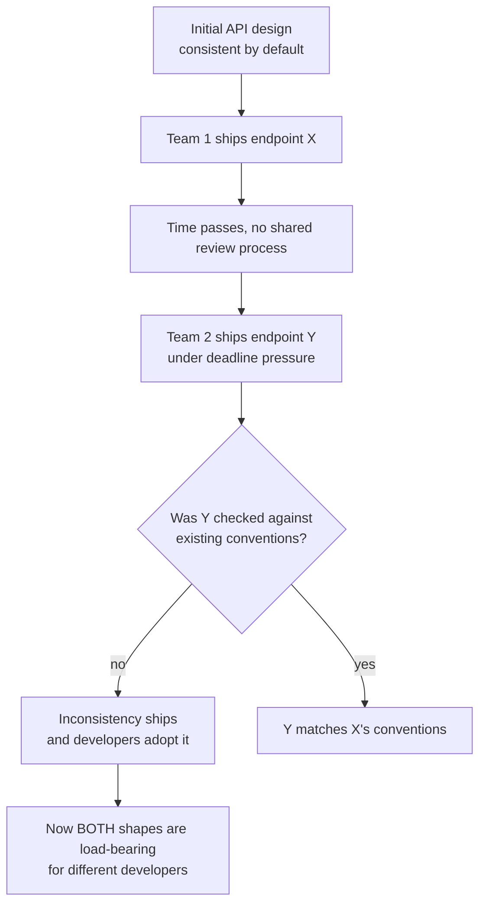
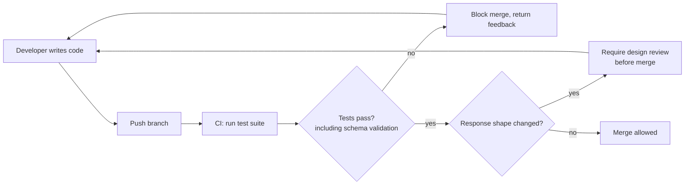
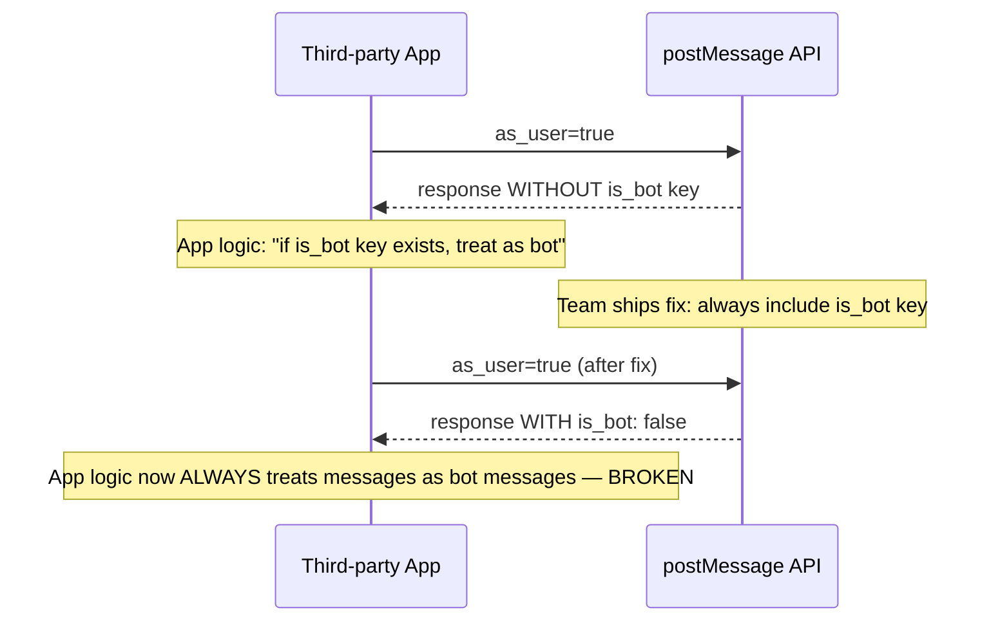
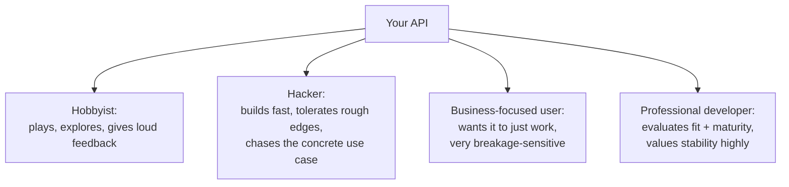
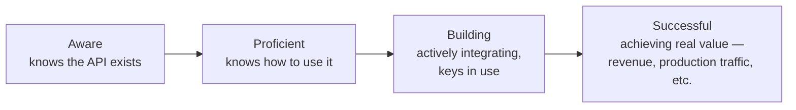

# Managing API Change and Building a Developer Ecosystem: What I've Learned

I want to pick up where my last post on API design left off. Designing a good API on day one is only half the job — the harder, longer half is keeping it good as your product changes underneath it, and then actually getting developers to show up and use it. In this post I'm covering two things that I think are chronically underrated: how to manage change without breaking the developers who depend on you, and how to think strategically about building a developer ecosystem instead of just hoping people find your docs.

I'll be using tested code where it's useful (a JSON Schema validator, a version-transformation layer), real tables, some diagrams, and I'll flag the traps I've either fallen into myself or watched other people fall into.

---

## Table of Contents

1. [Why Consistency Erodes Over Time](#part-1)
2. [Automated Testing as a Consistency Guardrail](#part-2)
3. [Backward Compatibility: The Non-Negotiable](#part-3)
4. [Planning and Communicating Change](#part-4)
5. [Adding vs. Removing: Two Very Different Risk Profiles](#part-5)
6. [Versioning Strategies](#part-6)
7. [Versioning in Practice: Two Contrasting Case Studies](#part-7)
8. [Building a Developer Ecosystem Strategy](#part-8)
9. [Segmenting Your Developers](#part-9)
10. [The Developer Funnel](#part-10)
11. [Tactics and Measurement](#part-11)
12. [Closing Thoughts](#part-12)

---

<a id="part-1"></a>
## 1. Why Consistency Erodes Over Time

Here's something I've come to accept: consistency is easy on day one and gets harder every day after that. On day one, you're designing everything at once, with no historical baggage, so of course it's consistent — there's nothing to be inconsistent *with* yet. The real test comes eighteen months later, when three different teams have each shipped an endpoint independently, and nobody stopped to ask whether their new endpoint matched the conventions the *other* team set.

I've seen this exact pattern show up as: one endpoint accepts a resource by its human-readable name, and a very similar endpoint accepts the same conceptual resource by its ID.

```javascript
// Endpoint A — accepts a channel by name
channels.join({
  channel: "general"
})

// Endpoint B — accepts the same conceptual resource by ID
channels.invite({
  channel: "C12345",
  user: "U23456"
})
```

If I'm a developer trying to use both of these, I now need to store *both* the channel name and the channel ID, and write logic to figure out which one a given call expects. If the channel gets renamed, I also now own the job of keeping that name fresh in my own system, just to keep calling an API that, conceptually, only needed one identifier to begin with.

> **Note:** This kind of drift almost never happens because someone made a bad decision in isolation. It happens because decision A and decision B were made by different people, at different times, with no shared design review in between. The fix isn't "hire smarter engineers" — it's process, which I'll get to in the next section.

### A second example worth sitting with

Here's a scenario I think about a lot because it's so plausible. Imagine a company ships an endpoint that returns *all* of a user's repositories in one call:

```json
// GET /repositories.fetch
{
  "repositories": [
    { "id": 12345 },
    { "id": 23456 }
  ]
}
```

This is fine when users have ten repositories. A year later, power users have millions, there's no pagination on this endpoint, and it starts timing out because the data has to be assembled across multiple database shards. After an outage, the team ships a fast escape hatch — a new endpoint that returns just one repository:

```json
// GET /repositories.fetchSingle(12345)
[
  { "12345": { "...": "..." } }
]
```

Look closely at what just happened. The first endpoint wraps results in a `repositories` key and represents each item as `{ "id": ... }`. The second endpoint has no wrapper key at all, and represents the *same conceptual object* as a dictionary keyed by the literal ID string. Two endpoints, same underlying resource, two completely different shapes.

| | `repositories.fetch` | `repositories.fetchSingle` |
|---|---|---|
| Top-level wrapper | `{ "repositories": [...] }` | none — bare array |
| Item representation | `{ "id": 12345 }` | `{ "12345": {...} }` |
| Identifier location | value of `id` key | the object key itself |

I want to be really clear about why this happens: it's not incompetence, it's *urgency*. The team shipping the fix was solving a production outage under time pressure, and consistency with an existing endpoint's shape was not the thing on fire. That's exactly why you need guardrails that don't depend on someone remembering to care about consistency in the middle of a fire drill — which brings me to automated testing.



---

<a id="part-2"></a>
## 2. Automated Testing as a Consistency Guardrail

I don't think you can rely on "everyone just remembers to be consistent" as an organizational strategy — not because your team is careless, but because remembering the full shape of a growing API while also solving an urgent problem is a genuinely hard cognitive load to carry. Automated testing is how you take that burden off individual memory and put it into the system itself.

### The CI pipeline as a consistency checkpoint



The key idea I want to highlight: catching a backward-incompatible or inconsistent change *before* merge is dramatically cheaper than catching it after it's shipped and developers have started depending on it. Once real traffic depends on a quirk, fixing the quirk becomes a breaking change in its own right — which I'll get to in the backward-compatibility section.

> **Caution:** If you don't already have CI, don't try to flip straight to "tests block every merge." Start by running the suite continuously against your main branch in a non-blocking way, watch it for false positives until you trust it, and only then make it a hard gate. A test suite riddled with false positives that blocks merges will just train your team to ignore it or route around it — which defeats the entire point.

### Describing and validating response payloads

This is the part I actually find satisfying to build. Instead of trusting that every engineer remembers the "correct" shape of a `repository` object by heart, you write it down once as a schema, and let tooling enforce it.

Here's a JSON Schema for a `repository` object, plus one for an endpoint that returns a list of them:

```python
repository_schema = {
    "type": "object",
    "additionalProperties": False,
    "required": ["id", "name", "created"],
    "properties": {
        "id": {"type": "integer"},
        "name": {"type": "string"},
        "created": {"type": "integer"}
    }
}

repositories_fetch_schema = {
    "type": "object",
    "additionalProperties": False,
    "required": ["repositories"],
    "properties": {
        "repositories": {
            "type": "array",
            "items": repository_schema
        }
    }
}
```

Notice `"additionalProperties": False` — that's doing real work. It means if someone accidentally (or "helpfully") adds an undocumented field to the response, the schema fails, instead of quietly letting an unplanned field ship to production and become something developers start relying on before you've decided you actually want to support it.

I wired this up with Python's `jsonschema` library and ran it against a valid payload and a deliberately broken one (an `id` that's a string instead of an integer — the classic "someone changed a type without realizing it" bug):

```python
from jsonschema import validate, ValidationError

good_response = {
    "repositories": [
        {"id": 12345, "name": "my-repo", "created": 1719000000},
        {"id": 23456, "name": "other-repo", "created": 1719000500}
    ]
}

bad_response = {
    "repositories": [
        {"id": "12345", "name": "my-repo", "created": 1719000000}  # id is a string!
    ]
}

def check(payload, schema, label):
    try:
        validate(instance=payload, schema=schema)
        print(f"{label}: PASSED validation")
    except ValidationError as e:
        print(f"{label}: FAILED validation -> {e.message}")

check(good_response, repositories_fetch_schema, "good_response")
check(bad_response, repositories_fetch_schema, "bad_response")
```

Output:

```
good_response: PASSED validation
bad_response: FAILED validation -> '12345' is not of type 'integer'
```

Exactly the failure mode you'd want caught in CI, not in a developer's production integration three weeks from now. This is a tiny, contrived example, but the mechanism scales — wire this into an RSpec (or pytest, or whatever your stack uses) test that calls the real endpoint and validates the real response against the schema, and you've got a regression net for every response shape you care about.

| Tool | What It Validates | Bonus |
|---|---|---|
| JSON Schema | Request/response payload shape and types | Works for any JSON API, not just REST |
| OpenAPI (formerly Swagger) | REST-specific request/response contracts | Can generate docs *and* SDK code |
| Apache Avro | Schema definitions with strong typing | Popular in event/streaming contexts |

### Requests deserve the same discipline as responses

You can't control what a third-party developer sends you, but you *can* validate it strictly on the way in, and reject malformed requests with a clear error instead of quietly guessing at intent. I covered meaningful error design in my last post, so I won't repeat it here — but it's worth saying explicitly: a request-validation layer and a good error taxonomy are two halves of the same feature. One without the other is only half as useful.

---

<a id="part-3"></a>
## 3. Backward Compatibility: The Non-Negotiable

For some products, backward compatibility isn't a nice-to-have, it's structural. If your product generates URLs that live forever — think image-hosting URLs embedded in millions of already-published web pages — you genuinely cannot break the interpretation of an old URL without breaking content you don't even know exists anymore. In cases like that, the constraint is: design every new feature to be *additive* and opt-in, so the old behavior never has to move.

Most APIs aren't quite that extreme, but the underlying lesson generalizes: the closer your API dependencies are to *external* parties instead of internal teams, the more expensive a breaking change becomes, because you can't just walk over to the other team's desk and coordinate a synchronized fix.

### A cautionary story about "fixing" something

I want to walk through a scenario that I think captures the core danger really well, because the mistake isn't "we shipped something wrong" — it's "we shipped something *more correct* and it still broke people."

Imagine an endpoint like `postMessage`, which lets a bot post a message as if it were a real user, controlled by a flag like `as_user`. When that flag is false, the response payload includes `is_bot: true`. When it's true (impersonating a real user), the `is_bot` key is simply *absent* from the payload — not `false`, just missing entirely.

That's an inconsistency: the field should probably always be present, set to `true` or `false`, rather than sometimes existing and sometimes not. So the team "fixes" it — they change the behavior so `is_bot` is *always* present in the response, for consistency.

Here's the trap: one of the most popular integrations built on this API wasn't checking the *value* of `is_bot`. It was checking for the *presence of the key* as its actual business logic — treating "key exists" as a signal in itself, regardless of what it was set to. The moment the key started always being present, that app's logic broke completely, and a widely used integration went down.



> **Caution:** The lesson here isn't "never fix inconsistencies." It's that *any* observable change in behavior — even one that looks like an obvious, harmless correctness fix — is a potential breaking change to *someone*, because you cannot predict every way developers have built logic around your API's quirks. Human creativity in working around API idiosyncrasies is genuinely limitless. Treat "this seems like it could only be a fix" with real suspicion before shipping it silently.

The actual resolution in a story like this is usually: roll the change back immediately when reports come in, give developers real advance notice (weeks, not hours), announce the change publicly ahead of time, and only then re-ship it. Slow and communicated beats fast and silent, every time, for anything touching response shape.

---

<a id="part-4"></a>
## 4. Planning and Communicating Change

Once your API has external users, every change decision is really two decisions: *what* to change, and *how loudly and how early* to tell people about it.

### A communication plan needs tiers

Not every change deserves the same notice period. I like splitting changes into backward-compatible and backward-incompatible buckets and giving each its own communication SLA:

| | Backward-Compatible | Backward-Incompatible |
|---|---|---|
| **Examples** | New request parameter, new response field, new endpoint | Removed response field, changed response type, removed endpoint, changed behavior |
| **Channels** | RSS feed, API docs | RSS feed, API docs, direct email to affected developers, blog post |
| **Notice period before release** | Anytime | Long lead time — think months, not days |

> **Note:** "Long lead time" is deliberately vague here because it depends entirely on your audience. A hobbyist-heavy API might get away with a few weeks. An API embedded in enterprise finance workflows might need the better part of a year. Match the notice period to how expensive it is for *your* users to update, not to how fast you'd personally like to ship.

### Proactive in-payload signaling

Beyond broadcast channels, you can put upcoming-change notices directly into the response payload itself, so developers who are actively parsing responses see it without needing to separately monitor a blog:

```json
{
  "repositories": [
    { "id": 12345 },
    { "id": 23456 }
  ],
  "response_metadata": {
    "response_change": {
      "date": "2027-01-01",
      "severity": 1,
      "affected_object": "repository",
      "details": "Starting 2027-01-01, a new `visibility` field will be added to each repository object."
    }
  }
}
```

I like this pattern because it reaches exactly the audience most likely to be affected — people actually consuming the payload right now — without requiring them to separately subscribe to anything.

> **Caution:** Don't let your communication overhead scale linearly with your rate of change. If every tiny addition requires an email blast, you'll either slow your shipping cadence to match your communication capacity, or you'll start skipping notices for things that "probably don't matter" — and that's exactly how trust erodes. Automate what you can (in-payload metadata, auto-generated changelogs) and reserve human-authored announcements for genuinely disruptive changes.

---

<a id="part-5"></a>
## 5. Adding vs. Removing: Two Very Different Risk Profiles

### Adding is (usually) easy

Adding a new field, a new endpoint, or a new optional parameter is close to a free lunch, backward-compatibility-wise — *as long as* you're careful about a couple of specific traps:

- **Was the field previously unset?** If a field simply didn't exist before, and you're now setting it consistently, ask whether any developer's logic depends on that field's *absence* (see the `is_bot` story above — this is precisely that trap).
- **Does everyone want the new behavior, or does it need to be opt-in?** Sometimes the right move is a new request parameter or a wholly new endpoint, rather than mutating the default response shape everyone already depends on.

> **Caution:** Don't go overboard adding request parameters as your default tool for every new option. Every added parameter makes your schema harder to describe, harder to test exhaustively, and harder for a developer to reason about. If you're accumulating a long list of boolean flags on one endpoint, that's usually a sign you actually need a new endpoint, not another parameter.

### Removing requires a plan, not just courage

Removing something means taking value away from developers who are, by definition, relying on it — so it needs an incentive, not just an announcement. Ask yourself: what are you giving them in exchange? A performance improvement? A bug that finally gets fixed? A new capability the old design couldn't support?

| Deprecation Mechanism | What It Does |
|---|---|
| Long notice period + direct communication | Gives developers real runway to migrate |
| "Carrot" — new capability bundled with the change | Makes migrating feel like an upgrade, not a chore |
| Formal deprecation marker (e.g. GraphQL's `@deprecated`) | Field still works, but tooling/docs flag it as going away |
| Minimum support-duration policy | Sets developer expectations (e.g., "we support each major version for at least N years") |

GraphQL actually has this concept baked into the spec itself: a field can be marked deprecated while remaining fully queryable, specifically so existing clients don't break the moment you decide to move away from it. I think that's a genuinely good default pattern to borrow even outside GraphQL — mark it deprecated, keep it working, remove it later on its own separate timeline.

---

<a id="part-6"></a>
## 6. Versioning Strategies

There are, broadly, two philosophies here, and I want to walk through both honestly rather than pretend one is universally correct.

### 6.1 Additive-change strategy (no explicit versions)

The rule is simple: every change must be backward-compatible. You can add fields, add endpoints, add parameters. You may never remove or rename something, change a field's type, change behavior for existing well-formed requests, or change error contracts.

```http
GET /users/1234
```
```json
{
  "id": 1234,
  "name": "Chen Hong",
  "username": "chenhong",
  "friends": [2341, 3449, 2352]
}
```

If some developers want a lighter payload (say, without the friends list), you don't remove the field for everyone — you add an opt-out parameter instead:

```http
GET /users/1234?exclude_friends=1
```
```json
{
  "id": 1234,
  "name": "Chen Hong",
  "username": "chenhong"
}
```

**What I like about this approach:** minimal process overhead. There's one clear rule ("never break anything, only add"), and no version-routing infrastructure to maintain.

**What I don't like about it:** it doesn't scale forever. Eventually you accumulate enough opt-out flags and legacy fields that the "current" behavior becomes genuinely hard to describe cleanly, because you're permanently dragging every historical decision forward.

### 6.2 Explicit versioning

Here you give developers a way to pin to a specific version and opt into upgrades on their own schedule. The first decision is *where the version lives*:

| Scheme | Example | Pros | Cons |
|---|---|---|---|
| URI path | `api.example.com/v1.2/repos` | Easy to test in a browser; simple SDK binding | Implies resource permanence; needs redirect handling for moved resources |
| Custom header | `Stripe-Version: 2027-01-15` | Keeps URIs clean | Less visible/discoverable; harder to experiment with manually |
| Accept header / media type | `Accept: application/vnd.example.v1+json` | Follows HTTP content-negotiation conventions | Same visibility downside as custom headers |
| Query parameter | `?v=3` | Simple, similar benefits to URI path | Query param resolution order can complicate routing |

```mermaid
flowchart TD
    Req[Incoming request] --> Where{Where is version specified?}
    Where -- URI path --> URI[/v1.2/resource]
    Where -- Header --> Hdr[Stripe-Version: 2027-01-15]
    Where -- Query param --> Qp[?v=3]
    URI --> Route[Route to version-specific handler]
    Hdr --> Route
    Qp --> Route
    Route --> Resp[Version-appropriate response]
```

### 6.3 Implementing multiple versions behind the scenes

Once you've picked a scheme, you still need to decide *how* the code actually serves different shapes to different versions. I've seen three broad patterns:

1. **Versioned function names** — `getUserV1()`, `getUserV2()` — simple, but duplicated logic tends to drift and rot.
2. **Versioned controllers** — route each version to a dedicated controller — clearer separation, but you're maintaining N parallel code paths.
3. **A transformation layer** — one canonical "current" internal representation, with small transform functions that adapt it down to older public shapes on the way out.

I like the transformation-layer approach the most, because it keeps a single source of truth internally and isolates all the "here's how old clients see this" logic in one well-defined place instead of smearing it across your whole codebase. I built and tested a minimal version of this pattern:

```python
def get_current_repository(repo_id):
    """The single source of truth — always the newest shape internally."""
    return {
        "id": repo_id,
        "name": "my-repo",
        "description": "An example repository",
        "created": 1719000000,
        "visibility": "private",   # added in v3, didn't exist in v1/v2
    }

def transform_to_v2(repo):
    """v2 didn't have `visibility` yet."""
    v2 = dict(repo)
    v2.pop("visibility", None)
    return v2

def transform_to_v1(repo):
    """v1 also used `desc` instead of `description`."""
    v1 = transform_to_v2(repo)
    v1["desc"] = v1.pop("description")
    return v1

TRANSFORMS = {
    "v1": transform_to_v1,
    "v2": transform_to_v2,
    "v3": lambda repo: repo,  # current version, no transform needed
}

def serve_repository(repo_id, version):
    repo = get_current_repository(repo_id)
    transform = TRANSFORMS.get(version, TRANSFORMS["v3"])
    return transform(repo)
```

Running this for all three versions gives exactly the shapes you'd want:

```
v1: {'id': 12345, 'name': 'my-repo', 'created': 1719000000, 'desc': 'An example repository'}
v2: {'id': 12345, 'name': 'my-repo', 'description': 'An example repository', 'created': 1719000000}
v3: {'id': 12345, 'name': 'my-repo', 'description': 'An example repository', 'created': 1719000000, 'visibility': 'private'}
```

Every version gets the shape it expects, but there's exactly one place (`get_current_repository`) where the actual data comes from. When I add a v4 field later, I add one more transform function — I don't touch the existing ones at all.

> **Note:** This pattern also gives you something valuable almost for free: a machine-generated changelog. If every version bump is expressed as an explicit transform function with a docstring, you can programmatically walk that list and produce accurate, up-to-date version-diff documentation instead of hand-maintaining a changelog that inevitably drifts out of sync with reality.

### 6.4 Semantic versioning as a labeling convention

If you do version explicitly, I'd lean on SemVer (`MAJOR.MINOR.PATCH`) as your labeling convention rather than inventing your own:

| Version Component | Meaning | Example Change |
|---|---|---|
| MAJOR | Backward-incompatible | Removed endpoint, changed response type |
| MINOR | Backward-compatible addition | New endpoint, new optional parameter |
| PATCH | Backward-compatible bug fix | Fixed a bug without changing the contract |

| Major Change | Minor Change |
|---|---|
| Behavior change affecting output for identically-formatted requests | New endpoint added |
| Endpoint removed | New request parameter added |
| Support for a parameter discontinued | New response field added |
| Product deprecated | — |

---

<a id="part-7"></a>
## 7. Versioning in Practice: Two Contrasting Case Studies

I think it's genuinely useful to look at two companies that made opposite bets here, because both bets were arguably correct *for their situation*.

### The "never break anyone" bet

Some payment-processing APIs take backward compatibility about as seriously as it's possible to take it — maintaining compatibility with every version ever released since inception. The mechanism that tends to make this tractable: pin each developer's account to whichever version was current the first time they made a request. They stay on that version forever unless they *actively* choose to upgrade, at which point they get the new behavior. Under the hood, this typically means the version isn't a cosmetic label — it's wired into request/response handling as a genuine conditional gate, isolating the "how do I look to an old client" logic away from the main code path (essentially the transformation-layer pattern from the previous section, applied at serious scale).

What I find most interesting about this model: developers get to opt in to new versions per-request too, by overriding a header on individual calls, which means they can test a new version against a subset of traffic before fully committing. That's a meaningfully safer migration path than an all-or-nothing version switch.

### The "communicate hard, deprecate cleanly" bet

Contrast that with an API that used version numbers more as *release note groupings* than as a mechanism developers actively pin to — when something needed to be renamed or changed, the provider would add a clear deprecation notice and eventually shut the old behavior off entirely on an announced date, with prominent banners across the documentation warning that support was ending. When the sunset date actually arrived, the responses themselves would state plainly that the endpoint no longer worked.

That's a legitimate strategy too, but it trades ongoing compatibility maintenance cost for a harder cutover experience on the developer's side. It tends to work best when: the API's user base is smaller and easier to reach directly, the deprecation timeline is genuinely generous, and the communication is loud and repeated (documentation banners *and* response-level notices, not just a single blog post nobody read).

| | "Never Break Anyone" | "Communicate Hard, Cut Over" |
|---|---|---|
| Ongoing engineering cost | High — must maintain every historical shape indefinitely | Lower — old code paths eventually get deleted |
| Developer migration burden | Very low — can stay on old version indefinitely | Real — hard deadline to migrate by |
| Best fit | High-stakes integrations (payments) where breakage is unacceptable | Smaller, more reachable developer base; provider needs to shed old complexity |

> **Note:** Neither approach is "more correct" in the abstract. The right choice depends on how expensive breakage is for your specific developers, and how much ongoing engineering cost you're willing to carry to avoid it. I'd encourage being explicit and honest with yourself about which trade-off you're actually making, rather than backing into it by accident.

### Process overhead is real, whichever way you go

Formal versioning isn't free even when it's the right call. You need to think through: how many concurrent versions can your team realistically support? How do you prioritize a security fix that needs to land across every supported version at once? How does your support staff stay competent across N different behaviors simultaneously? These costs are why some teams deliberately *delay* introducing formal versioning until they have the infrastructure and staffing to actually support it well — an unversioned API with disciplined additive-only changes can be perfectly legitimate as a starting point.

---

<a id="part-8"></a>
## 8. Building a Developer Ecosystem Strategy

Shipping a well-designed, stable API is necessary but nowhere near sufficient. I've watched genuinely well-built APIs sit unused because nobody thought about who was supposed to find them, learn them, and stick around. "If you build it, they will come" just isn't true for developer platforms.

A developer ecosystem is really a set of people — sometimes collaborating, sometimes competing — who all depend on the same underlying platform or API. Some of the most self-sustaining ecosystems I can think of got there because the platform owner deliberately invested in the people around the technology, not just the technology itself.

### Not all developers want the same thing from you

I've found it useful to think in terms of a few recurring archetypes, even though real people never fit a bucket perfectly:

| Archetype | Motivation | What They Need From You |
|---|---|---|
| **Hobbyist** | Curiosity, tinkering, edge cases | Room to experiment; tolerant rate limits; a place to share weird projects |
| **Hacker / early-adopter builder** | Innovation, being first, practical shipping | Minimal hand-holding; raw API access; willingness to deal with rough edges |
| **Business-focused, tech-adjacent user** | Solving one specific workflow problem | Very stable behavior; doesn't want to think about your API as a "platform" at all |
| **Professional developer** | Solving a concrete business use case, evaluates on fit and maturity | Stability above all; sensitive to breaking changes; wants good SDKs/tools |

> **Note:** The business-focused user is easy to overlook because they don't think of themselves as "a developer" — they're the finance person writing a script against your API to feed an Excel sheet. This audience is often *larger* than your traditional developer audience, and they're unusually sensitive to breaking changes precisely because staying current with your API isn't their day job.



---

<a id="part-9"></a>
## 9. Segmenting Your Developers

"All developers" is not a real audience. I've seen more than one team define their target user this broadly and then wonder why their marketing, docs, and events all felt unfocused. Here's the set of attributes I actually try to nail down:

| Attribute | Question to Answer |
|---|---|
| Identity | How do they describe themselves — frontend? backend? mobile? enterprise IT? |
| Proficiency | How steep a learning curve can they tolerate? |
| Platform of choice | Where do they build — web, iOS, Android, a specific cloud? |
| Preferred tools/languages | What's already in their daily toolkit? |
| Common use cases | What are they actually trying to accomplish? |
| Preferred communication channel | Email? Twitter? Docs? Conference talks? |
| Market size & geography | How many of them are there, and where? |

Here's a worked example of what filling this out actually looks like, for a hypothetical "enterprise workflow automation" developer segment:

| Attribute | Example Answer |
|---|---|
| Identity | Enterprise / internal IT developer |
| Proficiency | Comfortable with SDKs and frameworks; less comfortable with raw HTTP + auth from scratch |
| Platform of choice | Internal tooling, ticketing systems, existing enterprise cloud stack |
| Preferred languages/frameworks | Whatever's already standard internally — often Java or .NET |
| Common use cases | Internal approval workflows, reporting, cross-system lookups |
| Preferred communication | Email for critical changes; doesn't follow social media API announcements |
| Market size | Large in raw headcount, concentrated in a handful of major metro tech hubs |

> **Caution:** Don't skip the geographic/market-size question just because it's the hardest to answer precisely. Even a rough, honestly-labeled estimate is more useful for planning events and localization than silently assuming your current developer base represents your total addressable market.

### Distilling a real value proposition

Once you know who you're talking to, you need one clear, honest sentence about why they should bother. I've seen teams get this wrong in a specific, recurring way: they lead with a marginal technical advantage ("we're 20 milliseconds faster") instead of the thing developers actually care about.

| Weak Value Proposition | Strong Value Proposition |
|---|---|
| "Our API responds 20ms faster than competitors" | "You can accept payments without building PCI-compliant infrastructure yourself" |
| "We support more edge cases" | "You can embed video without hosting or transcoding it yourself" |
| "Our uptime is slightly better" | "You get music upload and sharing without building storage or streaming infra" |

> **Note:** A value proposition is not the same thing as marketing positioning. Positioning is about perception; a value proposition should be concrete enough that a developer could restate it back to you accurately after hearing it once. If your internal team can't agree on the one-sentence version, that's a sign the actual value hasn't been pinned down yet — no amount of clever copywriting fixes that.

---

<a id="part-10"></a>
## 10. The Developer Funnel

I think about developer adoption as a funnel with four stages, and — like any funnel — you lose people at every step, which is exactly why each stage needs its own deliberate tactics rather than one blanket "marketing" effort.



| Stage | What It Means | Example Indicator |
|---|---|---|
| Aware | Knows the API exists and roughly what it does | Documentation site visits, newsletter signups |
| Proficient | Can actually use it correctly | Completed a getting-started tutorial, ran a "Hello World" call |
| Building | Actively integrating in a real (even if non-production) app | API key created and actively used |
| Successful | Achieving real value from it | Revenue generated, production traffic, sustained daily usage |

### Turning the funnel into a status report

The funnel is only useful if you actually track where you stand and where you want to be. I like laying it out like this:

| Stage | Current Monthly Status | Short-Term Target | Long-Term Market Potential |
|---|---|---|---|
| Aware | 500 unique doc visitors/month | 700/month | 500,000 developers |
| Proficient | 200 completed getting-started/month | 400/month | 250,000 developers |
| Building | 50 moved to active production usage/month | 70/month | 150,000 developers |
| Successful | 500,000 units processed this month | 700,000/month | 50,000 developers at scale |

> **Caution:** Notice that the "successful" row is a *usage volume*, not a headcount. Some funnel outcomes are derived from existing developers doing more, not just from new developers arriving. If your success metric only tracks *new* users, you'll systematically undercount (and under-invest in) the highest-leverage lever you have: getting existing developers to succeed more.

---

<a id="part-11"></a>
## 11. Tactics and Measurement

Once you know your current numbers and your targets, you need tactics mapped explicitly to each funnel stage — and I mean *explicitly*, because it's shockingly easy to run an activity aimed at the wrong stage without noticing.

| Funnel Stage | Example Tactics |
|---|---|
| Awareness | Documentation site, developer-focused ad campaigns, conference booths, guest articles in industry outlets |
| Proficiency | Getting-started tutorials, hands-on labs, sample code and SDKs, hackathons |
| Building | Self-service key management, free-tier incentives, structured feedback/beta programs |
| Success | Co-marketing with successful developers, published best practices, "top developer" recognition programs |

> **Caution:** It's very easy to confuse which stage a tactic actually serves. A hackathon is a *proficiency* tactic — it teaches people how to use the thing — not a *success* tactic, even though it feels exciting and success-adjacent. Running the wrong tactic against the wrong metric wastes real effort and produces confusing, hard-to-interpret results later when the numbers don't move the way you expected.

### Connecting tactics to measurable outcomes

Every tactic should have a hypothesis attached: "if we do X, metric Y should move by roughly Z." Otherwise you can't tell activity from impact.

| Measurement | KPI | Current | Goal | Activity | Expected Impact | Actual Result |
|---|---|---|---|---|---|---|
| Developer awareness | Doc site visits | 10,000 | 100,000 | Conference talk | +5,000 new developers | +7,000 |
| Proficiency | Tokens created | 5,000 | 10,000 | Technical webinar | +5,000 new tokens | +3,000 |

The gap between "expected" and "actual" in that second row is the whole point of measuring — it tells you the webinar underperformed its hypothesis, which is genuinely useful information for planning the next one, whereas "we ran a webinar and it seemed fine" tells you nothing actionable at all.

> **Note:** Keep your measurement structure consistent over time, even if it feels a little rigid. The value of a KPI table isn't any single row — it's being able to compare the same metric, measured the same way, across many activities over months, so you actually learn which levers work for *your* audience instead of relying on vibes.

---

<a id="part-12"></a>
## 12. Closing Thoughts

If I compress this whole post down, here's what I'd want future-me to remember:

1. **Consistency decays by default**, not by malice — it takes deliberate process (schema validation, CI checks, design review) to hold the line as multiple teams ship independently.
2. **Any observable behavior change is a potential breaking change**, even ones that look like obvious bug fixes. Developers build on quirks you didn't know were load-bearing.
3. **Communication tiering matters** — match your notice period and channel to how expensive the change is for your specific developer base, and automate what you reasonably can.
4. **Adding is cheap; removing needs a plan and an incentive.** Treat them as fundamentally different categories of risk, not variations on the same process.
5. **Versioning is a real trade-off, not a default best practice.** "Never break anyone" and "communicate hard, cut over cleanly" are both legitimate strategies — pick based on how expensive breakage actually is for your users, and be honest about the ongoing engineering cost you're signing up for.
6. **"All developers" isn't a segment.** Know who you're actually building for, and tailor tactics to the specific funnel stage you're trying to move — awareness, proficiency, building, or success — because a tactic aimed at the wrong stage wastes effort and muddies your metrics.

The through-line across both halves of this post — managing change and building an ecosystem — is really the same idea: developers are making long-term bets on your stability and your intentions when they build on your API. Every inconsistency you let slip, every silent breaking change, every unfocused "everyone is our audience" strategy is a small withdrawal from that trust. Consistency, honest communication, and deliberate segmentation are how you keep making deposits instead.

Thanks for reading — as always, if any section here deserves its own deeper dive (versioning implementation details, or the mechanics of running a developer relations program), let me know and I'll go further into it.
