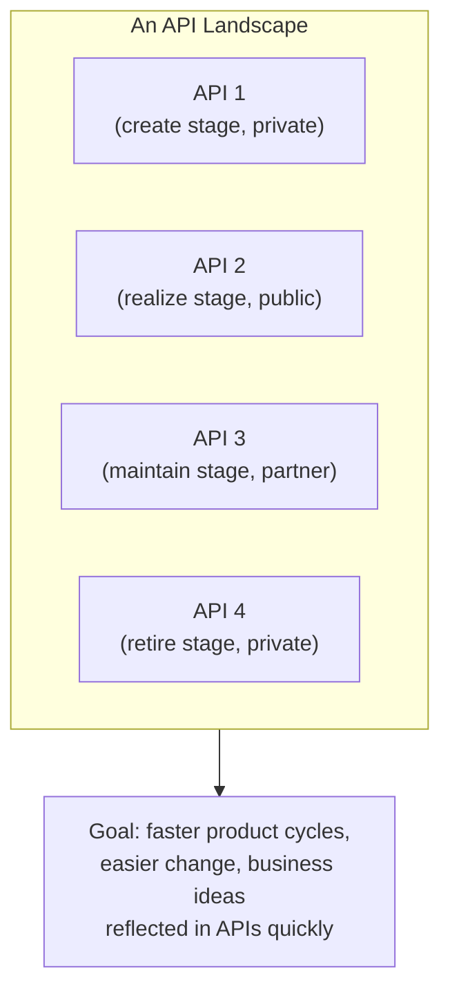
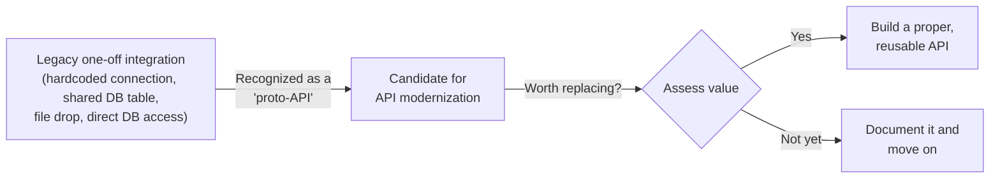
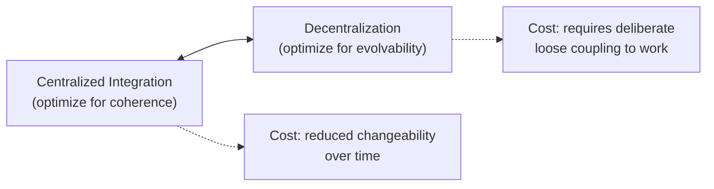
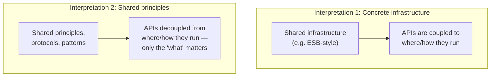
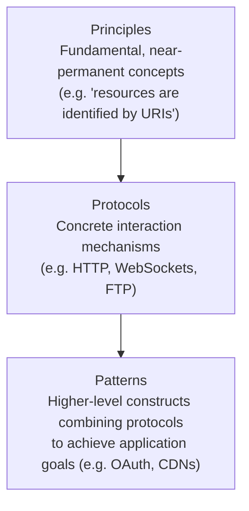
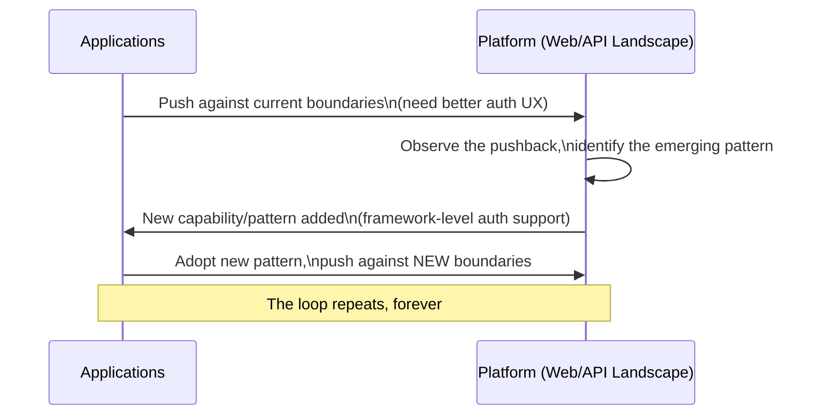
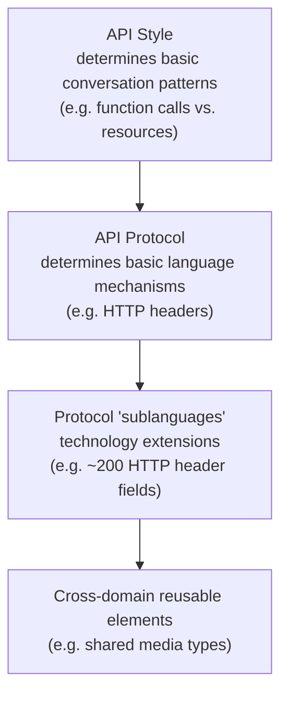
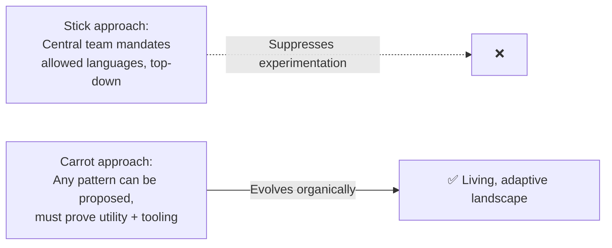
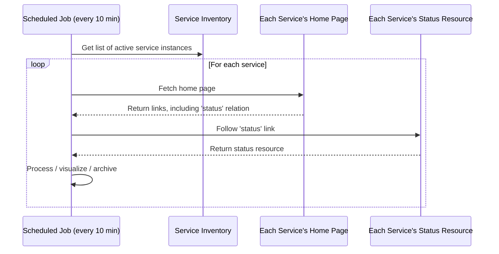
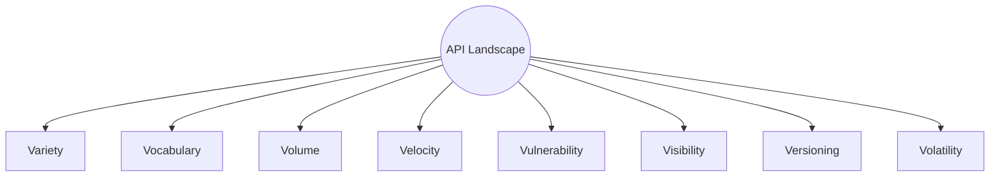

# Managing an API Landscape: Everything I've Learned About Scaling Past a Single API
  
There's a Richard Dawkins line I keep coming back to whenever I'm trying to explain why managing many APIs is a genuinely different problem than managing one: *"The theory of evolution by cumulative natural selection is the only theory we know of that is in principle capable of explaining the existence of organized complexity."* I know that sounds like a strange quote to open a post about enterprise API management with, but I promise it earns its place. Once I stopped trying to *design* my API landscape top-down and started trying to *cultivate* it — letting good patterns emerge and spread, letting weak ones fade out — everything about managing a large set of APIs got easier. This post is about that shift in mindset, and the practical tools I use to actually pull it off.

## What I Mean by "API Landscape" 

I define an API landscape simply: it's the complete set of APIs a single organization has published. Those APIs can sit in wildly different maturity stages (create, publish, realize, maintain, retire), can be aimed at completely different audiences (private, partner, public), and can differ in style, protocol, or implementation. You might also hear this called an API portfolio, API catalog, or API surface area — I use these terms fairly interchangeably, though I personally like "landscape" best because it captures something the others don't: the sense of an environment that's alive and continuously changing, not a static inventory sitting in a spreadsheet.

The goal of managing this landscape well is to make designing, implementing, operating, and consuming APIs more effective *across the board* — not just for any single API in isolation. And here's the tension I want to name right up front, because it's the thread running through this entire post: **what's the best design decision for one individual API is not necessarily the best decision when I zoom out and look at the whole landscape.** A perfectly optimized individual service can still be a net negative for the landscape if it forces every consumer to learn yet another bespoke way of doing things.



## API Archaeology: Finding What's Already There

Before I get into how to actively manage a landscape going forward, I want to talk about something I think gets skipped way too often: figuring out what's *already there*. Almost no organization with any real IT history is starting from a blank slate. There are almost always integrations that already exist, quietly connecting systems together, long before anyone formally launches an "API program."

I like borrowing the term **API archaeology** for this work — the practice of unearthing existing integrations, understanding why and how they came to exist, and documenting them to build a clearer picture of an organization's IT history and structure. The name is deliberate: archaeology is about finding artifacts and understanding them in the context of where and when they originated, and that's exactly what this work involves for old, undocumented integrations.

> **Note:** I want to draw a distinction that matters in practice: an "API inventory" is usually just a list of *existing, formally-recognized APIs*. API archaeology goes further — it also digs into the non-API ways components have historically talked to each other, which is often where the real integration history is hiding.

### Proto-APIs

Here's a term I've found genuinely useful for framing these older, informal integrations: **proto-APIs** — from the Greek *protos*, meaning "first" (the same root as "prototype"). A proto-API is any mechanism, other than a proper API, that lets components interact. In an ideal landscape, every component interaction would happen through a real API — so from that vantage point, any non-API interaction becomes, by definition, a candidate for eventual modernization.



These proto-APIs often weren't even called "APIs" when they were built, and frequently weren't designed with reuse in mind at all — they were built to solve exactly one integration problem, between exactly two systems, which quietly undermines one of the core value propositions APIs are supposed to deliver in the first place. Not every proto-API is worth replacing. But finding and understanding them gives me real insight into where integration needs have historically emerged in my organization — and, by extension, a decent signal for where *new* integration needs are likely to show up again in the future.

> **Tip:** Some organizations with substantial legacy footprints have found real value in a dedicated **API librarian** role — someone whose job is specifically to own the history of the legacy architecture, know where services and their (proto-)APIs actually live, and understand how to access and use them. If your organization has been running IT systems for more than a few years, I'd genuinely consider whether this role deserves to exist, even informally.

## API Management at Scale: The Centralization/Decentralization Balancing Act

Once I move from "what already exists" to "how do I actively manage this going forward," I run straight into the classic complex-systems tension: **centralized integration for coherence and optimization** versus **decentralization for agility and evolvability.**

Centralized integration is what produced most traditional enterprise IT architectures — standardizing delivery so capabilities could be provided in an optimized, cost-effective way. High integration does unlock real optimization potential, but it comes at a real cost to the system's changeability over time. Decentralization, with the web as the most successful real-world example, takes the opposite approach: standardize on *accessibility* rather than tight integration, so capabilities can be delivered in an evolving variety of ways while still remaining usable, because everyone's agreed on a shared, minimal set of interaction rules.



### Avoiding the SOAP Trap

I think there's a genuinely important cautionary tale buried in the history of SOAP-based service-oriented architecture (SOA) here. SOAP got one thing right: it made previously inaccessible capabilities accessible as services. But it fundamentally missed the second half of the equation — it never addressed how to keep those services *loosely coupled* from each other. It solved accessibility without solving evolvability, and that gap is a huge part of why SOA never fully delivered on its early promises.

> **Caution:** I've seen modern API programs quietly fall into a version of this same trap — building a landscape that's technically "API-first" but still just as tightly coupled underneath as the old SOAP-based integration it replaced. Accessibility alone was never the whole point. If your landscape makes services *reachable* but doesn't actually make them *independently changeable*, you haven't escaped the SOAP trap — you've just given it a REST API on top.

## The Platform Principle

I hear the word "platform" thrown around constantly in API conversations, and I've learned to be careful about it, because people frequently mean genuinely different things by it. On the business side, a platform is simply a foundation that brings different parties together to exchange value — a pretty abstract framing, and I think that's intentional; it doesn't prescribe *how* the platform gets built technically.

Two factors tend to determine how attractive a business platform is: its **reach** (how many people/users can I access by participating?) and its **capabilities** (how does it support or constrain me as I try to generate value on top of it, and how easily can new capabilities get added without disrupting existing users?).

### Two Very Different Ways to Build an "API Platform"

Here's the distinction I think matters most, and it's easy to gloss over: an "API platform" can mean two genuinely different things technically.

**Interpretation 1: a concrete, shared environment.** In this version, the platform is literal infrastructure — think of the traditional enterprise service bus (ESB) model, where "being on the platform" means your API physically runs through, or depends on, a specific piece of shared infrastructure.

**Interpretation 2: a shared set of principles.** In this version, "being on the platform" has nothing to do with *where* or *how* your service runs — it's purely about whether you follow the same shared principles, protocols, and patterns. As long as you do, you're part of the platform, regardless of the concrete infrastructure underneath.



I've come to strongly prefer the second interpretation, and I want to explain why with a concrete comparison. Think about the difference between a **web application** and a **native app store application**. A web app can be used by literally anything that supports basic web standards — any modern browser, no central gatekeeper controls what gets built or deployed. A native app store app, by contrast, can typically only be installed through a centralized store the store owner exclusively controls, and it's built specifically for one platform — porting it elsewhere means largely rebuilding it from scratch, often in a completely different language.

| | Web Application | App Store Application |
|---|---|---|
| **Distribution control** | None — anyone can publish, anyone can use | Centralized — store owner controls what's allowed |
| **Portability** | High — works anywhere with basic web standards | Low — built specifically for one platform |
| **Reuse across platforms** | Native | Requires substantial rebuild |
| **Analogous "API platform" model** | Shared principles/protocols/patterns | Shared concrete infrastructure |

By decoupling the "what" of a capability from the "how" and "where" of its implementation, I get a platform that's easier to contribute to, and — genuinely important — one that leaves room for real innovation, because applications can experiment freely with their own implementation choices without losing their ability to participate in the broader landscape.

The web itself is my favorite proof of this working at scale. Take content delivery networks (CDNs) — nothing about a CDN is baked into the fundamental architecture of the web. It emerged as a pattern once the web's flexibility (browsers rendering pages assembled from many different sources) made it possible and, eventually, necessary. The *potential* for CDNs existed in the web's original principles and protocols from day one; the *pattern itself* only showed up once real demand made it worth inventing. That's exactly the adaptability I want my own API landscape to have.

## Principles, Protocols, and Patterns

This is the framework I lean on most for actually designing a platform that can evolve gracefully over time, and I think it explains something genuinely remarkable about the web: its fundamental architecture hasn't changed in almost 30 years, and yet it's evolved enormously in that same span. How is that not a contradiction?

The answer, as best I can tell, comes down to one design choice: **nothing about the web platform dictates how a service is implemented, hosted, or consumed.** Services can be built in any language, hosted anywhere (basements, hosted servers, the cloud), and consumed by any client (text browsers, modern mobile browsers) — because the *only* thing the platform actually constrains is the interface itself: how information gets identified, exchanged, and represented.

I break that interface-level constraint down into three layers:



**Principles** are the truly fundamental concepts baked into a platform's backbone. On the web, the principle that resources are identified by URIs, and that a URI-associated protocol governs interaction with them, is basically foundational — I could imagine a post-HTTP web (and honestly, we're partway there already with the shift toward HTTPS everywhere), but a *post-resource* web is much harder to even picture. API styles, in my experience, map directly onto which foundational principle they're built around.

**Protocols** define the concrete interaction mechanisms built on top of those principles. HTTP dominates the web today, but there's still real FTP traffic out there, plus more specialized protocols like WebSockets and WebRTC for specific needs. Agreeing on shared protocols is what actually makes interaction possible in the first place, and a well-designed platform lets the protocol layer itself keep evolving — HTTP/2 and HTTP/3 are a good example of protocol-level evolution happening without disturbing the underlying principle.

**Patterns** sit one level higher still — they're how interactions across one or more protocols get combined to accomplish a real application goal. OAuth is a great example: an HTTP-based choreography specifically designed to solve three-legged authentication. Patterns might be protocols in their own right (OAuth again), or they might just be established practices (the CDN example from earlier). And crucially, patterns evolve constantly — new ones get established, old ones get deprecated and fade into history.

### A Worked Example: Browser Authentication's Evolution

I like this example because it shows the whole feedback loop in action. Early in the web's life, browser-based authentication (the classic username/password popup, controlled entirely through web server configuration) was genuinely popular — it was simple and worked fine for the relatively basic scenarios of the early web. As the web grew, the limitations became obvious (logging out was a famously bad experience, for one), and authentication support matured into a standard feature baked directly into essentially every popular web programming framework — a far more flexible pattern that eventually displaced the earlier browser-native approach almost entirely.



This feedback loop — applications pushing on the boundaries of what a platform currently supports, and the platform evolving in response — is, in my view, the single biggest reason the web has succeeded as spectacularly as it has. I try to apply the exact same mindset to my own API landscape: instead of treating the constant evolution of practices as a problem to be stamped out, I treat it as a genuine *feature* — a sign the landscape is alive and responding to what teams actually need.

## API Landscapes as Language Landscapes

I've written elsewhere about the idea that every individual API is fundamentally a **language** — the specific way a provider and consumer interact to expose and use some capability. I want to extend that idea to the landscape level here, because I think it's genuinely clarifying: if every API is a language, then managing an API landscape is, in large part, an exercise in **language management** across the entire organization.

A few layers where language decisions get made, from most fundamental to least:



Managing this well is a genuine balancing act, and I've felt both failure modes personally. Push for too much unification, and people building on the landscape feel stifled — unable to express what their specific API actually needs to express. Push for too little shared language, and the landscape balloons into an overly-varied mess where the same underlying problem gets solved a dozen different ways across a dozen different APIs, with no real functional benefit to justify the variety.

### Carrot, Not Stick

The pattern I've seen work best for managing this tension is what I'd call **carrot over stick**.

The stick approach is the traditional top-down model: a small central team decides which languages/formats/patterns are allowed, and declares — by fiat — that nothing else is permitted. This is easy to enforce on paper, but it tends to actively suppress experimentation and makes it genuinely hard to discover and establish better new practices as they emerge.

The carrot approach flips this: **any** language or pattern can be proposed for wider reuse, provided it comes with real supporting tooling and libraries that genuinely make life easier for the people using it. The pattern has to *earn* its place by demonstrating real utility, not by executive decree.



> **Note:** The carrot model has a natural, healthy consequence: the set of promoted languages and patterns should genuinely evolve over time. Some will fall out of favor, either eclipsed by a more successful competitor or simply because people move on to a better way of doing things. This is exactly what happened in the XML-versus-JSON space — plenty of XML services are still out there, but JSON has become the default choice for new APIs. I fully expect something will eventually start displacing JSON's dominance too, and I try to design my landscape governance to expect that turnover rather than be surprised by it.

## Vocabulary: The Reusable Building Blocks of API Language

Vocabulary is where language management gets genuinely concrete and actionable. The core idea: some parts of an API's "language" don't need to be reinvented every single time — they can be shared, standardized building blocks reused across many APIs in the landscape.

### A Worked Example: Standardizing Error Messages with RFC 7807

A really practical instance of this is error message formatting. Plenty of HTTP-based REST APIs invent their own custom error message shape because they want to expose more detail than a bare HTTP status code provides. But there's already a standard for exactly this: RFC 7807's "problem details" format.

Here's the example straight from the RFC, showing how standardized and API-specific vocabulary can coexist cleanly in the same payload:

```json
{
  "type": "https://example.com/probs/out-of-credit",
  "title": "You do not have enough credit.",
  "detail": "Your current balance is 30, but that costs 50.",
  "instance": "/account/12345/msgs/abc",
  "balance": 30,
  "accounts": ["/account/12345", "/account/67890"]
}
```

The `type`, `title`, `detail`, and `instance` fields come from the RFC 7807 standard itself. The `balance` and `accounts` fields are proprietary — specific to this particular API's domain. That's exactly the pattern I want: standardized where standardization has real, obvious value, extended freely where an individual API genuinely needs to say something specific.

Here's a small, tested implementation showing how easy this is to build once you commit to the shared format:

```javascript
// problem-details.js
function problemDetails({ type, title, status, detail, instance, ...extras }) {
  return {
    type,
    title,
    status,
    detail,
    instance,
    ...extras, // API-specific extension fields
  };
}

module.exports = { problemDetails };
```

```javascript
// problem-details.test.js
const { problemDetails } = require('./problem-details');

describe('RFC 7807 problem details helper', () => {
  test('produces a standard problem report with API-specific extensions', () => {
    const result = problemDetails({
      type: 'https://example.com/probs/out-of-credit',
      title: 'You do not have enough credit.',
      status: 403,
      detail: 'Your current balance is 30, but that costs 50.',
      instance: '/account/12345/msgs/abc',
      balance: 30,
      accounts: ['/account/12345', '/account/67890'],
    });

    // Standard RFC 7807 fields
    expect(result.type).toBe('https://example.com/probs/out-of-credit');
    expect(result.status).toBe(403);

    // API-specific extension fields pass through untouched
    expect(result.balance).toBe(30);
    expect(result.accounts).toHaveLength(2);
  });
});
```

The benefit cuts both ways. Teams *building* APIs don't have to invent, define, and document a brand-new error vocabulary from scratch — they adapt the shared one and extend it where needed. Teams *consuming* APIs don't need to learn a proprietary error format for every single API they touch — once they've learned RFC 7807 once, they recognize it everywhere it's used across the landscape.

### EIMs: A Cautionary Tale in Over-Standardization

I want to flag a trap here, because I've seen organizations fall into it with the best of intentions: the idea of a complete **enterprise information model (EIM)** — one single, fully coherent model of literally everything in the organization. In my experience (and this tracks with what I've seen in larger organizations generally), this ideal is basically always elusive. Documenting a truly complete vocabulary for a complex organization takes enormous effort, and by the time you finish, reality has already moved on — you're left with an expensive snapshot of the past, not a living model of the present.

> **Caution:** If your organization is chasing a perfectly unified EIM, I'd gently push back. A more realistic framing: treat the EIM as effectively *the union of everything currently exposed and actionable through your APIs* — nothing more, nothing less. What's not exposed or actionable through an API isn't really part of your organization's practical, working information model, however much documentation claims otherwise.

For genuinely cross-domain concerns (error formats being the clearest example), standardizing on a shared vocabulary is usually an easy, low-regret call. For domain-specific concepts, I let the API's own design *be* the domain model for that specific area — accepting that this won't produce one perfectly unified model of everything, in exchange for a model that's directly actionable and grounded in what actually exists.

### Three Ways Vocabularies Get Managed

I've found it useful to categorize vocabulary management into three rough patterns:

| Pattern | What It Looks Like | Example |
|---|---|---|
| **Complete representations** | The vocabulary defines an entire domain concept's meaning and serialization | JSON/XML schemas, media types |
| **Building blocks within representations** | The vocabulary covers just part of a larger representation | RFC 7807's standard fields alongside proprietary extensions |
| **Shared data types via registry** | A community-maintained, evolving registry of well-known values | Hypermedia link relation registries |

Whichever pattern I reach for, the underlying success factor is the same: vocabularies only pay off if they're genuinely **findable and reusable**. Good tooling makes an enormous difference here — HTTP itself has something like 200 defined header fields, but no sane API landscape should encourage using all 200 of them. Instead, I lean on design and implementation tooling built around a curated, well-understood subset, establishing a shared practice for which header fields actually matter in my organization's context. The exact same principle applies just as well to domain-specific vocabularies — a company's set of customer types, say, is a great candidate for a small registry that can grow and evolve as the business does.

## "API the APIs": Automating Landscape Management Through the APIs Themselves

Here's a principle I think is genuinely elegant once it clicks, and it's become something close to a mantra for me: **everything you want to say about an API, say it through the API.**

The logic is refreshingly self-referential: managing a landscape at scale requires automating an increasing number of tasks, and automation fundamentally requires information to be made available in a well-defined, machine-readable way. But making information available in a well-defined way is *precisely what APIs already exist to do.* So the natural conclusion is: use APIs (specifically, "infrastructure APIs," or infrastructure-oriented parts of your existing APIs) to expose the operational information you need about your landscape, rather than building a completely separate side-channel system to track it.

### A Worked Example: Automated Health Checks Across a Landscape

Say every API in my landscape follows a standardized pattern for exposing health/status information — a status resource, linked from each service's home page via a consistent link relation. Automating landscape-wide health collection becomes almost trivially simple:



Here's a small, testable version of exactly that logic:

```javascript
// landscape-health-collector.js
const axios = require('axios');

async function collectStatus(serviceHomeUrl) {
  const homeRes = await axios.get(serviceHomeUrl);
  const statusLink = homeRes.data._links?.status?.href;

  if (!statusLink) {
    return { serviceHomeUrl, healthy: null, reason: 'no status link found' };
  }

  const statusRes = await axios.get(statusLink);
  return {
    serviceHomeUrl,
    healthy: statusRes.data.status === 'ok',
    checkedAt: new Date().toISOString(),
  };
}

module.exports = { collectStatus };
```

```javascript
// landscape-health-collector.test.js
const nock = require('nock');
const { collectStatus } = require('./landscape-health-collector');

test('follows the status link relation and reports health', async () => {
  nock('https://api.example.com')
    .get('/')
    .reply(200, { _links: { status: { href: 'https://api.example.com/status' } } });

  nock('https://api.example.com').get('/status').reply(200, { status: 'ok' });

  const result = await collectStatus('https://api.example.com/');
  expect(result.healthy).toBe(true);
});

test('handles a service with no status link gracefully', async () => {
  nock('https://api.example.com').get('/').reply(200, { _links: {} });

  const result = await collectStatus('https://api.example.com/');
  expect(result.healthy).toBeNull();
  expect(result.reason).toMatch(/no status link/);
});
```

Because "expose a status resource, linked from the home page" is a *standardized part of the API itself*, writing generic tooling that works across every service in the landscape becomes genuinely trivial — I'm not writing bespoke integration code per service.

### Guidance Evolves Too

I want to flag something important here: whatever specific pattern I establish (status resources, a specific link relation name, whatever) isn't meant to be permanent. Guidance itself has its own lifecycle. A pattern might move from "experimental" to "recommended implementation" as it proves itself, and eventually to "sunset" and then "historical" once the landscape moves on to something better — with some older services still using the deprecated pattern for a while as they catch up.

> **Note:** I try to actively track this guidance lifecycle rather than treating "current best practice" as a fixed, permanent decision. Keeping a record of what's currently good, what's emerging as possibly-good, and what I *used* to think was good gives teams real context for understanding *why* a pattern is recommended right now — and signals honestly when that recommendation might be due for a rethink.

## The Eight Vs of API Landscapes

I want to close with the framework I find most genuinely useful for day-to-day landscape management: eight qualitative dimensions I think of as **dials** on my landscape management system — things I actively observe and tune, rather than "problems" I'm ever fully done solving.



### Variety

**Variety** captures the reality that a landscape's APIs come from different teams, different technology stacks, and different intended audiences. Some of this variety is genuinely *good* — it's exactly what gives teams real autonomy. A core platform service exposed to the widest possible audience might reasonably default to the resource style for maximum accessibility, while a backend built specifically to serve a mobile app might legitimately benefit from a query-style API using something like GraphQL, letting the app pull exactly the data it needs in one round trip.

The management challenge is genuinely a balancing act: too much variety and consumers face an unproductive multitude of API "flavors" to learn; too little variety and I lose the ability to match well-fitting design choices to genuinely different scenarios. I treat variety management as an act of ongoing *governance*, not a one-time decision — nothing I build into the landscape today should make it hard to revise my understanding of acceptable variety a few years from now, because the landscape genuinely won't look the same by then.

> **Tip:** I try never to bet everything on one set of design preferences, however sensible they seem today. GraphQL is a great example — regardless of my personal opinion on the technology, real consumer demand for it is a real signal, and being able to support these "preference clusters" over time, without treating my current preferences as permanent doctrine, is essential.

### Vocabulary

I covered this in depth above — the key summary point is that vocabulary management succeeds best when the focus stays on making things **findable and reusable**, not on chasing a single perfect, unified model of every concept in the organization.

### Volume

**Volume** is simply the raw count of APIs in the landscape, and it tends to grow — often into the hundreds or thousands for organizations with real scale and history. Some organizations deliberately try to keep volume down through careful curation; others focus on making it easy to *handle* volume well (good tooling, good visibility) rather than fighting the growth itself. Either way, I've found that as landscape maturity increases, handling volume becomes a matter of policy and tooling rather than a fundamental unsolved problem — it's genuinely natural for volume to rise as a landscape matures, and that's not inherently a bad sign.

### Velocity

**Velocity** is the speed at which the landscape lets ideas turn into shipped products — design, release, test, and change, all getting faster as an organization's API maturity improves. This is often the single biggest motivator for digital transformation efforts in the first place: faster markets and faster competitors demand faster reaction, and anything slowing the path from idea to shipped product directly harms competitiveness.

The mechanism that unlocks velocity, in my experience, is decoupling delivery — letting individual components change and deploy independently rather than requiring coordinated, synchronized releases. That's the direct payoff of embracing the platform model over tight integration: less coordination overhead per change, more velocity per team. The cost is that delivery and operations practices need genuine adjustment to handle a much more decentralized, independently-moving landscape responsibly.

> **Caution:** I think the web itself is an instructive (if slightly uncomfortable) extreme example here — at any given moment, something on the web is broken somewhere: a service down, a user hitting an unexpected change. The web "never fully works" in a strict sense, and yet the overall velocity gain more than compensates for that inherent brittleness. I don't think that means "embrace constant breakage" — but it does mean perfect, unbroken uptime everywhere isn't actually the bar that matters most; well-managed velocity with responsibly-handled brittleness is a genuinely good trade.

### Vulnerability

**Vulnerability** covers the expanded attack surface and dependency risk that comes with exposing more capabilities via more APIs. I want to share a real example that's stuck with me: in June 2018, Twitter acquired the anti-abuse technology provider Smyte. Companies had actual contracts with Smyte for its abuse/harassment/spam prevention APIs. Almost immediately after the acquisition — without warning — Twitter shut down Smyte's APIs, leaving dependent companies scrambling.

The lesson I take from that: **treat every external dependency as inherently brittle**, and build resilience into services to handle potential interruptions responsibly, as a standard development practice rather than an occasional afterthought. I'd actually extend that same discipline to *internal* dependencies too — as velocity increases across a landscape, the odds of hitting a runtime dependency problem rise right along with it, and non-resilient handling of any dependency, internal or external, is a predictable, foreseeable failure waiting to happen.

Vulnerability isn't purely a technical/malicious-actor concern either — it also covers the risk of APIs inadvertently exposing information or capabilities that shouldn't be accessible for legal, regulatory, or competitive reasons. That kind of exposure can do real damage to how an organization is perceived, and deserves just as much attention as directly malicious threats.

### Visibility

**Visibility** and scale are, in my experience, natural enemies. In a small landscape, informal discovery works fine — ask a colleague, get pointed in the right direction. That completely breaks down once you're managing a large, decentralized landscape.

I think about visibility in two connected halves, borrowing directly from how the web solved this same problem at a much larger scale: **discoverability** (can something even be found — the web's equivalent of having a working server and crawlable HTML) and **search** (a more contextual layer on top, ranking and surfacing what's actually *relevant*, the way Google's PageRank fundamentally changed web search by ranking on popularity/relevance rather than raw indexing).

This connects directly back to the "API the APIs" principle — visibility fundamentally depends on APIs exposing information about themselves *through themselves*, using shared, standardized vocabulary wherever possible. The tighter the link between vocabulary standardization and visibility tooling, the more leverage I get: shared vocabularies are exactly what make cross-landscape tooling and dashboards possible in the first place.

### Versioning

I want to share the framing that changed how I think about this Ⅴ the most: **the goal should be to avoid "hard" versioning as long as possible.** I look to the web again here — very few websites ship "new versions" that force existing users to relearn how the whole thing works. Instead, sites improve incrementally, in ways existing users can pick up if and when they want new functionality, without disrupting the workflows they already rely on.

I try to apply that same philosophy across my API landscape: design every API for extensibility from day one, so there's loose coupling between the "version" a consumer currently expects and the "version" the service is actually running. Under this model, most changes aren't really "new versions" at all — they're just improvements existing consumers don't need to learn about unless they specifically want the new capability. A genuinely *incompatible* change is different — that breaks the existing API outright, and in my mental model, that's really the birth of a **new API**, not a new version of the old one; consumers have to deliberately migrate, on their own schedule.

**Semantic versioning** is still a genuinely useful concept for tracking an API's evolving capabilities over time, even under this "avoid hard versioning" philosophy:

| Segment | Meaning | Consumer Impact |
|---|---|---|
| **MAJOR** | Breaking changes | Consumers must actively update; no smooth transition guaranteed |
| **MINOR** | Compatible additions to the interface | Consumers can keep using the API as-is; only need to update to adopt new functionality |
| **PATCH** | Bug fixes, no interface impact | No consumer action needed at all |

Used well, the version number itself becomes a compact piece of documentation, telegraphing at a glance whether a given update is worth investigating closely or safe to ignore.

### Volatility

**Volatility** is, in my view, the honest, unavoidable cost of decentralization. Services can change (though avoiding breaking changes helps enormously). Services can stop working temporarily. Services can disappear outright — nothing lives forever. Responsible development in a real API landscape means keeping all of this in mind for *every* dependency, not just the ones that feel obviously risky.

I think of volatility as the direct consequence of separating components as radically as a real API landscape requires — it trades the simple, binary "works or doesn't work" failure mode of a tightly integrated monolith for a much richer, messier set of possible partial-failure scenarios. That's a real cost, and I don't think it's honest to pretend otherwise.

> **Note:** The upside is that the *technique* for handling this well is genuinely well understood: graceful degradation. Well-built web applications have practiced this for years — treating both runtime service dependencies and the execution environment itself (an unpredictable mix of browsers and devices) as inherently unreliable, and designing to degrade gracefully rather than fail catastrophically when something doesn't behave as expected. I try to hold my own API-landscape applications to that exact same bar: program defensively, assume nothing about the availability or specific behavior of any dependency, and the landscape becomes dramatically more resilient as a whole, even though any individual piece of it remains genuinely volatile on its own.

---

## Bringing It All Together

If I compress this entire post into one operating principle, it's this: **treat your API landscape as a living, evolving environment you cultivate — not a static system you design once and enforce forever.** API archaeology tells me what's already growing in the ground before I start planting anything new. The platform principle, built on shared principles/protocols/patterns rather than shared infrastructure, gives that landscape room to actually evolve without breaking. Vocabulary management and the "API the APIs" mantra give me leverage to automate and scale management itself, rather than drowning in manual coordination as the landscape grows. And the eight Vs give me a genuinely practical, ongoing set of dials to watch — not problems I solve once, but dimensions I keep tuning, permanently, because a landscape that's actually alive never stops needing that attention.

That, more than any specific design guideline, is the real discipline of managing an API landscape well.
