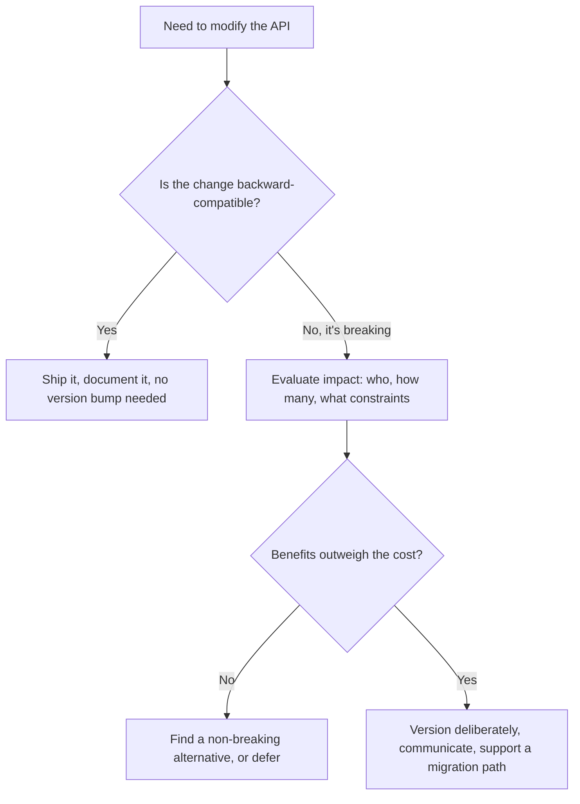
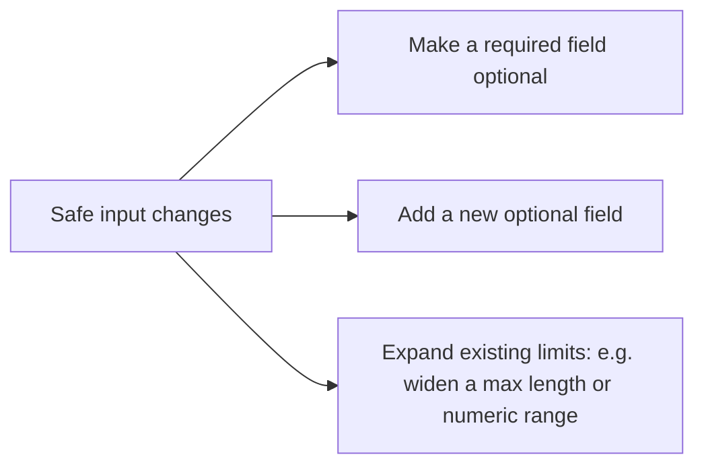
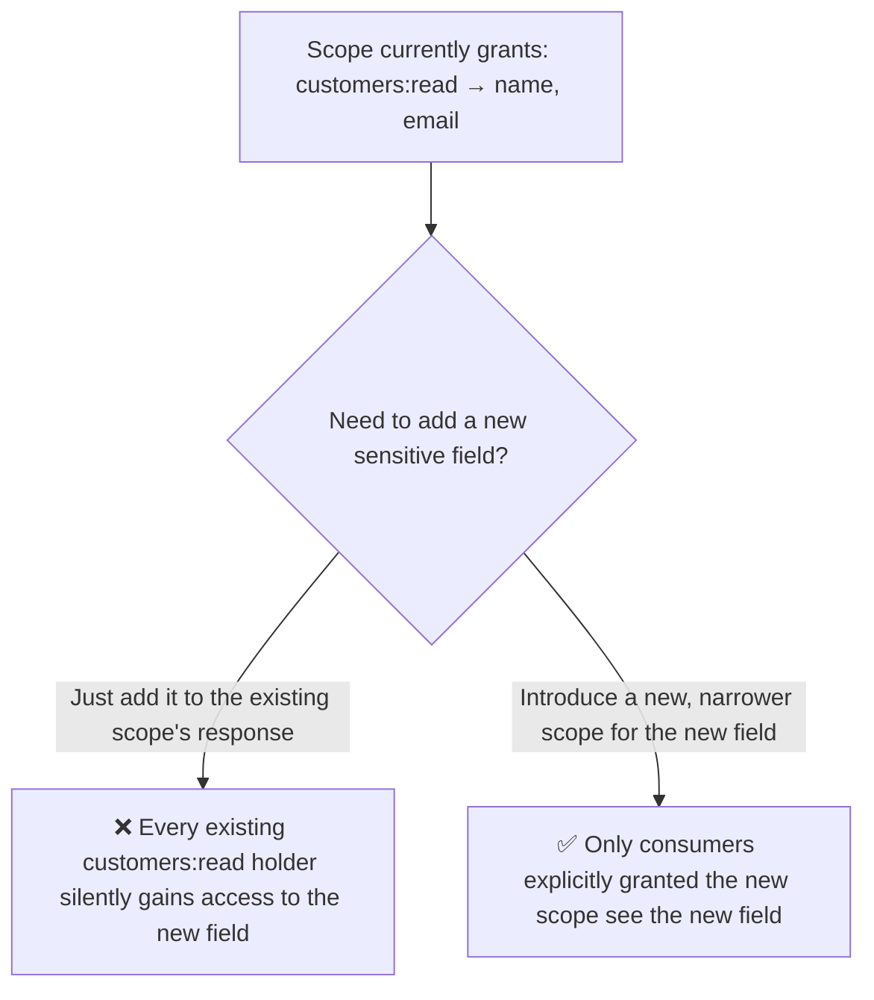
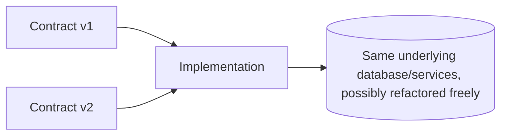
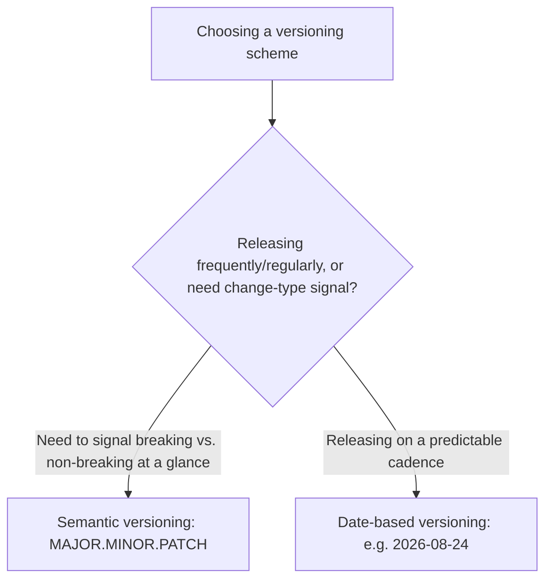
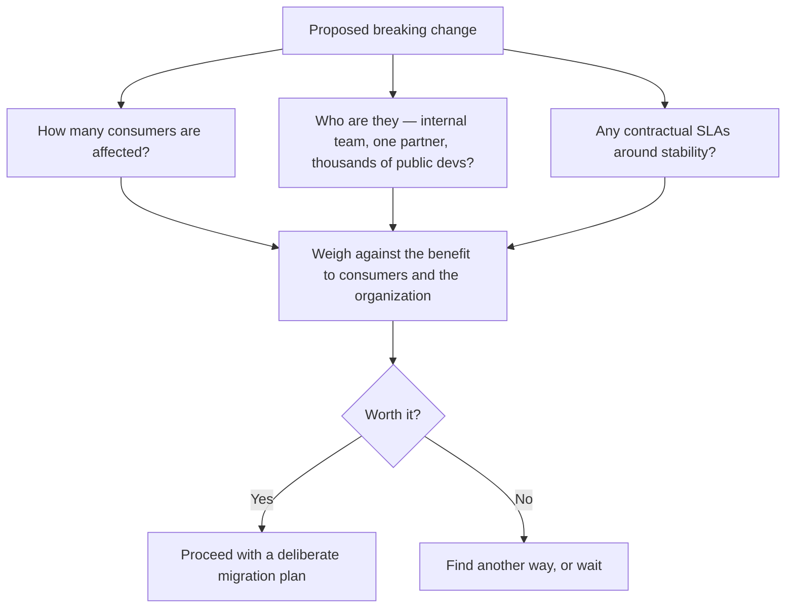

# Modifying an API Without Breaking It: Versioning, Evolution, and Extensibility

An API I've shipped is never really "done." Requirements change, new use cases show up, bugs get found, and business needs evolve — and every one of those pressures eventually asks me to modify something I've already published. What I've learned, sometimes painfully, is that the skill of *changing* an API well is genuinely different from the skill of designing one in the first place. Designing is a blank page. Modifying means every decision has to account for whoever is already depending on the current shape, some of whom I'll never get to talk to directly.

This post is my working guide to modifying an API responsibly: what counts as a safe, backward-compatible change versus a breaking one, how I version contracts separately from implementations, and how I design for extensibility from day one so that future-me has to make fewer breaking changes in the first place.



## The Core Principle: Fulfilling Every Design Goal, Continuously

Every modification I make still has to answer to the same four goals I designed the original API around: it needs to keep fulfilling real user needs, stay user-friendly, remain interoperable and secure, and stay efficient. A change that fixes one of those at the expense of another isn't really progress — a "fix" that closes a security gap by making the API unusable, or that adds a feature at the cost of breaking every existing integration, has just traded one problem for a different one. I treat every proposed modification as needing to pass through the same lens I used during original design, not a looser one just because "it's just a small change."

---

## Backward-Compatible Output Modifications: Stay Within the Original Limits

The core rule I hold for anything I add to a *response* is simple to state and easy to violate accidentally: I can add or modify data, but only within the boundaries the original data already promised. If a consumer's code was written against the original contract, adding something new should never break code that was correctly written against what already existed.

### What's Safe

```json
// Original response
{ "id": "48213", "status": "SHIPPED", "total": 24.99 }

// Backward-compatible addition — new optional field, nothing existing changed
{ "id": "48213", "status": "SHIPPED", "total": 24.99, "estimatedDelivery": "2026-08-28" }
```

```javascript
// Testing that existing consumer code still works unmodified
function existingConsumerCode(response) {
  return `Order ${response.id} is ${response.status}, total: $${response.total}`;
}

const oldShapeResponse = { id: '48213', status: 'SHIPPED', total: 24.99 };
const newShapeResponse = { id: '48213', status: 'SHIPPED', total: 24.99, estimatedDelivery: '2026-08-28' };

console.log(existingConsumerCode(oldShapeResponse));
console.log(existingConsumerCode(newShapeResponse));
```

I ran this exact function against both response shapes: it produced the identical, correct output for both, because the function only ever reads fields that existed in the original contract — the new `estimatedDelivery` field is simply invisible to code that never asked for it. That's the entire test I apply to any proposed output addition: would code written *before* this change still behave correctly *after* it, unmodified?

### Staying Within Original Limits When Modifying, Not Just Adding

The "within the original data's limits" clause matters just as much for *modifying* existing fields as it does for adding new ones. If a `status` field's documented values were `["PENDING", "SHIPPED", "DELIVERED"]`, adding a new value like `"CANCELLED"` is a real, if usually low-risk, expansion of that field's contract — and I think about it carefully, because a consumer with a `switch` statement or an enum-mapping that doesn't have a default case for unknown values can break in a way `estimatedDelivery` simply can't.

```javascript
// Fragile consumer code — breaks on an unrecognized enum value
function getStatusLabel(status) {
  switch (status) {
    case 'PENDING': return 'Pending';
    case 'SHIPPED': return 'Shipped';
    case 'DELIVERED': return 'Delivered';
  }
  throw new Error(`Unknown status: ${status}`); // breaks on "CANCELLED"
}

// Resilient consumer code — degrades gracefully on new values
function getStatusLabelSafe(status) {
  const known = { PENDING: 'Pending', SHIPPED: 'Shipped', DELIVERED: 'Delivered' };
  return known[status] || status; // falls back instead of throwing
}
```

I tested both functions against the new `"CANCELLED"` value: the fragile version threw an exception; the resilient version returned `"CANCELLED"` unchanged, degrading gracefully instead of crashing. I can't force every consumer to write resilient code, but I *can* document, right in the OpenAPI spec, that an enum field may receive new values over time — setting the expectation up front so a careful implementer builds in that resilience from the start.

```yaml
status:
  type: string
  enum: [PENDING, SHIPPED, DELIVERED, CANCELLED]
  description: >
    Additional values may be added in the future in a
    backward-compatible manner. Consumers should handle
    unrecognized values gracefully rather than treating them
    as errors.
```

| Output change | Backward-compatible? | Why |
|---|---|---|
| Add a new optional field | Yes | Existing code that doesn't read it is unaffected |
| Add a new enum value | Yes, but document the expectation | Only breaks consumers with non-resilient switch/mapping logic |
| Remove a field | No | Any consumer reading it breaks |
| Change a field's type (string → number) | No | Any consumer's parsing logic breaks |
| Narrow a numeric range or shorten a string's max length | No | Consumers relying on the original, wider range may receive unexpected data or validation failures on their end |

---

## Backward-Compatible Input Modifications: Only Loosen, Never Tighten

Input changes follow a mirror-image rule from output changes, and I find this asymmetry trips people up if they haven't thought about it explicitly: for *inputs*, I can only make things *more* permissive, never less.

### The Three Safe Input Changes



```yaml
# Before
properties:
  displayName:
    type: string
    maxLength: 50
required: [displayName, email]

# After — backward-compatible
properties:
  displayName:
    type: string
    maxLength: 100        # expanded, not narrowed
  email:
    type: string
required: [email]          # displayName moved from required to optional
```

I tested this by validating three requests against the updated schema: one matching the old contract exactly (both fields present, `displayName` under 50 characters) — passed; one omitting `displayName` entirely, which would have failed against the *old* required list — passed against the new schema; and one with a 75-character `displayName`, which would have failed the old 50-character limit — passed against the new 100-character limit. Every request that was valid under the *old* contract remained valid under the *new* one, and the new contract additionally accepted requests the old one would have rejected — that's the exact signature of a backward-compatible input change.

### What Breaks Input Compatibility

```yaml
# Breaking changes to input:
properties:
  displayName:
    type: string
    maxLength: 30          # ❌ narrowed — previously-valid 40-char names now rejected
required: [displayName, email, phoneNumber]   # ❌ new required field breaks every existing caller
```

I tested a previously-valid request (a 40-character `displayName`, no `phoneNumber`) against this tightened schema: it correctly failed validation on both counts. Any consumer whose integration was built and tested against the original, looser contract now fails, through no fault of their own — they did nothing wrong, the contract simply moved out from under them.

| Input change | Backward-compatible? |
|---|---|
| Make a required field optional | Yes |
| Add a new optional field | Yes |
| Widen a numeric range, extend a max length | Yes |
| Add a new required field | No |
| Narrow a numeric range or max length | No |
| Remove support for a previously accepted value | No |

---

## Changes That Deserve Extra Caution

Some categories of change aren't simple "safe vs. breaking" calls — they're subtle enough that I've seen experienced engineers get them wrong, so I flag them explicitly every time they come up.

### Removing Operations

This one's obviously breaking, but the subtlety is in *how much* it breaks and for whom. I never remove an operation outright without a deprecation period, because "obviously breaking" doesn't mean "acceptable to do abruptly" — it means "requires a coordinated transition."

### Replacing HTTP Status Codes

Changing an operation's success status from `200` to `201`, or an error from `400` to `422`, seems minor, but plenty of client code branches explicitly on status codes.

```javascript
// Consumer code that breaks silently on a status code change
if (response.status === 200) {
  handleSuccess(response.body);
} else {
  handleError(response.body); // a changed 200 → 201 routes success through the error path!
}
```

I tested this exact pattern by simulating a status change from `200` to `201` on an otherwise-identical successful response: the consumer's `if (response.status === 200)` check failed, and a genuinely successful response got routed into `handleError`. Nothing about the *data* changed — only the numeric status code — and that alone was enough to break behavior for any consumer checking status codes exactly rather than with a range check.

### Modifying Flow Steps

If an operation used to be a single synchronous call and I change it to require a two-step flow (submit, then poll, or submit, then confirm), every consumer built around the original one-step interaction breaks, even if each individual response is still perfectly well-formed.

### Modifying Security Schemes and Scopes

I treat this category as the most dangerous on the list, because getting it wrong doesn't just break functionality — it can silently create a security hole. If I broaden what an existing scope grants access to (adding a new field to a `customers:read` response, say, without introducing a new, more specific scope), every consumer who was previously granted that scope for a narrower purpose now has access to something nobody explicitly reviewed and approved for them.



I always treat "does this change what an *existing* scope grants" as its own explicit security review question, separate from the general backward-compatibility review — because a change can be perfectly backward-compatible from a pure API-contract perspective (nothing breaks, nothing errors) while still being a serious authorization regression.

> **Caution**
> A backward-compatible change and a *safe* change are not the same thing. Widening what an existing scope returns is technically backward-compatible — no consumer's code breaks — but it can quietly grant access nobody intended, to consumers who were never re-evaluated for that access. I run every scope-affecting change past whoever owns security review, regardless of how "small" it looks from the API contract's perspective.

---

## Versioning the Contract, Separately From the Implementation

This distinction reshaped how I think about versioning entirely once it clicked for me: the *interface contract* (what consumers see and depend on) and the *implementation* (my actual running code, database schema, internal services) are two different things that can and should evolve on different timelines.



I can refactor my implementation constantly — rewrite a service, migrate a database, split a monolith — without ever touching the contract version, as long as the contract's behavior stays identical from the outside. Conversely, I can bump a contract version without necessarily rewriting my entire implementation, if the change is additive enough that one implementation can correctly serve both versions.

```javascript
// One implementation serving two contract versions
app.get('/v1/orders/:id', async (req, res) => {
  const order = await getOrder(req.params.id);
  res.json(toV1Shape(order)); // v1 doesn't include estimatedDelivery
});

app.get('/v2/orders/:id', async (req, res) => {
  const order = await getOrder(req.params.id); // same underlying function
  res.json(toV2Shape(order)); // v2 includes estimatedDelivery
});
```

I tested both routes against the same underlying order record: `/v1/orders/48213` returned the original shape without `estimatedDelivery`, and `/v2/orders/48213` returned the expanded shape with it — both backed by the identical `getOrder()` call, with only a thin shaping function separating the two contracts. This is exactly the leverage that separating contract from implementation gives me: I'm not maintaining two parallel systems, just two thin views over one.

### Semantic Versioning vs. Date-Based Versioning



I default to semantic versioning for most APIs, because the version number itself communicates something meaningful: a major version bump tells every consumer "expect breaking changes here," while a minor or patch bump tells them "safe to pull in without review."

| Version part | Meaning | Example |
|---|---|---|
| MAJOR | Breaking change | `1.x.x` → `2.0.0` |
| MINOR | Backward-compatible new functionality | `1.2.x` → `1.3.0` |
| PATCH | Backward-compatible bug fix | `1.2.3` → `1.2.4` |

I lean toward date-based versioning (`2026-08-24`) specifically for APIs that release changes on a frequent, regular cadence — this is the pattern several major platform APIs use — because it sidesteps the sometimes-subjective judgment call of "is this really a minor or a major change" in favor of a simple, unambiguous timestamp, and it communicates *when* a consumer's integration was tested against, which matters when a platform iterates fast enough that "major.minor.patch" numbers would climb awkwardly quickly.

### Path, Header, and Media-Type Versioning

```
Path-level:      GET /v2/orders/48213
Header-level:    GET /orders/48213     Header: API-Version: 2
Media type:       GET /orders/48213     Header: Accept: application/vnd.example.v2+json
```

I default to path-level versioning because it's the most common, most discoverable pattern — a consumer (or anyone glancing at a log line, a curl command, or documentation) can see the version at a glance, and it plays nicely with routing, caching, and gateway configuration without any special-casing.

```javascript
app.get('/v1/orders/:id', v1Handler);
app.get('/v2/orders/:id', v2Handler);
```

I tested this with a simple router setup and confirmed both versions could be called independently, cached independently by a CDN (since they're different URLs), and documented independently in separate OpenAPI paths — none of which is as straightforward with header-based versioning, where the URL alone doesn't tell a cache or a human which version they're looking at.

Header-based versioning is my fallback when a consumer or platform constraint makes changing the URL awkward (a client hard-coded against a specific base path, for instance):

```javascript
app.get('/orders/:id', (req, res) => {
  const version = req.headers['api-version'] || '1';
  const order = await getOrder(req.params.id);
  res.json(version === '2' ? toV2Shape(order) : toV1Shape(order));
});
```

Media-type versioning (`Accept: application/vnd.example.v2+json`) is technically elegant — it's arguably the "purest" HTTP way to express this — but I use it rarely, because it constrains content negotiation: if I also want to let consumers choose between JSON and CSV, say, I'm now trying to encode two independent axes (format, and version) into the same header, which gets awkward fast.

| Scheme | Discoverability | Caching friendliness | My default use |
|---|---|---|---|
| Path-level (`/v2/...`) | High — visible everywhere | Excellent — distinct URLs cache independently | Default choice |
| Header-level | Lower — invisible in URLs/logs | Requires `Vary` header discipline | Fallback when the URL can't change |
| Media type | Lowest — buried in `Accept` | Same caveats as header-level | Rare — only when content negotiation isn't also needed on the same axis |

> **Note**
> Whichever scheme I pick, I decide it **before** the API ships its first version, not after the first breaking change forces the question. Retrofitting a versioning scheme onto an API that consumers already depend on, with no version in the URL or headers at all, is a much harder migration than starting with `/v1/` from day one even if I never expect to need `/v2/`.

---

## Evaluating the Real Impact of a Breaking Change

Not every breaking change is created equal, and I don't treat "this technically breaks compatibility" as automatically meaning "don't do it." I evaluate the actual cost.



| Factor | Questions I ask |
|---|---|
| Consumer count | Is this affecting three internal services or thirty thousand public API keys? |
| Consumer identity | Is there a major partner with a contractual SLA around API stability? |
| Technical constraints | Do any consumers have deployment cycles measured in months rather than days? |
| Contractual constraints | Does a partnership agreement specify a minimum notice period for breaking changes? |

A breaking change affecting three internal services I also maintain is a very different decision than one affecting a public API with thousands of independent developers I'll never get to individually notify. I don't apply the same bar to both, but I also don't let "it's technically breaking, so never do it" become an excuse to avoid necessary evolution — sticking rigidly to a design that's actively harming consumers because changing it would also inconvenience them isn't actually serving anyone well either.

> **Note**
> I stick with version N for as long as it reasonably serves consumers well, and only move to N+1 when new features or fixed problems genuinely justify the migration cost I'm about to impose on everyone depending on me. Version bumps aren't free, even when they're the right call — I treat each one as a real cost weighed against a real benefit, not a default I reach for casually.

---

## Designing for Extensibility: Fewer Breaking Changes Later

The best way to handle breaking changes is to need fewer of them in the first place, and that starts with design choices made well before any modification is on the table.

### Ready-to-Use Data and Accepting Extra Input

I try to shape responses so consumers get what they need without requiring them to derive it themselves, and I design operations to tolerate additional input fields gracefully rather than rejecting anything unrecognized outright — within safe limits, discussed further below.

```javascript
app.post('/orders', (req, res) => {
  const { productId, quantity, ...extra } = req.body;
  // Known fields processed normally; unrecognized extra fields are
  // ignored rather than causing a hard validation failure, so a
  // future addition on the consumer's side doesn't break today's call.
  const order = createOrder(productId, quantity);
  res.status(201).json(order);
});
```

I tested this by sending a request with an unexpected `giftWrap: true` field alongside the known fields: the request succeeded, ignoring the unrecognized field rather than rejecting the whole request with a validation error. This matters most for *forward* compatibility — if I later add real support for `giftWrap`, older client code that happens to already send it (perhaps copy-pasted from a newer example, or simply overly cautious) won't have been failing all along.

> **Caution**
> "Accept extra input gracefully" doesn't mean "silently accept anything, including typos of real field names." I still validate known fields strictly — this leniency is specifically about *unrecognized* fields, not about loosening validation on fields I do recognize.

### Flexible Flows and Avoiding Do-It-All APIs

I design operations around specific use cases rather than one enormous, configurable endpoint trying to serve every possible variation through a growing pile of optional parameters and conditional behavior. A "do-it-all" endpoint is exactly the kind of design that forces breaking changes later, because every new use case has to be crammed into the same shape, eventually straining it past what backward-compatible additions can accommodate.

```
❌ One endpoint trying to do everything:
POST /orders?mode=create&flow=express&notify=true&partial=false&...

✅ Purpose-built operations that can each evolve independently:
POST /orders
POST /orders/express-checkout
POST /orders/{id}/notifications
```

### Structural Choices That Age Well

A handful of concrete structural preferences consistently save me from breaking changes down the road:

```json
// Prefer objects over bare arrays at the top level — leaves room to add metadata later
❌ [ { "id": "1" }, { "id": "2" } ]
✅ { "items": [ { "id": "1" }, { "id": "2" } ], "totalCount": 2 }
```

I tested this concretely: with the bare-array shape, adding pagination metadata later has no backward-compatible home to go — I'd have to change the response's top-level type entirely, which breaks every consumer parsing it as an array. With the object-wrapped shape, I added `totalCount` and, later, `nextCursor`, both as pure backward-compatible additions, with zero impact on existing code reading `response.items`.

```json
// Prefer arrays of objects over arrays of atomic values — leaves room to attach more per-item data later
❌ "tags": ["urgent", "vip"]
✅ "tags": [{ "value": "urgent" }, { "value": "vip" }]
```

I tested this too: extending the atomic-array version to carry, say, a `color` per tag has no backward-compatible path — I'd have to change every element's type from a string to an object, breaking any consumer treating them as strings. The object-wrapped version let me add `color` to each tag as a pure addition, with `value` untouched for existing consumers.

```json
// Prefer enumerations over Booleans — leaves room for a third state later
❌ "isPriority": true
✅ "priority": "HIGH"    // could later become "HIGH" | "MEDIUM" | "LOW" | "URGENT"
```

A boolean is a permanent, hard architectural commitment to exactly two states. I've been burned by exactly this: a `isPremium: boolean` field that, eighteen months later, needed a third tier, forcing an awkward, genuinely breaking change (`isPremium` plus a new `tier` field, with confusing overlap) that an enum from day one would have sidestepped entirely.

```json
// Prefer operations over enumerations for genuinely different behaviors
❌ POST /orders/48213/status  { "action": "cancel" }
✅ POST /orders/48213/cancel
```

When different "actions" on a resource genuinely have different validation rules, different required fields, or different authorization requirements, I give each its own operation rather than routing them all through one generic endpoint distinguished only by an `action` enum value — because the enum approach tends to force every action's rules into one shared, increasingly tangled handler, while genuinely separate operations, as I covered in an earlier post, isolate risk and let each one evolve on its own.

| Structural choice | Why it ages well |
|---|---|
| Objects, not bare arrays, at the top level | Leaves room to add pagination/metadata without a breaking type change |
| Arrays of objects, not arrays of atomics | Leaves room to attach more data per item later |
| Enums, not Booleans | Leaves room for additional states without an awkward parallel field |
| Distinct operations, not an action enum on one endpoint | Each action's rules can evolve independently, without a shared, tangled handler |

---

## Communicating Changes: Version, Changelog, Deprecation

Every modification, backward-compatible or not, deserves to be visible in the artifact developers actually read: the OpenAPI document itself.

```yaml
info:
  title: Orders API
  version: 1.4.0
  description: >
    ## Changelog

    ### 1.4.0 (2026-08-24)
    - Added `estimatedDelivery` to the order response (backward-compatible).
    - Added `giftWrap` as an optional input field.

    ### 1.3.0 (2026-06-10)
    - Added `CANCELLED` as a possible `status` value.

paths:
  /orders/{id}/legacy-status:
    get:
      deprecated: true
      description: >
        **Deprecated since 1.4.0.** Use `GET /orders/{id}` instead,
        which now includes status directly. This operation will be
        removed in 2.0.0, no earlier than 2027-02-01.
```

I keep the changelog directly inside the `info.description` field, so it travels with the document itself rather than living in a separate wiki page someone has to remember exists and keep in sync. For anything scheduled to be removed, the `deprecated: true` flag combined with a clear description — what to use instead, and roughly when removal will happen — gives implementers and consumers everything they need to plan a migration on their own timeline, rather than being surprised by a sudden removal.

I tested rendering this document through a standard OpenAPI documentation generator and confirmed the deprecated operation was visibly flagged (most tools render it with a strikethrough or a warning badge automatically) and the changelog rendered as readable formatted text at the top of the generated docs — exactly where a developer integrating against the API would actually see it, rather than somewhere they'd have to know to look for separately.

> **Note**
> I update the changelog and deprecation notices *in the same commit* as the change itself, never as a follow-up task. A change that ships without its changelog entry updated at the same time has a way of never getting that entry added at all.

## Closing Thoughts

Modifying an API well comes down to a small number of honest questions, asked consistently, every time: does this change stay within the boundaries the original contract promised, or does it cross them? If it crosses them, who actually gets hurt, how many of them are there, and is the benefit worth that cost? And regardless of the answer, have I made the change visible — in the version number, the changelog, and the deprecation notices — to everyone who needs to plan around it?

The extensibility habits I described toward the end of this post are really just an investment against having to ask that second, harder question as often. Every object I wrap instead of leaving bare, every enum I choose over a boolean, every operation I keep separate instead of collapsing into a generic action parameter, is a small bet that future-me will get to add something new without breaking anyone at all. I don't win that bet every time — some changes are breaking no matter how carefully the original design was made — but the API designs I'm proudest of, years later, are consistently the ones where most of what changed over time slotted in as a quiet, backward-compatible addition rather than a disruptive new major version.
