# Observing Operations from the REST Angle

## The Goal of This Stage

Once you have a list of API capabilities written in plain language — things like "Search for products," "Add a product to the catalog," "Modify a product" — the next job is to translate each one into concrete REST elements: **resources**, **actions**, and their **inputs/outputs**. Only after that translation is complete do you move on to representing everything with actual HTTP methods, paths, and status codes.

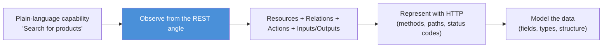

This is a deliberately staged process. Jumping straight to HTTP verbs and URLs too early causes two problems: it distracts subject-matter experts with technical details they don't need to weigh in on, and it lets prior HTTP experience bias the design before the actual business need has been fully understood.

---

## HTTP: The Transport Layer Underneath REST

HTTP is a **synchronous request–response protocol**. A client sends a request describing what it wants; a server replies with a response. Every exchange has the same basic shape:

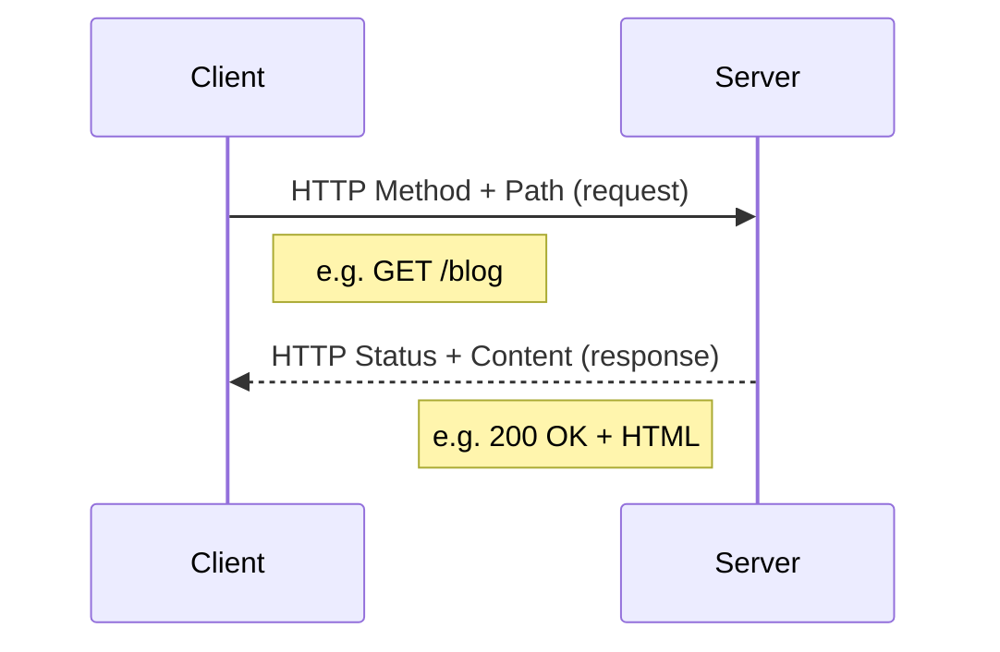

- **Method** — what kind of action is being requested (`GET` to retrieve, `POST` to send/create, and others).
- **Path** — which resource is being targeted (`/blog`, `/products`).
- **Status code** — whether the request succeeded or failed, and how (`200 OK`, `404 Not Found`, etc.).
- **Content** — the actual data being exchanged, in whatever format makes sense (HTML, JSON, XML, images...).

This mechanism is identical whether the client is a browser, a command-line tool, a mobile app, or a script — and identical whether the server is serving a static web page or a business API endpoint.

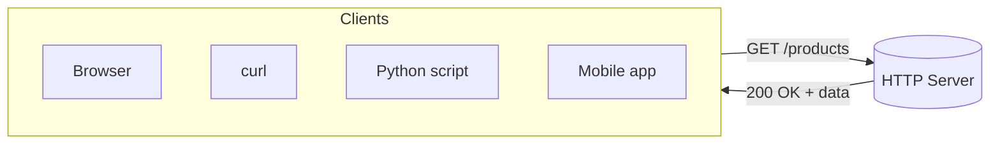

### What makes it a *REST* API specifically

A REST API is a web API that uses HTTP **and respects its semantics** — meaning it uses methods and status codes the way they were designed to be used, not just as a generic pipe for moving data back and forth.

The key difference from a plain web page request: the "resource" being returned isn't a web page — it's a **business concept**. Calling `GET /products` on a shopping API returns structured data (e.g., JSON) representing actual products, not HTML.

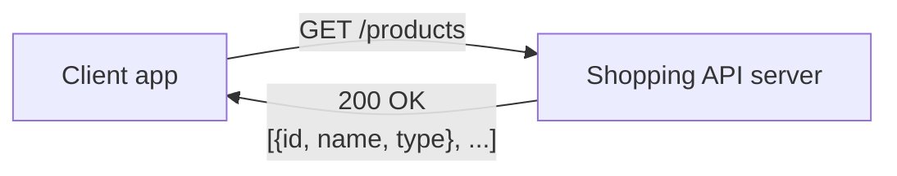

### Respecting HTTP semantics vs. ignoring them

Some APIs use HTTP purely as a transport pipe without honoring what its methods and status codes actually mean. This creates confusing, non-standard behavior.

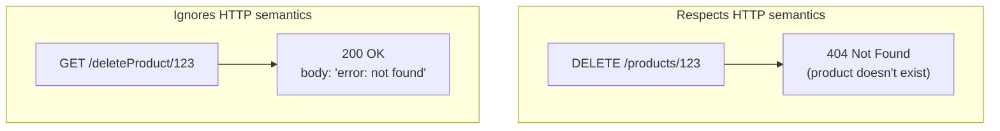

In the compliant version, deleting a resource uses the `DELETE` method, and a missing resource correctly returns a `404` status. In the non-compliant version, a `GET` (meant only for *reading* data) is repurposed to trigger a deletion, and the failure is buried inside a "successful" `200 OK` response — forcing every consumer to parse the body just to find out something went wrong. Staying within HTTP's actual definitions keeps an API predictable and interoperable across different clients and tools.

---

## The Three Layers of Designing a REST Interface

Turning a capability into a working REST interface happens in three ordered layers:

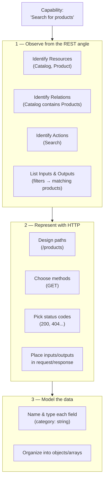

This document focuses entirely on **layer 1** — observing operations to extract their resources, relations, actions, and inputs/outputs — since everything downstream depends on getting this right first.

### Why resource/HTTP decisions are deliberately postponed

Even when the eventual HTTP mapping seems obvious (e.g., "search the catalog" clearly becomes `GET /products`), jumping there immediately is risky:

- It pulls the conversation with subject-matter experts away from business needs and into technical bikeshedding (should it be `/products`, `/product`, or `/catalog`?).
- Prior familiarity with REST conventions can bias the design toward a familiar shape that doesn't actually fit the real use case.
- Some operations don't map cleanly onto simple resource + standard-method thinking at all — for example, a "borrowing" process in a library system is more of an *action/process* than a *business object*, and forcing it into a resource mold too early can produce a flawed design.

Working out the resources and actions first — in plain language — before touching HTTP avoids these traps.

---

## Reorganizing Captured Capabilities Around Operations

Capabilities are often originally captured organized by **use case** (e.g., grouped under "Buy products" or "Fill catalog"), with the same operation possibly appearing under multiple use cases. To analyze operations properly, it helps to **pivot** this data so it's organized by **operation** instead.

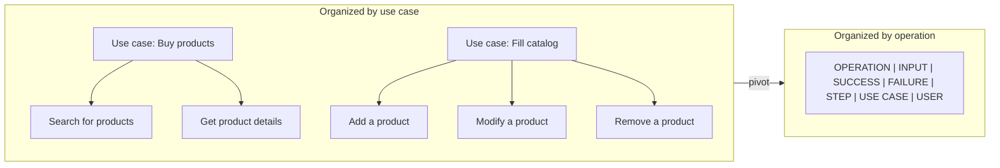

Once pivoted, two new reference tables are built up as findings accumulate:

- **Resources table** — resource name and how it relates to other resources.
- **Operations table** — operation name, the action it performs, the resource it targets, and its inputs/outputs.

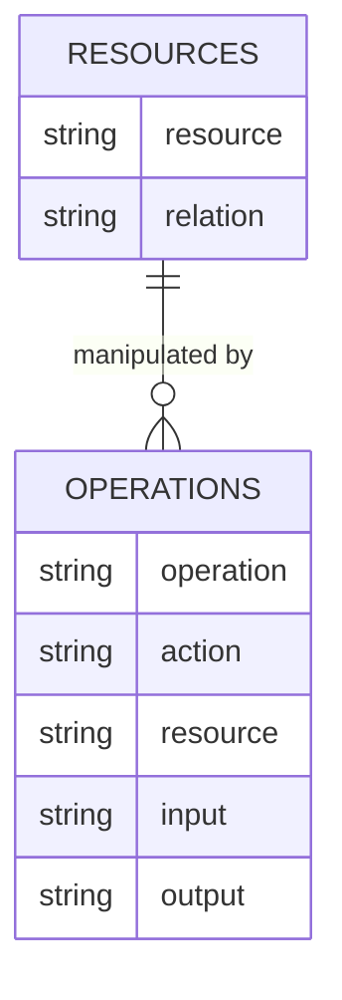

---

## Identifying Resources

### What counts as a resource

A resource is a **high-level business concept** relevant to the API's subject matter — described with a noun, using the domain's own vocabulary. Crucially, a resource can **exist and be manipulated independently**. Small pieces of data that only make sense *attached to* something else (like a product's name) are **properties**, not resources.

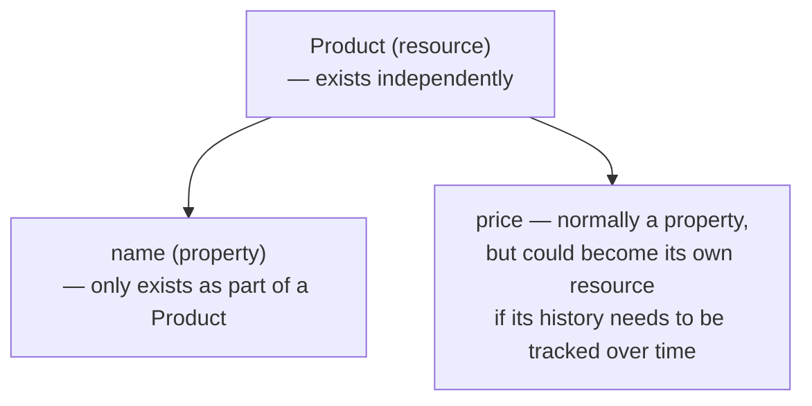

This distinction isn't fixed — sometimes deeper analysis reveals that something initially treated as a simple property (like price) actually needs to be tracked as its own resource, e.g., if historical price changes matter to the business.

### How to spot an operation's resource

The **main verb** in an operation's description points to the action; whatever that verb is acting *on* is usually the resource. Checking the operation's inputs, success outcome, and failure outcome confirms the guess.

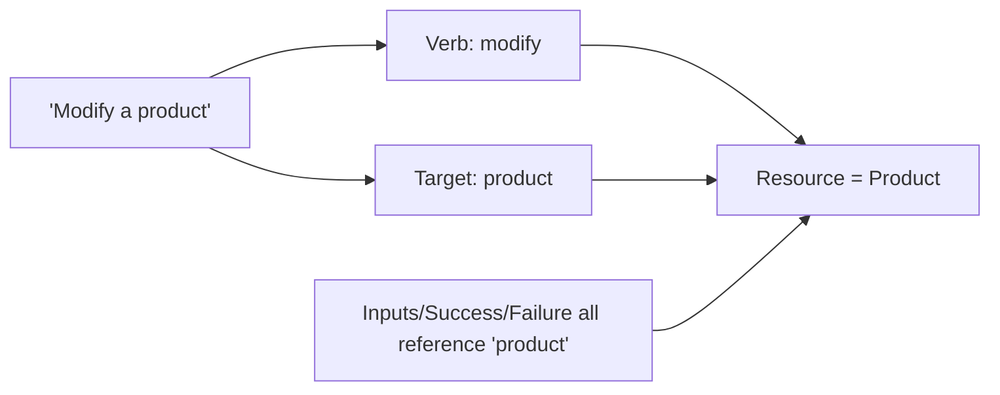

Note: **one operation manipulates exactly one resource**, though a single resource can be manipulated by many different operations (search, get, modify, remove might all target "Product").

### Tweaking the description when the resource is unclear

Sometimes the resource isn't obvious because multiple business concepts appear in the description. Two techniques help:

**Shortening** the description strips away detail until only the essential relationship remains.

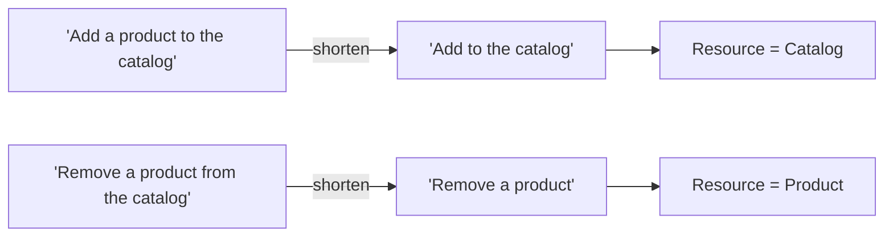

**Expanding** the description spells out implicit detail to reveal what's really being acted on.

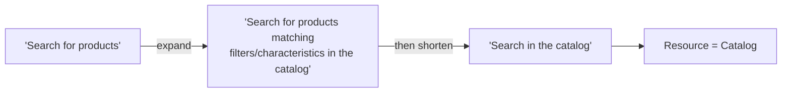

Even though "Product" appears prominently in the description, the input (filters/characteristics) and output (a set of matching products) both center on searching *within* the catalog — so the catalog, not the individual product, is the resource being acted on.

### When tweaking still doesn't resolve it: nested resources

If shortening/expanding the description doesn't produce a clean single resource, the operation may involve a **nested or hierarchical resource** — meaning the "resource" is really a resource-within-a-resource, and shouldn't be flattened.

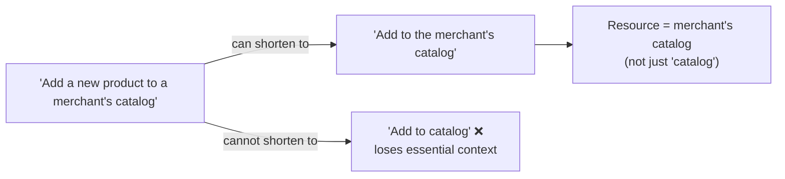

---

## Identifying Resource Relations

Once resources are identified, the next step is figuring out how they relate to each other — using subject-matter knowledge plus confirmation from the captured operations data.

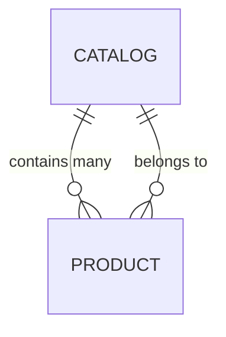

This relationship is usually obvious from domain knowledge alone (a catalog naturally contains products), but it's reinforced by evidence in the captured data: the "Search for products" operation returns "products matching filters," and "Add a product to the catalog" results in "product is in catalog" — both point to the same containment relationship.

Not every resource has a relation to another resource — it depends entirely on the subject matter.

### Caution

Identifying resources and relations resembles designing classes or database tables — but it should be driven by the actual business need, **not** by an existing codebase or database schema. Letting implementation details leak backward into the design defeats the purpose of designing from user needs first.

---

## Patterns for the Five Classic CRUD Operations

CRUD stands for **Create, Read (including search), Update, Delete** — the five most common operation types. A reliable pattern emerges for identifying the resource in each case:

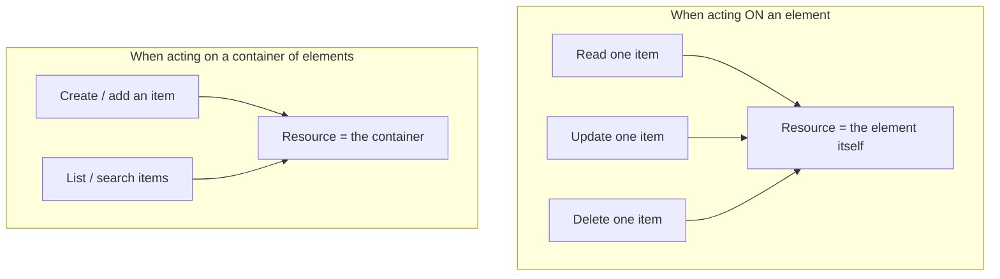

In other words:
- **Get, Modify, Remove** a specific thing → the resource is *that thing*.
- **Add to** or **Search/List within** a collection → the resource is the *container*.

Relations between resources are usually expressed as one of two patterns:
- **"X belongs to Y"**
- **"Y contains X"**

Recognizing these recurring patterns speeds up the process and increases confidence in the resulting design once they're internalized.

---

## Identifying Resource Actions

### What an action is

Every operation applies an **action** to its resource — and this action is described by the very same main verb used to identify the resource. This means resource identification and action identification effectively happen **at the same time**, from the same piece of text.

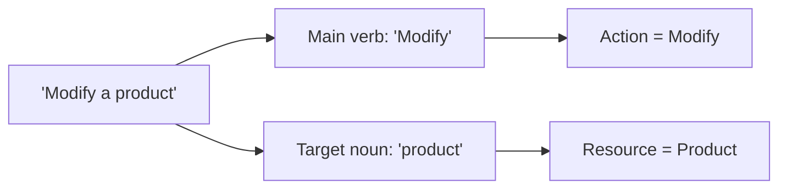

| Operation Description | Action | Resource |
|---|---|---|
| Search for products | Search | Catalog |
| Get product details | Get | Product |
| Add a product to the catalog | Add | Catalog |
| Modify a product | Modify | Product |
| Remove a product from the catalog | Remove | Product |

Once every operation has a clearly identified resource, relation, and action — along with its inputs and outputs — the design is ready to move into the next phase: mapping these plain-language elements onto actual HTTP methods, paths, and status codes.

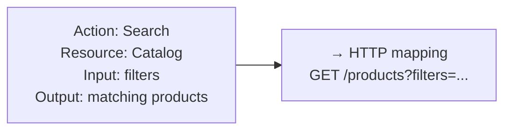
