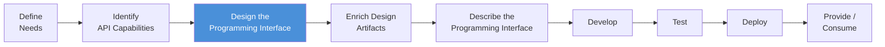
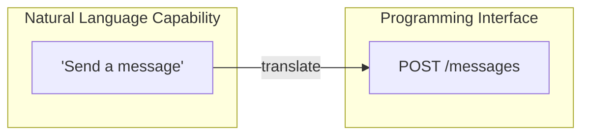
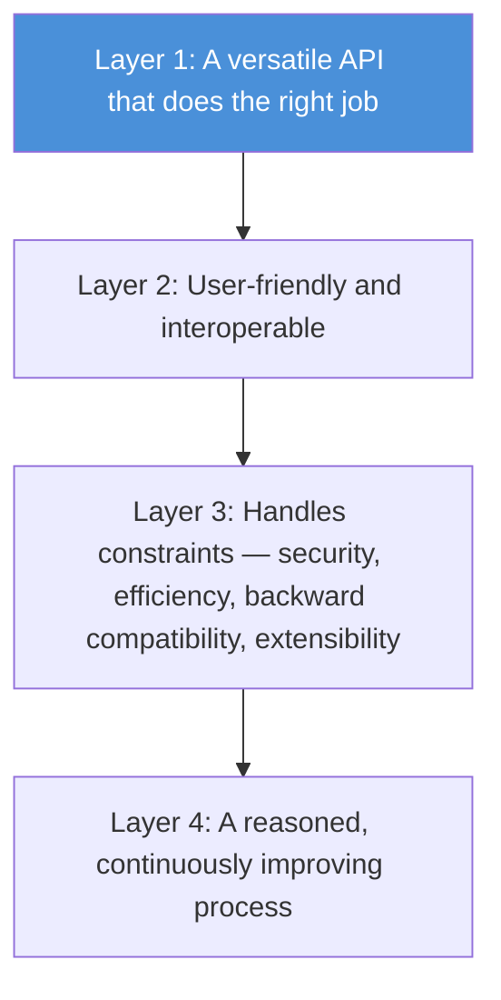
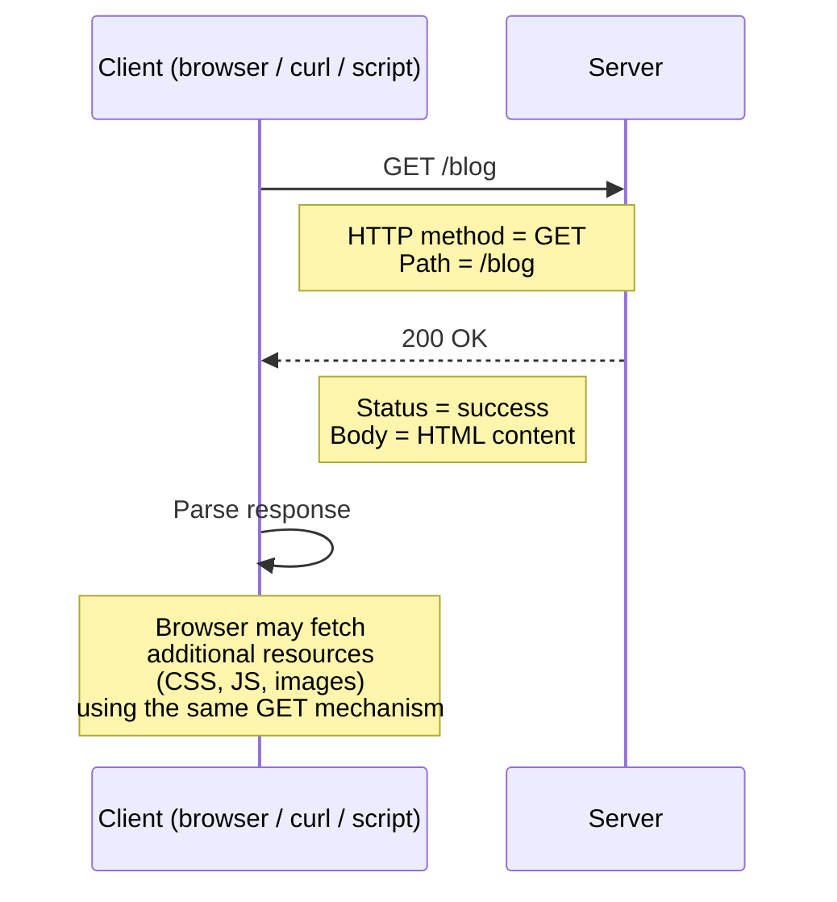
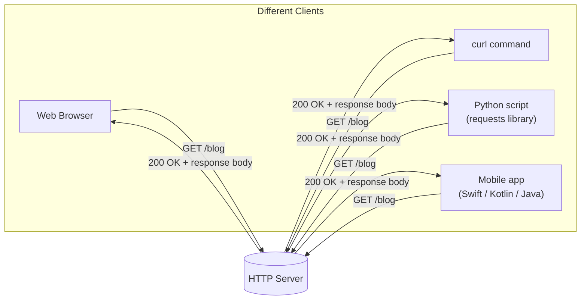
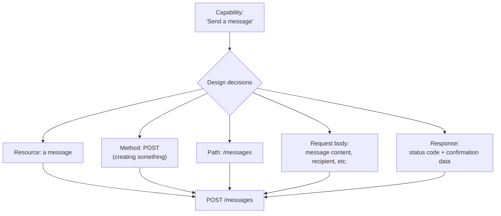

# Programming Interface Design: An Overview

## Where This Fits in the API Design Process

API design isn't a single step — it's a sequence of stages that build on each other:



By the time you reach "design the programming interface," you already have a list of **capabilities** described in plain language — things like "Send a message" or "Update customer's address." Nothing technical yet. No endpoints, no HTTP verbs, no data formats. Just a clear statement of what the API needs to let someone do.

The job of this stage is to take each of those natural-language capabilities and turn them into a **concrete technical interface** — in this case, a REST API made of URLs, HTTP methods, and structured data.



## Why the Split Matters

Notice that identifying *what* the API should do was deliberately kept separate from *how* it technically does it. This separation exists on purpose:

- Describing capabilities in plain language keeps the conversation accessible to non-technical stakeholders and prevents you from locking in a technical shape too early.
- Only once the *what* is validated do you start deciding the *how* — the specific HTTP methods, URL structures, request/response formats, and so on.

At this stage, the focus stays on a single concern: making sure the API actually **does the right job**. That means:

- It meets what consumers actually need.
- It hides internal implementation details (databases, internal services, business logic) instead of exposing them directly.
- It stays usable across different contexts and different types of consumers (web frontend, mobile app, third-party integrator, etc.).

Other concerns — security, performance, backward compatibility, extensibility — are intentionally set aside for now. They matter, but bundling every concern into one step makes the process overwhelming and increases the chance of getting the fundamentals wrong. Design is layered, and each layer is handled deliberately, one at a time.



*A caveat worth keeping in mind: REST is assumed as the API style here because it's the most common choice, but it isn't automatically the right one for every situation. GraphQL, gRPC, event-driven/async APIs, and others exist for good reasons and may fit a given context better.*

---

## HTTP: The Foundation of REST APIs

REST APIs are built on top of **HTTP (Hypertext Transfer Protocol)** — the same protocol web browsers use to load web pages. Understanding HTTP is essential because REST doesn't invent new communication mechanics; it reuses HTTP's existing ones.

### Core characteristics of HTTP

- **Synchronous request–response**: a client sends a request and waits for a response before continuing.
- **Resource-oriented**: everything you interact with — a blog post, a user profile, an order, an image — is treated as a *resource*.
- **Method-based interaction**: standardized verbs define *what kind of action* is being performed on a resource. The two most fundamental are:
  - `GET` — retrieve a resource
  - `POST` — send/create a resource
- **Format-agnostic representation**: a resource can be returned as HTML, JSON, XML, an image, a video, a PDF — whatever format makes sense for that resource and that client.
- **Technology-independent**: HTTP works the same way regardless of what's on either end — a browser, a mobile app, a Python script, a PHP server, a static file server. As long as both sides speak HTTP, they can communicate.

### A basic HTTP exchange, step by step

Below is what happens when a client (a browser, `curl`, or a script) requests a resource — for example, a blog listing page.



Breaking this down:

1. The client sends a request: `GET /blog`.
   - `GET` is the **method** — it tells the server the client wants to *retrieve* something, not modify or delete it.
   - `/blog` is the **path** — it identifies *which* resource is being requested.
2. The server processes the request and replies with a **status code** — `200 OK` means the resource was found and successfully returned.
3. The response body contains the actual content — in this case, HTML.
4. If the client is a browser, it parses that HTML and may issue further `GET` requests automatically for anything the page references (stylesheets, scripts, images) — using the exact same request–response mechanism.

### The same interaction, different tools

What makes HTTP powerful is that it doesn't care which tool or language sends the request — the server responds the same way regardless.



A minimal example in Python illustrates this — a script can perform the exact same request a browser performs, just without rendering the HTML visually:

```python
import requests

page = requests.get("https://example.com/blog")
print(page.text)
```

This script sends the same `GET /blog` request a browser would send. The server has no way of knowing (or caring) whether the request came from a browser, a script, or a mobile app — it responds identically to all of them. This uniformity is exactly what makes HTTP — and by extension, REST APIs built on it — usable across so many different contexts and platforms.

---

## Bringing It Together

A REST programming interface is essentially a structured *vocabulary* built on top of HTTP's existing mechanics (methods, paths, status codes, and body formats) to expose the capabilities identified earlier. The design step's job is to map each plain-language capability onto this vocabulary — deciding, for every capability, what resource it involves, what HTTP method fits the action, what the path should look like, and what data goes in and comes out.



This translation step is where the abstract "what the API should do" becomes the concrete "how a consumer actually calls it" — while still keeping the deeper concerns (security, versioning, performance tuning, etc.) deliberately out of scope until later stages.
