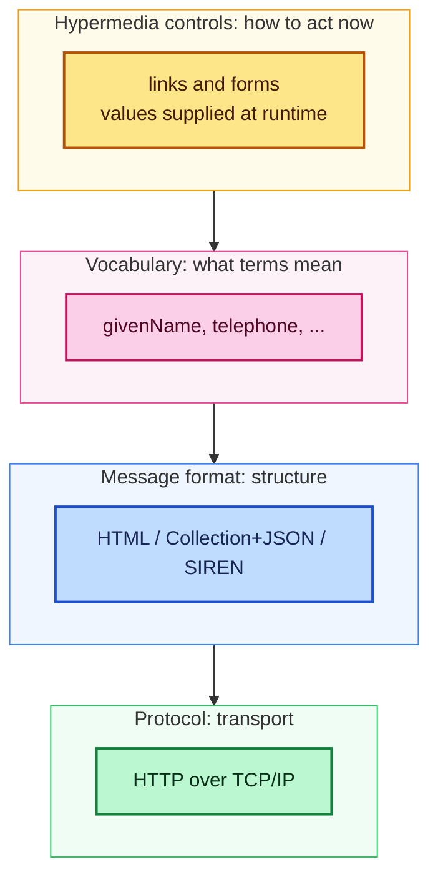
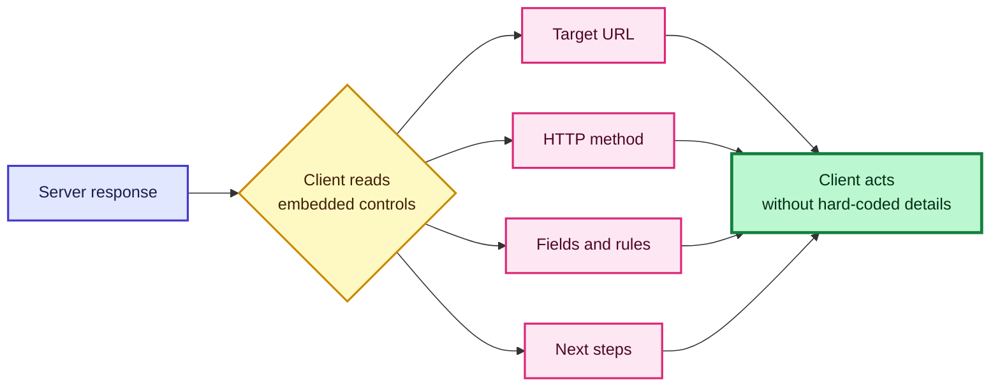
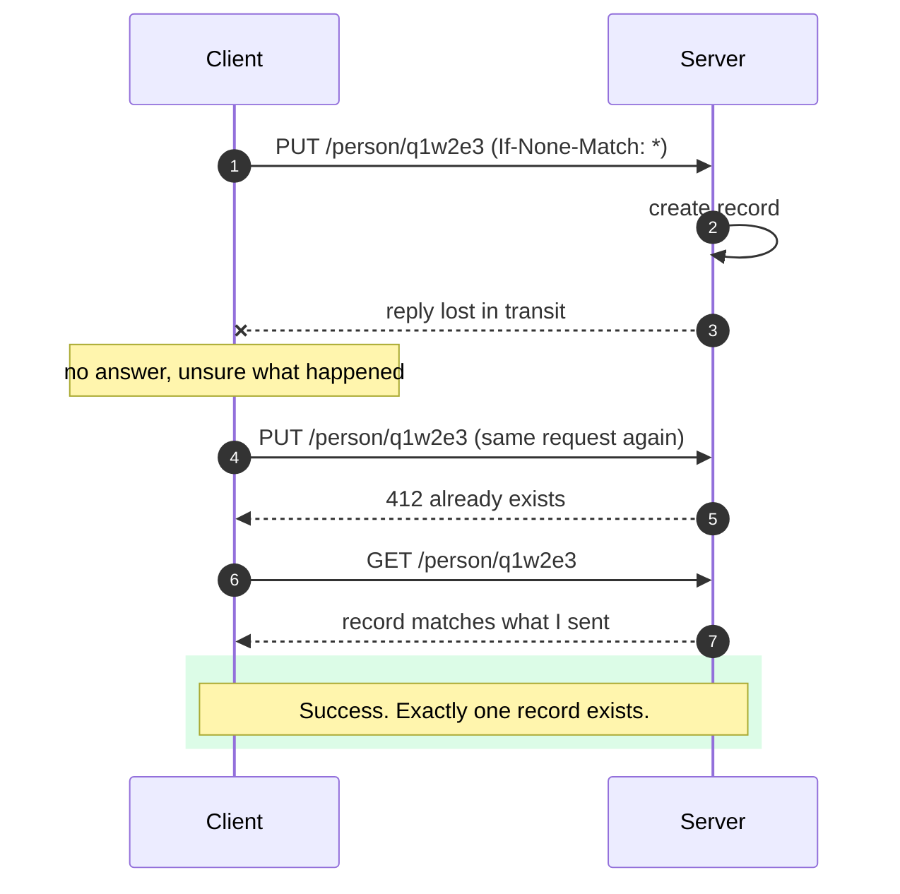
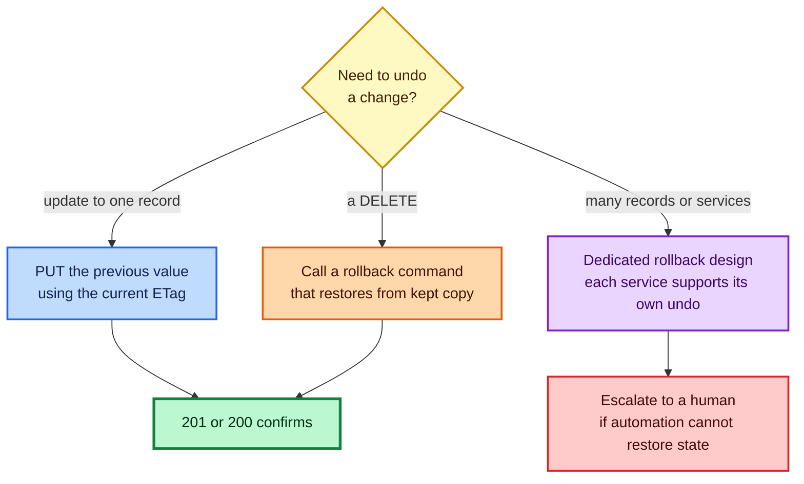
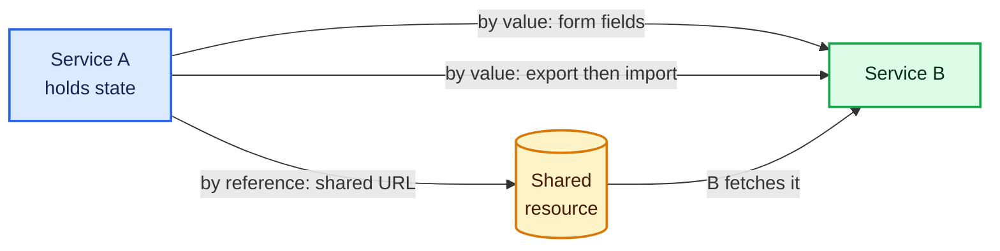
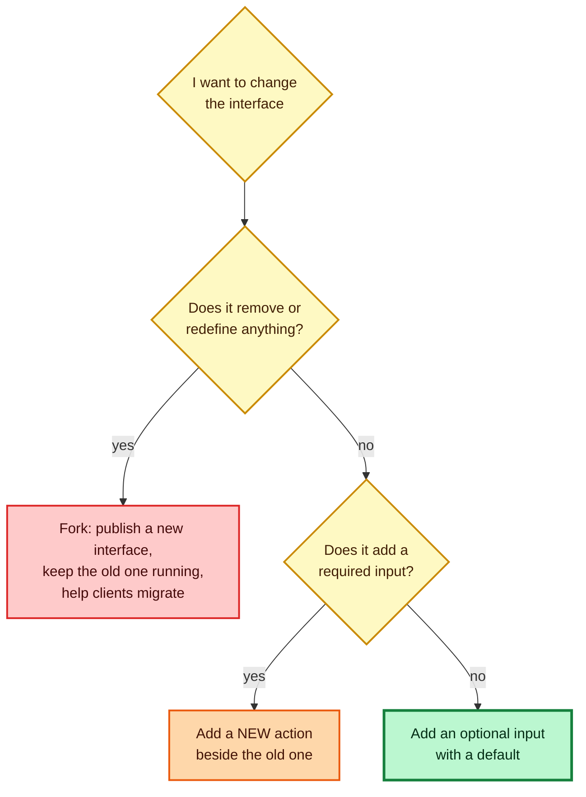

# Hypermedia Design Patterns I Rely On: Message Formats, Vocabularies, Safe Writes, and Change Without Breakage

*Reading time: about 25 minutes. Both programs in this post were executed before I pasted them in. The full outputs in section 13 are verbatim; the short excerpts earlier in the post are lightly reformatted for reading. Everything uses Python 3 and its standard library.*

A few years ago I inherited an integration that had worked flawlessly for eighteen months and then, one Tuesday, started creating duplicate customer records. Nothing in either codebase had changed. A network device between the two services had begun dropping some responses, the client had politely retried, and the server had politely created a second record each time.

That bug taught me something I now treat as a design rule: **a system is only as reliable as its answer to the question "what happens when a message gets lost, repeated, or misunderstood?"** Most of the patterns in this post are answers to that question, along with its companion question, "what happens when the thing I built last year needs to change?"

I will walk through the design decisions I make for hypermedia-driven services, in roughly the order I make them: choosing message formats, choosing vocabularies, describing the problem space, embedding actions in responses, making writes safe to repeat, making them possible to undo, moving state between services, and finally changing interfaces without breaking anyone.

---

## Table of Contents

1. [The idea underneath: separate the layers](#1-the-idea-underneath-separate-the-layers)
2. [Registered media types](#2-registered-media-types)
3. [Structured versus unstructured formats](#3-structured-versus-unstructured-formats)
4. [Published vocabularies](#4-published-vocabularies)
5. [Semantic profiles](#5-semantic-profiles)
6. [Embedded hypermedia](#6-embedded-hypermedia)
7. [Safe writes: PUT, ETags, and the failed POST](#7-safe-writes-put-etags-and-the-failed-post)
8. [Repeatable actions](#8-repeatable-actions)
9. [Reversible actions](#9-reversible-actions)
10. [Moving state between services](#10-moving-state-between-services)
11. [Extensible messages](#11-extensible-messages)
12. [Modifiable interfaces](#12-modifiable-interfaces)
13. [The test code, in one place](#13-the-test-code-in-one-place)
14. [A design checklist](#14-a-design-checklist)

---

## 1. The idea underneath: separate the layers

The lowest layers of the network work at global scale for a simple reason: they do not understand what they carry. TCP and IP move bits without caring whether those bits are a sales report or a cat photo. **Meaning is separated from the message.**

I apply the same principle higher up. Each layer below deals with its own concern and ignores the others:

| Layer | Question it answers | Example choices | Can change without touching the others? |
|---|---|---|---|
| **Protocol** | How do bytes get there? | HTTP, MQTT | Yes |
| **Message format (media type)** | How is the message structured? | HTML, Collection+JSON, SIREN, HAL | Yes |
| **Vocabulary** | What do the terms mean? | Schema.org, industry vocabularies | Yes |
| **Hypermedia controls** | How do I get things done right now? | Links and forms with runtime values | Yes |

You can see the independence in everyday life. The same sales figures can travel as an HTML page, a CSV file, or plain text, and the figures do not change. Two programs can agree to discuss health care using one industry vocabulary, send it as RDF instead of XML, and carry it over HTTP instead of MQTT. Each of those is a separate agreement.



The rest of this post is that principle, applied one layer at a time, plus a handful of habits for coping with an unreliable network.

---

## 2. Registered media types

**The problem:** I want services written years apart to exchange messages successfully, including services that will not exist for years.

**What I do:** I pick one or more open, registered media types and document that my service supports them. HTML is the model here. A browser binds to the HTML *format* without understanding any particular document. The document can gain paragraphs, links, and forms, and the browser needs no update.

The IANA registry is where I look for formats with longevity. Candidates fall into two groups:

| Group | Examples | Notes |
|---|---|---|
| **Unstructured** | XML, JSON | Flexible, but the structure changes with the data (see next section) |
| **Structured** | HTML, Collection+JSON, UBER, HAL, SIREN | Structure stays fixed while content changes |

My practical rules:

1. **Support more than one format**, and let consumers discover which ones you support and state a preference at runtime. HTTP content negotiation exists for exactly this.
2. **Almost always include HTML.** It is thirty-plus years old, any browser works as a free test client, and parsers are everywhere.
3. **Prefer formats that carry hypermedia inside the message** and that allow safe extensions.
4. **Think hard before inventing a format.**

That last point deserves a table, because I have seen teams get it wrong in both directions.

| Situation | Should I author a custom media type? |
|---|---|
| Consumers are few and inside my own company | Possibly |
| Consumers number in the hundreds of millions | Possibly |
| My service leads a whole vertical (documents, payments, health) | Possibly |
| None of the above | **No.** Pick an existing format. |

> **Caution:** A custom media type is a public commitment. Treat it as if it will become popular: document it, register it, build example applications, and be ready to support a community for years. If you are not prepared for that, the registered formats are a better deal.

---

## 3. Structured versus unstructured formats

Here is a distinction that took me too long to appreciate. In a **structured media type**, the *shape* of the message is fixed, and the data fills it in. HTML says "elements nest inside elements." A message validator for "a `ul` containing `li` items" works whether the list has two items or twenty.

In an **unstructured** format like plain JSON, the shape is *the data itself*. An object with two keys is a different structure from an object with three, and a schema describing the first no longer describes the second.

I tested this idea directly. The check below reduces an HTML message to its set of parent-child tag pairs, and reduces a JSON message to its key shape. Then it adds an email field to each.

```text
HTML shape unchanged after adding a field: True
JSON key-shape unchanged:                  False
```

(The full program and output are in [section 13](#13-the-test-code-in-one-place).)

This matters because of a two-step test every consumer performs:

| Step | Question | Survives added data? |
|---|---|---|
| **Well-formed** | Does the message follow the basic rules of the format? | Yes, with a structured type |
| **Valid** | Does the content follow the rules for this particular message? | Depends on current business rules |

I want the first step to stay stable forever, so that consumers can still *bind* to my messages even when the rules for validity change. Structured types give me that.

> **Note:** You can use JSON safely. Several structured formats are themselves JSON-based (Collection+JSON, SIREN, HAL). The difference is that their *envelope* is fixed and your data lives inside it.

---

## 4. Published vocabularies

Stable formats carry my data, but they do not tell anyone what the data *means*. For that I rely on vocabularies.

**The problem:** how do I make my property names understood by services I did not write?

**What I do:** use well-known, documented property names in the external interface, even if my internal storage uses something else.

| Source | Good for | Watch out for |
|---|---|---|
| **Schema.org** | General-purpose terms: people, places, products | Not every concept has a term |
| **Microformats** | Common contact and web terms | Smaller scope |
| **Dublin Core** | Documents and metadata | Narrower focus |
| **Industry vocabularies** (payments, health care, insurance) | Domain-specific interoperability | Some are not fully open, and some bundle platform or SDK requirements |

Compare two versions of the same record. The first uses my internal shorthand, the second uses public terms:

```json
{"name": "fname", "value": "Dana"}
{"name": "lname", "value": "Doe"}
{"name": "ph",    "value": "123-456-7890"}
```

```json
{"name": "givenName",  "value": "Dana"}
{"name": "familyName", "value": "Doe"}
{"name": "telephone",  "value": "123-456-7890"}
```

I never rename my database columns for this. Instead I place an **anti-corruption layer** at the boundary, a small translator that maps internal names to public ones. In `messages.py` it is a one-line dictionary lookup, and a check confirms that the internal names are flagged as unknown while the translated ones pass.

My rules for vocabulary governance:

- **Name a preferred source and backups.** For example: "Schema.org first, then Microformats, then Dublin Core, then our own repository."
- **Mixing sources is fine.** One record can use several vocabularies.
- **Limit synonyms.** If `tel` and `telephone` both exist, choose one for all external use.
- **Publish a list** of every term you send or accept, with a short description and a URL to the definition.

> **Caution:** Keep vocabulary terms free of software or hardware dependencies. A vocabulary tied to one vendor's platform defeats the purpose of choosing a shared one.

> **Note:** Vocabulary governance is unglamorous and valuable. The people who maintain and enforce a community's terms prevent a huge amount of downstream confusion.

---

## 5. Semantic profiles

A vocabulary lists terms. A **semantic profile** describes the *problem space*: which properties, which objects, and which actions belong together. I think of it as the rules of the game, the guide rails around a related set of activities.

A profile is **not** an API definition. API definition formats list URLs, methods, status codes, and similar implementation details. A profile describes general elements: base properties, aggregate objects, and actions. Two profile formats I know of are Dublin Core Application Profiles and ALPS (Application-Level Profile Semantics). My examples use ALPS.

A good profile tags each descriptor with the part of information architecture it serves:

| Tag | Describes | Example descriptor |
|---|---|---|
| **ontology** | Individual terms | `givenName`, `telephone` |
| **taxonomy** | Groupings of terms | `Person` (contains the terms above) |
| **choreography** | Actions and their safety | `goList` (safe), `doUpdate` (idempotent) |

Here is a compact ALPS document I use in tests:

```json
{"alps": {"descriptor": [
  {"id": "givenName",  "def": "https://schema.org/givenName",  "tag": "ontology"},
  {"id": "familyName", "def": "https://schema.org/familyName", "tag": "ontology"},
  {"id": "telephone",  "def": "https://schema.org/telephone",  "tag": "ontology"},
  {"id": "Person", "tag": "taxonomy", "descriptor": [
      {"href": "#givenName"}, {"href": "#familyName"}, {"href": "#telephone"}]},
  {"id": "goList", "type": "safe", "tag": "choreography", "rt": "#Person"}
]}}
```

My habits with profiles:

| Habit | Why |
|---|---|
| **Aim for wide reuse** and keep profiles general | A profile's value grows with the number of services using it |
| **Do not put URLs or methods in profiles** | They belong in the API definition |
| **Return the profile's address in every response** | Clients can find the rules without asking |
| **Never make breaking changes to a published profile** | Clients may depend on it |
| **Publish changes as a new profile at a new address** and keep the old one online | Both generations keep working |
| **Keep profiles in one findable place** | People and machines both need to locate them |

### A profile linter

Copy-paste errors in profile documents are easy to make and hard to spot. So I wrote a linter that checks two things: no two descriptors may share the same definition URL, and every `#reference` must point to an existing descriptor. I ran it against a clean document and against a deliberately damaged copy.

```text
profile lint on clean document: no problems
profile lint on damaged copy:
  - familyName and givenName share the same def
  - dangling reference #email
```

> **Caution:** Semantic profiles are still a young practice with limited tooling. I use them because the benefit is real, but expect to write some of your own checks, as I did.

---

## 6. Embedded hypermedia

The most important design choice for long-lived services is putting the *details of each action* in the response, rather than in client code. A form in HTML shows how this works:

```html
<form name="doCreate" action="http://api.example.org/person/"
      method="post" enctype="application/x-www-form-urlencoded">
  <input name="givenName"  required>
  <input name="familyName" required>
  <input name="telephone"  pattern="[0-9]{10}">
  <input type="submit">
</form>
```

The client does not need to *understand* these values, only enforce them. The number of inputs, the destination, and even the validation pattern can change over time while the same client keeps working. A JSON-based format such as Collection+JSON offers a template with equivalent fields and rules.

Embedding actions buys me three kinds of flexibility:

| Kind of change | How hypermedia absorbs it |
|---|---|
| **Context changes** | The same form can show five fields to an administrator and three to an anonymous user |
| **Location changes** | An action's target can move from a local endpoint to a different machine without breaking clients |
| **Workflow changes** | A three-step process can become two steps, as long as clients follow the instructions in each response |



The costs are real, and I tell teams about them up front:

- **It is a design-time agreement.** Producers and consumers must both commit to it. Some architects resist hypermedia-rich responses, and you may need to help them past that.
- **Format selection can become a fight.** You do not have to choose only one. HTTP content negotiation lets you offer several and choose at runtime. Starting with HTML and adding formats later is a perfectly good plan.
- **It takes a translation skill.** Developers must learn to express internal rules as forms, inputs, and links.
- **Clients need navigation skills.** Writing clients that traverse hypermedia is a craft of its own.

> **Note:** A hypermedia parsing library is a one-time expense that pays off every time you use it. The same is true of the browser's form handling, which was written once and serves every website.

---

## 7. Safe writes: PUT, ETags, and the failed POST

Back to my duplicate-customer bug. Consider a client that sends a POST to deduct fifty credits from an account and never receives a reply. There are three possibilities: the request never arrived, it arrived and was processed but the reply was lost, or it arrived and failed. The client cannot tell which. Retrying is dangerous in the second case, and not retrying is dangerous in the first.

The cause is that **POST is not idempotent**: repeating it is not guaranteed to give the same result. HTTP's **PUT** *is* idempotent by design. Sending the same PUT again leaves the system in the same state. So for data writes that might need a retry, I use PUT.

### How PUT can create resources safely

The obvious worry is: how does the server know whether I mean "create new" or "replace existing"? Conditional headers answer that.

| I want to... | Request header | Meaning | Success | Failure |
|---|---|---|---|---|
| **Create** only if nothing is there | `If-None-Match: *` | Create at this address only if no resource exists | `201 Created` | `412 Precondition Failed` if it already exists |
| **Replace** a specific version | `If-Match: "<etag>"` | Replace only if the stored version matches | `200 OK` | `412 Precondition Failed` if stale or missing |

An **ETag** is a version label the server returns with each representation. Passing it back in `If-Match` prevents the "lost update" problem, where two clients overwrite each other's changes.



A subtle point: after a lost reply, the retried create gets a **412**, because the first attempt did succeed. A well-written client treats "already exists *with the data I sent*" as success. I put this logic in a "cover method" (`put_create`) so every caller gets it for free. That pattern, wrapping header logic and error handling in a small function, makes the extra work of PUT acceptable.

### The experiment

`store.py` runs a real HTTP server that can **deliberately drop a response after doing the work**, simulating the lost-reply problem. It then compares POST and PUT under the same failure. Here is the part of the output that matters:

```text
POST   lost reply + retry  -> 2 records (duplicate!)
PUT    lost reply + retry  -> already-created-by-earlier-try | records with that id: 1
PUT    If-Match fresh -> 200, stale -> 412 (lost update prevented)
```

The first line is my Tuesday bug, reproduced. The second line is the fix.

> **Caution:** With PUT-create, the **client supplies the identifier** (for example, a file name or a generated ID). Use identifiers that are hard to guess and collision-resistant, such as random UUIDs, and still enforce authorization on the server. A client choosing its own address is not permission to write there.

> **Note:** POST can also be made safe to retry by adding an idempotency key. I still choose PUT for most designs, because it needs nothing beyond standard HTTP.

---

## 8. Repeatable actions

A repeatable action has two layers of protection, and I design for both.

| Layer | Technique | Example |
|---|---|---|
| **Network idempotence** | Use methods designed to be repeated: GET, PUT, DELETE | Retry a PUT after a 503 or a timeout |
| **Operation idempotence** | Design the *message body* so repeating it is harmless | Send replacement values, not increments |

Network idempotence alone is not enough. Imagine a PUT that says "raise every price by 5%." The method is idempotent, but the *operation* is not: apply it twice and prices compound. If the process fails halfway, you also cannot tell which products were updated.

The fix is to make the message say exactly what should be true afterward:

```text
productId, currentPrice, newPrice
q1w2e3,    100,          105
t5y6u7,    200,          210
```

The server applies a row only if the current price matches `currentPrice`. Otherwise it skips the row. (Another valid design sends just `productId` and `newPrice`; running it repeatedly still ends in the correct state.)

I tested both designs. Repeating the explicit-rows update changed nothing the second time. Repeating the percentage update compounded:

```text
PRICES explicit rows: run 1 -> {'applied': 3, 'skipped': 0} | run 2 -> {'applied': 0, 'skipped': 3} | prices unchanged by repeat
PRICES percent update repeated twice -> compounded: {'q1w2e3': 115.76, 't5y6u7': 231.53, 'i8o9p0': 289.4}
```

> **Caution:** Avoid increment and percentage operations in write messages ("add one", "increase by 5%"). Use replacement values with an optional precondition ("if the current price is 100, set it to 105").

This costs more design effort up front. It pays for itself the first time something crashes in the middle of a large update.

---

## 9. Reversible actions

Sooner or later, a change must be undone. There are two basic routes, and which one applies depends on how much the change touched.

| Situation | Approach |
|---|---|
| One record changed, previous value known | Send a second request that restores the old value |
| A delete must be reversed | Provide a special command that restores the deleted resource |
| Several records or services affected | Design a dedicated rollback for the resource, with cooperation from each service |



There is no UNDELETE method in HTTP, so a delete needs support designed into the interface: the service **keeps the deleted resource** and offers a command that restores it. My test server does exactly that:

```text
UNDO   second PUT restored the previous value
UNDO   DELETE reversed by rollback command -> 201 Created
```

The trade-off is plain. A special rollback command spares clients from remembering the old data, but the service takes on the job of keeping history. I have seen teams place the rollback address inside the same URL space as the resource and others use a separate rollbacks area, and both work.

> **Caution:** Retaining deleted data conflicts with privacy rules in some contexts. Decide on a retention window, document it, and actually purge when it expires.

---

## 10. Moving state between services

A service should be useful as *one part* of someone else's solution, not only as a destination for its own captive clients. That means making it easy to hand state in and out.

The cleanest design is a set of standalone, stateless operations: accept input, do the work, return results, forget everything. A postal-code validator is the classic example. All the state travels inside one request and one response.

When larger blocks of state must move, I choose among three techniques:

| Technique | How it works | Best when | Coordination needed |
|---|---|---|---|
| **By value, using an existing form** | Pass the properties in a form the receiver supplies | Small amounts of data | None beyond the form |
| **By value, dedicated operations** | Offer `importState` and `exportState` actions | Large or complex collections | Both sides agree on property names and shape ahead of time |
| **By reference** | Share a URL pointing at the data | Data is large or already hosted | Both sides agree on the format and vocabulary in advance |



Two design preferences guide me. First, **offer forms that handle the transfer in one step**, so other services can act as clients directly. Second, **keep orchestration minimal**. Do not require a session or login as a separate preliminary step. If identity is needed, let the target operation respond with an authentication challenge and let the client retry with credentials.

For by-reference transfers, I use structured media types and include vocabulary references so the receiver can confirm it understands the data before accepting it.

> **Caution:** Browsers enforce cross-origin restrictions. If your service accepts uploads or posts from pages hosted on other origins, you must emit the appropriate cross-origin headers or those requests will fail, however correct your API is.

---

## 11. Extensible messages

Once an interface is widely used, requests for changes arrive. Someone wants a new property. Someone else wants a single value turned into a list. I follow one rule: **don't change it, add it.** Three techniques make that practical.

| Technique | How it works | Example |
|---|---|---|
| **Property collection** | Include a name-value collection from the start; new properties go there | `"nvp": [{"hatsize": "3"}]` |
| **Parallel properties** | Keep the old property and add new related ones beside it | Keep `name`, add `givenName` and `familyName` |
| **A hosting root** | Wrap the payload in a root element so new versions can sit beside the old one | `{"message": {"person": {...}, "personv2": {...}}}` |

Parallel properties need matching behavior on the way *in*. If a client sends only `name`, the service splits it into given and family names. If a client sends the two new properties, the service builds `name` from them. Both styles keep working.

I tested this with an "old client" that reads only `name` and `age`, and a "new client" that reads the split names and the property collection:

```text
old client and new client both read the extended message; input in either style works
```

> **Caution:** The biggest threat to extensibility is a consumer applying a strict schema validator to incoming messages. A single "reject unknown fields" setting turns every safe addition into a breaking change. Tell consumers to ignore what they do not understand. You can remind them, but you cannot fully enforce it, so write it into the contract from day one.

---

## 12. Modifiable interfaces

The same pressure applies to the interface itself: URLs, methods, and inputs. My governing promise is the oldest one in medicine: **first, do no harm.** Once other applications depend on my API, I owe them that.

I keep three rules:

| Rule | In practice |
|---|---|
| **Take nothing away** | Every published URL, method, input, and output remains |
| **Don't redefine things** | If `size` means page size, it never becomes hat size |
| **Make additions optional** | New inputs are optional and carry defaults |

Here is the optional-input rule in action. The updated search form adds `regions` with a default of `all`:

```html
<!-- existing -->
<form action="..." method="GET" name="findUsers">
  <input name="givenName"  value="" required>
  <input name="familyName" value="" required>
</form>

<!-- updated: new input is optional, with a default -->
<form action="..." method="GET" name="findUsers">
  <input name="givenName"  value="" required>
  <input name="familyName" value="" required>
  <input name="regions" value="all">
</form>
```

Compatibility must work *both ways*: a client sending the old form must still succeed, and the server must assume the default when `regions` is missing. My test confirms an old call (without `regions`) still works and a new call narrows the results.

When a new capability needs a **required** input, I do not change the old action. I add a **new action** beside it and let clients ignore it until they are ready. For example, a "process order" action stays untouched, and a separate "process sales-rep order" action requires the sales representative's name.



Sometimes a breaking change is unavoidable. A business decision might end customers' right to edit certain data directly. Then I **fork** the interface: publish the new one, keep both running in production, and give clients time and help to migrate.

### Why documentation is not enough

I used to believe that careful documentation protected me. It does not. A well-known observation by Hyrum Wright, often called Hyrum's Law, says that with enough users, *every observable behavior* of your system will be relied upon by somebody, whatever the contract promises. Field ordering, error text, response timing: someone depends on it.

My practical defense is cheap: **run the existing test suite against the new interface.** If every old test still passes, I have come close to simulating how existing clients will react.

> **Caution:** Vocabulary changes need the same care as interface changes. When a semantic profile must change, publish the new version at a new address and leave the old one online.

---

## 13. The test code, in one place

Save these as `store.py` and `messages.py`, then run `python store.py` and `python messages.py`. Each exits with an error if a check fails. `store.py` starts its own local server on a free port, so nothing else needs configuring.

### Safe writes, retries, undo, and idempotent updates

**File: `store.py`**

```python
"""Safe writes over HTTP: PUT-create, ETags, retries, undo, idempotent updates.
Run: python store.py   (starts its own server, runs checks, prints results)
"""
import hashlib, json, threading, urllib.request, urllib.error
from http.server import BaseHTTPRequestHandler, ThreadingHTTPServer

PEOPLE, TRASH = {}, {}
CATALOG = {"q1w2e3": 100.0, "t5y6u7": 200.0, "i8o9p0": 250.0}
STATE = {"drop_next": 0, "next_id": 1}
LOCK = threading.Lock()

def etag(data):
    return '"' + hashlib.sha1(json.dumps(data, sort_keys=True).encode()).hexdigest()[:12] + '"'

class H(BaseHTTPRequestHandler):
    def log_message(self, *a): pass

    def reply(self, code, body=None, headers=None):
        if self.command in ("PUT", "POST") and STATE["drop_next"] > 0:
            STATE["drop_next"] -= 1          # simulate a lost response:
            self.close_connection = True     # work was done, client hears nothing
            return
        data = json.dumps(body).encode() if body is not None else b""
        self.send_response(code)
        self.send_header("Content-Type", "application/json")
        self.send_header("Content-Length", str(len(data)))
        for k, v in (headers or {}).items():
            self.send_header(k, v)
        self.end_headers()
        self.wfile.write(data)

    def body(self):
        n = int(self.headers.get("Content-Length", 0))
        return json.loads(self.rfile.read(n) or b"null")

    def do_GET(self):
        pid = self.path.rsplit("/", 1)[-1]
        if self.path.startswith("/person/") and pid in PEOPLE:
            return self.reply(200, PEOPLE[pid], {"ETag": etag(PEOPLE[pid])})
        if self.path == "/people":
            return self.reply(200, PEOPLE)
        if self.path == "/catalog":
            return self.reply(200, CATALOG)
        self.reply(404, {"error": "not found"})

    def do_POST(self):
        b = self.body()
        with LOCK:
            if self.path == "/people":                       # server picks the id
                pid = f"auto{STATE['next_id']}"; STATE["next_id"] += 1
                PEOPLE[pid] = b
                return self.reply(201, b, {"Location": f"/person/{pid}"})
            if self.path == "/catalog/percentUpdate":        # NOT idempotent
                for k in CATALOG:
                    CATALOG[k] = round(CATALOG[k] * (1 + b["updatePercent"]), 2)
                return self.reply(200, {"applied": len(CATALOG)})
        self.reply(404, {"error": "not found"})

    def do_PUT(self):
        b = self.body()
        with LOCK:
            if self.path.startswith("/person/"):
                pid = self.path.rsplit("/", 1)[-1]
                exists = pid in PEOPLE
                if self.headers.get("If-None-Match") == "*" and exists:
                    return self.reply(412, {"error": "already exists"})
                im = self.headers.get("If-Match")
                if im and (not exists or etag(PEOPLE[pid]) != im):
                    return self.reply(412, {"error": "stale or missing version"})
                PEOPLE[pid] = b
                return self.reply(200 if exists else 201, b, {"ETag": etag(b)})
            if self.path.startswith("/rollbacks/person/"):   # special undo command
                pid = self.path.rsplit("/", 1)[-1]
                if pid not in TRASH:
                    return self.reply(404, {"error": "nothing to restore"})
                PEOPLE[pid] = TRASH.pop(pid)
                return self.reply(201, PEOPLE[pid], {"Location": f"/person/{pid}"})
            if self.path == "/catalog/priceUpdate":          # idempotent by design
                applied = skipped = 0
                for row in b:
                    if CATALOG.get(row["productId"]) == row["currentPrice"]:
                        CATALOG[row["productId"]] = row["newPrice"]; applied += 1
                    else:
                        skipped += 1
                return self.reply(200, {"applied": applied, "skipped": skipped})
        self.reply(404, {"error": "not found"})

    def do_DELETE(self):
        pid = self.path.rsplit("/", 1)[-1]
        with LOCK:
            im = self.headers.get("If-Match")
            if pid not in PEOPLE or (im and etag(PEOPLE[pid]) != im):
                return self.reply(412, {"error": "missing or stale"})
            TRASH[pid] = PEOPLE.pop(pid)                     # keep it so it can be restored
            return self.reply(204)

def send(method, url, body=None, headers=None):
    data = json.dumps(body).encode() if body is not None else None
    req = urllib.request.Request(url, data=data, method=method, headers=headers or {})
    try:
        with urllib.request.urlopen(req, timeout=5) as r:
            raw = r.read()
            return r.status, dict(r.headers), (json.loads(raw) if raw else None)
    except urllib.error.HTTPError as e:
        raw = e.read()
        return e.code, dict(e.headers), (json.loads(raw) if raw else None)

def put_create(url, data, tries=3):
    """Cover method: retries on network failure, treats 'already exists with my data' as success."""
    for _ in range(tries):
        try:
            status, _, _ = send("PUT", url, data, {"If-None-Match": "*"})
        except (urllib.error.URLError, ConnectionError, OSError):
            continue                                        # no reply: safe to repeat
        if status == 201:
            return "created"
        if status == 412:
            _, _, current = send("GET", url)
            return "already-created-by-earlier-try" if current == data else "conflict"
    return "gave-up"

if __name__ == "__main__":
    srv = ThreadingHTTPServer(("127.0.0.1", 0), H)
    threading.Thread(target=srv.serve_forever, daemon=True).start()
    base = f"http://127.0.0.1:{srv.server_port}"

    # 1. POST + lost response + retry  -> duplicate records
    STATE["drop_next"] = 1
    for _ in range(2):
        try: send("POST", f"{base}/people", {"givenName": "Mace"}); break
        except (urllib.error.URLError, ConnectionError, OSError): continue
    dupes = [p for p in PEOPLE.values() if p["givenName"] == "Mace"]
    assert len(dupes) == 2
    print("POST   lost reply + retry  ->", len(dupes), "records (duplicate!)")

    # 2. PUT-create + lost response + retry -> exactly one record
    STATE["drop_next"] = 1
    outcome = put_create(f"{base}/person/q1w2e3", {"givenName": "Mace", "familyName": "Morris"})
    assert outcome == "already-created-by-earlier-try" and "q1w2e3" in PEOPLE
    print("PUT    lost reply + retry  ->", outcome, "| records with that id: 1")

    # 3. Conditional update and stale write
    _, h, cur = send("GET", f"{base}/person/q1w2e3")
    old_tag = h["ETag"]
    s, h2, _ = send("PUT", f"{base}/person/q1w2e3", {**cur, "givenName": "Molly"}, {"If-Match": old_tag})
    assert s == 200 and h2["ETag"] != old_tag
    s, _, _ = send("PUT", f"{base}/person/q1w2e3", {**cur, "givenName": "Zed"}, {"If-Match": old_tag})
    assert s == 412
    print("PUT    If-Match fresh -> 200, stale -> 412 (lost update prevented)")

    # 4. Rollback with a second PUT
    s, _, _ = send("PUT", f"{base}/person/q1w2e3", cur, {"If-Match": h2["ETag"]})
    assert s == 200 and send("GET", f"{base}/person/q1w2e3")[2]["givenName"] == "Mace"
    print("UNDO   second PUT restored the previous value")

    # 5. Delete then special undo command
    tag = send("GET", f"{base}/person/q1w2e3")[1]["ETag"]
    assert send("DELETE", f"{base}/person/q1w2e3", headers={"If-Match": tag})[0] == 204
    assert send("GET", f"{base}/person/q1w2e3")[0] == 404
    s, hh, restored = send("PUT", f"{base}/rollbacks/person/q1w2e3", {})
    assert s == 201 and restored["givenName"] == "Mace" and hh["Location"] == "/person/q1w2e3"
    print("UNDO   DELETE reversed by rollback command -> 201 Created")

    # 6. Message-level idempotence vs percentage update
    rows = [{"productId": k, "currentPrice": v, "newPrice": round(v * 1.05, 2)} for k, v in CATALOG.items()]
    r1 = send("PUT", f"{base}/catalog/priceUpdate", rows)[2]
    after1 = dict(CATALOG)
    r2 = send("PUT", f"{base}/catalog/priceUpdate", rows)[2]
    assert r1 == {"applied": 3, "skipped": 0} and r2 == {"applied": 0, "skipped": 3} and dict(CATALOG) == after1
    print("PRICES explicit rows: run 1 ->", r1, "| run 2 ->", r2, "| prices unchanged by repeat")
    before = dict(CATALOG)
    send("POST", f"{base}/catalog/percentUpdate", {"updatePercent": 0.05})
    send("POST", f"{base}/catalog/percentUpdate", {"updatePercent": 0.05})
    assert CATALOG != {k: round(v * 1.05, 2) for k, v in before.items()}
    print("PRICES percent update repeated twice -> compounded:", CATALOG)
    srv.shutdown()
    print("all store checks passed")
```

Output:

```text
POST   lost reply + retry  -> 2 records (duplicate!)
PUT    lost reply + retry  -> already-created-by-earlier-try | records with that id: 1
PUT    If-Match fresh -> 200, stale -> 412 (lost update prevented)
UNDO   second PUT restored the previous value
UNDO   DELETE reversed by rollback command -> 201 Created
PRICES explicit rows: run 1 -> {'applied': 3, 'skipped': 0} | run 2 -> {'applied': 0, 'skipped': 3} | prices unchanged by repeat
PRICES percent update repeated twice -> compounded: {'q1w2e3': 115.76, 't5y6u7': 231.53, 'i8o9p0': 289.4}
all store checks passed
```

### Structure, vocabularies, profiles, and extensibility

**File: `messages.py`**

```python
"""Message-level design checks: structure vs content, vocabularies, profiles,
extensible messages, and additive (optional) form changes. Standard library only.
"""
import json
from html.parser import HTMLParser

# ---- 1. Structured vs unstructured: does adding data change the structure? ----
class Shape(HTMLParser):
    def __init__(self):
        super().__init__(); self.stack, self.pairs = [], set()
    def handle_starttag(self, tag, attrs):
        if self.stack: self.pairs.add((self.stack[-1], tag))
        self.stack.append(tag)
    def handle_endtag(self, tag):
        self.stack.pop()

def html_shape(doc):
    p = Shape(); p.feed(doc); return frozenset(p.pairs)

def json_shape(obj):                      # a schema would have to list these keys
    return tuple(sorted(obj["Person"].keys()))

# ---- 2. Vocabulary conformance + anti-corruption layer ----
ALPS = {"alps": {"descriptor": [
    {"id": "givenName",  "def": "https://schema.org/givenName",  "tag": "ontology"},
    {"id": "familyName", "def": "https://schema.org/familyName", "tag": "ontology"},
    {"id": "telephone",  "def": "https://schema.org/telephone",  "tag": "ontology"},
    {"id": "Person", "tag": "taxonomy", "descriptor": [
        {"href": "#givenName"}, {"href": "#familyName"}, {"href": "#telephone"}]},
    {"id": "goList", "type": "safe", "tag": "choreography", "rt": "#Person"},
]}}

def lint_alps(doc):
    problems, ids, defs = [], set(), {}
    def walk(ds):
        for d in ds:
            if "id" in d:
                if d["id"] in ids: problems.append(f"duplicate id {d['id']}")
                ids.add(d["id"])
                if "def" in d:
                    if d["def"] in defs:
                        problems.append(f"{d['id']} and {defs[d['def']]} share the same def")
                    defs[d["def"]] = d["id"]
            walk(d.get("descriptor", []))
    walk(doc["alps"]["descriptor"])
    def refs(ds):
        for d in ds:
            for key in ("href", "rt"):
                v = d.get(key, "")
                if v.startswith("#") and v[1:] not in ids:
                    problems.append(f"dangling reference {v}")
            refs(d.get("descriptor", []))
    refs(doc["alps"]["descriptor"])
    return problems

def unknown_terms(names, doc):
    known = {d["id"] for d in doc["alps"]["descriptor"]}
    return sorted(set(names) - known)

INTERNAL_TO_PUBLIC = {"fname": "givenName", "lname": "familyName", "ph": "telephone"}
def to_public(record):                    # the "anti-corruption layer"
    return {INTERNAL_TO_PUBLIC.get(k, k): v for k, v in record.items()}

# ---- 3. Extensible messages: parallel properties + tolerant reader ----
def normalize_person(incoming):
    p = dict(incoming)
    if "name" in p and "givenName" not in p:
        given, _, family = p["name"].partition(" ")
        p["givenName"], p["familyName"] = given, family
    elif "givenName" in p and "name" not in p:
        p["name"] = f"{p['givenName']} {p.get('familyName', '')}".strip()
    return p

def old_client_reads(msg):                # knows only 'name' and 'age'
    return msg["name"], msg["age"]

def new_client_reads(msg):
    return msg["givenName"], msg["familyName"], msg.get("nvp", [])

# ---- 4. Additive form change: optional input with a default ----
USERS = [("Ana", "Lee", "north"), ("Ben", "Lee", "south"), ("Cy", "Ray", "north")]
def find_users(params):
    region = params.get("regions", "all")  # default keeps old callers working
    return [u for u in USERS
            if u[0] == params["givenName"] or u[1] == params["familyName"]
            if region == "all" or u[2] == region]

if __name__ == "__main__":
    # 1
    h1 = '<ul name="Person"><li name="givenName">Marti</li><li name="familyName">Contardi</li></ul>'
    h2 = h1.replace("</ul>", '<li name="emailAddress">m@example.org</li></ul>')
    assert html_shape(h1) == html_shape(h2)
    j1 = {"Person": {"givenName": "Marti", "familyName": "Contardi"}}
    j2 = {"Person": {**j1["Person"], "emailAddress": "m@example.org"}}
    assert json_shape(j1) != json_shape(j2)
    print("1. HTML shape unchanged after adding a field: True | JSON key-shape unchanged: False")

    # 2
    assert lint_alps(ALPS) == []
    bad = json.loads(json.dumps(ALPS))
    bad["alps"]["descriptor"][1]["def"] = "https://schema.org/givenName"
    bad["alps"]["descriptor"][3]["descriptor"].append({"href": "#email"})
    found = lint_alps(bad)
    assert len(found) == 2
    print("2. profile lint on good doc: clean | on edited doc:", found)
    internal = {"fname": "Dana", "lname": "Doe", "ph": "123-456-7890"}
    assert unknown_terms(internal, ALPS) == ["fname", "lname", "ph"]
    assert unknown_terms(to_public(internal), ALPS) == []
    print("   internal names flagged:", unknown_terms(internal, ALPS), "| after translation: none")

    # 3
    original = {"name": "Merk Muffly", "age": 21}
    extended = normalize_person({**original, "nvp": [{"hatsize": "3"}]})
    assert old_client_reads(extended) == ("Merk Muffly", 21)
    assert new_client_reads(extended)[:2] == ("Merk", "Muffly")
    from_new = normalize_person({"givenName": "Merk", "familyName": "Muffly", "age": 21})
    assert from_new["name"] == "Merk Muffly"
    print("3. old client and new client both read the extended message; input in either style works")

    # 4
    old_call = {"givenName": "Ana", "familyName": "Zed"}
    new_call = {**old_call, "regions": "north"}
    assert find_users(old_call) == [("Ana", "Lee", "north")]
    assert find_users({"givenName": "Ana", "familyName": "Lee"}) == USERS[:2]
    assert find_users({"givenName": "Ana", "familyName": "Lee", "regions": "north"}) == [USERS[0]]
    print("4. old call (no 'regions') still works; new optional input narrows results")
    print("all message checks passed")
```

Output:

```text
1. HTML shape unchanged after adding a field: True | JSON key-shape unchanged: False
2. profile lint on good doc: clean | on edited doc: ['familyName and givenName share the same def', 'dangling reference #email']
   internal names flagged: ['fname', 'lname', 'ph'] | after translation: none
3. old client and new client both read the extended message; input in either style works
4. old call (no 'regions') still works; new optional input narrows results
all message checks passed
```

> **Caution:** `store.py` uses Python's built-in `http.server` and keeps everything in memory. It exists to demonstrate the semantics, not to serve traffic. A production service needs a real server, authentication, persistence, and request limits.

> **Note:** The "lost reply" in the test is simulated by closing the connection after the server has done the work. It reproduces the failure that matters, a processed request with no response, without needing a flaky network.

---

## 14. A design checklist

**Formats and vocabularies**
- [ ] I support at least one registered, structured media type, and HTML if I can
- [ ] Consumers can discover supported formats and state a preference
- [ ] External property names come from published vocabularies, with an anti-corruption layer at the boundary
- [ ] I publish a list of every term I send or accept
- [ ] Each profile is tagged for ontology, taxonomy, and choreography and passes a linter

**Actions and writes**
- [ ] Actions are embedded in responses, with their target, method, and fields
- [ ] Data writes use PUT, with `If-None-Match: *` for create and `If-Match` for update
- [ ] Clients treat "already exists with my data" as success
- [ ] Write messages carry replacement values, never increments or percentages
- [ ] Deletes keep a restorable copy for a documented window
- [ ] Rollback is designed for every action that touches more than one record

**Evolution**
- [ ] I take nothing away, redefine nothing, and make every addition optional with a default
- [ ] New required inputs arrive as new actions, not edits to old ones
- [ ] Messages include an extension point, and consumers are told to ignore unknown fields
- [ ] Old tests run against every new version
- [ ] Breaking changes are forks, with both versions running during migration

**Between services**
- [ ] State transfers complete in a single step where possible
- [ ] By-reference transfers state their format and vocabulary
- [ ] Cross-origin headers are in place where browsers are involved

---

## Closing thoughts

When I strip this post down, three habits remain.

**Keep layers independent.** Protocol, format, vocabulary, and controls each change on their own schedule. The moment two of them become tangled, a change in one forces a change in the other.

**Assume messages get lost, repeated, and misread.** Choose PUT over POST for writes, send replacement values instead of increments, version with ETags, and keep what you delete long enough to restore it. These are small choices, and they decide whether a flaky network produces a shrug or a data-cleanup project.

**Treat every published promise as permanent.** Take nothing away, redefine nothing, and add only what is optional. When you must break something, fork rather than force. Other people's software depends on yours in ways your documentation will never fully capture.

I have not had a duplicate-customer incident since I applied these habits, and when the network misbehaves, I now find out from a log line instead of a phone call.
