# Hypermedia Services: Building APIs That Survive Change

*Architecture is the art of making the inevitable changes cheap. Hypermedia is how you make that art concrete in your APIs.*

---

## Table of Contents

1. [The Core Problem: Stability vs. Evolvability](#the-core-problem)
2. [What Are Hypermedia Services?](#what-are-hypermedia-services)
3. [The HTTP Protocol as a Design Template](#http-as-template)
4. [Publishing Stable URLs](#stable-urls)
5. [Preventing Internal Model Leaks](#internal-model-leaks)
6. [Converting Internal Models to External Messages](#model-conversion)
7. [Expressing Internal Functions as External Actions](#internal-functions)
8. [Advertising Client Response Preferences](#client-preferences)
9. [HTTP Content Negotiation in Depth](#content-negotiation)
10. [Publishing Complete Vocabularies](#vocabularies)
11. [Shared Vocabularies in Standard Formats](#shared-vocabularies)
12. [Service Definition Documents](#service-definitions)
13. [API Metadata Publishing](#api-metadata)
14. [Service Health Monitoring](#health-monitoring)
15. [Standardizing Error Reporting](#error-reporting)
16. [Runtime Service Registries](#service-registry)
17. [Client-Supplied Identifiers](#client-identifiers)
18. [Idempotent Create Operations](#idempotent-create)
19. [Runtime Fallbacks for Dependent Services](#runtime-fallbacks)
20. [Semantic Proxies for Noncompliant Services](#semantic-proxies)
21. [Putting It All Together](#putting-it-together)

---

## 1. The Core Problem: Stability vs. Evolvability {#the-core-problem}

Every API designer faces a fundamental tension. On one side sits **usability**: the API must be clear, predictable, and easy to understand. On the other side sits **evolvability**: the API must be able to change over time without breaking the applications that depend on it. And hovering above both is **reliability**: the API must continue working correctly as operating parameters shift, needs drift, and goals change.

This is not a theoretical concern. It is the daily reality of anyone maintaining a production API.

> **The API is the contract—the promise that needs to be kept.**

When you publish an API, you make a promise to every consumer that the interface will continue to work as documented. But software systems are not static. Databases get restructured. Business rules change. New features get added. Internal service boundaries shift. If your API is tightly coupled to any of these internal details, every internal change becomes a potential breaking change for your consumers.

The solution is not to freeze your API forever. That would make it useless. The solution is to design your API so that the parts that change often are easy to change, and the parts that stay stable are genuinely stable.

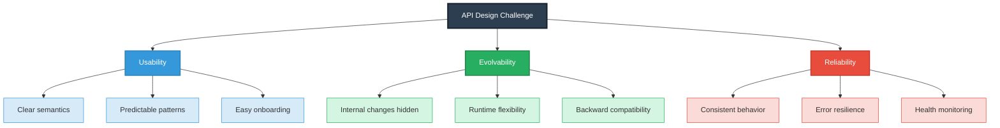

### The Cost of Getting It Wrong

When an API breaks, the cost cascades:

- **Client applications crash** or behave unpredictably
- **Developer trust erodes**—teams become reluctant to adopt new versions
- **Support burden increases**—every consumer needs individual attention
- **Migration projects multiply**—each breaking change spawns a wave of updates
- **Innovation slows**—teams spend time firefighting instead of building

The hypermedia approach described in this post is not about avoiding change. It is about making change **safe**—so that your API can evolve without breaking its promises.

---

## 2. What Are Hypermedia Services? {#what-are-hypermedia-services}

A hypermedia service is an API that uses **hypermedia controls** (links, forms, and other navigational elements) as the primary mechanism for driving application state. Instead of hardcoding URLs and action sequences into client applications, the service tells clients what they can do next by including that information in responses.

Think of it this way:

| Traditional API | Hypermedia API |
|----------------|----------------|
| Client hardcodes URLs | Client follows links from responses |
| Client knows action sequences | Service describes available actions |
| Changes require client updates | Changes are absorbed at runtime |
| Documentation is separate | Documentation is embedded in responses |
| Client must be redeployed | Client adapts dynamically |

### The Hypermedia Maturity Model

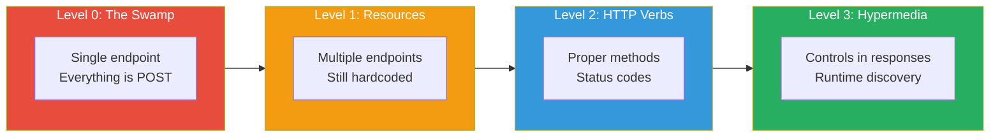

The key insight is that at Level 3, the **client application doesn't need to know the API's structure in advance**. It discovers what it needs at runtime by following hypermedia controls. This is what makes APIs evolvable without breaking clients.

### Why This Matters for Machine-to-Machine Communication

In M2M scenarios, there is no human to read documentation and update code when an API changes. Machines need to be able to **discover** capabilities at runtime. Hypermedia provides that discovery mechanism.

---

## 3. The HTTP Protocol as a Design Template {#http-as-template}

The HTTP protocol itself is a masterclass in stable-yet-evolvable design. Almost every key aspect of HTTP is modifiable:

- **Methods** (GET, POST, PUT, DELETE, PATCH, etc.) are an abstract collection that can be amended
- **Status codes** (200, 404, 500, etc.) are extensible
- **URLs** can point to anything
- **Headers** can be added without breaking existing implementations
- **Body formats** are negotiated at runtime

What stays consistent is the **structure** of HTTP messages: request line, headers, body. That structure is the promise. The content is variable.

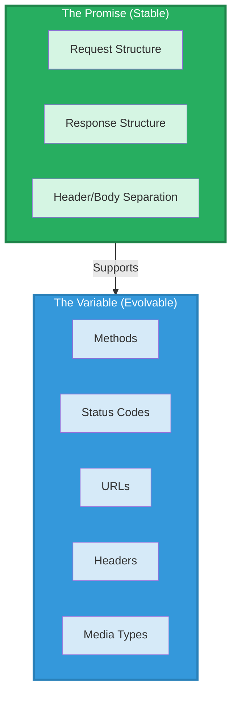

### Applying the HTTP Design Pattern to Your API

When designing your own hypermedia service, ask:

1. What is the **structural promise** I'm making? (Message format, link semantics, action patterns)
2. What is **variable content** that can change? (Data properties, action names, available operations)
3. How can I make the variable parts **discoverable at runtime**?

> **Note:** The goal is not to make everything dynamic. The goal is to identify what changes often and make *that* easy to change, while keeping the stable parts genuinely stable.

---

## 4. Publishing Stable URLs {#stable-urls}

Every service API needs at least one **stable URL** that consumers can rely on over time. This is the "starting point" of your API—the address that clients can memorize and trust.

### What Makes a URL Stable?

A stable URL is one that:

- Will be honored into the future
- Will redirect to a new location if the service moves
- Serves as the entry point for API interaction
- Is documented in human-readable form
- Is emitted in API responses via link headers or body links

The exact URL doesn't matter. It could be:
- `http://api.example.com/home`
- `http://v1.home.api.example.org/q1w2e3r4t5`
- `https://api.example.org/`

What matters is that there is **at least one location** that consumers can count on.

### Implementing Stable URLs

**HTTP Response with Link Header:**
```http
HTTP/1.1 200 OK
Content-Type: application/vnd.collection+json
ETag: "p0o9i8u7y6t5r4e3w2q1"
Link: <http://api.example.org/home>; rel="home"
```

**Collection+JSON Response:**
```json
{
  "collection": {
    "version": "1.0",
    "href": "http://api.example.org/friends/",
    "links": [
      {"rel": "home", "href": "http://api.example.org/home"}
    ],
    "items": [],
    "queries": [],
    "template": []
  }
}
```

**Handling Service Moves:**
```http
GET / HTTP/1.1
Host: api.example.org

HTTP/1.1 301 Moved Permanently
Location: http://new.example.org/home

GET /home HTTP/1.1
Host: new.example.org

HTTP/1.1 200 OK
Content-Type: application/vnd.collection+json
Link: <http://api.example.org/home>; rel="home"
```

> **Caution:** Publishing a stable URL does not mean the service behind it cannot move. It means the URL itself remains valid, redirecting to the new location as needed.

### Best Practices for Stable URLs

| Practice | Why It Matters |
|----------|----------------|
| Use `rel="home"` consistently | Provides a standard way to find the entry point |
| Emit the stable URL in all responses | Gives clients a reliable anchor |
| Document the URL prominently | Sets expectations for consumers |
| Use 301 redirects for moves | Preserves the promise of stability |
| Don't require clients to start at the stable URL | Clients may bookmark other URLs |

---

## 5. Preventing Internal Model Leaks {#internal-model-leaks}

One of the most common ways APIs break is through **internal model leaks**—when changes to a service's internal data, object, or process model inadvertently change the external API.

### The Leak Problem

Consider a simple ToDo service with internal data models:

```json
{"items": [
  {"id":"q1w2e3r4","text":"This is an item","status":"active","nick":"mork"}
]}
{"users":[
  {"nickname":"mork","name":"Mark Morkelsen"}
]}
```

A naive API design might simply expose these models directly:

```json
{"items": [
  {"id":"q1w2e3r4","text":"This is an item","status":"active","nick":"mork"}
]}
{"users": [
  {"nickname":"mork","name":"Mark Morkelsen"}
]}
```

Now, if the internal model changes—say, `nick` becomes `nickname`—the external API changes too, breaking all consumers.

### The Solution: Independent Interface Design

The API should be designed **on its own terms**, not as a wrapper around internal models. The interface is an independent design effort.

**Alternative 1: Three objects**
```json
{"items": [...], "users": [...], "status": [{"name":"active"},{"name":"closed"}]}
```

**Alternative 2: One flat object**
```json
{"todo": [
  {"id":"q1w2e3r4","text":"This is an item","status":"active",
   "nickname":"mork","name":"Morkelsen"}
]}
```

> **The Axiom:** When designing your web API, your data model is not your object model is not your resource model is not your message model.

### Resource Design Example

| Action | URL | Method | Request Body | Response Body |
|--------|-----|--------|--------------|---------------|
| Read List | `/todo/` | GET | none | `[{id,text,status,nick,name}]` |
| Filter List | `/todo/?text={text}` | GET | none | `[{id,text,status,nick,name}]` |
| Create Item | `/todo/` | PATCH | `{id,text,status,nick,name}` | `[{id,text,status,nick,name}]` |
| Update Item Text | `/todo/` | PATCH | `{id,text}` | `[{id,text,status,nick,name}]` |
| Update Item Status | `/todo/` | PATCH | `{id,status}` | `[{id,text,status,nick,name}]` |

Notice how the interface design is **independent** of how the service internally organizes or stores this data.

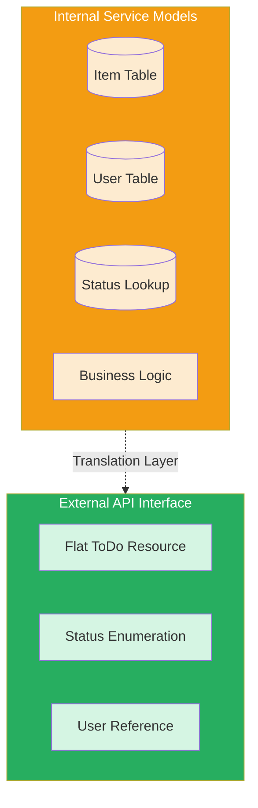

---

## 6. Converting Internal Models to External Messages {#model-conversion}

The representation step—converting internal data to external messages—should be treated as a **separate design effort**. Don't just serialize internal models directly.

### Why Direct Serialization Is Dangerous

1. **Exposes internal structure** to the outside world
2. **Creates brittleness**—any internal change breaks the API
3. **Limits flexibility**—can't optimize for different formats
4. **Couples consumers** to implementation details

### Using Structured Media Types

Structured media types (SMTs) like SIREN, Collection+JSON, and HAL provide **structure** that supports client binding to the format rather than the content.

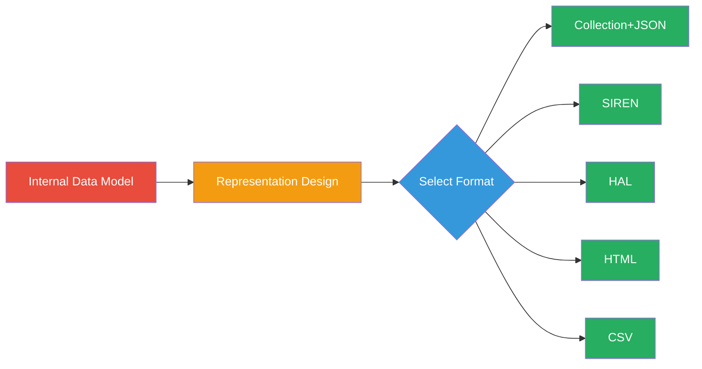

### Example: Same Data, Different Formats

**Internal Data:**
```json
{
  "user": {
    "id": "q1w2e3r4t5",
    "givenName": "Mark",
    "familyName": "Morkelsen",
    "nickName": "mork",
    "telephones": [
      {"type": "home", "value": "1-234-567-8901"},
      {"type": "work", "value": "1-987-654-3210"}
    ]
  }
}
```

**Direct JSON (Not Recommended):**
```json
{
  "user": {
    "id": "q1w2e3r4t5",
    "givenName": "Mark",
    "familyName": "Morkelsen",
    "nickName": "mork",
    "telephone": [
      {"type": "home", "value": "1-234-567-8901"},
      {"type": "work", "value": "1-987-654-3210"}
    ]
  }
}
```

**CSV Format:**
```csv
"id","givenName","familyName","nickName","telephone_home","telephone_work"
"q1w2e3r4t5","Mark","Morkelsen","mork","1-234-567-8901","1-987-654-3210"
```

**Collection+JSON Format:**
```json
{
  "collection": {
    "version": "1.0",
    "href": "http://example.org/users/q1w2e3r4t5",
    "links": [
      {"rel": "users", "href": "http://example.org/users"},
      {"rel": "products", "href": "http://example.org/products"}
    ],
    "items": [
      {
        "href": "http://example.org/users/q1w2e3r4t5",
        "data": [
          {"name": "id", "value": "q1w2e3r4", "prompt": "Identifier"},
          {"name": "givenName", "value": "Mark", "prompt": "First Name"},
          {"name": "familyName", "value": "Morkelsen", "prompt": "Last Name"},
          {"name": "nickName", "value": "Mork", "prompt": "Nick"}
        ],
        "links": [
          {"rel": "telephones", "prompt": "Telephones",
           "href": "http://examples.org/users/q1w2e3r4t5/telephones"}
        ]
      }
    ]
  }
}
```

> **Note:** In the Collection+JSON example, the telephone data was moved to a related resource, prompt values were added, and link elements were included. This is the work of *designing* representations, not just serializing data.

### Content Negotiation Support

```http
GET /todo/list HTTP/1.1
Host: api.example.org
Accept: application/vnd.collection+json, application/vnd.uber+xml

HTTP/1.1 200 OK
Content-Type: application/vnd.collection+json
```

| Format | H-Factor | Use Case |
|--------|----------|----------|
| Collection+JSON | High | General purpose, flexible |
| SIREN | High | Entity-centric APIs |
| HAL | Medium | Simple hypermedia |
| JSON | Low | Simple consumers |
| CSV | Low | Data export, spreadsheets |
| HTML | High | Human browsing, testing |

---

## 7. Expressing Internal Functions as External Actions {#internal-functions}

Just as data models need translation, internal service functions need to be expressed as external API actions. This requires **designing the action interface**, not just exposing internal methods.

### Direct Translation (Not Recommended)

```javascript
function approveUser(userId, nickname, approver, level) {
  var approval = {};
  approval.userId = userId;
  approval.nickname = nickname;
  approval.approver = approver;
  approval.level = level;
  return data.create(approval);
}
```

Directly translating to HTML:

```html
<form name="approveUser" enctype="application/x-www-form-urlencoded"
      method="post" action="http://api.example.org/users/approvals">
  <input name="userNick" type="string" value="mork" />
  <input name="approverName" type="string" value="Mr. Roboto" />
  <input name="approveLevel" type="string" value="nominal" />
  <input type="submit" value="Approve User" />
</form>
```

### Vocabulary-Based Translation (Recommended)

Use established external vocabularies (like Schema.org) to express actions:

**Internal Method:**
```javascript
function updateUser(id, fname, lname, email) {
  // ...
  return userObject;
}
```

**External Action (Collection+JSON Template):**
```json
{
  "collection": {
    "template": {
      "data": [
        {"name": "identifier", "value": "q1w2e3r4", "prompt": "User ID"},
        {"name": "givenName", "value": "Mark", "prompt": "First Name"},
        {"name": "familyName", "value": "Morkelsen", "prompt": "Last Name"},
        {"name": "email", "value": "mork@example.org", "prompt": "Email"}
      ]
    }
  }
}
```

**Translation Code:**
```javascript
function updateAction(identifier, givenName, familyName, email) {
  var user = data.read(identifier);
  if (user) {
    user.id = identifier;
    user.fname = givenName;
    user.lname = familyName;
    user.email = email;
    user = data.write(user);
  }
  return user;
}
```

### Expressing Composite Actions

Some internal processes involve multiple steps. Express these as a **single external action**:

```html
<form name="declineContract" method="post" action="...">
  <input name="customerId" value="q1w2e3r4t5" />
  <input name="contractId" value="o9i8u7y6.t5r4" />
  <input name="salesRepName" value="Mandy Miningham" />
  <input name="reviewerName" value="Mark Morkelsen" />
  <input name="reasonCode" value="Q201.B" />
  <textarea name="comments">Unable to locate collateral</textarea>
  <input type="submit" value="Decline Contract" />
</form>
```

Internally, this might trigger:
1. Create a declined log record
2. Update the customer record
3. Update the contract record
4. Update the salesRep record
5. Update the reviewer record
6. Update the nationalCredit agency

The API consumer sees **one action**, not six.

### Boolean Flags → Enumerators

Don't expose Boolean operations:

```javascript
function approveUser(bool) {
  if (bool === true) { /* ... */ }
  else { /* ... */ }
  return results;
}
```

Instead, use enumerators:

```json
{
  "_templates": {
    "default": {
      "properties": [
        {
          "name": "approveUser",
          "prompt": "User Approval",
          "options": {
            "selectedValues": ["No"],
            "inline": ["No", "Yes", "Pending"]
          }
        }
      ]
    }
  }
}
```

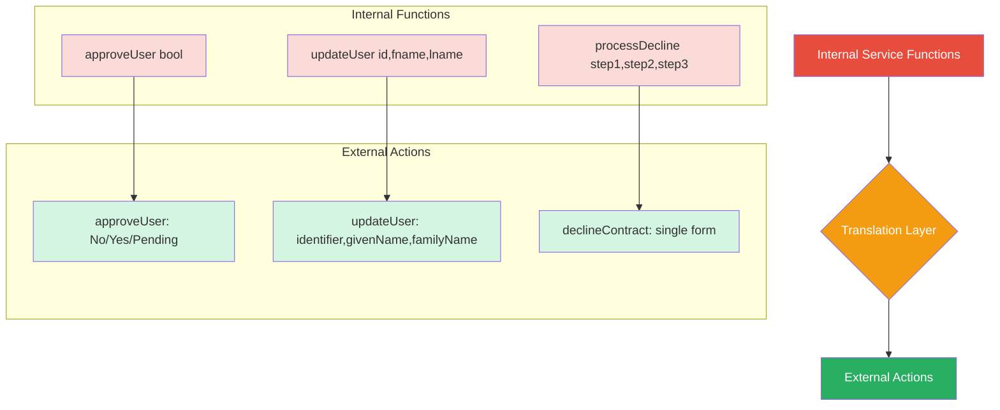

---

## 8. Advertising Client Response Preferences {#client-preferences}

HTTP provides several mechanisms for clients to indicate preferences and services to advertise capabilities. A comprehensive approach combines HTTP headers, the OPTIONS method, and a dedicated preferences resource.

### Tuneable HTTP Values

| Parameter | Header/Element | Purpose | Source Registry |
|-----------|---------------|---------|-----------------|
| `Accept` | Accept header | Response media types | IANA Media Types |
| `Allow` | Allow header | Supported HTTP methods | IANA HTTP Method Registry |
| `enctype` | HTML form property | Request media types | IANA Media Types |
| `charset` | charset parameter | Character sets | IANA Character Sets |
| `encoding` | encoding parameter | Content encodings | IANA Content Encoding Registry |
| `language` | language tag | Natural languages | IANA Language Subtag Registry |
| `profile` | profile link relation | Supported profiles | Various |

### The Meta Preferences Resource

A dedicated resource that lists all supported preferences:

```json
{
  "_links": {
    "self": {"href": "http://api.example.com/user-service/meta-preferences"},
    "home": {"href": "http://api.example.com/user-service/"},
    "profile": {
      "href": "https://webapicookbook.github.io/alps-documents/meta/meta-preferences.json"
    }
  },
  "allow": "GET PUT PATCH DELETE HEAD OPTIONS",
  "accept": "application/vnd.hal+json application/vnd.collection+json",
  "enctype": "application/x-www-form-urlencoded application/json",
  "charset": "utf-8, iso-8859-1;q=0.7",
  "encoding": "deflate gzip compress",
  "language": "en es fr",
  "profile": "https://alps.example.org/fhir-4.0.1"
}
```

### OPTIONS Response with Meta Preferences

```http
OPTIONS /file-system/download HTTP/1.1
Host: api.example.org

HTTP/1.1 200 OK
Content-Type: application/vnd.siren+json
Cache-Control: max-age=604800
Allow: GET PUT DELETE HEAD OPTIONS
Accept: application/zip application/gzip
Accept-Charset: utf-8
Accept-Encoding: compress
Accept-Language: en
Link: <https://webapicookbook.github.io/alps-documents/about/about.json>; rel="profile"

{
  "class": ["meta preferences"],
  "links": [
    {"rel": ["self"], "href": "http://api.example.org/file-system/download"},
    {"rel": ["home"], "href": "http://api.example.org/file-system/"},
    {"rel": ["profile"], "href": "https://api.example.org/profiles/meta-preferences.json"}
  ],
  "properties": {
    "allow": "GET PUT DELETE HEAD OPTIONS",
    "accept": "application/zip application/gzip",
    "enctype": "application/json",
    "charset": "utf-8",
    "encoding": "compress",
    "language": "en",
    "profile": "https://alps.example.org/downloads/"
  }
}
```

> **Caution:** HTTP OPTIONS is explicitly non-cacheable. For high-traffic APIs, use a standalone meta-preferences resource with a long cache lifetime to avoid scaling problems.

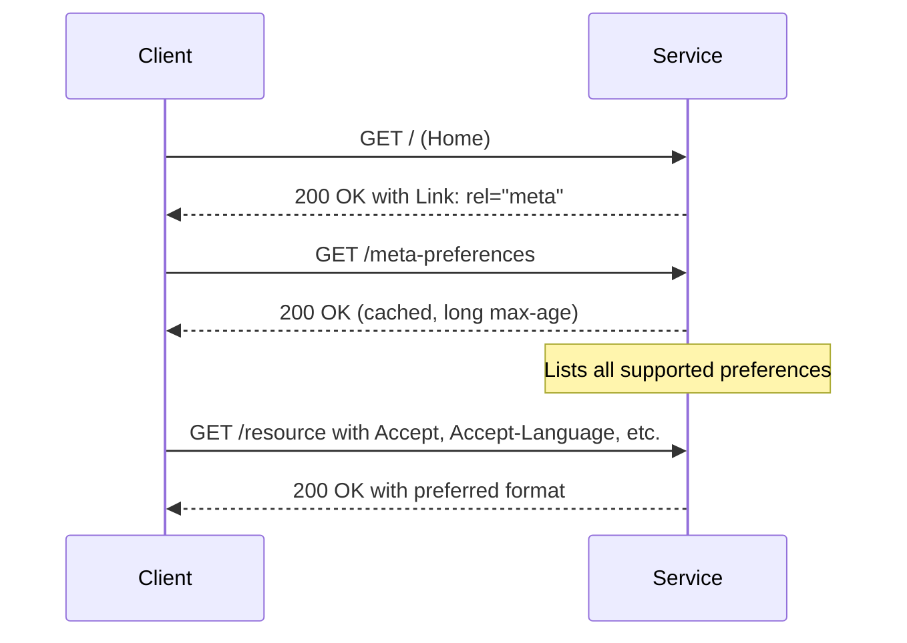

---

## 9. HTTP Content Negotiation in Depth {#content-negotiation}

Content negotiation is the process of selecting which media type to use when exchanging messages. HTTP supports two main types: **proactive** and **reactive**.

### Proactive Content Negotiation (PCN)

Client sends preferences, server decides:

```http
GET /list HTTP/1.1
Accept: application/vnd.siren+json, application/vnd.hal+json, application/json

HTTP/1.1 200 OK
Content-Type: application/json
```

With quality values:

```http
GET /list HTTP/1.1
Accept: application/vnd.hal+json;q=0.8, application/json;q=0.4

HTTP/1.1 200 OK
Content-Type: application/json
```

> **Note:** The server *may* select a format not listed in the Accept header. It *should* respect client preferences when possible, but it is not required to.

### Reactive Content Negotiation (RCN)

Server lists options, client chooses:

```http
GET /search HTTP/1.1

HTTP/1.1 300 Multiple Choices
Link: <http://api.example.org/html/search>;rel="alternate html"
Link: <http://api.example.org/api/search>;rel="alternate api"
Location: http://api.example.org/html/search
```

Or with HTML body:

```html
HTTP/1.1 300 Multiple Choices
Content-Type: text/html

<html>
  <title>Multiple Choices</title>
  <body>
    <h1>Multiple Choices</h1>
    <ul>
      <li><a href="http://api.example.org/html/search">HTML</a></li>
      <li><a href="http://api.example.org/api/search">API</a></li>
    </ul>
  </body>
</html>
```

### Comparison

```mermaid
graph TD
    subgraph PCN["Proactive Content Negotiation"]
        P1[Client sends Accept header]
        P2[Server selects format]
        P3[Server returns response]
        P1 --> P2 --> P3
    end
    
    subgraph RCN["Reactive Content Negotiation"]
        R1[Client sends request]
        R2[Server returns 300 with options]
        R3[Client selects format]
        R4[Client resends request]
        R5[Server returns response]
        R1 --> R2 --> R3 --> R4 --> R5
    end
    
    style PCN fill:#d5f5e3,stroke:#27ae60,stroke-width:2px
    style RCN fill:#fdebd0,stroke:#f39c12,stroke-width:2px
    style P1 fill:#27ae60,color:#fff
    style P2 fill:#27ae60,color:#fff
    style P3 fill:#27ae60,color:#fff
    style R1 fill:#f39c12,color:#fff
    style R2 fill:#f39c12,color:#fff
    style R3 fill:#f39c12,color:#fff
    style R4 fill:#f39c12,color:#fff
    style R5 fill:#f39c12,color:#fff
```

| Aspect | PCN | RCN |
|--------|-----|-----|
| Round trips | 1 | 2+ |
| Client control | Limited | Full |
| Server complexity | Low | Medium |
| Caching | Works well | Poor |
| M2M suitability | High | Low |
| Spec completeness | Well-defined | Vague |

> **Recommendation:** Use proactive content negotiation with a meta-preferences resource for M2M scenarios. Reactive negotiation is rarely worth the complexity.

---

## 10. Publishing Complete Vocabularies {#vocabularies}

A **vocabulary** (or semantic profile) is a complete list of all the important data and action properties that may appear in a message. It answers the question: "What do these strings mean?"

### What Goes in a Vocabulary

Consider this HTML form:

```html
<form name="create-template" action="http://api.example.org/users"
      method="post" enctype="application/x-www-form-urlencoded">
  <input name="id" value="q1w2e3r4" />
  <input name="familyName" value="Mark" />
  <input name="givenName" value="Morkelson" />
  <input name="telephone" value="+1-555-123-4567" />
  <input name="email" value="mork@example.org" />
  <input name="status" value="active" />
  <input type="submit" />
</form>
```

The vocabulary elements are: `create-template`, `id`, `familyName`, `givenName`, `telephone`, `email`, `status`.

**Not** included: structural elements like `name`, `action`, `method`, `enctype`.

### Vocabulary Document Example

| Identifier | Description | Element (Cj) | Element (Fj) |
|------------|-------------|--------------|--------------|
| id | Record identifier | name | KEY |
| givenName | Given name | name | KEY |
| familyName | Family name | name | KEY |
| person | Indicates a person record | rel | KEY |
| collection | Identifies a collection | rel | rel |
| item | Identifies a single record | rel | rel |
| home | Navigate to Home view | rel, name | rel, name, id |
| list | Navigate to List view | rel, name | rel, name, id |
| read | Navigate to single record | rel, name | rel, name, id |
| filter | Filter the List view | rel, name | rel, name, id |

### Profile Link Relation

```http
HTTP/1.1 200 OK
Content-Type: application/vnd.collection+json
Link: <http://docs.alps.io/shopping-v2.json>; rel="profile"
```

This tells API consumers what vocabulary the service "speaks."

> **Important:** Semantic profiles do not explain *how* actions work—just that they might appear. The client application is expected to understand the media type independently of the profile.

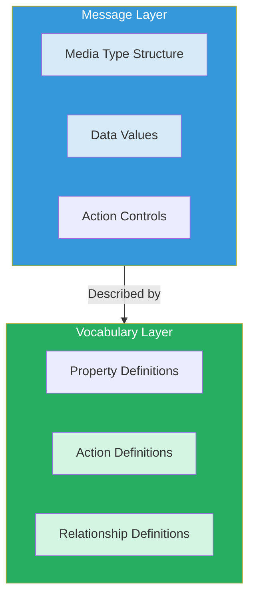

---

## 11. Shared Vocabularies in Standard Formats {#shared-vocabularies}

When services adopt standard media types, they also need standard ways to express vocabularies. Several formats exist for this purpose.

### Vocabulary Format Options

| Format | Focus | Use Case |
|--------|-------|----------|
| RDF/XML, Turtle, JSON-LD | Data relationships | Semantic web, linked data |
| XSD | XML structure | Document validation |
| JSON Schema | JSON structure | JSON validation |
| ALPS | Action relationships | Hypermedia APIs |

### RDF Example (FOAF Vocabulary)

```turtle
@prefix rdf: <http://www.w3.org/1999/02/22-rdf-syntax-ns#> .
@prefix rdfs: <http://www.w3.org/2000/01/rdf-schema#> .
@prefix foaf: <http://xmlns.com/foaf/0.1/> .

<#JW>
    a foaf:Person ;
    foaf:name "James Wales" ;
    foaf:mbox <mailto:jwales@bomis.com> ;
    foaf:homepage <http://www.jameswales.com> ;
    foaf:nick "Jimbo" ;
    foaf:depiction <http://www.jameswales.com/aus_img_small.jpg> ;
    foaf:interest <http://www.wikimedia.org> ;
    foaf:knows [
        a foaf:Person ;
        foaf:name "Angela Beesley"
    ] .
```

### ALPS Example

```json
{
  "$schema": "https://alps-io.github.io/schemas/alps.json",
  "alps": {
    "version": "1.0",
    "title": "Person Service API",
    "descriptor": [
      {
        "id": "home",
        "type": "semantic",
        "title": "Home (starting point) of the person service",
        "tag": "taxonomy",
        "descriptor": [
          {"href": "#goHome"},
          {"href": "#goList"}
        ],
        "doc": {"value": "Person API starting point"}
      },
      {
        "id": "collection",
        "type": "semantic",
        "title": "List of person resources",
        "tag": "taxonomy",
        "descriptor": [
          {"href": "#person"},
          {"href": "#goHome"},
          {"href": "#goList"},
          {"href": "#goFilter"},
          {"href": "#goItem"},
          {"href": "#doCreate"}
        ],
        "doc": {"value": "List of person resources"}
      }
    ]
  }
}
```

### Key Differences

| Format | Focus | Best For |
|--------|-------|----------|
| RDF | Data item relationships | Linked data, semantic web |
| ALPS | Action item relationships | Hypermedia APIs |
| Hydra | Both data and actions | Hybrid approaches |

> **Note:** Semantic profiles are not the same as API definition documents. Profiles describe the vocabulary; definitions describe implementation details for a specific service instance.

---

## 12. Service Definition Documents {#service-definitions}

A **Service Definition Document (SDD)** explicitly describes the shared interface that providers and consumers need to understand.

### Common SDD Formats by API Style

| API Style | SDD Format |
|-----------|------------|
| HTTP CRUD | OpenAPI, WADL |
| Event-driven | AsyncAPI, CloudEvents |
| Remote procedure | Protocol Buffers, JSON-RPC |
| Remote data query | GraphQL SDL, OData |
| Remote messaging | WSDL |
| Hypermedia | ALPS |

### Publishing SDDs

**In HTTP responses:**
```http
HTTP/1.1 200 OK
Content-Type: application/vnd.hal+json
Link: <http://api.example.org/service-desc>; rel=service-desc
```

**In response body:**
```json
{
  "collection": {
    "links": [
      {"rel": "service-desc", "href": "http://api.example.org/service-desc"}
    ]
  }
}
```

**In OPTIONS responses:**
```http
OPTIONS / HTTP/1.1
Host: api.example.org

HTTP/1.1 200 OK
Content-Type: application/vnd.siren+json
Link: <https://api.example.org/service-desc>; rel="service-desc"
```

### Multiple SDDs

```http
HTTP/1.1 200 OK
Content-Type: application/vnd.hal+json
Link: <http://api.example.org/openapi/service-desc>; rel="service-desc"; type="application/openapi+json"
Link: <http://api.example.org/graphql/service-desc>; rel="service-desc"; type="application/sdl+json"
```

> **Recommendation:** Store the SDD in the root folder and name it `service-desc` for consistency.

---

## 13. API Metadata Publishing {#api-metadata}

**APIs.json** is a specification for cataloging and publishing API metadata.

### APIs.json Structure

```json
{
  "name": "Example API",
  "type": "Index",
  "description": "This is an example APIs.json file.",
  "image": "https://api.example.org/logo.jpg",
  "tags": ["Application Programming Interface", "API"],
  "created": "2014-04-07",
  "modified": "2020-09-03",
  "url": "http://example.com/apis.json",
  "specificationVersion": "0.14",
  "apis": [
    {
      "name": "Example API",
      "description": "This provides details about a specific API.",
      "humanURL": "http://example.com",
      "baseURL": "http://api.example.com",
      "tags": ["API", "Application Programming Interface"],
      "properties": [
        {"type": "Documentation", "url": "https://example.com/documentation"},
        {"type": "OpenAPI", "url": "http://example.com/openapi.json"}
      ],
      "contact": [{"FN": "APIs.json", "email": "info@apisjson.org"}]
    }
  ],
  "specifications": [
    {"name": "OpenAPI", "url": "https://openapis.org"},
    {"name": "JSON Schema", "url": "https://json-schema.org/"}
  ],
  "common": [
    {"type": "Signup", "url": "https://example.com/signup"},
    {"type": "Authentication", "url": "http://example.com/authentication"},
    {"type": "Login", "url": "https://example.com/login"}
  ],
  "maintainers": [{"FN": "Mark Morkelson", "email": "mork@example.org"}]
}
```

### Advertising APIs.json

```http
HTTP/1.1 200 OK
Content-Type: HTML
Link: <http://api.example.org/apis.json>; rel=service-meta
```

```html
<html>
  <head>
    <link rel="service-meta" href="http://api.example.org/apis.json" />
  </head>
  <body>
    ...
  </body>
</html>
```

### Common Properties

| Property | Purpose |
|----------|---------|
| Signup | Registration URL |
| Login | Authentication URL |
| TermsOfService | Legal terms |
| PrivacyPolicy | Privacy documentation |
| Security | Security details |
| StatusPage | Health status |
| Pricing | Cost information |
| RateLimits | Usage limits |

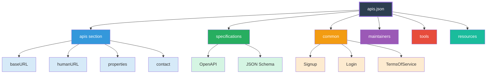

---

## 14. Service Health Monitoring {#health-monitoring}

Health monitoring ensures services are up, running, and performing as expected.

### Health Check Response Format

| Property | Description |
|----------|-------------|
| `status` | Service status (pass, fail, warn) |
| `version` | Public version of the service |
| `releaseId` | Service release/version |
| `notes` | Array of notes relevant to current state |
| `output` | Raw error output |
| `checks` | Detailed health of downstream systems |
| `links` | External links for more information |
| `serviceId` | Unique identifier of the service |
| `description` | Human-friendly description |

### Example Health Response

```http
HTTP/1.1 200 OK
Content-Type: application/health+json
Cache-Control: max-age=3600
ETag: "w\i8u7y6t5r4e3w2"

{
  "status": "pass",
  "version": "1",
  "releaseId": "1.2.2",
  "notes": [""],
  "output": "",
  "serviceId": "f03e522f-1f44-4062-9b55-9587f91c9c41",
  "description": "health of authz service",
  "checks": {
    "cassandra:responseTime": [
      {
        "componentId": "dfd6cf2b-1b6e-4412-a0b8-f6f7797a60d2",
        "componentType": "datastore",
        "observedValue": 250,
        "observedUnit": "ms",
        "status": "pass",
        "affectedEndpoints": [
          "/users/{userId}",
          "/customers/{customerId}/status"
        ],
        "time": "2018-01-17T03:36:48Z",
        "output": ""
      }
    ]
  }
}
```

### Advertising Health Check Support

```http
OPTIONS / HTTP/1.1
Accept: application/vnd.collection+json

HTTP/1.1 200 OK
Content-Type: application/vnd.collection+json
Link: <http://api.example.org/health>; rel="health-check"
```

> **Caution:** Do not use health checks as debugging tools. They reflect the state of the *interface*, not the service behind it.

> **Recommendation:** Use `Cache-Control` and `ETag` headers to reduce traffic loads. Avoid callback-based health endpoints—they can overwhelm your service.

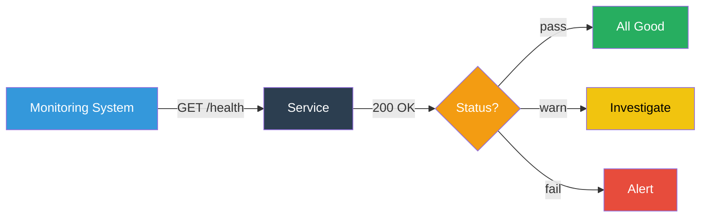

---

## 15. Standardizing Error Reporting {#error-reporting}

RFC 7807 defines the "Problem Details" media type for consistent error reporting.

### Problem Details Elements

| Element | Description |
|---------|-------------|
| `type` | URI identifying the problem type |
| `title` | Short, human-readable summary |
| `status` | HTTP status code (number) |
| `detail` | Human-readable explanation |
| `instance` | URI identifying this specific occurrence |

### Example Problem Response

```http
HTTP/1.1 403 Forbidden
Content-Type: application/problem+json
Content-Language: en

{
  "type": "https://example.com/probs/out-of-credit",
  "title": "You do not have enough credit.",
  "detail": "Your current balance is 30, but that costs 50.",
  "instance": "/account/12345/msgs/abc",
  "status": 403
}
```

### Extended Problem Details

```json
{
  "type": "https://example.com/probs/out-of-credit",
  "title": "You do not have enough credit.",
  "detail": "Your current balance is 30, but that costs 50.",
  "instance": "/account/12345/msgs/abc",
  "status": 403,
  "balance": 30,
  "accounts": ["/account/12345", "/account/67890"]
}
```

> **Note:** The URL in `type` should point to documentation defining the problem and any extension properties.

### XML Version

```xml
HTTP/1.1 403 Forbidden
Content-Type: application/problem+xml

<problem-details>
  <type>https://example.com/probs/out-of-credit</type>
  <title>You do not have enough credit.</title>
  <detail>Your current balance is 30, but that costs 50.</detail>
  <instance>/account/12345/msgs/abc</instance>
  <status>403</status>
</problem-details>
```

### When to Use Problem Details

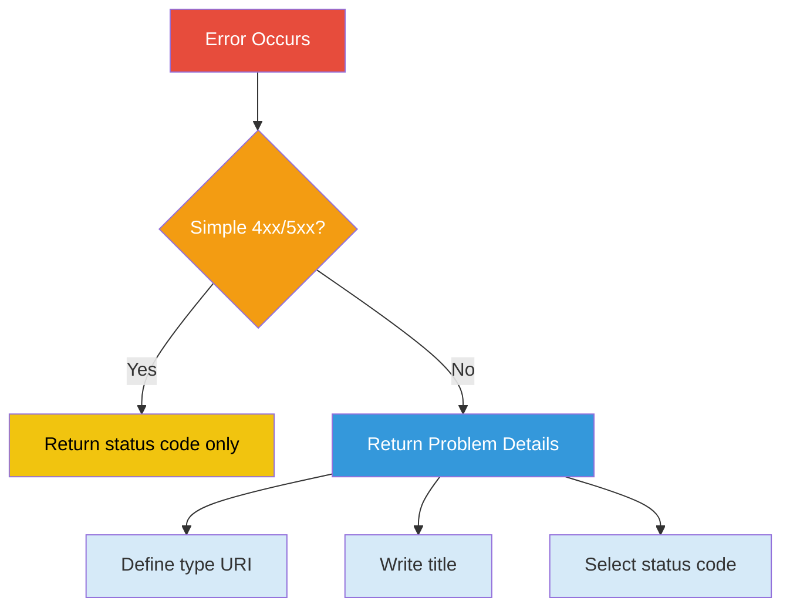

> **Caution:** Don't use Problem Details for debugging information. It's about the interface, not the service.

> **Tip:** Limit the number of new problem types. Make them general enough to be reusable.

---

## 16. Runtime Service Registries {#service-registry}

A Runtime Service Registry (RSR) improves findability and reusability of running services.

### RSR Lifecycle

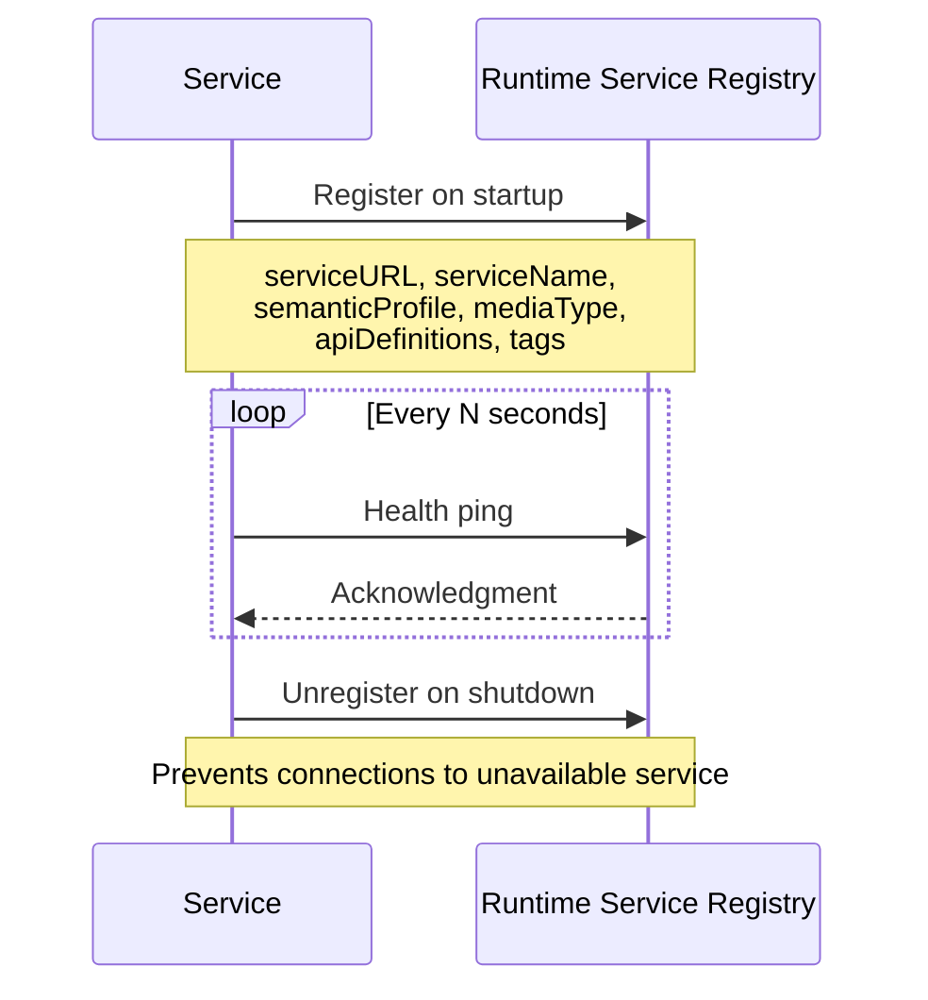

### Registration Metadata

| Field | Description |
|-------|-------------|
| `serviceURL` | URL of the service |
| `serviceName` | Text name of the service |
| `semanticProfile` | Space-separated profile URIs |
| `mediaType` | Space-separated media type identifiers |
| `apiDefinitions` | Links to API definition documents |
| `tags` | Searchable keywords |

### Registration Code Example

```javascript
var srsResponse = null;
var srsRegister = {Url: "...", "name": "...", /* ... */};

discovery.register(srsRegister, function(data, response) {
  srsResponse = JSON.parse(data);
  initiateKeepAlive(srsResponse.href, srsResponse.milliseconds);
  http.createServer(uuidGenerator).listen(port);
  console.info('uuid-generator running on port ' + port + '.');
});
```

### Unregistration Example

```javascript
process.on('SIGTERM', function() {
  discovery.unregister(null, function(response) {
    try {
      uuidGenerator.close(function() {
        console.log('gracefully shutting down');
        process.exit(0);
      });
    } catch(e) {}
  });
  
  setTimeout(function() {
    console.error('forcefully shutting down');
    process.exit(1);
  }, 10000);
});
```

> **Note:** RSRs typically require authentication. Use for M2M runtime discovery, not human-driven design-time discovery.

---

## 17. Client-Supplied Identifiers {#client-identifiers}

Allowing clients to supply unique identifiers can improve throughput and simplify multi-step workflows.

### Generating Unique Identifiers

**Simple Random ID:**
```javascript
function makeId() {
  var rtn = String(Math.random());
  rtn = rtn.substring(2);
  rtn = parseInt(rtn).toString(36);
  return rtn;
}
// Example output: "1oyte4x0zep"
```

**RFC 4122 UUID:**
```javascript
function generateUUID() {
  var d = new Date().getTime();
  var d2 = ((typeof performance !== 'undefined') && 
            performance.now && (performance.now() * 1000)) || 0;
  
  return 'xxxxxxxx-xxxx-4xxx-yxxx-xxxxxxxxxxxx'.replace(/[xy]/g, function(c) {
    var r = Math.random() * 16;
    if (d > 0) {
      r = (d + r) % 16 | 0;
      d = Math.floor(d / 16);
    } else {
      r = (d2 + r) % 16 | 0;
      d2 = Math.floor(d2 / 16);
    }
    return (c === 'x' ? r : (r & 0x3 | 0x8)).toString(16);
  });
}
// Example output: "e6db8698-7128-478d-8658-12c2cb9dd126"
```

### Using Client IDs in Requests

**In body:**
```html
<form name="create" action="/persons/" method="post">
  <input type="hidden" name="unique-id" value="1oyte4x0zep" />
  <input type="text" name="name" value="Mark Morkleson" />
  <input type="submit" />
</form>
```

**In URL:**
```html
<form name="create" action="/persons/1oyte4x0zep" method="put">
  <input type="text" name="name" value="Mork Markleson" />
  <input type="submit" />
</form>
```

### Parallel Processing

```javascript
var cId = makeId();
var aId = makeId();
var sId = makeId();

Promise.all([
  writeCustomer(cId),
  writeAccount(cId, aId),
  writeSalesRecord(cId, aId, sId)
])
.then(() => console.log('All done!'))
.catch(function(err) {
  rollbackAll(cId, aId, sId);
  console.log('Write failed!');
});
```

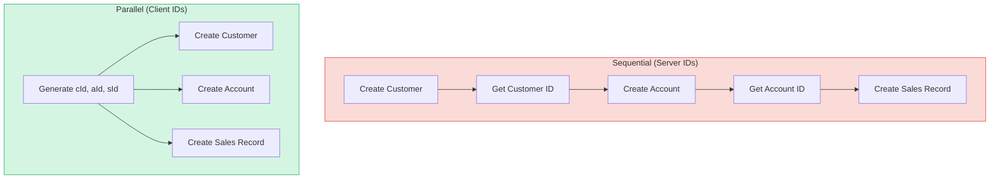

> **Caution:** Client-supplied IDs are not sequential and may be hard to read. Consider allowing "friendly IDs" for display.

---

## 18. Idempotent Create Operations {#idempotent-create}

The "lost response" problem makes HTTP POST unreliable for creating resources. PUT with client-supplied IDs solves this.

### The Lost Response Problem

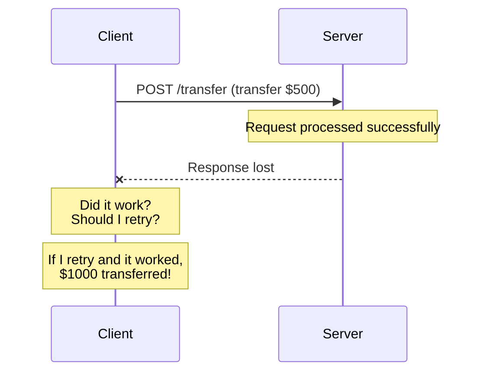

### The PUT Solution

**Create with PUT:**
```http
PUT /persons/q1w2e3r4
Host: api.example.org
Content-Type: application/json
If-None-Match: "*"

{"name": "Mark Morkelson"}
```

**Response:**
```http
201 Created
Location: http://api.example.org/persons/q1w2e3r4
```

**If resource exists:**
```http
409 Conflict
Content-Type: text/plain

Unable to create. Resource already exists.
```

### Update with PUT

**Get current state:**
```http
GET /persons/q1w2e3r4
Accept: text/plain

200 OK
Content-Type: application/vnd.collection+json
ETag: "w/p0o9i8u7y6yt5r4"

{"collection": {
  "items": [
    {"href": "/persons/q1w2e3r4", "data": [{"name": "Mark Morkleson"}]}
  ],
  "template": {"data": [{"name": "Mork Markleson"}]}
}}
```

**Update with ETag:**
```http
PUT /persons/q1w2e3r4
If-Match: "w/p0o9i8u7y6yt5r4"
Content-Type: application/x-www-form-urlencoded
Accept: application/vnd.collection+json

name=Mork%20Markleson

200 OK
Content-Type: application/vnd.collection+json
ETag: "w/i8u7y6t5r4e3"

{"collection": {
  "items": [
    {"href": "/persons/q1w2e3r4", "data": [{"name": "Mork Markleson"}]}
  ]
}}
```

### Comparison

| Method | Idempotent | Safe | Use Case |
|--------|-----------|------|----------|
| GET | Yes | Yes | Read |
| PUT | Yes | No | Create/Update |
| POST | No | No | Create (server-generated ID) |
| PATCH | No | No | Partial update |
| DELETE | Yes | No | Delete |

> **Recommendation:** Use PUT for all write operations where the client can supply an ID. This makes automatic retries safe.

---

## 19. Runtime Fallbacks for Dependent Services {#runtime-fallbacks}

When your service depends on other services, you need mitigation strategies for failures.

### Mitigation Strategies

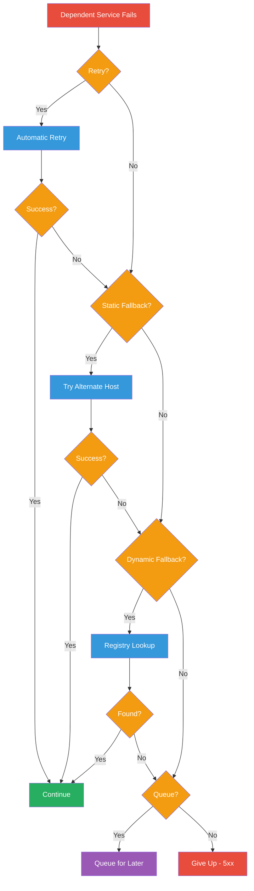

### Retry Configuration

```javascript
var reqParams = {};
reqParams.host = "https://api.example.com";
reqParams.url = "/users/q1w2e3";
reqParams.body = "mork=mamund&name=Mike Morkelsen";
reqParams.method = "PUT";
reqParams.waitMS = 300;
reqParams.retryAttempts = 3;
reqParams.successFunction = requestSucceeded;
reqParams.failFunction = requestFailed;
reqParams.alternateHost = "https://alternate-api.example.com";
reqParams.queuingFunction = queueRequest;

httpLib.request(reqParams);
```

### Good Retry Candidates

| Status Code | Meaning | Retry? |
|-------------|---------|--------|
| 500 | Internal Server Error | Yes |
| 502 | Bad Gateway | Yes |
| 503 | Service Unavailable | Yes |
| 504 | Gateway Timeout | Yes |
| 408 | Request Timeout | Yes |
| 400 | Bad Request | No |
| 401 | Unauthorized | No |
| 403 | Forbidden | No |

> **Caution:** Don't retry non-idempotent methods (POST, PATCH). Only retry GET, HEAD, PUT, DELETE.

> **Caution:** Don't implement mitigations as external services—they become dependencies too.

---

## 20. Semantic Proxies for Noncompliant Services {#semantic-proxies}

Sometimes you need to expose services that don't follow RESTful principles. Semantic proxies act as translation devices.

### Proxy Types

| Type | Scope | Effort | Best For |
|------|-------|--------|----------|
| Enterprise-Level Proxy (ELP) | Large-scale | High | Monoliths, legacy systems |
| Custom One-Off Proxy (COP) | Single service | Low-Medium | Specific functionality |
| Semantic Profile Proxy (SPP) | Vocabulary/format | Medium-High | Vocabulary mismatches |

### COP Example: FTP Upload Proxy

```javascript
// HTTP upload external action
function httpUpload(file) {
  var uploader = new httpService();
  var file = uploader.read();
  return file;
}

// FTP client service
function ftpUpload(file) {
  var client = new ftpService();
  var results = client.put(file);
  return results;
}

// Proxy function for file uploads
function proxyUpload(file) {
  var results = null;
  var file = httpUpload(file);
  if (file) {
    results = ftpUpload(file);
  }
  return results;
}
```

**RESTful Interface:**
```http
GET /upload-file/ HTTP/1.1
Accept: text/html

HTTP/1.1 200 OK
Content-Type: text/html

<form method="post" action="https://api.example.org/uploads/"
      enctype="multipart/form-data">
  <input type="file" name="file" value="daily-batch.txt" />
  <input type="submit" value="Upload" />
</form>
```

### SPP Example: XML to Collection+JSON

```javascript
results = convert(xmlDocument, xsltCollectionJSON);
```

> **Note:** SPPs are often the most challenging proxies. Poorly specified vocabularies and ambiguous meanings make them difficult to implement successfully.

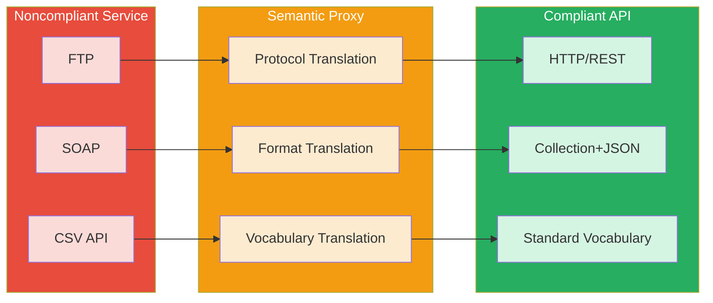

---

## 21. Putting It All Together {#putting-it-together}

Hypermedia services are not a single technique—they are a design philosophy. The goal is to make the inevitable changes cheap by:

1. **Publishing stable URLs** that survive service moves
2. **Preventing internal model leaks** by designing interfaces independently
3. **Converting models thoughtfully** rather than serializing directly
4. **Expressing actions semantically** rather than exposing internal methods
5. **Advertising preferences** so clients can negotiate at runtime
6. **Supporting content negotiation** for multiple formats
7. **Publishing vocabularies** so machines understand the domain
8. **Documenting service definitions** for both humans and machines
9. **Publishing metadata** for discoverability
10. **Monitoring health** to detect failures early
11. **Standardizing errors** so clients can respond appropriately
12. **Registering at runtime** for dynamic discovery
13. **Allowing client IDs** for parallel processing
14. **Using idempotent creates** for reliability
15. **Providing fallbacks** for dependent service failures
16. **Proxying noncompliant services** to maintain ecosystem consistency

### The Hypermedia Service Checklist

| Concern | Technique | Recipe |
|---------|-----------|--------|
| Stability | Stable URL with redirects | 5.1 |
| Coupling | Independent interface design | 5.2 |
| Representation | Structured media types | 5.3 |
| Actions | Semantic vocabulary translation | 5.4 |
| Negotiation | Meta-preferences resource | 5.5 |
| Formats | Content negotiation | 5.6 |
| Understanding | Complete vocabularies | 5.7 |
| Standards | ALPS, RDF, JSON-LD | 5.8 |
| Documentation | Service Definition Documents | 5.9 |
| Discovery | APIs.json metadata | 5.10 |
| Monitoring | Health check endpoints | 5.11 |
| Errors | RFC 7807 Problem Details | 5.12 |
| Discovery | Runtime Service Registry | 5.13 |
| Throughput | Client-supplied IDs | 5.14 |
| Reliability | Idempotent creates | 5.15 |
| Resilience | Runtime fallbacks | 5.16 |
| Integration | Semantic proxies | 5.17 |

### Final Thoughts

The best software architecture "knows" what changes often and makes that easy. For APIs, this means:

- **Data models change** → Use structured media types with flexible data elements
- **Internal functions change** → Express external actions independently
- **Service locations change** → Publish stable URLs with redirects
- **Client needs change** → Support content negotiation
- **Dependencies fail** → Implement fallbacks and retries
- **Organizations change** → Use proxies for noncompliant services

By following these patterns, you create APIs that are not just usable today, but **evolvable tomorrow**—APIs that keep their promises even as the world around them changes.

> **The ultimate goal:** An API that a client can use successfully without ever having read the documentation, because the API itself teaches the client what it needs to know at runtime.

---

## References and Further Reading

- RFC 7231: Hypertext Transfer Protocol (HTTP/1.1): Semantics and Content
- RFC 7807: Problem Details for HTTP APIs
- RFC 6906: The 'profile' Link Relation Type
- RFC 8631: Link Relation Types for Web Services
- RFC 4122: A Universally Unique IDentifier (UUID) URN Namespace
- RFC 8615: Well-Known Uniform Resource Identifiers (URIs)
- Health Check Response Format for HTTP APIs (draft)
- APIs.json Specification
- ALPS (Application-Level Profile Semantics)
- Collection+JSON, SIREN, HAL media types
- Schema.org vocabulary
