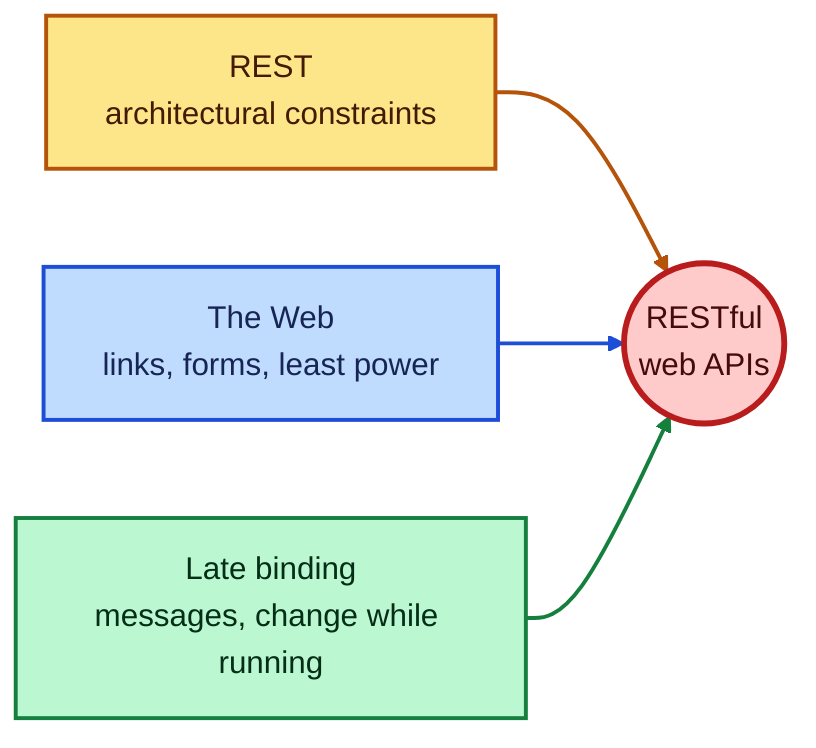
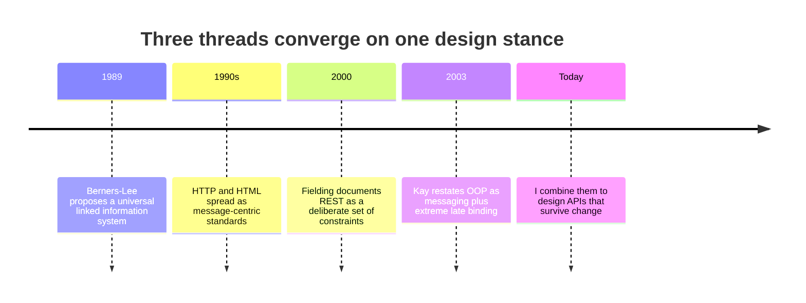
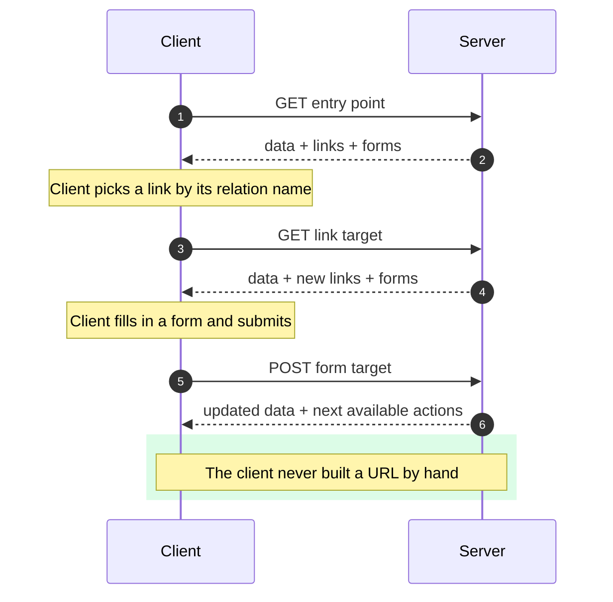
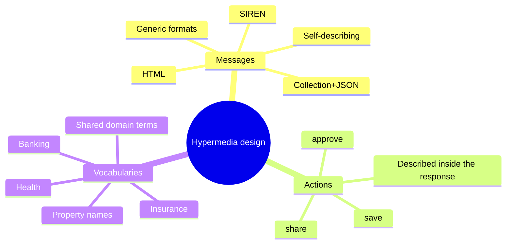
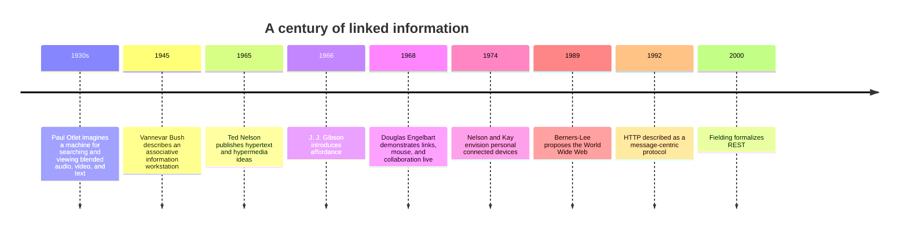
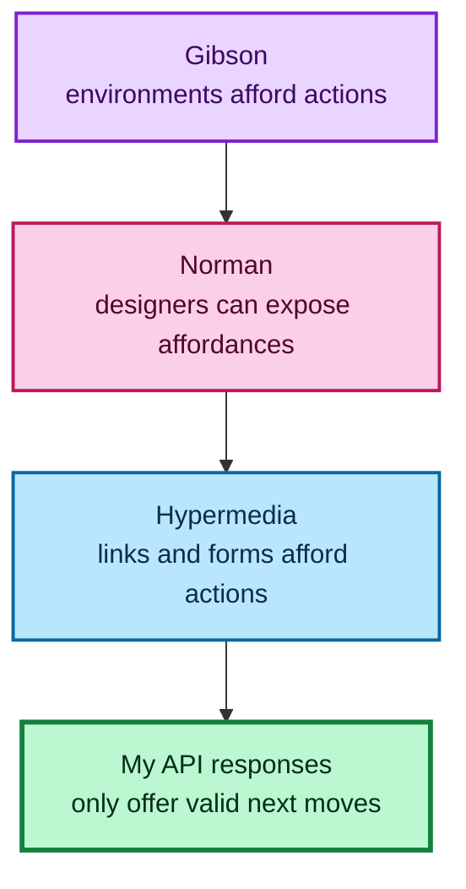
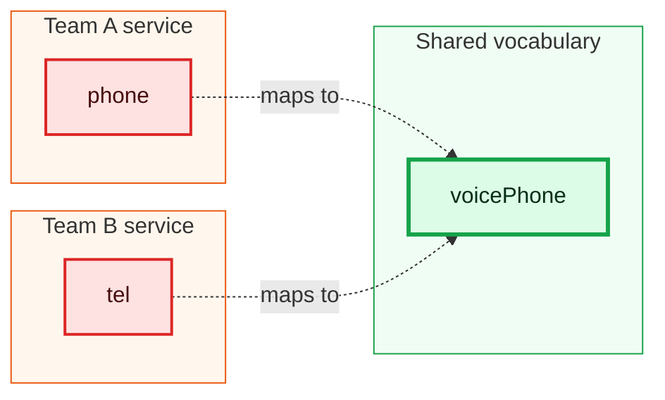
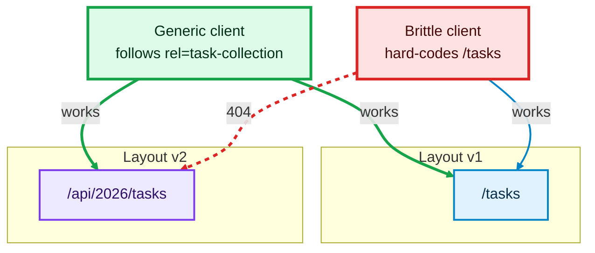
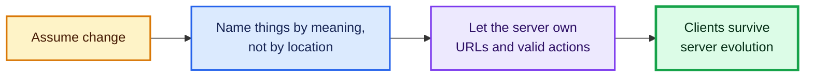

# RESTful Web APIs: Why I Build Services Around Hypermedia

I have spent a long time building and consuming HTTP services, and I keep noticing the same pattern. A team ships an API. Clients hard-code its URLs. Six months later the server team wants to reorganize something, and every client breaks. The usual response is a version number, a migration guide, and a lot of apologetic email.

This post is my attempt to explain why I think that cycle is avoidable, and what I do differently. The short version: I design services as a set of **messages**, **actions**, and **vocabularies**, and I let the server tell the client what it can do next. The phrase "RESTful web APIs" sounds like a pile of buzzwords, so I want to unpack each word, then show the thinking behind it, then build something small that proves the idea works.

My guiding principle for everything below is one sentence:

> **Leverage global reach to solve problems you haven't thought of for people you have never met.**

Every design choice in this post is me trying to honor that sentence.

---

## Table of Contents

1. [What the phrase actually means](#1-what-the-phrase-actually-means)
2. [Three ideas that feed into it](#2-three-ideas-that-feed-into-it)
3. [Why hypermedia is the engine](#3-why-hypermedia-is-the-engine)
4. [Messages, actions, vocabularies](#4-messages-actions-vocabularies)
5. [A hundred years of the same idea](#5-a-hundred-years-of-the-same-idea)
6. [Affordances: the psychology underneath](#6-affordances-the-psychology-underneath)
7. [Magic strings and the semantic gap](#7-magic-strings-and-the-semantic-gap)
8. [A working example you can run](#8-a-working-example-you-can-run)
9. [Design on the scale of decades](#9-design-on-the-scale-of-decades)
10. [Pitfalls and honest trade-offs](#10-pitfalls-and-honest-trade-offs)
11. [A practical checklist](#11-a-practical-checklist)

---

## 1. What the phrase actually means

"RESTful web APIs" is three ideas stapled together. When people hear it, they often react with confusion or skepticism, and honestly I understand why. Each word has been abused. "REST" gets used to mean "any JSON over HTTP." "Web" gets used to mean "it has a URL." "API" gets used to mean "a list of endpoints in a PDF."

When I use the phrase, I mean something more specific, and it comes from three separate lines of thinking that I find complementary:

| Idea | Core question it answers | One-line summary |
|---|---|---|
| **REST** (architectural style) | How do I make a networked system scale and survive change? | Pick constraints that induce desirable properties. |
| **The Web** (universal linked information) | How do strangers connect without asking permission? | Keep things simple, general, and linkable. |
| **Extreme late binding** (a programming philosophy) | How do I change a running system safely? | Delay commitments; pass messages. |



Take any one of the three away and the result gets weaker. REST without the web's openness becomes an internal style guide. The web without REST's constraints becomes a pile of pages that is hard to evolve. Late binding without either becomes clever code nobody else can use.

---

## 2. Three ideas that feed into it

### 2.1 Fielding's REST: constraints that buy you properties

Around the turn of the millennium, Roy Fielding described a family of architectural styles for network-based software and argued that one of them, which he named Representational State Transfer, fit the World Wide Web especially well. What I find most useful is not the acronym but his *method*. He first listed the properties a system should have, then picked constraints to produce those properties.

I think about the properties like this:

| Property | What it means in practice | A question I ask myself |
|---|---|---|
| **Performance** | Bounded by network limits and by what users perceive, such as latency and parallelism | Can clients cache this? Can they fetch things in parallel? |
| **Scalability** | Supporting many components and many interactions | Does any request depend on hidden server memory of earlier requests? |
| **Simplicity** | Separation of concerns plus generality of interfaces | Could a newcomer guess how this works? |
| **Modifiability** | Evolvability, extensibility, configurability, reusability | Can I change this next year without breaking strangers? |
| **Visibility** | Intermediaries such as caches and proxies can observe and mediate | Can a proxy understand this request without special knowledge? |
| **Portability** | Same software in different environments; safely moving data and code | Is the format independent of any one language or runtime? |
| **Reliability** | Resistance to system-wide failure when one component fails | What happens when one dependency disappears? |

The constraints that induce these properties include client-server separation, statelessness, cacheability, a uniform interface, layered intermediaries, and optionally code on demand.

> **Note:** If you only read one thing from Fielding's work, make it the whole dissertation, not just the famous chapter on REST itself. The surrounding material categorizes styles that later reappeared under other names: remote procedure calls, query-driven interfaces, event-driven systems, and containerized deployments. Reading the whole thing makes REST feel like one option among several, which is exactly how it should feel.

### 2.2 The web of Tim Berners-Lee: least power, free connections

Berners-Lee's 1989 proposal at CERN was modest in tone and radical in effect. The goal was a universal linked information system in which **generality and portability** mattered most. Two aspects of that design shape everything I do:

1. **The Rule of Least Power.** Use the least powerful technology that suits the task. A declarative page of links beats a program for most jobs, because declarative things are easier to inspect, cache, index, and evolve.
2. **Freedom to connect.** Anyone could link to any document without special arrangements at either end. People assembled their own paths through information that the original authors never planned for.

That second point is the seed of my guiding principle. If strangers can build experiences you never imagined *without asking you*, your work has global reach.

### 2.3 Alan Kay's extreme late binding

Alan Kay described object-oriented programming as three things: messaging, local retention and protection of state, and **extreme late binding of all things**. I love this framing because it shifts attention from classes to messages.

The point of late binding is to avoid committing too early to one fixed way of solving a problem, so you can change decisions later, even while the system is running.

The internet is a system that never stops. Whenever I deploy a service to a machine connected to it, I am modifying a live system. That means my design should assume change in a running environment. Late binding is how I get that.



---

## 3. Why hypermedia is the engine

Hypermedia is the technique that lets me apply all three ideas at once.

**Definition, in my words:** hypermedia is the ability to connect separate nodes (documents, images, services, even snippets of text) using identifiers, and, when data needs to travel with the connection, to describe that connection as a **form** that a human or a script can fill in.

On the web, the identifiers are URIs. In HTML, the elements are `<a>`, ``, and `<form>`. Other formats offer equivalents.

The crucial trick is that **responses can contain these links and forms**. The server doesn't just return data. It returns data *plus the next legal moves*. A client follows those moves to progress through a task.

Think about what that means for your browser. You use the same installed program to read news, edit a to-do list, and play an online game. Nobody ships a new browser for each of those. The browser is general, and the *messages* carry the specifics.

I want API clients to work like that.



### The contrast, concretely

| Approach | Client knows in advance | Server can change URLs? | Where application flow lives |
|---|---|---|---|
| **Hard-coded endpoints** | Every URL template and the order of calls | Not safely | In client code |
| **Hypermedia-driven** | Entry point, relation names, action names | Yes | In server responses |

I will prove this difference with running code in [section 8](#8-a-working-example-you-can-run).

---

## 4. Messages, actions, vocabularies

I organize every hypermedia design around three elements, and I check my work against them.



### 4.1 Messages

A message-centric design passes generalized messages instead of localized objects or functions. This is why HTTP and HTML endured. Because the protocol carried *messages*, the ecosystem could try new formats and drop old ones without damaging the protocol.

Several ideas that were popular in their day, such as browser plugins and stricter XML dialects of HTML, faded from mainstream use. HTTP survived their removal because it never depended on them. I count that as strong evidence for the message-first approach.

There is a nice parallel in nature: ant and termite colonies have no central leadership, yet they coordinate through chemical signals left in the environment. Simple messages, local reactions, large-scale behavior. Good API design resembles that more than it resembles a command hierarchy.

### 4.2 Actions

Actions are the verbs the server offers *right now*: save, share, approve, cancel. A well-designed response includes only the actions that are valid for the current state. In my demo, a completed task no longer offers a "complete" action. That alone removes a whole category of client-side `if` statements.

### 4.3 Vocabularies

A message format like HTML can carry anything, so you need agreed terms for the *meaning*. Industry vocabularies exist for banking, insurance, and healthcare, and general-purpose approaches such as RDF and JSON-LD focus on meaning inside messages.

I find it helpful to borrow a three-part view from information architecture:

| Element | Plain meaning | Where I find it in an API |
|---|---|---|
| **Ontology** | What particular things mean | Property names and data semantics |
| **Taxonomy** | How the parts are arranged | Connections between resources and services |
| **Choreography** | Rules for how parts interact | Links and forms |

> **Tip:** When you design a new service, write down the ontology first. If you can't explain what `status` or `owner` means in one sentence, no hypermedia format will save you.

---

## 5. A hundred years of the same idea

I find it motivating that hypermedia is not a fad. It is almost a century old, and the same instinct keeps resurfacing: connections between pieces of information create value.



A few short notes on the people, because each contributed something I rely on:

- **Paul Otlet** pictured home machines that could pull news, entertainment, and information from many sources. It took roughly a hundred years for streaming to catch up with that vision.
- **Vannevar Bush** observed that creative teams leap from idea to idea and make new connections between papers, and he described a workstation to support that.
- **Douglas Engelbart** turned that into a live demonstration in 1968. He invented the mouse to make it work, and he showed linking, copy and paste, shared screens, and version control years before they were common.
- **Ted Nelson** coined the vocabulary: hypertext, hyperlinks, hypermedia.
- **Berners-Lee** made linking safe, easy, and scalable for ordinary people.

The shared insight is that **the connections between things enable people and power creativity**. That is exactly what a service API does: it defines connections between things so new solutions can emerge.

---

## 6. Affordances: the psychology underneath

The word *affordance* comes from the psychologist James J. Gibson, who used it for what an environment offers an animal: what it provides or furnishes. Donald Norman later brought the term into design and human-computer interaction.

I use it as a precise tool. In a hypermedia response, links and forms are affordances. They are the things in the response that *afford* further action: searching, submitting, approving.



Norman's observation about well-designed objects is one I quote to myself constantly: a well-designed object has such a rich set of affordances that people can do things with it the designer never imagined. That is the middle clause of my principle ("solve problems you haven't thought of") in different words.

---

## 7. Magic strings and the semantic gap

Here is something that surprises people. Even in a purely machine-to-machine system, **humans are involved**. A developer has to read your property names and decide what to do with them.

Terms like `givenName`, `familyName`, and `voicePhone` work as what I call *magic strings*. Both sides must agree on what they mean, and the clearer and more widely shared they are, the smaller the **semantic gap** between components.

Two bodies of thought help here:

- **Domain-driven design** teaches *ubiquitous language* (one vocabulary used by everyone on a team) and *bounded context* (a region of a large model where the terms are unambiguous). That gives coherence inside one codebase.
- **Web-scale architecture** aims for the same coherence *across independently built and operated services*. That is harder, and it is the problem I care about.



> **Caution:** Do not invent a clever private vocabulary because it feels tidy. Every private term is a tax on every future consumer. Reuse an existing, well-maintained vocabulary whenever one fits, and document your additions when none does.

---

## 8. A working example you can run

Theory is cheap, so here is something I built and ran. It has three small files:

- `server.py`: a task service that returns data, links, and actions.
- `client.py`: a *generic* client that knows only the entry URL.
- `brittle_client.py`: a client that hard-codes a URL, for contrast.

The server can run in two URL layouts (`v1` and `v2`). The message shape is identical in both; only the paths differ.

### 8.1 What a response looks like

A single task item from the server looks like this:

```json
{
  "data": { "id": 1, "title": "Write blog post", "status": "open" },
  "links": [
    { "rel": "self", "href": "http://127.0.0.1:8081/tasks/1" }
  ],
  "actions": [
    {
      "name": "complete-task",
      "method": "POST",
      "href": "http://127.0.0.1:8081/tasks/1/complete",
      "fields": [ { "name": "note", "type": "text", "required": false } ]
    }
  ]
}
```

Three things to notice. The **data** is separate from the **links** (navigation) and **actions** (state changes). Each link has a **relation name** (`self`), and each action has a **name** (`complete-task`). Those names are the stable contract. The `href` values are *not*.

### 8.2 The server

```python
"""Tiny hypermedia task API (standard library only).
Run: python server.py [port] [layout]   layout = v1 | v2
The URL layout changes between v1 and v2; the message shape does not.
"""
import json, sys
from http.server import BaseHTTPRequestHandler, HTTPServer

PORT = int(sys.argv[1]) if len(sys.argv) > 1 else 8080
LAYOUT = sys.argv[2] if len(sys.argv) > 2 else "v1"
PREFIX = "" if LAYOUT == "v1" else "/api/2026"

TASKS = {
    1: {"title": "Write blog post", "status": "open"},
    2: {"title": "Review pull request", "status": "open"},
}

def base(h):
    return f"http://{h}"

def root(h):
    return {
        "vocabulary": "https://schema.example/tasks",
        "links": [
            {"rel": "self", "href": f"{base(h)}{PREFIX}/"},
            {"rel": "task-collection", "href": f"{base(h)}{PREFIX}/tasks"},
        ],
    }

def task_item(h, tid, t):
    item = {
        "data": {"id": tid, **t},
        "links": [{"rel": "self", "href": f"{base(h)}{PREFIX}/tasks/{tid}"}],
        "actions": [],
    }
    if t["status"] == "open":
        item["actions"].append({
            "name": "complete-task",
            "method": "POST",
            "href": f"{base(h)}{PREFIX}/tasks/{tid}/complete",
            "fields": [{"name": "note", "type": "text", "required": False}],
        })
    return item

def collection(h):
    return {
        "vocabulary": "https://schema.example/tasks",
        "links": [{"rel": "self", "href": f"{base(h)}{PREFIX}/tasks"},
                  {"rel": "home", "href": f"{base(h)}{PREFIX}/"}],
        "items": [task_item(h, i, t) for i, t in TASKS.items()],
        "actions": [{
            "name": "add-task", "method": "POST",
            "href": f"{base(h)}{PREFIX}/tasks",
            "fields": [{"name": "title", "type": "text", "required": True}],
        }],
    }

class H(BaseHTTPRequestHandler):
    def log_message(self, *a): pass

    def send(self, code, body=None, extra=None):
        data = json.dumps(body).encode() if body is not None else b""
        self.send_response(code)
        self.send_header("Content-Type", "application/vnd.demo+json")
        self.send_header("Content-Length", str(len(data)))
        for k, v in (extra or {}).items():
            self.send_header(k, v)
        self.end_headers()
        self.wfile.write(data)

    def path_only(self):
        p = self.path.split("?")[0]
        return p[len(PREFIX):] if PREFIX and p.startswith(PREFIX) else (None if PREFIX else p)

    def do_GET(self):
        h, p = self.headers["Host"], self.path_only()
        if p in ("/", ""): return self.send(200, root(h))
        if p == "/tasks": return self.send(200, collection(h))
        if p and p.startswith("/tasks/"):
            try:
                tid = int(p.split("/")[2])
                return self.send(200, task_item(h, tid, TASKS[tid]))
            except (ValueError, KeyError, IndexError):
                pass
        self.send(404, {"error": "not found"})

    def do_POST(self):
        h, p = self.headers["Host"], self.path_only()
        n = int(self.headers.get("Content-Length", 0))
        try:
            body = json.loads(self.rfile.read(n) or b"{}")
        except json.JSONDecodeError:
            return self.send(400, {"error": "invalid JSON"})
        if p == "/tasks":
            title = str(body.get("title", "")).strip()
            if not title:
                return self.send(400, {"error": "title is required"})
            tid = max(TASKS, default=0) + 1
            TASKS[tid] = {"title": title, "status": "open"}
            return self.send(201, task_item(h, tid, TASKS[tid]),
                             {"Location": f"{base(h)}{PREFIX}/tasks/{tid}"})
        if p and p.startswith("/tasks/") and p.endswith("/complete"):
            try:
                tid = int(p.split("/")[2])
                TASKS[tid]["status"] = "done"
                return self.send(200, task_item(h, tid, TASKS[tid]))
            except (ValueError, KeyError, IndexError):
                pass
        self.send(404, {"error": "not found"})

if __name__ == "__main__":
    HTTPServer(("127.0.0.1", PORT), H).serve_forever()
```

### 8.3 The generic client

This client has exactly one hard-coded thing: the entry URL it receives on the command line. Everything else is discovered.

```python
"""Generic hypermedia client: only the entry URL is hard-coded.
Everything else is discovered through link relations and action names.
"""
import json, sys, urllib.request, urllib.error

def call(method, url, payload=None):
    data = json.dumps(payload).encode() if payload is not None else None
    req = urllib.request.Request(url, data=data, method=method,
                                 headers={"Content-Type": "application/json"})
    try:
        with urllib.request.urlopen(req, timeout=5) as r:
            return json.loads(r.read() or b"{}")
    except urllib.error.HTTPError as e:
        raise RuntimeError(f"{e.code}: {e.read().decode()}") from None

def follow(doc, rel):
    for link in doc.get("links", []):
        if link["rel"] == rel:
            return call("GET", link["href"])
    raise LookupError(f"no link with rel={rel!r}")

def act(doc, name, **fields):
    for a in doc.get("actions", []):
        if a["name"] == name:
            allowed = {f["name"] for f in a.get("fields", [])}
            unknown = set(fields) - allowed
            if unknown:
                raise ValueError(f"unknown fields: {sorted(unknown)}")
            return call(a["method"], a["href"], fields)
    raise LookupError(f"action {name!r} not offered right now")

def run(entry):
    home = call("GET", entry)
    tasks = follow(home, "task-collection")
    created = act(tasks, "add-task", title="Ship the demo")
    print("created:", created["data"]["title"])
    tasks = follow(home, "task-collection")
    first = tasks["items"][0]
    done = act(first, "complete-task", note="finished")
    print("completed:", done["data"]["title"], "->", done["data"]["status"])
    try:
        act(done, "complete-task")
    except LookupError as e:
        print("expected:", e)
    print("open tasks:", [i["data"]["title"] for i in follow(home, "task-collection")["items"]
                          if i["data"]["status"] == "open"])

if __name__ == "__main__":
    run(sys.argv[1])
```

### 8.4 The brittle client, for contrast

```python
"""Brittle client: hard-codes URL templates. Breaks when the server's layout changes."""
import json, sys, urllib.request, urllib.error

base = sys.argv[1]
try:
    with urllib.request.urlopen(f"{base}/tasks", timeout=5) as r:
        print("tasks:", len(json.loads(r.read())["items"]))
except urllib.error.HTTPError as e:
    print("brittle client failed:", e.code)
```

### 8.5 Running the experiment

Start the two server layouts in separate terminals:

```bash
python server.py 8081 v1
python server.py 8082 v2
```

Run the generic client against each, giving it only the entry point:

```bash
python client.py http://127.0.0.1:8081/
python client.py http://127.0.0.1:8082/api/2026/
```

**Verified output (identical for both layouts):**

```text
created: Ship the demo
completed: Write blog post -> done
expected: action 'complete-task' not offered right now
open tasks: ['Review pull request', 'Ship the demo']
```

Now run the brittle client against both:

```bash
python brittle_client.py http://127.0.0.1:8081
python brittle_client.py http://127.0.0.1:8082
```

**Verified output:**

```text
tasks: 2
brittle client failed: 404
```

That is the whole argument in four lines of output. The server moved every URL under a new prefix. The generic client did not notice, because it never constructed a URL. The brittle client broke immediately.



### 8.6 What the demo does and does not show

| It shows | It does not show |
|---|---|
| Servers can relocate URLs without breaking link-following clients | Authentication, authorization, or rate limiting |
| Actions that disappear when no longer valid | Caching headers and conditional requests |
| Clients that depend on names, not paths | Pagination, filtering, or concurrency control |
| Input validation that returns a clear error | Production-grade HTTP serving |

> **Caution:** The demo server uses Python's built-in `http.server`, which is meant for experiments. Don't put it on a public network. For anything real, use a production web framework behind a proper server, and add authentication, TLS, and request size limits.

> **Note:** My relation names (`task-collection`, `complete-task`) are invented for the demo. In a real system I would prefer names registered in a shared vocabulary, so strangers can recognize them without reading my documentation.

---

## 9. Design on the scale of decades

### 9.1 Timescales are longer than your roadmap

The internet has run since the early 1970s. Its core features have barely changed, yet it has evolved in ways few predicted. Features that were deprecated long ago, such as old presentational tags in HTML, still show up on live sites. Once something is out in the wild, it is very hard to remove.

Fielding has described REST as software design on the scale of decades, where every detail aims at longevity and independent evolution. I find that sentence both daunting and freeing.

### 9.2 Short-lived things are not always short-lived

Not everything must last forever. A one-off bulk update to a product catalog doesn't need decades of planning. But my experience is that **you should not assume your creations will be short-lived**. Some of my quick fixes have run for more than twenty years. Some projects I cared about took over ten years to get noticed.

### 9.3 Everything will change anyway

Whatever I plan, the world will surprise me. Software I thought would last forever disappeared. Throwaway tools are still running. So I design with a simple attitude: **assume change, and make change cheap.**



### 9.4 The three parts of my principle, revisited

Now I can restate the opening principle in terms of concrete design behavior.

| Clause | What it demands of me | Practical behavior |
|---|---|---|
| **Leverage global reach** | Make my solution findable and cheap to adopt | Standard formats, standard protocols, shared vocabularies |
| **Solve problems you haven't thought of** | Build flexible tools, not one-purpose pipes (and not vague generic services either) | Rich, composable links and actions |
| **For people you have never met** | Be explicit, because I can't explain it in person | Self-describing messages that carry all the context needed, in the spirit of statelessness |

---

## 10. Pitfalls and honest trade-offs

I would be misleading you if I said hypermedia is free. Here is where I have seen it go wrong.

### 10.1 Client developers sometimes resist

Many developers expect an endpoint list and a generated SDK. A link-following client feels unfamiliar. Plan to provide a small helper library (like the 20 lines of `follow` and `act` above) so the first experience is pleasant.

### 10.2 Hypermedia moves the contract, it doesn't remove it

The contract is no longer "these URLs." It is "these relation names, action names, field names, and data meanings." Breaking *those* will still break clients.

> **Caution:** Renaming a relation or action is a breaking change, exactly as bad as removing a URL used to be. Treat names as public and permanent. Add new names; avoid repurposing old ones.

### 10.3 Extra bytes and extra requests

Responses carry link and action metadata, so they are larger. Navigating by discovery can add round trips. Mitigations include caching (the entry point barely changes), compression, and embedding related items in a response.

### 10.4 Don't let the format become the goal

I have watched teams spend months debating which hypermedia format to adopt while ignoring the vocabulary problem. The format matters less than clear, shared, stable meaning.

### 10.5 Clients still need a goal

A generic client can navigate, but *something* has to decide *what* to do. In my demo, the script's author decides to "add a task, then complete one." Hypermedia lets the server change *how* that happens, not *whether* the client has an intent. If your client is a human, a browser renders affordances for them. If it's a script, a developer encodes the intent using relation and action names.

### 10.6 Security is not automatic

A link in a response is a suggestion, not an authorization. The server must still verify every request.

> **Caution:** Never assume a client will only follow the links you offered. Always enforce authorization on the server for every action, even ones you chose not to advertise. Likewise, a client that follows links blindly should validate that the target host is one it trusts, to avoid being redirected to a malicious origin.

### 10.7 Quick comparison with other styles

| Style | Strength | Weakness for long-lived public services |
|---|---|---|
| **Fixed URL endpoints (JSON over HTTP)** | Easy to start; easy to document | Clients bake in structure; evolution is painful |
| **Query-language interfaces** | Clients ask for exactly what they need | Harder to cache; a single powerful entry point can be hard to constrain |
| **Binary RPC** | Fast, strongly typed | Tight coupling between schema and generated code |
| **Event-driven** | Great for decoupled reactions | Harder for newcomers to discover what exists |
| **Hypermedia** | Evolvable, discoverable, loosely coupled | More design effort; unfamiliar to many developers |

None of these is universally "best." I reach for hypermedia when the service has many unknown consumers, a long expected lifetime, and a need to change shape over time.

---

## 11. A practical checklist

When I design or review a service now, I walk through this list.

**Messages**
- [ ] Responses are self-describing (a client can tell what it received)
- [ ] There is one stable entry point
- [ ] Data, navigation, and actions are clearly separated

**Actions**
- [ ] Every state-changing operation is described in the response, with method, target, and fields
- [ ] Only currently valid actions are offered
- [ ] Invalid input returns a clear, structured error

**Vocabularies**
- [ ] Property names come from a shared vocabulary wherever possible
- [ ] Any custom terms are documented with a one-sentence meaning
- [ ] Relation and action names are treated as permanent

**Evolution**
- [ ] Clients are not required to construct URLs
- [ ] I have a test that moves the URLs and confirms a generic client still works
- [ ] Deprecations are announced through the messages themselves, not just in documentation

**Safety**
- [ ] Authorization is enforced on the server for every request
- [ ] Clients validate where links lead before following them
- [ ] Limits exist on request size and rate

### A tiny automated test for the "move the URLs" rule

This is the same idea as my demo, turned into a repeatable test. I ran it too.

```python
# test_late_binding.py  (run: python test_late_binding.py)
import subprocess, sys, time

def run_layout(port, layout, entry_path):
    srv = subprocess.Popen([sys.executable, "server.py", str(port), layout])
    try:
        time.sleep(1)
        out = subprocess.run(
            [sys.executable, "client.py", f"http://127.0.0.1:{port}{entry_path}"],
            capture_output=True, text=True, timeout=20)
        return out.returncode, out.stdout
    finally:
        srv.terminate()

rc1, out1 = run_layout(8091, "v1", "/")
rc2, out2 = run_layout(8092, "v2", "/api/2026/")
assert rc1 == 0 and rc2 == 0, "client failed"
assert out1 == out2, "client behaved differently across layouts"
print("OK: same behavior across URL layouts")
```

Expected output:

```text
OK: same behavior across URL layouts
```

---

## Closing thoughts

If I had to compress this entire post into one idea, it would be this: **let the server own the *where* and the *when*, and let the client own the *what*.**

The server decides where things live and which actions are valid right now. The client decides what it is trying to accomplish, expressed in stable, meaningful names. Between them travel messages, which are simple, general, and easy to inspect.

That arrangement draws on Fielding's habit of choosing constraints for the properties they produce, on Berners-Lee's insistence on simplicity and free connections, and on Kay's view that systems should be changeable while they run. It rests on a century of people noticing that connections between pieces of information create value, and on the psychologists who showed that the things an environment offers us shape what we do.

I won't pretend it's the right tool for every job. But when I am building something that strangers will use for years in ways I can't predict, I want the freedom to change my mind without breaking them. Hypermedia is the most reliable way I know to get that freedom.

Nothing is permanent. Design so that change is the easy case.

---

### Quick reference card

| Concept | One-sentence takeaway |
|---|---|
| RESTful | Choose constraints that produce the properties you need, then keep them |
| Web | Keep it simple and let anyone link to anything |
| Late binding | Delay commitments so a running system can change |
| Hypermedia | Responses carry data plus the next valid moves |
| Message | The generic container that outlives any one format |
| Action | A named, currently valid operation described in the response |
| Vocabulary | Shared meaning for the terms inside messages |
| Affordance | What a response offers a client to do next |
| Magic string | A name both sides agree on, which closes the semantic gap |
