# Thinking in Hypermedia: How I Design Services and Clients That Survive Change

*Reading time: about 30 minutes. Every program in this post was run before I pasted it here, and the outputs shown are the real ones. Everything uses Python 3 and its standard library only.*

When I first started building software that talked over a network, I treated it like programming a single machine that happened to be far away. I thought about functions, memory, local storage, and passing arguments around. It took me years, and a lot of broken integrations, to accept that **programming the network is a different discipline** with different problems. It needs different thinking and different tools.

This post is a tour of the mental model I now use. It covers how I design clients, services, data handling, and multi-service workflows so they keep working while everything around them changes. I will start with a surprising piece of history (it involves aliens), move through information architecture, and then spend most of the post on practical designs, with running code for each major idea.

If you only remember one sentence from this post, make it this one:

> **Clients should be adaptable, services should be stable, and the messages between them should carry enough information for both to change independently.**

---

## Table of Contents

1. [Why the network needs its own thinking](#1-why-the-network-needs-its-own-thinking)
2. [Licklider's aliens: the original metamessage](#2-lickliders-aliens-the-original-metamessage)
3. [Information architecture: ontology, taxonomy, choreography](#3-information-architecture-ontology-taxonomy-choreography)
4. [Designing before building](#4-designing-before-building)
5. [Resilient clients and the choice of binding agent](#5-resilient-clients-and-the-choice-of-binding-agent)
6. [Runtime metadata: let the response tell you how](#6-runtime-metadata-let-the-response-tell-you-how)
7. [Machine-to-machine is harder than it looks](#7-machine-to-machine-is-harder-than-it-looks)
8. [Client-centric workflows, with a working demo](#8-client-centric-workflows-with-a-working-demo)
9. [Stable and evolvable services](#9-stable-and-evolvable-services)
10. [Find and bind](#10-find-and-bind)
11. [Distributed data: everything is remote](#11-distributed-data-everything-is-remote)
12. [Workflow: orchestra, dance, or jazz](#12-workflow-orchestra-dance-or-jazz)
13. [A design checklist](#13-a-design-checklist)
14. [Closing thoughts](#closing-thoughts)

---

## 1. Why the network needs its own thinking

Inside one program, I control almost everything. I choose the language, I know where memory lives, and I can change a function signature and fix every caller with a quick search. The compiler is my safety net.

On a network, none of that holds. The other side may be written in a different language, deployed on a different schedule, owned by a different company, and changed without telling me. I cannot refactor my way out of a breaking change in someone else's service.

That is why I think of network design as a balancing act among several goals at once:

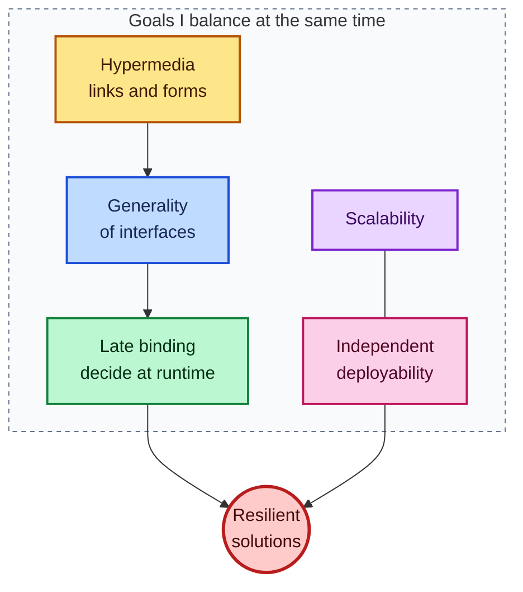

Thinking in hypermedia means using the pioneering idea of linked information (Ted Nelson's contribution) and adopting generality of interfaces (Roy Fielding's contribution) so that decisions can be made late (Alan Kay's contribution), all while keeping the system able to scale and to deploy its parts independently.

The rest of this post breaks that sentence into practical decisions.

---

## 2. Licklider's aliens: the original metamessage

My favorite piece of network history starts in 1963. J.C.R. Licklider, working at the US defense research agency that would later fund ARPANET, wrote an internal memo addressed jokingly to the "members and affiliates of the Intergalactic Network." The memo asked a practical question: how can different computers work together?

He saw two broad options.

| Option | How it works | Upside | Downside |
|---|---|---|---|
| **One language everywhere** | Every machine on Earth uses the same languages and tools | Connecting is easy | Machines cannot specialize |
| **A shared network-level language** | Each machine keeps its own local tools and languages, plus one common language for talking on the network | Local designers can optimize freely | Connecting takes extra work |

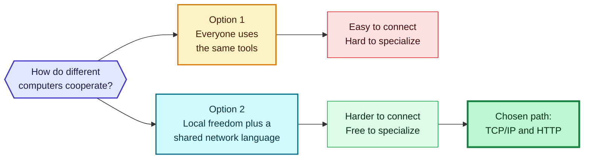

The team chose the second option, and I am glad they did. What fascinates me is *why* Licklider argued for it. He was thinking about the problem that science fiction writers liked: how do you start communicating with intelligent beings who share nothing with you? Space exploration was in the news, and he reasoned that two unrelated parties would have to exchange **messages about how to exchange messages**, a back-and-forth until both sides understood the rules of the game.

Those are *metamessages*. About ten years later, the TCP and IP protocols reflected exactly that idea of negotiated communication, and they became the backbone of the internet. Forty-odd years after the memo, the standards community even finished a transmission protocol for interplanetary links and named it after him (it is documented in RFC 5325, RFC 5326, and RFC 5327).

### Why this matters for API design

Every time I connect two services built by people who have never met, I am replaying Licklider's thought experiment. The services share no code, no database, and no language. What they can share is a convention for **how the messages describe themselves**.

Hypermedia is exactly that: a response that says "here is your data, and here is what you can do next, and here is how to ask." Links and forms are metamessages. They are the part of the conversation that is *about* the conversation.

> **Note:** A useful test for any API I design is: "If a completely unrelated program received this response with no documentation, could it work out what to do next?" Perfect scores are impossible, but the question keeps me honest.

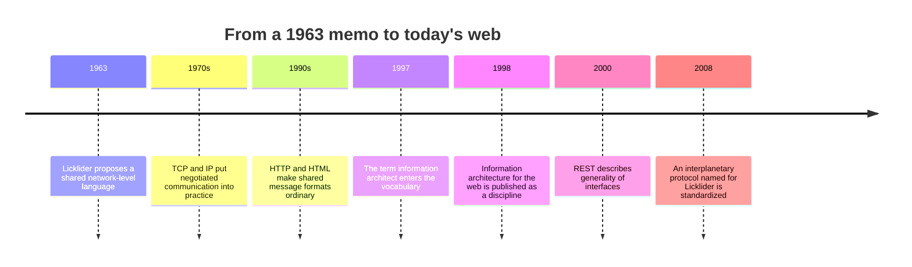

---

## 3. Information architecture: ontology, taxonomy, choreography

A shared message format is only the carrier. The content needs structure, and for that I borrow from a field that grew up alongside the web: **information architecture** (IA).

The term *information architect* was popularized in the 1990s by Richard Saul Wurman, an architect by training who also founded the TED conferences. His definition is about organizing the patterns hidden in data to make the complex clear, and creating maps that let people find their own paths to knowledge. Library scientist Peter Morville then helped turn this into a discipline focused on how humans interact with information and how to build large systems that remain easy to use as they grow.

A good IA, in Morville's framing, helps a user understand four things: **where they are, what they have found, what else is around them, and what to expect.** I realized these are exactly the properties I want from an API response, even when the "user" is a program.

| Human question | What an API response should provide |
|---|---|
| Where am I? | A `self` link and a clear resource type |
| What did I find? | Data with well-defined property names |
| What else is nearby? | Links to related resources and collections |
| What can I do next? | Actions (forms) valid in the current state |
| What should I expect? | Stable names, documented semantics, predictable errors |

Dan Klyn's three-part model gives me a vocabulary for organizing all this:

| Element | Meaning | How I map it to services |
|---|---|---|
| **Ontology** | Particular meaning of terms | The data properties passed between machines |
| **Taxonomy** | Arrangement of the parts | The connections between services on the network |
| **Choreography** | Rules for interaction among the parts | Hypermedia links and forms |

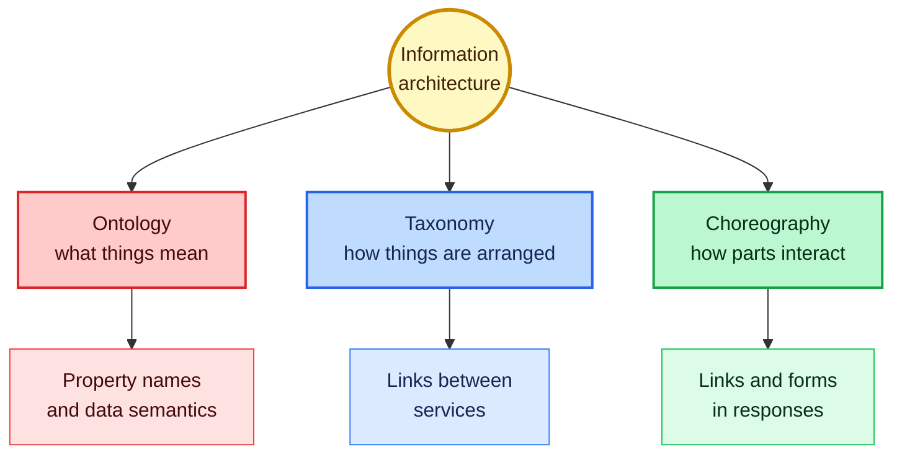

---

## 4. Designing before building

I start nearly every project with design work, before any service code exists. I think of this as *a priori* design: forming the stable elements beforehand. The advantage is that the stable parts become a foundation on which services and their interactions can be built without constant renegotiation.

A design approach has to work for more than one solution. If my method only suits a content management system and fails for a customer relationship system, it is not a method, it is a one-off. Those two products look very different, yet they share a lot at both the design level and the technical level. The work is in teasing out the common core.

That is hard when the solution must change over time: new features, new technology, and new servers and clients appear while the system keeps running. What I need is a foundation that provides stability *while* supporting change. In my practice, that foundation is hypermedia: links and forms as the device for communication between services. Fielding called hypermedia the engine of application state, and Kay's extreme late binding becomes practical because the binding happens in the messages, at runtime, instead of in compiled code.

> **Caution:** Design-first does not mean design-forever. I design the *stable* elements (formats, vocabularies, the shape of actions). I deliberately leave the *volatile* elements (URLs, field details, workflow order) to be supplied by messages at runtime.

---

## 5. Resilient clients and the choice of binding agent

Services need to be stable and predictable, so I give them precise, careful instructions. Clients are different. A client exists to accomplish a task, and the more detailed its instructions, the less reusable it becomes. A highly specific client is excellent at one job, useless for any other, and breaks if the target service changes in any meaningful way.

Here is the insight that changed how I write clients: **whenever I write an API consumer, I create a binding between a producer and a consumer.** The thing both sides share is the *binding agent*. The best binding agents are the ones that almost never change.

| Binding agent | Example | Stability | What breaks when it changes |
|---|---|---|---|
| **URL** | `/persons/123` | Low | Any relocation breaks the client |
| **Object schema** | `{id, person:{...}}` | Low | Any storage or model change breaks the client |
| **Workflow order** | step 1, then step 2, then step 3 | Low | Any added or reordered step breaks the client |
| **Protocol** | HTTP, MQTT | Very high | Practically never |
| **Message format** | HTML, Collection+JSON, SIREN | High | Rarely, and with long notice |
| **Semantic profile** | An agreed list of property and action names | Medium to high (if promised stable) | Only when vocabulary changes |

Protocol is a higher abstraction than URLs, and message format is a higher abstraction than object schema. More abstract means more universal, which means less likely to change. This is the same reason an HTML browser has worked against millions of different sites for more than three decades without being rewritten for each.

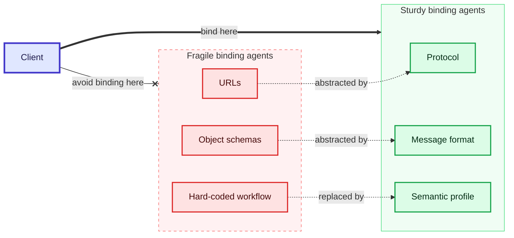

### The code-generator trap

Many tools generate client code from a service description. They bind to URLs and object schemas, so you get a working client in minutes. I use them for quick experiments, but I have learned their cost: the generated client is hard to reuse and easy to break. A change to the service's storage objects breaks it. Even an identical service running at a different URL will not work with it, because the URLs differ.

> **Caution:** Speed of the first working client is not the same as total cost. I count the cost of every future change as part of the price.

> **Note:** Usability and reusability pull in opposite directions. HTTP itself is highly abstract, so it is highly reusable, but it is not very usable without servers, browsers, and libraries built around it. Abstraction improves reuse. Specifics improve ease of use. I accept that tension rather than pretending it away.

---

## 6. Runtime metadata: let the response tell you how

Typical API documentation reads like a script for one action. For adding a person, it says to POST to a given URL, send these four parameters, use this body encoding, and expect a 201 status with a Location header. Most web programmers have internalized this style, so it feels normal.

The trap is that writing all of that into client code binds the client to the wrong thing. Change the URL or the parameters, and the client is broken. Early in a service's life, those changes happen with annoying frequency.

The alternative is to program the client to honor those details when they arrive **in the response**. HTML has done this forever. This is the same information as runtime metadata:

```html
<form action="/persons/" method="post" enctype="application/x-www-form-urlencoded">
  <input type="text"  name="givenName"  required>
  <input type="text"  name="familyName" required>
  <input type="tel"   name="telephone"  required>
  <input type="email" name="email"      required>
  <input type="submit">
</form>
```

A browser recognizes the form, learns the method, the address, the encoding, and the field names, and does the right thing. Yes, someone had to write the form-handling code, but that was a one-time cost, and it pays off across every site.

JSON-based hypermedia formats offer the same capability. The ones I reach for most often are Collection+JSON, SIREN, and UBER, and HAL is common for link-heavy designs. A SIREN-style action looks like this:

```json
{
  "name": "add-person",
  "method": "POST",
  "href": "/persons/",
  "type": "application/json",
  "fields": [
    { "name": "givenName",  "type": "text",  "required": true },
    { "name": "familyName", "type": "text",  "required": true },
    { "name": "telephone",  "type": "tel",   "required": true },
    { "name": "email",      "type": "email", "required": true }
  ]
}
```

With this in the response, the service may later change the URL, switch the method, or adjust the encoding, and a client that honors the metadata keeps working.

---

## 7. Machine-to-machine is harder than it looks

When a human fills in a web form, an astonishing amount of work happens invisibly:

- recognizing that a form exists and can be submitted
- working out how many inputs there are
- understanding what `givenName` means
- finding values for each input
- knowing to press submit
- coping with error messages and unexpected server replies

A human client does all of this for free. A machine client does not. That is why parsing a hypermedia format into a human-friendly screen is relatively easy (a browser does it), while true machine-to-machine interaction is harder: **the human brain is missing from the loop.**

I see two ways to respond. One is to build human-like intelligence into the client, which is a research program, not an engineering task. The other is to lean on **limited intelligence** supported by shared conventions: media types handle recognizing forms and their metadata, and *semantic profiles* handle the meaning of the fields.

### Semantic profiles

A semantic profile is a document that lists the property names and the actions (links and forms) used for a family of problems, such as account management or payments. It draws a boundary around the vocabulary a client is expected to understand. Client and server agree up front on what data is needed, and the server promises to keep that boundary stable.

That gives me a third stable binding agent, alongside protocol and format. Together they cover most of what a machine client needs.

> **Why machine reads work and machine writes struggle:** The most successful machine-to-machine activity on the open web has been *reading*: crawlers, search bots, and similar tools. Reads are safe and repeatable. Writes bring questions about idempotence, required fields, and meaning. Adding one required field to a form is trivial for a person and a breaking change for a script.

> **Caution:** Never let an automated client guess the meaning of a field it does not recognize. In the demo below, my client stops with an error when the server asks for a value it has no local data for. A loud failure is much better than a quiet wrong write.

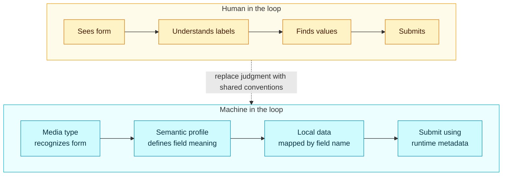

---

## 8. Client-centric workflows, with a working demo

Most API clients are tied to one service and carry its workflow in their code. Take a hypothetical customer onboarding service with four steps. The documentation says: create the customer, add contact details, record the agreement, then review. A typical client turns that documentation into code:

```text
function onboardCustomer(customer, contact, agreement, review):
    send("/onboarding/customer",  POST, customer)
    send("/onboarding/contact",   POST, contact)
    send("/onboarding/agreement", POST, agreement)
    send("/onboarding/review",    POST, review)
```

The workflow order is now a binding agent, and a fragile one. The day the service adds a credit-check step, this client is broken. A better approach is to **ask the service what work remains** and do it using the metadata in the answer:

```text
function onboardCustomer():
    loop:
        work = GET("/onboarding/work-in-progress")
        if no work.actions: stop
        action = work.actions[0]
        send(action.href, action.method, fill(action.fields, local data))
```

If the order changes, or the number of steps changes, this client keeps working.

### The experiment

I built a small server that supports both versions of the workflow. When started with the credit-check option, it inserts a `credit-check` step between contact and agreement, and it rejects any step submitted out of order. Then I ran two clients against both versions: a **static** one with the order hard-coded and an **adaptive** one that follows the actions the server offers.

**File: `onboarding.py`**

```python
"""Statically bound client vs. action-following client.
The server can add a 'credit-check' step without telling anyone.
"""
import json, threading, urllib.request, urllib.error
from http.server import BaseHTTPRequestHandler, ThreadingHTTPServer

FIELDS = {
    "customer":     ["givenName", "familyName"],
    "contact":      ["telephone", "email"],
    "credit-check": ["consentToCheck"],
    "agreement":    ["agreed"],
    "review":       ["reviewer"],
}

def make_server(with_credit_check):
    steps = ["customer", "contact"] + (["credit-check"] if with_credit_check else []) + ["agreement", "review"]
    done = []

    class H(BaseHTTPRequestHandler):
        def log_message(self, *a): pass
        def reply(self, code, body):
            data = json.dumps(body).encode()
            self.send_response(code)
            self.send_header("Content-Type", "application/json")
            self.send_header("Content-Length", str(len(data)))
            self.end_headers()
            self.wfile.write(data)
        def do_GET(self):
            if self.path != "/onboarding/work-in-progress":
                return self.reply(404, {"error": "not found"})
            host = self.headers["Host"]
            if len(done) == len(steps):
                return self.reply(200, {"status": "complete", "actions": []})
            nxt = steps[len(done)]
            self.reply(200, {"status": "in-progress", "actions": [{
                "name": nxt, "method": "POST",
                "href": f"http://{host}/onboarding/{nxt}",
                "fields": [{"name": f, "required": True} for f in FIELDS[nxt]]}]})
        def do_POST(self):
            step = self.path.rsplit("/", 1)[-1]
            n = int(self.headers.get("Content-Length", 0))
            body = json.loads(self.rfile.read(n) or b"{}")
            if step not in steps:
                return self.reply(404, {"error": "unknown step"})
            if len(done) == len(steps) or steps[len(done)] != step:
                return self.reply(409, {"error": f"step '{step}' is not the next step"})
            missing = [f for f in FIELDS[step] if f not in body]
            if missing:
                return self.reply(400, {"error": f"missing {missing}"})
            done.append(step)
            self.reply(200, {"ok": step})

    srv = ThreadingHTTPServer(("127.0.0.1", 0), H)
    threading.Thread(target=srv.serve_forever, daemon=True).start()
    return srv

def call(method, url, payload=None):
    data = json.dumps(payload).encode() if payload is not None else None
    req = urllib.request.Request(url, data=data, method=method,
                                 headers={"Content-Type": "application/json"})
    try:
        with urllib.request.urlopen(req, timeout=5) as r:
            return r.status, json.loads(r.read())
    except urllib.error.HTTPError as e:
        return e.code, json.loads(e.read())

LOCAL = {"givenName": "Mia", "familyName": "Khan", "telephone": "555-0100",
         "email": "mia@example.org", "consentToCheck": True,
         "agreed": True, "reviewer": "auto"}

def static_client(base):
    """Workflow order is baked into client code."""
    for step in ["customer", "contact", "agreement", "review"]:
        body = {f: LOCAL[f] for f in FIELDS[step]}
        call("POST", f"{base}/onboarding/{step}", body)
    return call("GET", f"{base}/onboarding/work-in-progress")[1]["status"]

def adaptive_client(base):
    """Asks what work remains, then does it using runtime metadata."""
    for _ in range(20):                       # safety cap
        _, wip = call("GET", f"{base}/onboarding/work-in-progress")
        if not wip["actions"]:
            return wip["status"]
        action = wip["actions"][0]
        body = {}
        for f in action["fields"]:
            if f["name"] not in LOCAL:        # vocabulary gap: stop, don't guess
                raise LookupError(f"no local value for field {f['name']!r}")
            body[f["name"]] = LOCAL[f["name"]]
        status, resp = call(action["method"], action["href"], body)
        if status >= 400:
            raise RuntimeError(f"{status}: {resp}")
    raise RuntimeError("workflow did not finish")

if __name__ == "__main__":
    for label, flag in [("original workflow", False), ("workflow with credit-check", True)]:
        for name, fn in [("static  ", static_client), ("adaptive", adaptive_client)]:
            srv = make_server(flag)
            base = f"http://127.0.0.1:{srv.server_port}"
            try:
                result = fn(base)
            except Exception as e:
                result = f"ERROR {e}"
            print(f"{label:28} {name} -> {result}")
            srv.shutdown()
```

Output:

```text
original workflow            static   -> complete
original workflow            adaptive -> complete
workflow with credit-check   static   -> in-progress
workflow with credit-check   adaptive -> complete
```

Read the last two lines closely. When the server added a step, the static client did its four posts, the server rejected the out-of-order ones, and the job was left stuck as `in-progress`. The adaptive client finished, with no code change, because it simply asked what was next.

### Three ways to own the workflow

The demo shows a service-guided flow. There are actually three common arrangements, and I choose among them deliberately.

| Who owns the workflow? | How it works | Good for | Risk |
|---|---|---|---|
| **Static client** | Order is baked into client code | Tiny, stable, one-off integrations | Breaks on any server change |
| **Service-guided** | Server lists the next actions; client follows | Processes owned by one service | Client needs a stop condition and field-mapping rules |
| **Client-defined** | Client holds its own list of steps spanning several independent services | Mashing together services that do not know about each other | Client carries more responsibility for deciding when it is finished |

In the third case the real "application" exists only inside the client. The services have no idea about each other, and that is fine, as long as the binding agents (protocol, format, profile) are stable.

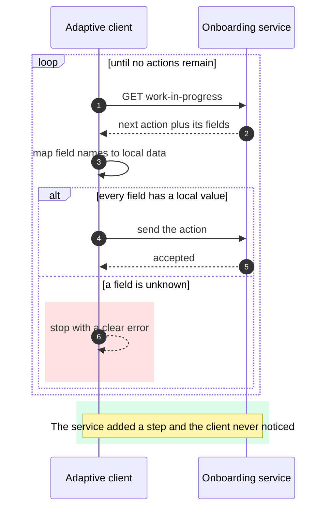

> **Caution:** My adaptive client has a hard cap of 20 iterations. Any loop that follows server instructions needs a ceiling, or a buggy server can keep a client busy forever. Also consider a check on the target host of each action before sending data to it.

---

## 9. Stable and evolvable services

The central difficulty in designing a service API is balancing **stability** (keeping your promises to consumers) against **evolvability** (letting the service grow). Both matter, and they pull against each other.

### The modifiability problem

Producing an interface is easy. Plenty of tools scan a database schema or a codebase and emit an HTTP API ready to deploy. What is hard is a well-crafted interface that lasts. The key variable is time. A service that never changes needs little design. An interface in front of a decades-old mainframe system can be built with schema-driven tooling, and it will probably be fine, because the system behind it is not going anywhere.

But most services today are young, were designed for immediate needs, and see those needs evolve. The easy route is to publish a new interface labeled `/v2/` and move on. Plenty of companies do that. The responsible ones keep the old versions alive for a long time so clients can upgrade on their own schedule. Others retire old versions quickly, which pushes the update burden onto every consumer. When a client consumes several APIs, each with its own schedule, it is permanently in a state of disruption.

I prefer an approach that lets services evolve *without* forcing clients to react. It rests on three principles.

### Principle 1: The Hippocratic oath of APIs

The Hippocratic oath is summarized as "first, do no harm." For an interface, that means a promise never to break compatibility. I keep three rules:

| Rule | Meaning | Example violation |
|---|---|---|
| **Take nothing away** | Anything published stays: endpoints, formats, input parameters, output values (you may blank or ignore a value, but not remove it) | Dropping the `count` field from a response |
| **Don't redefine things** | An existing element keeps its meaning | Changing `count` from "records in the collection" to "records on this page" |
| **Make additions optional** | New inputs and outputs must be optional for existing interfaces | Adding a required `backup_email` input to user creation |

I turned these rules into a tiny checker so I can run them in a build pipeline.

**File: `compat_check.py`**

```python
"""Checks a new interface description against an old one using three rules:
1. Take nothing away.  2. Don't redefine things.  3. Make additions optional.
"""
def check(old, new):
    problems = []
    for ep, o in old.items():
        n = new.get(ep)
        if n is None:
            problems.append(f"{ep}: endpoint removed")
            continue
        for name, spec in o["inputs"].items():
            if name not in n["inputs"]:
                problems.append(f"{ep}: input '{name}' removed")
            elif n["inputs"][name]["type"] != spec["type"]:
                problems.append(f"{ep}: input '{name}' type changed")
        for name, spec in o["outputs"].items():
            if name not in n["outputs"]:
                problems.append(f"{ep}: output '{name}' removed")
            else:
                if n["outputs"][name]["type"] != spec["type"]:
                    problems.append(f"{ep}: output '{name}' type changed")
                if n["outputs"][name]["meaning"] != spec["meaning"]:
                    problems.append(f"{ep}: output '{name}' meaning changed")
        for name, spec in n["inputs"].items():
            if name not in o["inputs"] and spec.get("required"):
                problems.append(f"{ep}: new input '{name}' is required")
    return problems

BASE = {"list-users": {
    "inputs":  {"region": {"type": "text", "required": False}},
    "outputs": {"count": {"type": "number", "meaning": "records in the whole collection"},
                "users": {"type": "array",  "meaning": "up to 100 user records"}}}}

def variant(**edits):
    import copy
    v = copy.deepcopy(BASE)
    for path, val in edits.items():
        ep, kind, name = path.split("__")
        if val is None: del v[ep.replace("_", "-")][kind][name]
        else: v[ep.replace("_", "-")][kind][name] = val
    return v

if __name__ == "__main__":
    cases = {
        "add optional input":   (variant(list_users__inputs__page_size={"type": "number", "required": False}), 0),
        "add required input":   (variant(list_users__inputs__page_size={"type": "number", "required": True}), 1),
        "remove output":        (variant(list_users__outputs__count=None), 1),
        "redefine meaning":     (variant(list_users__outputs__count={"type": "number", "meaning": "records on this page"}), 1),
        "change input type":    (variant(list_users__inputs__region={"type": "number", "required": False}), 1),
        "add whole endpoint":   ({**BASE, "paged-list": BASE["list-users"]}, 0),
        "drop whole endpoint":  ({}, 1),
    }
    for label, (new, expected) in cases.items():
        found = check(BASE, new)
        assert len(found) == expected, (label, found)
        print(f"{label:22} -> {'OK' if not found else found}")
    print("all compatibility checks behaved as expected")
```

Output:

```text
add optional input     -> OK
add required input     -> ["list-users: new input 'page_size' is required"]
remove output          -> ["list-users: output 'count' removed"]
redefine meaning       -> ["list-users: output 'count' meaning changed"]
change input type      -> ["list-users: input 'region' type changed"]
add whole endpoint     -> OK
drop whole endpoint    -> ['list-users: endpoint removed']
all compatibility checks behaved as expected
```

> **Note:** This checker is deliberately simple. It compares declared interface descriptions, not live behavior. It will not catch a case where the *behavior* behind an unchanged field quietly changes. Pair it with contract tests against a running service.

### Principle 2: Don't change it, add it

You can always add new endpoints or new actions and set fresh rules there. Say an existing action returns at most one hundred records. Later the service can support a page size. The tempting move is to add `page-size` to the existing form with a default of 100. Do not. An existing client may rely on getting more than a hundred rows in some situations, and a changed default would break it.

Offer a second action instead:

```json
{
  "actions": [
    {
      "name": "filter-list",
      "title": "Filter User List",
      "method": "GET",
      "href": "http://api.example.org/users/filter",
      "type": "application/x-www-form-urlencoded",
      "fields": [
        { "name": "region",    "type": "text", "value": "" },
        { "name": "last-name", "type": "text", "value": "" }
      ]
    },
    {
      "name": "paged-filter-list",
      "title": "Filter User List (paged)",
      "method": "GET",
      "href": "http://api.example.org/users/paged-filter",
      "type": "application/x-www-form-urlencoded",
      "fields": [
        { "name": "page-size", "type": "number", "value": "100" },
        { "name": "region",    "type": "text",   "value": "" },
        { "name": "last-name", "type": "text",   "value": "" }
      ]
    }
  ]
}
```

Old clients keep using `filter-list`. New clients discover `paged-filter-list` by name. Adding is almost always safer than changing.

### Principle 3: APIs are forever

An interface is a contract, and contracts are meant to be kept. A leader at a large online retailer once put it roughly like this: you only get one chance to get an API right, so treat it as important. I take a slightly more forgiving reading: I cannot predict what will change, but I *can* write the possibility of change into the agreement.

The most valuable clause is a single sentence: **consumers should ignore any properties they do not understand.** This is sometimes called a tolerant reader. It costs nothing, and it lets the service add new output properties freely.

> **Caution:** The tolerant-reader rule must be written into the contract from day one. If early clients are allowed to reject unknown fields, you have already lost the ability to add outputs safely.

### What hypermedia can and cannot absorb

I split stability and evolvability into two layers:

| Layer | Provides | Mechanism |
|---|---|---|
| **Stability** | Messages clients can depend on | Registered, structured media types (HTML, HAL, Collection+JSON, SIREN, and others) |
| **Evolvability** | Room to change the volatile parts | Hypermedia controls: new actions, updated URLs, changed methods, added properties |

I choose formats from the IANA media types registry because registered types have longevity and tooling behind them. The more hypermedia controls a format has, the more evolvability I get.

There is a limit. Hypermedia lets me change addresses, actions, and field details safely. It does *not* protect me when the **domain vocabulary** itself changes, such as introducing `middleName` or a new filter parameter. For that I publish a new vocabulary document and let clients discover and choose among vocabularies at runtime.

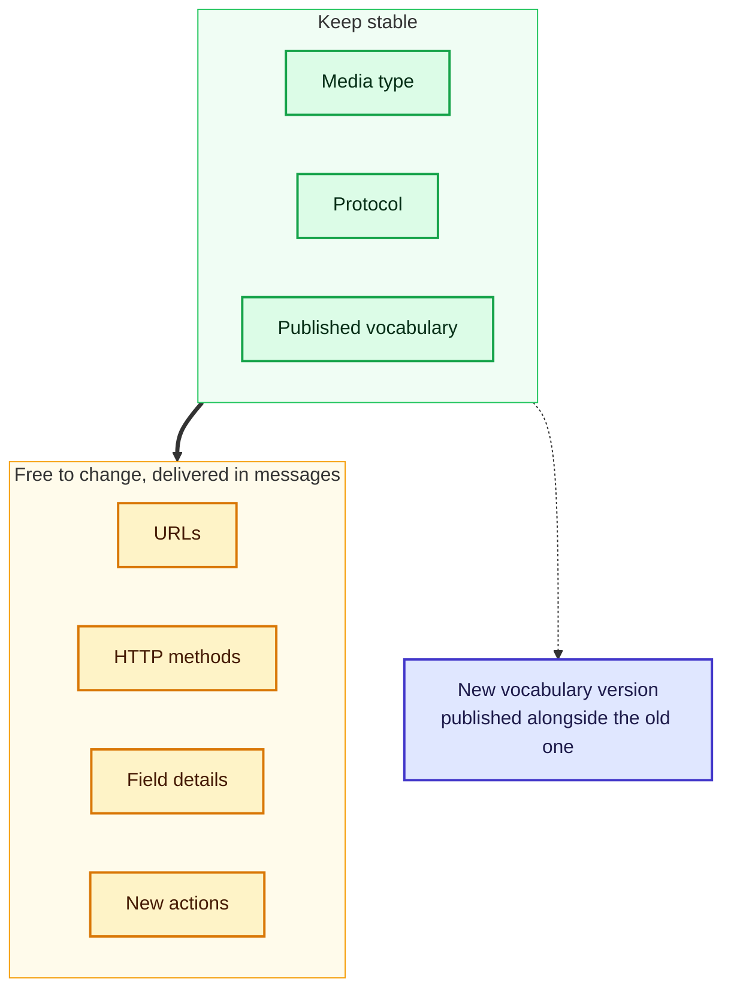

### The dependency chain problem

Services call other services. When service A depends on B, and B changes, A may break, and anything that depends on A may break too. That is a fatal dependency chain. Eliminating dependencies is rarely realistic, because I depend on other services precisely for things I lack.

Today the usual recovery is human: a service breaks, a notification fires, someone finds a replacement, and a fixed component goes back into production. That is slow. Closed platforms such as Kubernetes automate part of this by letting services register metadata in a shared registry so peers can find them and integrate quickly.

---

## 10. Find and bind

Another thing I care about is **self-service onboarding**. On the web, if I like a page, I copy a link and share it, and anyone can follow it. We rarely think of that as integration. It is just how the web works.

Services should work that way too, but mostly they do not. Developers find a candidate API by searching, struggle through its documentation, and wrestle with integrating it. They repeat the process for every dependency, and again whenever any of them changes.

I call the automated alternative **find and bind**:

1. **Find:** services are named and described with standard metadata, so they can be discovered automatically.
2. **Bind:** a client reads that metadata and integrates at runtime.

The Domain Name System already does this for machines: you give it a name and it finds the machine, even if you have never met the owner. I want the same experience for services.

| Stage | What I need | Typical ingredient |
|---|---|---|
| **Find** | A searchable registry with consistent descriptions | Metadata documents, registries, standard names |
| **Bind** | Enough runtime detail to talk to the service | Media type, profile, hypermedia controls |
| **Re-bind** | A way to recover when a service disappears | Same metadata used to locate a replacement |

> **Caution:** Automated binding is powerful and risky. Restrict it to registries you trust and to services whose identities you verify, or an attacker can register a lookalike service and receive your data.

---

## 11. Distributed data: everything is remote

For most of computing history, data thinking has revolved around **systems of record** and a **single source of truth**: pick one authoritative location for each fact, and control who can edit it. That works inside one organization.

On the open web, it does not hold. I cannot control where data is stored or how many copies exist. It is wise to assume there are always several copies, and that mine is not necessarily the one others see.

A rule I like, credited to software architect Irakli Nadareishvili, is **"treat all data as if it were remote."** It carries three assumptions: I cannot change the storage medium or schema, I cannot control who reads or writes at the source, and I am on my own if the source becomes unavailable.

### What this changes in practice

If my service *manages* data:

- Keep logs of who requested data and who sent updates.
- Own the integrity of my local data: it should be impossible to write an invalid record.
- Support reversing updates within a limited window.
- Keep deleted data for a while (within a defined time window) in case it must be restored.

If my service *depends on* data from others:

- Ask the source for the freshest copy when freshness matters.
- Expect that my updates may be rejected; the owner protects its integrity.
- Be ready to reverse an update, including a delete. This is tricky when one operation touches two sources. If the customer record accepts a change but billing rejects it, my service must know whether to roll the customer change back.
- Remember that a local cache is a copy, and sometimes I must fetch a fresher one.

### Data is evidence of action

I find it helpful to think of data as **evidence of action**. A record exists because something created or changed it. Pile up many actions from many clients and you have a collection of evidence. The value of a data store is that you can ask questions of that evidence.

On the web, the best possible evidence is the HTTP exchange itself. Capturing full messages, with headers and bodies, lets me inspect and replay what happened. Formats exist for this: the HTTP Archive format, and two media types, `message/http` for a single message and `application/http` for a group of requests and responses.

The trade-off is that raw HTTP messages are hard to query. So I store the evidence in a query-friendly form too. The storage medium matters less than preserving the quality of the information over time.

### Outside versus inside

Whatever I store, the internal model must not leak into the interface. A saying I keep close: *your data model is not your object model is not your resource model is not your representation model.*

Suppose an interface offers three resources: `user`, `job-type`, and `job-status`. Consumers will tend to assume three matching storage collections. In truth, `job-status` might be a property of `job-type`, or both might live in one generic name-value store alongside `shipping-status` and others. It should not matter to a consumer. Likewise the storage technology could be flat files, an object database, or raw HTTP archives.

The consequence is a priority rule: **spend your design effort on the outside promises, because they must be kept for a long time, and treat the inside as replaceable.**

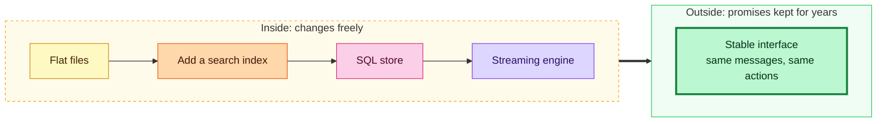

### Reading versus writing

Reads and writes behave differently on a network.

| Aspect | Reads | Writes |
|---|---|---|
| **Delay tolerance** | Low: users notice slow reads | Higher: writes can often be deferred |
| **Biggest concern** | Perceived speed and reliability | Integrity of the data |
| **Best optimization** | Serve from a local copy, avoiding the network | Limit the number of targets per write: one is best |
| **Failure impact** | Slow or missing responses | Partial updates that must be undone |

Most clients tolerate delays up to about a second, and no response is truly instantaneous. Still, machines tolerate delay less well than people, so I design machine interfaces with delay in mind. When a query is likely to take long, such as a huge report, the interface should make the delay explicit using **202 Accepted** with a status resource the client can follow.

Here is a tested demonstration. The client posts a request, receives 202 with a link to a status resource, polls by following the `status` link, then follows the `result` link once the work is done. It also records every exchange as evidence, saves it, and reloads it.

**File: `slow_report.py`**

```python
"""Making a delay explicit: 202 Accepted + a status resource, with an evidence log.
The client records every HTTP exchange so it can be inspected or replayed later.
"""
import json, threading, time, urllib.request, urllib.error
from http.server import BaseHTTPRequestHandler, ThreadingHTTPServer

JOBS = {}

class H(BaseHTTPRequestHandler):
    def log_message(self, *a): pass
    def reply(self, code, body, headers=None):
        data = json.dumps(body).encode()
        self.send_response(code)
        self.send_header("Content-Type", "application/json")
        self.send_header("Content-Length", str(len(data)))
        for k, v in (headers or {}).items(): self.send_header(k, v)
        self.end_headers(); self.wfile.write(data)
    def do_POST(self):
        if self.path != "/reports": return self.reply(404, {})
        jid = str(len(JOBS) + 1)
        JOBS[jid] = {"ready_at": time.time() + 0.6}
        base = f"http://{self.headers['Host']}"
        self.reply(202, {"status": "accepted",
                         "links": [{"rel": "status", "href": f"{base}/reports/{jid}/status"}]},
                   {"Location": f"{base}/reports/{jid}/status"})
    def do_GET(self):
        parts = self.path.strip("/").split("/")
        base = f"http://{self.headers['Host']}"
        if len(parts) == 3 and parts[2] == "status" and parts[1] in JOBS:
            if time.time() < JOBS[parts[1]]["ready_at"]:
                return self.reply(200, {"status": "working", "links": [
                    {"rel": "status", "href": self.path and f"{base}{self.path}"}]},
                    {"Retry-After": "0"})
            return self.reply(200, {"status": "done", "links": [
                {"rel": "result", "href": f"{base}/reports/{parts[1]}"}]})
        if len(parts) == 2 and parts[0] == "reports" and parts[1] in JOBS:
            return self.reply(200, {"rows": 3, "data": [1, 2, 3]})
        self.reply(404, {"error": "not found"})

EVIDENCE = []
def call(method, url, payload=None):
    data = json.dumps(payload).encode() if payload is not None else None
    req = urllib.request.Request(url, data=data, method=method)
    with urllib.request.urlopen(req, timeout=5) as r:
        body = json.loads(r.read())
        EVIDENCE.append({"method": method, "url": url, "status": r.status, "body": body})
        return r.status, body

def link(doc, rel):
    return next(l["href"] for l in doc["links"] if l["rel"] == rel)

if __name__ == "__main__":
    srv = ThreadingHTTPServer(("127.0.0.1", 0), H)
    threading.Thread(target=srv.serve_forever, daemon=True).start()
    base = f"http://127.0.0.1:{srv.server_port}"

    status, doc = call("POST", f"{base}/reports")
    assert status == 202
    polls = 0
    while doc["status"] != "done":
        time.sleep(0.2); polls += 1
        _, doc = call("GET", link(doc, "status"))
        assert polls < 20, "gave up waiting"
    _, result = call("GET", link(doc, "result"))
    assert result["rows"] == 3
    print(f"result arrived after {polls} polls; evidence log holds {len(EVIDENCE)} exchanges")
    print("statuses seen:", [e["status"] for e in EVIDENCE][:3], "...")
    json.dump(EVIDENCE, open("evidence.json", "w"))
    assert len(json.load(open("evidence.json"))) == len(EVIDENCE)
    print("evidence log saved and reloaded intact")
    srv.shutdown()
```

Output:

```text
result arrived after 3 polls; evidence log holds 5 exchanges
statuses seen: [202, 200, 200] ...
evidence log saved and reloaded intact
```

> **Note:** The number of polls can differ from run to run because it depends on timing. The asserts in the script check the things that must always be true: the first response is 202, the result has three rows, and the saved evidence reloads intact.

> **Caution:** Real status resources need limits. Add a maximum wait on the client, honor `Retry-After` hints from the server, and expire old job records on the server. Also remember that evidence logs may contain personal data, so protect and eventually delete them according to your policies.

### Retrieval languages and database languages

There are two families of query languages, and the difference matters on the web.

| Family | Purpose | Examples | Strength on the open web |
|---|---|---|---|
| **Database query languages** | Return definitive results about stored facts | SQL | Precise, but heavy for widely distributed sources |
| **Information retrieval query languages** | Return a set of documents that match criteria | Apache Lucene, and engines built on it such as Solr | Optimized for searching large, scattered collections via indexes |

I lean on retrieval-style languages for reads, because most requests are reads and these engines are built for matching criteria across many sources. Some technologies, such as GraphQL, SPARQL, OData, and JSON:API, cover both reading and writing, but I usually prefer a different technology for writes.

| Scale of writes | What I reach for |
|---|---|
| A handful of users, a few hundred documents | File-based storage, one record per file |
| Growing beyond that | A write-friendly data engine such as PostgreSQL or SQLite |
| Thousands of writes per second | A streaming engine such as Apache Kafka or Apache Pulsar |

None of this should show on the outside. A service can start with files, add a search index, move to SQL, and eventually adopt streaming, all behind an interface that does not change.

---

## 12. Workflow: orchestra, dance, or jazz

Web services have always been easy to connect with links, and I want to carry that into multi-service work. An online checkout, for instance, might involve computing totals, applying tax, arranging payment, scheduling shipping, and sending a confirmation.

Inside one codebase, these are steps in order, and some may run in parallel. Parallel execution helps scalability but needs agreements about which steps are independent. Even when everything *could* run in parallel, the workflow may demand an order: calculating tax before the basket is final makes little sense.

On the web, each step must be treated as if it runs in a separate process at a different location, with no shared data model, storage, or language. All they share is an agreed interface. HTTP is that interface, but it is low level. For efficient work, services need to share a language for coordination.

### Two familiar models

| Model | Metaphor | How it works | Strengths | Weaknesses |
|---|---|---|---|---|
| **Orchestration** | An orchestra with a conductor | One engine reads a central workflow document and calls services | Easy to reason about, validate, test, and monitor | Central engine is a single point of failure; tends toward synchronous, tightly coupled designs |
| **Choreography** | A dance | Each service knows its moves and reacts to others; workflow emerges | Loose coupling; resilience; easy to replace parts | Hard to see progress or overall health; no single control point |

Orchestration suits workflows with few steps and little branching, where defining the work in one document is simplest. Choreography suits involved workflows with many steps, asynchronous work, individual rollbacks, and heavy branching. Its monitoring weakness can be softened by giving every job a **progress resource** that services update when they finish.

### A third model: hypermedia workflow, or jazz

There is another approach I have found dependable. I think of it as jazz. With an orchestra, someone is in charge. In a dance, everyone must know their part. In jazz, everyone knows roughly what the song is, and each player contributes in their own way to the final performance.

Practically, hypermedia workflow means that every participating service exposes a **composable interface** with a tiny set of standard actions, and the workflow itself is described in documents, not in code.

**Task actions (one service doing one piece of work):**

| Action | Meaning |
|---|---|
| **Execute** | Do the work |
| **Repeat** | Do the same work again if it did not succeed |
| **Revert** | Undo the work because something elsewhere failed |
| **Cancel** | Stop and undo any prior work |

**Job actions (a collection of tasks):**

| Action | Meaning |
|---|---|
| **Continue** | Pick up where the job left off |
| **Restart** | Begin again from the very beginning |
| **Cancel** | Stop the job and tell every task to undo its work |

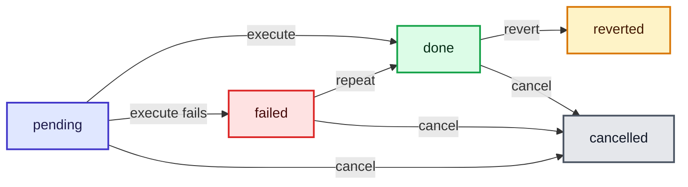

The interface is small enough that each service can implement it easily, whatever its internal language. The hard parts, such as how a service reverts work when it called other services behind the scenes, stay inside the service.

Another benefit is that hypermedia documents are **declarative**: they say *what* needs to be done and leave the *how* to the participants. Most programming languages are imperative and describe each step. Declarative workflow documents let me enlist composable services without worrying about how all the parts interact.

### A tested implementation

Here is a compact in-memory version of these semantics. A `Task` supports execute, repeat, revert, and cancel. A `Job` runs all its tasks in parallel and supports continue, restart, and cancel. The self-test checks three scenarios: a flaky payment that succeeds on retry, a payment that never works (forcing a cancel that must undo exactly the completed work), and a full restart.

**File: `workflow.py`**

```python
"""Hypermedia-style workflow semantics: tasks (execute/repeat/revert/cancel)
and jobs (continue/restart/cancel). In-memory, thread-based, standard library only.
"""
import threading
from concurrent.futures import ThreadPoolExecutor

class Task:
    def __init__(self, name, work, undo):
        self.name, self._work, self._undo = name, work, undo
        self.state = "pending"; self.error = None

    def execute(self):
        try:
            self._work(); self.state = "done"; self.error = None
        except Exception as e:
            self.state, self.error = "failed", str(e)
        return self.state

    def repeat(self):                      # same work again after a failure
        return self.execute()

    def revert(self):
        if self.state == "done":
            self._undo(); self.state = "reverted"

    def cancel(self):
        if self.state == "done": self._undo()
        self.state = "cancelled"

class Job:
    def __init__(self, tasks):
        self.tasks, self.state = tasks, "new"

    def _run(self, subset):
        with ThreadPoolExecutor(max_workers=len(subset) or 1) as pool:
            list(pool.map(lambda t: t.execute(), subset))
        failed = [t.name for t in self.tasks if t.state == "failed"]
        self.state = "failed" if failed else "complete"
        return self.state

    def run(self):      return self._run(self.tasks)
    def cont(self):     return self._run([t for t in self.tasks if t.state != "done"])
    def restart(self):
        for t in self.tasks: t.revert(); t.state = "pending"
        return self._run(self.tasks)
    def cancel(self):
        for t in self.tasks: t.cancel()
        self.state = "cancelled"; return self.state

if __name__ == "__main__":
    ledger, lock = [], threading.Lock()
    def log(msg):
        with lock: ledger.append(msg)

    attempts = {"payment": 0}
    def make(name, fail_times=0, forever=False):
        def work():
            if name == "payment":
                attempts["payment"] += 1
                if forever or attempts["payment"] <= fail_times:
                    raise RuntimeError("card service unavailable")
            log(f"do:{name}")
        return Task(name, work, lambda: log(f"undo:{name}"))

    names = ["computeTotals", "applyTax", "scheduleShipping", "sendConfirmation"]

    # Scenario 1: payment fails once, job continues and completes
    job = Job([make(n) for n in names[:2]] + [make("payment", fail_times=1)] + [make(n) for n in names[2:]])
    assert job.run() == "failed"
    assert [t.name for t in job.tasks if t.state == "failed"] == ["payment"]
    assert job.cont() == "complete"
    assert all(t.state == "done" for t in job.tasks)
    assert ledger.count("do:applyTax") == 1, "continue must not redo finished work"
    print("scenario 1: failed once, continue() finished the job without redoing work")

    # Scenario 2: payment never works, job is cancelled, completed work is undone
    ledger.clear(); attempts["payment"] = 0
    job = Job([make(n) for n in names[:2]] + [make("payment", forever=True)] + [make(n) for n in names[2:]])
    assert job.run() == "failed"
    assert job.cancel() == "cancelled"
    done_work = sorted(m[3:] for m in ledger if m.startswith("do:"))
    undone = sorted(m[5:] for m in ledger if m.startswith("undo:"))
    assert done_work == undone, (done_work, undone)
    print("scenario 2: cancel() undid exactly the work that had been done:", undone)

    # Scenario 3: restart reverts everything, then runs from the beginning
    ledger.clear(); attempts["payment"] = 0
    job = Job([make(n) for n in names])
    job.run()
    assert job.restart() == "complete"
    assert ledger.count("undo:applyTax") == 1 and ledger.count("do:applyTax") == 2
    print("scenario 3: restart() reverted and re-ran every task")
```

Output:

```text
scenario 1: failed once, continue() finished the job without redoing work
scenario 2: cancel() undid exactly the work that had been done: ['applyTax', 'computeTotals', 'scheduleShipping', 'sendConfirmation']
scenario 3: restart() reverted and re-ran every task
```

Scenario 1 matters most to me. After the payment failed once, `continue` ran only the unfinished task. The assertion proves that tax was applied exactly once, not twice. That is the difference between a resumable workflow and a rerun-everything workflow, and it is what keeps real money and real emails from being duplicated.

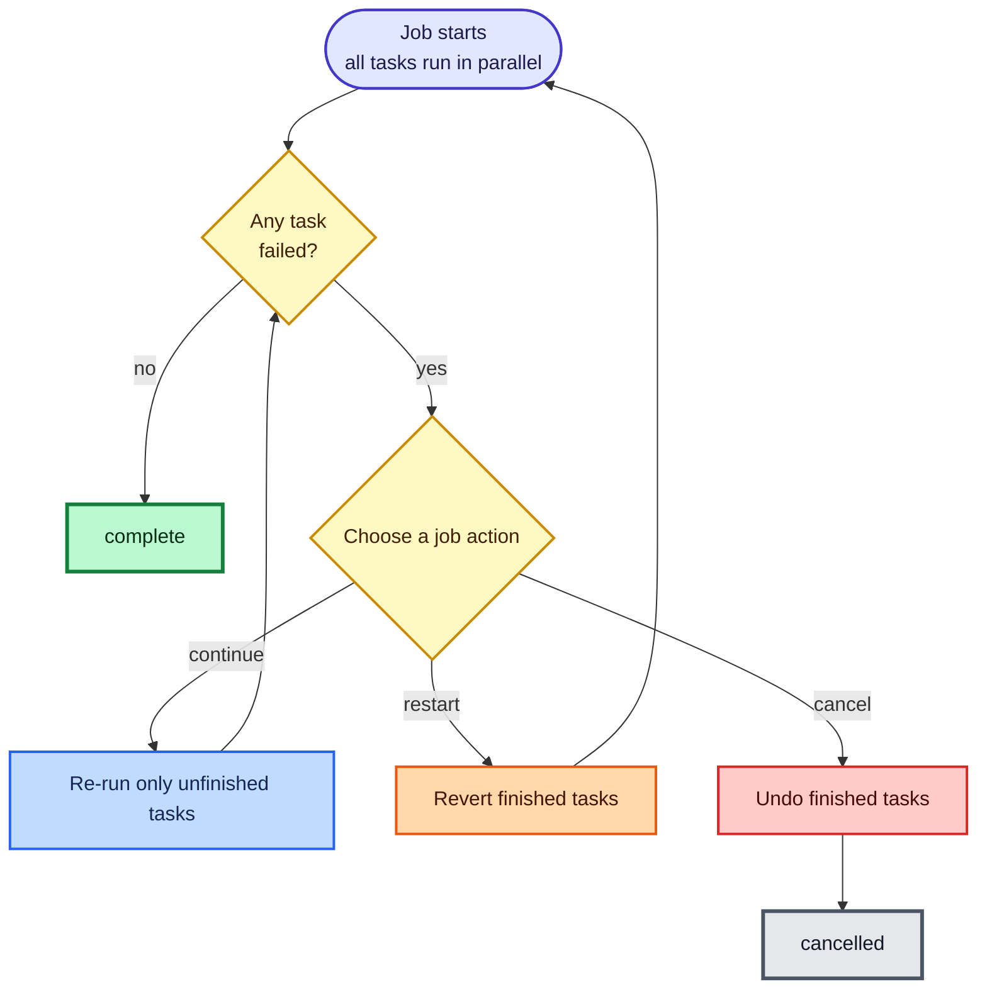

> **Caution:** My demo runs in one process and stores nothing. A real job must persist task states so it can survive a crash, and every `revert` must itself be safe to repeat, because the revert request can also fail or arrive twice. Design each task action to be **idempotent**.

> **Caution:** Some actions cannot be undone, such as sending an email or shipping a package. For those, a revert is really a *compensating action* (send a correction, issue a return label). Decide this per task and document it in the task's description.

### The five workflow challenges I plan for

| Challenge | The problem | What I do |
|---|---|---|
| **Sharing state, not data models** | Services cannot share schemas or databases | Pass state as typed documents (HTML, Collection+JSON, SIREN, HAL) whose properties come from agreed profiles and vocabularies; share them through forms or a shared addressable resource |
| **Constraining workflows** | Anything goes means nothing is reliable | Restrict interaction to a small set of standard actions (execute, repeat, revert, continue, restart, cancel), just as HTML restricts hypermedia to a few well-defined elements |
| **Observing workflows** | Nobody can fix what they cannot see | Give every job a progress resource and a dashboard, plus a way to intervene: continue, restart, or cancel |
| **Time as an element** | Some tasks take minutes or hours | Set a maximum time to live for work; when the limit passes, cancel |
| **Dealing with errors** | Networks and machines fail | Automate what can be automated, and provide a way to call a human for decisions machines cannot make |

> **Note:** Human escalation is not a failure of design, it is part of it. Some errors need judgment, such as whether to continue after a partial failure with side effects. A workflow that cannot ask for help will eventually make a bad decision silently.

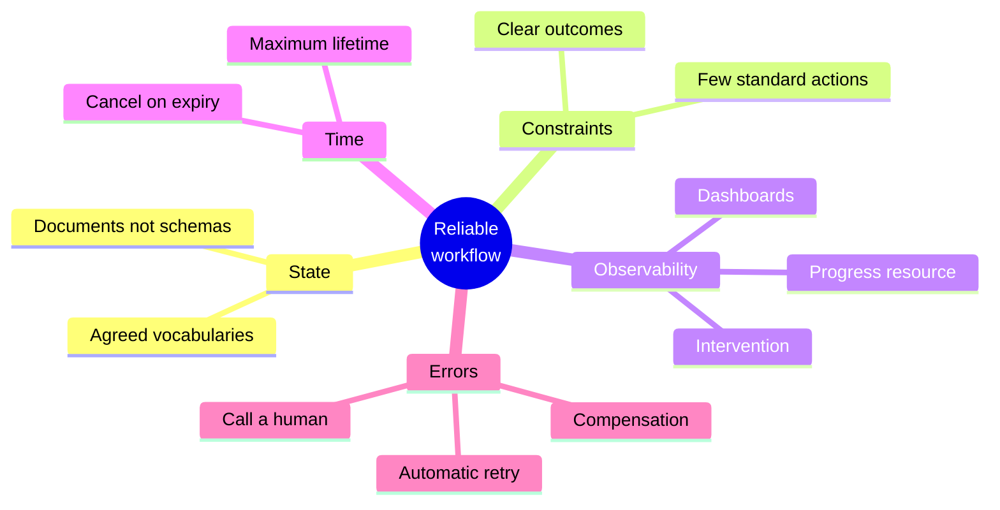

---

## 13. A design checklist

When I review a design, I walk this list. It is the whole post in question form.

**Foundations**
- [ ] Could an unrelated program work out what to do next from the response alone?
- [ ] Are links and forms present in responses, not just data?
- [ ] Did I choose a registered, structured media type?

**Clients**
- [ ] Is the client bound to protocol, format, and profile instead of URLs, object schemas, or workflow order?
- [ ] Does the client honor method, address, encoding, and fields from the response?
- [ ] Does it stop loudly when it meets a field it cannot map?
- [ ] Are loops that follow server instructions capped?

**Services**
- [ ] Do I take nothing away, redefine nothing, and make every addition optional?
- [ ] Do I add new actions instead of changing existing ones?
- [ ] Do consumers ignore properties they do not understand, by contract?
- [ ] Are vocabulary changes published as new documents that clients can discover?
- [ ] Do old interface versions stay available long enough for others to migrate?

**Data**
- [ ] Do I treat all data as remote, including my own cached copies?
- [ ] Do I log who read and who wrote?
- [ ] Is it impossible to store an invalid record?
- [ ] Can I reverse updates and deletes within a window?
- [ ] Does my internal model stay hidden behind the interface?
- [ ] Are slow reads made explicit with 202 and a status resource?
- [ ] Does each write touch only one target?

**Workflow**
- [ ] Does each service support execute, repeat, revert, and cancel?
- [ ] Do jobs support continue, restart, and cancel?
- [ ] Are task actions idempotent?
- [ ] Is there a progress resource, a time limit, and a path to a human?

### Running everything yourself

Save each listing under the filename shown above it (`onboarding.py`, `compat_check.py`, `workflow.py`, `slow_report.py`), then run:

```bash
python onboarding.py
python compat_check.py
python workflow.py
python slow_report.py
```

Each script prints its own results and exits with an error if an assertion fails.

---

## Closing thoughts

If I squeeze this whole post into a few lines, here is what I believe.

**Be precise where you promise, and flexible where you consume.** Services owe their consumers stability: nothing taken away, nothing redefined, every addition optional. Clients owe themselves adaptability: bind to protocols, formats, and profiles, and let messages supply URLs, methods, fields, and next steps.

**Put volatile things in messages.** Whatever is likely to change, such as addresses, actions, and workflow order, belongs in the response, not in compiled code. That is late binding in practice.

**Treat data as remote evidence.** Expect copies, expect rejection, keep proof of what happened, and never let the inside model leak through the interface.

**Coordinate with a small, shared vocabulary of actions.** Execute, repeat, revert, continue, restart, cancel. A handful of verbs that every participant understands is enough to let independent services play jazz together.

And behind all of it sits Licklider's old thought experiment. Two parties that share nothing can still communicate, if they are willing to talk about *how* they talk. I find that hopeful. It means I can build things for people and programs I will never meet, and still give them a fair chance of working long after I have moved on.
