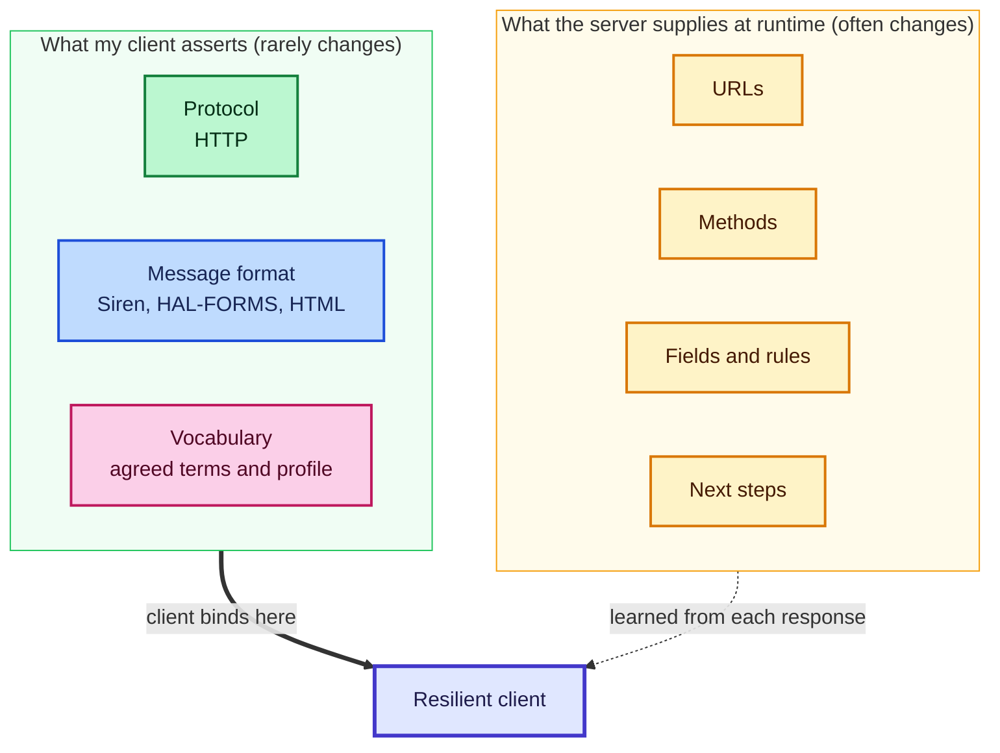
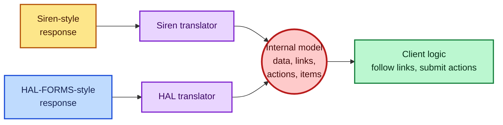
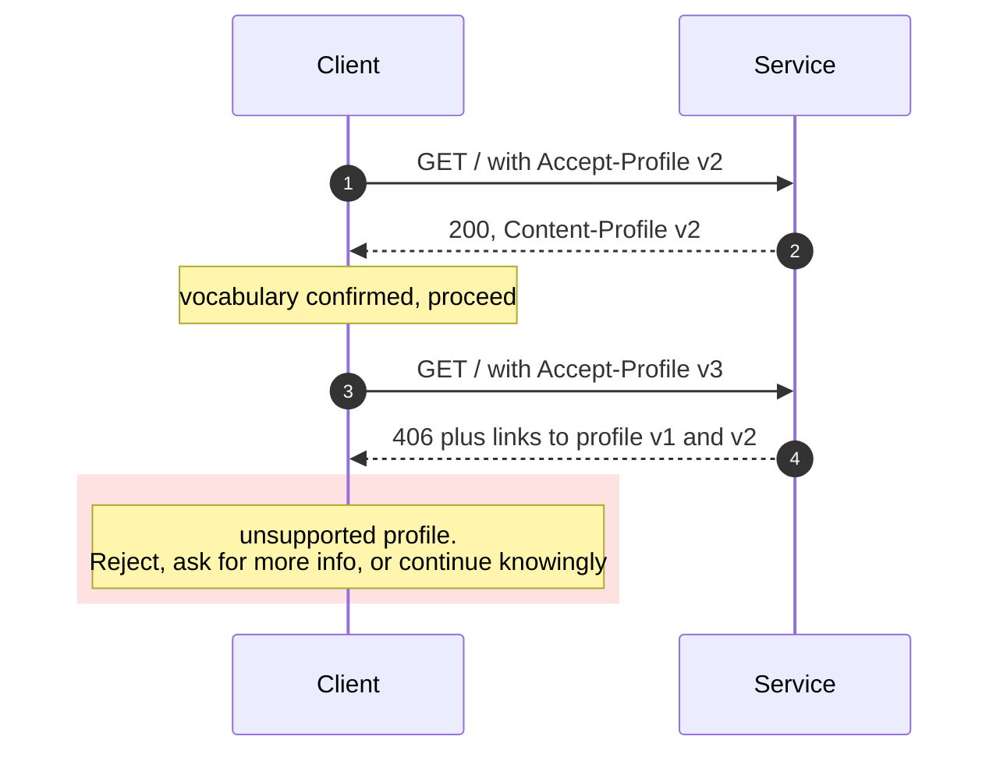
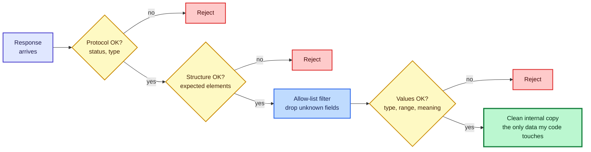
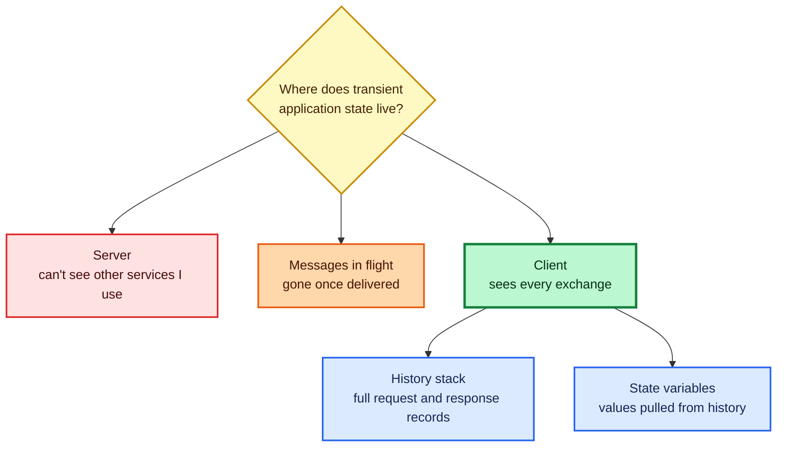
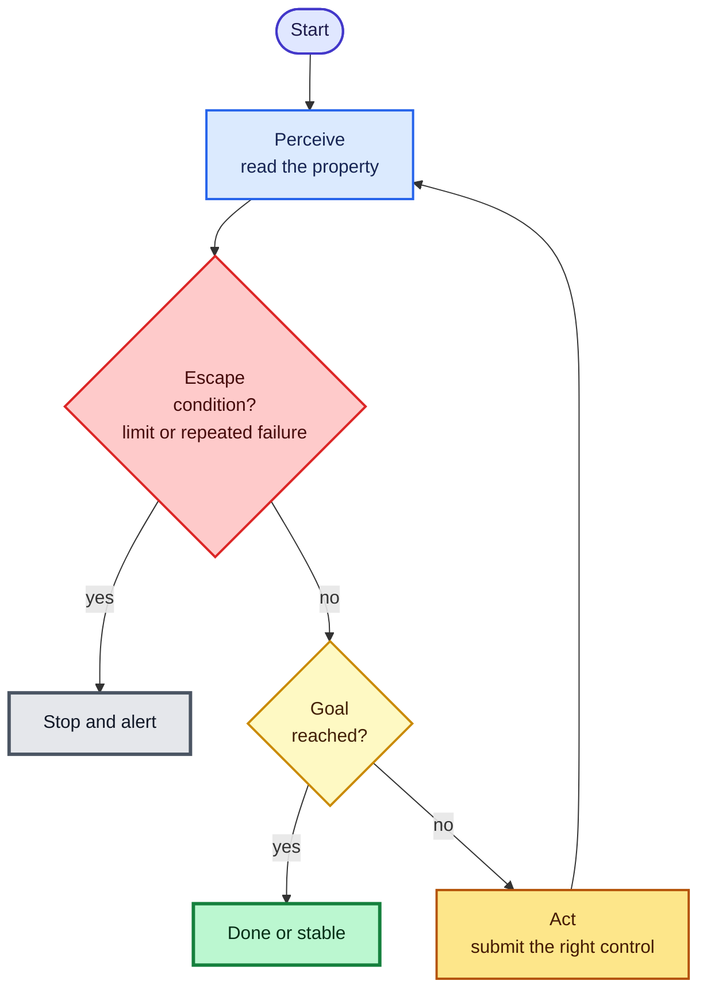

# Writing Hypermedia Clients That Don't Break: URLs, Formats, Profiles, Defensive Parsing, and Goals

*Reading time: about 35 minutes. All of the code in this post was executed before I pasted it in. The full output in section 15 is verbatim; short excerpts earlier in the post are lightly reformatted for reading. Everything uses Python 3 and its standard library. The two message formats in the demo are simplified versions of Siren and HAL-FORMS, not complete implementations.*

I have written a lot of API clients, and I have a confession: the first version of nearly every one of them was wrong in the same way. It worked beautifully on the day I wrote it. It also contained, scattered through its source, the exact URLs, the exact order of calls, the exact field names, and the exact shape of every response of one particular service on one particular afternoon. I had built a very precise photograph of a moving target.

Then the service changed, which is the one thing services reliably do.

This post is about the other way to write clients. It is the set of habits I now follow so that my clients keep working when servers move, grow, and occasionally misbehave. I will cover how I handle URLs, why I insist on speaking HTTP directly, why I bind to message formats instead of business domains, how I deal with vocabularies and profiles, where schemas help and where they hurt, how I read hypermedia controls, how I cope with services that offer none, how I defend against hostile data, where I keep state, and how I build clients that pursue goals. Every major idea has code behind it that I ran.

---

## Table of Contents

1. [The mindset: say little, and say it about things that rarely change](#1-the-mindset-say-little-and-say-it-about-things-that-rarely-change)
2. [Hardcoded URLs](#2-hardcoded-urls)
3. [Be HTTP-aware, always](#3-be-http-aware-always)
4. [Bind to messages, not to domains](#4-bind-to-messages-not-to-domains)
5. [Managing formats at runtime](#5-managing-formats-at-runtime)
6. [Understanding vocabulary profiles](#6-understanding-vocabulary-profiles)
7. [Schemas: use them going out, not coming in](#7-schemas-use-them-going-out-not-coming-in)
8. [Every important element needs an identifier](#8-every-important-element-needs-an-identifier)
9. [Reading the hypermedia controls](#9-reading-the-hypermedia-controls)
10. [When the service offers no hypermedia](#10-when-the-service-offers-no-hypermedia)
11. [Validating input at runtime](#11-validating-input-at-runtime)
12. [Defending against incoming data](#12-defending-against-incoming-data)
13. [Keeping your own state](#13-keeping-your-own-state)
14. [Clients with goals](#14-clients-with-goals)
15. [The complete code](#15-the-complete-code)
16. [A client checklist](#16-a-client-checklist)

---

## 1. The mindset: say little, and say it about things that rarely change

Writing a client forces a balance between two kinds of instruction:

| Kind | Question | Example |
|---|---|---|
| **What** | What do I want done? | "Mark this task complete." |
| **How** | How do I communicate to get it done? | Which URL, which method, which body, which format |

The more of the *how* I write into code, the more brittle the client becomes. A client with a detailed script is excellent at exactly one job against exactly one server and useless for anything else. If the server shifts, it breaks.

So my rule is: **make only a few basic assertions about how I communicate, and let the server supply everything else at runtime.** The few assertions I do make concern things that almost never change: the protocol, the message format, and the vocabulary.

That is exactly what a web browser does. It makes three assertions (HTTP, HTML, and a handful of well-known behaviors) and then works against millions of sites it has never seen. I do not want to build a browser, because a browser leans on a human being for judgment and I usually do not have one in the loop. But I can borrow its discipline.



The rest of this post is that diagram, made concrete.

---

## 2. Hardcoded URLs

Changing URLs cause some of the most annoying client failures. Sometimes it is a feature being added or removed. Sometimes the service is being "re-homed" to another platform or team. Either way, a client with `https://service.example.org/list/` scattered through its code needs surgery.

I use four tactics, in increasing order of effectiveness.

| Tactic | What I do | Strength | Weakness |
|---|---|---|---|
| **1. Named URL variables** | Every URL in code is a named variable, never a literal | Cheap; one place to edit | Still requires a code change per URL change |
| **2. Configuration file** | Move the variable values out of source into config | No recompile; sometimes no redeploy | Someone must tell me when URLs change, so there is lag |
| **3. Memorize one URL** | With a hypermedia service, hard-code only the home URL and discover everything else by link relation | Almost no URL maintenance | Needs a hypermedia service |
| **4. Ask the service team** | Persuade them to emit hypermedia, or to publish a configuration document of named URLs | Fixes it at the source | Depends on influence you may not have |

The first tactic is the same technique used for translating an application into other languages: refer to a *name* in code, and look up the *value* elsewhere. URL templates (such as `/tasks/{id}`) need both sides to agree on a template standard. I recommend an established one (RFC 6570) via a proper library. My code uses a deliberately tiny level-1 expander, just enough for the demo.

I tested the first tactic and the third:

```text
0. named URL variables re-pointed by changing one config value
2. all server URLs moved under /api/2026 -> same client code still works
```

In test 2, my demo server moved every URL under a new prefix. The client changed exactly one thing, the entry URL, and followed links from there.

> **Caution:** A configuration file is better than literals, but it is not a real solution. It shifts the problem from "recompile" to "someone must remember to update the file." Between a server change and a config update, your client is broken. Monitoring helps you notice, but it does not prevent the break.

> **Note:** Several operations often share one URL and differ only by HTTP method (read, update, and delete on the same address). If you keep named URL variables, you will eventually want to keep the *whole* request description in one place (method, headers, query, body), not just the address. That leads to the technique in [section 10](#10-when-the-service-offers-no-hypermedia).

---

## 3. Be HTTP-aware, always

Libraries and SDKs offered by service providers are tempting. They are also a classic trap. When the exact function I need is missing, I am stuck, unless my client can also speak HTTP directly.

My rule: **even if I use an SDK, my client must be able to drop to plain HTTP.** In practice I keep my own small HTTP helper that wraps requests and responses without hiding them.

The second half of the rule is subtler. I also refuse to hide HTTP behind clever domain-flavored methods. Compare:

```text
serviceClient.assignUserWorkTickets(userId, ticketList)
```

with

```text
sendHttpRequests(requests = ticketRequests, parallel = true)
```

The first reads nicely and hides a minefield. How many HTTP calls is it? One? One per ticket? Sequential or parallel? What happens when the fifth one fails? A developer should be able to *see* what they are getting into. Even a small naming change makes the cost visible.

| Aspect | Hiding HTTP behind domain methods | Keeping HTTP visible |
|---|---|---|
| **Readability at first glance** | High | Medium |
| **Cost transparency** | Low: calls, order, and parallelism are invisible | High |
| **Escape hatch for unsupported cases** | Often none | Always available |
| **Reuse across services** | Low | High |

A final point on strategy. Some providers force an SDK on everyone to "protect" their service from careless developers. In my experience that never stops malicious users, and it frequently drives well-meaning developers away. I have watched teams abandon an API because the mandatory SDK did not fit their needs. As a client author, I treat any API that forbids direct HTTP as a risk.

> **Note:** Service teams can learn a lot by watching *how* clients use their API, including the order of calls. Clients that speak HTTP directly end up demonstrating features and workflows the service never planned for. That feedback is valuable.

---

## 4. Bind to messages, not to domains

Here is the choice I make on nearly every client. I can bind my code to the **domain actions** a service documents, or I can bind it to the **message format** the service emits.

**Domain-bound client.** It has functions like `refreshList`, `searchList`, `addToList`, `completeItem`. Every action in the business domain is written into source. When the service adds a `setDueDate` operation, my client is out of date. When the details of an action change (a new method, a new URL), it breaks.

**Message-bound client.** Its core functions are generic: make a request, process the response message, display the result, render the input controls, handle clicks. The domain actions (refresh, search, add, complete) arrive *inside the response* as hypermedia controls. When the service adds `setDueDate`, my client sees a new control and offers it.

| | Domain-bound | Message-bound |
|---|---|---|
| **Knows about** | The business domain | The message format |
| **New feature on server** | Requires new client code | Appears automatically |
| **Changed method or URL** | Breaks | Absorbed |
| **Reusable for another domain** | No | Yes |
| **Requires from the service** | Documentation | Structured, hypermedia-rich responses |

That final row is the catch. Message-bound clients depend on the service using a structured media type. If the service sends only unstructured JSON, you cannot do this well.

### Proof, with two message formats

My demo server holds its data in one neutral model and renders it two different ways: in a Siren-style format and in a HAL-FORMS-style format. My client has one translator per format, converting each into a single internal model of data, links, actions, and items. Then the *same* client flow runs against both:

```text
1. Siren-style      flow ok; response type seen: application/vnd.siren+json
1. HAL-FORMS-style  flow ok; response type seen: application/prs.hal-forms+json
```

The flow itself is a function of about seven lines: get the home message, follow the `tasks` link, submit the `add-task` action, fetch the list again, submit `complete-task` on the first item, and list what remains open. It contains no URLs, no HTTP methods, and no field names beyond the one business value (`title`) that the profile promises. Which format came back was irrelevant to it.



---

## 5. Managing formats at runtime

A client that talks to several services will meet several formats. I handle that with HTTP's own metadata, and I always do it in the same order.

1. **Announce what I understand.** Every request carries an `Accept` header listing the structured formats my client can parse.
2. **Check what came back.** Before parsing, I read the response `Content-Type`.
3. **Route to a translator.** Each supported type has a handler that converts the message into my internal model.
4. **Refuse the rest.** If the type is not one I handle, I stop and report it. I do not guess.

That last step is the one people skip. My test confirms the refusal:

```text
3. unknown format refused: cannot handle 'application/xml'; refusing to guess
```

For a human-facing app, "report it" means a message on screen. For a machine client it means an error returned to the caller, a log entry, and possibly an alert to whoever supervises the system.

Separating the external message from my internal model is an old and reliable idea, usually called the **message translator** pattern. The client has one internal representation and one small translator per external format. Adding a format means adding a translator, not rewriting the client.

How hard the translator is depends on the source:

| Source format | Translator difficulty | Why |
|---|---|---|
| **Structured hypermedia type** (HTML, HAL, Siren, Collection+JSON) | Low | The target is generic, so one translator works for any domain |
| **Structured type to a domain object graph** | Medium | You need a profile or schema to guide the mapping |
| **Plain, unstructured JSON or XML with no schema or profile** | High | Custom translators built from prose documentation, and small doc changes break them |

> **Caution:** Resist the temptation to "just try parsing it as JSON" when the content type is unrecognized. A silent misparse is much worse than a loud refusal, especially in machine-to-machine work where no human will notice.

---

## 6. Understanding vocabulary profiles

Binding to protocol and format is half of the story. The other half is the **vocabulary**: the names of properties and actions. A client has to know that `title` means the title and that `complete-task` completes a task.

I bind to vocabularies through *profile documents*: machine-readable descriptions of the data properties and actions for a problem domain. Formats I have seen for this include RDF Schema, OWL, Dublin Core Application Profiles, and ALPS. The format matters less than the agreement.

There is an important distinction here. Services often publish an API definition document (OpenAPI, AsyncAPI, and so on). That is great for someone *implementing* the service. For a *consumer*, it is a trap, because it describes one particular implementation, including its URLs and methods. A client built from it is bound to that implementation. A client built from a **profile** is bound to the problem domain and will work with *any* service that honors the profile.

> **Tip:** If a service has no stable profile, write your own from the API definition and the prose documentation, publish it for your team, and keep a copy in your client's repository. A machine-readable vocabulary you control beats none.

### Negotiating profiles at runtime

How does a client confirm, at runtime, that a service speaks the vocabulary it expects? Two ways.

| Method | How it works |
|---|---|
| **Profile negotiation headers** | The client sends `Accept-Profile`; the service answers with `Content-Profile`, or with `406 Not Acceptable` plus a list of the profiles it does support |
| **Profile links** | The service emits `profile` links in its responses; the client checks that its profile is among them |

My demo server supports two profile versions. The client asks for one it supports and one it does not:

```text
4. profile v2 accepted; v3 -> 406 listing ['v1', 'v2']
```



A few practical notes from my own use:

- Treat the set of profile links as a *collection*. Responses may legitimately list several, so search for yours instead of checking only the first.
- **Do not get too granular with versions.** Identifiers like v1.1.1 create work for every client and every service. Keep profile changes backward compatible as long as you can, and bump the identifier only for a genuine break.

> **Caution:** Negotiation headers for profiles are not widely deployed, and the specifications behind them are still in draft form. They work well inside a closed environment where you control both ends, and they are a decent way to encourage profile use in an organization. For the open web, expect to rely more on profile links.

---

## 7. Schemas: use them going out, not coming in

Schema documents (JSON Schema, XML Schema) are tempting for message handling. After a lot of trial and error, my rule is simple:

> **Validate outgoing messages with a schema. Do not validate incoming messages with one.**

### Why not on the way in

The reason is a principle usually attributed to Jon Postel: *be conservative in what you send, be liberal in what you accept.* Strict schema validation of incoming data violates the second half. Real responses vary in small harmless ways: a new field the schema does not know about, or elements in a different order. Those are rarely good reasons to reject a response. But strict validators reject them anyway.

| Schema language | Behavior on a harmless change |
|---|---|
| **XML Schema** | Strict by default: element order matters, and a new element usually triggers a validation error |
| **JSON Schema** | Forgiving by default: extra properties are allowed unless disallowed explicitly, and property order does not matter |

I do find one legitimate use for schema *identifiers* on incoming messages: treating the schema's URI as an advisory confirmation that the service returned the kind of content I expected. Where the schema identifier appears varies: in a `Link` header, in a parameter on the content type, or inside the message body. (Be careful with the content-type route: some media types, JSON among them, forbid extra parameters.)

### Why on the way out

On outgoing messages, the roles reverse. It is *my* job to send valid requests, and the service's job to process every valid one. So before sending a body I check two things:

| Check | Question |
|---|---|
| **Well-formed** | Does it parse? |
| **Valid** | Do the elements have the right types and acceptable values? (A price must be numeric, above zero, below some limit.) |

> **Caution:** Be wary of schemas that you did not write. Poorly maintained schema documents cause false rejections. When in doubt, write your own validation code directly. If the service is careless about backward compatibility, abandon schema-based validation and use code-based checks that you control.

---

## 8. Every important element needs an identifier

Resources have URLs. I want the same discipline *inside* a response: every important action or data block should have a way to be found. Without that, a client cannot reliably pick out the right form from a response that contains several.

Four kinds of identifier cover almost every need:

| Identifier | Uniqueness | Cardinality | Example |
|---|---|---|---|
| **id** | Unique within the document | One value | `id=1q2w3e4r` |
| **name** | Unique within the application | One value | `name=createUserForm` |
| **rel** | Unique across the system | Several values allowed | `rel="create-form self"` |
| **tag** | Not unique; solution-specific | Several values allowed | `tag="users page-level"` (like an HTML class) |

A client should be able to locate the right link, form, or data block by at least one of these. Consider a task a person finds trivial: find the user with nickname "mingles," fetch the record, update the email address, and confirm. A script that does it by identifier looks like this:

```text
open the users service (one URL)
find the form named "nickSearch" and run it with nick = mingles
find the form named "userUpdate" and run it with the new email
find the form named "emailSearch" and run it to confirm
```

It names three actions and a handful of data properties. It never mentions a URL after the first, and it does not care whether the format is HTML or Siren.

One more subtlety. An element's **external address** and its **internal id** should be independent. If a record's `href` is just its `id` in disguise, a service migration, a new proxy, or a redirect will break things. Treat the two as unrelated.

---

## 9. Reading the hypermedia controls

A hypermedia response can contain nine kinds of control, and a client that understands them all is far more resilient than one that understands a few. I think of them as two groups.

**Link factors** (what a response can offer):

| Code | Name | Meaning | HTML example |
|---|---|---|---|
| **LE** | Link, embedded | Brings content into the current view | `` |
| **LO** | Link, outbound | Navigates to a new view | `<a>` |
| **LT** | Link, template | Needs extra parameters before running | URI template with `{id}` |
| **LN** | Link, non-idempotent | Describes an action that is not repeat-safe | `<form method="post">` |
| **LI** | Link, idempotent | Describes a repeat-safe action | A `PUT` action in Siren |

**Control factors** (details about how to perform the request):

| Code | Name | Meaning |
|---|---|---|
| **CR** | Control for read requests | How to read, such as an `Accept` hint |
| **CU** | Control for update requests | How to write, such as the body encoding |
| **CM** | Control for HTTP methods | Which method to use |
| **CL** | Control for link relations | What relationship the link has |

Every format has its own *signature*: the subset of these it can express. SVG, for instance, supports only embedded and outbound links. Siren supports nearly the full set. HAL supports a few. Plain JSON supports **none**, which is why it is so hard to write a resilient client against a service that sends only plain JSON.

**The rule I use:** the more factors a format supports, the more likely a client written against it survives future changes.

My toolkit includes a function that reports which factors a received message actually exhibits (it covers the six that can be detected from my simplified internal model: LO, CL, CM, LN, LI, and LT). Running it:

```text
5. Siren-style      factors: ['CL', 'CM', 'LN', 'LO']
5. HAL-FORMS-style  factors: ['CL', 'CM', 'LN', 'LO']
   plain JSON list factors: []
```

The two hypermedia formats show the same capabilities, and the plain list shows none. (LI and LT do not appear because this particular service offers no idempotent actions and no templated links.)

> **Note:** A client does not need to render these controls to use them. A script that simply looks up an action by name and submits it, without ever hardcoding its URL, method, or encoding, already gets most of the benefit.

---

## 10. When the service offers no hypermedia

Sometimes I must consume a service that sends plain JSON and nothing else. I still want the benefits: clearly described links and forms, and a client that does not scatter URLs through its logic.

My approach is to **supply the missing hypermedia myself, on the client side.** I translate the rules buried in the prose documentation into a machine-readable structure, once, and let the rest of my client treat it as if it had come from the server.

In my toolkit, this is a small adapter. It fetches a plain list and then attaches actions from a configuration structure that I wrote by reading the documentation:

```python
CFG = {"add-task": {"method": "POST", "href": "{base}/plain/tasks", "fields": ["title"]},
       "complete-task": {"method": "POST", "href": "{base}/plain/tasks/{id}/complete",
                         "fields": [], "per_item": True,
                         "when": lambda row: row["status"] == "open"}}
```

Notice the `when` rule: the complete action is only attached to tasks that are still open, mimicking what a hypermedia server would do on its own. The same flow code then runs against the plain service and gives the same result:

```text
6. plain-JSON service driven by client-supplied action metadata -> same result
```

| Benefit | How I get it |
|---|---|
| **One place to maintain rules** | The configuration structure, or an external file |
| **Same client logic everywhere** | The adapter produces the same internal model |
| **Easy migration** | When the service later adds real hypermedia, I delete the adapter |

Two things need care. First, **user context**: administrators may see or do things guests cannot. A solid approach is a separate action-metadata set for each role. Second, **drift**: when the service changes and my metadata does not, the client breaks. The upside is that I only update configuration, not the whole application.

> **Tip:** Better still, share your metadata. If you translate a service's documentation into machine-readable form, publish it. Other client developers will thank you. And if you can, persuade the service team to emit it themselves.

---

## 11. Validating input at runtime

When a client collects inputs (from a person or from stored data), it needs to know what counts as valid. If the only source of truth is prose documentation, the client is frozen at whatever the documentation said when I read it.

The better source is **rich input descriptions** inside the response itself. HTML's form inputs are the model: a `type`, a `pattern`, `required`, `size`, and so on. Extended formats go further. One such extension defines three groups:

| Group | What it covers | Examples |
|---|---|---|
| **Core** (clients should support) | The essentials | read-only, regex, required, templated |
| **Additional** (clients may support) | Rendering and range hints | min, max, length limits, placeholder, step, type |
| **Options** | Enumerations | A radio list of shipping methods, each with a prompt and a value |

For machine clients, I keep this simple: at minimum, honor **required** and **regex**. That covers many cases and keeps the client small. The visual hints (such as which kind of control to render) matter for human-facing apps and can be ignored by machines.

The benefit is that rule changes travel with the response. If the telephone pattern changes, or a field becomes required, a client honoring the description follows along without a code change.

My toolkit's `submit` function applies a small version of this: it refuses to send fields the action does not declare, and refuses to omit declared required fields.

> **Caution:** If a service gives no input descriptions, turn the human-readable validation rules into a machine-readable table (a configuration file or inline code) rather than leaving them as prose assumptions in your head. Review that table whenever the documentation changes.

---

## 12. Defending against incoming data

This is the part of client work I take most seriously. **Every service response should be treated as dangerous until proven otherwise.** It might hold malicious data, smuggled scripts, or just plain bad values that make the client misbehave. In machine-to-machine settings, no human will see the data to catch it.

My three general rules:

1. **Always filter incoming data.**
2. **Use an allow list, not a deny list.** Accept only what I know; do not try to enumerate everything bad.
3. **Keep a minimum and maximum for every value** and reject anything outside.

Behind those sit two kinds of validation:

| Kind | Question | Example |
|---|---|---|
| **Syntactic** | Is the value the right *shape* for its type? | A postal code is five digits, then optionally a dash and four more |
| **Semantic** | Does the value *make sense*? | A start date must be earlier than the stop date; a province must belong to its country |

### Three levels of checking

When a response arrives, I inspect it at three levels, in order:

| Level | Question |
|---|---|
| **Protocol** | Did I get the expected status code, content type, and key headers? |
| **Structure** | Are the expected elements present (links, forms, data properties)? |
| **Value** | Do those elements hold expected values within acceptable ranges? |



A habit that has saved me repeatedly: after filtering, I build a **clean internal copy** of the message and let my code operate *only* on that copy, never on the original. If something slips through, it affects less.

### The experiment

My demo server has an `/untrusted` route that returns deliberately hostile data: an out-of-range amount, a script tag in a text field, a date range that runs backward, a province that does not belong to the country, and an extra nested object with a key named `__proto__` that my client never asked for. My filter applies an allow list plus type, range, and meaning checks:

```text
7. hostile payload -> ignored: ['surprise']
     rejected: salesTotal: outside 0..1000000
     rejected: note: contains disallowed characters
     rejected: startDate must be earlier than stopDate
     rejected: stateProvince does not belong to country
   good payload -> accepted, errors: [] | ignored: ['surprise']
```

Four problems were caught, and the unknown field was ignored in *both* cases. That is the allow-list working: I never needed to know the field was dangerous.

Running the three-level check on both payloads:

```text
8. three-level check -> good: {'protocol': True, 'structure': True, 'value': True} | hostile: {'protocol': True, 'structure': True, 'value': False}
```

The hostile payload passed the protocol and structure levels, which is exactly why the value level exists.

### Postel and defense: a tension to name honestly

Earlier I said to be liberal in what I accept, and now I am saying to refuse hostile content. These are consistent once you separate two questions. For *harmless variation* (a new field, a reordered list), be tolerant: **ignore** what you do not understand. For *dangerous or nonsensical content*, be strict: **reject** what you cannot trust. "Ignore unknown" and "reject invalid" do different jobs.

> **Caution:** Unknown properties in an incoming message are not dangerous by themselves. Attempting to *process* them can be. In languages where objects are dynamic, copying every incoming key into your own structures is a classic route to trouble (the `__proto__` key in my test payload is the familiar example). Read only the keys you already expect.

> **Note:** Query-based inspection is a handy way to run structure checks without a schema: JSONPath for JSON, XPath for XML. XPath is mature and reliable. JSONPath standardization has been unfinished for some time, so pin your library version and expect some differences between implementations.

> **Note:** Much of this checking code can be *generated* from a profile or a rules table instead of hand-written. That reduces effort and improves consistency.

---

## 13. Keeping your own state

On the web, the transient state of a conversation can live in only three places: the server, the client, or the messages exchanged between them. When a client uses several unrelated services to reach one goal, only the client sees the whole picture. So **the safest place for application state is the client.**

The easiest implementation is to record every exchange and derive state from that history. For each interaction I keep:

| Request elements | Response elements |
|---|---|
| URL | URL (may differ from the request URL) |
| Method | Status |
| Headers | Content type |
| Query string | Headers |
| Body | Body |

Note that a response URL can differ from the request URL, whether because I sent an incomplete address or because the server redirected me.

My toolkit stores each exchange in a history list with `peek` (look at the latest) and `pop` (remove it):

```text
9. history holds 6 exchanges; 2 writes; last status 200
```

Beyond the raw log, clients usually track a few selected values as **state variables**, extracted from the history with a path query. That is how a client notices, for example, that a status field has changed.



> **Caution:** A history log is a record of everything the client sent and received, including credentials and personal data. Protect it, limit how long you keep it, and redact secrets before writing it to disk or sending it to a log service.

> **Note:** For a browser-based client that has no file space of its own, you can keep the history in an external service reached over HTTP. It works, but it adds latency and a new failure mode (that service can be unreachable).

---

## 14. Clients with goals

Some clients must keep working until a condition is met: a queue empties, a total reaches a level, a room reaches the right temperature. This calls for some autonomy, and a useful way to organize it comes from classic artificial intelligence. The **PAGE** model has four parts:

| Part | Meaning | Example (thermostat) |
|---|---|---|
| **Percepts** | The properties I monitor | Current temperature |
| **Actions** | What I can do to change them | Submit the "heat" or "cool" form |
| **Goals** | The target values | Between 18 and 22 degrees |
| **Environment** | The services I operate in | The room service |

Two kinds of goal show up repeatedly.

| Kind | Meaning | Example |
|---|---|---|
| **Defined exit goal (DEG)** | Run until a target is reached, then stop | Navigate a maze until you find the exit |
| **Defined state goal (DSG)** | Keep a condition true over time | Keep a room within a temperature band |



### What my tests showed

In the thermostat test, my client started with a room at 15 degrees, with a target band of 18 to 22. It heated twice and then confirmed twice that the temperature was steady:

```text
10a. thermostat client: {'status': 'stable', 'checks': 4, 'temp': 20.0}
```

Notice that the *room service knows nothing about the client's goal*. It simply reports a temperature and offers heat and cool forms. The goal lives entirely in the client. That is the pattern: a private goal, pursued through public controls.

For the exit goal, my maze client explores rooms through links, remembers where it has been, and stops the moment a room offers an `exit` link:

```text
10c. maze: {'status': 'exit-found', 'moves': 3, 'path': ['A', 'B', 'C']}
```

### The escape option is not optional

Every goal-driven client needs a way to give up, and that way must be **entirely under the client's control**. If the exit does not exist, a maze client without an escape wanders forever. If the sensor is dead, a thermostat client that keeps checking is wasting time while the room gets cold. And if the decision to quit depends on another remote service, it can fail exactly when you need it.

My tests exercised three escape paths:

```text
10b. broken sensor: {'status': 'alert: sensor unavailable', 'checks': 3}
10d. sealed maze: {'status': 'no-exit-exists', 'moves': 4, 'path': []}
10e. move limit of 2: {'status': 'gave-up-after-limit', 'moves': 2, 'path': []}
```

Notice the difference between the last two. In the sealed maze, the client exhausted every room and concluded that no exit exists. In the last test, it hit its own move limit before finishing and reported *that* instead. A good client distinguishes "I looked everywhere and it is not there" from "I ran out of patience."

> **Caution:** Add a sanity check on the percepts themselves. If a sensor reports a value far outside any plausible range, treat that as a failure, not as data to act on. A thermostat that obeys a faulty reading of 400 degrees will happily command the cooler to run forever.

> **Note:** My examples have all planning decided in advance and supplied at startup. They contain no machine learning. Evaluation can be more involved in practice (different targets by time of day, by occupancy, by energy price), and sometimes another service makes the decision and the client only executes it. Wherever possible, make the monitored properties and the thresholds *configuration*, not code.

---

## 15. The complete code

Save these three files in one directory and run `python run_tests.py`. The tests start their own server on a free local port and exit with an error if any check fails. `server.py` is a demonstration service built on Python's standard library; it keeps everything in memory and is not suitable for real traffic.

### `server.py`

```python
"""Demo service for client experiments. One neutral model, two renderings
(Siren-style and HAL-FORMS-style), plus a plain-JSON area, a thermostat,
a maze, a legacy XML route, and an 'untrusted' route. Standard library only.
"""
import json, threading
from http.server import BaseHTTPRequestHandler, ThreadingHTTPServer

SIREN = "application/vnd.siren+json"
HALF = "application/prs.hal-forms+json"
PROFILES = ["http://profiles.example.org/todo/v1", "http://profiles.example.org/todo/v2"]
MAZE = {"A": {"east": "B"},
        "B": {"north": "C", "south": "D", "west": "A"},
        "C": {"south": "B"},
        "D": {"north": "B"}}
CFG, TASKS, ROOM = {}, {}, {}

def reset():
    CFG.update(prefix="", sensor_broken=False, sealed=False)
    TASKS.clear(); TASKS.update({1: {"title": "Write post", "status": "open"},
                                 2: {"title": "Review", "status": "open"}})
    ROOM.update(temp=15.0)
reset()

def node(data=None, links=(), actions=(), items=()):
    return {"data": data or {}, "links": list(links), "actions": list(actions), "items": list(items)}

def to_siren(n, rel=None):
    d = {"properties": n["data"],
         "links": [{"rel": [l["rel"]], "href": l["href"]} for l in n["links"]],
         "actions": [{"name": a["name"], "method": a["method"], "href": a["href"],
                      "type": "application/json", "fields": a["fields"]} for a in n["actions"]],
         "entities": [to_siren(i, "item") for i in n["items"]]}
    if rel: d["rel"] = [rel]
    return d

def to_hal(n):
    d = dict(n["data"])
    d["_links"] = {l["rel"]: {"href": l["href"]} for l in n["links"]}
    if n["actions"]:
        d["_templates"] = {a["name"]: {"method": a["method"], "target": a["href"],
                                       "properties": a["fields"]} for a in n["actions"]}
    if n["items"]:
        d["_embedded"] = {"items": [to_hal(i) for i in n["items"]]}
    return d

class H(BaseHTTPRequestHandler):
    def log_message(self, *a): pass

    def send_json(self, code, body, ctype="application/json", extra=None):
        data = json.dumps(body).encode() if not isinstance(body, bytes) else body
        self.send_response(code)
        self.send_header("Content-Type", ctype)
        self.send_header("Content-Length", str(len(data)))
        for k, v in (extra or {}).items(): self.send_header(k, v)
        self.end_headers(); self.wfile.write(data)

    def hyper(self, code, n, extra=None):
        offered = [a.split(";")[0].strip() for a in self.headers.get("Accept", "*/*").split(",")]
        ctype = next((a for a in offered if a in (SIREN, HALF)), SIREN if "*/*" in offered else None)
        if ctype is None:
            return self.send_json(406, {"error": "supported: " + ", ".join([SIREN, HALF])})
        want = self.headers.get("Accept-Profile")
        if want:
            want = want.strip("<>")
            if want not in PROFILES:
                return self.send_json(406, {"links": [{"rel": "profile", "href": p} for p in PROFILES],
                                            "error": "Unsupported Profile"})
        extra = dict(extra or {}); extra["Content-Profile"] = want or PROFILES[-1]
        self.send_json(code, to_siren(n) if ctype == SIREN else to_hal(n), ctype, extra)

    def route(self):
        p = self.path.split("?")[0]
        pre = CFG["prefix"]
        return p[len(pre):] if p.startswith(pre) else None

    def body(self):
        n = int(self.headers.get("Content-Length", 0))
        return json.loads(self.rfile.read(n) or b"{}")

    def task(self, base, tid):
        t = TASKS[tid]
        acts = [{"name": "complete-task", "method": "POST",
                 "href": f"{base}/tasks/{tid}/complete", "fields": []}] if t["status"] == "open" else []
        return node({"id": tid, **t}, [{"rel": "self", "href": f"{base}/tasks/{tid}"}], acts)

    def do_GET(self):
        p = self.route(); base = f"http://{self.headers['Host']}{CFG['prefix']}"
        if p is None: return self.send_json(404, {"error": "not found"})
        if p in ("", "/"):
            return self.hyper(200, node({"title": "Demo service"}, [
                {"rel": "self", "href": f"{base}/"}, {"rel": "tasks", "href": f"{base}/tasks"},
                {"rel": "room", "href": f"{base}/room/13"}, {"rel": "maze", "href": f"{base}/maze/A"}]))
        if p == "/tasks":
            return self.hyper(200, node({"count": len(TASKS)},
                [{"rel": "self", "href": f"{base}/tasks"}, {"rel": "home", "href": f"{base}/"}],
                [{"name": "add-task", "method": "POST", "href": f"{base}/tasks",
                  "fields": [{"name": "title", "required": True}]}],
                [self.task(base, i) for i in TASKS]))
        if p == "/plain/tasks":
            return self.send_json(200, [{"id": i, **t} for i, t in TASKS.items()])
        if p == "/room/13":
            if CFG["sensor_broken"]: return self.send_json(500, {"error": "sensor offline"})
            return self.hyper(200, node({"temp": ROOM["temp"]}, [{"rel": "self", "href": f"{base}/room/13"}],
                [{"name": "heat", "method": "POST", "href": f"{base}/room/13/heat", "fields": []},
                 {"name": "cool", "method": "POST", "href": f"{base}/room/13/cool", "fields": []}]))
        if p.startswith("/maze/"):
            room = p.split("/")[2]
            links = [{"rel": d, "href": f"{base}/maze/{t}"} for d, t in MAZE.get(room, {}).items()]
            if room == "C" and not CFG["sealed"]:
                links.append({"rel": "exit", "href": f"{base}/maze/EXIT"})
            return self.hyper(200, node({"room": room}, links))
        if p == "/legacy":
            return self.send_json(200, b"<legacy/>", "application/xml")
        if p == "/untrusted":
            good = "good=1" in self.path
            return self.send_json(200, {
                "country": "CA", "stateProvince": "ON" if good else "KY",
                "salesTotal": 1500 if good else 5_000_000,
                "startDate": "2026-04-01", "stopDate": "2026-05-01" if good else "2026-03-01",
                "note": "paid in full" if good else "<script>steal()</script>",
                "surprise": {"__proto__": {"admin": True}}})
        self.send_json(404, {"error": "not found"})

    def do_POST(self):
        p = self.route(); base = f"http://{self.headers['Host']}{CFG['prefix']}"
        if p is None: return self.send_json(404, {"error": "not found"})
        b = self.body()
        if p in ("/tasks", "/plain/tasks"):
            if not str(b.get("title", "")).strip():
                return self.send_json(400, {"error": "title is required"})
            tid = max(TASKS, default=0) + 1
            TASKS[tid] = {"title": b["title"], "status": "open"}
            return self.send_json(201, {"id": tid}, extra={"Location": f"{base}/tasks/{tid}"})
        parts = p.strip("/").split("/")
        if parts[-1] == "complete" and parts[-2].isdigit() and int(parts[-2]) in TASKS:
            TASKS[int(parts[-2])]["status"] = "done"
            return self.send_json(200, {"ok": True})
        if p in ("/room/13/heat", "/room/13/cool"):
            ROOM["temp"] += 2.5 if p.endswith("heat") else -2.5
            return self.send_json(200, {"temp": ROOM["temp"]})
        self.send_json(404, {"error": "not found"})

def start():
    srv = ThreadingHTTPServer(("127.0.0.1", 0), H)
    threading.Thread(target=srv.serve_forever, daemon=True).start()
    return srv, f"http://127.0.0.1:{srv.server_port}"
```

### `kit.py`

```python
"""A small hypermedia client toolkit: HTTP-aware, message-centric, defensive.
"""
import json, re, urllib.request, urllib.error
from dataclasses import dataclass, field
from datetime import date

SIREN = "application/vnd.siren+json"
HALF = "application/prs.hal-forms+json"

class HttpError(Exception):
    def __init__(self, record): super().__init__(f"HTTP {record['status']}"); self.record = record
class UnsupportedFormat(Exception): pass
class ProfileNotSupported(Exception):
    def __init__(self, supported): super().__init__("profile not supported"); self.supported = supported

@dataclass
class Msg:
    data: dict = field(default_factory=dict)
    links: list = field(default_factory=list)
    actions: list = field(default_factory=list)
    items: list = field(default_factory=list)

def from_siren(d):
    return Msg(d.get("properties", {}),
               [{"rel": l["rel"][0], "href": l["href"]} for l in d.get("links", [])],
               [{"name": a["name"], "method": a["method"], "href": a["href"], "fields": a.get("fields", [])}
                for a in d.get("actions", [])],
               [from_siren(e) for e in d.get("entities", [])])

def from_hal(d):
    selfhref = d.get("_links", {}).get("self", {}).get("href")
    return Msg({k: v for k, v in d.items() if not k.startswith("_")},
               [{"rel": r, "href": v["href"]} for r, v in d.get("_links", {}).items()],
               [{"name": n, "method": t["method"], "href": t.get("target", selfhref),
                 "fields": t.get("properties", [])} for n, t in d.get("_templates", {}).items()],
               [from_hal(e) for e in d.get("_embedded", {}).get("items", [])])

TRANSLATORS = {SIREN: from_siren, HALF: from_hal}

def expand(template, **values):                    # level-1 URI template expansion only
    return re.sub(r"\{(\w+)\}", lambda m: str(values[m.group(1)]), template)

class Client:
    def __init__(self, accept=(SIREN, HALF), profile=None):
        self.accept, self.profile, self.history = list(accept), profile, []

    def request(self, method, url, body=None, headers=None):
        h = {"Accept": ", ".join(self.accept)}
        if self.profile: h["Accept-Profile"] = f"<{self.profile}>"
        if body is not None: h["Content-Type"] = "application/json"
        h.update(headers or {})
        req = urllib.request.Request(url, data=json.dumps(body).encode() if body is not None else None,
                                     method=method, headers=h)
        try:
            with urllib.request.urlopen(req, timeout=5) as r:
                status, hdrs, raw = r.status, {k.lower(): v for k, v in r.headers.items()}, r.read()
        except urllib.error.HTTPError as e:
            status, hdrs, raw = e.code, {k.lower(): v for k, v in e.headers.items()}, e.read()
        ctype = hdrs.get("content-type", "").split(";")[0].lower()
        try: parsed = json.loads(raw) if raw and "json" in ctype else raw.decode(errors="replace")
        except ValueError: parsed = raw.decode(errors="replace")
        record = {"request": {"method": method, "url": url, "headers": h, "body": body},
                  "response": {"url": url, "status": status, "ctype": ctype, "headers": hdrs, "body": parsed}}
        self.history.append(record)
        return record["response"]

    def get(self, url):
        r = self.request("GET", url)
        if r["status"] == 406 and isinstance(r["body"], dict) and r["body"].get("links"):
            raise ProfileNotSupported([l["href"] for l in r["body"]["links"] if l["rel"] == "profile"])
        if r["status"] >= 400: raise HttpError(r)
        if r["ctype"] not in TRANSLATORS:
            raise UnsupportedFormat(f"cannot handle {r['ctype']!r}; refusing to guess")
        return TRANSLATORS[r["ctype"]](r["body"])

    def follow(self, msg, rel):
        for l in msg.links:
            if l["rel"] == rel: return self.get(l["href"])
        raise LookupError(f"no link with rel {rel!r}")

    def submit(self, msg, name, **fields):
        for a in msg.actions:
            if a["name"] == name:
                allowed = {f["name"] for f in a["fields"]}
                required = {f["name"] for f in a["fields"] if f.get("required")}
                if set(fields) - allowed: raise ValueError(f"unknown fields {sorted(set(fields) - allowed)}")
                if required - set(fields): raise ValueError(f"missing fields {sorted(required - set(fields))}")
                r = self.request(a["method"], a["href"], fields)
                if r["status"] >= 400: raise HttpError(r)
                return r
        raise LookupError(f"action {name!r} not offered")

    # request/response history as client-held state
    def peek(self): return self.history[-1]
    def pop(self): return self.history.pop()

def h_factors(msg):
    """Which hypermedia factors does this message actually exhibit?"""
    f = set()
    nodes = [msg] + msg.items
    for n in nodes:
        if n.links: f |= {"LO", "CL"}
        for a in n.actions:
            f.add("CM")
            if a["method"].upper() in ("PUT", "DELETE", "GET"): f.add("LI")
            else: f.add("LN")
            if "{" in a["href"]: f.add("LT")
        if any("{" in l["href"] for l in n.links): f.add("LT")
    return sorted(f)

def plain_tasks(client, base, cfg):
    """Supply links and forms for a service that sends none (metadata from docs)."""
    rows = client.request("GET", f"{base}/plain/tasks")["body"]
    items = []
    for row in rows:
        acts = [{"name": n, "method": a["method"], "href": expand(a["href"], base=base, id=row["id"]),
                 "fields": [{"name": f} for f in a["fields"]]}
                for n, a in cfg.items() if a.get("per_item") and a["when"](row)]
        items.append(Msg(row, [], acts))
    top = [{"name": n, "method": a["method"], "href": expand(a["href"], base=base),
            "fields": [{"name": f, "required": True} for f in a["fields"]]}
           for n, a in cfg.items() if not a.get("per_item")]
    return Msg({}, [], top, items)

# ---- defensive handling of incoming data ----
STATES = {"CA": {"ON", "QC", "BC"}, "US": {"KY", "NY", "CA"}}

def filter_response(body, rules):
    """Allow-list filter with range/enum/pattern checks and semantic checks."""
    clean, errors, ignored = {}, [], []
    for k in body:
        if k not in rules: ignored.append(k)
    for k, rule in rules.items():
        if k not in body: continue
        v, t = body[k], rule["type"]
        if t == "enum" and v not in rule["value"]: errors.append(f"{k}: not an allowed value")
        elif t == "range" and not (isinstance(v, (int, float)) and rule["min"] <= v <= rule["max"]):
            errors.append(f"{k}: outside {rule['min']}..{rule['max']}")
        elif t == "date":
            try: clean[k] = date.fromisoformat(v)
            except (TypeError, ValueError): errors.append(f"{k}: not a date")
        elif t == "text" and not (isinstance(v, str) and re.fullmatch(rule["pattern"], v)):
            errors.append(f"{k}: contains disallowed characters")
        else:
            clean.setdefault(k, v)
    if "startDate" in clean and "stopDate" in clean and clean["startDate"] >= clean["stopDate"]:
        errors.append("startDate must be earlier than stopDate")
    if "country" in clean and "stateProvince" in clean and clean["stateProvince"] not in STATES.get(clean["country"], ()):
        errors.append("stateProvince does not belong to country")
    return clean, errors, ignored

def three_level_check(resp, status, ctype_prefix, required_keys, value_rules):
    protocol = resp["status"] == status and resp["ctype"].startswith(ctype_prefix)
    body = resp["body"] if isinstance(resp["body"], dict) else {}
    structure = all(k in body for k in required_keys)
    _, errs, _ = filter_response(body, value_rules) if structure else (None, ["skipped"], None)
    return {"protocol": protocol, "structure": structure, "value": structure and not errs}

# ---- goal-oriented clients ----
def maintain_temperature(client, room_url, lo, hi, max_checks=10, max_failures=3):
    failures = stable = 0
    for n in range(1, max_checks + 1):
        try: room = client.get(room_url)
        except (HttpError, OSError):
            failures += 1
            if failures >= max_failures: return {"status": "alert: sensor unavailable", "checks": n}
            continue
        t = room.data["temp"]
        if lo <= t <= hi:
            stable += 1
            if stable >= 2: return {"status": "stable", "checks": n, "temp": t}
        else:
            stable = 0
            client.submit(room, "heat" if t < lo else "cool")
    return {"status": "gave up: limit reached", "checks": max_checks}

def find_exit(client, start, max_moves=20):
    visited, path, moves, hit_limit = set(), [], [0], [False]
    def visit(url):
        if moves[0] >= max_moves: hit_limit[0] = True; return False
        moves[0] += 1; visited.add(url)
        room = client.get(url)
        if any(l["rel"] == "exit" for l in room.links): path.append(room.data["room"]); return True
        for l in room.links:
            if l["rel"] in ("north", "east", "south", "west") and l["href"] not in visited:
                if visit(l["href"]): path.append(room.data["room"]); return True
        return False
    ok = visit(start)
    status = "exit-found" if ok else ("gave-up-after-limit" if hit_limit[0] else "no-exit-exists")
    return {"status": status, "moves": moves[0], "path": list(reversed(path))}
```

### `run_tests.py`

```python
import server, kit
from kit import Client, SIREN, HALF

def tasks_flow(client, entry):
    home = client.get(entry)
    tasks = client.follow(home, "tasks")
    client.submit(tasks, "add-task", title="Ship it")
    tasks = client.follow(home, "tasks")
    client.submit(tasks.items[0], "complete-task")
    tasks = client.follow(home, "tasks")
    return sorted(i.data["title"] for i in tasks.items if i.data["status"] == "open")

srv, base = server.start()
EXPECT = ["Review", "Ship it"]

# 0. Named URL variables: change the configuration, not the code
URLS = {"home": "{root}/", "item": "{root}/tasks/{id}"}
assert kit.expand(URLS["item"], root="http://old.example.org", id=7) == "http://old.example.org/tasks/7"
assert kit.expand(URLS["item"], root="http://new.example.org", id=7) == "http://new.example.org/tasks/7"
print("0. named URL variables re-pointed by changing one config value")

# 1. One client flow, two message formats
for label, accept in [("Siren-style", [SIREN]), ("HAL-FORMS-style", [HALF])]:
    server.reset(); c = Client(accept)
    assert tasks_flow(c, base + "/") == EXPECT
    print(f"1. {label:16} flow ok; response type seen: {c.peek()['response']['ctype']}")

# 2. Server relocates every URL; client only changes its entry URL
server.reset(); server.CFG["prefix"] = "/api/2026"
assert tasks_flow(Client(), base + "/api/2026/") == EXPECT
print("2. all server URLs moved under /api/2026 -> same client code still works")

# 3. Unknown format is refused, not guessed
server.reset()
try: Client().get(base + "/legacy"); raise SystemExit("should have refused")
except kit.UnsupportedFormat as e: print("3. unknown format refused:", e)

# 4. Profile negotiation
c = Client(profile=server.PROFILES[1]); c.get(base + "/")
assert c.peek()["response"]["headers"]["content-profile"] == server.PROFILES[1]
try: Client(profile="http://profiles.example.org/todo/v3").get(base + "/"); raise SystemExit("no")
except kit.ProfileNotSupported as e: supported = e.supported
assert supported == server.PROFILES
print("4. profile v2 accepted; v3 -> 406 listing", [p.rsplit('/', 1)[1] for p in supported])

# 5. Which hypermedia factors does each message show?
for label, accept in [("Siren-style", [SIREN]), ("HAL-FORMS-style", [HALF])]:
    c = Client(accept); m = c.follow(c.get(base + "/"), "tasks")
    print(f"5. {label:16} factors:", kit.h_factors(m))
print("   plain JSON list factors:", kit.h_factors(kit.Msg(data={"rows": 2})))

# 6. Service with no hypermedia: client supplies the links and forms itself
CFG = {"add-task": {"method": "POST", "href": "{base}/plain/tasks", "fields": ["title"]},
       "complete-task": {"method": "POST", "href": "{base}/plain/tasks/{id}/complete", "fields": [],
                         "per_item": True, "when": lambda row: row["status"] == "open"}}
server.reset(); c = Client()
m = kit.plain_tasks(c, base, CFG); c.submit(m, "add-task", title="Ship it")
m = kit.plain_tasks(c, base, CFG); c.submit(m.items[0], "complete-task")
m = kit.plain_tasks(c, base, CFG)
assert sorted(i.data["title"] for i in m.items if i.data["status"] == "open") == EXPECT
print("6. plain-JSON service driven by client-supplied action metadata -> same result")

# 7. Defensive handling of incoming data
RULES = {"country": {"type": "enum", "value": ["CA", "US"]},
         "stateProvince": {"type": "enum", "value": ["ON", "QC", "BC", "KY", "NY", "CA"]},
         "salesTotal": {"type": "range", "min": 0, "max": 1_000_000},
         "startDate": {"type": "date"}, "stopDate": {"type": "date"},
         "note": {"type": "text", "pattern": r"[\w\s.,!-]{0,200}"}}
c = Client()
bad = c.request("GET", base + "/untrusted")["body"]
clean, errors, ignored = kit.filter_response(bad, RULES)
assert "surprise" in ignored and "note" not in clean and len(errors) == 4
print("7. hostile payload -> ignored:", ignored)
for e in errors: print("     rejected:", e)
good = c.request("GET", base + "/untrusted?good=1")["body"]
clean, errors, ignored = kit.filter_response(good, RULES)
assert errors == [] and clean["salesTotal"] == 1500
print("   good payload -> accepted, errors:", errors, "| ignored:", ignored)

# 8. Three-level check
r = c.request("GET", base + "/untrusted?good=1")
chk = kit.three_level_check(r, 200, "application/json", ["country", "salesTotal"], RULES)
assert all(chk.values())
r2 = c.request("GET", base + "/untrusted")
chk2 = kit.three_level_check(r2, 200, "application/json", ["country", "salesTotal"], RULES)
assert chk2 == {"protocol": True, "structure": True, "value": False}
print("8. three-level check -> good:", chk, "| hostile:", chk2)

# 9. Client-held state: the request/response history
server.reset(); c = Client(); tasks_flow(c, base + "/")
posts = [h for h in c.history if h["request"]["method"] == "POST"]
assert len(c.history) == 6 and len(posts) == 2 and c.peek()["response"]["status"] == 200
last = c.pop(); assert len(c.history) == 5
print(f"9. history holds {len(c.history) + 1} exchanges; {len(posts)} writes; last status {last['response']['status']}")

# 10. Goal-oriented clients
server.reset()
r = kit.maintain_temperature(Client(), base + "/room/13", 18, 22)
assert r["status"] == "stable"
print("10a. thermostat client:", r)
server.CFG["sensor_broken"] = True
r = kit.maintain_temperature(Client(), base + "/room/13", 18, 22)
assert r["status"].startswith("alert")
print("10b. broken sensor:", r)
server.reset()
r = kit.find_exit(Client(), base + "/maze/A"); assert r["status"] == "exit-found"
print("10c. maze:", r)
server.CFG["sealed"] = True
r = kit.find_exit(Client(), base + "/maze/A"); assert r["status"] == "no-exit-exists"
print("10d. sealed maze:", r)
r = kit.find_exit(Client(), base + "/maze/A", max_moves=2); assert r["status"] == "gave-up-after-limit"
print("10e. move limit of 2:", r)
print("all client checks passed")
```

### Output

```text
0. named URL variables re-pointed by changing one config value
1. Siren-style      flow ok; response type seen: application/vnd.siren+json
1. HAL-FORMS-style  flow ok; response type seen: application/prs.hal-forms+json
2. all server URLs moved under /api/2026 -> same client code still works
3. unknown format refused: cannot handle 'application/xml'; refusing to guess
4. profile v2 accepted; v3 -> 406 listing ['v1', 'v2']
5. Siren-style      factors: ['CL', 'CM', 'LN', 'LO']
5. HAL-FORMS-style  factors: ['CL', 'CM', 'LN', 'LO']
   plain JSON list factors: []
6. plain-JSON service driven by client-supplied action metadata -> same result
7. hostile payload -> ignored: ['surprise']
     rejected: salesTotal: outside 0..1000000
     rejected: note: contains disallowed characters
     rejected: startDate must be earlier than stopDate
     rejected: stateProvince does not belong to country
   good payload -> accepted, errors: [] | ignored: ['surprise']
8. three-level check -> good: {'protocol': True, 'structure': True, 'value': True} | hostile: {'protocol': True, 'structure': True, 'value': False}
9. history holds 6 exchanges; 2 writes; last status 200
10a. thermostat client: {'status': 'stable', 'checks': 4, 'temp': 20.0}
10b. broken sensor: {'status': 'alert: sensor unavailable', 'checks': 3}
10c. maze: {'status': 'exit-found', 'moves': 3, 'path': ['A', 'B', 'C']}
10d. sealed maze: {'status': 'no-exit-exists', 'moves': 4, 'path': []}
10e. move limit of 2: {'status': 'gave-up-after-limit', 'moves': 2, 'path': []}
all client checks passed
```

> **Caution:** The Siren-style and HAL-FORMS-style translators here handle only the parts of those formats that my demo emits. They are good enough to demonstrate the technique, and they are not a replacement for a maintained library when you consume real services.

---

## 16. A client checklist

**Binding**
- [ ] The client asserts only protocol, format, and vocabulary
- [ ] No URL appears as a literal outside one named place, and ideally only the home URL is known
- [ ] The client can speak plain HTTP directly, even if it uses an SDK
- [ ] HTTP calls are visible in the code, not hidden behind domain-flavored methods

**Formats and vocabularies**
- [ ] Every request states the formats I accept
- [ ] Every response's content type is checked before parsing, and unknown types are refused
- [ ] There is one translator per format and one internal model
- [ ] The client is coded to a profile, not to one service's API definition
- [ ] Profile support is confirmed at runtime where possible

**Controls and input**
- [ ] Actions are found by name or relation, never by position
- [ ] Method, address, encoding, and fields come from the response
- [ ] Required fields and patterns from the response are honored
- [ ] For services without hypermedia, I supply my own action metadata in one place

**Defense**
- [ ] Outgoing messages are validated; incoming messages are filtered, not schema-rejected
- [ ] Incoming data goes through protocol, structure, and value checks
- [ ] An allow list defines what I read, with minimum and maximum values
- [ ] Semantic checks cover cross-field rules (date order, country and province)
- [ ] My code operates only on a clean internal copy

**State and goals**
- [ ] The client keeps its own request and response history, and protects it
- [ ] Goal-driven clients have a limit, a failure counter, and an alert path
- [ ] Thresholds and monitored properties are configuration
- [ ] The client tells "nothing to find" apart from "gave up"

---

## Closing thoughts

When I strip all of this down, I find three principles underneath.

**Bind to the stable, learn the volatile.** Protocol, format, and vocabulary change slowly, so my client depends on them. URLs, methods, fields, and next steps change often, so my client reads them from each response instead of memorizing them.

**Treat every response as a stranger's message.** Check what arrived, translate it, filter it, and work only from a clean copy. Ignore what is harmless and unfamiliar, and reject what is dangerous or nonsensical.

**Own your goal and your exit.** The service does not know what my client is trying to do, and it should not have to. The client holds its goal, its state, and its own decision to quit.

The first version of every client I wrote was a photograph of a moving target. These days I try to write a client that behaves more like a well-travelled visitor: it knows the language and the customs, it asks for directions, it is polite to everyone, it does not eat what it cannot identify, and it knows when to go home.
