# Representing Operations with HTTP: Paths, Methods, Status Codes, and REST Constraints

This covers the second major step of REST API design: taking the resources and actions already identified in plain language and mapping them onto concrete HTTP elements — **paths**, **methods**, **parameters**, **status codes**, and **response bodies** — followed by the broader architectural rules that make an API genuinely "RESTful."

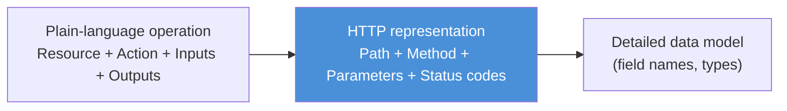

---

## 1. Designing Resource Paths

A **path** is the part of the URL that identifies *which* resource a request is targeting (e.g., `/products`, `/products/123`). Getting paths right matters because they are the primary way consumers navigate and understand an API's structure.

### 1.1 Every resource needs a unique identifying path

A single, specific resource instance must be addressable by a path that uniquely points to it and only it. This is done using a **path parameter** — a placeholder segment that gets substituted with a real identifier at request time.

```
/resources/{identifier}
```

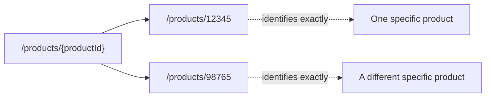

The path must also **clearly name the resource** using domain vocabulary — `/products`, not something vague like `/items` or `/data`, so that just reading the path tells a consumer what they're dealing with.

### 1.2 Parent–child relationships in paths

When one resource is meaningfully nested inside another (a hierarchical or "belongs to" relationship), the path should reflect that nesting directly:

```
/parent/child
```

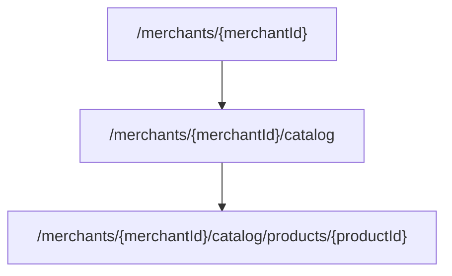

This mirrors the earlier point about **nested resources**: if a product genuinely only makes sense in the context of a specific merchant's catalog, the path should express that containment rather than flattening everything into a single top-level `/products`.

### 1.3 Collection (list) resource paths

A **collection resource** represents the container of many elements — it's addressed with a plural noun and no identifier, since it refers to "all of them" (or a filtered subset), not one specific instance:

```
/elements
```

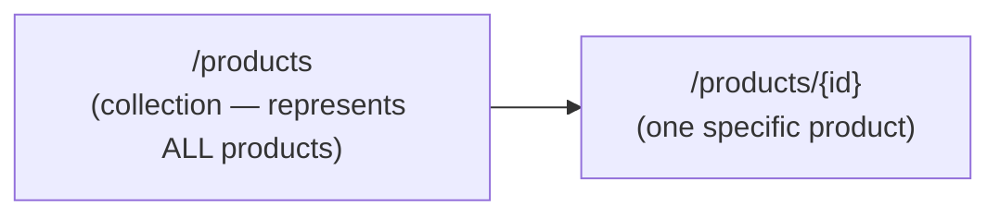

### 1.4 Children paths concatenate identifier + parent path

An individual item within a collection is addressed by appending its **unique identifier** to the collection's path:

```
/elements/{identifier}
```

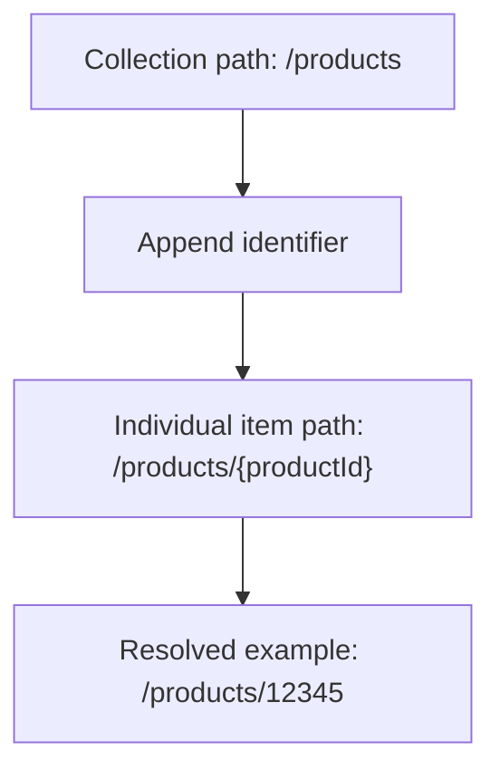

This pattern composes naturally with nesting too — a child collection under a specific parent instance looks like:

```
/parents/{parentId}/children
/parents/{parentId}/children/{childId}
```

---

## 2. Mapping the Five CRUD Operations to HTTP

Each of the five classic CRUD operation types has a standard, idiomatic HTTP mapping. Following these consistently is what makes an API predictable to any consumer already familiar with REST conventions.

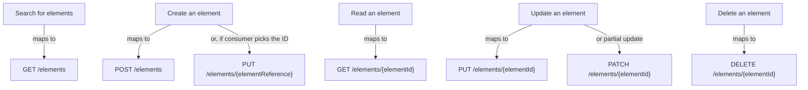

### 2.1 Search → `GET /elements`

Searching/listing targets the **collection** path. Any filters or search criteria are passed as query parameters (covered below), not in the path itself: `GET /products?category=electronics`.

### 2.2 Create → `POST /elements` or `PUT /elements/{elementReference}`

There are two valid patterns, and the right one depends on **who decides the new resource's identifier**:

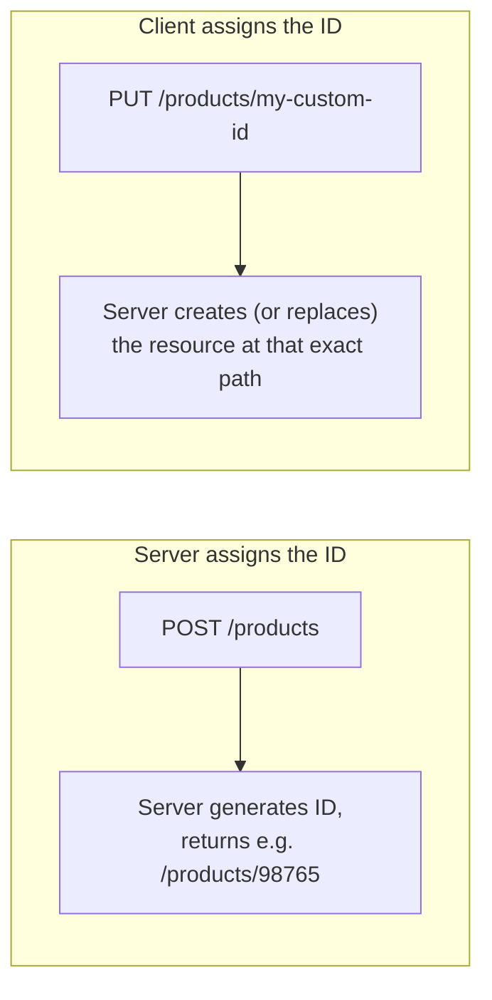

- Use **`POST /elements`** when the server is responsible for generating the new resource's identifier (typical for auto-incrementing IDs or generated UUIDs).
- Use **`PUT /elements/{elementReference}`** when the *client* supplies a meaningful identifier up front (e.g., a username, a slug, a client-chosen key) — `PUT` is idempotent, so calling it repeatedly with the same reference and data has the same end effect, which fits this "I'm telling you exactly what should exist at this address" semantic.

### 2.3 Read → `GET /elements/{elementId}`

Reading a single, specific instance targets its individual item path.

### 2.4 Update → `PUT` or `PATCH /elements/{elementId}`

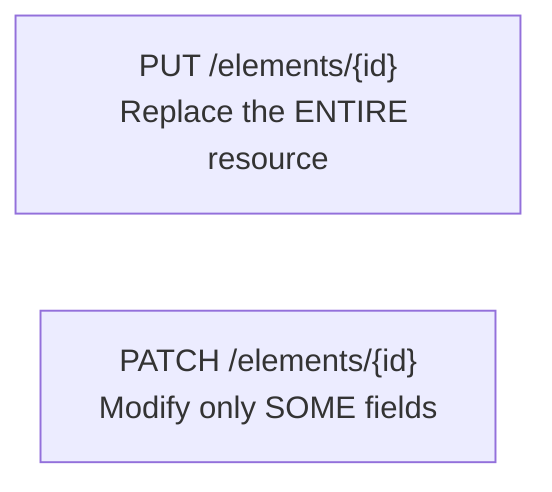

- **`PUT`** implies sending a complete replacement representation of the resource — every field, even unchanged ones.
- **`PATCH`** implies sending only the fields that are actually changing — a partial update.

Which one to use depends on whether the operation identified earlier represents a full replace or a partial modification.

### 2.5 Delete → `DELETE /elements/{elementId}`

Removes the specific targeted instance.

---

## 3. Where Input Data Goes

Every operation's inputs (identified in plain language earlier) need to be placed somewhere in the HTTP request. There are three destinations, chosen based on what kind of input it is.

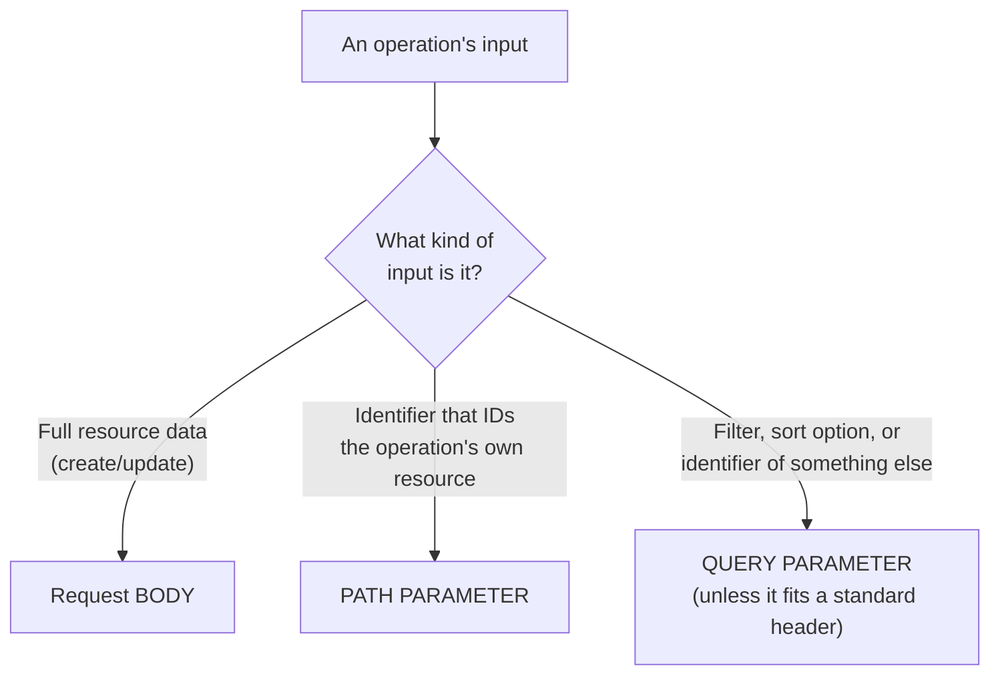

### 3.1 Request body — the resource representation

When creating or updating a resource, the actual data describing that resource (its fields and values) goes in the **request body**. This is the resource's full or partial representation — e.g., a JSON object with `name`, `price`, `category` for a product being created.

### 3.2 Path parameters — identifiers of the operation's own resource

If an input is an identifier that participates in identifying **the resource the operation itself targets**, it belongs in the path: `GET /products/{productId}` — the product ID identifies exactly which product this whole operation concerns.

### 3.3 Query parameters — modifiers, filters, and unrelated identifiers

Anything that **modifies** the request without identifying the primary target resource goes in a **query parameter**. This includes:
- Search filters: `GET /products?category=electronics&maxPrice=100`
- Sorting/pagination options: `GET /products?sort=price&page=2`
- Identifiers that reference **a different** resource than the one this operation targets (not the primary resource being read/created/updated/deleted)

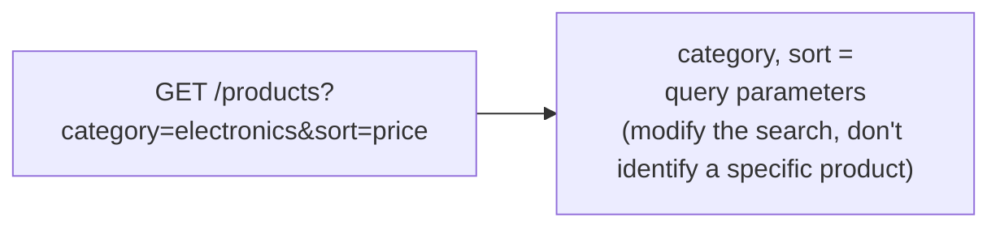

### 3.4 The standard-header exception

Before defaulting to a query parameter, check whether the input actually fits an existing **standard HTTP header** — but only headers formally defined in the **IANA HTTP header registry** should be used at this stage. Inventing custom headers or repurposing informal ones is avoided in favor of sticking to well-known, universally understood conventions (e.g., `Authorization`, `Accept-Language`, `If-Match`). This keeps the API predictable to any HTTP-aware client or tool without requiring bespoke documentation just to explain a nonstandard header.

---

## 4. HTTP Status Codes: Communicating Outcomes

Every operation's outputs (success and failure cases, identified in plain language earlier) get mapped to standard HTTP status codes, grouped by class:

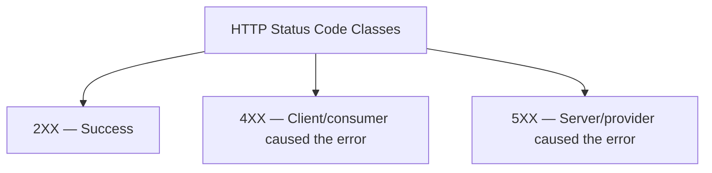

### 4.1 Success codes (2XX) — operation-specific

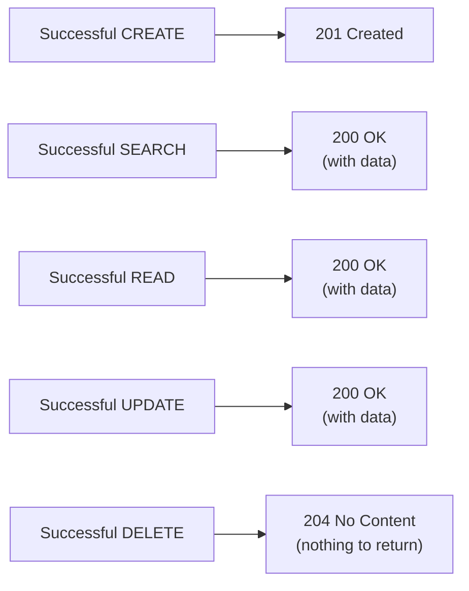

- **`201 Created`** — specifically for successful creation, since a brand-new resource now exists (often paired with a `Location` header pointing to the new resource's path).
- **`200 OK`** — used for search, read, and update whenever the response actually returns data in the body.
- **`204 No Content`** — used when the operation succeeds but there's nothing meaningful to return, which is typically the case for delete.

### 4.2 Client error codes (4XX) — required baseline cases

Two specific 4XX scenarios must always be handled where applicable:

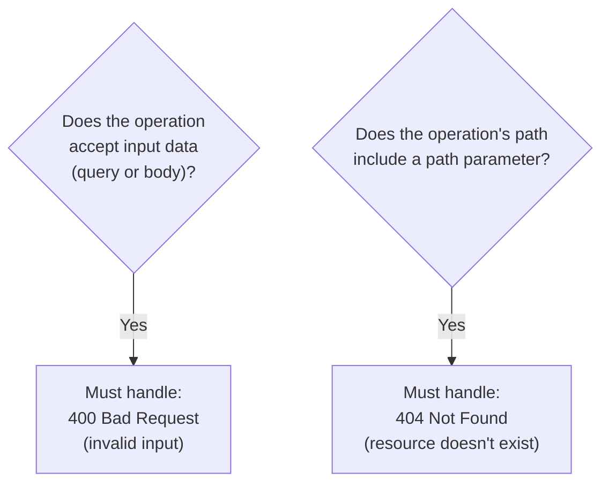

- **`400 Bad Request`** — required for any operation that accepts input data (query parameters or a body), covering cases where that input is malformed, missing required fields, or otherwise invalid.
- **`404 Not Found`** — required for any operation whose path includes a path parameter (i.e., it targets a specific resource instance), covering the case where that identifier doesn't correspond to any actual resource.

### 4.3 Server error codes (5XX) — universal baseline

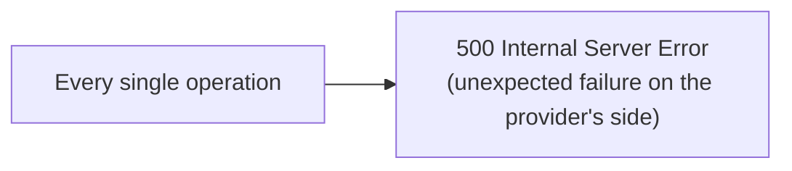

Every operation, regardless of type, must account for the possibility of an unexpected server-side failure — something going wrong in the provider's own systems that isn't the consumer's fault. `500 Internal Server Error` is the universal catch-all for this.

---

## 5. Where Output Data Goes

Just like inputs, an operation's output data needs a defined location in the HTTP response.

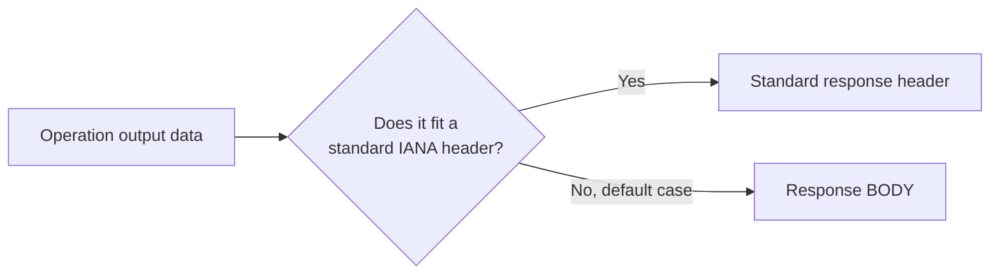

The default location is the **response body** — this is where the bulk of returned data lives (e.g., the created/read/updated resource's full representation, or search results). Only when a piece of output data genuinely matches a **standard, IANA-registered header** should it be placed there instead (for example, a `Location` header pointing to a newly created resource, or `ETag` for caching purposes).

---

## 6. Mapping Non-CRUD ("Do") Operations

Not every operation fits neatly into Create/Read/Update/Delete. Some represent an **action or process** rather than manipulating a resource directly — e.g., "send a password reset," "checkout a cart," "borrow a book." These "do" operations still need an HTTP mapping, and there are three common patterns:

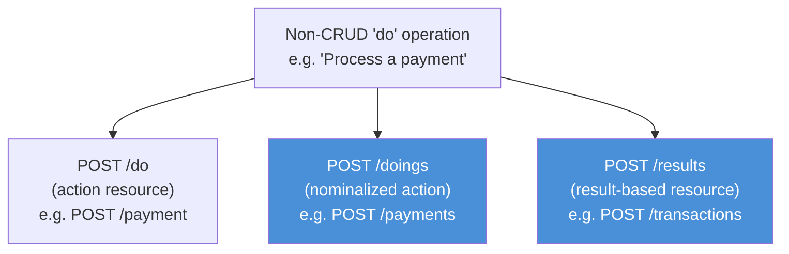

- **Action resource** (`POST /pay`, `POST /borrow`) — treats the verb itself as a pseudo-resource. This works but feels the least "RESTful," since it doesn't represent a business noun/concept.
- **Nominalized action** (`POST /payments`, `POST /borrowings`) — turns the verb into a noun representing the *event* of that action occurring, then treats each occurrence as a creatable resource instance.
- **Result-based resource** (`POST /transactions`, `POST /loans`) — frames the operation around the **resulting business object** that gets created as a consequence of the action.

The **nominalization** and **result-based** approaches are preferred over the raw "action resource" pattern, because they stay consistent with REST's resource-oriented philosophy — every operation, even a process-like one, ends up expressed as manipulating some kind of noun-based resource, keeping the API's mental model uniform rather than mixing "things" and "verbs" as first-class citizens.

---

## 7. What Makes an API Genuinely RESTful: The Architectural Constraints

Beyond individual operation mappings, a REST API is defined by adherence to a set of architectural constraints. Together, these are what deliver REST's promised qualities: **efficiency, scalability, reliability, simplicity, portability, and modifiability.**

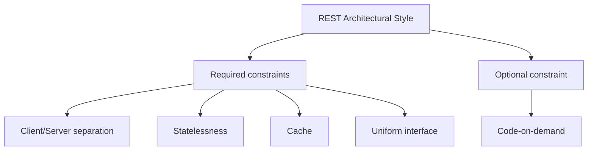

### 7.1 Client/server separation

The client (consumer) and server (provider) are independent of each other. The client doesn't need to know how the server stores or processes data internally, and the server doesn't need to know how the client renders or uses the data. This separation lets both sides evolve independently as long as the interface between them stays stable — directly supporting **modifiability** and **portability**.

### 7.2 Statelessness

Each request from a client to a server must contain **all the information needed** to understand and process it. The server does not store any client session state between requests — every request stands alone.

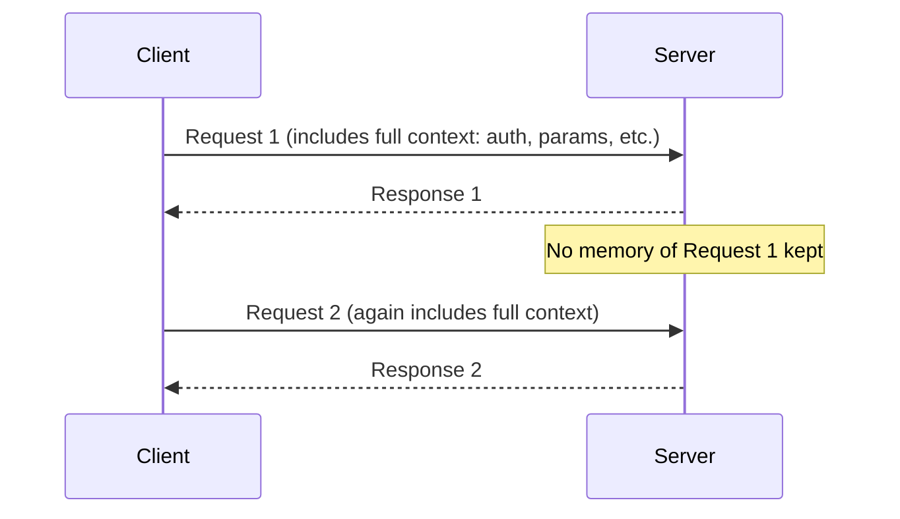

This constraint is central to **scalability and reliability**: because no server instance needs to "remember" a specific client, any server in a pool can handle any request, requests can be retried safely, and load can be distributed freely.

### 7.3 Cache

Responses must indicate, explicitly or implicitly, whether they are **cacheable**. When they are, clients (or intermediaries) can reuse a previous response instead of making a fresh request — improving **efficiency** by cutting down unnecessary network round-trips and server load.

### 7.4 Uniform interface

This is the constraint that gives REST its recognizable shape, and it's actually a bundle of four sub-principles:

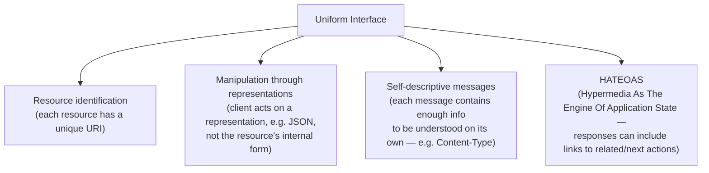

Sticking to a uniform, standardized interface is what makes REST APIs generally predictable and easy to learn once you understand the pattern — directly supporting **simplicity**.

### 7.5 Code-on-demand (optional)

The only *optional* constraint: a server can optionally extend client functionality by sending executable code (e.g., a script) that the client runs. This is used far less often than the other constraints and isn't required for an API to be considered RESTful.

---

## Bringing It All Together

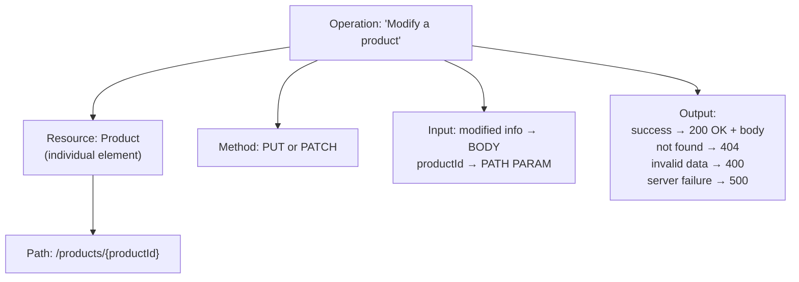

This full chain — from a plain-language capability, through resource/action identification, into a concrete HTTP mapping respecting REST's architectural constraints — is what produces an API that's not just *technically functional*, but genuinely well-designed: predictable to consumers, resilient to change, and scalable in production.
