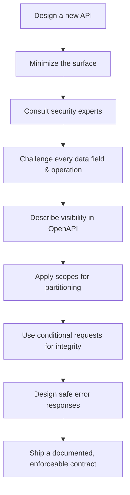
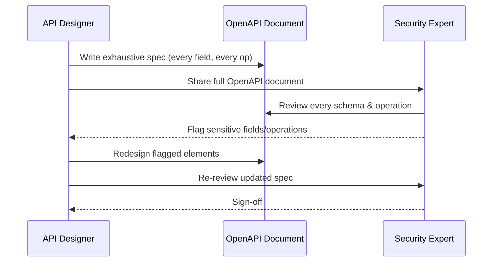
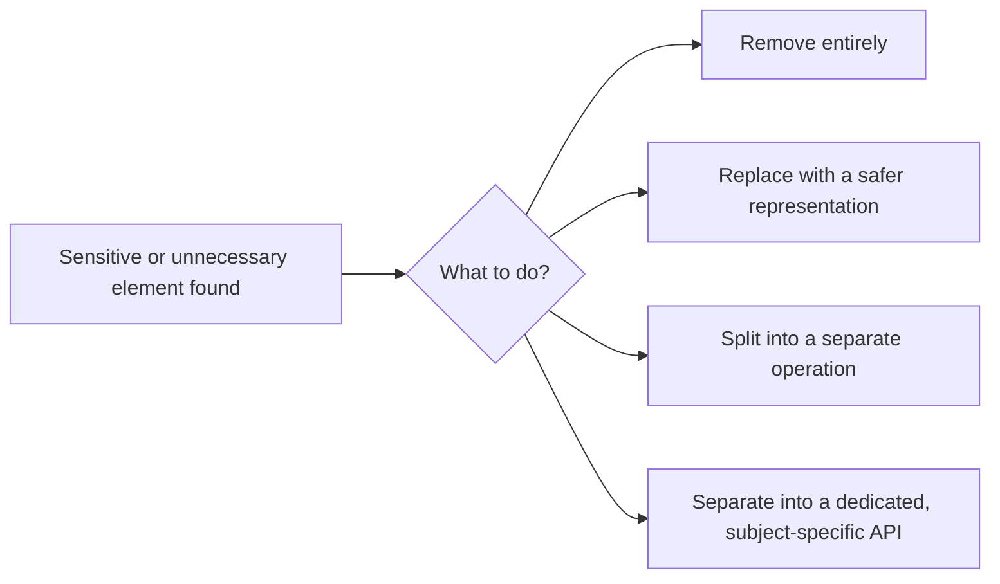
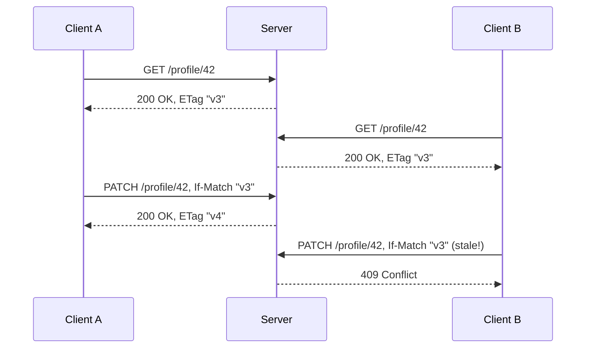
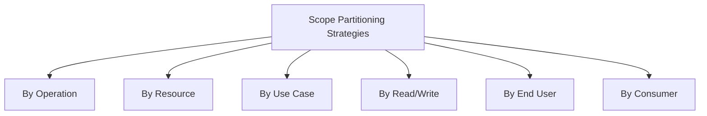
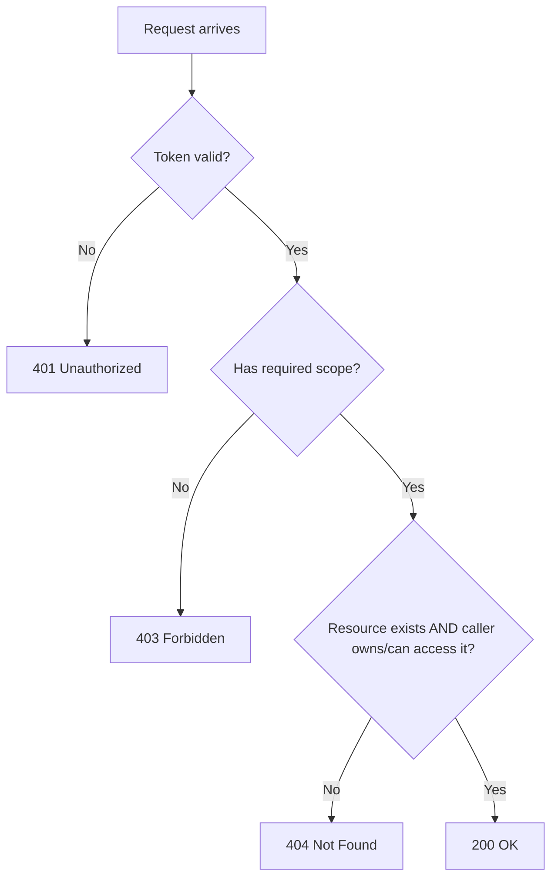

# Securing Every API: A Practical Design Checklist I Actually Use

I used to have a mental exception for "internal" APIs. If a service only talked to other services inside my own network, never touched the public internet, I let myself relax a little on the design rigor. I don't do that anymore, and I want to start this post by explaining why, before I walk through the full set of practices I now apply to *every* API I design — private or public, internal or partner-facing, tiny internal tool or customer-facing platform.

The uncomfortable truth is that "private" and "not exposed to the internet" describe a network boundary, not a security boundary. Networks get misconfigured. VPNs get compromised. A contractor's laptop with access to an internal VPN gets stolen. A misconfigured load balancer accidentally exposes an internal service to a public subnet. A compromised internal service becomes a pivot point for an attacker to reach every other "trusted" internal API sitting behind the same firewall, with none of them expecting to be attacked from the inside. I design as if every API might, eventually, face an untrusted caller — because in practice, over a long enough timeline, most of them do.

> **Note**
> This is sometimes called "zero trust" thinking, but I don't need the buzzword to justify it. It's simply an admission that network topology is not a security control I can rely on being permanent.

With that framing in place, here's the full set of practices I lean on, organized the way I actually apply them: from minimizing what exists, to bringing in the right expertise, to the concrete design mechanics (scopes, conditional requests, search patterns, error design) that make the whole thing enforceable.



## 1. Secure Every API — Including the Ones "Nobody Will See"

I've reviewed internal admin APIs that had zero authentication because "it's only reachable from the office network," and I've seen exactly how that assumption breaks: someone spins up a reverse proxy for a legitimate reason, forgets to restrict its access rules, and suddenly that internal API is one misconfigured route away from the public internet. The API's design never anticipated being seen by anyone outside the building, so it had nothing in place to stop anyone who got there anyway.

My baseline for *every* API, regardless of where it lives, includes:

| Baseline control | Why I don't skip it even internally |
|---|---|
| Authentication on every endpoint | Network boundaries change; a service should never trust "it came from inside the VPC" alone |
| Authorization (scopes/permissions) | Internal doesn't mean every internal caller should have every permission |
| Input validation | Internal callers make mistakes and get compromised too |
| Rate limiting | A buggy internal batch job can DoS a downstream service just as effectively as an external attacker |
| Structured, safe error responses | Internal stack traces still leak architecture details to whoever eventually does reach the endpoint |

> **Caution**
> "It's behind a VPN" and "it's on a private subnet" are network-layer facts, not authorization decisions. I never let infrastructure placement substitute for an actual authentication and authorization check inside the API itself.

## 2. Minimize the API Surface and Avoid Revealing the Provider's Perspective

Every field, every operation, every URL pattern I put into an API is something a consumer can call, inspect, or scrape for information. I think of API surface the way I'd think about a building's perimeter: every door and window is a place someone could try to get in, so I only put in the ones I actually need people to use.

### Minimizing Data and Operations

I covered this in depth in earlier posts, but the summary principle is: **expose derived facts, not internal representations.** If my internal system tracks a `riskScore` for fraud purposes, my API shouldn't expose `riskScore: 87` — it should expose whatever *decision* that score led to, like `"paymentStatus": "DECLINED"`, if the consumer needs to know anything about it at all.

### Avoiding the Provider's Perspective

This is a subtler point I didn't appreciate early in my career: an API's shape often accidentally reveals *how the provider is organized internally*, not just what data exists. A classic tell is an endpoint like:

```
GET /legacy-billing-service/v2/customer-invoice-records
```

This tells a consumer (and any attacker doing reconnaissance) that there's a service called "legacy-billing-service," implying there's probably a newer one, that it's on its second major version, and that the internal name for what the consumer just calls "my invoices" is "customer-invoice-records." None of that is useful to the consumer. All of it is useful to someone mapping out my internal architecture.

```
❌ Provider's internal perspective leaking through:
GET /legacy-billing-service/v2/customer-invoice-records
POST /user-mgmt-svc/internal/profile-update-queue

✅ Consumer's perspective, meaningful independent of my internals:
GET /invoices
PATCH /profile
```

I design URLs, field names, and error codes around **what the operation means to the consumer**, never around which internal team, service, or database table happens to be behind it today. This has a nice side benefit that has nothing to do with security: it means I can refactor my internals — split a service, merge two microservices, migrate databases — without ever having to break or version the public contract, because the contract was never coupled to those internals in the first place.

### Providing Everything the Implementation and Developers Need

Minimizing surface doesn't mean minimizing *documentation*. This is where I see teams overcorrect — they get nervous about security and start writing vague operation descriptions, thinking ambiguity is somehow safer. It's the opposite. If my OpenAPI document doesn't clearly specify exactly what each field means, what values are valid, and what authorization is required, implementers fill in the gaps with assumptions — and assumptions are where security bugs are born.

```yaml
paths:
  /invoices/{id}:
    get:
      summary: Retrieve a single invoice
      description: >
        Returns the invoice if, and only if, it belongs to the
        authenticated end user. Consumers must never assume an
        invoice ID from one user is safe to request on behalf of
        another — the implementation MUST verify ownership before
        returning data, and MUST return 404 (not 403) if the
        invoice exists but is not owned by the caller.
```

That description isn't vague at all — it's an explicit, unambiguous instruction to whoever implements this endpoint, baked directly into the document they're building from. I'd rather over-specify the contract than leave a security-relevant behavior as an unstated assumption.

---

## 3. Consult Security Experts — and Give Them the Whole Picture

I am not a security specialist, and I've stopped pretending my own judgment is sufficient for identifying every piece of sensitive data or every risky operation in a system I designed. What I *am* good at is producing a complete, precise, machine-readable description of the API — the OpenAPI document — and that document is exactly what I hand to security experts as the starting point for a real review.



The reason I insist on sharing the *exhaustive* document — every field, every response code, every operation, including the ones I personally think are "obviously fine" — is that sensitivity isn't always obvious to the person who built the system. A field like `accountOpenedDate` seems completely harmless to me as a designer. A fraud specialist might immediately recognize it as useful for account-age-based fraud scoring that shouldn't be exposed to arbitrary consumers. I don't get to unilaterally decide what's sensitive; my job is to make sure nothing is hidden from the people whose job it is to make that call.

> **Note**
> "Exhaustive" is the operative word. A partial document, or one that only includes the endpoints I personally think are risky, defeats the purpose. The whole value of an OpenAPI-driven security review is that it's systematic — every field gets looked at, not just the ones that happened to catch my attention.

### What I Ask Experts to Help Me Identify

| Category | Example question I bring to the review |
|---|---|
| Sensitive data | Does this field, alone or combined with others, enable identity theft, fraud, or competitive harm? |
| Sensitive operations | Could this operation be abused for account takeover, financial harm, or data exfiltration at scale? |
| Regulatory scope | Does this field fall under PCI, GDPR, HIPAA, or other regimes I need to design around? |
| Aggregation risk | Individually harmless fields that become sensitive in combination (e.g., ZIP code + birth date + gender can re-identify people) |

---

## 4. Challenge Every Data Element and Operation

Once I have expert input, I go back through the document field by field, operation by operation, and challenge each one with the same blunt question: **does this actually need to be here, in this form, in this operation?** For each element, I have four possible outcomes.



### Remove

The simplest fix: the field or operation provides no value to any legitimate consumer, so it comes out of the public contract entirely. Internal audit fields, debug flags, and legacy fields nobody actually reads by the API's consumers are the most common candidates.

### Replace

Sometimes the *underlying fact* is needed, but the *specific representation* is too sensitive. I replace a precise value with a coarser, safer one:

```
❌ "dateOfBirth": "1988-03-14"
✅ "ageRange": "35-44"

❌ "exactLocation": { "lat": 40.7484, "lng": -73.9857 }
✅ "city": "New York, NY"

❌ "creditScore": 712
✅ "creditTier": "GOOD"
```

### Split

Sometimes one operation is doing two jobs at once, one sensitive and one not, and the fix is to give them separate endpoints with separate authorization requirements rather than one endpoint gated by the strictest possible permission.

```
❌ One combined endpoint, forcing every caller through the strictest gate:
GET /customers/{id}   → returns profile AND payment methods AND risk score

✅ Split by sensitivity:
GET /customers/{id}/profile          (low sensitivity, broad access)
GET /customers/{id}/payment-methods  (higher sensitivity, narrower scope)
GET /customers/{id}/risk-profile     (internal only, separate scope entirely)
```

### Separate Into a Dedicated API

For a whole subject area that's consistently more sensitive than the rest of the domain — say, everything related to fraud and risk scoring — I don't just split the operations, I move them into an entirely separate API with its own base path, its own security scheme, its own audience, and often its own review cadence and access-request process.

```
/customer-api/v1/...        ← general customer-facing operations
/risk-api/v1/...            ← separate API, separate scopes, separate audience
```

| Decision | When I reach for it |
|---|---|
| Remove | The field/operation serves no legitimate consumer need at all |
| Replace | The fact is needed, but the precise/raw form isn't |
| Split | One endpoint mixes sensitivity levels that different consumers need independently |
| Separate API | An entire subject area (fraud, risk, admin) warrants its own audience and governance, not just its own endpoint |

---

## 5. Describe Visibility in the OpenAPI Document and Limit Returned Data

Once I know what's staying, I make the *visibility rules* for that data an explicit, written part of the contract — not something implementers have to infer from a Slack conversation that happened six months ago and that nobody can find anymore.

```yaml
paths:
  /orders/{id}:
    get:
      summary: Retrieve an order
      description: >
        Returns order details for the authenticated end user only.
        The `internalNotes` field visible in the database is NEVER
        included in this response under any scope or role — it does
        not exist in the response schema and must not be added
        without a new security review.
      responses:
        '200':
          content:
            application/json:
              schema:
                $ref: '#/components/schemas/OrderResponse'
```

```yaml
components:
  schemas:
    OrderResponse:
      type: object
      additionalProperties: false
      properties:
        id: { type: string }
        status: { type: string, enum: [PENDING, SHIPPED, DELIVERED, CANCELLED] }
        total: { type: number }
      required: [id, status, total]
```

`additionalProperties: false` is the enforcement mechanism behind the description. Even if an implementer's serializer accidentally includes an extra field, schema validation at the gateway or in contract tests will catch it before it reaches a real consumer. I treat the written description and the strict schema as two halves of the same control — one tells a human what's intended, the other stops a machine from silently drifting away from that intent.

### The UnexpectedError Schema

The same discipline applies to error responses, and this is worth calling out specifically because `500` errors are exactly where implementation details tend to leak by accident — stack traces, database engine names, internal file paths, ORM query fragments.

```yaml
components:
  schemas:
    UnexpectedError:
      type: object
      additionalProperties: false
      description: >
        Describes precisely what is returned on a 500 Internal Server
        Error. No implementation details, stack traces, or internal
        identifiers are ever included, regardless of the underlying
        cause.
      properties:
        code:
          type: string
          enum: [INTERNAL_ERROR]
        message:
          type: string
          example: "An unexpected error occurred. Please try again or contact support."
        requestId:
          type: string
          description: Correlation ID for support and internal debugging.
      required: [code, message, requestId]
```

I tested this by deliberately triggering three different underlying failures against a small Express service — a null pointer in a handler, a database connection timeout, and an unhandled promise rejection — all routed through one centralized error handler:

```javascript
app.use((err, req, res, next) => {
  const requestId = crypto.randomUUID();
  logger.error({ requestId, error: err.stack, path: req.path }); // full detail, INTERNAL log only

  res.status(500).json({
    code: 'INTERNAL_ERROR',
    message: 'An unexpected error occurred. Please try again or contact support.',
    requestId
  }); // identical shape, EVERY time, regardless of the real cause
});
```

All three of those very different underlying failures produced the exact same external response shape, differing only in the `requestId` — while my internal logs captured the full stack trace, the specific error message, and the request path for each. That's precisely the outcome I want: whoever's on the outside of that 500 learns nothing about *why* it happened, while I retain everything I need internally to actually fix it.

> **Caution**
> A generic-looking 500 handler is only as good as its coverage. If even one route in my application has its own try/catch that responds with `res.status(500).json({ error: err.message })` before ever reaching this centralized handler, that route just punched a hole straight through this control. I audit for stray error handlers specifically, not just trust that "we have a global handler" covers everything.

---

## 6. Move Sensitive Search Parameters Out of the URL: `POST /resources/search`

URLs end up in a surprising number of places I don't fully control: browser history, proxy access logs, server logs, `Referer` headers sent to third-party resources, and shared/bookmarked links. Anything I put in a query string is, for practical purposes, not private, even over HTTPS — TLS protects the URL in transit, but it does nothing to stop it from being written to a log file at either end.

```
❌ Sensitive search terms sitting in a URL, and therefore in every log along the way:
GET /customers/search?ssn=078-05-1120&lastName=Smith

✅ Same search, parameters moved into the request body:
POST /customers/search
{ "ssn": "078-05-1120", "lastName": "Smith" }
```

I tested this distinction directly by running both request styles through an Nginx access log configuration with default logging:

```
# GET version — the SSN is right there in the access log
203.0.113.7 - - [22/Aug/2026:10:03:11] "GET /customers/search?ssn=078-05-1120&lastName=Smith HTTP/1.1" 200

# POST version — only the path appears; the body never reaches this log line
203.0.113.7 - - [22/Aug/2026:10:04:52] "POST /customers/search HTTP/1.1" 200
```

The `GET` version put the SSN directly into a plaintext log file that, depending on retention policy and access controls, might be read by far more people (ops engineers, log aggregation platforms, third-party monitoring tools) than the number of people ever intended to see that SSN. The `POST` version keeps the sensitive value inside the request body, which standard access logging never captures by default.

I still return non-sensitive, interoperable resource identifiers from this pattern — the *search criteria* is sensitive, but the *result* (a list of customer IDs, say) is exactly what a consumer needs to then make follow-up calls using safe, opaque identifiers:

```json
POST /customers/search
{ "ssn": "078-05-1120" }

→ 200 OK
{
  "results": [
    { "customerId": "cust_44210", "displayName": "J. Smith" }
  ]
}
```

> **Note**
> This pattern is also just good design independent of security — complex search bodies with nested filters, arrays, and ranges are awkward to express as query strings and completely natural as JSON bodies. Security and usability point the same direction here.

---

## 7. Use Conditional Requests to Prevent Lost Updates

I introduced this pattern in earlier posts, but it belongs on this checklist explicitly because it's a data-integrity control that's easy to forget when I'm focused on authentication and authorization. Without it, two legitimate, fully-authorized clients can silently overwrite each other's work.



```javascript
app.patch('/profile/:id', async (req, res) => {
  const ifMatch = req.headers['if-match'];
  const current = await db.profiles.findById(req.params.id);

  if (ifMatch !== current.etag) {
    return res.status(409).json({ code: 'STALE_VERSION', currentEtag: current.etag });
  }

  const updated = await db.profiles.update(req.params.id, req.body);
  res.set('ETag', updated.etag);
  res.json(updated);
});
```

I tested this exact race scenario by firing two `PATCH` requests concurrently, both carrying the same, now-stale `If-Match: "v3"` header, after a third request had already advanced the resource to `"v4"`. The first of the two concurrent requests succeeded and moved the resource to `"v5"`; the second correctly failed with `409 Conflict` instead of silently overwriting the first client's change. Without the `If-Match` check, both requests would have succeeded, and whichever one committed last would have won — with the first client never even knowing their update had been discarded.

---

## 8. Discuss Encryption and Signing With Security Experts

I've covered HMAC signing for webhooks and TLS for transport in earlier posts, but I want to be direct about where my own expertise ends: deciding *which* cryptographic approach fits a given piece of data — field-level encryption, envelope encryption, tokenization, format-preserving encryption — is not a decision I make alone. What I *do* own is making sure the design accommodates whatever approach the experts choose, and that the choice is documented where implementers can find it.

```yaml
components:
  schemas:
    PaymentMethod:
      type: object
      properties:
        id: { type: string }
        last4: { type: string }
        token:
          type: string
          description: >
            Opaque payment token issued by the PCI-compliant vault.
            Never the raw card number. Encryption/tokenization scheme
            defined and reviewed by the security team — see internal
            doc SEC-2024-017 for the current standard.
```

I make sure the *contract* reflects the outcome of that conversation (an opaque token instead of a raw value) and I document, right in the schema description, where the authoritative decision record lives — so a new implementer six months from now doesn't have to guess why the field looks the way it does.

---

## 9. Design User-Friendly Scopes

A scope system that's technically correct but confusing to use invites mistakes — a developer under deadline pressure who doesn't understand the difference between two similarly-named scopes will often just request the broader one "to be safe," which defeats the entire purpose of least privilege.

```
❌ Confusing, overlapping scopes:
  data:read
  data:read:extended
  data:read:all
  data:full-access

✅ Clear, purpose-named scopes:
  orders:read
  orders:write
  orders:read:payment-details   (explicitly narrower, name says why)
```

| Scope naming principle | Why it helps |
|---|---|
| Name the *resource*, not the implementation | `orders:read`, not `db-orders-table:read` |
| Make hierarchy explicit in the name | `orders:read:payment-details` clearly reads as "more than just orders:read" |
| Avoid near-duplicate scopes | Reduces "which one do I actually need?" guesswork that leads to over-requesting |
| Document each scope's exact effect | A one-line description isn't optional — it's the thing a developer actually reads while integrating |

---

## 10. Partition Access With Scopes: Six Approaches

I mix and match several partitioning strategies depending on the shape of the domain, rather than forcing everything into one dimension.



| Approach | Example scope | When I reach for it |
|---|---|---|
| Operation | `orders:cancel` | A single, specific action needs its own tightly controlled permission |
| Resource | `invoices:read`, `payments:read` | Different resource types naturally warrant different access levels |
| Use case | `mobile-app:checkout` | A specific integration/workflow needs a bundle of related permissions |
| Read/write | `orders:read` vs `orders:write` | Nearly every resource benefits from this base split |
| End user | Scopes tied to the authenticated user's own consent | Open banking-style delegated access, where the human explicitly grants access |
| Consumer | Scopes tied to which registered app/partner is calling | Different partner integrations get different baseline access regardless of end user |

I usually layer at least two of these — read/write as the base split, crossed with resource-level partitioning, and end-user consent as an additional filter on top for anything acting on behalf of a human.

---

## 11. Use Scopes to Tweak Operation Behavior

Scopes don't just gate whether an operation can be called at all — I also use them to change *what an operation returns*, without needing a separate endpoint for every variation.

```javascript
app.get('/customers/:id', authenticate, async (req, res) => {
  const customer = await db.customers.findById(req.params.id);
  const response = {
    id: customer.id,
    name: customer.name,
    email: customer.email
  };

  if (req.auth.scopes.includes('customers:read:sensitive')) {
    response.dateOfBirth = customer.dateOfBirth;
    response.taxId = customer.taxId;
  }

  res.json(response);
});
```

I tested this with two tokens against the same customer record: one with only `customers:read`, and one that additionally carried `customers:read:sensitive`. The first token's response included just name and email; the second included the same fields plus date of birth and tax ID — same endpoint, same resource, genuinely different response shape driven entirely by scope. This keeps my API surface smaller (one endpoint instead of two near-duplicates) while still enforcing the same least-privilege principle at the field level.

---

## 12. Define and Apply Scopes in OpenAPI

None of the scope design work matters if it isn't captured in the contract that implementers and gateways actually enforce against.

```yaml
components:
  securitySchemes:
    OAuth2:
      type: oauth2
      flows:
        authorizationCode:
          authorizationUrl: https://auth.example.com/authorize
          tokenUrl: https://auth.example.com/token
          scopes:
            orders:read: Read order details
            orders:write: Create or modify orders
            orders:cancel: Cancel an existing order
            customers:read: Read basic customer info
            customers:read:sensitive: Read sensitive customer fields (DOB, tax ID)

paths:
  /orders/{id}/cancel:
    post:
      security:
        - OAuth2: [orders:cancel]
  /customers/{id}:
    get:
      security:
        - OAuth2: [customers:read]
      description: >
        Include the `customers:read:sensitive` scope to also
        receive `dateOfBirth` and `taxId` in the response.
```

Declaring `security` per-operation, rather than once globally, is the part I see skipped most often — and it's exactly what lets a contract-testing tool flag an endpoint that's missing a scope requirement entirely, before it ships without one.

---

## 13. Choose Status Codes Deliberately: 401, 403, 404

I've mentioned this pattern in earlier posts, but it deserves to be stated as its own rule, because I still see it done inconsistently more often than almost anything else on this list.



| Status | Meaning | Is it fixable by the caller? |
|---|---|---|
| `401 Unauthorized` | The token itself is missing, invalid, or expired | Yes — get a new/valid token |
| `403 Forbidden` | The token is valid, but lacks the scope/permission for this operation | Yes — request the correct scope, or have an admin grant the right role |
| `404 Not Found` | The resource doesn't exist, *or* it exists but isn't accessible to this caller | No — there's nothing the caller can "fix"; the resource simply isn't theirs to see |

I tested all three against the same endpoint deliberately, using three requests: no token at all, a valid token missing the required scope, and a valid, correctly-scoped token requesting a resource owned by someone else. They returned `401`, `403`, and `404` respectively, exactly as this table predicts — and I use `404` specifically (rather than `403`) for that last case because I don't want to confirm to a caller that a resource they can't access even exists in the first place. That's a deliberate, security-motivated exception to the general principle of always giving callers precise, actionable feedback: precision here would leak information a stranger has no legitimate reason to learn.

> **Note**
> This is the one place on this whole list where I intentionally sacrifice a little bit of debuggability for security. A legitimate developer who genuinely hit a `404` because of a typo in an ID and a legitimate developer who got a `404` because they don't own the resource see the identical response — and I've decided that trade-off is worth it.

---

## Closing Thoughts

Looking back over this whole checklist, what strikes me is how few of these controls are exotic or expensive to implement. Moving search parameters into a request body, adding an `If-Match` header check, writing an honest one-paragraph description in an OpenAPI document, choosing `404` instead of `403` — none of this requires new infrastructure or a large security budget. What it requires is treating every field, every operation, and every response as a decision I'm making on purpose, rather than a side effect of however my database happens to be structured or however my framework happens to serialize errors by default.

The one habit that ties this entire list together, for me, is refusing to let "nobody will see this" stand in for "this is safe." Whether that's an internal-only service, a query parameter I assumed nobody logs, or a 500 handler I assumed would never actually fire in production — the moment I catch myself thinking a control doesn't matter because of who I expect to be looking, that's exactly the assumption this whole discipline exists to remove.
