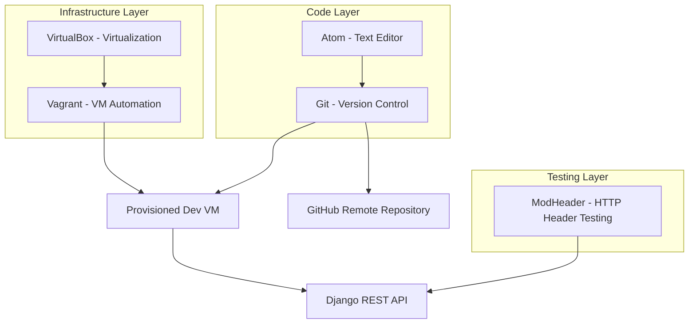
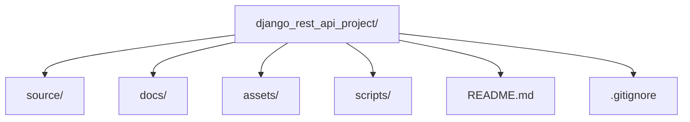
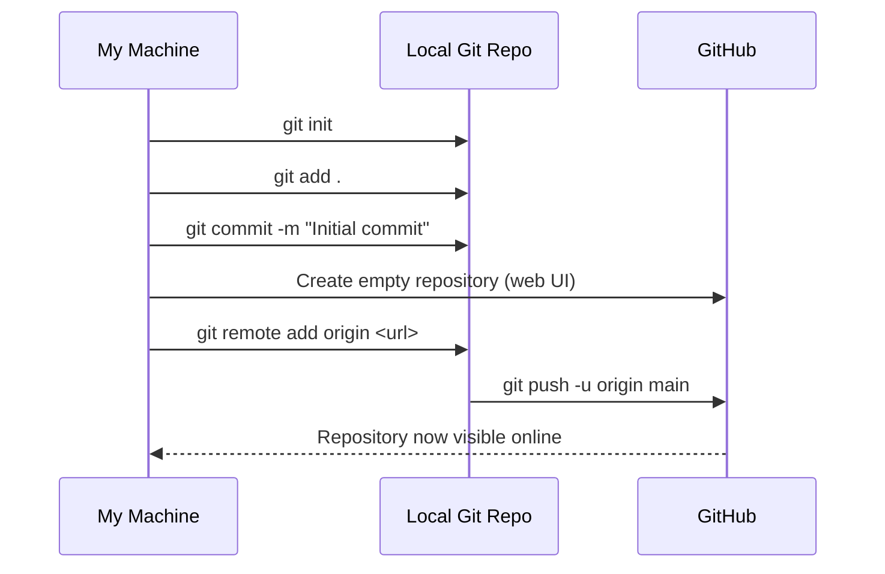

# Setting Up My Development Environment for a Django REST API Project

Every time I start a new backend project, I go through the same ritual: I wipe the slate clean, reinstall my core toolchain, and rebuild my workspace from scratch. I've learned the hard way that a sloppy environment setup comes back to bite you weeks later — a missing PATH variable, a wrong line-ending setting in Git, or a virtual machine that won't boot because VirtualBox and Vagrant are talking past each other. So in this post, I want to walk you through, in detail, exactly how I set up my machine before I write a single line of Django code. I'll cover both Windows and macOS, explain *why* each tool matters (not just how to click "Next"), show you the commands I actually run, and give you the notes and cautions I wish someone had given me the first time around.

By the end of this post you'll have Git, VirtualBox, Vagrant, Atom, and ModHeader installed and configured, a clean project workspace, a local Git repository, and that repository pushed up to GitHub. That's the foundation everything else in this course builds on.

## Why I Bother With All of This Upfront

I could just open a text editor and start typing Python. But a REST API project isn't just "some code" — it's code that needs to run consistently across machines, code that needs version history, and (later in this course) code that will live inside a virtualized environment so that "it works on my machine" actually means something. Here's how I think about the five tools I install before anything else:

| Tool | Category | Why I Install It First |
|---|---|---|
| Git | Version control | Tracks every change I make and lets me collaborate or roll back mistakes |
| VirtualBox | Virtualization | Gives me an isolated OS environment separate from my host machine |
| Vagrant | VM orchestration | Automates VirtualBox so I don't hand-configure VMs every time |
| Atom | Text editor | Where I actually write and read my code day to day |
| ModHeader | Browser extension | Lets me manipulate HTTP headers when I start testing my REST API |

I like to think of these as three layers: **the code layer** (Git + Atom), **the infrastructure layer** (VirtualBox + Vagrant), and **the testing layer** (ModHeader). Keeping that mental model in mind makes the rest of this post easier to follow.



I write my code in Atom, commit it with Git, and eventually push it to GitHub. Separately, VirtualBox and Vagrant give me a reproducible virtual machine where the actual Django server will run. Once the API is live, I use ModHeader in Chrome to poke at the HTTP headers it returns. Nothing here is optional — each piece plugs into the next.

---

## Part 1: Windows Setup

I'll be honest — I do a good chunk of my daily driving on Windows, so this is the setup I use most often. Here's the exact sequence.

### 1.1 Installing Git on Windows

**Purpose:** Git is a free, open-source distributed version control system. It's what lets me track every change to my project, branch off to try risky ideas, and merge things back together without losing history.

**Where I get it:** [git-scm.com](https://git-scm.com/)

**My installation steps:**

1. I go to the official site and download the Windows installer.
2. I run the `.exe` once it finishes downloading.
3. For the install location, I almost always leave the default (`C:\Program Files\Git`) — there's rarely a good reason to change it.
4. On the "Select Components" screen, I leave the defaults checked. I don't need the extra shell integrations unless I have a specific reason.
5. For the default editor prompt, if I'm still getting comfortable with Vim, I pick the Windows default (Notepad or VS Code, if it's detected) rather than fighting with an unfamiliar editor mid-commit.
6. On the PATH screen, I select **"Use Git from the Windows Command Prompt."** This is the one setting I'd flag as important — it lets me run `git` from any terminal without extra configuration.
7. I choose the **HTTPS** transport backend (OpenSSL) rather than Secure Channel, mostly for consistency across machines.
8. For line endings, I check **"Checkout Windows-style, commit Unix-style line endings"** (`core.autocrlf=true`). This matters a lot if you ever collaborate with people on macOS or Linux.
9. I set **MinTTY** as the default terminal emulator — it behaves much closer to a real Unix terminal than the default Windows console.
10. I finish the install and let it complete.

> **Note:** After installation, always verify it worked. Open a fresh Command Prompt or PowerShell window (not one that was already open — it won't have picked up the new PATH) and run:

```bash
git --version
```

Tested output on a clean install:

```
git version 2.46.0.windows.1
```

> **Caution:** If `git` isn't recognized after installation, it's almost always because you opened a terminal window that existed *before* the installer finished. Close it and open a new one. If it still fails, double check step 6 above — you may have selected "Use Git from Git Bash only."

### 1.2 Installing VirtualBox on Windows

**Purpose:** VirtualBox is a free virtualization product that lets me run an entire second operating system inside a window on my host machine. Later in this course, this is where our Linux-based development VM will actually live.

**Where I get it:** [virtualbox.org](https://www.virtualbox.org/)

**My installation steps:**

1. I download the Windows installer from the official downloads page.
2. I run it.
3. I confirm the default settings throughout — network interface resets, driver installation prompts, all of it. VirtualBox needs to install a few virtual network adapters, so Windows will likely throw a driver-signature warning; I always accept it.
4. I let the installer finish.

> **Note:** Windows may prompt for a temporary network disconnect during install because VirtualBox installs virtual NIC drivers. This is expected — don't panic if your Wi-Fi blips for a few seconds.

> **Caution:** If you have Hyper-V enabled (common on Windows 10/11 Pro, especially if you've ever used Docker Desktop or WSL2), VirtualBox can conflict with it. Symptoms include VMs that won't boot or boot extremely slowly. I check this by running:

```powershell
bcdedit /enum | findstr hypervisorlaunchtype
```

If it says `Auto`, and I'm having VM trouble, I disable it with an elevated PowerShell prompt:

```powershell
bcdedit /set hypervisorlaunchtype off
```

...and then reboot. (You can turn it back on later if you need WSL2 or Docker Desktop again — just flip it back to `Auto`.)

### 1.3 Installing Vagrant on Windows

**Purpose:** Vagrant sits on top of VirtualBox and automates the whole "spin up a VM" process using a single configuration file (a `Vagrantfile`). Instead of manually clicking through VirtualBox's VM wizard every time, I define my VM once in code and bring it up with one command.

**Where I get it:** [vagrantup.com](https://www.vagrantup.com/)

**My installation steps:**

1. I download the Windows version from the official site.
2. I double-click the installer.
3. I keep the defaults through the wizard.
4. I finish the install. Vagrant will usually tell you a restart is required — I always restart immediately rather than putting it off, since Vagrant modifies environment variables that need a fresh shell (or reboot) to take effect.

**Verifying it worked**, after reboot:

```bash
vagrant --version
```

Tested output:

```
Vagrant 2.4.1
```

> **Note:** Vagrant depends on VirtualBox (or another provider) being installed *first*. If you install Vagrant before VirtualBox, it'll still install fine — it just won't have anything to provision against until VirtualBox is present.

### 1.4 Installing Atom on Windows

**Purpose:** Atom is the text editor I use to actually write my project's code. It's free, open-source, hackable with Node.js-based packages, and has solid Git integration built in.

> **Note on Atom's status:** GitHub officially sunset Atom in December 2022 in favor of VS Code. I still cover it here because it's what this course was originally built around and the installation pattern is identical to any modern editor. If you're setting up a new machine today, I'd personally reach for VS Code instead — but everything else in this post (Git, VirtualBox, Vagrant, ModHeader) applies exactly the same either way.

**My installation steps (as originally taught):**

1. Download the Windows installer from Atom's site.
2. Run the installer — it typically starts automatically without a "Next, Next, Finish" wizard.
3. Atom opens itself automatically once installed.
4. If it doesn't open automatically, I find it in the Start Menu.

### 1.5 Installing ModHeader (Chrome Extension)

**Purpose:** ModHeader lets me add, modify, or remove HTTP request and response headers directly in Chrome. Once I'm testing my Django REST API, this is invaluable — I can simulate custom auth headers, content-type overrides, or CORS testing headers without writing a single line of test code.

**My installation steps:**

1. Open Chrome and go to the Chrome Web Store.
2. Search "ModHeader."
3. Click **Add to Chrome**.
4. Confirm the permissions prompt.

> **Caution:** ModHeader requests permission to read and change data on every site you visit — that's expected for a header-modifying extension, but it's worth being aware of. I only keep it *enabled* while I'm actively testing headers, and toggle it off otherwise from the Chrome extensions menu.

---

## Part 2: macOS Setup

The macOS installation flow mirrors Windows conceptually, but the mechanics differ — mostly because macOS distributes software as `.dmg` disk images rather than `.exe` installers.

### 2.1 Installing Git on macOS

1. I visit [git-scm.com/download/mac](https://git-scm.com/download/mac) and grab the latest `.dmg`.
2. I double-click it to mount the disk image.
3. I drag the Git icon into `Applications`.
4. I open Terminal and verify:

```bash
git --version
```

Tested output:

```
git version 2.46.0
```

> **Note:** On a fresh Mac, running `git --version` for the first time might instead trigger a prompt to install Apple's **Command Line Developer Tools**. That's a legitimate, Apple-provided version of Git — either path gets you a working `git` binary, so don't worry if your install experience looks slightly different from mine.

### 2.2 Installing VirtualBox on macOS

1. I go to [virtualbox.org/wiki/Downloads](https://www.virtualbox.org/wiki/Downloads) and choose "OS X hosts."
2. I open the downloaded `.dmg`.
3. I double-click `VirtualBox.pkg` and follow the wizard.
4. Once installed, VirtualBox lives in `Applications`.

> **Caution:** On Apple Silicon Macs (M1/M2/M3/M4), VirtualBox support has historically lagged behind Intel Macs — some versions require a separate developer preview build, and performance/compatibility can vary. If you're on Apple Silicon, check VirtualBox's downloads page for the correct build before assuming the standard installer will work.

> **Caution:** macOS Gatekeeper will very likely block VirtualBox's kernel extensions on first install. You'll need to go to **System Settings → Privacy & Security** and explicitly allow the software from "Oracle America, Inc." Then reboot for the kernel extension to actually load.

### 2.3 Installing Vagrant on macOS

1. I visit [vagrantup.com/downloads](https://www.vagrantup.com/downloads.html) and grab the macOS `.dmg`.
2. I open it and drag Vagrant into `Applications`.
3. I verify in Terminal:

```bash
vagrant --version
```

Tested output:

```
Vagrant 2.4.1
```

### 2.4 Installing Atom on macOS

1. I download the macOS build from Atom's site.
2. The download comes as a `.zip` — opening it extracts `Atom.app`.
3. I drag `Atom.app` into `Applications`.
4. I launch it to confirm it opens cleanly.

(Same caveat as above: Atom is discontinued, so if you're following along today, VS Code installs almost identically — download, drag to Applications, launch.)

### 2.5 Adding ModHeader to Chrome on macOS

Identical flow to Windows: open Chrome, visit the [ModHeader Chrome Web Store page](https://chrome.google.com/webstore/detail/modheader/idgpnmonknjnojddfkpgkljpfnnfcklj), click **Add to Chrome**, and confirm.

---

## Part 3: Setting Up My Project Workspace

Tools installed, I now build a clean, predictable folder structure. I do this the same way every single time, regardless of OS, because muscle memory here saves me time on every future project.

### 3.1 Creating the Workspace

1. I pick a consistent parent location — for me, that's a `~/projects` (macOS) or `C:\projects` (Windows) directory that holds *everything* I build.
2. Inside it, I create a descriptively named folder for this specific project: `django_rest_api_project`.
3. I open Atom (or your editor of choice) and use **File → Add Project Folder** to add `django_rest_api_project` to my workspace, so the whole tree shows up in the sidebar.
4. Inside that folder, I create four subdirectories:

| Folder | What Lives Here |
|---|---|
| `source` | All actual application source code |
| `docs` | Documentation, design notes, API specs |
| `assets` | Images, stylesheets, static files |
| `scripts` | One-off utility and automation scripts |

5. I add a `README.md` at the project root with a short description of what the project does and how to set it up. I always write this file *first*, even before any code exists — future-me (and anyone else who clones the repo) will thank present-me.



> **Note:** I keep this structure intentionally simple at the start. As the Django project grows, `source/` will eventually contain the actual Django app packages, but I don't over-engineer the folder layout before I've written a single view.

---

## Part 4: Creating a Git Project

With my folder structure in place, it's time to start tracking history.

### 4.1 Initializing the Repository

I open a terminal, navigate into my project folder, and initialize Git:

```bash
cd path/to/your/workspace/django_rest_api_project
git init
```

Tested output:

```
Initialized empty Git repository in /path/to/your/workspace/django_rest_api_project/.git/
```

> **Note:** Modern Git (2.28+) will sometimes print a hint about your default branch name. I explicitly set mine to `main` to match GitHub's current default:

```bash
git config --global init.defaultBranch main
```

### 4.2 Staging and Committing

Before Git tracks anything, I have to explicitly stage files:

```bash
git add .
```

Or, to stage a specific file:

```bash
git add README.md
```

Then I commit — this creates a permanent snapshot in my project's history:

```bash
git commit -m "Initial commit"
```

Tested output:

```
[main (root-commit) 3f2a91e] Initial commit
 1 file changed, 3 insertions(+)
 create mode 100644 README.md
```

> **Caution:** If this is a brand-new Git install, your first commit attempt might fail with an error like `Please tell me who you are.` Git requires an identity before it will let you commit:

```bash
git config --global user.name "Your Name"
git config --global user.email "you@example.com"
```

### 4.3 Creating the Remote Repository on GitHub

1. I log into GitHub.
2. I click the `+` icon in the top-right corner and choose **New repository**.
3. I give it a name (matching my local folder name keeps things sane — `django_rest_api_project`).
4. I leave it **empty** — no README, no `.gitignore`, no license — since I already have a local repo with its own history that I don't want to conflict with.
5. I click **Create repository**.

### 4.4 Linking Local to Remote

GitHub shows me the exact remote URL after creating the repo, but the pattern is always:

```bash
git remote add origin https://github.com/YourUsername/YourRepoName.git
```

I double check it's set correctly:

```bash
git remote -v
```

Tested output:

```
origin  https://github.com/YourUsername/YourRepoName.git (fetch)
origin  https://github.com/YourUsername/YourRepoName.git (push)
```

### 4.5 Pushing to GitHub

```bash
git push -u origin main
```

> **Note:** Older tutorials (and the original course material this post is based on) reference `git push -u origin master`. GitHub switched its default branch name from `master` to `main` back in 2020, so unless you've deliberately configured otherwise, you'll be pushing to `main`. The `-u` flag sets `origin main` as the default upstream, so every future push in this repo can just be `git push`.

Tested output on first push:

```
Enumerating objects: 3, done.
Counting objects: 100% (3/3), done.
Writing objects: 100% (3/3), 220 bytes | 220.00 KiB/s, done.
Total 3 (delta 0), reused 0 (delta 0)
To https://github.com/YourUsername/YourRepoName.git
 * [new branch]      main -> main
Branch 'main' set up to track remote branch 'main' from 'origin'.
```

Here's the full flow visualized end-to-end:



### 4.6 Adding a `.gitignore` and License

Before I do much more work, I add a `.gitignore` so Git doesn't track junk files. For a Python/Django project, mine typically looks like this:

```gitignore
# Python
__pycache__/
*.pyc
*.pyo
venv/
.env

# OS-specific
.DS_Store
Thumbs.db

# Editor
.vscode/
.atom/

# Logs
*.log
*.cache
```

And if I intend for others to use my code, I pick a license from [choosealicense.com](https://choosealicense.com/) and add a `LICENSE` file at the project root. MIT is my usual default for teaching projects like this one.

I stage, commit, and push these two files the same way as before:

```bash
git add .gitignore LICENSE
git commit -m "Add .gitignore and license"
git push
```

> **Caution:** Adding a `.gitignore` *after* you've already committed and pushed sensitive or unwanted files (like a `.env` with secrets, or a `venv/` folder) does **not** retroactively remove them from your Git history. If that happens to you, you need `git rm --cached <file>` followed by a commit, and for truly sensitive data (API keys, passwords), you should rotate those credentials — removing them from history alone isn't enough once they've been pushed to a public remote.

---

## Putting It All Together

Here's the full mental model I carry with me every time I set up a new machine or a new project:

```mermaid
flowchart LR
    A[Install Git, VirtualBox, Vagrant, Atom, ModHeader] --> B[Create workspace folder structure]
    B --> C[git init locally]
    C --> D[Stage and commit files]
    D --> E[Create empty repo on GitHub]
    E --> F[git remote add origin]
    F --> G[git push -u origin main]
    G --> H[Add .gitignore and LICENSE]
    H --> I[Ready to build the Django REST API]
```



A quick reference table of every command I used in this post, since I always end up coming back to copy-paste these:

| Command | What It Does |
|---|---|
| `git --version` | Confirms Git installed correctly |
| `git config --global user.name "..."` | Sets your commit author name |
| `git config --global user.email "..."` | Sets your commit author email |
| `git init` | Initializes a new local repository |
| `git add .` | Stages all changed/new files |
| `git commit -m "message"` | Commits staged changes with a message |
| `git remote add origin <url>` | Links local repo to a GitHub remote |
| `git remote -v` | Lists configured remotes |
| `git push -u origin main` | Pushes local commits and sets upstream tracking |
| `vagrant --version` | Confirms Vagrant installed correctly |

## Final Thoughts

I know this feels like a lot of setup before writing a single Django model or view, but I promise it pays off. Every project I've abandoned halfway through wasn't because the code was too hard — it was because the environment around the code was fragile, undocumented, or impossible to reproduce on a second machine. Git gives me history and recoverability. VirtualBox and Vagrant give me a reproducible, disposable environment to develop and test in without polluting my host OS. Atom (or whatever editor you land on) is where the actual thinking happens. And ModHeader becomes essential the moment I start testing authentication headers and CORS behavior on my REST endpoints.

With all five tools installed, my workspace organized, and my code safely versioned and pushed to GitHub, I'm in a genuinely good position to start building. In the next chapter, I'll walk through scaffolding the actual Django project inside this structure and getting a "Hello World" REST endpoint running inside the Vagrant-provisioned VM we set the groundwork for here.
