# The 10 Pillars of Building an API Product: Everything I Wish Someone Had Told Me Earlier

I've spent a lot of time thinking about why some APIs feel like a joy to work with and others feel like navigating a maze blindfolded. For a long time I assumed the difference came down to "good engineers vs. bad engineers," but the more APIs I've built, maintained, deprecated, and cleaned up after, the more I've realized that's a lazy explanation. The real difference is almost always about **investment**—where a team chose to spend their time and attention, and where they didn't.

That's what I want to walk through in this post. I'm going to use a mental model I've found incredibly useful: thinking about API work as ten "pillars." Each pillar is a distinct area of decision-making that, together, holds up the entire weight of your API product. Some pillars can be thin. Some need to be massive concrete columns. But if you ignore one entirely, the whole structure gets wobbly, and eventually it falls over — usually at the worst possible time, like during a production incident or a big customer's onboarding call.

I'll go pillar by pillar, explain what the decision space looks like, share the governance questions I ask myself (and my teams) when working through each one, and then close with how these pillars actually get used together in the real world — during planning, during the build phase, and during day-to-day operations. I've thrown in some diagrams, tables, and code snippets along the way because I learn best by seeing structure, not just reading paragraphs, and I suspect you do too.

Let's get into it.

---

## Why I Think About APIs as "Products," Not Just Interfaces

Before the pillars make sense, I need to plant one seed: an API is not just a technical artifact. It has three faces:

- **The interface** — the contract, the "shape" that your users interact with.
- **The implementation** — the actual code and infrastructure that fulfills that contract.
- **The instance** — a specific, running, deployed copy of that implementation, sitting on a server (or in a container, or behind a gateway) somewhere.

I like to picture it like a restaurant. The **interface** is the menu — what you promise to deliver. The **implementation** is the kitchen — how you actually make the food. The **instance** is the physical restaurant location — the version of the kitchen that's open for business right now, tonight, serving real customers.

If I only think about the menu (interface) and never worry about the kitchen (implementation) or whether the restaurant is even open (instance), I'm going to have unhappy customers. And that's really the entire premise behind these ten pillars: producing a good API product requires me to manage decisions across *all three* of those faces, continuously, for the entire life of the product.

Here's a diagram of how I picture the relationship between these three concepts and the pillars that touch them:

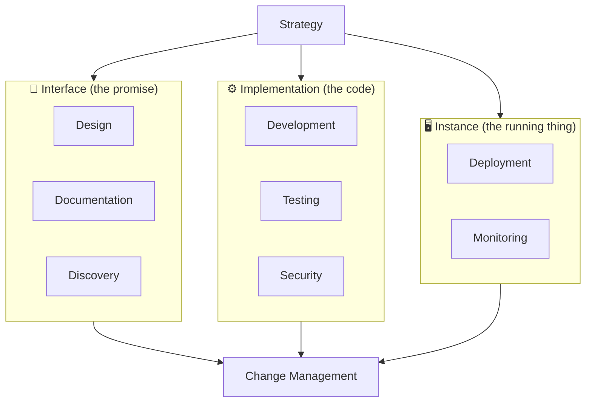

Notice that **strategy** feeds everything, and **change management** sits downstream of everything. That's not an accident — it's basically the thesis of this entire post. Now let's actually go through the ten pillars themselves.

---

## An Overview of the Ten Pillars

Here's the full list, in the order I like to walk through them:

1. Strategy
2. Design
3. Documentation
4. Development
5. Testing
6. Deployment
7. Security
8. Monitoring
9. Discovery
10. Change Management

I want to be upfront about something: these pillars overlap. A lot. Security touches design. Documentation touches discovery. Testing touches deployment. I don't think that's a flaw in the model — I think it's just an honest reflection of how messy real product work actually is. The pillars aren't meant to be a rigid checklist you tick off in sequence; they're a **vocabulary** I use to talk about where my team's effort is going, and where it *should* be going.

> **Note:** I've found this model most useful not as a "did we do this?" checklist, but as a conversation starter in retros: *"Which pillar is currently the weakest link in our API, and why?"* That single question has redirected more of my roadmap planning than almost any other exercise.

---

## Pillar 1: Strategy

If I had to pick the one pillar that quietly determines the success or failure of everything else, it's strategy. And yet it's the pillar most teams skip, because it feels "non-technical" — like something a product manager should handle in a slide deck, not something an engineer needs to think about.

I disagree with that framing completely. Strategy, in the context of an API, boils down to two brutally simple questions:

1. **Why does this API need to exist?** (the goal)
2. **How will building this API actually get me there?** (the tactics)

The tricky part is that my API's goal can't exist in a vacuum. It has to serve the broader goals of whatever organization owns it. I've seen teams build genuinely excellent, well-designed APIs that nobody used and nobody cared about, simply because the API's purpose was disconnected from any real organizational need. A beautifully designed API in service of the wrong goal is still the wrong API.

### How much does my API matter to the business?

I think about this on a spectrum:

| Business Model | What This Means for My API Strategy |
|---|---|
| The API **is** the product (e.g., a payments API, a communications API) | My API strategy and my company strategy are basically the same document. If the API fails, the company fails. |
| The API **supports** a traditional business (e.g., a bank opening an "open banking" API) | The API might intentionally lose money or be free, because its job is to expand reach for the *core* business, not generate direct revenue. |
| The API is **purely internal** | The "customers" are my own colleagues, but I still owe them a real strategy — the only thing that changes is who I'm serving. |

I want to flag something I got wrong early in my career: I once pushed hard for a metered, pay-per-call pricing model on an internal API because it felt like "best practice" from the public API world. It was the wrong call. That API's whole point was to reduce friction for internal teams adopting a shared capability, and putting a toll booth in front of it directly undermined its own strategic goal. Context matters enormously here — don't cargo-cult a strategy from a different kind of API.

### Turning a goal into tactics

Once I know *why* I'm building something, I need a plan for *how* the other nine pillars support that goal. A few patterns I keep coming back to:

- **Goal: grow business-aligned capability.** Tactically, this usually means pulling business stakeholders into the design pillar early, so the interface actually reflects the capabilities the business cares about.
- **Goal: monetize an internal asset externally.** This usually means heavy investment in design, documentation, and discovery, because I'm now competing in a market and developer experience (DX) becomes a genuine competitive weapon.
- **Goal: harvest external innovation.** This usually means investing disproportionately in discovery and marketing, because the entire point is maximizing the *number* of people experimenting with my API so a few good ideas bubble up.

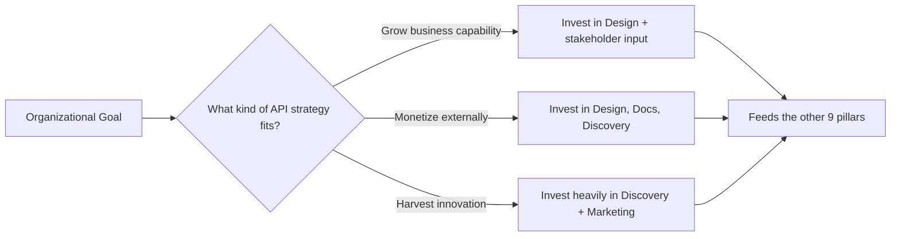

### Strategy has to stay alive

The biggest mistake I see is treating strategy as a "set it and forget it" document written once during a kickoff meeting. Strategy needs to be **fluid**. If my API isn't making progress, that's a signal to revisit the goal or the tactics — not just push harder on execution. And this only works if I actually have a way to *measure* progress, which is why strategy and the monitoring pillar are so tightly linked — you cannot adapt what you cannot see.

> **Caution:** If your organization's overall strategy shifts (new competitor, new regulation, new leadership priority) and your API strategy doesn't shift with it, you're building on borrowed time. I've watched teams keep executing beautifully against a goal that quietly stopped mattering to the business six months earlier.

### Governance questions I ask for Strategy

- **Who gets to define the goal and tactical plan?** Decentralizing this enables local optimization (teams move fast, react to their own context) but risks system-level chaos. Centralizing it protects the bigger picture but slows everyone down.
- **How do I measure strategic impact?** Standardized, centralized metrics let me compare apples to apples across many APIs, but they can also flatten nuance that matters to an individual team.
- **Who is allowed to change the strategy, and when?** Because goal changes ripple outward and affect everyone depending on the API, I generally want *more* control here as usage grows, even if I gave a lot of freedom at the start.

---

## Pillar 2: Design

Design is the pillar that decides what my API's interface actually **looks, feels, and behaves like**. I want to be precise about scope here: nearly everything in this post could technically be called "design work" in the broadest sense, but the design *pillar* specifically means the decisions I make about the shape of the interface itself.

Here's why I think this pillar deserves its own spotlight: for my users, **the interface is the API**. They don't see my database schema. They don't see my deployment pipeline. They see the shape of the requests and responses I hand them, and that's it. So whatever I decide here ripples out and constrains nearly every other pillar. If I decide my interface is going to be event-driven, that single decision reshapes my development approach, my deployment topology, my monitoring strategy, and my documentation style — all at once.

### The decision space

I break interface design decisions into five buckets:

| Design Area | What I'm Really Deciding |
|---|---|
| **Vocabulary** | What words/terms will my users need to learn? What do resources get called? |
| **Style** | REST/CRUD? Event-driven? GraphQL-style querying? gRPC? |
| **Interactions** | What calls do users make to accomplish a goal? How do I communicate call status? |
| **Safety** | How do I help users avoid mistakes? How are errors surfaced? |
| **Consistency** | Does this feel familiar, or does it surprise people? Do I follow industry standards? |

### What actually makes design "good"?

I used to think good design was about aesthetic elegance — clean naming, minimal endpoints, that kind of thing. Over time I've landed on something more pragmatic: **good interface design serves one (or both) of exactly two generalized goals** — acquiring more users, or reducing the cost of using my API. Everything else (elegance, consistency, cleverness) is only "good" insofar as it serves one of those two outcomes.

That reframing has saved me from a lot of bikeshedding. When a design debate stalls out over naming conventions, I ask: *does this actually change how many people adopt this API, or how expensive it is for them to integrate?* If the answer is "not really," I stop spending meeting time on it.

### A lightweight vs. heavyweight design process

I don't think every API deserves the same level of design rigor. Here's roughly how I decide:

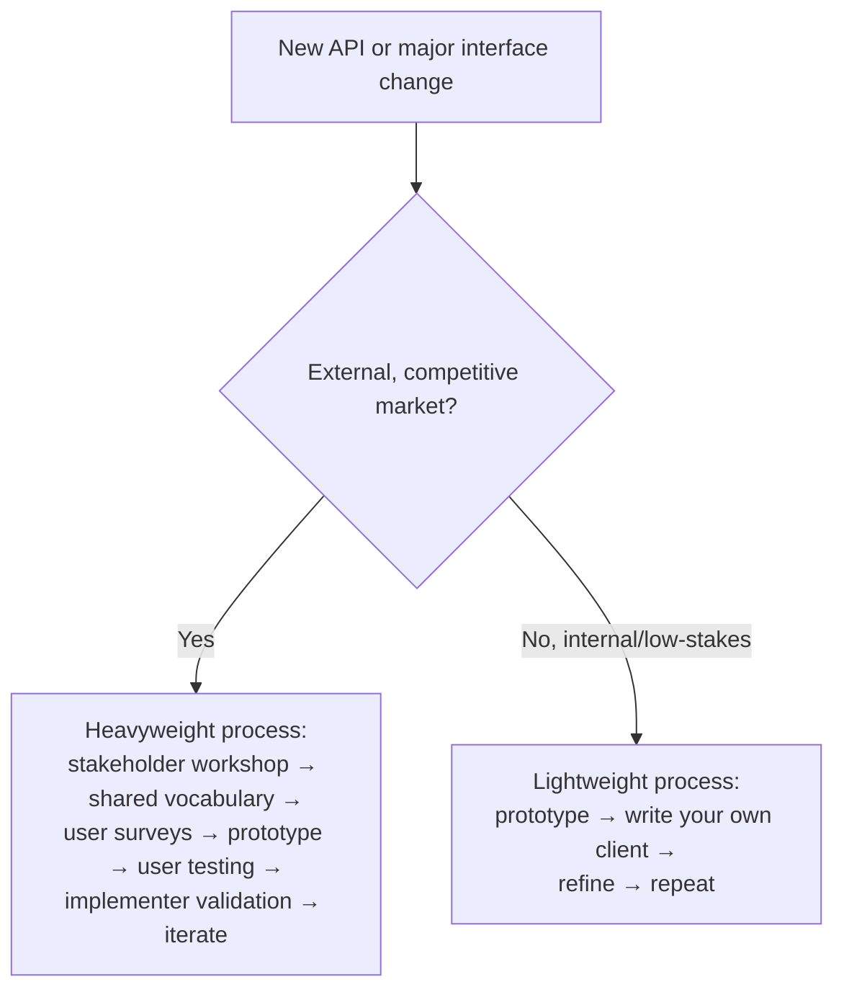

Even the lightweight loop — build a prototype, write a client against it myself, and iterate — has saved me from shipping some genuinely bad interfaces. There's something about being forced to *consume* your own design, even briefly, that surfaces awkwardness no amount of design-review meetings will catch.

**A tiny worked example.** Say I'm designing a "list orders" endpoint. I sketch this first pass:

```http
GET /orders?status=pending&page=2&size=50
```

Then I try consuming it myself and immediately notice two design smells: I have no way to know the total count of pending orders without fetching every page, and "status" as a single value doesn't let me ask for `pending` OR `processing` at once. That five-minute self-consumption exercise catches problems a design document review would likely miss, because I'm not just *reading* the interface, I'm *using* it.

### Description formats are your friend

I always reach for a machine-readable interface description format where one exists — OpenAPI for CRUD-style HTTP APIs, Protocol Buffers for gRPC, WSDL for the (increasingly rare) SOAP API. Here's a minimal OpenAPI snippet I might sketch for that orders endpoint above, refined based on what I learned:

```yaml
openapi: 3.0.3
info:
  title: Orders API
  version: "1.0.0"
paths:
  /orders:
    get:
      summary: List orders
      parameters:
        - name: status
          in: query
          description: Comma-separated list of statuses to filter by
          schema:
            type: array
            items:
              type: string
              enum: [pending, processing, shipped, cancelled]
        - name: page
          in: query
          schema:
            type: integer
            default: 1
        - name: size
          in: query
          schema:
            type: integer
            default: 50
      responses:
        "200":
          description: A page of orders
          content:
            application/json:
              schema:
                type: object
                properties:
                  total_count:
                    type: integer
                  page:
                    type: integer
                  items:
                    type: array
                    items:
                      $ref: "#/components/schemas/Order"
components:
  schemas:
    Order:
      type: object
      properties:
        id:
          type: string
        status:
          type: string
        created_at:
          type: string
          format: date-time
```

The value here isn't just documentation-for-free — it's that this file becomes something I can run tooling against: generating mock servers, generating client SDKs, running contract tests, and generating docs automatically.

### Governance questions I ask for Design

- **What are the design boundaries?** If I have dozens of APIs and users touch more than one of them, I need *some* shared constraints (a style guide) or I end up with a landscape where every API feels like it was designed by a different alien species.
- **How is the interface model shared?** Standardizing on one description format (say, "every team submits OpenAPI") trades some design flexibility for massively easier tooling, automation, and cross-team consistency.

---

## Pillar 3: Documentation

I like to say that a perfectly designed interface with no documentation is basically a locked door with no doorknob. It doesn't matter how elegant the room behind it is if nobody can get in.

I split documentation into two philosophies that I think every team needs *both* of:

### Tell-don't-teach vs. teach-don't-tell

**Tell-don't-teach** is reference material: error code tables, schema definitions, endpoint listings. It's factual, and — good news — it's the kind of documentation that's easiest to generate automatically from a machine-readable interface description (see, the OpenAPI file above pays off again here).

**Teach-don't-tell** is the *learning experience*: tutorials, guided walkthroughs, "how do I accomplish X" content. This is where I actually help someone go from zero to a working integration.

| Approach | Best For | Cost to Produce | Example |
|---|---|---|---|
| Tell-don't-teach | Experienced users who just need a fact | Low (often automatable) | An endpoint reference page |
| Teach-don't-tell | New users who need a path forward | High (needs real authorship) | "Get GPS coordinates for an address in 6 steps" |
| Interactive tooling | Anyone who learns by doing | Medium-high (needs a sandbox) | An in-browser API explorer |

I've noticed something interesting in practice: interactive tooling shortens the "learn → try → learn from result" feedback loop dramatically. Without it, a developer has to go write actual code, run it, and debug it just to test a single assumption about how my API behaves. With a good API explorer, that loop shrinks from minutes (or hours) down to seconds.

### A note on the developer portal

A developer portal is simply the home base — usually a website — where I put all of this supplementary material: docs, guides, explorer tools, changelogs, status pages. I don't think every API strictly *needs* one, but I've never regretted building one for an API with more than a handful of external consumers.

### When should I actually write the docs?

This is a real tension, and I don't think there's one right answer:

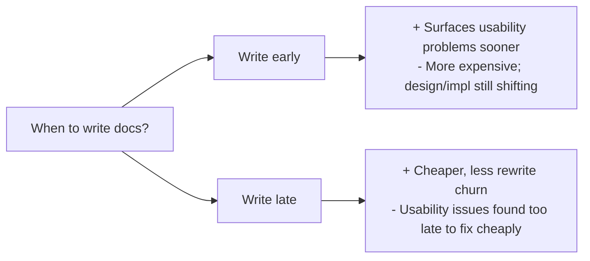

My personal rule of thumb: for anything customer-facing or cross-team, I write a rough draft of documentation *before* implementation is finished, specifically because writing it forces me to notice awkward parts of the interface while they're still cheap to change.

> **Note:** I keep documentation investment proportional to how "foreign" the audience is. A public API in a competitive market gets the full treatment — guides, references, interactive explorer, sample apps. An internal API used exclusively by the team that built it might just need a solid reference doc and a README, because the "learning gap" is much smaller.

### Governance questions I ask for Documentation

- **Who designs the learning experience?** Centralizing this gives users one consistent voice and format across all my APIs, but it can bottleneck on a small technical-writing team.
- **When must documentation exist before release?** I've seen organizations mandate docs before any release; others leave it to team judgment. I lean toward "always require *something*, but let the depth scale with audience size."

---

## Pillar 4: Development

This is the pillar most engineers assume *is* the whole job: actually writing the implementation. I want to push back on that a little. Development matters enormously, but it's one of ten pillars, not the only one — and ironically, the people who care least about your development choices are your API's actual users.

Here's the uncomfortable truth: **my users do not care what language, framework, or database I use.** They care whether the API does what it promises, reliably. My development decisions matter enormously, but the audience that cares is almost entirely internal — the engineers who have to build, extend, and maintain this thing for years.

### It's not about day one — it's about year three

It's tempting to over-focus on "what does it take to ship v1?" The much harder and more important question is: what does it take to keep this thing healthy, changeable, and maintainable across its *entire* lifetime? Writing code that works today is a skill anyone with a few programming courses can pick up. Writing code that still works — and is still pleasant to change — three years and five engineers-of-turnover later takes real craft.

### Frameworks, tools, and the API gateway

A huge chunk of development decisions today are really about **how much I build myself vs. how much I offload to existing tooling**. The API gateway is the poster child here — a piece of infrastructure that handles routing, authentication, rate limiting, and often a good chunk of security work, right out of the box.

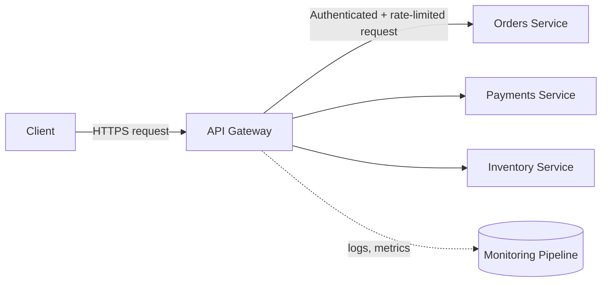

The tradeoff I keep in mind: a gateway (or any framework) does *exactly* what it was built to do, and nothing else. If my strategy and design pillars are pushing me toward something nonstandard, I need to budget more raw development effort myself, because the "free" tooling only gets me so far.

### Keeping implementation honest to the interface

The relationship between design and development is a two-way contract:

1. Conforming to the published interface is a real quality bar for my implementation — not a nice-to-have.
2. Whenever the interface changes, my implementation has to change with it, immediately and correctly.

One practice I rely on heavily: keeping the interface description (that OpenAPI file, for example) **in the same repository as the implementation**, and wiring up an automated contract test that fails the build if implementation and interface drift apart. Here's a small example using a JS testing setup with a schema validator, just to make this concrete — I've run something close to this pattern before to catch drift automatically:

```javascript
// contract.test.js
const request = require('supertest');
const SwaggerParser = require('@apidevtools/swagger-parser');
const Ajv = require('ajv');
const app = require('../src/app');

describe('Orders API contract', () => {
  let orderSchema;

  beforeAll(async () => {
    const api = await SwaggerParser.validate('./openapi.yaml');
    orderSchema = api.components.schemas.Order;
  });

  test('GET /orders returns items matching the Order schema', async () => {
    const res = await request(app).get('/orders?page=1&size=10');
    expect(res.status).toBe(200);

    const ajv = new Ajv();
    const validate = ajv.compile(orderSchema);

    for (const item of res.body.items) {
      const valid = validate(item);
      if (!valid) {
        console.error(validate.errors);
      }
      expect(valid).toBe(true);
    }
  });
});
```

This test doesn't check business logic at all — it checks one very specific thing: *does what I actually return match what I promised in the interface description?* That single guardrail has saved me from shipping "silent" breaking changes more times than I can count — the kind where a field quietly gets renamed or a type quietly changes from string to number and nobody notices until a client breaks in production.

### Governance questions I ask for Development

- **What's allowed for the implementation?** Which languages, frameworks, databases, vendors, and open-source components are on the table? I've seen organizations swing hard toward decentralizing this to maximize team-level velocity, but the tradeoff is real: less mobility between teams, less economy of scale, less visibility. My favorite middle ground is centralizing the *menu of options*, while decentralizing *which option a given team picks* from that menu.

---

## Pillar 5: Testing

I don't think API testing is fundamentally different from general software QA — most of the same principles apply. What *is* different is the ecosystem: the specific tools built for simulating clients, backends, and environments in an API-shaped way.

### What am I actually testing?

The primary goal is straightforward: does this API deliver on the strategic goal I defined back in Pillar 1? But there's a secondary goal that's easy to forget — I also need to verify that the work across *all the other pillars* holds up under scrutiny. A gorgeous interface with terrible usability, uncovered by any test, is a silent failure waiting to surface as a support ticket flood.

Here's the taxonomy of test types I use, organized by what kind of bug each one is designed to catch:

| Test Category | Catches | Example |
|---|---|---|
| Usability/UX testing | Interface, docs, and discovery bugs | Watching developers try to integrate using only the docs |
| Unit testing | Granular implementation bugs | Running a test suite against a single function on every build |
| Integration testing | Implementation/interface mismatches | Running scripted API calls against a dev environment |
| Performance/load testing | Non-functional bugs (latency, throughput) | Simulating production-level traffic against a staging instance |
| Security testing | Vulnerabilities | A dedicated red team probing a secure test environment |
| Production testing | Real-world usability/functionality bugs | A/B testing documentation content with live traffic |

### Simulating what you can't control

Because APIs are inherently *connected* systems, isolated testing is hard. I usually need to simulate at least one of these four things:

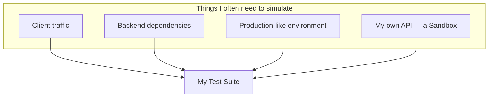

The "simulate my own API" case is a fun one — it's what I'd call a **sandbox**: a safe, consequence-free copy of my API that external developers can play with using fake data. I've learned one hard lesson here the expensive way:

> **Caution:** If your sandbox behaves even slightly differently than production — different rate limits, different latency, different edge-case handling — you're setting your users up for a nasty surprise the moment they flip over to the real thing. Treat sandbox-production parity as a first-class requirement, not an afterthought.

### How much testing is "enough"?

This is a judgment call rooted back in strategy. An established bank's payments API and a scrappy startup's social app API should not have the same testing bar. I like using code coverage as one input (not the only one) — it's imperfect, but it's quantifiable and gives me a minimum threshold I can hold every team accountable to.

### Governance questions I ask for Testing

- **Where does testing happen — centralized or decentralized?** My personal bias: decentralize the *early* test stages (unit, integration) for speed, and centralize the *later* stages (security, performance, production) for safety.
- **How much testing is enough?** Whether I let individual teams decide this or mandate a minimum bar (like coverage thresholds) really comes down to how much I trust the team's judgment and how catastrophic a failure would be.

---

## Pillar 6: Deployment

Deployment is where an implementation becomes a real, running **instance** that people can actually hit with requests. I think of this pillar as being fundamentally about managing *uncertainty* — because no matter how well I designed, developed, and tested my API, production has a way of finding the exact scenario I didn't plan for.

### Two opposite moves at once

Improving deployment safety, in my experience, requires doing two contradictory-sounding things simultaneously: **eliminating uncertainty** where I can, and **accepting uncertainty** where I can't.

**Eliminating uncertainty** is mostly about immutability — the idea that once something is deployed, it can't be quietly modified, only replaced. Immutable infrastructure, immutable deployment packages, no manual SSH-ing into a box to "just fix one thing real quick." Every time I've been burned by a production incident traced back to a manual, undocumented change on a server, immutability has been the fix I reach for afterward.

**Accepting uncertainty** means building systems that stay safe even when something genuinely unexpected happens — a traffic spike, a bad deploy, a dependency going down. This shows up as monitoring, circuit breakers, graceful degradation, and defensive coding.

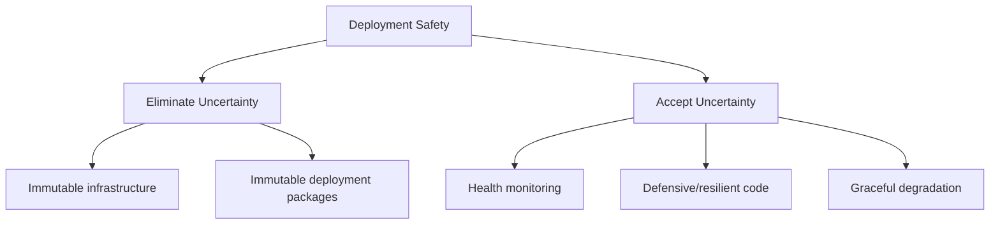

### Automating deployment

There are really only two ways to make deployments faster: do less work, or do the same work more quickly. Automation is the classic lever for the second option — turning a multi-step manual release process into a single button-press. I've come to think of deployment automation the way I'd think about buying a piece of factory machinery: it massively boosts throughput, but it comes with real setup costs, maintenance costs, and — this is the part people forget — it limits flexibility. Once a pipeline expects things a certain way, deviating from that shape gets expensive.

A trimmed-down example of what this often looks like as a CI/CD pipeline definition:

```yaml
# .github/workflows/deploy-api.yml
name: Deploy Orders API

on:
  push:
    branches: [main]

jobs:
  test-and-deploy:
    runs-on: ubuntu-latest
    steps:
      - uses: actions/checkout@v4

      - name: Validate OpenAPI contract
        run: npx @redocly/cli lint openapi.yaml

      - name: Run unit + contract tests
        run: npm ci && npm test

      - name: Check for breaking interface changes
        run: npx openapi-diff previous-openapi.yaml openapi.yaml --fail-on-incompatible

      - name: Build immutable container image
        run: docker build -t orders-api:${{ github.sha }} .

      - name: Push to registry
        run: docker push orders-api:${{ github.sha }}

      - name: Deploy to staging, then require manual approval for prod
        run: ./scripts/deploy.sh staging ${{ github.sha }}
```

Notice the "check for breaking interface changes" step — that's the change management pillar leaking directly into deployment automation, which is exactly the kind of cross-pillar overlap I mentioned at the start of this post.

### Governance questions I ask for Deployment

- **Who decides when a release can happen?** I've used a hybrid a lot: trusted senior engineers get "push to release" for low-risk services, while higher-risk releases go through a staged rollout with a human go/no-go gate.
- **How are deployments packaged?** Containerization has become the default answer for a reason — it makes deployments cheaper, more portable, and easier to make immutable. But *who* decides the packaging standard (a platform team? each service team?) still needs a clear answer.

---

## Pillar 7: Security

APIs are, by design, doors into your system. More doors means more surface area for someone to try to get in where they shouldn't. I think about API security as serving three concrete goals:

1. Protecting my system, my clients, and my end users from threats.
2. Keeping the API available for legitimate use by legitimate users.
3. Protecting the privacy of data and resources moving through it.

### Security is not just a technology decision

This is the part I really want to hammer on: the biggest mistake I see teams make is treating security as a checklist of technical controls — OAuth here, rate limiting there, done. Real security has to bleed into culture and process too: training support staff not to leak private data during a call, reviewing documentation so it doesn't accidentally expose internal implementation details, and building a security-first mindset into how engineers design features in the first place.

### The twelve principles I keep taped to my mental whiteboard

I lean on a checklist adapted from classic security principles, applied specifically to APIs:

| # | Principle | What It Means in Practice |
|---|---|---|
| 1 | API confidentiality | Only authorized users can access a resource, in transit, at rest, and while processing |
| 2 | API integrity | Data can't be tampered with silently; unwanted changes get detected automatically |
| 3 | API availability | Reliable access for authorized users, backed by real infrastructure and process investment |
| 4 | Economy of mechanism | Keep the design and implementation as simple as possible — complexity breeds bugs |
| 5 | Fail-safe defaults | Deny by default; grant access only with explicit permission |
| 6 | Complete mediation | Every endpoint validates access — no unchecked side doors |
| 7 | Open API design | Security shouldn't rely on obscurity; document it, standardize it |
| 8 | Least privilege | Every consumer gets the minimum permissions needed, nothing more |
| 9 | Psychological acceptability | Security shouldn't be so heavy it discourages people from following it correctly |
| 10 | Minimize attack surface | Expose only what's needed; throttle and rate-limit aggressively |
| 11 | Defense in depth | Layer multiple controls — IP allowlisting, MFA, and more, stacked together |
| 12 | Zero trust | Treat every consumer, internal or external, as untrusted by default |
| 13 | Fail securely | On failure, deny access — never fail "open" |
| 14 | Fix issues correctly | Root-cause the fix, don't patch around the symptom |

(Yes, I count more than twelve items in my own list above — the checklist has grown a bit messier and more granular every time I've applied it for real, which I think is a healthy sign that it's a living tool, not scripture.)

> **Note:** The "fail-safe defaults" principle is the one I see violated most often in practice, usually by accident — a new endpoint gets added, someone forgets to wire up the authorization middleware, and suddenly there's an unauthenticated route sitting in production. I now treat "does every new route have an explicit authorization check in its test suite" as a non-negotiable line item in code review.

### Governance questions I ask for Security

- **Which decisions need explicit authorization/review?** This depends heavily on context — are designers and implementers already security-savvy? Is work happening in-house or with third parties? The riskier the context, the more decisions I pull into a mandatory review gate.
- **How much security does a given API actually need?** Not every API needs bank-vault-level protection. A financial transactions API and an internal logging-metrics API do not deserve the same security budget. I try to let risk classification, not blanket policy, drive this.

---

## Pillar 8: Monitoring

I genuinely believe you cannot manage what you cannot see, and nowhere is that truer than with APIs running at scale. Monitoring is the pillar that makes information about my API's behavior available, accessible, and — critically — *useful*.

### What's actually worth watching

| Category | Examples |
|---|---|
| Problems | Errors, failures, warnings, crashes |
| System health | CPU, memory, I/O, container health |
| API health | Uptime, current state, total messages processed |
| Message logs | Request/response bodies, headers, metadata |
| Usage data | Requests per endpoint, requests per consumer |

A framework I've found genuinely useful for narrowing this down (instead of trying to monitor *everything*, which gets expensive fast) is the **RED method**: track **R**ate, **E**rrors, and **D**uration for every service. It's a small, memorable set of metrics that tends to catch the majority of real-world problems before I need anything fancier.

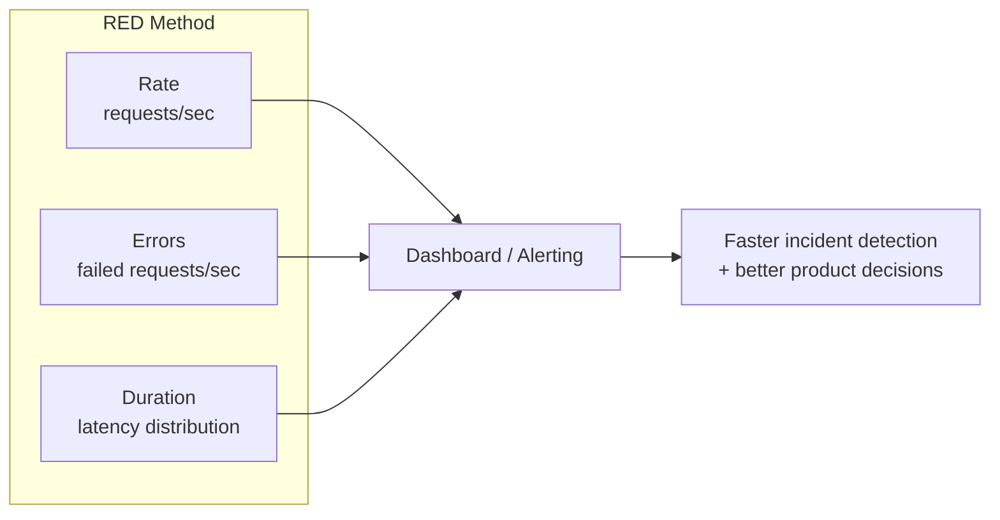

### The cost tradeoff nobody warns you about

More data sounds unambiguously good — more opportunities to learn, more visibility into problems. But logging and metrics aren't free. I've personally had to walk back an over-eager logging setup because it doubled our API's round-trip latency. The lesson: monitoring investment is itself a pillar decision with real costs, not something to maximize blindly.

> **Caution:** Watch out for monitoring systems that are *inconsistent* across your API landscape. If every team invents its own dashboards, its own metric names, and its own alerting thresholds, you'll pay for that inconsistency every single time someone needs to debug an issue that spans more than one service.

### Governance questions I ask for Monitoring

- **What should actually be monitored?** Individual team judgment works fine at small scale; at the scale of dozens or hundreds of APIs, I need centralized standards so data stays comparable.
- **How is data collected, analyzed, and shared?** This gets extra sensitive fast when personal or regulated data is involved — I treat that as a hard requirement for centralized oversight, not a nice-to-have.

---

## Pillar 9: Discovery

An API that nobody can find is functionally the same as an API that doesn't exist. Discovery is the pillar dedicated to making sure my target users can actually locate, understand, and start using my API. I split this into two very different flavors.

### Design-time vs. runtime discovery

**Runtime discovery** is a *machine-facing* concern: how does a client dynamically find the network location of a service? This matters a lot in microservice architectures, where instances come and go constantly. It's mostly solved through development and deployment tooling (service registries, DNS-based discovery, service meshes) rather than marketing effort.

**Design-time discovery** is a *human-facing* concern: how does a person learn that my API exists at all, and that it can solve their problem? This is fundamentally a marketing and communication exercise.

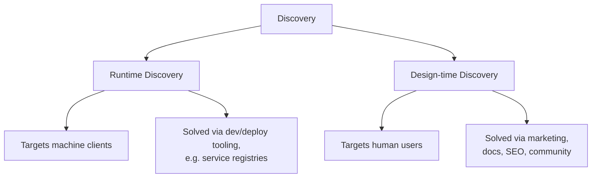

### External vs. internal discovery, and why they're not the same game

For an **external** API, discovery looks like classic product marketing: search engine optimization, conference sponsorships, community engagement, targeted advertising. If I'm competing in a crowded market, I probably need to invest heavily in differentiation. If my product is genuinely unique, I might get away with comparatively little marketing spend.

For an **internal** API, I have a captive audience in theory, but discoverability still matters enormously in practice. If my colleagues don't know an API exists, they won't just fail to use it — they might go build a near-duplicate themselves, which is a quiet but very real drain on organizational resources. The tactics differ (get listed on the internal API registry, personally visit teams, present at internal guilds) but the underlying discipline is the same.

> **Note:** One thing that's genuinely surprised me over the years: large organizations almost always have *more than one* internal API catalog floating around — an official one, a team's spreadsheet, a wiki page someone made two years ago and forgot about. If discoverability matters to you, budget real time to get listed everywhere that matters, not just the "official" registry.

### Governance questions I ask for Discovery

- **What should the discovery experience look like?** At scale, I want consistency across APIs, which usually pulls this toward centralized design.
- **When and how do I advertise a given API?** I generally leave the "when" to individual teams, but I insist that centralized discovery tooling doesn't get in their way.
- **Who keeps the discovery experience accurate over time?** This is the sneaky one — discovery info decays as APIs change, and someone has to own keeping it fresh, or the whole catalog slowly becomes untrustworthy.

---

## Pillar 10: Change Management

I'll be honest: this is the pillar I think about the most, because it's the one that never, ever goes away. If I never had to change an API again after shipping it, API management would barely be a discipline at all. But APIs *must* evolve, and change management is the umbrella over every decision involved in doing that safely.

There are three goals wrapped up in this pillar:

1. Choosing the *best* changes to make.
2. Implementing those changes as fast as reasonably possible.
3. Doing so without breaking anything for existing users.

### Picking the right changes

This loops all the way back to strategy — a clear goal and a well-understood user community make it dramatically easier to prioritize which changes actually move the needle versus which ones are just busywork or personal preference dressed up as a "must-have."

### The safety-vs-speed tension

Every decision across every pillar nudges the needle one way or the other on this spectrum:

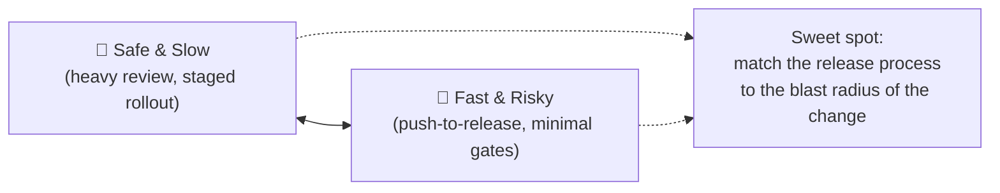

The trick, as I see it, isn't picking one end of that spectrum — it's matching the *type* of change to the *right* level of ceremony. A backward-compatible bug fix and a breaking interface overhaul should not go through the same release process.

### Telling people something changed

Implementation is genuinely only half of change management. The other half is communication — making sure designers, developers, operations teams, *and* external consumers all know that something changed and what they need to do about it. This is exactly why **versioning** exists, and why the specific versioning approach I pick depends heavily on the style, protocol, and format of my API (a topic big enough to deserve its own dedicated post, honestly).

### Governance questions I ask for Change Management

- **Which releases need to be fast, and which need to be safe?** I've used a "bimodal" (two-speed) model before, but in practice I've found most complex organizations really operate with more like three or four speeds depending on blast radius, not just two. Centralizing the *rule* for how to classify a change gives consistency; decentralizing the *judgment call itself* gives speed but risks teams misjudging their own blast radius.

---

## How I Actually Use These Pillars Together

Reading about ten separate pillars might make it sound like API work happens in ten separate lanes. In reality, it's much messier and much more interconnected than that. I want to close out with how I actually see these pillars combine during three different phases of an API's life: planning, building, and operating.

### During planning

I've learned to resist the urge to over-plan ("Big Design Up Front") while still respecting that changes to a *published interface* are genuinely expensive — way more expensive than changes to, say, an internal function signature nobody else calls. So during planning, I focus on three specific things:

1. **Testing strategy/design alignment continuously.** As design and implementation decisions pile up, it's shockingly easy to lose sight of the original strategic goal. I try to periodically ask, "does this decision actually move my KPIs, or did I just make it because it felt technically satisfying?"
2. **Prototyping early.** Whatever you want to call it — proof of concept, MVP, "steel thread" — realizing a design as quickly as possible, even roughly, tells me whether it's actually buildable long before I've sunk real cost into it.
3. **Defining component boundaries early.** Especially in a microservices-style architecture, deciding where one API ends and another begins is design work that pays dividends (or costs you dearly) for years.

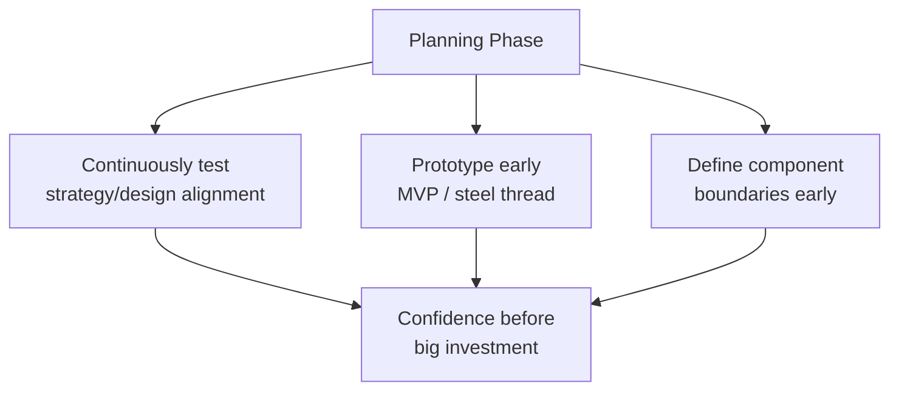

### During the build

When I'm actually building the thing, I've found three broad philosophies teams tend to adopt, and I genuinely think all three are valid — the trick is picking the one that fits your context.

| Approach | Prioritizes | Best When | Watch Out For |
|---|---|---|---|
| **Documentation-first** | The human interface, written before code exists | Consumability matters a lot; nontechnical stakeholders need early visibility | Docs can promise something engineering can't actually deliver |
| **Code-first** | Fast internal delivery; docs follow the code | Speed matters more than external usability (e.g., an internal microservice) | Implementation details leak into the interface; hard to "consumerize" later |
| **Test-first** | Testability, via writing tests before implementation | You want strong confidence in safe future changes | Extra upfront cost; can delay first release |

In practice, I've settled into a hybrid most often: documentation-first for the overall shape of the API (because it forces me to think about the consumer early), combined with test-driven development once I start actually writing the implementation. That combo has given me the best of both worlds — a design that's been "consumer-tested" on paper, and an implementation I trust because it was built test-first.

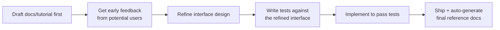

### During operations: shifting things left

Once the API is live, I've watched the industry (and my own teams) shift two things further and further "left" — meaning earlier in the process, instead of bolted on at the end:

**Shifting Ops left** means development, deployment, and monitoring concerns get considered from day one, not handed off to a separate operations team after the fact. In practice this usually shows up as a standardized DevOps platform: CI/CD pipelines, containerization, and observability tooling that's expected by default, not requested as an afterthought.

**Shifting Security left** means the same thing, but for security: vulnerability scanners baked directly into CI/CD, continuous automated threat detection running against live systems and repos, and a "zero trust" mental model where no request is inherently trusted just because of where it came from.

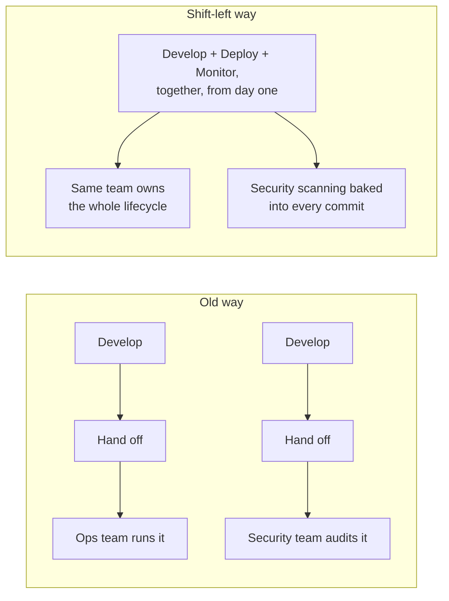

I want to be honest about the cost side of this trend, too: shifting ops and security left means engineers who used to "just write code" now need real working knowledge of infrastructure, deployment, and security concepts. That's genuinely more to ask of an individual contributor, and I think it's part of why platforms like Kubernetes, service meshes, and serverless architectures have exploded in popularity — they're an attempt to absorb some of that complexity into reusable infrastructure, so individual teams don't each have to become infrastructure experts from scratch.

| Platform | What It Buys You | What It Costs You |
|---|---|---|
| **Kubernetes** | Standardized deployment, scaling, and monitoring for containers | Your design/dev/test team now also needs real Kubernetes literacy |
| **Service mesh** | Simplifies inter-service communication in a microservices architecture | Real upfront complexity to install, configure, and maintain |
| **Serverless** | Hides almost all infrastructure concerns behind an event-driven interface | Reduces dev-pillar cost, but demands new expertise in design/ops/run |

---

## Wrapping This Up

If there's one thing I want you to walk away with, it's this: **an API isn't just code, and it isn't just a document — it's a product, held up by ten interconnected pillars of ongoing decision-making.** Some of those pillars will matter enormously for your specific API, and some won't need much investment at all, and that's completely fine. The skill isn't memorizing a checklist; it's developing the judgment to know, for *your* context, *your* users, and *your* strategic goal, which pillars deserve the heaviest investment right now — and which ones deserve almost none.

I also want to leave you with the honest, slightly uncomfortable truth I keep re-learning: these pillars don't stay balanced by themselves. The moment I stop paying attention to one — say, I get complacent about security because "nothing's gone wrong yet," or I let documentation quietly go stale because the team is heads-down shipping features — that pillar starts eroding quietly, invisibly, until the day it fails loudly and expensively. The best API teams I've worked with aren't the ones who nailed every pillar perfectly on day one. They're the ones who kept coming back, again and again, to ask: *which pillar is weakest right now, and what's it going to cost us if we keep ignoring it?*

That question, asked honestly and regularly, has done more for the health of my APIs than any framework, tool, or best-practices list ever has.
