# The API Landscape Maturity Journey: Why I Stopped Looking for a Finish Line

Donald Knuth once wrote that *"premature optimization is the root of all evil (or at least most of it) in programming."* I think about that line a lot when people ask me what a "mature" API landscape actually looks like, because I think the question itself contains a trap. People want a checklist, a score, a finish line — some state where the landscape is finally "done" and they can stop paying attention to it. I want to convince you in this post that this question is the wrong one to ask, and I want to give you the framework I actually use instead.

Here's the honest answer I've landed on: an API landscape is never done. It's not a destination — it's a permanent journey, the same way the web itself has never been "finished." New technologies show up, new usage patterns emerge, business needs shift, and the landscape has to keep evolving in response, forever. If it stopped evolving, it would eventually become irrelevant, and something else would take its place. That continuous evolution isn't a flaw in the model — it's the entire reason a landscape like the web has stayed relevant for decades.

So instead of chasing a fixed destination, I've come to think about landscape maturity as a set of ongoing investments, guided by continuous observation. In this post, I want to walk through three things that make that actually work in practice: how I structure and manage guidance so it stays a living, evolving document rather than a stone tablet; the team structure I rely on to steward that guidance (something often called a Center for Enablement); and how I use the "eight Vs" framework — variety, vocabulary, volume, velocity, vulnerability, visibility, versioning, and volatility — to figure out where to actually invest my limited time and attention at any given moment.

Let's start with guidance, because I think it's the foundation everything else sits on.

---

## Structuring Guidance: Why, What, How, and When

Guidance is how I communicate to everyone building APIs in my organization *why* something matters, *what* needs to be done about it, and *how* it can actually be implemented. I've learned the hard way that guidance which reads like an opaque, unexplained rule handed down from on high gets resented and ignored. Guidance that's treated as a living document — something every developer can read, comment on, and genuinely contribute to — becomes something the whole community actually helps evolve, rather than something imposed on them.

I structure every piece of guidance around three separated layers, and I've found that keeping these genuinely separate (not blending "what" into "how," which is the single most common mistake I see) is the single biggest lever for keeping guidance useful over time.

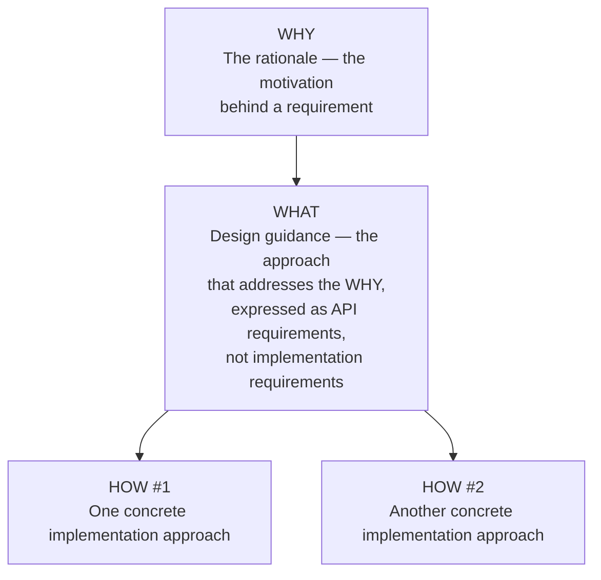

**Why (guidance motivation).** This is the rationale — the story explaining *why* a requirement or recommendation exists in the first place. I never let a rule stand without its rationale attached, because an unexplained rule is a rule people will eventually route around or quietly ignore. Documenting the "why" also gives me a useful test later: when someone proposes an alternative approach, I can check whether it genuinely serves the same underlying rationale, or whether it's solving a different problem entirely dressed up as an alternative.

**What (design guidance).** This defines the approach that addresses the "why," expressed as a requirement *on the API itself* — never as a requirement on the implementation. I think this distinction is genuinely easy to get wrong in practice, so I try to be strict about it: "what" describes what the API needs to do or expose, full stop, with zero mention of *how* it gets built that way.

**How (implementation guidance).** This is where I get concrete — specific tools, technologies, or techniques teams can actually use to satisfy the "what." Crucially, a single "what" can have *multiple* valid "hows" attached to it, and that's by design, not an inconsistency. As teams discover or invent new ways to solve the same underlying problem, new "hows" get added to the existing "what" over time, letting new solutions establish themselves without requiring anyone to rewrite the guidance from scratch.

### A Worked Example: Announcing API Decommissioning

I want to walk through a concrete example because I think it makes this structure click immediately. Here's how I'd structure guidance around the common challenge of announcing an upcoming API decommissioning — one "why," two "whats," and three "hows":

**Why:** Service users benefit from learning about an API's upcoming decommissioning ahead of time. APIs should have a mechanism to announce that they're going out of service.

**What #1:** APIs can use the HTTP `Sunset` header field to announce an upcoming decommissioning. They should specify which resources carry the header (commonly, the home resource) and when it starts appearing (commonly, as soon as a decommissioning date is actually planned) — ideally with a guaranteed minimum grace period before the actual shutdown.

- **How #1a:** Control the `Sunset` header through configuration. No configuration means no header in responses; once a decommissioning date is known, configuration gets added, and the header appears on the relevant resources.
- **How #1b:** Add the `Sunset` header through an API gateway instead of the implementation itself — the gateway injects the header once the relevant policy is configured and enabled, without the API's own code needing to change at all.

**What #2:** APIs with a known list of registered consumers may use a channel outside the API itself — email, for instance — to announce the upcoming decommissioning. This guidance only applies when such a consumer list actually exists and the communication channel is genuinely reliable.

- **How #2a:** Send email to all registered users, referencing a stable, dedicated resource (a changelog entry, a documentation page) with a durable URI that stays consistent throughout the whole communication process.

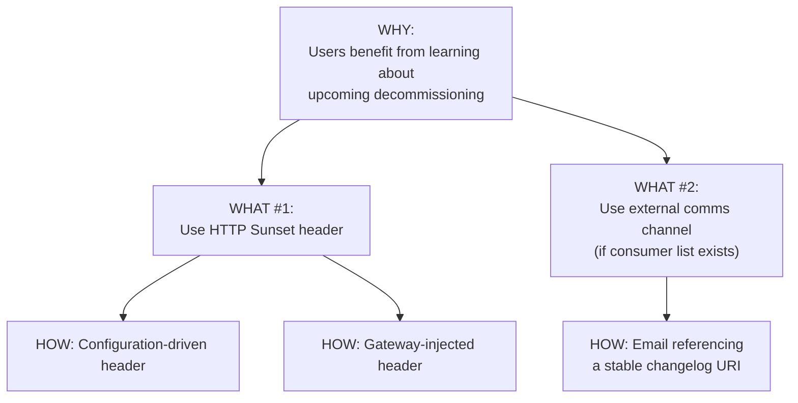

> **Note:** A lot of large organizations openly publish their API guidance — Google, Microsoft, Cisco, Red Hat, PayPal, Adidas, and even the White House all have public examples worth studying. Arnaud Lauret's **API Stylebook** is a genuinely useful resource that collects a bunch of these into one place if you want to browse a range of real-world examples.

### What the Publishing Format Tells You

Here's something I find genuinely revealing, and I don't think it gets discussed enough: **the publishing format an organization chooses for its guidance tells you a lot about their actual philosophy toward that guidance**, even before you read a single word of the content itself.

| Format | What It Signals |
|---|---|
| **PDF** | Read-only by nature. Compiled and distributed from some inaccessible source. Little sense of "you can participate in evolving this." |
| **HTML** | Somewhat better — often the HTML *is* the source, not just a rendered output — but management of that source still isn't necessarily obvious to an outside contributor. |
| **Version-controlled (e.g., GitHub, Markdown)** | Genuinely the best signal. Built-in commenting, issue-raising, and change-suggestion tooling. Developers are typically already comfortable with this workflow, and publishing guidance the same way you publish code makes contributing to it feel completely natural. |

> **Tip:** If you're setting up guidance publishing from scratch, I'd strongly lean toward the version-controlled approach. It's not just more convenient — it actively changes how people relate to the guidance, from "something handed to me" to "something I can help shape."

### The Fourth Element: "When" (Testability)

I want to add one more layer to the why/what/how structure that I've found genuinely transformative: **when**. This describes exactly when a piece of guidance can be considered satisfied — meaning there's an actual way to *test* for it, ideally an automated test wired directly into the deployment pipeline.

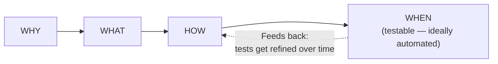

I don't think every single piece of guidance needs (or is even capable of) a fully automated test — but I treat that as the ideal to aim for, not a hard requirement everywhere. Automated testability makes guidance far more explicit and far more objective to follow, and it lets guidance compliance become a routine, low-friction part of the delivery pipeline instead of a manual review bottleneck. Even simple plausibility checks are a genuinely useful starting point — I've found it's fine to start rough and refine the tests over time as I learn where the rough version gives unhelpful or misleading feedback.

---

## The Lifecycle of Guidance Itself

Here's something I think gets missed constantly: **guidance itself has a lifecycle**, in exactly the same way an individual API product does. A given piece of guidance gets proposed, gets explored, maybe becomes a genuine recommendation — and eventually, inevitably, gets displaced by something newer and better, sunsetting into history.

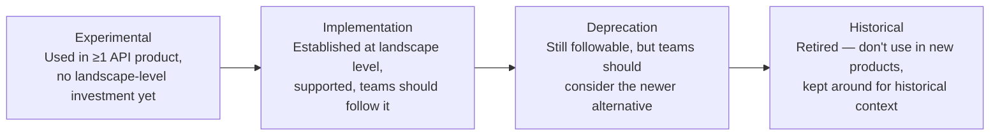

**Experimental.** Guidance in this stage is genuinely being explored — used in at least one real API product, specifically to figure out whether it's actually worth promoting to landscape-wide guidance. It gets documented at this stage, but there's deliberately no investment yet in making it *easy* for other teams to follow — that investment only comes once the pattern has proven itself.

**Implementation.** Once guidance is genuinely established at the landscape level, it should have real support behind it — at minimum, one documented "how." At this stage, teams might be expected to at least seriously consider it before opting out; for some guidance, there may be no opt-out at all, and it's simply mandatory.

**Deprecation.** Once a newer or better way of solving the same problem has emerged, older guidance enters deprecation — still technically usable, but teams should ideally start considering the guidance that's currently in the implementation stage instead.

**Historical.** Eventually, guidance gets fully retired and shouldn't be used in any new product going forward. Existing products built against it might even get refactored to migrate onto something more current. I still keep historical guidance around, though — it's genuinely useful for understanding *why* older APIs were designed the way they were, which matters a lot when you're doing something like the API archaeology work I've written about elsewhere.

> **Caution:** I want to flag that these four stages are just *one* reasonable way to structure a guidance lifecycle — feel entirely free to define your own if it fits your organization better. What I wouldn't skip, regardless of the specific stages you choose, is layering in compliance levels (optional vs. required) and a real exception process, so that "required" guidance doesn't become an unbreakable rule even when following it would genuinely create problems in a specific edge case.

The core takeaway I keep coming back to: guidance is *going* to keep evolving, whether I plan for that or not. The only real choice I have is whether I build a deliberate system to track and manage that evolution, or let it happen chaotically and undocumented.

---

## The Center for Enablement (C4E)

Given that guidance is a living, evolving thing, someone actually has to steward it. I've seen this role called a "Center of Excellence" (CoE) at plenty of organizations, but I've come to strongly prefer the term **Center for Enablement (C4E)** instead — "Center of Excellence" carries this unfortunate implication that anyone *outside* the center must therefore lack excellence, which is exactly the wrong message to send to the API product teams doing the actual work.

### What the C4E Actually Does

I think of the C4E's role as primarily **collector and editor**, not primary author. The individual API product teams are the main contributors — often the actual drivers — of what goes into the guidance itself. The C4E's job is to notice patterns emerging across teams, capture them, and figure out where a landscape-level investment (tooling, infrastructure, automated testing) would genuinely help.

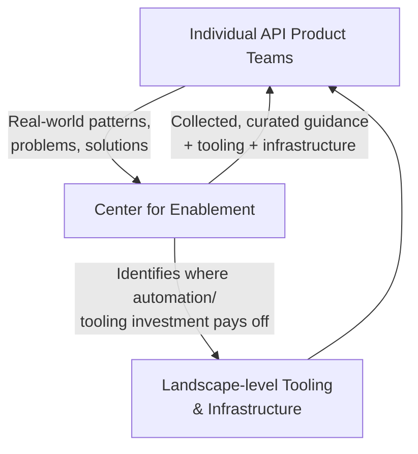

Just as important as *creating* guidance: the C4E is responsible for making sure that *following* the guidance never becomes a bottleneck. The ideal state I aim for is one where teams know the guidance, know how to track updates to it, and have enough internal skill plus C4E-provided tooling that compliance genuinely doesn't slow them down. Any bottleneck that does show up should get actively identified and resolved — the goal is making the "API" part of "building API products" as frictionless as it can possibly be.

> **Note:** I want to be honest that not everything can be fully automated away here. Some organizations operate under real regulatory or legislative requirements that mandate a human sign-off before release — those processes have to be followed as-is, and no amount of clever tooling changes that. But in my experience, these cases are genuinely the exception, not the rule, and shouldn't shape how you think about the *rest* of your guidance, which really should be built to be as frictionless to follow as possible.

### Engineering the Engineers: Chaos Monkey

I want to share one of my favorite examples of C4E-style thinking done really well: Netflix's famous **Chaos Monkey** tool. The underlying problem Netflix faced was that "write resilient code" is a genuinely hard requirement to actually *test for* — resilience is largely invisible until something actually breaks. Chaos Monkey's solution was elegant: deliberately simulate isolated, controlled failures across the infrastructure, and observe how services actually behave when those failures happen.

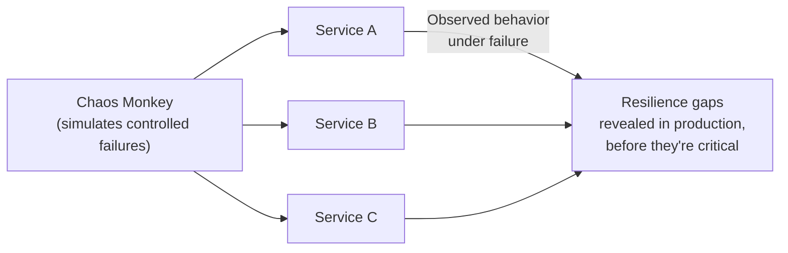

I think of this as a genuinely good example of what I'd call **engineering the engineers**: instead of just writing "your code must be resilient" into a guidance document and hoping people comply, Netflix built tooling that actively *reveals* non-resilient code before it becomes a real production crisis — a kind of continuous "testing in production" safety net that makes engineers more disciplined almost automatically, because the consequences of skipping resilience show up quickly and visibly, rather than lying dormant until a real outage exposes them.

This is exactly the kind of investment that lets a C4E scale gracefully as more and more APIs get designed and deployed — the more that can be automatically tested, the more the C4E's actual human attention can concentrate on the genuinely hard, judgment-requiring cases that automation can't fully resolve.

### The C4E's Two Customers

I like framing the C4E's job as balancing exactly two audiences at once: making it as easy as possible for API **teams** to create new products, and making it as easy as possible for API **consumers** to use APIs across the whole landscape. Because it sits right at that intersection, its most important ongoing job is continuously gathering feedback from both producers and consumers, and figuring out how to keep evolving the landscape to serve both groups well simultaneously.

### C4E Team Composition

Interestingly, the C4E doesn't necessarily start out as a dedicated, staffed team at all. In many organizations, it begins as a set of *responsibilities* distributed across existing API product team members — the same roles I've written about elsewhere (product manager, architect, lead engineer, and so on) simply taking on landscape-level thinking as part of their existing work. Over time, in larger organizations, it often genuinely does evolve into a real team with dedicated staff — but even then, its primary responsibility never really changes: **supporting product teams' delivery**, not directing it.

I really like how Kevin Hickey frames this shift: *"Instead of a centralized [Enterprise Architecture] group making decisions for the development teams, you are now an influencer and aggregator of information. Your role is no longer to make choices, but to help others make the right choice and then radiate that information."* That distinction — influencing and radiating information versus centrally *deciding* — is, I think, the whole difference between a C4E that actually enables teams and one that quietly becomes a bottleneck wearing an enablement label.

A couple of roles I've found tend to be genuinely unique to the landscape level, not showing up much at the individual team level:

**Compliance.** Many organizations need dedicated attention to regulatory and legislative compliance — tracking evolving requirements and ensuring the organization adjusts accordingly. At the API landscape level, this often means turning mandatory compliance requirements into concrete, testable guidance wherever that's genuinely possible, so compliance checking can become part of the normal delivery pipeline rather than a separate manual gate.

**Infrastructure and tooling.** Every "why" in the guidance structure I described earlier should ideally have at least one "what," one "how," and — where it's genuinely achievable — supporting testing infrastructure that helps teams verify their own compliance without needing to ask anyone. Building and maintaining that tooling is itself a genuine, ongoing role at the landscape level. One concrete example I've used a lot: **API linting** — automatically checking API descriptions (OpenAPI, AsyncAPI) against formalized rules, wired directly into CI/CD, so design guidance compliance gets verified automatically rather than caught in a slow, manual design review.

```javascript
// A small, illustrative linting rule the C4E might provide as shared
// tooling — checking that every API exposes a status resource,
// per the "API the APIs" pattern I've written about elsewhere.
function lintStatusResourceGuidance(openApiSpec) {
  const paths = Object.keys(openApiSpec.paths || {});
  const hasStatusPath = paths.some((p) => p.includes('/status') || p.includes('/health'));

  return {
    rule: 'must-expose-status-resource',
    passed: hasStatusPath,
    message: hasStatusPath
      ? 'Status resource found.'
      : 'No status/health resource found — add one per landscape guidance.',
  };
}

module.exports = { lintStatusResourceGuidance };
```

```javascript
// lint.test.js
const { lintStatusResourceGuidance } = require('./lint');

test('passes when a status path exists', () => {
  const spec = { paths: { '/orders': {}, '/status': {} } };
  const result = lintStatusResourceGuidance(spec);
  expect(result.passed).toBe(true);
});

test('fails when no status path exists', () => {
  const spec = { paths: { '/orders': {} } };
  const result = lintStatusResourceGuidance(spec);
  expect(result.passed).toBe(false);
  expect(result.message).toMatch(/No status\/health resource/);
});
```

Small pieces of shared tooling like this — built once by the C4E, run automatically by every team — are exactly what lets guidance compliance stay a lightweight, automated background check rather than a recurring source of friction.

---

## Maturity and the Eight Vs

Now I want to bring this all together with the framework I actually use to decide **where to invest**, at any given moment, in an evolving landscape. I've written elsewhere about the "eight Vs" of API landscapes — variety, vocabulary, volume, velocity, vulnerability, visibility, versioning, and volatility. Here, I want to revisit each one specifically through the lens of *maturity*: what does it mean to handle this dimension well, what's the risk of neglecting it, and what does a sensible investment strategy actually look like?

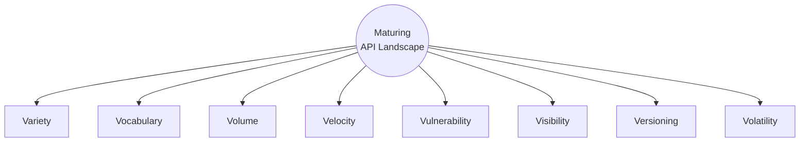

> **Note:** I want to flag something important up front: this "maturing landscape" model is genuinely different from the five-stage API *product* lifecycle I've written about elsewhere. Products have a real start and end — create, publish, realize, maintain, retire. The landscape itself has no such linear path and no end state; it exists purely to support the products living inside it, and it does that by continuously evolving alongside them, indefinitely.

### Variety

I think of variety maturity as sitting between two genuinely bad extremes. **No variety** means every problem gets forced through the same single pattern — Maslow's hammer, where "if the only tool you have is a hammer, everything looks like a nail," and that one hammer inevitably ends up a poor fit for at least some real problems. **Too much variety** produces what I'd call "precious snowflakes" — teams reinventing solutions to problems that already have perfectly good answers elsewhere in the landscape, leaving consumers with no coherent look-and-feel to rely on across APIs.

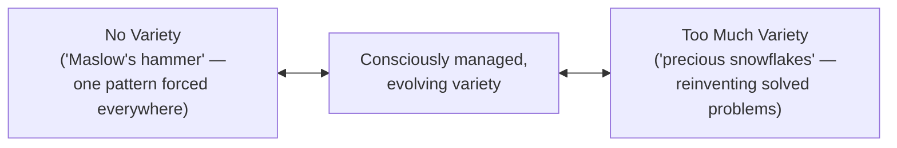

Here's the important reframe I've adopted: maturity for variety **isn't** measured by how *much* variety exists. It's measured by whether that variety is *consciously managed* — with current choices and their reasoning clearly documented, evolving deliberately as a genuine balance between promoting reuse and allowing new solutions when existing ones genuinely fall short.

**A worked example.** Say a new serialization format shows up that a few API designers are excited about, beyond the JSON/XML default most of the landscape already uses. A mature landscape doesn't need to make a sweeping, up-front decision about it — it can let a handful of APIs experiment with the new format first, without any landscape-level tooling investment yet (that's the experimental guidance stage I described earlier). If the experiment proves genuinely valuable, tooling and support investment follows *afterward*, as an incremental addition — not as a disruptive landscape rearchitecture.

> **Tip:** When evaluating any tooling or support investment, explicitly ask yourself: does this have a clear evolution path if variety increases later? Tooling that has no way to accommodate a plausible future variation isn't neutral — it actively becomes a constraint on the landscape's ability to grow, driven by a tooling limitation rather than by genuine value considerations.

### Vocabulary

Vocabulary maturity is fundamentally about handling the fact that domain models — and therefore the vocabularies APIs use to represent them — genuinely evolve over time. A customer model that starts with just basic personal information might later need to add social media handles; the real maturity question is how gracefully both old data (existing records without handles) and old code (applications with no built-in handle support) get handled through that evolution.

I've found two genuinely useful patterns for delegating vocabulary evolution *outside* individual APIs, rather than making every API team reinvent this wheel independently:

**External authority.** Language tags are the classic example — rather than an API maintaining its own static list of language codes, it can simply defer to the ISO 639 standard's list, which the ISO itself guarantees evolves in a strictly non-breaking way (existing tags never get removed or redefined).

**Landscape-level registry support.** Not every concept has a convenient external standards body already maintaining it. For those cases, the landscape itself can host and support registries — think of how the IETF manages more than 2,000 registries through IANA. Running a registry isn't an enormously complex undertaking, but it genuinely shouldn't fall on individual API teams to build and maintain independently; it's a natural landscape-level investment.

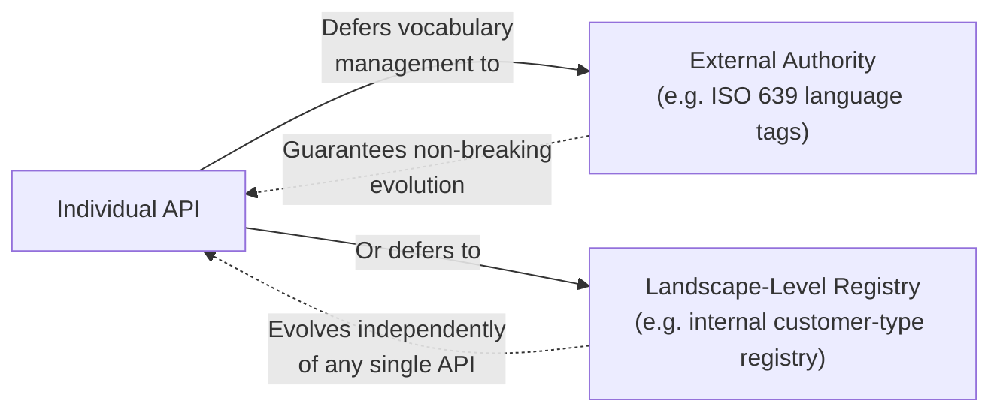

> **Caution:** Vocabulary maturity is genuinely harder to observe than most of the other Vs, because it's not always obvious *how* to make vocabulary usage visible across a landscape in the first place. I've found this is one of the areas where some real up-front investment in documentation tooling pays off specifically because it makes vocabulary evolution observable — but that only works if API teams actually find the documentation tooling useful enough to consistently use it, which itself might require first observing how teams are already documenting things informally.

### Volume

I want to challenge an intuition that I think trips people up here: **more APIs is not automatically better, but it also shouldn't automatically be treated as worse.** The maturity question for volume isn't "how many APIs should we have" — it's whether decisions about creating, changing, or withdrawing APIs are ever being driven by the landscape's inability to *handle* the resulting volume, rather than by genuine business need.

I think about volume maturity mostly in terms of classic return-on-investment thinking: things that don't make sense to automate at a small scale become obvious, worthwhile investments once the landscape crosses some real threshold — the point where solving the same problem manually, over and over, for every new API costs more than building shared support once.

> **Note:** Once volume genuinely drives investment in shared support or automation, a nice side effect emerges: APIs adopting that shared mechanism naturally become more similar to each other, which directly improves consumer understanding across the landscape — a form of coherence that emerges organically from volume-driven investment, rather than being separately mandated.

I'd also flag: that shared support or automation should never become the *only* allowed way of solving a problem. It should be something the C4E identifies and offers as part of the general platform, always genuinely replaceable once a better approach comes along — the "how" layer of guidance evolving, exactly as I described earlier.

### Velocity

Velocity maturity means API releases and updates can happen as needed, and the landscape can genuinely support a high rate of ongoing change. What I think is worth calling out specifically: velocity maturity has to *evolve itself* as the landscape grows. A small landscape can absorb a relatively high rate of change without much strain simply because the absolute number of changes stays small — but as volume grows in parallel with velocity, handling velocity well becomes a much bigger deal, and the combination of the two (rather than either alone) is really what drives the need for investment here.

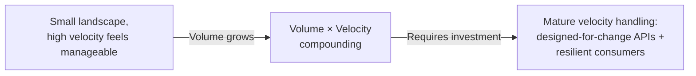

I try to hold two things in mind simultaneously when thinking about velocity: APIs need to be **designed for changeability** from the start (what that means concretely depends heavily on the API style, but simply asking teams "what's your extensibility roadmap?" is a great, low-effort first step toward building this into the design culture). And consumers need to build **resilience into how they consume APIs** — decoupling their own evolution from the API's evolution, rather than assuming today's interface shape is permanent.

One concrete lever for actually increasing velocity: reducing coordination overhead between implementations — adopting microservices as an implementation pattern is a common way of pursuing exactly this, since it lets individual components evolve and deploy without needing to synchronize with every other component's release schedule.

### Vulnerability

I think vulnerability genuinely stands apart from the other seven Vs, because it carries meaningfully more inherent risk. Having zero APIs means zero API-related vulnerability by definition — and every single API added from that point onward is a new potential vulnerability. Accepting that plainly, rather than downplaying it, is the real first step toward maturity here.

A concrete example I've seen become an increasingly serious concern: **personally identifiable information (PII) exposure**. As APIs proliferate, so does the risk of PII leaking out through them — sometimes without any single team fully realizing it, because information that looks sufficiently anonymized *in isolation* can become de-anonymizable once it's combined with complementary information available through *other* APIs elsewhere in the landscape. That's a genuinely landscape-level risk, not something any single API team can fully assess on their own, however careful they are.

The EU's GDPR is a very concrete illustration of the stakes here — it requires organizations to know what PII they hold and make it available on request, which has real, sometimes complex operational consequences for any API product that touches PII, scaled by the size and maturity of the organization involved.

> **Caution:** Steve Yegge's famous "Google Platforms Rant" has a line I think about often in this context: *"Every single one of your peer teams suddenly becomes a potential DOS attacker. Nobody can make any real forward progress until very serious quotas and throttling are put in place in every single service."* Decentralization genuinely introduces new failure modes that a more centralized architecture would have avoided by default — vulnerability maturity means actively accounting for that shift, not assuming decentralization is a free lunch on the security and robustness front.

I've found the maturity approach here needs to be a bit more prescriptive than the other Vs, precisely because of the elevated risk — landscape-level observation should more actively lead to concrete action, rather than staying purely advisory the way it might for, say, variety.

### Visibility

Visibility maturity connects directly back to the "API the APIs" principle: everything necessary to understand or manage an API in the landscape should be exposed *through the API itself*. I think the deepest version of this principle is actually about **encapsulation** — an API is supposed to be the complete, sole interface to a component. Any path *around* that, even one used purely for "internal" purposes, quietly undermines the whole landscape approach.

This is precisely the spirit behind Jeff Bezos's famous internal API mandate at Amazon, which ends with the blunt line: *"Anyone who doesn't do this will be fired."* One sneaky way encapsulation gets violated without anyone quite noticing: shared libraries. It's tempting to think of using a shared library as fundamentally different from creating an "API-level dependency," but I don't think that distinction actually holds up — especially when the library is shared across multiple API products or implies a genuine runtime dependency on some other component. I've found it genuinely useful to treat shared libraries with the same dependency-visibility discipline as any other API, precisely to avoid dependency management problems quietly creeping back in through a side door that isn't visible or managed at the API landscape level at all.

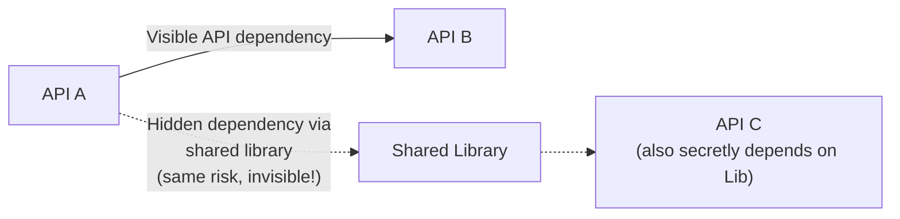

There's a genuinely nice feedback loop once visibility matures well: whatever gets made visible at the individual API level directly feeds landscape-level discoverability. If APIs expose their dependencies clearly (treating all dependencies, including shared libraries, as genuine API dependencies), that information can build a real dependency graph across the whole landscape — and from there, derive higher-level insights, like computing which APIs are most heavily relied upon.

### Versioning

I've covered the philosophy of preferring "soft" versioning over "hard" versioning elsewhere, so here I want to focus specifically on how this plays out differently across API styles, because I think that nuance matters and often gets flattened.

| API Style | What Versioning Actually Applies To |
|---|---|
| Tunnel, Resource, Hypermedia | Changes to the procedure/resource interaction interface itself |
| Query | Not the query language itself, but disciplined schema management so existing queries keep working |
| Event-based | Message design — consumers need robustness to treat new message shapes gracefully rather than rejecting them outright |

I also want to name a real strategic fork here, because I don't think there's a universally correct answer: **promise-stable-forever** (Salesforce's approach, running many parallel versions indefinitely — high value to consumers, real ongoing operational cost for the producer) versus **disciplined-change-without-permanent-stability-promises** (closer to Google's approach — lower operational complexity, but a real risk that some consumers get the transition wrong). Neither is objectively "more mature" — the right choice depends on what your specific consumers actually need and what your organization can operationally sustain.

> **Note:** I'll flag something that surprised me when I first ran into it: even a widely-adopted standard like OpenAPI has no built-in model of "versions" or "differences" between versions. It's genuinely still early days for standards and tooling in this specific space — which means, for now, landscape-level guidance and tooling around versioning is where most of the real maturity gains have to come from, rather than from any off-the-shelf standard doing the work for you.

### Volatility

Volatility maturity is fundamentally about changing *developer mindset*, not just technology. Developers coming from a more traditional, integrated/monolithic environment tend to carry over overly optimistic assumptions about component availability — assumptions that simply don't hold in a genuinely decentralized landscape. When something breaks in that environment, tracing the actual root cause often means following a path through multiple services, a fundamentally different debugging discipline than instrumenting and stepping through a single monolithic codebase.

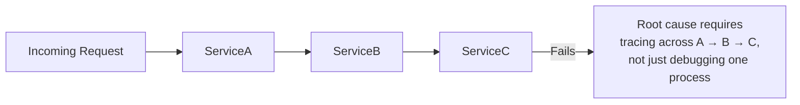

The maturity strategy here centers on two things working together: the ability to actually **trace** problems across a genuinely decentralized system (tracing infrastructure isn't optional — it's foundational to being able to operate a volatile landscape responsibly at all), and shifting development practice toward genuine resilience — graceful degradation, defensive coding, treating dependencies as inherently unreliable rather than assuming they'll always be there.

> **Caution:** I want to be direct about something: volatility is exactly the kind of problem that's easy to defer, right up until it very much isn't. It tends to spiral quickly once a landscape's growth and change rate really start accelerating — and, almost by definition, that's precisely the worst possible moment for landscape-wide reliability problems to first show up in force. I'd genuinely treat investing in volatility handling as one of the earliest priorities in a landscape's maturity journey, not something to circle back to "once things settle down" — because in a genuinely healthy, growing landscape, things never really settle down.

---

## Bringing It All Together

If I had to compress this entire post into one operating principle, it's this: **treat guidance, the team that stewards it, and the eight Vs as three layers of the same continuous, never-finished practice — not three separate projects with separate finish lines.** Guidance gives me a structured, evolving way to communicate why something matters and how to actually do it, with testability baked in wherever I can manage it. The Center for Enablement gives that guidance a genuine steward — one whose job is enabling teams rather than gatekeeping them, learning from real patterns in the field rather than dictating from a conference room. And the eight Vs give me eight honest, ongoing dials to keep observing and tuning, each with its own genuinely different maturity story, rather than a single flattening "maturity score" that would hide far more than it reveals.

None of this ever reaches a finish line, and I've made my peace with that. A landscape's value isn't measured by whether it's "done" — it's measured by how well it keeps supporting the products built on it, and how well those products keep serving the people who depend on them, as both keep changing, indefinitely, together.
