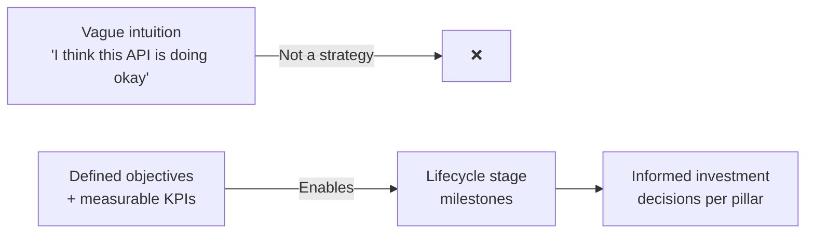
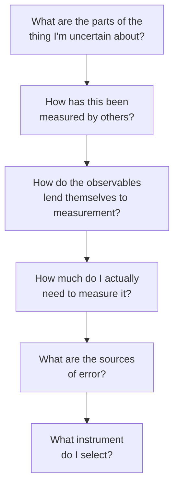
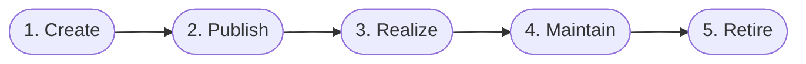
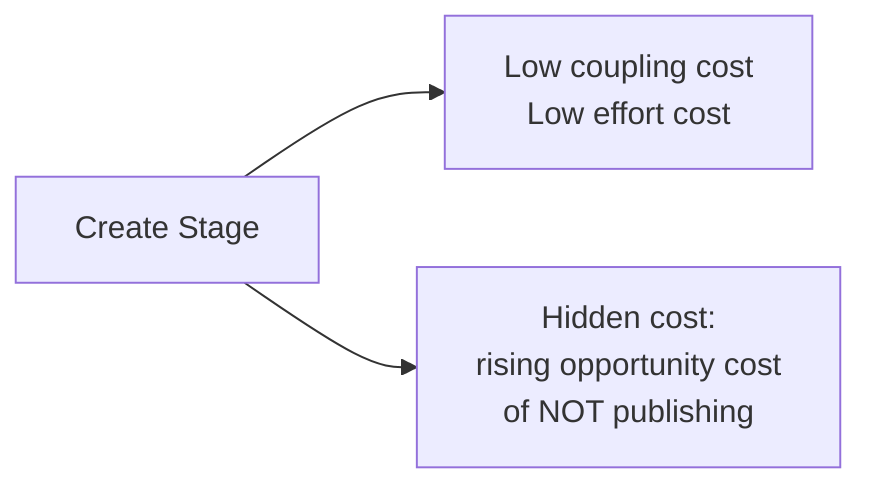
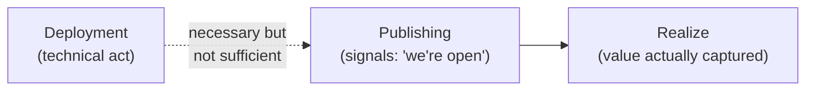
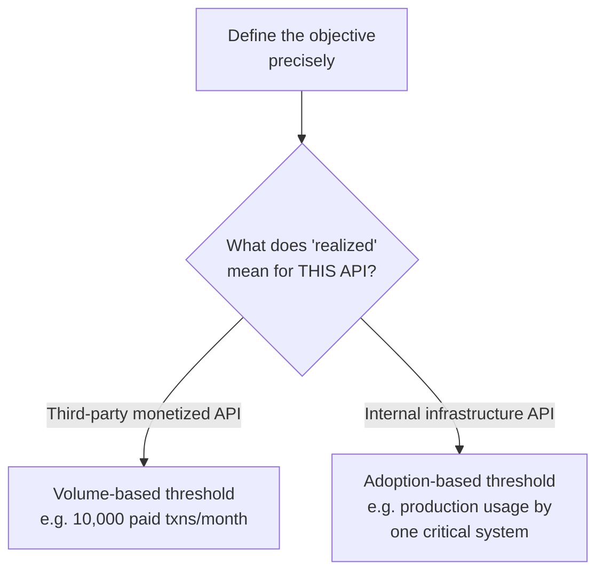
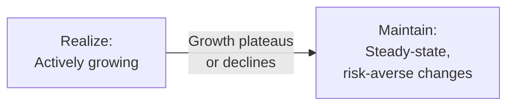
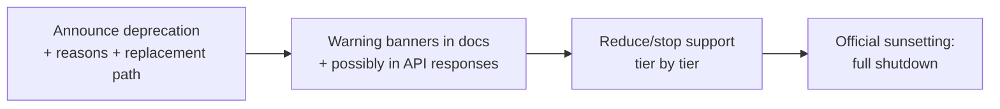

# The API Product Lifecycle: How I Track Whether My API Is Actually Growing Up

There's a line attributed to Chili Davis that I think about more than I probably should for a baseball quote: *"Growing old is mandatory; growing up is optional."* I bring this up because it's a surprisingly good description of what happens to APIs left unmanaged. Every API "ages" — time passes, the code gets older, dependencies drift, requirements shift around it. But *maturing* — actually getting better, more valuable, more trustworthy over time — that part is optional. It only happens if I deliberately manage it.

This post is about the framework I use to manage that maturity: the API product lifecycle. It's a five-stage model — create, publish, realize, maintain, retire — that helps me answer two questions I used to answer purely by gut feeling: *"How healthy is this API right now?"* and *"Where should I actually be spending my limited time and attention on it?"*

Before I can walk through the five stages, though, I need to cover the foundation the whole model sits on: how I actually measure an API's progress in the first place. Vague intuition ("I feel like this API is doing well") isn't a management strategy. So let's start there.

---

## Why I Can't Skip Measurement

Here's a genuinely uncomfortable truth I've had to accept: the cost of changing an API isn't a fixed number. It shifts depending entirely on context. An unused API has almost zero coupling cost — nobody's out there depending on it, so I can change anything I want. The exact same API, once it has hundreds of consumer applications relying on it, carries a massive coupling cost for the same kind of change.

And it gets messier than that single example suggests. What if my API has only one consumer, but that consumer happens to be a major business partner? What if I've got thousands of registered developers, but none of them are actually driving revenue? What if the API is profitable today but no longer fits where the business is actually headed? Each of these is a genuinely different management situation, even though on paper they might look similar (say, by usage count alone).

Given that complexity, I want a way to reason generically about API maturity without needing to hand-tailor a bespoke framework for every single API I own. That's exactly what the product lifecycle gives me — a shared vocabulary and structure — but making it *actually work* for my specific context requires me to define real measurements first.



### OKRs and KPIs, Demystified

I want to demystify two terms that get thrown around with a lot of unnecessary mystique: **KPIs** (key performance indicators) and **OKRs** (objectives and key results).

A KPI is nothing fancier than a carefully-chosen piece of data collection that tells me how well something is performing. The word "key" is doing real work in that acronym — the actual skill isn't collecting data (that's easy, arguably too easy), it's identifying the *smallest* set of measurements that gives me the *most* insight. Two KPIs for a call center team, for instance, might be abandoned-call count and average caller wait time. That's a small, sharp set of numbers that genuinely drives management decisions, rather than a giant dashboard nobody actually looks at.

OKRs sit one level up. They force an organization to answer two blunt questions: *"Where do we want to go?"* (the objective) and *"What will it actually take to get there?"* (the key results). I've seen people argue heatedly about whether OKRs replace KPIs or complement them — honestly, I don't think that argument matters much in practice. What matters is that OKRs represent a genuine, deliberate attempt to link an organization's cascading goals with the concrete results needed to hit them.

> **Note:** LinkedIn's Jeff Weiner has talked about OKRs specifically as *stretch* goals meant to create urgency and shared focus, not just a restated plan. I think that distinction matters: an OKR that's really just a checklist item dressed up in OKR formatting isn't doing the job it's meant to do.

I want to be honest about something: I'm not going to tell you that you *need* to hire an OKR consultant or run a formal OKR program to manage your API well. What actually matters is the underlying discipline — having clear objectives and measurable data to track your product's progress. OKRs and KPIs are just two well-documented, widely-supported vocabularies for building that discipline; use them, adapt them, or replace them with something else that fits your org's culture. The discipline is what counts, not the specific acronym.

### Defining an API's Objective

Whatever objective I set for a specific API needs to genuinely connect to my organization's broader strategic goals. It doesn't need to be *identical* to the organization's top-level goal, but achieving my API's objective should visibly move that bigger goal forward. If I can't draw that line clearly, something's off — either my API's objective is disconnected from anything the business actually cares about, or I haven't done the work to understand the organization's strategy in the first place.

I find it useful to keep a mental menu of common API objective types, because it's easy to default to "usage" as the only goal worth measuring, when there's actually a much richer set of options:

| Goal Type | Description |
|---|---|
| **API usage** | Reach a target number of invocations per period |
| **API registration** | Reach a target number of new or total registrations |
| **Consumer type** | Attract a specific *kind* of consumer (e.g., banks, enterprise customers) |
| **Impact** | Produce a measurable positive business impact (e.g., % lift in product purchases) |
| **Ideation** | Harvest new business ideas or models from third-party API usage |
| **Revenue** | Generate new revenue directly tied to the API's business model |
| **App ecosystem** | Grow the number of applications built on top of the API |
| **Internal reuse** | Increase the number of internal teams reusing an internal API |

> **Caution:** I can absolutely mix goals — say, both usage *and* consumer type — but every objective I stack on top of another one reduces how sharply I can optimize the design toward any single one of them. I've learned to resist the urge to load an API up with five simultaneous objectives just because they all sound good; a focused goal produces a focused, well-optimized API, and a scattered set of goals tends to produce a scattered, mediocre one.

### Turning a Goal Into Something I Can Actually Measure

A goal that can't be measured isn't really a goal — it's an aspiration, and aspirations don't drive decisions the way real goals do. I lean heavily on a set of questions from Douglas Hubbard's *How to Measure Anything*, adapted to the API world, whenever I'm trying to turn a fuzzy objective into something concrete:



Walking through these in my own words:

- **Decompose the uncertain thing.** "Developer satisfaction" is hopelessly vague on its own, but I can break it into things I actually *can* measure — support ticket volume, referral rate, documentation ratings.
- **Learn from how others measured similar things.** I don't need to reinvent developer-experience measurement from scratch — general UX research, product management metrics, and OKR/KPI practice from other domains all transfer reasonably well.
- **Figure out how the pieces actually lend themselves to measurement.** For something like support requests, this means literally mapping out every channel — email, social, phone, in-person — because if I'm only tracking one channel, I'm not really measuring the whole picture.
- **Calibrate effort to importance.** A perfect measurement system is possible with infinite budget, but do I actually need it? An API only I use internally deserves a much smaller measurement investment than a revenue-driving public API.
- **Watch for sources of error.** Are my tools reporting correctly? Am I missing data from some channel? Did I decompose the original fuzzy goal into the *right* measurable pieces, or just convenient ones?
- **Pick the actual instrument.** This is where I land on a concrete KPI and the monitoring implementation (tying directly back to the monitoring pillar) that will keep collecting that data going forward.

With that measurement foundation in place, I can finally talk about the five stages themselves — because none of them mean anything without a way to actually detect when I've crossed from one into the next.

---

## The API Product Lifecycle: An Overview

I borrow the shape of this model from the classic general product lifecycle — development, growth, maturity, decline — and adapt it specifically for APIs into five stages:



I want to flag one distinction up front that took me a while to internalize clearly: the **product lifecycle** and the **release lifecycle** aren't the same thing, and confusing them causes real confusion down the line. The release lifecycle is the individual sequence of steps I go through to ship a single change. The product lifecycle is a *superset* of all those individual releases — each stage of product maturity will typically contain many, many individual releases inside it. Shipping a release doesn't, by itself, push an API into the next lifecycle stage. Releases are the day-to-day work; lifecycle stages are the bigger arc that work adds up to over time.

Let's walk through each stage.

---

## Stage 1: Create

An API is in the create stage when:

- It's brand new, or replacing an API that no longer exists.
- It hasn't been deployed to production.
- It hasn't been made available for any kind of reliable, real use.

Every API starts somewhere — someone in the organization decides a needed API doesn't already exist and should be built. The create stage is where I need to get brutally honest about *why*: am I trying to sell access? Enable faster app development downstream? Just move data around efficiently? Getting a clear answer here shapes everything else — the goals, the values I'm optimizing for, and who I'm actually building this for.

### The Freedom (and Hidden Cost) of This Stage

Here's what makes the create stage special, and genuinely valuable: it's the point of **maximum changeability**. Nobody's built anything against my interface yet, so coupling costs are essentially zero. Effort costs are low too — a bug introduced now has essentially no blast radius, because nobody's relying on the thing yet.



But there's a real trap hiding in that freedom, and I've fallen into it myself: the *opportunity cost* of staying in the create stage too long keeps rising the longer I sit there. It's tempting to keep polishing the design "while it's still safe to change," but if other teams or partners are depending on this API existing in order to do *their* own work, every extra week I spend perfecting the design is a week they're blocked. I've come to genuinely believe: **publishing a good API today is usually better for the business than publishing a great API next quarter.**

So how long should I actually stay in create? My rule of thumb: prioritize locking down the parts of the API that are *least* changeable later — especially the core interface model, if I'm building something CRUD-style over HTTP. If I under-invest in getting that model robust and extensible now, the coupling costs I'll pay later, once real consumers exist, will dwarf whatever time I "saved" by rushing.

> **Note:** The create stage is also when I need to assemble the team that's going to shepherd this API through its life. I can absolutely add or remove people as complexity grows, but the initial team's size, skill mix, and culture has an outsized influence on the product that eventually emerges — it's worth getting deliberate about this early rather than treating team formation as an afterthought.

### Defining the "Create" Milestone

I need a shared, explicit understanding of what it actually takes to kick off an API product's lifecycle — otherwise I risk wasted investment in products that were never worth building in the first place. This can be as lightweight or as formal as fits my org: maybe every new API needs an explicit strategic goal signed off before design work starts (a centralized gate), or maybe the rule is simpler — anyone can propose an API, but it only moves forward if three other people commit real time to it.

### Bringing Citizen Developers Into the Create Stage

Most API design methodologies I've encountered historically centered entirely on technical stakeholders — developers, architects, and nobody else. I think that's a real gap, because more and more business stakeholders are directly involved in shaping API programs today, and it's worth deliberately including them as genuine participants — sometimes called "citizen developers" — rather than treating them as a downstream audience who just receives whatever gets built.

One method I find genuinely useful here (adapted from Arnaud Lauret's *The Design of Web APIs*) is structuring a collaborative conversation around five simple questions, answered together by business and technical stakeholders:

| Category | What It Captures |
|---|---|
| **Who** | The user or role involved |
| **What** | The action they want to take |
| **How** | The mechanism for doing it |
| **Inputs** | What data/sources feed into it |
| **Outputs** | What they get back, and how they use it |

For REST APIs specifically, I map these onto concrete design elements: "What" becomes the resource and its path; "Who" becomes authorization and access control; "How" becomes the HTTP verb (GET, POST, PUT, PATCH, DELETE); "Inputs" become request parameters or body fields; and "Outputs" become the response shape.

**A worked example**, walking through a banking-app scenario:

| Who | What | How | Inputs | Outputs |
|---|---|---|---|---|
| Banking app user | Buy a financial product | Search for a product to subscribe to | Financial product marketplace | Product (to subscribe) |
| Internal developer | Update product offerings | Add a product to the marketplace | Product description, features, icon, name (from a product manager) | Updated product description marketplace |

What I like about this exercise is that it forces both sides — the businessperson describing needs in plain English and the technical person translating that into machine-readable specification — into the *same conversation*, at the *same time*, instead of a game of telephone across a requirements document. I'll flag that this isn't the only design methodology out there — things like the APIOps Request/Response Canvas (and its event-driven cousin, the API Design with Events Canvas) tackle the same problem from slightly different angles — but I've found the Who/What/How framing genuinely sticky and easy to teach to non-technical collaborators.

---

## Stage 2: Publish

An API is in the publish stage when:

- An instance has actually been deployed to production.
- It's been made available to at least one developer community.
- Its strategic value hasn't been realized yet.

Publishing is the "we're open for business" moment. I want to be precise about something here: **deployment and publishing are not the same event.** I can absolutely deploy a prototype during the create stage without declaring it ready for real use — publishing specifically means I've signaled, deliberately, to my target user community that the API is genuinely open and ready.



What "publish" looks like concretely depends heavily on context. For a public, third-party-facing API, this means making it genuinely discoverable and usable by external developers. For an internal API, it might mean adding it to the enterprise catalog. For an API supporting a single internal application, it might be as simple as an email telling the team it's stable and ready to integrate against.

### Potential Value vs. Realized Value

I like the shop metaphor here: publishing means I've opened my doors, but I haven't necessarily sold anything valuable yet. Publishing unlocks the *potential* for value — it doesn't guarantee it. Building it does not, by itself, mean my target audience shows up.

How far apart "publish" and "realize" end up depends on how ambitious my realization goal is and on context — an internal API I fully control might realize value almost immediately, while a public API aimed at third-party developers requires real patience and sustained investment. Either way, my job in this stage is to actively shrink that distance as much as I responsibly can.

### The Publish Stage's Interesting Changeability Loophole

Here's a subtlety I think is genuinely useful and slightly counterintuitive: because your primary value-generating users haven't fully activated yet in the publish stage, you *can* often afford to make more impactful, experimental changes here than you'd feel comfortable making later — precisely because there's no established realized value at risk of being disrupted yet. Some organizations deliberately treat this as a window for taking bigger design risks and running real experiments.

> **Caution:** Don't let that freedom turn into recklessness. Existing early consumers, even ones not yet delivering realized value, are still forming their first impressions of your API's reliability. Too many disruptive changes, or an instance that's frequently down, sends a strongly negative signal to exactly the audience you're trying to convert into realized users. The freedom in this stage is real, but it's not unlimited — weigh it against your API's competitive context and how forgiving your target audience is likely to be.

### Milestones for the Publish Stage

I define readiness triggers like:

- The API has been promoted to a production environment.
- The API's public-facing site or portal has gone live.
- The API has been registered in the internal or public catalog.
- Availability has been formally announced.

Alongside that, I track early usage signals — registrations, invocation counts, documentation page views — specifically to gauge how much risk I'm actually carrying if I make an impactful change this early.

### Writing API User Stories

A method I've found genuinely practical in this stage is adapting the classic Agile user story format — *"As [persona], I want [action] so that [goal]"* — specifically for API design, with one important twist: **I aim for fewer API-level user stories than client-application-level user stories.**

The reasoning is straightforward once you see it: if I write one API endpoint for every single client feature 1-to-1, I end up with an overly granular API that's tightly coupled to one specific UI, and I lose the reusability that makes a good API valuable in the first place.

**The trap — one API story per user story:**

| API user story | Client user story |
|---|---|
| As a developer, I want to access users' LinkedIn accounts so I can sign them up. | As a user, I want to connect with a contact via their LinkedIn profile details. |
| As a developer, I want to enable photo upload so I can display it in the profile UI. | As a user, I want to choose my profile photo so I'm recognizable in the app. |

**The better pattern — one API story serving multiple user stories:**

| API user story | Client user stories it serves |
|---|---|
| As a developer, I want to access a user's LinkedIn account via OAuth 2.0. | (1) Connect with LinkedIn to sign up in two clicks. (2) Import LinkedIn posts into my profile. |
| As a developer, I want to enable photo upload for profile display. | (1) Choose my profile photo. (2) Update my profile photo later. |

Notice how the second pattern reuses a single, well-designed API capability across multiple distinct client-facing features. That reusability is exactly the design quality I'm chasing during this stage.

### Opening the API to Third Parties

If I'm taking an internal API and opening it to external partners or third-party developers, I need a genuinely separate round of user-story discovery — because external consumers will often want to build entirely different features than my original internal client ever needed. This is where I go do real outreach — interviews, ecosystem research — to uncover needs I wouldn't have guessed at from inside my own organization.

A concrete extension of the earlier example:

| API user story | User story |
|---|---|
| As a third-party fintech app developer, I want to access the user's photo for identity verification. | As a third-party fintech app user, I want to validate my identity so I can create an account. |
| As a third-party social network developer, I want to access the user's photo to fill in profile info. | As a third-party social app user, I want to validate my identity so I can create an account faster. |

This kind of outreach-driven discovery is only really *possible* once I've actually published — it's the publish stage's unique gift: real, external feedback replaces internal guesswork.

---

## Stage 3: Realize

An API is in the realize stage when:

- A published instance exists and is actively available.
- It's being used in a way that genuinely fulfills its stated objective.
- Realized value is generally trending *upward*.
- Breaking it now would meaningfully hurt real users' operational efficiency.

This is the stage every API product owner is ultimately working toward. Up until now, the API has only offered *potential* value. Realize is where that potential becomes actual, measurable, delivered value.

### Defining "Realized" Is Genuinely Hard — and Genuinely Contextual

The tricky part of this stage isn't hitting the goal — it's precisely *defining* what "realized" even means for a given API, which requires me to already have a sharp, well-understood objective (tying straight back to the measurement work at the start of this post).

Two worked examples that show just how differently "realized" can look:

**A monetized, third-party payments API** might define realization as processing 10,000 paid transactions per month. If I've got 6,000 developers registered but only 5,000 payment requests landing per month, that's an unambiguous signal: not yet realized, despite the healthy registration numbers.

**An internal payments API** inside a bank's own architecture might have a completely different bar: realization is hit the moment the online banking system actually starts routing real payment processing through it in production — *regardless of raw volume*. Registration counts don't even factor into it.



> **Note:** The realization goal isn't static — it has to be revisited as the underlying business context shifts. If my third-party payments API pivots from a broad developer audience toward an enterprise-only strategy, my realization milestone needs to change with it — something like "handle 500 payment requests from a Fortune 500 partner" instead of a raw volume number aimed at a mass market.

### The Value Proposition Interface Canvas

For sharpening exactly *what* value my API delivers, I like a method from Andrea Zulian and Amancio Bouza's *API Product Management* — the **Value Proposition Interface (VPI) Canvas**, adapted from Osterwalder's classic Value Proposition Canvas. It has two halves: a **customer profile** (their jobs, pains, and gains) and a **value proposition map** (my relevant systems, data, and processes, translated into pain relievers and gain creators).

I walk it in two passes — once from the pain angle, once from the gain angle:

**Pain-side pass:**
1. What jobs does the customer need to get done?
2. Why are those jobs painful — and have I actually validated that with real customers, not just assumed it?
3. What data sources, apps, or processes are involved?
4. What features of my API relieve that pain?
5. How do those features translate into concrete API resources and methods?

**Gain-side pass:** the same five steps, reframed around what creates genuine gains rather than just relieving pain.

> **Caution:** Zulian and Bouza make a point I think is easy to skip past too quickly — a "gain" isn't automatically legitimate just because it's the positive-sounding flip side of a pain you already identified. Real gains need their own validation with actual customers, not just optimistic rephrasing of the pain-relief story.

### Milestones for the Realize Stage

This is where OKRs and KPIs earn their keep the most. I need to be clear on who my target user actually is (even if "anyone and everyone" is a legitimate answer for some APIs), and I need engagement-level measures that tell me whether usage has crossed from "technically happening" into "legitimately realizing the objective." This is also where I lean most heavily on everything I built in the monitoring pillar during the publish stage — the instrumentation work pays for itself here.

---

## Stage 4: Maintain

An API is in the maintain stage when:

- It's still being actively used by consuming applications.
- Realized value has gone flat, or started trending downward.
- It's no longer being actively improved in pursuit of growth.

Every growth curve eventually flattens. When mine does, the API has entered a steady-state phase, and my whole management posture needs to shift accordingly.



### A Different Kind of Change

Changes are still happening in this stage, but their *purpose* has shifted. I'm no longer chasing new users — I'm keeping the lights on for the ones I already have. That means bug fixes, modernization work, and compliance-driven changes, but very little that's specifically aimed at growth.

I've learned to be genuinely risk-averse here. Any large, invasive change risks disturbing the value I'm already realizing from existing users, and if a big change really is unavoidable, I'll often treat it as effectively re-entering the publish stage (frequently via a new version) rather than trying to force it into the maintain stage's steady-state posture.

> **Caution:** The maintain stage is where I've personally seen teams get tempted to sneak "just one more feature" in because a team still exists and still has capacity. Resist this. A maintain-stage API absorbing growth-stage-style feature work is a sign the lifecycle stage boundaries have gotten blurry, and it usually means untracked risk is creeping back in exactly where I've decided I want to minimize it.

### Milestones for Maintain

These milestones are inherently trend-based, built directly on top of whatever growth measure I defined back in the realize stage. If I had a six-month rolling user-growth metric during realize, I watch that same metric for stagnation or decline — that's my signal I've crossed into maintain. I need to decide, deliberately, what threshold and what time window actually count as "stagnation" for my specific API, because there's no universal number that works across contexts.

### Self-Service and Automation

The core economic goal of the maintain stage is simple to state and hard to execute well: **keep realized value as high as possible while driving ongoing cost as low as possible.** Two levers dominate here.

On the **consumer side**, the goal is maximizing self-service autonomy. With genuinely good developer experience, users should be able to sign up, securely get credentials, read docs, test the API, provision their own environment, and follow use-case tutorials — all without ever needing a human on my side to hold their hand. Organizations with top-tier developer experience report that more than 90% of their users successfully integrate without any one-on-one support at all. That's the bar I try to keep in mind.

On the **provider side**, the goal is reducing my own operational cost — through mutualized infrastructure and heavy automation. This is exactly where a DevOps or APIOps toolchain pays real dividends: automated testing, documentation generation, deployment, and security patching all reduce the manual effort required to just keep an API healthy and current.

```javascript
// A tiny illustrative example of the kind of automated
// health-check job I'd run continuously during the maintain stage —
// this is exactly the sort of self-service + automation investment
// that keeps operational cost down without needing a human to watch it.
const axios = require('axios');

async function checkApiHealth(apiUrl) {
  try {
    const start = Date.now();
    const res = await axios.get(`${apiUrl}/health`, { timeout: 5000 });
    const latencyMs = Date.now() - start;

    return {
      healthy: res.status === 200,
      latencyMs,
      timestamp: new Date().toISOString(),
    };
  } catch (err) {
    return {
      healthy: false,
      error: err.message,
      timestamp: new Date().toISOString(),
    };
  }
}

module.exports = { checkApiHealth };
```

```javascript
// health-check.test.js — quick sanity test using a mocked healthy endpoint
const nock = require('nock');
const { checkApiHealth } = require('./health-check');

test('reports healthy status with latency for a responsive API', async () => {
  nock('https://api.example.com').get('/health').reply(200, { status: 'ok' });

  const result = await checkApiHealth('https://api.example.com');

  expect(result.healthy).toBe(true);
  expect(typeof result.latencyMs).toBe('number');
});
```

It's a tiny example, but the point stands at any scale: automated, self-running checks like this are exactly the kind of low-cost, low-human-effort investment that lets a maintain-stage API stay healthy without consuming disproportionate ongoing attention.

Once the API is in this stage, it's also worth noting that it typically becomes part of a broader *portfolio* under one product manager's care, rather than commanding a fully dedicated owner the way it might have during realize. That shift in organizational attention is itself a signal that the maintain stage has its own distinct management rhythm.

Eventually, the value-to-cost ratio inverts — maintenance costs exceed the value still being generated. That's the signal it's time to retire.

---

## Stage 5: Retire

An API is in the retire stage when:

- A published instance still exists and is available.
- Its realized value no longer justifies the ongoing maintenance cost.
- An explicit end-of-life decision has actually been made.

I want to underline something important about the language here: entering the retire stage means the API **needs to be removed**, not that it's *already* gone. There's real, deliberate work involved in getting from "we've decided to retire this" to "it's actually fully retired," and skipping that work is where a lot of pain gets introduced for users who depended on the thing.

### Deciding What "Retirement" Actually Means

Retirement can mean a few genuinely different things, and the product team gets to decide which one fits: it might mean fully removing every instance from production, or it might just mean marking the API "deprecated" — no further changes, no further support, but still technically running. The right choice usually comes down to weighing the ongoing cost of keeping something limping along against the disruption of removing it outright.

This decision gets genuinely hard when real people depend on the thing. For internal APIs, an owner might be flatly forbidden from removing an instance out of fear of the unplanned downstream work it would trigger elsewhere in the organization. For public APIs, there's real brand and trust risk in visibly yanking away something people built on.

> **Note:** I try to actively reframe retirement, in my own head and to my team, as a *healthy, natural* part of the continuous-improvement cycle across an entire API landscape — not as a failure or a mistake. An API that gets cleanly retired after genuinely serving its purpose is a success story, not a black mark.

### Milestones for Retire

These milestones represent either a **floor** (a minimum usage or value threshold, below which the API gets slated for retirement) or a **ceiling** (a maximum acceptable maintenance cost, above which retirement kicks in). Google is famously aggressive about this — willing to retire products that don't hit specific, ambitious growth targets within a defined window. That kind of aggressive floor makes total sense for a strategy chasing massive user growth; it would be a genuinely bad fit for, say, an internal authentication API that's never going to have "hundreds of thousands of active users" as a meaningful concept. The actual threshold has to be set based on your specific API's situational context — there's no universal number here either.

### Retiring an API Without Breaking Everyone's Application

This is the part of retirement I think deserves the most care, because a badly-handled retirement genuinely damages trust with your developer community — sometimes lasting well beyond the specific API involved.

**Deprecation vs. sunsetting — these aren't the same word.** Deprecation means declaring an API no longer recommended for continued use, typically because a replacement now exists. Sunsetting means the actual, final shutdown of the API and its instances. A responsible retirement process treats these as two clearly separated milestones, not one event.



I try to give a real, honest roadmap: an announcement well ahead of time, explaining *why* and pointing at the replacement path. That gives both technical and business teams on the consumer side real runway to plan. Concrete milestones along that roadmap might include: SLA commitments stop being honored, support ends for lower support tiers first, warning banners appear in the documentation portal, and — for teams who want to be extra thorough — deprecation warnings get embedded directly into API responses themselves, so developers get alerted through their own running code, not just through docs they may never revisit.

### The "Write Once, Run Forever" Alternative

Some companies — Stripe and Salesforce are the names that come up most often — famously promise they'll essentially never break or retire APIs, following what's sometimes called a "write once, run forever" policy. The mechanism behind that promise is refreshingly literal: they genuinely keep *every* version running, indefinitely. That's a real strategic choice, and it's not free — it requires an ongoing willingness to absorb the support burden of maintaining old versions forever.

Most organizations can't sustain that. If I can't commit to running every version forever, API management analytics become my best tool: I can see precisely which users and applications are consuming which version of my API. That visibility lets me genuinely understand the *impact* of deprecating a given version — is it my biggest customer? A critical internal system? Once I've mapped that out, I can manage the relationship like a human relationship rather than a blunt policy announcement: talk directly to the stakeholders who'll actually be affected, walk them through the roadmap, and discuss real alternatives together.

With enough advance notice and the right incentives, usage on the soon-to-be-retired version should organically decline as people migrate. If some consumers genuinely won't move even with good notice, I've got real options — for external APIs, raising the price of continued support on the old version (a tactic Microsoft has historically used with older Windows versions for corporate customers) creates a financial nudge toward migration. For internal APIs, this can be handled more directly — ending SLA guarantees, or simply a managerial decision mandating the upgrade.

---

## Mapping the Lifecycle Onto the Ten Pillars

Here's where this all becomes genuinely actionable for me day to day. I've written before about the ten pillars of API work (strategy, design, documentation, development, testing, deployment, security, monitoring, discovery, and change management), and one of the most useful things the lifecycle model does is tell me **which pillars deserve the most attention at each stage.**

> **Note:** I want to be careful about how I frame this — every pillar matters in every stage, at least a little. What differs is *emphasis*. Think of this as a guide for where to point your limited time and energy first, not a permission slip to fully ignore anything.

| Pillar | Create | Publish | Realize | Maintain | Retire |
|---|:---:|:---:|:---:|:---:|:---:|
| Strategy | ✔ | | | | ✔ |
| Design | ✔ | ✔ | | | |
| Development | ✔ | ✔ | | | |
| Testing | ✔ | | ✔ | | |
| Security | ✔ | | | | |
| Deployment | | ✔ | ✔ | | |
| Documentation | | ✔ | ✔ | | |
| Monitoring | | ✔ | | ✔ | |
| Discovery | | ✔ | ✔ | | |
| Change management | | | ✔ | | ✔ |

Let me walk through why each of these lands where it does.

### Create Stage: Strategy, Design, Development, Testing, Security

**Strategy** gets defined here, largely from scratch, because there simply isn't real usage data yet to inform it. I expect very little strategic *change* during create — the main exception is discovering that my strategy is impractical to actually build, which sends me back to revise the goal itself.

**Design** matters enormously here because — as I covered in a companion piece on change management — interface models get dramatically harder to change once real consumers exist. The create stage is my best (and cheapest) shot at getting the model right, but I have to actively fight the trap of untested assumptions: I validate the design against both implementers (is this actually buildable?) and representative target developers (does this actually make sense to use?), ideally through real prototypes rather than pure documentation review.

**Development** in this stage centers on building prototypes and an initial implementation that fully delivers what the interface model promises — while also, ideally, keeping an eye on long-term maintainability rather than just "does it technically work."

**Testing** here is squarely focused on the interface design and initial implementation, aimed at surfacing usability problems while they're still cheap to fix. How much I invest depends heavily on competitive context — a crowded market justifies heavier usability investment (lab tests, surveys, focus groups) than an API I'm only building for my own team's internal use.

**Security** earns a dedicated, heavy focus specifically *here*, which I initially found counterintuitive — security feels like it should matter most once something is live and exposed to real traffic. But the foundations that make live security actually effective get laid during design and implementation, not bolted on afterward. Waiting until after publish to think seriously about security policy, access control, and abuse handling is a recipe for a painful retrofit. No API is ever "too small to bother securing" — trivial-seeming components are frequently exactly the ones attackers find, precisely because nobody thought they were worth securing properly.

### Publish Stage: Design, Development, Deployment, Documentation, Monitoring, Discovery

**Design** work continues here, but the character of it shifts — this is my last real opportunity to make invasive interface changes with minimal harm, because I'm testing real assumptions against real (if not yet fully activated) usage.

**Development** shifts toward optimizing the *implementation* independently of the interface — performance, scalability, and changeability improvements informed by genuine observed usage rather than pure speculation. Unlike interface changes, I can do this work in small, iterative steps without the same big-design-up-front pressure.

**Deployment** becomes urgent — I need at least one working instance available, and ideally a deployment architecture built with future growth in mind, especially if my strategic goal involves meaningful scale. This is also when getting a real release pipeline in place stops being optional, because change velocity starts to matter in earnest.

**Documentation** work in this stage is genuinely experimental — I start with a lower documentation maturity level and build it up as I learn where real users actually get stuck, rather than trying to write comprehensive docs speculatively before I know what questions people will actually ask.

**Monitoring** is critical here because I need real measurements to determine whether I've actually hit my realization milestone — and the monitoring solution I build now typically carries straight through into the realize stage without much rework.

**Discovery** hits its highest-value point in this exact stage. I have real, available instances, and the right kind of engagement right now is what converts potential value into realized value. How much I invest — an email versus a ten-person marketing team — depends entirely on context, but the *timing* of maximum discovery value is consistent regardless of scale.

### Realize Stage: Deployment, Documentation, Testing, Discovery, Change Management

**Deployment** shifts from initial setup to ongoing protection of availability — keeping the system running reliably for the users who are now actively generating value, even as demand patterns shift in ways I didn't fully anticipate.

**Documentation** continues improving, and I've found this stage gives me more freedom to experiment here than with the interface itself — humans adapt to documentation changes far more gracefully than software adapts to interface changes, so I can iterate on formats, styles, and tooling more freely to keep shrinking the learning gap for new users.

**Testing** work here is fundamentally about risk mitigation — protecting the value I'm now actually realizing from being disrupted by any given change. Ideally most of the testing infrastructure already exists from earlier stages; realize is where I evaluate whether that existing strategy is still giving me adequate risk coverage.

**Discovery** continues, but with more precision than in the publish stage — by now I know which user communities are actually delivering the most value, so I can concentrate discovery investment on cultivating more of *those* specifically, rather than casting as wide a net as I did initially.

**Change management** becomes the single most important pillar in this entire stage. This is exactly where a real change management system and versioning strategy pay off the most, because the impact of getting a change wrong is highest right when real, realized value is actively at stake.

### Maintain Stage: Monitoring

This stage genuinely narrows down to one dominant pillar: **monitoring.** The goal has shifted entirely to preserving the status quo rather than pursuing growth, so design, development, and change work all recede in priority. What I still need, without fail, is a monitoring system that flags anomalies quickly and — just as importantly — keeps watch on whether realized value is dropping toward the threshold that would signal it's time to start planning retirement.

### Retire Stage: Strategy, Change Management

**Strategy** gets revisited here with a genuinely different set of questions than it had in create: how do I support, compensate, or otherwise placate existing users? Is there a replacement API they should migrate to? What's the actual timeline for shutdown? How do I communicate all of this? Even a minimal, informal answer to these questions constitutes a retirement strategy, and skipping this step is how retirements turn into fire drills.

**Change management** in this stage is entirely about managing the *impact* of removal — not about introducing new versions or rolling out enhancements. The work here is assessing impact to users, brand, and the organization, and executing a communication and deprecation plan that aligns with the retirement strategy I just defined.

---

## Bringing It All Together

If I zoom all the way out, here's the mental model I actually carry around day to day: **every API I manage is somewhere on this five-stage arc, whether I've consciously tracked it or not.** The teams that manage APIs well aren't the ones with the fanciest dashboards — they're the ones who've made the *stage* itself an explicit, shared piece of vocabulary. When someone on my team says "this API is in maintain," that single phrase instantly communicates: don't add new features here, keep monitoring tight, watch for the retirement signal, and don't over-invest effort in pillars that don't matter much at this stage anymore.

That shared vocabulary is, honestly, the biggest practical payoff of this whole model. It turns "how healthy is this API, and what should we be doing about it?" from a vague, debatable question into something I can answer with actual, defined milestones and actual, agreed-upon investment priorities. And that, more than any specific KPI or OKR template, is what lets an API genuinely *grow up* instead of just quietly growing old.
