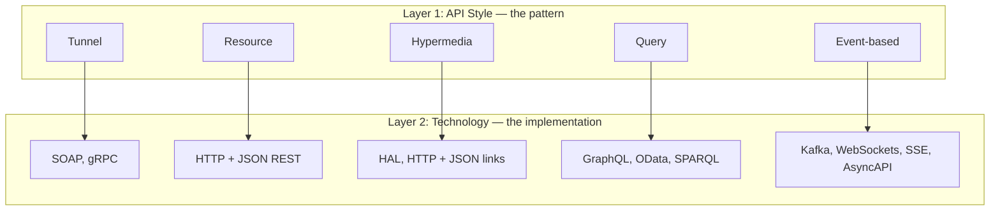
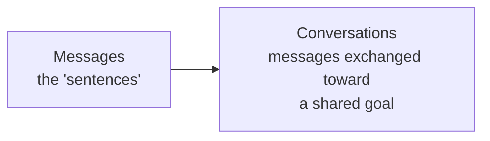
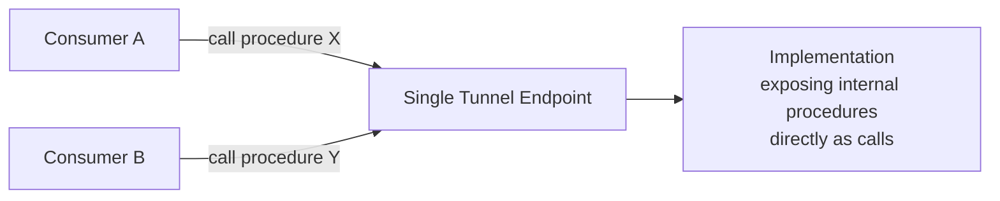
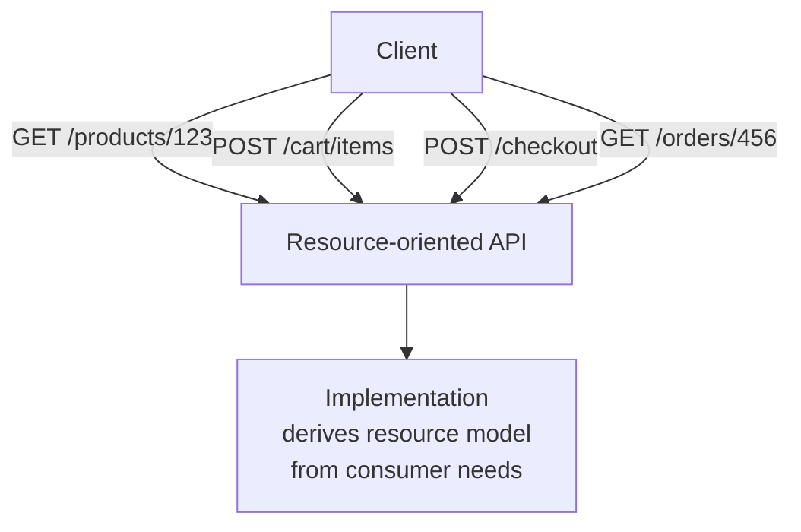
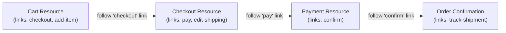
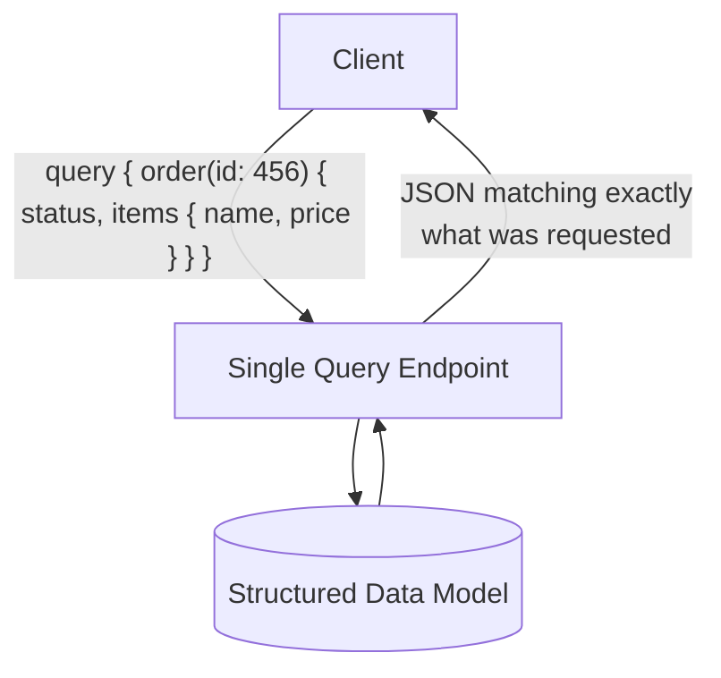
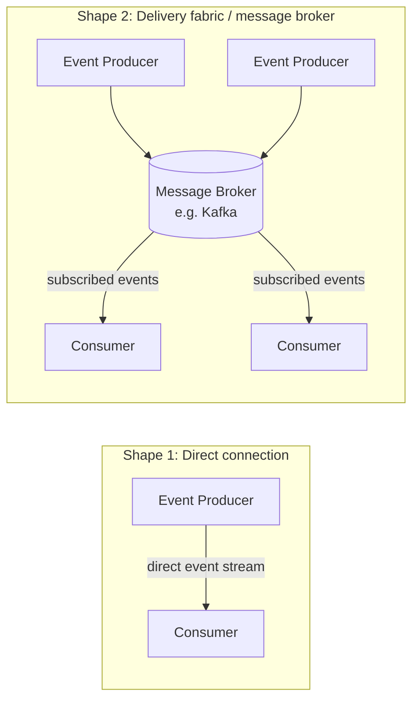
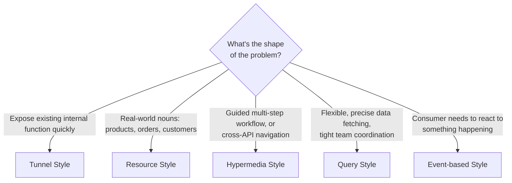
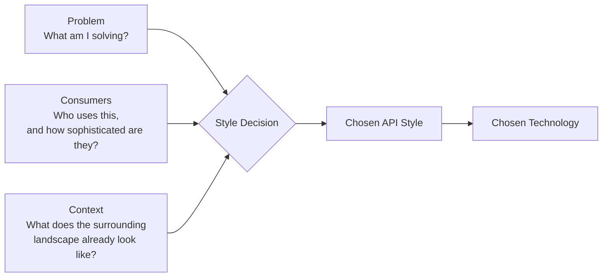

# The Five API Styles: How I Think About Choosing the Right Shape for an API

There's a quote from Charles Eames that I think about constantly when I'm starting a new API design: *"Design depends largely on constraints."* I love that line because it quietly kills one of the most persistent, unproductive debates in our industry — the "REST vs. GraphQL" style argument that seems to resurface every few years like a rerun nobody asked for. Once I understood *why* that debate is a little bit malformed, my whole approach to API design got simpler. I want to walk through that reasoning with you in this post, and then take you through the five fundamental API styles I keep in my toolbox, what each one is actually good at, and how I decide which one fits a given problem.

## Why "REST vs. GraphQL" Is Comparing the Wrong Things

Here's the thing that finally made this click for me: REST and GraphQL aren't actually sitting on the same shelf. REST is a **pattern** — an architectural style. There's no "REST protocol" you can point to; HTTP is just a convenient foundation for implementing it, and you also need media types (the actual payload formats) before you get something you could call a working RESTful architecture.

GraphQL, on the other hand, is a **technology**. It's a specific, concrete way of letting a client query into a data model that lives on a server, with its own exchange formats and its own semantics for how that querying actually works. It happens to be the most visible technology implementing what I'd call the "query pattern," but it's not the only one — OData plays in that same space for enterprise IT, and SPARQL does something similar with a more research-flavored lean.

So when people argue "REST vs. GraphQL," they're really comparing a general architectural pattern against one specific technological implementation of a *different* pattern. It's a bit like arguing whether "cooking" is better than "a specific brand of oven" — the categories don't actually line up.

I've found it hugely clarifying to separate these two layers whenever I'm having a design conversation:



Keeping these two layers distinct lets me have two genuinely different, genuinely useful conversations instead of one muddled one: *"which general design approach fits this problem?"* and, separately, *"given that approach, which concrete technology should I actually implement it with?"*

## APIs Are Languages

Before I get into the five styles themselves, I want to share a reframing that changed how I think about API design at a fundamental level: **an API is just a language.**

Like any language, an API needs two things to actually function. First, it needs a way for individual messages to be exchanged — think of these as the "sentences" of the language. Second, it needs a way for the exchange of those messages to add up to something meaningful — a real conversation with a shared goal, not just noise being tossed back and forth.



I bring this up because it reframes what an "API style" actually *is*. A style isn't a technical implementation detail — it's a choice about what kind of language I want my API to speak, and languages differ in exactly the two dimensions I just described: what the fundamental "nouns" of the conversation are (procedures? resources? events?), and what shape a meaningful conversation takes (a single call-and-response? a guided multi-step workflow? an ongoing stream?).

Every style I'm about to walk through answers those two questions differently, and I'll call out both answers explicitly for each one — first from the perspective of the **consumer** (who only ever sees the API, never the implementation behind it), and then from the perspective of the **developer** building that implementation.

## A Quick Reality Check Before the Styles

I want to plant one seed early, because it'll save me from repeating myself five times: **none of these styles is "the best one."** Each has real strengths and real weaknesses, and the right choice is a function of the specific problem I'm solving, not a matter of personal taste or industry trend-chasing.

Here's a simple example I keep coming back to. If I'm building an API for placing an order, there's a pretty natural workflow: browse products, add to cart, provide payment info, get a confirmation, provide shipping details. That's a guided, step-by-step control flow, and a traditional request/response style handles it beautifully.

But if I'm building an API that needs to tell consumers "hey, this customer just changed their address," a request/response model is a clumsy fit — I'd be stuck polling constantly, wasting effort checking for something that usually hasn't happened yet. An event-driven style, where the API triggers a notification the moment the change occurs, is a dramatically better match.

> **Note:** I could technically force either scenario to work with any of the five styles — that's not the point. The point is that some styles fit a given problem *much* more naturally than others, and picking against the grain of the problem tends to produce awkward, hard-to-use APIs even when the implementation is technically correct.

There's an old saying I think about a lot here: *"If the only tool you have is a hammer, every problem looks like a nail."* The more APIs I work on, the more convinced I am that having more than one "style tool" in my toolbox — and being willing to actually reach for the right one — makes a real difference in how good my APIs end up being.

---

## Style 1: Tunnel Style

The tunnel style is, historically, where a lot of us started, whether we realized it or not. Its roots go back to remote procedure call (RPC) thinking — the idea that a distributed system should *feel* as much as possible like calling a local function. If I've already got a procedure defined somewhere in my codebase, the tunnel style just says: expose that same procedure as an API, with as little translation as possible in between.

**Main abstraction:** procedures.
**Consumer's mental model:** "I'm calling a named function, remotely."



### Why It's Appealing

From a developer's point of view, this style is genuinely convenient — sometimes almost embarrassingly easy. The abstractions (procedures) often already exist in my codebase before I've written a single line of "API" code. Tooling can frequently auto-generate the exposed interface directly from existing code, which means I can go from "internal function" to "callable API" with very little extra effort. I'd still want a management layer for security — something like an API gateway sitting in front — but the core exposure work can largely be automated away.

### Why It Gets Complicated

Here's the catch, and it's a structural one, not just a technical inconvenience: **the tunnel style has no natural place to think about the API from the consumer's perspective.** Everything funnels through one endpoint — literally the "tunnel" the style is named after — and that endpoint has very little to do with the actual shape of what's being exposed. All calls look identical from the outside, which makes API management (security policies, rate limiting, routing logic) harder to layer on with anything that isn't baked directly into the implementation itself.

There's also a deeper issue I think is worth sitting with: because the tunnel style starts from "what procedures already exist," it skips the step where I actually stop and design the API *for the consumer* before implementing it. It's implementation-first almost by construction.

### The SOAP Story

This is exactly the story of SOAP and the first wave of "web services" in the late '90s and early 2000s. SOAP is an XML-based tunnel-style protocol, and it used HTTP purely as a transport mechanism — a convenient way to "tunnel" through existing firewall configurations, since HTTP traffic was already broadly allowed. That transport flexibility was genuinely useful — organizations could migrate between different underlying transport protocols while keeping the tunnel abstraction stable. But SOAP endpoints frequently exposed raw implementation details that were confusing and hard to use, and I think that's a big part of why the promised adoption never fully materialized the way people expected.

> **Caution:** If you're evaluating a tunnel-style API today (gRPC is the modern, much more polished descendant of this style), don't mistake "easy to expose" for "easy to consume." Those are genuinely different qualities, and the tunnel style optimizes hard for the former.

A minimal, illustrative example of what a tunnel-style call looks like conceptually — here using gRPC's protocol buffer definition style, since it's the most common modern tunnel-style technology I encounter:

```protobuf
// orders.proto
syntax = "proto3";

service OrderService {
  rpc GetOrder (GetOrderRequest) returns (Order);
  rpc SubmitOrder (SubmitOrderRequest) returns (Order);
}

message GetOrderRequest {
  string order_id = 1;
}

message SubmitOrderRequest {
  string customer_id = 1;
  repeated string product_ids = 2;
}

message Order {
  string id = 1;
  string status = 2;
  double total = 3;
}
```

Notice how this reads almost exactly like a local function signature — `GetOrder`, `SubmitOrder` — just marked up for remote invocation. That's the tunnel style in a nutshell: procedures, tunneled through a single service endpoint.

---

## Style 2: Resource Style

The resource style is what emerged when people started looking at HTTP differently — not as a generic transport tunnel, but as a protocol genuinely designed around *interacting with resources* (the way it always has been for web pages, images, and documents). This is where REST as most of us know it lives.

**Main abstraction:** resources.
**Consumer's mental model:** "I'm interacting with a named thing — a product, an order, a customer — using a small set of standard verbs."

The critical difference from the tunnel style isn't really about the shape of the diagram — at a glance, resource-style APIs can look structurally similar to tunnel-style ones. The real difference is in **how those exposed things get decided**. In the tunnel style, I'm exposing whatever procedures already exist in the implementation. In the resource style, I derive the resources from the *consumer's* perspective — I'm asking "what are the meaningful concepts my consumers actually want to interact with?" rather than "what functions do I already have lying around?"



### A Worked Example

Think about a typical online shopping flow: browsing products, adding items to a cart, checking out, paying, providing shipping information. Each one of those steps maps naturally onto a resource: a product, a cart, an order, a shipment. Designing a good resource-oriented API for this is, in large part, the exercise of mapping the real-world process onto a clean set of resources — very similar to designing the page structure of a shopping website.

Here's a small, testable resource-style API sketch, using a lightweight Express server just to make the pattern concrete rather than abstract:

```javascript
// resource-style-example.js
const express = require('express');
const app = express();
app.use(express.json());

const carts = {};

app.post('/carts', (req, res) => {
  const cartId = `cart_${Date.now()}`;
  carts[cartId] = { id: cartId, items: [] };
  res.status(201).json(carts[cartId]);
});

app.post('/carts/:cartId/items', (req, res) => {
  const cart = carts[req.params.cartId];
  if (!cart) return res.status(404).json({ error: 'Cart not found' });
  cart.items.push({ productId: req.body.productId, qty: req.body.qty });
  res.status(200).json(cart);
});

app.get('/carts/:cartId', (req, res) => {
  const cart = carts[req.params.cartId];
  if (!cart) return res.status(404).json({ error: 'Cart not found' });
  res.status(200).json(cart);
});

module.exports = app;
```

And a quick test against it, just to confirm this resource model actually behaves the way I'd expect:

```javascript
// resource-style-example.test.js
const request = require('supertest');
const app = require('./resource-style-example');

describe('Resource-style cart API', () => {
  test('creates a cart, adds an item, and fetches it back', async () => {
    const createRes = await request(app).post('/carts');
    expect(createRes.status).toBe(201);
    const cartId = createRes.body.id;

    const addRes = await request(app)
      .post(`/carts/${cartId}/items`)
      .send({ productId: 'sku_42', qty: 2 });
    expect(addRes.status).toBe(200);
    expect(addRes.body.items).toHaveLength(1);

    const getRes = await request(app).get(`/carts/${cartId}`);
    expect(getRes.status).toBe(200);
    expect(getRes.body.items[0].productId).toBe('sku_42');
  });
});
```

Every one of these routes maps to a resource (`/carts`, `/carts/:cartId/items`) rather than to a procedure name (`createCart`, `addItemToCart`) — that's the defining fingerprint of the resource style versus the tunnel style, even though under the hood, plenty of "procedure-like" code is still running.

### Where the Resource Style Falls Short

The resource style is great at exposing individual, well-bounded concepts while hiding implementation details behind them. What it doesn't handle gracefully is **workflows that span multiple resources**. If a consumer needs to go cart → checkout → payment → shipping in a specific order, the resource style alone doesn't tell them how those steps connect — they need to already know the process out-of-band, usually from reading documentation. That's exactly the gap the next style fills.

---

## Style 3: Hypermedia Style

The hypermedia style takes everything from the resource style and adds the one ingredient that makes the *web itself* work: **links**. Instead of a consumer needing to already know every resource and URI up front, a hypermedia API tells them, at each step, what they can do next — the same way a web page tells a human reader which links are available to click.

**Main abstraction:** linked resources.
**Consumer's mental model:** "I follow the links the API gives me at each step, rather than hardcoding a fixed sequence of URLs."



### The Crucial Twist: Machines, Not Humans, Follow the Links

Here's the detail that took me a while to fully appreciate: on the human web, a person reads the page and decides which link to click based on the visible text. In a hypermedia *API*, that decision is made by a machine, which means the links need machine-readable labels — often called "relation types" — that a program can identify and act on programmatically, the same way a human would recognize "Checkout" as a button to click. These days that typically shows up as structured fields inside a JSON response rather than clickable blue text.

A minimal illustration of what that looks like in a JSON response:

```json
{
  "id": "cart_789",
  "items": [{ "productId": "sku_42", "qty": 2 }],
  "_links": {
    "self": { "href": "/carts/cart_789" },
    "add-item": { "href": "/carts/cart_789/items", "method": "POST" },
    "checkout": { "href": "/carts/cart_789/checkout", "method": "POST" }
  }
}
```

A well-built hypermedia client doesn't hardcode `/carts/cart_789/checkout` anywhere in its source code — it reads the `_links.checkout.href` field from whatever response it just received and follows *that*. That single design decision is what unlocks the style's two biggest advantages.

### Advantage 1: Guided Workflows Become Trivial to Consume

Because a well-designed hypermedia API always includes the links relevant to the *current* state, consuming the API becomes a matter of "follow the right link" rather than "already know the entire process map ahead of time." Those links can even be context-sensitive — for instance, the shipping options offered at checkout might depend on the customer's identity, the items in the cart, and the destination country. Baking that logic into the links themselves, rather than forcing the consumer to reason it out independently, is a genuinely strong developer-experience win.

### Advantage 2: Links Don't Care Whose API They Point To

Because links are just URIs, they can point across API boundaries just as easily as within a single API. That makes hypermedia a genuinely powerful way to stitch together a *unified* experience across multiple APIs owned by different teams — something I think is undervalued, because so much discussion of API design stays scoped to a single API in isolation.

### Why It Hasn't Taken Over

Despite these real advantages, hypermedia is still noticeably less common than the plain resource style, and I think there are two honest reasons for that. First, it requires a genuine mindset shift for developers: instead of writing code that drives a fixed control flow, you're writing code that reacts to and is steered by the data you receive at runtime. That's a different programming discipline, and it doesn't come naturally to most of us at first. Second, hypermedia APIs can become "chatty" — if a consumer already knows exactly what they want, being forced to hop through several linked resources to get there is pure overhead compared to just asking for it directly.

> **Note:** That "chatty" downside is precisely the motivation behind the next style. If a consumer already knows what they want, why not let them just say so, directly, in a single request?

---

## Style 4: Query Style

The query style flips the model entirely. Instead of a fixed set of resources with fixed representations, I expose a single entry point into a structured, potentially large and complex dataset, and consumers write queries that describe exactly what they want back.

**Main abstraction:** a queryable data model.
**Consumer's mental model:** "I describe precisely the data I need, in one request, and get back exactly that shape — no more, no less."



If that sounds a little like a database, that's not a coincidence — it's genuinely the same underlying pattern. Databases have a data model and a query language for selecting exactly the data you want; the query style does the same thing at the API layer. GraphQL is, by a wide margin, the most visible technology implementing this pattern today, though it's worth knowing it's not the only one — OData plays a similar role in enterprise contexts, and SPARQL fills this niche within the RDF/semantic-web technology stack.

### A Concrete Comparison

Here's the same "get an order with its item names and prices" request, side by side, so the structural difference between query-style and resource-style really lands:

**Resource style — likely requires multiple round trips:**
```http
GET /orders/456
GET /orders/456/items
GET /products/sku_42
GET /products/sku_99
```

**Query style — a single request, shaped exactly to the need:**
```graphql
query {
  order(id: "456") {
    status
    items {
      product {
        name
        price
      }
      qty
    }
  }
}
```

That's the core appeal: a single, precisely-shaped request can replace what would otherwise be several separate resource fetches (sometimes referred to as the "N+1 requests" problem in resource-style APIs). The tradeoff is real, though — to write that query effectively, a consumer needs genuine familiarity with both the query language mechanics *and* the underlying domain model, which is a meaningfully higher upfront learning cost than "GET a URL."

### Where the Query Style Tends to Shine

In my experience, this style is at its best powering single-page applications (SPAs) where the frontend and backend are built by closely coordinated teams, often inside the same organization. That context matters a lot: shared domain knowledge is high, data model changes can be coordinated across teams relatively painlessly, and the efficiency gain from precisely-shaped queries is well worth the extra coordination overhead. I'd think twice before reaching for this style for a broadly public, loosely-coordinated developer audience, where that shared-context assumption breaks down.

> **Caution:** A query-style API's flexibility is also its biggest operational risk. A consumer can technically write a query that recursively pulls in enormous, deeply-nested amounts of data in a single request. If you go this route, budget real effort into query complexity limits, depth limiting, and cost analysis — the "flexibility" that makes this style powerful is the same thing that makes it easy to accidentally (or maliciously) hammer your backend.

---

## Style 5: Event-Based Style

All four styles I've covered so far share one fundamental assumption: they're **request/response** — the consumer initiates, and the provider responds. The event-based style breaks that assumption entirely. Instead of the consumer asking for something, the *provider* generates events, and those events get delivered to whoever's interested.

**Main abstraction:** events.
**Consumer's mental model:** "I subscribe to the kinds of things I care about, and I get notified the moment they happen — I don't have to keep asking."

That reversal immediately raises a real architectural question: how does delivery actually happen, and how does the system even know who's interested in what? This can't be solved without some kind of supporting infrastructure, and I've generally seen it show up in one of two shapes.



**Direct connection** is the simpler shape: consumers connect straight to a producer and receive its raw event stream. This can be as low-level as pulling a continuous stream of sensor measurements straight from a device — subscribing just means opening that stream.

**Delivery fabric (message broker)** decouples producers and consumers entirely. Producers publish events by type; consumers subscribe to the types they care about; the broker's whole job is guaranteeing the right events reach the right subscribers. This is the shape most organizations actually mean when they talk about "going event-driven" today, and Kafka is far and away the name that comes up most often in that conversation.

### A Minimal, Tested Example

Here's a stripped-down illustration of the pub/sub shape using a simple in-memory event emitter — obviously not production infrastructure, but it demonstrates the actual interaction pattern cleanly and is genuinely testable:

```javascript
// event-style-example.js
const EventEmitter = require('events');

class OrderEventBus extends EventEmitter {}
const bus = new OrderEventBus();

function publishOrderShipped(orderId) {
  bus.emit('order.shipped', { orderId, timestamp: Date.now() });
}

module.exports = { bus, publishOrderShipped };
```

```javascript
// event-style-example.test.js
const { bus, publishOrderShipped } = require('./event-style-example');

describe('Event-based order notifications', () => {
  test('subscriber is notified when an order ships', (done) => {
    bus.once('order.shipped', (event) => {
      expect(event.orderId).toBe('ord_123');
      expect(event.timestamp).toBeDefined();
      done();
    });

    publishOrderShipped('ord_123');
  });
});
```

Notice the shape of the test: the consumer doesn't *ask* whether the order shipped — it registers interest once, and gets notified the moment the relevant event occurs. That's the event-based style's defining fingerprint, and it maps very directly onto real systems: swap `EventEmitter` for Kafka, SSE, or WebSockets, and the interaction pattern is identical, just distributed across a network instead of living in one process.

### The One Architectural Oddity Worth Knowing

Here's something I think is genuinely worth flagging, because it surprised me the first time I really thought it through: **every other style in this list is inherently decentralized**, because they all assume direct, synchronous interaction between a consumer and a producer. The event-based style, in most real-world implementations, is the odd one out — it typically relies on a *centralized* delivery fabric that everyone connects through. Modern tools like Kafka are highly scalable and resilient, so this isn't automatically a problem, but it is a real architectural difference worth being conscious of, especially when you're reasoning about single points of failure or organizational ownership of shared infrastructure.

For description and documentation purposes, AsyncAPI has emerged as the event-based style's answer to what OpenAPI does for the resource style — it describes events (which it calls "messages") in a structured, machine-readable way, and it's been gaining real traction.

---

## Comparing All Five Styles at a Glance

I find it useful to keep a single table like this in my head (or, honestly, pinned somewhere) when I'm starting a new API design conversation:

| Style | Main Abstraction | Interaction Shape | Best Fit When... | Common Technologies |
|---|---|---|---|---|
| **Tunnel** | Procedures | Remote function calls through one endpoint | You need to expose existing internal capability quickly, with low ceremony | SOAP, gRPC |
| **Resource** | Resources | Standard verbs against named "things" | The problem maps naturally onto real-world nouns (products, orders, customers) | REST over HTTP + JSON |
| **Hypermedia** | Linked resources | Follow-the-links, state-driven navigation | There's a guided multi-step workflow, or you're linking across multiple APIs | HAL, Siren, HTTP + JSON |
| **Query** | Structured/queryable data model | Ask for exactly the shape of data you want, in one request | Tightly-coordinated frontend/backend teams need flexible, efficient data fetching | GraphQL, OData, SPARQL |
| **Event-based** | Events | Provider pushes; consumer subscribes and reacts | Consumers need to react to something happening, not poll for it | Kafka, WebSockets, SSE, AsyncAPI |



---

## How I Actually Decide: Three Categories of Constraint

Once I've got the five styles clear in my head, the actual decision of which one to use always comes down to weighing three categories of constraint, and I try to be deliberate about walking through all three rather than jumping straight to my personal favorite style.

### 1. Problem

What am I actually trying to solve? Structured, potentially complex data access points toward the query style. A navigable, multi-step process points toward hypermedia. Something happening that consumers need to react to points toward events. I try to name the problem in plain language *before* I let myself think about styles at all — it's too easy to reach for a familiar style out of habit rather than fit.

### 2. Consumers

Every API exists to be consumed by someone, so who that someone is has to shape the design. I can't always plan for every possible future consumer — APIs get reused in ways I don't anticipate — but I can and should design with at least some concrete consumers in mind, and make explicit, documented assumptions about the rest. Consumer input might come as an explicit preference for a particular style or technology, or it might just be a signal about how much complexity a given audience can realistically handle.

### 3. Context

Almost no API exists in total isolation — it's part of a broader **API landscape**. That landscape has real texture: is this API for private internal use, a partner integration, or fully public consumption? If the surrounding landscape already leans heavily toward a particular style, that's a genuine, legitimate argument in favor of following suit for a new API being designed within it — consistency has real value across a landscape, not just within a single API.



Once I've settled on a style, choosing a concrete technology is a genuinely separate step. For the resource style, that usually means HTTP as the protocol and JSON as the representation format — JSON has thoroughly overtaken the XML that used to dominate this space. For the query style, GraphQL is the dominant default today, mostly because it plugs neatly into an already-JSON-centric ecosystem, even though its query language itself isn't JSON. For the event-based style, the choice ranges from a heavyweight, organization-wide investment in something like Kafka down to lighter, per-API choices like Server-Sent Events or WebSockets for browser-facing use cases.

---

## Don't Paint Yourself Into a Style Corner

I want to end on the point I think matters most at an organizational scale, even though it's easy to overlook when you're heads-down designing a single API. Across my career I've watched entire API landscapes get built around a single dominant style: SOAP-heavy tunnel-style landscapes in the 2000s, HTTP-heavy resource-style landscapes after that, more recent waves leaning hard into GraphQL-centric query-style landscapes, and now a fresh wave of event-driven-architecture landscapes, often built around Kafka.

I understand the instinct behind standardizing on one style organization-wide — it feels like the path to consistency, shared tooling, and economies of scale. But I've become genuinely convinced that this instinct, taken too far, backfires. **There is no single best API style.** Trying to force every problem in a large organization through one style's lens inevitably means bending some problems into an awkward, unnatural shape just to maintain consistency for its own sake.

> **Tip:** The healthier goal, in my experience, is deliberately embracing *some* diversity of styles across your API landscape — while still bringing enough shared order and governance that the landscape doesn't collapse into total chaos. That's a genuinely tricky balance to strike, and I don't think there's a formula for it — it takes ongoing judgment, not a one-time decision.

The mindset shift I'd encourage, if you take away nothing else from this post, is this: stop asking "which API style is best?" and start asking "which style best fits *this specific problem*, for *these specific consumers*, in *this specific context*?" That's a more effortful question to answer every single time — but it's also the question that actually produces good APIs, instead of API landscapes that just happen to be internally consistent while quietly fighting the shape of the problems they're supposed to solve.
