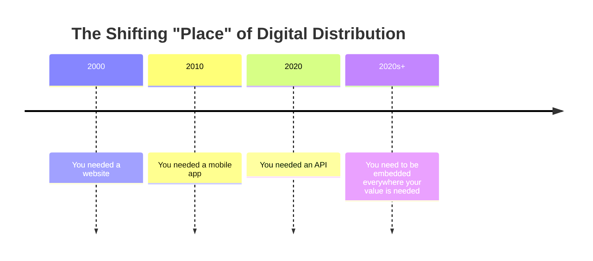
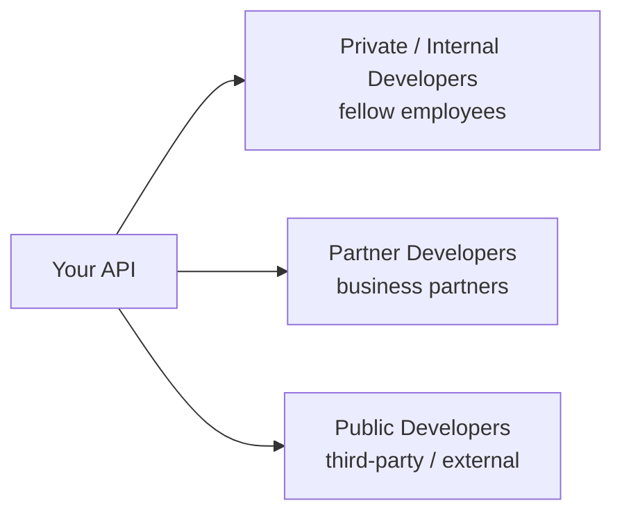
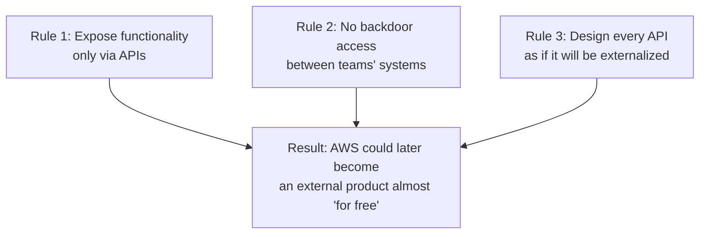
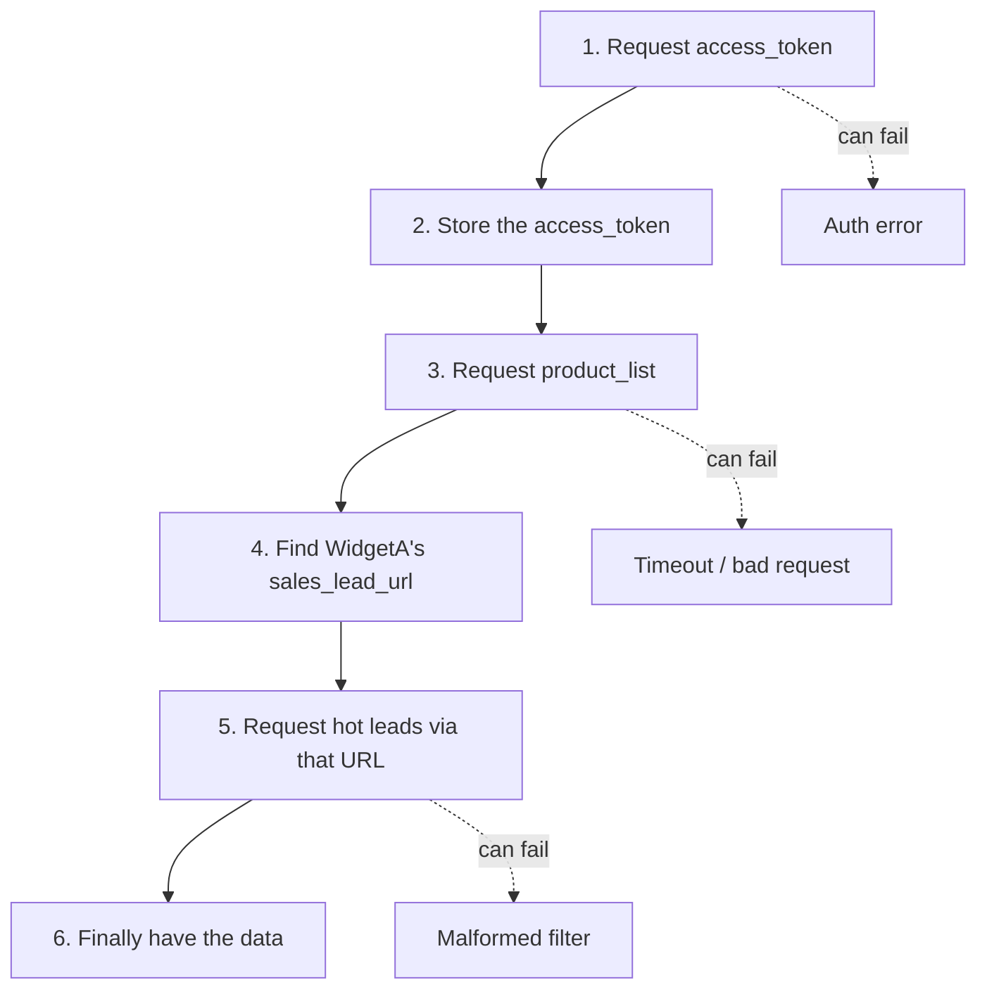
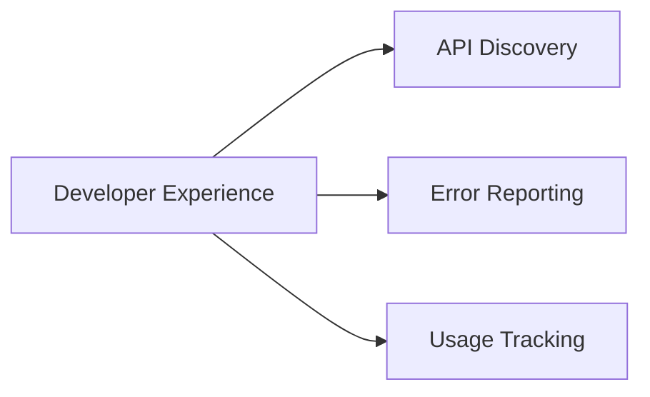
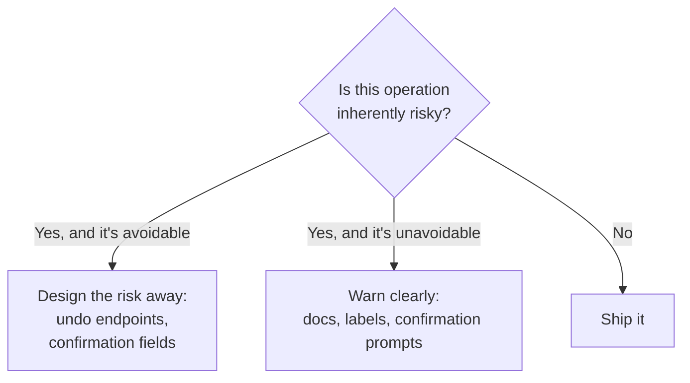
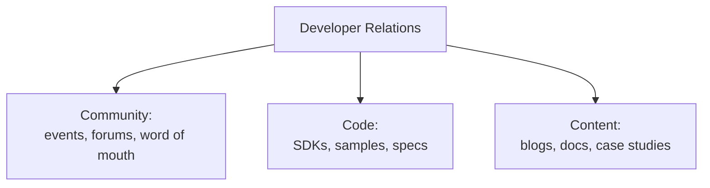
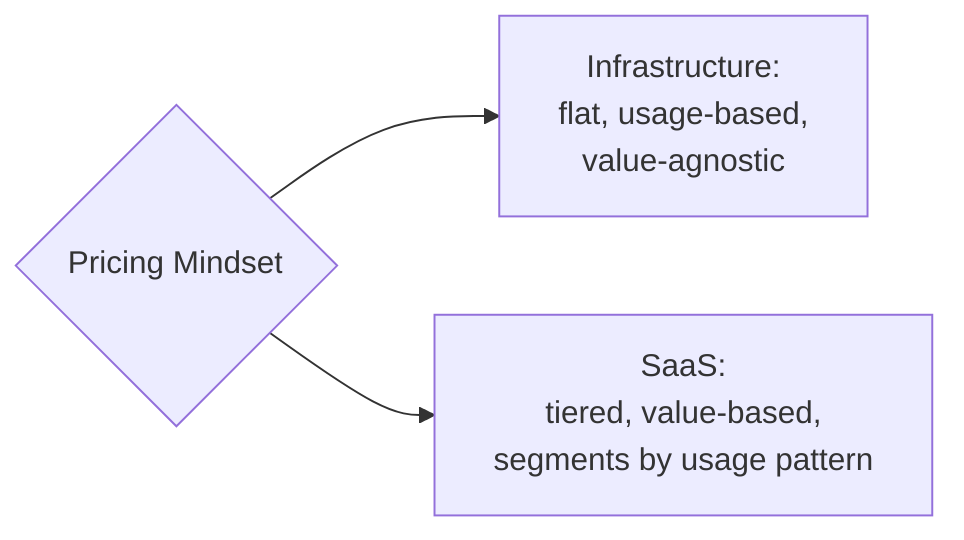

# Treating My APIs Like Products, Not Just Endpoints

There was a point in my career when I thought "API management" meant getting the technical details right: clean URLs, sensible status codes, solid uptime. I've since come around to a very different view. The technical details are table stakes. What actually separates the APIs people love from the APIs people tolerate is whether someone treated the API like a real product — with an audience, a value proposition, an onboarding experience, and an ongoing relationship — rather than just a technical interface that happened to ship.

I now think of this as the **API as a Product** mindset, or AaaP for short. It's a deliberate borrowing from the "X as a Service" language we're all used to (SaaS, PaaS, IaaS), and it captures a simple but easy-to-forget idea: an API deserves the same design thinking, prototyping, customer research, and long-term care that any other product gets. Not "we shipped an interface." "We shipped a product, and this happens to be its shape."

In this post I want to walk through everything that mindset actually implies in practice: how design thinking applies to APIs, why the first few minutes of using an API matter enormously, what an ongoing developer experience looks like, how developer relations functions as a discipline in its own right, and how companies actually think about monetizing and pricing APIs. I'll use diagrams, tables, and a bit of tested code to make the abstract parts concrete.

> **Note:** Everything here applies whether your API is used only by people inside your own company or by the public. The investment level differs, but the mindset doesn't.

---

## Table of Contents

1. Why APIs became the interface of the digital economy
2. Design thinking, applied to APIs
3. What Amazon's internal API mandate taught the industry
4. Turning design thinking into a real practice
5. Customer onboarding and the race to "Wow!"
6. Developer experience: the relationship after the first date
7. Knowing your audience: discovery, errors, and usage tracking
8. Making APIs safe to use — and easy to use
9. Why developers are the real gatekeepers of the API economy
10. Developer relations as its own discipline
11. Measuring developer relations with a funnel
12. Monetizing and pricing APIs
13. My closing thoughts

---

## 1. Why APIs Became the Interface of the Digital Economy

I think it's worth stepping back and asking why any of this matters at all. Marc Andreessen's famous 2011 observation that software was "eating the world" wasn't really about software itself — it was about the shift from IT as a supporting function to IT *as* the business. Once infrastructure and platforms could be delivered "as a service" over a network, a company's technical capabilities stopped being just internal plumbing and started being something other businesses could plug into directly. The connective tissue that made that possible was the open API.

That shift changed what competition even looks like. It used to be product against product. Then it became platform against platform. Now, increasingly, it's whole ecosystems competing against other ecosystems — and APIs are the programmable interface that lets a single product evolve into a platform, and a platform evolve into an ecosystem.

I like to think about this using an old marketing frame, updated for an API-first world. Classic marketing thinks about four levers: Price, Promotion, Product, Place. In a world run on APIs, "Place" stops being a single controllable channel and becomes *everywhere at once*. The goal isn't to own one storefront — it's to be embedded inside every application where your capability might be useful.



Embedded finance is a great illustration of this. Banking value doesn't have to live "in the bank" anymore — it can live inside a real estate platform's mortgage calculator, a car dealership's financing widget, or a checkout flow on an e-commerce site, all powered by APIs from a bank that the end user may never directly think about. Industry estimates I've seen put the embedded finance opportunity as potentially dwarfing the traditional banking and finance market itself within a few years of being published — reach that simply wasn't possible when your only distribution channel was your own branch network or your own app.

There's a "long tail" effect at play here too, echoing Chris Anderson's well-known argument about niche markets: the earliest digital channels (a website, then a mobile app) captured the lion's share of attention at first, but over time, the long tail of smaller, more specific integration points — individual APIs plugged into individual niche applications — has added up to traffic that in some cases outweighs the "official" channel entirely. I've seen companies where more than half of all platform traffic arrives via third-party API integrations rather than through their own website or app. When that's true, the API isn't a side project supporting the "real" product. The API *is* the product, or at least a majority share of it.

---

## 2. Design Thinking, Applied to APIs

Apple gets cited constantly in product design circles, and for good reason — the level of intentionality that went into products like Mac OS X wasn't accidental. From what I've read about that era, every product idea had to pass through a marketing lens, an engineering lens, and a genuine user-experience lens before it moved forward. That triangulation — is it needed, is it feasible, is it usable — is a good working definition of design thinking, and it maps directly onto API work.

IDEO's Tim Brown has described design thinking as the practice of matching what people actually need with what's technically achievable and what a business can realistically turn into value. I'd boil that down to two questions I now ask about every API before I write a line of code:

1. **Does this match a real need someone has?**
2. **Is there a viable business reason to build it?**

### Matching people's needs

The first question forces me to figure out *who* I'm actually serving. Clayton Christensen's Jobs to Be Done framework is the lens I keep coming back to here: people don't want your product for its own sake, they "hire" it to make progress on some specific problem in their life or work. An API is no different. Nobody wants your `/customers` endpoint. They want to solve whatever problem calling that endpoint lets them solve.

That means before I design anything, I have to be honest about which audience I'm serving — and there are usually three distinct ones inside any organization:



Each of these audiences thinks about problems differently, has different tolerance for friction, and needs different levels of documentation and support. Designing for all three the same way is a mistake I've made more than once.

> **Note:** This applies just as much to APIs that will only ever be used internally. I used to assume design thinking was a luxury reserved for public, revenue-generating APIs. It isn't. An internal API with a confused audience wastes just as much time as an external one — it just does it quietly, inside your own company, where nobody's writing angry tweets about it.

### A viable business strategy

The second question — is there a viable business case — keeps me honest about where I spend limited time and money. I've seen plenty of organizations build APIs that solve a real IT problem (exposing a gnarly internal database as a clean interface, say) without solving a problem that actually moves a business metric. That's not necessarily wasted work, but it's a different category of investment than an API tied directly to a revenue or strategic goal, and it deserves a different level of resourcing.

The tricky part, honestly, is that business leadership and engineering teams often don't share a common vocabulary for what "matters." I've found it worth the extra effort to translate company goals into terms an API team can act on, and to define measurable indicators up front so nobody's guessing whether an API investment paid off six months later.

---

## 3. What Amazon's Internal API Mandate Taught the Industry

If there's one story I keep coming back to when I explain AaaP to skeptical engineers, it's Amazon Web Services. AWS wasn't born as a grand plan to sell cloud infrastructure to the world — it grew out of genuine internal frustration. Amazon's own IT organization was too slow to respond to the business's requests, and what did get delivered often wasn't reliable or scalable enough.

What I find most interesting isn't the technology decisions AWS made — it's the organizational mandate behind them, now commonly referred to as the "Bezos mandate." As it's been retold by people like former Amazon engineer Steve Yegge, the mandate had a few blunt requirements: every team's functionality had to be exposed through an API, the *only* way to consume another team's functionality was through that API (no reaching into someone else's database), and — critically — every API had to be designed as though it might one day be exposed outside the company entirely.



That third rule is the one that turned an internal cleanup effort into a multi-billion-dollar product line. Because every internal API was already built to a standard that would hold up outside the company, externalizing that capability later wasn't a redesign project — it was closer to flipping a switch. That's the AaaP mindset in its purest form: treat internal consumers with the same design discipline you'd apply to paying external customers, and you keep the option open to turn any internal capability into a product later, cheaply.

> **Caution:** I don't think every internal API needs the same investment as a flagship external product — that would be a poor use of resources. But I do think it's worth asking, for any API with real staying power, "if we had to expose this externally next year, how much rework would that take?" If the honest answer is "a lot," that's useful information about the corners that got cut.

---

## 4. Turning Design Thinking into a Real Practice

Knowing that design thinking matters is one thing. Actually building the muscle for it inside an engineering organization is another. I've seen a few different approaches work:

- **Teach the principles directly to API developers.** Some companies run internal design-thinking courses for their engineers, sometimes borrowing product design staff who already know how to teach it.
- **Build a bridge between product design teams and API teams.** Rather than turning every engineer into a designer, pair API teams with existing design talent so good practice transfers naturally.
- **Do both at once.** I've seen this work particularly well — teaching baseline design skills to engineers while also formalizing an ongoing relationship with a dedicated design function.

A typical curriculum for this kind of training tends to cover a similar set of bases regardless of company:

| Topic | What it's really teaching |
|---|---|
| Core design-thinking skills | How to frame a problem before jumping to a solution |
| Understanding the customer | How to identify and empathize with a real audience |
| Service/workflow design | How the API fits into a larger sequence of user actions |
| Prototyping and testing | How to validate an idea cheaply before committing to it |
| Business considerations | How to tie a design decision back to a business outcome |
| Measurement and assessment | How to know, after the fact, whether the design worked |

I've watched an organization run this kind of training internally, not to turn every backend engineer into a professional product designer, but simply to give them a shared vocabulary and a habit of asking "who is this for, and what are they actually trying to do?" before diving into implementation. That's a modest goal, and it pays off disproportionately.

The payoff from all of this isn't just prettier documentation or a nicer-feeling API. Done well, it gives you a genuinely better understanding of your audience, a tighter connection between what you build and what the business actually needs, and — because you were forced to define success up front — a much more reliable way to measure whether the API actually worked.

---

## 5. Customer Onboarding and the Race to "Wow!"

Design gets you a good API. It doesn't automatically get you a good *first experience* with that API, and I've learned the hard way that those are two separate problems.

Apple is the case study everyone reaches for here, and for good reason — the amount of deliberate engineering that goes into "unboxing" a physical Apple product (the exact tension of the plastic wrap, the precise angle of a pull-tab, a battery that's already charged when you turn the device on) is a level of intentionality most of us have never applied to the first five minutes of using our own API. But the underlying instinct transfers directly: your API's "unboxing" experience is everything a new developer encounters between landing on your docs and getting their first real result back.

### Time to Wow, and Time to First Hello World

I've adopted the concept of a "Wow!" moment from growth-marketing circles — the instant a user suddenly *feels* the value your product delivers, rather than just understanding it intellectually. In API terms, this usually shows up as **Time to First Hello World (TTFHW)**: how long it takes a brand-new developer to go from "I just found this API" to "I just got a real, working response back."

I map this out as a literal journey with friction points at each step. Here's a version of that journey for a fictional API that returns hot sales leads for a product — something I've sketched out for teams before to spot where people are likely to give up:



That's six steps and three separate places where something can go wrong before a first-time user ever sees value. Every one of those steps is a chance for someone to give up. There are a few concrete ways I've used to shorten that path:

- **Redesign the interface itself** to collapse multiple steps into one purpose-built endpoint (a single call that returns "hot leads for a named product," instead of forcing the caller to stitch several general-purpose calls together).
- **Write scenario-based documentation** that walks through exactly this use case end to end, rather than only offering a dry method-by-method reference.
- **Offer a sandbox** that skips authentication entirely while someone is still learning the shape of the API.

I can actually simulate this kind of "friction audit" with a small script — something I've used before to eyeball where onboarding funnels are leaking. Here's a tested example that takes a list of onboarding session logs and reports where people are dropping off:

```python
# onboarding_funnel.py
# A small, tested script for spotting drop-off points in an API onboarding funnel.

sessions = [
    {"id": 1, "steps_completed": ["signup", "get_token", "first_call"]},
    {"id": 2, "steps_completed": ["signup", "get_token"]},  # dropped before first call
    {"id": 3, "steps_completed": ["signup"]},                # dropped immediately after signup
    {"id": 4, "steps_completed": ["signup", "get_token", "first_call"]},
    {"id": 5, "steps_completed": ["signup", "get_token", "first_call"]},
]

funnel_stages = ["signup", "get_token", "first_call"]

counts = {stage: 0 for stage in funnel_stages}
for session in sessions:
    for stage in funnel_stages:
        if stage in session["steps_completed"]:
            counts[stage] += 1

print("Funnel completion counts:")
for stage in funnel_stages:
    print(f"  {stage}: {counts[stage]} / {len(sessions)}")

print("\nDrop-off between stages:")
for i in range(1, len(funnel_stages)):
    prev, curr = funnel_stages[i - 1], funnel_stages[i]
    dropped = counts[prev] - counts[curr]
    print(f"  {prev} -> {curr}: lost {dropped} developer(s)")
```

Running this against the sample data produces:

```
Funnel completion counts:
  signup: 5 / 5
  get_token: 4 / 5
  first_call: 3 / 5

Drop-off between stages:
  signup -> get_token: lost 1 developer(s)
  get_token -> first_call: lost 1 developer(s)
```

Trivial as this toy example is, the pattern scales directly to real onboarding telemetry — and it's exactly the kind of measurement I'd want before I start guessing at which step of onboarding actually needs fixing.

### How fast is fast enough?

Early in my career I'd have told you 30 minutes was a reasonable target for getting a new developer from "landing page" to "working example." Then I heard how Twilio — a company whose product is famously fiddly to integrate, given how many different SMS gateways and carriers it has to abstract over — aims for something closer to 15 minutes. They get there largely through obsessive measurement of their own tutorials: tracking exactly where users stall out and iterating relentlessly on those specific points.

There's a story from Twilio's early evangelism days that's stuck with me: a developer evangelist walked a brand-new user through a quickstart guide for outgoing calls, and within fifteen minutes the user's own phone rang with code they'd just written. The reaction — somewhere between disbelief and delight — is what people in that world call the "Neo moment," a nod to the *Matrix* films: the instant someone realizes they just did something that felt like magic a few minutes ago. That's the emotional core of a good TTFHW. It's not just "the API worked." It's "I can't believe I just did that."

> **Note:** I try to remind myself that the onboarding experience isn't only the tutorial itself — it's every step around it too. Signing up, agreeing to terms, generating credentials, downloading the right SDK for someone's specific language, getting redirected to the right starting point. If your legal or compliance process genuinely needs days to validate a new account, a sandbox that lets people start learning immediately (even before validation completes) can save the relationship.

---

## 6. Developer Experience: The Relationship After the First Date

Onboarding gets someone in the door. Developer experience (DX) is everything that happens afterward — and it's arguably the harder problem, because expectations change over time in ways a single "getting started" tutorial can never anticipate.

Apple's obsession with ongoing user experience is instructive here too. The company has iterated on individual product lines dozens of times over just a few years, purely in response to what it learned from real customer feedback. And its Genius Bar concept — free, in-person, ongoing support baked directly into the retail experience — captures something I think APIs desperately need more of: an explicit, easy channel for an existing user to get help *after* they're already committed to your product.

I think of developer experience as resting on three pillars that all reinforce each other:



I'll take each of these in turn, because each one has taught me something different.

---

## 7. Knowing Your Audience: Discovery, Errors, and Usage Tracking

### API discovery

Here's an uncomfortable truth I've had to accept: there still isn't a reliable, universal search engine for APIs the way there is for web pages. Discovery today is still mostly "word of mouth and a little luck," as I've heard it put. For public APIs, you lean on the usual channels — SEO, conference presence, content marketing — but a huge amount of real discovery still happens because someone asked a question in a forum or a community, and your API happened to be the answer someone gave them.

Internally, this problem takes a different, quieter shape. I've seen large organizations where a perfectly good internal API already exists for a given need, but developers can't find it, so they build their own version — sometimes multiple times across different teams. That's rarely rebellion. It's almost always a discovery failure. Companies I've seen handle this well often lean on a small set of institutional experts — sometimes called "API librarians" — who simply know where things live, who owns them, and where the documentation is.

The practical fix I trust most is treating discoverability as a hard requirement, not a nice-to-have: a real catalog or developer portal, and in the more disciplined organizations I've encountered, a rule that an API literally cannot ship to production until it's registered in that catalog.

> **Caution:** I've seen "add it to the catalog eventually" quietly turn into "never." If discoverability matters to you, bake it into your release pipeline as a hard gate rather than a best-effort request.

### Error reporting

Errors are inevitable — no amount of design or testing eliminates them completely. The mindset shift I've had to make is treating errors not as failures to be hidden, but as a rich source of insight into how people are actually using (and misusing) an API. I think about error reporting at three separate touchpoints:

| Touchpoint | What it reveals |
|---|---|
| **End-user reporting** | Unexpected conditions on the caller's own end of the transaction |
| **Gateway reporting** | Malformed requests or network issues right as they arrive |
| **Service-level reporting** | Bugs inside the implementation itself, or dependency failures |

Capturing errors at all three layers gives me a much more complete picture than any single layer alone — a gateway-level spike in malformed requests tells a very different story than a spike in service-level exceptions, even though both are "errors."

### Usage tracking

Tracking success is just as important as tracking failure. I want to know not just *that* an API is being called, but *how* — which patterns of calls keep repeating, and what those patterns imply about a better design.

Here's a pattern I've encountered more than once: an API consumer repeatedly chains together several general-purpose calls to accomplish one specific, common task — say, fetching a filtered customer list, then a matching promotional flyer, then sending an individual message to each customer one at a time. Watching that pattern show up over and over in usage logs is a strong signal that a single, purpose-built endpoint (a combined "send this promotion to this filtered segment" call) would serve that use case far better than making callers assemble it themselves every time. The nice part is that this kind of insight doesn't come from a customer interview — it comes directly from paying attention to what the traffic is already telling you.

I like a story I heard about a European railway company that ran two separate developer hackathons — one for external developers using simple, purpose-built APIs, and one for internal developers using the company's "full-featured," more complex internal APIs. Months later, the internal teams had quietly started using the simpler external APIs themselves, because they were just easier to get things done with. The lesson I take from that: your own internal teams are a brutally honest usage-tracking signal. If they abandon your "official" internal APIs for the simpler public-facing ones, that's not defiance — that's data. This is sometimes summarized with the phrase "drink your own champagne" (or, in less refined circles, "eat your own dog food"): if your internal teams won't use your APIs, don't be surprised when nobody else wants to either.

---

## 8. Making APIs Safe to Use — and Easy to Use

Two more qualities round out a solid developer experience, and I've found they pull in slightly different directions.

### Safety

Some API operations are just inherently risky — deleting records, changing prices, or returning enormous result sets that hammer a server. I've found there are two broad strategies for handling this:

1. **Design the risk away where possible.** Adding an "undo" capability alongside a destructive operation, or requiring an extra confirmation field for sensitive changes, can turn a catastrophic mistake into a recoverable one.
2. **Warn clearly where you can't design the risk away.** Some operations are dangerous no matter how you design them. In those cases, clear, prominent warnings in documentation — plain text or even a consistent visual labeling system, similar to hazard symbols on physical products — at least give developers a fighting chance to avoid a costly mistake.



> **Caution:** I've learned not to rely purely on documentation to prevent serious mistakes. A warning in a doc page is easy to miss under deadline pressure. Wherever I can build the safeguard into the API itself — a required confirmation parameter, a soft-delete instead of a hard delete — I do, and I treat documentation warnings as a second line of defense, not the first.

### Ease of use

Safety and ease of use aren't the same axis, and sometimes they're in tension. Making an API easy generally means using vocabulary that matches how your audience already thinks about their problem (back to Jobs to Be Done again), minimizing the number of steps required for common tasks, and — for anything genuinely complex — giving developers more than bare reference documentation.

I think of the extra layer beyond reference docs as your API's own version of the Genius Bar:

- A **FAQ section** answering the questions that come up again and again.
- A **"How do I...?" section** with short, task-oriented walkthroughs rather than exhaustive method listings.
- **Working starter examples** developers can copy and adapt directly.
- **Community forums** where a large user base can answer each other's questions and build a searchable knowledge base over time.
- **Real-time chat channels** for more immediate, personal support.
- For big communities, **in-person support** — evangelists, trainers, hackathons, meetups.

The through-line across all of these is that the more personal and immediate the support channel, the more you learn about how people are actually struggling — which feeds directly back into design improvements.

---

## 9. Why Developers Are the Real Gatekeepers of the API Economy

Here's a shift in thinking I found genuinely useful: the way a product becomes a *platform*, and a platform becomes an *ecosystem*, is by getting other people to invest their own time and money building on top of it — instead of you spending your own resources building everything yourself. Every application built on your API is effectively work you didn't have to do, addressing a market niche you might never have had the resources to serve directly.

That reframes developers from being "just" technical implementers into genuine business stakeholders. Every integration passes through a developer's hands first — whether they're the actual decision-maker or simply the person recommending one API over another to their team. That's part of why I've seen the language shift in some circles from B2C and B2B toward something like B2D — business to developer — as its own distinct relationship worth investing in deliberately.

Twilio understood this early, famously running public ad campaigns that simply said "Ask Your Developer" — a direct acknowledgment that developers, not executives, were often the real decision influencers in whether a company adopted a given API.

This is the point where I think a company needs someone whose entire job is nurturing that developer relationship — which brings me to developer relations as its own discipline.

---

## 10. Developer Relations as Its Own Discipline

I've come to think of developer relations (DevRel) around three pillars — sometimes called the "three Cs": **community, code, and content.**



- **Community** is about genuinely being where your developers are — at conferences, in forums, on social platforms — and being visibly responsive and human. A personal connection has a way of generating word-of-mouth referrals that no amount of paid advertising can replicate; I've heard of developers recommending a product they'd never even personally used, purely because they trusted the team behind it.
- **Code** means giving developers something they can build on directly — SDKs, sample code, working prototypes, and formal API specifications — so they spend their time on their own business logic rather than reinventing integration plumbing.
- **Content** is about honest, useful writing that keeps developers engaged even when they're not actively integrating anything that week — technical updates, engineering deep-dives, customer use-case stories, or broader thought-leadership pieces.

### AaaP vs. product APIs

One distinction I now make immediately when evaluating a DevRel strategy: is the API itself the entire product, or does the API merely support a bigger product?

| | AaaP (API is the whole product) | Product API (API supports a bigger platform) |
|---|---|---|
| Examples in spirit | Payment processing, SMS, email delivery, tax calculation services | Social platforms, CRM platforms, marketplaces exposing their own data/actions |
| Primary DevRel goal | Maximize valuable, revenue-generating integrations | Grow an ecosystem of apps that increase the core platform's stickiness |
| Pricing relationship | Usually directly monetized | Often free, because usage indirectly increases the platform's value |
| Developer's role | Customer | Ecosystem contributor |

Getting this distinction wrong has real consequences. I think of the well-known divergence between two large platforms as a cautionary tale: one platform eventually decided its business model was really built on advertising rather than an application ecosystem, and sharply restricted third-party API access as a result — a move that damaged developer trust for years afterward, even once the company tried hard to rebuild it. Another platform, by contrast, kept its business model tightly aligned with growing its application ecosystem the entire time, and its developer relationship has stayed comparatively healthy as a result. The lesson I take from that comparison: your API strategy and your actual business model need to point in the same direction, or you'll eventually have to choose one and disappoint everyone who bet on the other.

---

## 11. Measuring Developer Relations with a Funnel

DevRel can feel fuzzy and hard to justify to leadership if you don't measure it. I lean on a version of the AARRR framework (Awareness, Acquisition, Activation, Retention, Revenue, Referral) — sometimes nicknamed the "pirate funnel" — adapted specifically for developer audiences.


Here's how I map real metrics onto each stage:

| Stage | Metrics I actually track |
|---|---|
| **Awareness** | Developer portal visits, blog article views, newsletter sign-ups, conference talks given, open-source stars/contributions |
| **Acquisition** | Registered developers, number of applications per developer, total API calls, third-party marketplace integrations |
| **Activation** | Time to First Hello World, ratio of active-to-registered developers/applications |
| **Retention** | Number of genuinely "valuable" applications (by whatever definition matters to your strategy), active end-user tokens |
| **Revenue** | Direct API-attributable revenue, and — trickier but still worth tracking — indirect revenue the API's existence enables elsewhere in the business |
| **Referral** | Community conversation volume about your API, third-party mentions in talks or articles, sightings of your API in hackathon projects |

> **Note:** I've learned to be careful about which of these metrics I let become a formal target. A quantity like "total API calls" is genuinely useful early on for spotting growth, but once it becomes a target people are managed against, it stops being a trustworthy measure of health — a classic case of a metric losing its meaning the moment it becomes a goal in itself.

One pattern I find genuinely clever, even if it's not for every company: a few well-known API-driven businesses have gone as far as creating small investment funds specifically for the companies building on top of their platform. Taking a financial stake in your best developer-built applications is an unusually direct way of aligning incentives — you want their business to succeed just as much as they do, and it gives ambitious developers a real path to upside beyond just "using a good API."

---

## 12. Monetizing and Pricing APIs

Eventually, most companies with a serious API investment ask the obvious question: how (and whether) to charge for it. I've found it useful to start with a single strategic choice — are you pricing with an **infrastructure mindset** or a **SaaS mindset**?

- **Infrastructure mindset**: pricing is public, uniform, and tied purely to usage — you pay the same rate per unit whether that usage generates you a dollar or a million dollars in downstream value. Public cloud storage pricing is the classic example. It works because at the scale these providers operate, there's no practical way to price based on each customer's individual value creation.
- **SaaS mindset**: pricing is tiered and deliberately tries to capture more value from customers who are extracting more value themselves — for example, charging meaningfully more once a customer's usage pattern suggests they've moved from testing into genuine production traffic, or once they need a formal SLA with financial penalties attached.



Beyond that top-level choice, I've collected a set of independent dimensions that tend to show up across almost every API pricing strategy I've studied:

| Dimension | Cheap/free end | Premium end |
|---|---|---|
| **Freshness** | Data that's a day or more old | Real-time or near-real-time data |
| **Precision** | A rough, generalized result | A precise, exact result |
| **Consumability** | Granular, individually billed calls | A complex process bundled into one high-value call |
| **Scope** | A narrow slice of functionality | Full access across the whole capability |
| **Quantity** | Low call/data volume | High call/data volume |
| **Performance** | No guaranteed latency or uptime | A guaranteed SLA with penalties |
| **Maintenance** | Self-managed version upgrades | Fully managed version support |
| **Support** | Community forums, email-only | 24/7, guaranteed response times |
| **License** | Restricted usage rights | Broad usage rights |
| **Branding** | Required "powered by" attribution | White-label, no attribution required |

I think of a "process" API — one that bundles many individual lookups into a single, higher-value call — as a particularly interesting case of the consumability dimension. A single API call that answers a genuinely hard compound question (assembling several underlying data sources into one clean "yes/no" or "here's the answer" response) is worth far more to a consumer than the sum of the individual calls it would take them to replicate that logic themselves. That kind of bundling is often where the most defensible API pricing lives, because you're selling judgment and aggregation, not just raw data access.

> **Note:** Across all these dimensions, I've noticed a consistent tension: simpler, flatter, more transparent pricing tends to drive faster self-service adoption, while more sophisticated tiered pricing captures more value per customer but usually needs real sales support to close. Neither is "correct" — it's a genuine trade-off between growth speed and revenue capture per customer, and the right answer depends entirely on whether your strategy favors ecosystem growth or margin.

I also try to remember that not every API needs to directly generate revenue to be worth the investment. A platform-supporting API that's given away for free can still be enormously valuable if its real job is deepening engagement with — or increasing switching costs around — the core product it supports. The API itself doesn't need a price tag for the business case to be sound; it just needs a clear, honest line back to some business outcome that does.

---

## 13. My Closing Thoughts

If I had to compress this entire post into the handful of principles I actually carry into my day-to-day work, they'd be these:

- An API is a product, whether or not it ever generates a dollar of direct revenue. Give it the same design thinking, audience research, and ongoing care you'd give any other product.
- Know your audience before you design anything — internal, partner, and public developers are genuinely different audiences with different needs.
- The first few minutes matter enormously. Measure Time to First Hello World honestly, and treat every extra step in your onboarding flow as a place people might quietly disappear.
- Developer experience doesn't end at onboarding. Discovery, error visibility, and usage tracking are the ongoing feedback loop that keeps an API improving long after launch.
- Make dangerous operations hard to do by accident, and make common operations easy to do on purpose. Those are two separate design problems, and both deserve real attention.
- Developers are stakeholders, not just implementers — and a real developer relations discipline, built around community, code, and content, is what turns a good API into a genuine platform.
- Measure DevRel like a funnel, but be careful which numbers you let become targets — some metrics are useful signals right up until the moment someone's bonus depends on them.
- Pricing an API is a deliberate strategic choice, not an afterthought — decide early whether you're optimizing for adoption or value capture, because the two pull in different directions.

None of this makes an API "done" in some final sense — the companies I admire most in this space (Apple in hardware, AWS in infrastructure, Stripe and Twilio in developer tooling) all treat their products as permanently unfinished, constantly refined based on real feedback from real usage. That's the mindset shift AaaP is really asking for: stop thinking of your API as a technical artifact you ship once, and start thinking of it as a relationship with an audience that you're responsible for nurturing for as long as they depend on you.
