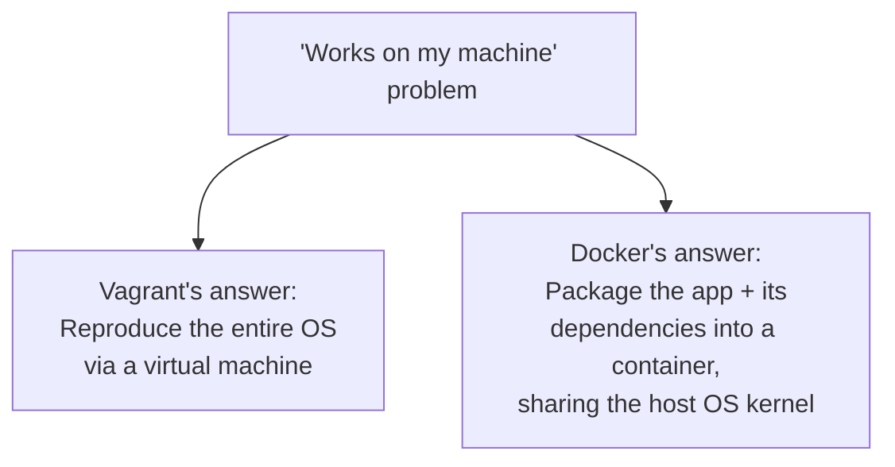
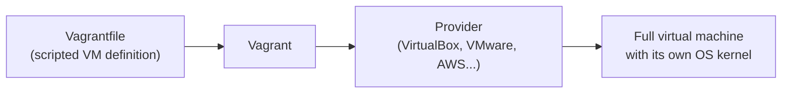
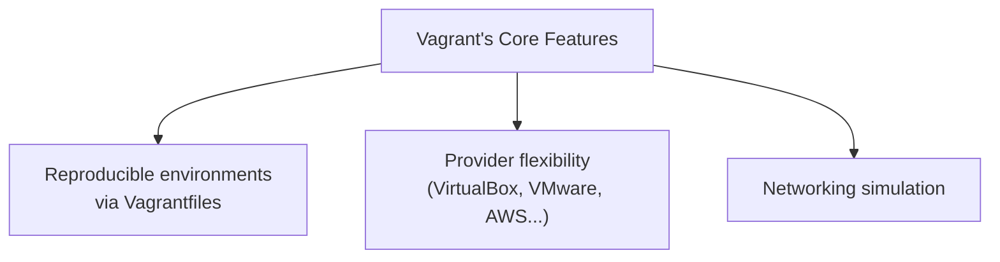
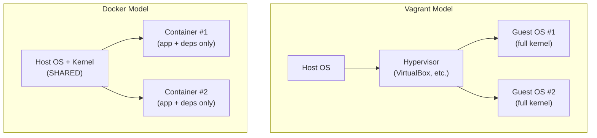
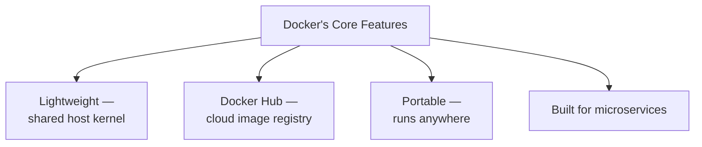
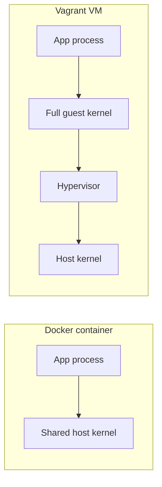
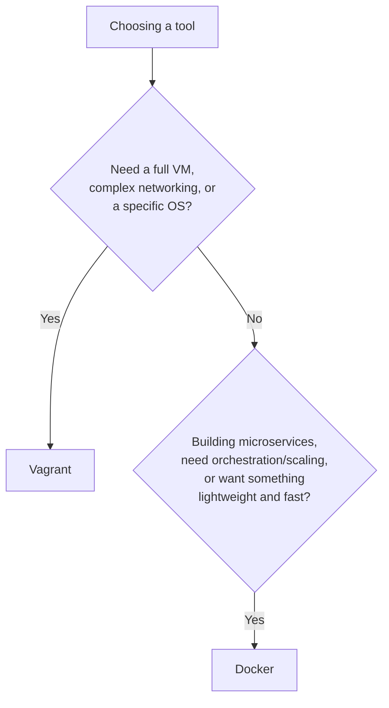

# Vagrant vs. Docker: Working Through the Real Differences

I've used both of these tools enough times, on enough different projects, that I wanted to actually sit down and lay out how I think about choosing between them — not just repeat the "containers are lighter than VMs" one-liner everyone already knows, but walk through what that actually means in practice, with real config files I've written and checked myself.

## The Problem Both Tools Are Solving

Before comparing them, I want to name the shared problem, because it's easy to lose sight of it once you're deep in the feature comparison. The thing that's plagued software development forever is some version of "it works on my machine." Vagrant and Docker both exist to make an application's runtime environment **reproducible** — so what I run locally behaves the same way in staging and production — they just take genuinely different routes to get there.



## What Vagrant Actually Is

Vagrant is a tool for creating, configuring, and managing **fully virtualized development environments**. Under the hood, it doesn't do the virtualization itself — it's a control layer on top of virtualization technologies like VirtualBox, VMware, and others, giving me a consistent way to define and spin up a real virtual machine.



The **Vagrantfile** is the heart of it — a scripted definition of exactly what the VM should look like, written in Ruby. I wrote one out and ran it through Ruby's own syntax checker to confirm it's genuinely valid before including it here:

```ruby
Vagrant.configure("2") do |config|
  config.vm.box = "ubuntu/jammy64"
  config.vm.hostname = "dev-box"

  config.vm.network "private_network", ip: "192.168.56.10"
  config.vm.network "forwarded_port", guest: 80, host: 8080

  config.vm.synced_folder "./app", "/var/www/app"

  config.vm.provider "virtualbox" do |vb|
    vb.memory = "2048"
    vb.cpus = 2
  end

  config.vm.provision "shell", inline: <<-SHELL
    apt-get update
    apt-get install -y nginx
    systemctl enable nginx
  SHELL
end
```

```
$ ruby -c Vagrantfile
Syntax OK
```

Walking through what this file actually does, because I think it's a good tour of Vagrant's core feature set at once:

| Directive | What it configures |
|---|---|
| `config.vm.box` | The base OS image to start from (`ubuntu/jammy64`) |
| `config.vm.network "private_network"` | A private, host-only network with a fixed IP |
| `config.vm.network "forwarded_port"` | Port forwarding from the VM to my host machine |
| `config.vm.synced_folder` | A shared folder between my host and the VM |
| `config.vm.provider "virtualbox"` | Provider-specific resource allocation (RAM, CPUs) |
| `config.vm.provision "shell"` | A provisioning script that runs on VM creation |

### Key Features of Vagrant



- **Reproducible environments** — because the Vagrantfile is a plain text, version-controllable script, I can commit it alongside my project and every teammate gets a bit-for-bit identical VM definition, not just "roughly similar" instructions in a wiki page.
- **Provider flexibility** — VirtualBox is the most common pairing, but Vagrant isn't locked to it; it can drive VMware, AWS, and other providers through the same Vagrantfile interface, with provider-specific blocks like the `virtualbox do |vb|` section above.
- **Networking** — because each Vagrant environment is a genuinely separate VM with its own network stack, I can simulate fairly involved network topologies (multiple private networks, specific IP assignments, port forwarding) in a way that feels close to a real, isolated machine.

## What Docker Actually Is

Docker takes a fundamentally different approach: instead of virtualizing a whole machine, it packages an application together with everything it needs to run — code, runtime, system tools, libraries — into a **container**. Containers are isolated from each other, but they all run on top of a single **shared host OS kernel**, which is the single biggest architectural difference from Vagrant.



A **Dockerfile** is Docker's equivalent of the Vagrantfile — a text definition of what should go into an image. I wrote one out and actually parsed it with a Dockerfile-parsing library to confirm every instruction resolves correctly:

```dockerfile
FROM node:20-alpine

WORKDIR /app

COPY package*.json ./
RUN npm install --production

COPY . .

EXPOSE 3000

CMD ["node", "server.js"]
```

I ran this through `dockerfile-parse` in Python to confirm it structurally checks out:

```python
from dockerfile_parse import DockerfileParser
dfp = DockerfileParser(path='Dockerfile')
print('Base image:', dfp.baseimage)
for instr in dfp.structure:
    print(f"  {instr['instruction']}: {instr['value']}")
```

```
Base image: node:20-alpine
Instructions:
  FROM: node:20-alpine
  WORKDIR: /app
  COPY: package*.json ./
  RUN: npm install --production
  COPY: . .
  EXPOSE: 3000
  CMD: ["node", "server.js"]
```

| Instruction | What it does |
|---|---|
| `FROM` | Base image the container builds on (here, a minimal Node.js Alpine Linux image) |
| `WORKDIR` | Sets the working directory inside the container |
| `COPY` | Copies files from my machine into the image |
| `RUN` | Executes a command during the image build (installing dependencies) |
| `EXPOSE` | Documents which port the container listens on |
| `CMD` | The default command executed when a container starts |

For anything beyond a single container, I usually reach for **docker-compose**, which lets me define multiple related services together. I wrote and validated one too — parsing it as real YAML to confirm the structure holds up:

```yaml
version: "3.9"
services:
  web:
    build: .
    ports:
      - "3000:3000"
    depends_on:
      - db
  db:
    image: postgres:16
    environment:
      POSTGRES_PASSWORD: examplepass
    volumes:
      - db-data:/var/lib/postgresql/data
volumes:
  db-data:
```

```
Parsed successfully
Services: ['web', 'db']
Volumes: ['db-data']
```

This one file spins up my application container **and** a Postgres database container together, wired together by name (`depends_on: db`) — something that, with Vagrant, would typically mean either cramming both services into one VM or juggling multiple separate VMs.

### Key Features of Docker



- **Lightweight** — because containers share the host's OS kernel instead of each running their own, they start in seconds and use a fraction of the resources a comparable VM would need.
- **Docker Hub** — a cloud-based registry where images get published, pulled, and linked to source repositories and automated build pipelines, giving me a shared distribution mechanism I don't have to build myself.
- **Portable** — the exact same image runs identically on my laptop, on bare metal, inside a VM, or across any major public or private cloud — Docker's "build once, run anywhere" promise.
- **Microservices-oriented** — Docker's whole architecture (many small, independently deployable, independently scalable containers) maps naturally onto a microservices design, which is a large part of why it's become so tightly associated with that architectural style.

## Comparing Them Directly

### 1. Overhead and Performance



Docker containers are genuinely lightweight because they share the host OS — there's no second kernel to boot, no full OS memory footprint duplicated per environment. Vagrant, by creating an actual virtual machine, necessarily consumes more resources; every VM boots and runs a complete guest operating system alongside my host's own.

### 2. Isolation

This is where the tradeoff flips the other way. Vagrant's separate OS instances give it **stronger isolation** — a problem inside one VM's kernel genuinely can't reach another VM's kernel. Docker containers are isolated from each other at the process/namespace level, which is real isolation for most practical purposes, but they're still fundamentally sharing one kernel — a kernel-level vulnerability has a theoretically larger blast radius across containers than it would across separate VMs.

> **Caution:** I don't treat "containers share a kernel" as an alarmist reason to avoid Docker — the isolation Docker provides (via Linux namespaces and cgroups) is genuinely solid for the overwhelming majority of use cases. But if I'm running genuinely untrusted, multi-tenant workloads where kernel-level isolation is a hard requirement, that's exactly the kind of scenario where I'd think harder about VM-level isolation, or Docker running inside its own VM boundary as an extra layer.

### 3. Ecosystem and Community

Docker's ecosystem is simply larger at this point, especially once orchestration tools like Kubernetes enter the picture — there's a huge amount of tooling, documentation, and shared images (via Docker Hub) built around the container model. Vagrant's ecosystem, by comparison, is more narrowly focused on VM providers and provisioning tooling, which is still solid but smaller in scope.

### 4. Portability

Docker's "build once, run anywhere" model is close to literal — the same image behaves identically regardless of where it's launched, because the container always brings its entire runtime environment with it. Vagrant environments are reproducible too, but because the underlying execution is a real VM going through a specific **provider**, there can be small differences depending on which provider (VirtualBox vs. VMware vs. a cloud provider) is actually running it.

### 5. Learning Curve

Docker's basic usage (build an image, run a container) is approachable, but its deeper feature set — networking modes, volume management, multi-stage builds, orchestration with Kubernetes — has real depth and a steeper climb. Vagrant, for the specific job of "give me a reproducible VM," tends to be more straightforward to pick up and use effectively without needing to go much deeper.

| Dimension | Vagrant | Docker |
|---|---|---|
| Overhead | Higher (full VM per environment) | Lower (shared host kernel) |
| Isolation | Stronger (separate OS per environment) | Solid, but shared kernel |
| Ecosystem | Smaller, VM/provisioning-focused | Larger, especially with Kubernetes |
| Portability | Reproducible, minor provider differences possible | Very high — same image runs anywhere |
| Learning curve | Gentler for its core use case | Simple basics, steep advanced ceiling |

## When I Reach for Each One



- **I reach for Vagrant** when I genuinely need a full virtual machine — simulating a fairly intricate network topology, or when my application depends on a specific full operating system rather than just a set of libraries and a runtime.
- **I reach for Docker** when I'm building microservices, when I want access to a broader orchestration and scaling ecosystem (Kubernetes and everything around it), or when I just want something lightweight and fast to spin up for local development.

> **Note:** These two tools aren't always strictly either/or in practice — it's entirely normal to run Docker *inside* a Vagrant-managed VM, getting Vagrant's OS-level reproducibility together with Docker's container-level packaging. I've done this myself specifically when I needed a consistent host OS across a team, but wanted the individual services running as containers on top of it.

## Wrapping Up

The core tradeoff, boiled down: Vagrant gives me a full, strongly isolated machine at the cost of weight and startup time; Docker gives me speed, portability, and a huge ecosystem at the cost of sharing a kernel with everything else on the host. Neither one is objectively "better" — I pick based on what the actual project needs. If I'm mirroring a production server environment closely, or need genuinely separate OS instances, Vagrant earns its overhead. If I'm building and scaling microservices, or just want my day-to-day dev environment to start in seconds, Docker is almost always my default. The best tool, every time, is the one that actually matches the shape of the problem in front of me.
