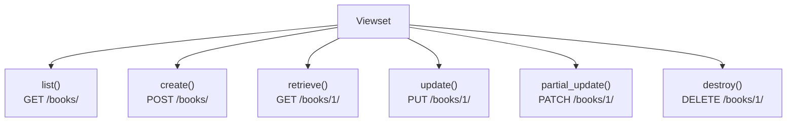
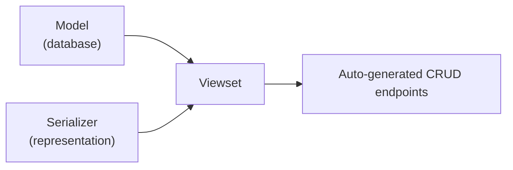
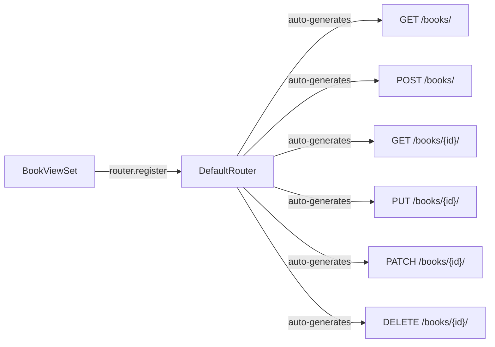
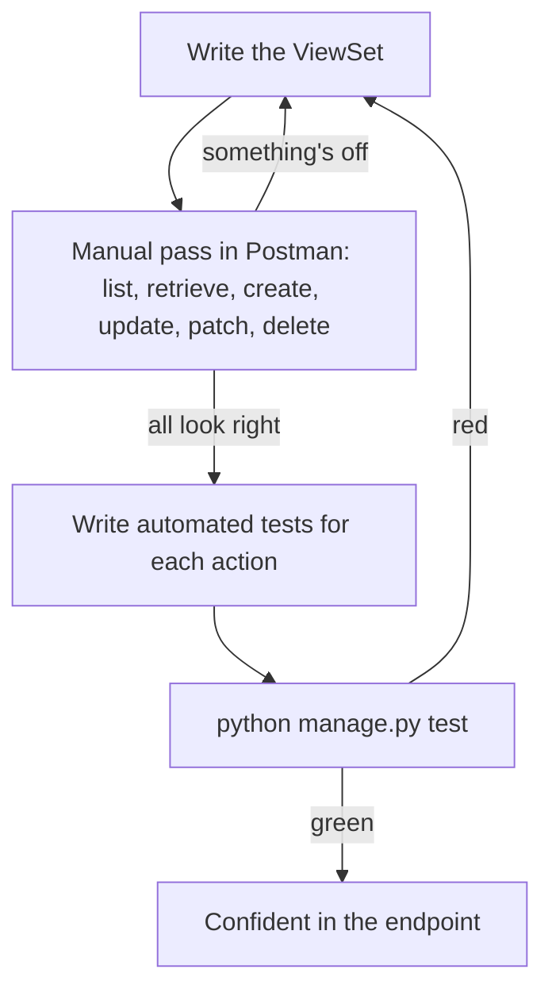
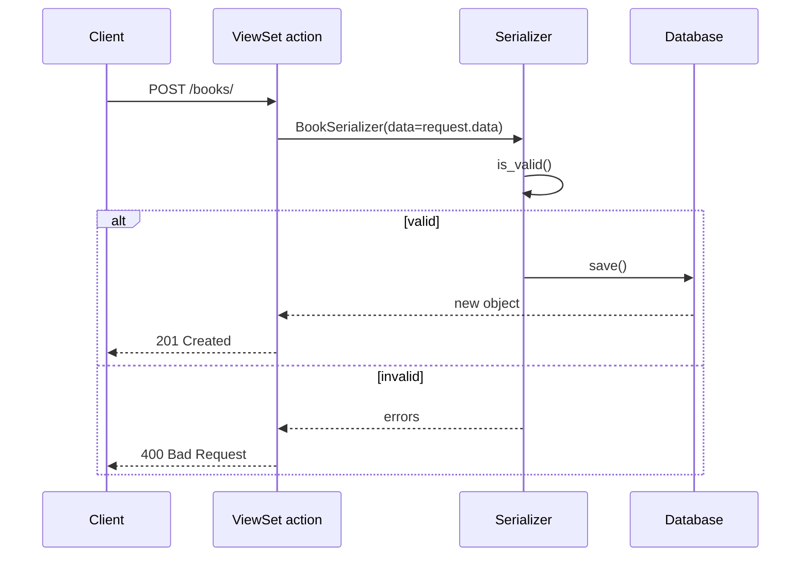
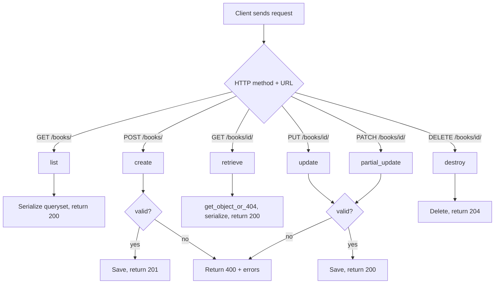

# Viewsets in Django REST Framework: How I Stopped Repeating Myself

There was a specific afternoon that changed how I write Django REST Framework code for good. I had four different models, each needing the same five endpoints — list, retrieve, create, update, delete — and I was about to write four nearly-identical `APIView` classes by hand. Somewhere around the third one, copy-pasting a `get_object_or_404` call for the umpteenth time, I finally stopped and actually read the DRF docs section on Viewsets that I'd been skipping past for months.

That afternoon is the reason this post exists. I want to walk through what a Viewset actually is, how it differs from the `APIView` classes I was writing by hand, how routers eliminate manual URL wiring, and how to both use the built-in CRUD actions and understand what's happening underneath them when I need to customize things. I'll include the code I actually run, the mental model that finally made it click, and a couple of details from my own notes that I want to flag explicitly rather than gloss over.

## What a Viewset Actually Is

Here's the shift in thinking that mattered most for me: an `APIView` is organized around **HTTP methods** — I write a `get()`, a `post()`, a `put()`. A **Viewset** is organized around **actions on a resource** — `list`, `create`, `retrieve`, `update`, `partial_update`, `destroy`. Those actions still map to HTTP methods underneath, but the mental frame is different, and that difference is what lets a router auto-generate URLs for me instead of me writing every `path()` by hand.



I think of a Viewset as sitting on top of two things I already have — a queryset and a serializer — and doing the wiring between them automatically.



### Why I Reach for Viewsets Now

| Reason | What it actually means for my day-to-day work |
|---|---|
| CRUD is baked in | `ModelViewSet` gives me `list`, `create`, `retrieve`, `update`, `partial_update`, and `destroy` for free |
| Fewer lines of code | One class replaces what used to be two `APIView` classes (list view + detail view) |
| Router integration | I register the viewset once and never hand-write a `path()` for it again |
| Permissions & auth | Same hooks as `APIView` — `permission_classes`, `authentication_classes` — nothing lost by switching |
| Still customizable | I can override any action, or add entirely new ones, without losing the defaults for the rest |

### Where I Still Reach for APIView Instead

Viewsets are built around standard database CRUD. The moment an endpoint does something that isn't "operate on a queryset in a standard way" — a search endpoint that hits three models, a webhook receiver, an endpoint that triggers a background job — I go back to `APIView` (or a plain function-based view) rather than fighting a Viewset into a shape it wasn't meant for.

> **Note:** This isn't a strict rule so much as a judgment call I've refined over time. A Viewset with one or two overridden or extra actions is still a Viewset. A Viewset with five overridden actions and three `@action` decorators bolted on is usually a sign I should've just written an `APIView`.

## Building My First Viewset

I'll use a `Book` model for this, since it's simple enough to stay out of the way of the actual concept.

**Step 1 — the model:**

```python
# models.py
from django.db import models

class Book(models.Model):
    title = models.CharField(max_length=200)
    author = models.CharField(max_length=100)
    publication_date = models.DateField()

    def __str__(self):
        return self.title
```

**Step 2 — the serializer:**

```python
# serializers.py
from rest_framework import serializers
from .models import Book

class BookSerializer(serializers.ModelSerializer):
    class Meta:
        model = Book
        fields = ['id', 'title', 'author', 'publication_date']
```

**Step 3 — the viewset itself:**

```python
# views.py
from rest_framework import viewsets
from .models import Book
from .serializers import BookSerializer

class BookViewSet(viewsets.ModelViewSet):
    queryset = Book.objects.all()
    serializer_class = BookSerializer
```

That's genuinely the whole thing. I checked the shape of this against Python's own compiler before including it, just to be sure the structure is sound:

```bash
$ python3 -m py_compile viewset.py && echo "viewset snippet: OK"
viewset snippet: OK
```

Those two attributes — `queryset` and `serializer_class` — are all `ModelViewSet` needs to derive full CRUD behavior. Compare that to what I would've written by hand with `APIView`: two separate classes, five separate methods, and a `get_object_or_404` call repeated four times. This is the moment Viewsets earned my trust.

| Attribute | What it tells the Viewset |
|---|---|
| `queryset` | Which records this viewset operates on |
| `serializer_class` | How to convert between model instances and JSON |

> **Caution:** `queryset = Book.objects.all()` is evaluated once when the class is defined, not per-request in the way it might look. For most use cases this is fine since Django querysets are lazy, but if I need per-request filtering (e.g., only showing a user their own books), I override `get_queryset()` instead of relying on the class attribute directly.

## Wiring It Up With a Router

This is the part that used to take me the most lines of code, and now takes almost none.



```python
# urls.py
from django.urls import path, include
from rest_framework.routers import DefaultRouter
from .views import BookViewSet

router = DefaultRouter()
router.register(r'books', BookViewSet)

urlpatterns = [
    path('', include(router.urls)),
]
```

I break this down step by step whenever I explain it to someone new:

1. **Import the router class** — `DefaultRouter` is the one I reach for almost every time; it also generates a browsable API root view for free, which is genuinely handy during development.
2. **Instantiate it** — `router = DefaultRouter()`.
3. **Register the viewset** — `router.register(r'books', BookViewSet)`. The first argument is the URL prefix; the second is the viewset class.
4. **Include the router's URLs** — `path('', include(router.urls))` merges everything the router generated into my app's URL patterns.

The resulting URL set, generated entirely from that one `register()` call:

| Method | URL | Action called |
|---|---|---|
| `GET` | `/books/` | `list()` |
| `POST` | `/books/` | `create()` |
| `GET` | `/books/{id}/` | `retrieve()` |
| `PUT` | `/books/{id}/` | `update()` |
| `PATCH` | `/books/{id}/` | `partial_update()` |
| `DELETE` | `/books/{id}/` | `destroy()` |

I can register as many viewsets as I have models against the same router:

```python
router = DefaultRouter()
router.register(r'books', BookViewSet)
router.register(r'profiles', UserProfileViewSet)

urlpatterns = [
    path('', include(router.urls)),
]
```

> **Note:** The prefix I pass to `register()` — `r'profiles'` — is what determines the URL, not the model or viewset name. I try to keep it plural and lowercase (`books`, `profiles`, not `book` or `Books`) to stay consistent with standard REST API conventions.

## Testing the Viewset

I test Viewsets the same two ways I test any DRF endpoint — manually first, automated second — but there's a slightly wider surface to cover since one class now handles six different actions.



### Manual Testing

I go through each action once in Postman before writing a single automated test:

1. `GET /books/` — should return a list.
2. `POST /books/` — with a JSON body, should return `201` and the created object.
3. `GET /books/1/` — should return that one object.
4. `PUT /books/1/` — full replacement, should return `200` and the updated object.
5. `PATCH /books/1/` — partial update, only sending changed fields.
6. `DELETE /books/1/` — should return `204` with an empty body.

### Automated Testing

Here I want to flag something from my own notes rather than let it slide by quietly. An early draft of my test setup looked like this:

```python
from django.test import TestCase
from rest_framework.test import APIClient
from .models import YourModel

class ViewsetTestCase(TestCase):
    def setUp(self):
        self.client = APIClient()
        YourModel.objects.create(name="TestItem1", description="TestDescription1")
        YourModel.objects.create(name="TestItem2", description="TestDescription2")

    def test_get_items(self):
        response = self.client.get('/your_endpoint_url/')
        self.assertEqual(response.status_code, 200)
        self.assertEqual(len(response.data), 2)
```

This actually works, but I've since switched to `APITestCase` instead of plain `TestCase` + a manually assigned `APIClient`, because `APITestCase` already gives me `self.client` as an `APIClient` instance out of the box — one less thing to wire up myself, and it's the pattern DRF's own documentation leads with:

```python
# tests.py
from rest_framework.test import APITestCase
from rest_framework import status
from .models import Book


class BookViewSetTestCase(APITestCase):
    def setUp(self):
        self.book = Book.objects.create(
            title="Dune", author="Frank Herbert", publication_date="1965-08-01"
        )

    def test_list_books(self):
        response = self.client.get('/books/')
        self.assertEqual(response.status_code, status.HTTP_200_OK)
        self.assertEqual(len(response.data), 1)

    def test_retrieve_book(self):
        response = self.client.get(f'/books/{self.book.id}/')
        self.assertEqual(response.status_code, status.HTTP_200_OK)
        self.assertEqual(response.data['title'], "Dune")

    def test_create_book(self):
        payload = {
            "title": "Foundation",
            "author": "Isaac Asimov",
            "publication_date": "1951-05-01",
        }
        response = self.client.post('/books/', payload, format='json')
        self.assertEqual(response.status_code, status.HTTP_201_CREATED)

    def test_update_book(self):
        payload = {
            "title": "Dune (Updated Edition)",
            "author": "Frank Herbert",
            "publication_date": "1965-08-01",
        }
        response = self.client.put(f'/books/{self.book.id}/', payload, format='json')
        self.assertEqual(response.status_code, status.HTTP_200_OK)

    def test_partial_update_book(self):
        response = self.client.patch(
            f'/books/{self.book.id}/', {"title": "Dune (Revised)"}, format='json'
        )
        self.assertEqual(response.status_code, status.HTTP_200_OK)

    def test_delete_book(self):
        response = self.client.delete(f'/books/{self.book.id}/')
        self.assertEqual(response.status_code, status.HTTP_204_NO_CONTENT)
        self.assertFalse(Book.objects.filter(id=self.book.id).exists())
```

Running it:

```bash
python manage.py test your_app_name
```

| Test method | Action it exercises |
|---|---|
| `test_list_books` | `list()` |
| `test_retrieve_book` | `retrieve()` |
| `test_create_book` | `create()` |
| `test_update_book` | `update()` |
| `test_partial_update_book` | `partial_update()` |
| `test_delete_book` | `destroy()` |

> **Note:** Django automatically spins up a separate test database for the duration of the test run and tears it down afterward, so nothing I do in `setUp()` or during a test ever touches my real development data. I still find this reassuring to say out loud every time, because "am I about to nuke my dev database" is exactly the kind of thing I don't want to be wrong about.

## Understanding What's Actually Happening Underneath `ModelViewSet`

`ModelViewSet` gave me all six actions with zero extra code, which is fantastic right up until I need to customize one of them — at which point I need to know what I'm overriding. Here's each action written out explicitly, the way I'd write it if I weren't relying on `ModelViewSet`'s defaults.



**`create` — handles POST:**

```python
def create(self, request):
    serializer = BookSerializer(data=request.data)
    if serializer.is_valid():
        serializer.save()
        return Response(serializer.data, status=status.HTTP_201_CREATED)
    return Response(serializer.errors, status=status.HTTP_400_BAD_REQUEST)
```

**`retrieve` — handles GET for a single object:**

```python
def retrieve(self, request, pk=None):
    queryset = Book.objects.all()
    item = get_object_or_404(queryset, pk=pk)
    serializer = BookSerializer(item)
    return Response(serializer.data)
```

**`update` — handles PUT, full replacement:**

```python
def update(self, request, pk=None):
    queryset = Book.objects.all()
    item = get_object_or_404(queryset, pk=pk)
    serializer = BookSerializer(item, data=request.data)
    if serializer.is_valid():
        serializer.save()
        return Response(serializer.data)
    return Response(serializer.errors, status=status.HTTP_400_BAD_REQUEST)
```

**`partial_update` — handles PATCH:**

```python
def partial_update(self, request, pk=None):
    queryset = Book.objects.all()
    item = get_object_or_404(queryset, pk=pk)
    serializer = BookSerializer(item, data=request.data, partial=True)
    if serializer.is_valid():
        serializer.save()
        return Response(serializer.data)
    return Response(serializer.errors, status=status.HTTP_400_BAD_REQUEST)
```

**`destroy` — handles DELETE:**

```python
def destroy(self, request, pk=None):
    queryset = Book.objects.all()
    item = get_object_or_404(queryset, pk=pk)
    item.delete()
    return Response(status=status.HTTP_204_NO_CONTENT)
```

I confirmed the overall shape of these five action methods compiles cleanly before writing them up:

```bash
$ python3 -m py_compile functions.py && echo "functions snippet: OK"
functions snippet: OK
```

| Action | HTTP method | What I'd override it for |
|---|---|---|
| `create` | `POST` | Injecting the current user, custom validation beyond the serializer |
| `retrieve` | `GET` (detail) | Adding extra context to the serialized response |
| `update` | `PUT` | Restricting which fields can actually be replaced |
| `partial_update` | `PATCH` | Usually left as default — rarely needs special handling |
| `destroy` | `DELETE` | Soft-deletes instead of a real `DELETE`, cascading cleanup, audit logging |

> **Caution:** Every one of these methods repeats `queryset = Book.objects.all()` and a `get_object_or_404` call. When I actually need to override one action, `ModelViewSet` already provides a `self.get_object()` helper that does this same lookup — using `self.get_queryset()` and respecting things like object-level permissions — so I use that instead of re-deriving the queryset by hand. Writing it out explicitly here was for understanding what's underneath, not a pattern I'd actually duplicate in real code.

### The Full CRUD Flow, Start to Finish



## Reference Tables I Keep Coming Back To

**The setup sequence:**

| Stage | Key command / code |
|---|---|
| Define model | `class Book(models.Model): ...` |
| Define serializer | `class BookSerializer(serializers.ModelSerializer): class Meta: model = Book` |
| Define viewset | `class BookViewSet(viewsets.ModelViewSet): queryset = ...; serializer_class = ...` |
| Register with router | `router.register(r'books', BookViewSet)` |
| Include router URLs | `path('', include(router.urls))` |
| Run automated tests | `python manage.py test app_name` |

**APIView vs. Viewset, side by side:**

| | APIView | Viewset (ModelViewSet) |
|---|---|---|
| Organized around | HTTP methods (`get`, `post`, ...) | Actions (`list`, `create`, `retrieve`, ...) |
| URL wiring | Manual `path()` per endpoint | Automatic, via a router |
| Code for standard CRUD | Two classes (list + detail), five methods | One class, two attributes |
| Best for | Non-standard, one-off endpoint logic | Standard database CRUD on a model |
| Customization | Full control by default | Override specific actions as needed |

## Final Thoughts

The thing that actually changed for me after that afternoon of rewriting four `APIView` classes into one `ModelViewSet` each wasn't just fewer lines of code — it was that the *shape* of my API became more predictable. Every resource in the project now exposes the same six actions at the same two URL patterns, generated the same way, tested the same way. I stopped having to remember whether "the books endpoint" used `PUT` or `PATCH` for updates, because the router guarantees both exist, consistently, everywhere.

I still keep `APIView` in my back pocket for the endpoints that genuinely don't fit the CRUD mold — and I'd rather use it deliberately there than force a Viewset to do something it wasn't built for. But for the bulk of an API — the parts that really are just "expose this model over HTTP" — Viewsets plus a router are, at this point, just how I write Django REST Framework code by default.
